```{r setup, include=FALSE}
knitr::opts_chunk$set(echo = TRUE)
library(knitr)
```

This document contains hints that I find helpful when using the Oxford
system with the AZtec 3.3SP1 Software.

[Back to Index](../README.html)


# Basic Info

| Info | Value |
|------|-------|
| Oxford S/N | **CZC4081PBM** |    
| System No. | **37404** |  
| MA svc phone | **(800) 447-4717** |    
| MA svc email | **ccc.oia\@oxinst.com** |
| Glenn Kinnear | 978-764-0747 |
| Glenn Kinnear | glenn.kinnear@oxinst.com |
| Current software | 3.0SP1 |
| HP PC P/N | QV993AV |
| HP PC S/N | CZC4081PBM |

## The AZtec License manager

Both AZtec and Inca have network licenses. The installer installs an **evaluation license** which expires in a few days. You have to change the licenses for **both** AZtec and Inca. The license manager looks like the image below. You need to press the text above the red button and enter the appropriate license code in the dialog box that appears. Then use a user ID (email address) and password (std) to authenticate the codes. **After** you enter the new codes and authenticate with the userid/password, *then* the **Activate** button will become active. 

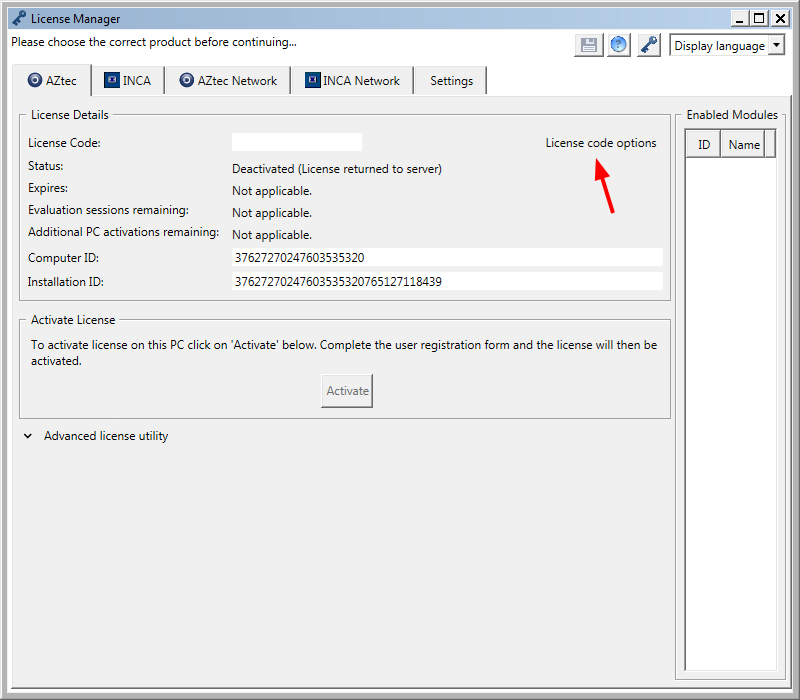


The correct codes are stored in the system folder on the **QM Share**. It took me a **long** time to figure out why everything was grayed out. A real smack my head moment...

# Useful quick tips

## Calibration

We really want to do our calibration with **Cu** for high voltage analysis and, **Mn** for low voltage. A BAM multi-element standard would likely be more helpful where there are line overlaps over a range of voltages.

I had noticed some systematic shifts in both ev/ch and zero offset values between calibrations done with the two different elements. On 2016-11-07, I did an experiment:

1. I first ran an AZtec beam calibration and beam measurements using Cu.

2. Next, I ran an AZtec beam measurement with each standard and saved the spectra. These were typically short (20-30 sec) with spot size 5 and 15 kV. So, I also collected spectra with 250 live sec. The dead time tended to be around 25-27%. I used these spectra as input to DTSA's elemental calibration routine. The ev/ch was always slightly lower with Mn - but only by around .15%. The zero offset had more significant deviation: -3.8% with 4K channels and -7.6% with 2K channels. Mn might be better for low voltage analysis. I probably will want to create DTSA-detector profiles for each combination of energy range, process time, and calib standard.

### Current detector calibration info

Output from:

```
listCalibrations(d6)

Oxford p4 05eV 2K - FWHM[Mn Kα]=130.3 eV - 2017-04-05 00:00

FWHM[Mn Kα]=129.7 eV - initial          think this was lower...
FWHM[Mn Kα]=129.8 eV - 2016-05-25 00:00 think this was lower...
FWHM[Mn Kα]=130.3 eV - 2017-02-24 12:00 done with S5 3.51 nA
FWHM[Mn Kα]=130.3 eV - 2017-04-05 00:00 done with S5 3.48 nA


listCalibrations(d7)

Oxford p4 05eV 4K - FWHM[Mn Kα]=130.3 eV - 2017-04-05 00:00
FWHM[Mn Kα]=129.6 eV - initial          think this was lower...
FWHM[Mn Kα]=130.3 eV - 2016-05-25 00:00 think this was lower...
FWHM[Mn Kα]=130.2 eV - 2017-02-24 12:00 done with S5 3.51 nA
FWHM[Mn Kα]=130.3 eV - 2017-04-05 00:00 done with S5 3.48 nA
```


## Naming standards.

```
YYYY-MM-DD-xxkV-Cu-S4-P4-5eV-2K-UHR-x.ymm
```

## User-Generated Public Templates

These are in

```
C:\Users\Public\Documents\AZtec\Report Templates
```

# Exporting maps and making montages

I like tightly-stitched maps with the ability to crop regions of interest. Here is the current procedure I use. The export of the PNG files is kludgey - I need to try to write an Auto-IT to script. This keeps the raw images in the ``$EDS_ROOT/Oxford/QM14-nn-nnA-Client/reports/qm-nnnnn-sampleID/qm-nnnnn-sampleID-nnkV-map1/tif`` tree where I cannot use version control (AZtec projects fail to open...) and the python scripts and report images in the ``$HOME/work/proj/QM14-nn-nnA-Client/`` tree where I do use version control (``git``). **Note:** the scripts below use functions from ``jmFijiGen.py`` which must be in ``$FIJI_ROOT/jars/Lib/``.

1. **Set the maps to have consistent colors**. I have some suggestions below. This is most easily accomplished from the ``Summary View``. One may export these as '.png' files but the brightness/contrast/gain mapping are done with point and click. It is better to record a lists of names, hue values, and gammas for the newer scripts. An example is shown below. **Note:** the -1 value for hue is a flag not to run the LUT change routine.

```
lName   = ["N-K","O-K","Cu-L", "P-K", "Na-K","Cl-K", "Pd-L", "Ag-L", "ROI"]
lHue    = [    0,  120,   180,   150,   210,    90,     60,     30 , -1   ]
lGamma  = [  1.0,  1.0,   1.0,   1.0,   1.0,   1.0,    1.0,    1.0 , 1.0  ]

```

2. **Record the full width of the ROI**. From the ``Interactive View``, select a map, right click and select ``Details``. Record the ``Resolution (Width)`` (px) and ``Image (width)`` (typically $\mu m$). For maps processed with the new ImageJ scripts, one wants this type of detail for the scripts

```
#        sz   w-px  um
lCal = [116., 1024, -6]
```

3. **Export images of the maps**.  Note the **Preferred way:** Export ``Data Only`` from the ``Data Tree`` as  **TIF** files. This is preferred because one gets 16 bit data and can map it with a script and it minimizes directory changes. Sometimes if you used a ROI during acquisition, the microscope image is not exactly the same size as the others. You may have to use the GUI (as shown below) for that image. In this case you will un-click the keep aspect ratio box and enter the desired values. You can also have AZtec draw the ROIs for desired extracted spectra. 

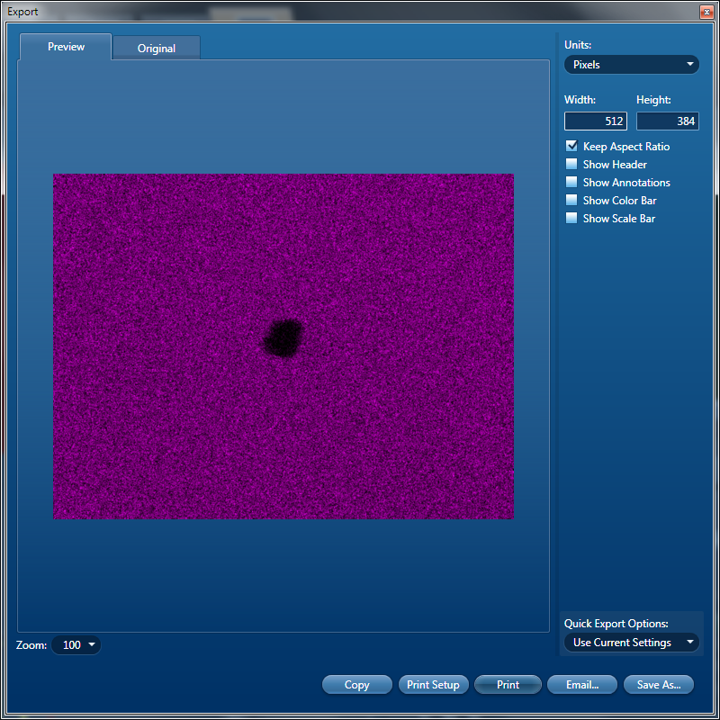

Note that following the convention for folders (``$EDS_ROOT/Oxford/QM14-nn-nnA-Client/reports/qm-nnnnn-sampleID/qm-nnnnn-sampleID-nnkV-map1/tif``) makes it a **lot** easier to configure the scripts.

After you navigate to a folder you created, save the image with a name like ``C-K.tif``, ``Ag-L.tif``, ... Repeat this for all the other maps and the final image of the ROI, like ``ROI.tif``. Note, one might want extracted spectra ROIs on the ROI image. Then you need to use the GUI as noted above.

4. **Create a folder** in ``$HOME/work/proj/QM14-nn-nnA-Client/py/Fiji`` and make a copy of the folder ``$GIT_HOME/OSImageAnalysis/ImageJ/macros/py/maps`` using the name of your map, i.e. ``qm-0nnnn-sampID-nnkV-mapN`` and rename the scripts in the folder to match the sample and the map.

6. **Edit the file paths** to point to your map in the ``$EDS_ROOT`` folder tree and to the project folder in the ``$HOME/work/proj/QM14-nn-nnA-Client/Sweave/inc/png`` tree. These have been tuned with path variables to minimize typing/editing. 

7. **Edit the configuration info from step 2.  Note:** The name list fills from left to right from the top row.


8. **Run the prep script.** Make sure you get the intensity mapping that you want and are pleased with the display. Note the ``bTstPath`` flag. If this is ``True`` it will just print the paths so you know they are right. Note the ``bSave`` flag. Set this to ``False`` to make sure you get the hue and gamma values tuned to best display the information in the map. Then set it to ``True`` to save the images. The script pauses for 2 sec per image so you can see it on the final pass.

9. **Run the montage script** This will give you a calibrated image. This has a ``bTestPaths`` that if set to ``True`` will make sure it can load the ROI image. There is a ``bScale`` flag and a ``scaFac`` variable (often set to 0.5) to let you down-sample the maps with a bi-cubic spline. This makes the montages a bit smaller and gives reasonable averaging to improve S/N. You will get a calibrated map that is saved to the report tree.

10. **Add a scale bar.** Use the ``Cookbook > Annotating Images > Add Scale Bar`` tool.

11. **Annotate the map.** Use the ``Text Tool``. Save the annotated map, ``qm-nnnnn-sampleID-nnkV-mapN-ann.png``, in the ``$HOME/work/proj/QM14-nn-nnA-Client/Sweave/inc/png`` tree. These ``.png`` files may be used with Sweave, RMarkdown, or PowerPoint for reports.

# Preferred colors for maps

It helps to have consistent colors for maps. *N.B.* there are issues with R/G colorblindness here....

<style>
table:nth-of-type(1) {
    display:table;
    width:25%;
}
table:nth-of-type(2) {
    display:table;
    width:30%;
}
</style>

| transition | deg | name             |
|------------|----:|:-----------------|
| C K        | 0   | red              |
| N K        | 210 | azure            |
| O K        | 120 | green            |
| Si K       | 330 | rose             |
| Cu L       | 180 | cyan             |
| P K        | 150 | spring green     |
| K K        | 270 | violet           |
| Pd L       |  60 | yellow           |
| Cl K       |  90 | chartreuse green |
| Pt M       |  90 | chartreuse green |
| Ag L       |  30 | orange           |
| Ga L       | 300 | magenta          |
| S  K       | 300 | magenta          |
| Na K       | 240 | blue             |

**Note** One can easily see and change values from the Summary view. We also don't often have don't often have both Ga and S or Pt and Cl

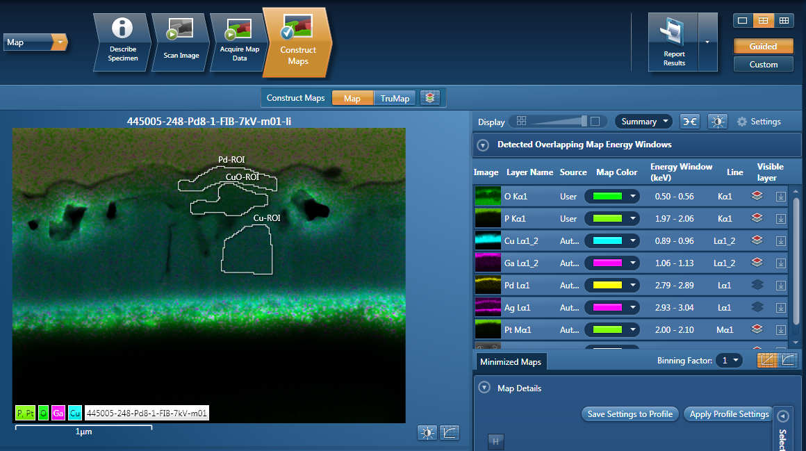


## HSV Color wheel values

See [Wikipedia](http://simple.wikipedia.org/wiki/Color_wheel)

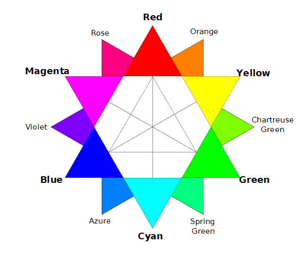

"RBG color wheel" by DanPMK.

The 12 major colors of the color wheel, at 30 degree intervals on the HSV color wheel (shown above), are the following:


|color            | degrees|
|-----------------|-------:|
|red              |    0   |
|orange           |   30   |
|yellow           |   60   |
|chartreuse green |   90   |
|green            |  120   |
|spring green     |  150   |
|cyan             |  180   |
|azure            |  210   |
|blue             |  240   |
|violet           |  270   |
|magenta          |  300   |
|rose             |  330   |


This constitutes the complete set of primary, secondary, and tertiary color names.

# Report templates

My current favorite report templates are

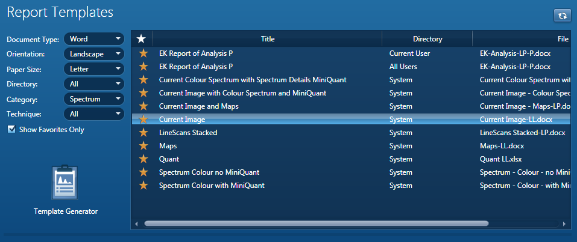

# EDS Mapping parameters


## AutoLock

My first reasonable set below...

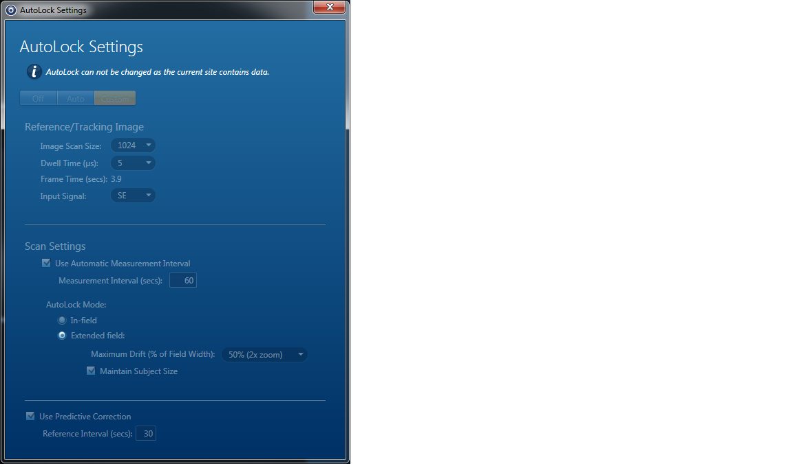

My most recent reasonable set for a high resolution map below:

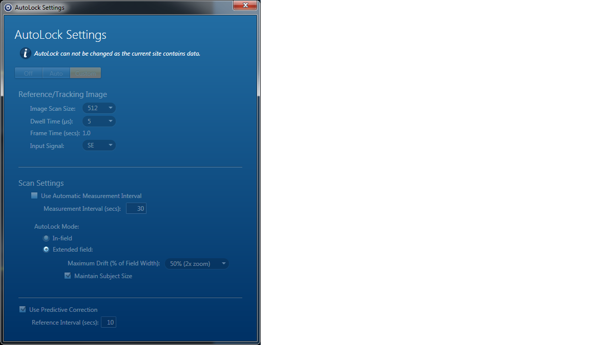

One annoying feature of Auto-Lock is that one cannot see the Auto-Lock settings on an off-line version. I tend to do a screen print of the AutoLock History in the Mini View

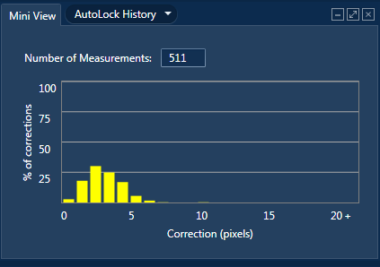

and the AutoLock Progression image. Note the substantial drift that was corrected in three and a half hours.

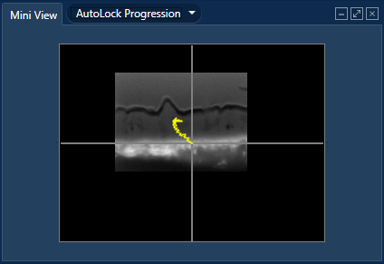

On the AZtec system one can crop these using ``Microsoft Paint`` and store them in the ``reports`` folder. Note that this specimen was mounted on a C-coated Formvar support film on a 200 mesh grid in turn mounted on a C adhesive tab. Many microscope engineers warn that drift is bad when these tabs are used.


The best discussion starts on p. 160 of the manual. It might be worth changing my tracking image to size 512 and a dwell time of 10 us. Need to see how that changes the frame time and think about a reasonable interval (they use 10 sec).

### EDS Mapping for 7 kV

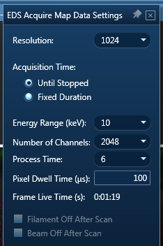

## Controlling the export of maps
1. For the map you want, right click and select ``Details``.
2. Note the ``Resolution (Width)`` (e.g. 1024 px) and the ``Image Width`` (e.g. 193 $\mu$m). You may want to note the ``Magnification`` as well...
3. Again for the map you want, right click and select ``Export >> Settings``. Leave ``Keep Aspect Ratio``checked and turn off what you don't want. Set to the resolution you want (i.e. 1024) and then press ``Save As...``

# A better proposed strategy for probe current proxy measurements

## The basic idea
 
The ``Optimize`` menu makes it easy to do a beam current measurement. It is important to configure for the correct element and process time to be relevant to our DTSA-II detectors.

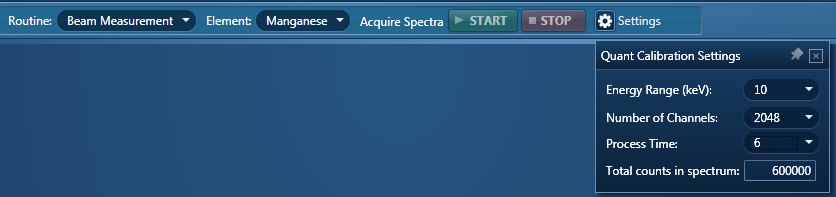

The manual (p. 86) has a discussion of the proper element to use. They like Cr because it polishes well and does not oxidize. The K line isn't sufficiently excited to use below 15 kV.  Cu grids are convenient, but seem to have the same problem if the software wants to use the K line. Silicon chips might make a good option for a wide range of voltages but would be hard to use with my Ted Pella XCS-8 standard Faraday cage.

One gets the required data from the ``Calculate Composition`` tab of ``Point & ID`` and then choosing the ``Spectrum Details`` from the ``Available Templates``:

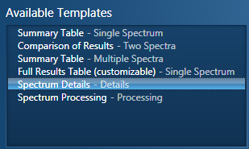

Si is a good choice for the project **2014-09-12-Cu-Si** for the data and more information. 


|e0  | mean    | std dev |
|---:|--------:|--------:|
|  5 |  1825.1 |  39.7   |
|  7 |  3895.1 |  65.1   |
| 10 |  7605.8 | 106.0   |
| 15 | 14052.0 | 170.0   |
| 20 | 20305.2 | 261.3   |
| 30 | 29843.4 | 383.9   |

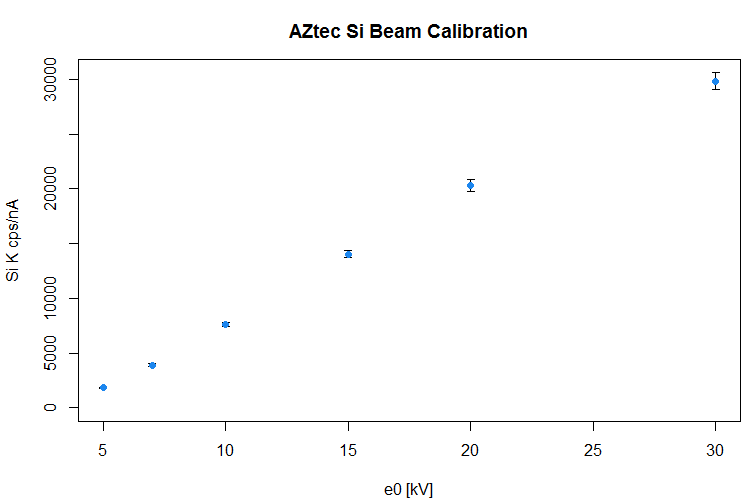

Note that I repeated this on **2016-10-05** using the AZtec **Beam Calibration**
procedure at a working distance of **4.0 mm**. The detector is more sensitive
there than at 5 mm. I made a new sample holder with a Faraday cup by having
Chuck Andre drill a hole in an Al stub to
accommodate a 150 micron Pt top hat aperture. I coated the drilled hole with C
paint and mounted the aperture with Ag paint. I added an Si chip and a piece
of C tape. Note that AZtec the beam calibration procedure works down to 5 kV.
After careful consideration, I decide the linear model was better than a fit
using a LOESS to try to force the fit through the origin. See the AZtec project 
**Beam-Meas-2016-10-15** for the data and more information.

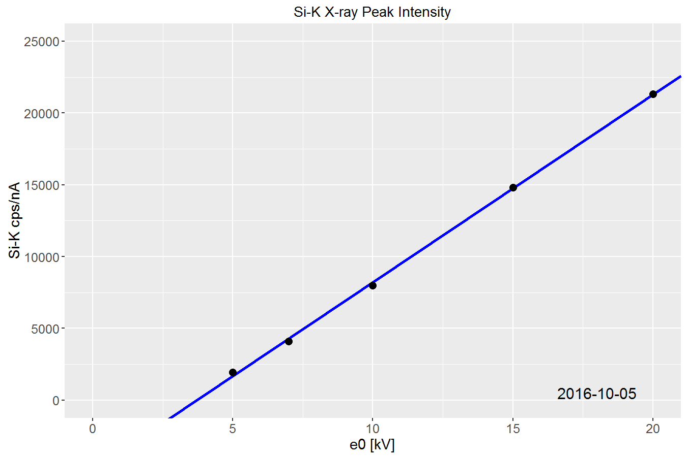

These are the parameters from the fit:


```{r, echo=FALSE}
load('dat/si.k.cps.per.na.lm.coef.RData')
kable(si.k.cps.per.na.lm.coef)
```


These are the data for Cu (100 sec) from **2016-10-05** using the AZtec **Quant**
(see below) for the data and more information.

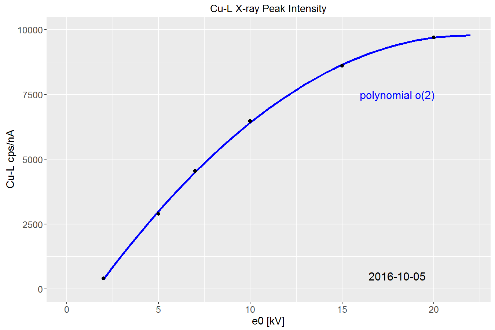

Note the **second order polynomial** These are the parameters from the fit:

```{r, echo=FALSE}
load('dat/cu.l.cps.per.na.poly.coef.RData')
kable(cu.l.cps.per.na.poly.coef)
```


Note the **Beam Calibration Information** section contains what we need:

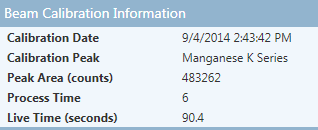

We can copy this information into a text document with a right click. However, I found that
we can also get what we want from the **Spectrum Processing** details from the **Calculate Composition** pane.

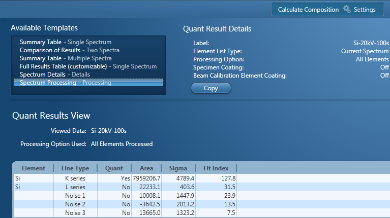

Note that this is more important for Cu, where the beam measurement routine wants to use the K line and we want the L line. Note that we also get an estimate of the uncertainty.

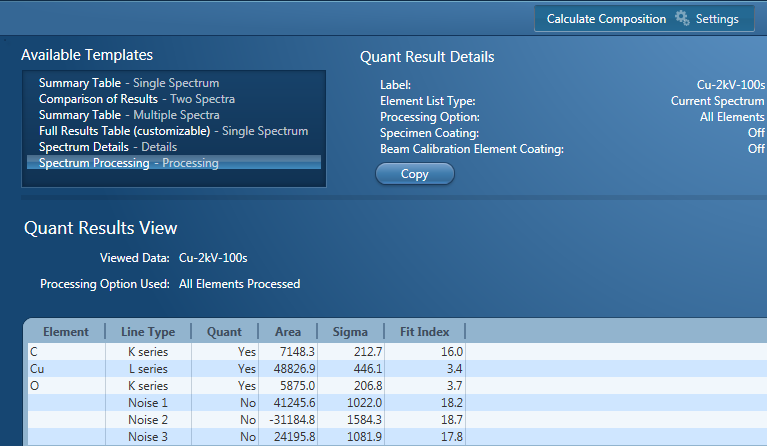


The Si peak is well-behaved with voltage. This is an analysis using DTSA-II to fit **just the characteristic peaks**. This is easily automated, given the spectra, using a Jython script.

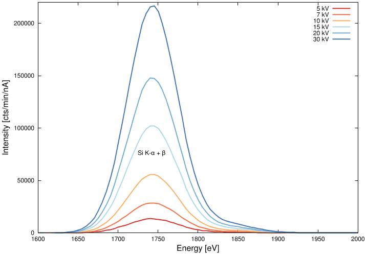

|e0  | mean    | std dev |
|---:|--------:|--------:|
|  5 |  1832.4 |  40.3   |
|  7 |  3884.2 |  65.3   |
| 10 |  7573.1 | 105.7   |
| 15 | 13921.0 | 168.2   |
| 20 | 20059.1 | 257.7   |
| 30 | 29362.6 | 377.0   |

The AZtec beam measurement routine only works successfully for Cu above 10 kV (because it always uses the K-line), though one can use DTSA-II approach. The Si spectra are cleaner and have no oxidation. The Cu data are in the project ``2014-09-12-QC``.

## Low-energy and high spatial resolution EDS mapping

A webinar (2015-06-18) by Jens Rafaelsen, an applications engineer at EDAX. He had real tech issues... Did simulations with DTSA-II and Casino. Also uses the radial distributions, also simulating probe size. This would be useful.

Test specimen - flick a lighter flint onto Si. Flint has Ce.

He thinks beam drift at. Drift was manageable. Also said let scope stabilize for an hour before drift correction.

# Quantitative EDS Analysis using AZtec software platform: Good Practices

Adapted from a PDF with a date of 2013-05-09, but the copyright on the slides is 2011.


- **Step 1: Enter Project Notes and Specimen Notes for the sample** in "Describe Specimen"
- **Step 2: Select "Ratemeter"** in the "Mini View" to verify the dead time and input count rate. 20kV and Process time 3 is recommended for unknown samples. For low kV analysis use Process Time 5. **At any given process time adjust the spot size (beam current) to yield a dead time around 45% on pure Cu (Cu tape is OK)**.
- **Step 3:Perform a Beam Measurement** in "Optimize" Calibrate step (If interested in un-normalized quant). If you require accurate un-normalized quantitative analysis results, you must perform the Beam Measurement routine. Any change in the microscope settings such as accelerating voltage or lens control will lead to the change in the beam current. Under these circumstances you must perform the Beam Measurement routine before you do accurate quantitative analysis. Note that you do not need to perform the Beam Measurement routine if you are only interested qualitative analysis or normalized quantitative analysis.
- **Step 4: Energy Calibration** For accurate identification of peaks, you need to perform the Energy Calibration. Energy Calibration measures the shift in the position of the spectral peaks and resolution of the system. As the system has very stable electronics, you may only need to calibrate the system once in several months, provided the environmental temperature of the laboratory is fairly stable. A few degrees change in the environmental temperature can cause a small shift in the position of peaks. The Energy Calibration routine is performed for representative Process times, available energy ranges and number of channels in one operation. This means if you change any of these settings soon after you perform the Energy Calibration, you will not need to re-calibrate the system.
- **Step 5: Collect a reference image** in "Scan Image" step in Point&ID. Skip if not interested in collecting an image. **Note:** To collect multiple images (SE, BSE, InLens, etc.) in a given site of interest the acquired image can be locked to prevent overwriting. Hitting the Start button after locking an acquired image adds other images to the Current Site.

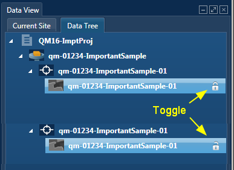

- **Step 6: Start spectral acquisition** by selecting appropriate tool (spot, rectangular region, etc.) and clicking on the region
of interest in Point & ID.
- **Step 7: Use the Fitted Spectrum tool to verify peak identification** in "Confirm elements"

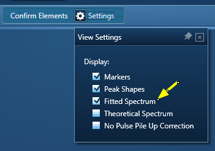

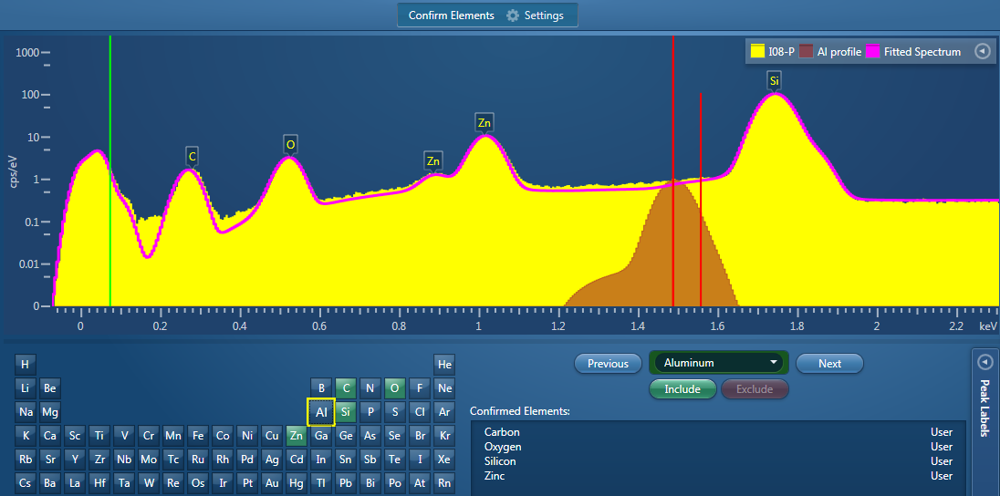

- **Step 8:** Quant in Calculate Composition step. For Quant using Standards go to Step 9. Multiple spectra can be selected from
the Data Tree by holding the "ctrl" button on the keyboard. These selected spectra can be added to the Quant Summary Table.
- **Step 9:** Acquire a spectrum from a standard as defined above. Standardize the elements of interest in "Standardize" (located in Optimize). Data from custom standards can be collected and stored as databases. Spectra can be quantified by applying standard information from these databases.
- **Step 10:** Re-quantify spectra from unknown samples using the updated standard database. Select the updated standard database and click "Requantify".


# Alchemy...

## Distorted scan

Sometimes when image collection is stopped, the scan is offset and looks odd on the microscope display. The solution is to reset the hardware. Close AZtec and run the tidy-up program to reset everything.

# Setting your own logo

The Oxford logo is in a file ``logo.png`` in ``C:\Program Files\Oxford Instruments NanoAnalysis\AZtec\Reports``. It is ``150x71`` pixels. design a replacement with the same aspect ratio and rename the old one to ``logo-old.png``


# A proposed SPI Standards Block

```
1. Faraday Cup      02750-AB      $611.80
2. Cu               AS4150-AB     $178.60
3. Pd               AS4250-AB     $178.60
4. K496 (P and O)   AS7270-AB     $357.20
5. Si               AS4060-AB     $178.60
6. Co               AS4130-AB     $178.60
7. Rb2SnCl6 (Cl)    AS8230-AB     $178.60
8. Pyrolytic C      AS4030-AB     $178.60
9. Nine Hole Mount  ASTP05009-AB $2379.75
```

# The system setup

There is a power strip mounted on the base of the Sirion on the bottom rail. It supplies power to the computer, monitor, the micsF+ box and the x-stream-2 box, as well as a 24 V laptop power supply. The laptop power supply plugs into a cable on the detector and another cable goes to the x-stream2 box.

One can shut the computer down and turn off the strip to turn everything off.

Note: one can use the tidy-up program to reset everything.

## Testing after the Steam Line break

On 2017-11-06 I arrived in the building to discover a steam line had
ruptured just inside the offices near the corridor. Building services
turned off the steam before 8 a.m. The moisture condensed on the upper
surfaces of the ceiling tiles and on the cold air ducts. Water was
dripping on the table that held the computer. It did not appear that
the detector got wet. I pulled the power to the scope, computers, and
support boxes.

After we got the mess cleaned up, we let everything dry with fans for
2 days and cleaned up the surfaces. I replaced all mice and keyboards.

I worked on the microscope PC and system the rest of that week. On
2017-11-13 I turned my attention to the Oxford System. Dave McLaughlin
suggested I open the cased on theb Compaq 8300 PC. There was no evidence
of water damage inside. I blew N~2~ into the case for 30 min. Building
services were working to replace tiles nearby so i closed everything up
and waited.


[Back to Index](../README.html)
