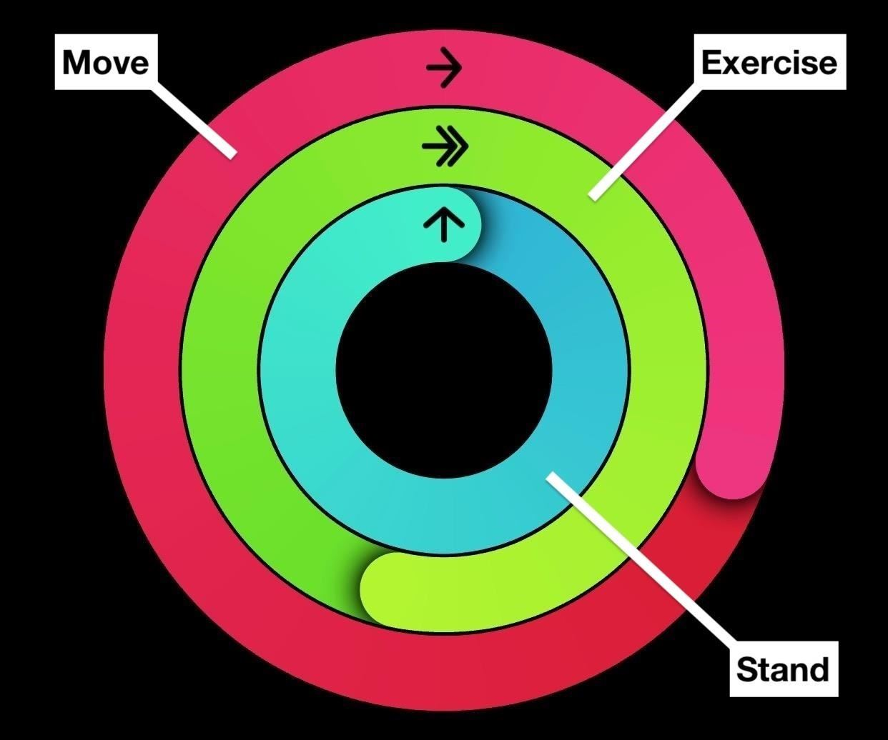

\fontsize{18}{19.2}
\fontseries{r}
\selectfont

From here: https://support.apple.com/en-us/HT207941

# Apple Watch Rings

**Three rings**: Move, Exercise, Stand.

**One goal**: Close them every day. It’s such a simple and fun way to live a healthier day that you’ll want to do it all the time.

That’s the idea behind the **Activity app** on Apple Watch.
Use the Activity app on your Apple Watch

With the Activity app on your Apple Watch, you can track how much you move, exercise, and stand from day to day. 

# Track your Activity

To get started, open the Activity app on your Apple Watch and follow the onscreen steps. Your Apple Watch lets you know when you reach your goals and it offers suggestions and encouragement to help you close your rings. Learn how to close each ring or change your goals.

# Move (red)

The Move ring shows how many active calories you've burned so far. Complete your daily Move goal by burning active calories every day. Active calories, unlike resting, are ones that you burn by standing or moving around. Get help earning Move and Exercise credit.

For users 13 years and younger, the Move ring shows how many minutes the user has spent actively moving around.

# Exercise (Green)

Calibrating your Apple Watch for improved Workout and Activity accuracy.

You can calibrate your Apple Watch to improve the accuracy of your distance, pace, and calorie measurements. Calibrating your watch can also help it learn your fitness level and stride, which improves accuracy when GPS is limited or unavailable.

# System Services screen on iPhone.

## Check your settings
To make sure that your Apple Watch can get the information it needs, check these settings on your iPhone:

1. On your iPhone, open the Settings app.
2. Tap Privacy > Location Services. 
3. Make sure that Location Services is turned on.
4. Scroll down, then tap System Services. 
5. Make sure that Motion Calibration & Distance is turned on.
6. Continue with the steps below.

# Calibrating your Apple Watch for improved Workout and Activity accuracy

You can calibrate your Apple Watch to improve the accuracy of your distance, pace, and calorie measurements. Calibrating your watch can also help it learn your fitness level and stride, which improves accuracy when GPS is limited or unavailable.

## Check your settings

To make sure that your Apple Watch can get the information it needs, check these settings on your iPhone:

1. On your iPhone, open the Settings app.
2. Tap Privacy > Location Services. 
3. Make sure that Location Services is turned on.
4. Scroll down, then tap System Services. 
5. Make sure that Motion Calibration & Distance is turned on.
6. Continue with the steps below.

# Calibrate your Apple Watch

1. While wearing your Apple Watch, go to a flat, open outdoor area that offers good GPS reception and clear skies. 

2. If you have Apple Watch Series 2 or later, you just need your Apple Watch. If you have Apple Watch Series 1 or earlier, bring your iPhone for GPS. Hold your iPhone in your hand, or wear it on an armband or waistband.

3. Open the Workout app. To start, tap Outdoor Walk or Outdoor Run. To set a goal before starting, tap the ... icon.

4. Walk or run at your normal pace for about 20 minutes.

If you don't have time to finish the workout, you can complete 20 minutes over multiple outdoor Workout sessions. If you work out at different speeds, you should also calibrate for 20 minutes at each of the speeds that you walk or run.

Whenever you walk or run outside using the above steps, your Apple Watch continues to calibrate the accelerometer by learning your stride length at different speeds. Calibration can also improve the accuracy of your calorie calculations in the Workout app, and the calorie, distance, Move, and Exercise calculations in the Activity app. 

# Improve your Workout and Activity accuracy

Your personal information, such as your height, weight, gender, and age, is one of the things your Apple Watch uses to calculate how many calories you burn and more. Learn how to update your personal information.

# Improve your Workout and Activity accuracy

Your personal information, such as your height, weight, gender, and age, is one of the things your Apple Watch uses to calculate how many calories you burn and more. Learn how to update your personal information.

Get the most accurate measurements using your Apple Watch
Your Apple Watch uses the personal information that you provide to help calculate metrics for your daily activity. You can further improve its accuracy using these tips.

Keep your personal information up to date

- Your Apple Watch uses your personal information
— such as your height, weight, gender, and age
— to calculate how many calories you burn and more. 

To update your personal information, open the Apple Watch app on your iPhone. Tap the My Watch tab, then tap Health > Health Profile. Tap Edit, then tap the item that you want to change.
Health Profile on iPhone showing Birthdate, Height, and more.
Make sure that you earn Move and Exercise credit
Every full minute of movement that equals or exceeds the intensity of a brisk walk counts toward your daily Exercise and Move goals. With Apple Watch Series 3 or later, your cardio fitness levels are used to determine what is brisk for you. For wheelchair users, this is measured in brisk pushes. Any activity below this level counts only toward your daily Move goal.

To make sure that you earn Exercise credit during walks, allow the arm with your Apple Watch to swing naturally. For example, while walking your pet, let the arm with your watch swing freely while the other holds the leash.

If you need both hands while walking, for example to push a stroller, you can still earn Exercise credit with the Workout app. Open the app on your Apple Watch and tap Outdoor Walk. The Activity app relies on arm motion and an accelerometer to track movement, but the Workout app can use the accelerometer, the heart rate sensor, and GPS.

 

# Make sure that Wrist Detection is on

If Wrist Detection is off, you won't get Stand notifications, and your Apple Watch can't track your Stand progress. Background heart rate readings (like resting and walking rates) won't be taken if Wrist Detection is off. 

To check the setting, open the Apple Watch app on your iPhone. Tap the My Watch tab, then tap Passcode. Make sure that Wrist Detection is on.

Resting and walking rates are available only on Apple Watch Series 1 or later.

Passcode settings on iPhone
Check the fit
Wearing Apple Watch with the right fit — not too tight, not too loose, and with room for your skin to breathe — keeps you comfortable and lets the sensors do their job.  

You might want to tighten your Apple Watch band for workouts, then loosen it when you’re done. In addition, the sensors will work only if you wear your Apple Watch on the top of your wrist.

Learn more about wearing your Apple Watch.

 

# Get the most accurate heart rate measurement

To get the most accurate heart rate measurement when you use Workout, make sure your Apple Watch fits snugly on top of your wrist. The heart rate sensor should stay close to your skin. Learn about the accuracy and limitations of the heart rate sensor.

If you have an Apple Watch Series 3 or later, set up Cardio Fitness Levels to measure how hard your heart is working during an outdoor walk, run, or hike in the Workout app.

If you turn on Power Saving Mode during a walking or running workout, the heart rate sensor turns off. To see if Power Saving Mode is off or on, open Settings on your Apple Watch, then tap Workout. You can also find this setting in the Apple Watch app on your iPhone. 

If you turn off Heart Rate in Privacy settings, you also won't get a heart rate measurement. To see if Heart Rate is off or on, open the Apple Watch app on your iPhone, then tap Privacy.  

# Choose the best workout

When you use the Workout app, choose the option that best matches what you’re doing. For example, if you're running on a treadmill, choose Indoor Run. If you're doing a workout that isn't listed, like strength training, choose Other.

Learn about each workout.
Indoor Run workout
Calibrate your Apple Watch
Calibrate your Apple Watch to improve the accuracy of your distance, pace, and calorie measurements. Calibrating your watch can also help it learn your fitness level and stride.

Learn how to calibrate your Apple Watch. 

 

What else affects your heart rate reading
Many factors can affect the performance of the Apple Watch heart rate sensor. Skin perfusion (or how much blood flows through your skin) is one factor. Skin perfusion varies significantly from person to person and can also be impacted by the environment. If you’re exercising in the cold, for example, the skin perfusion in your wrist might be too low for the heart rate sensor to get a reading.

Permanent or temporary changes to your skin, such as some tattoos, can also impact heart rate sensor performance. The ink, pattern, and saturation of some tattoos can block light from the sensor, making it difficult to get reliable readings.

Motion is another factor that can affect the heart rate sensor. Rhythmic movements, such as running or cycling, give better results compared to irregular movements, like tennis or boxing.

If you’re not able to get a consistent reading because of any of these factors, you can connect your Apple Watch wirelessly to external heart rate monitors such as Bluetooth chest straps. Learn how to pair Bluetooth accessories.

Heart rate is one of many factors that Apple Watch uses to measure your activity and exercise. Depending on your workout, it selects the most appropriate inputs for that activity. For example, when you’re running indoors, it also uses the accelerometer. Learn more about how your Apple Watch uses GPS and the heart rate sensor when you use the Workout app. 

Walking
Choose Indoor Walk for walking on a treadmill or for when you're walking indoors, like on an indoor track or in a mall. To improve the accuracy of pace and distance for Indoor Walk, first accumulate at least 20 minutes of outdoor walking using the Workout app to calibrate your watch. For Apple Watch Series 1 or earlier, you need to bring your iPhone along for calibration.

Choose Outdoor Walk for activities like walking on a track or in the park. Depending on your Apple Watch, you might need to bring your iPhone with you to track certain metrics:

Pace and distance: Apple Watch Series 2 or later has built-in GPS to track these metrics and provide a map of your walk in the workout summary on your iPhone. When your iPhone is with you, your watch uses the GPS from your iPhone to preserve battery. For the most accurate GPS hold your iPhone in your hand, or wear it on an armband or waistband. For Apple Watch Series 1 or earlier, bring your iPhone along for GPS. If you want to leave your iPhone behind with Apple Watch Series 1 or earlier, you can still track pace and distance for your workout using the watch's built-in accelerometer. To improve the accuracy of these metrics, first bring your iPhone along and accumulate at least 20 minutes of outdoor walking using the Workout app to calibrate your watch. 
Elevation: Apple Watch Series 3 or later has a built-in altimeter to track this metric. For Apple Watch Series 2 or earlier, bring your iPhone along to track your elevation.
Learn how to calibrate your Apple Watch.

# Running

## Choose Indoor Run for running on a treadmill or any time that you're running indoors. To improve the accuracy of pace and distance for Indoor Run, first accumulate at least 20 minutes of outdoor running using the Workout app to calibrate your watch. For Apple Watch Series 1 or earlier, you need to bring your iPhone along for calibration.

## Choose Outdoor Run for activities like running on a track, trail, or road. Depending on your Apple Watch, you might need to bring your iPhone with you to track certain metrics:

## Pace and distance

Apple Watch Series 2 or later has built-in GPS to track these metrics and provide a map of your outdoor run in the workout summary on your iPhone. When your iPhone is with you, your watch uses the GPS from your iPhone to preserve battery. For the most accurate GPS hold your iPhone in your hand, or wear it on an armband or waistband. For Apple Watch Series 1 or earlier, bring your iPhone along for GPS. If you want to leave your iPhone behind with Apple Watch Series 1 or earlier, you can still track pace and distance for your workout using the watch's built-in accelerometer. To improve the accuracy of these metrics, first bring your iPhone along and accumulate at least 20 minutes of outdoor running using the Workout app to calibrate your watch.

## Elevation:

Apple Watch Series 3 or later has a built-in altimeter to track this metric. For Apple Watch Series 2 or earlier, bring your iPhone along to track your elevation. 
With Apple Watch, you can choose how to prepare for a long-distance run, like a marathon. Check out your options below:

1. Power Saving Mode disables the Always On display, the heart rate sensor and cellular data during walking and running workouts. When the heart rate sensor is off, calorie burn calculations might not be as accurate. For longer workouts, you can choose to use a Bluetooth chest strap instead of the built-in heart rate sensor. Here's how to turn on Power Saving Mode, and here's how to connect Bluetooth accessories to your Apple Watch. 

2. You can sync music and podcasts directly to your Apple Watch ahead of time, so you can enjoy your content even when you're out of range of your iPhone. Learn how to sync content to your Apple Watch.

3. Bring your iPhone with you. If you bring your iPhone with you, your watch can use Bluetooth for battery-intensive functions like connectivity, streaming music or podcasts, accessing Siri, and more.

4. If your long-distance run is later in the day, you can preserve battery life by turning off cellular and the Always On display in the hours before your run. Here’s how to turn cellular on or off and how to manage Always On settings.
Learn more about battery performance. 

# About Bluetooth, Wi-Fi, and cellular on your Apple Watch

Learn about Bluetooth and Wi-Fi for your Apple Watch and how your watch uses both. And learn how cellular on GPS + Cellular models fits in.

1. To enjoy every feature on your Apple Watch, you need to turn on Wi-Fi and Bluetooth on your paired iPhone. Open Control Center on your iPhone, then make sure Wi-Fi  and Bluetooth  are on.

2. Your Apple Watch uses Wi-Fi and Bluetooth to communicate with your paired iPhone. If you have cellular, your watch can also stay connected through a cellular network. Your watch switches between these intelligently to choose the most power-efficient connection. Here's how:

3. Your Apple Watch uses Bluetooth when your iPhone is near, which conserves power. 

If Bluetooth isn’t available, your Apple Watch will try to use Wi-Fi. For example, if compatible Wi-Fi is available and your iPhone isn't in Bluetooth range, your Apple Watch uses Wi-Fi.
If Bluetooth and Wi-Fi aren't available, and you set up a cellular plan, cellular models of Apple Watch can connect to cellular networks. 
 

4. Connect to a compatible Wi-Fi network

Your Apple Watch can connect to a Wi-Fi network: 

If your iPhone, while connected to your watch with Bluetooth, has connected to the network before.

If the Wi-Fi network is 802.11b/g/n 2.4GHz.

For example, your Apple Watch won't connect to 5GHz Wi-Fi or public networks that require logins, subscriptions, or profiles. When your Apple Watch connects to a compatible Wi-Fi network instead of your iPhone connection, the Wi-Fi icon  appears in Control Center.

## Choose a Wi-Fi network

With watchOS 5 or later, you can choose which Wi-Fi network your Apple Watch connects to.

## How to turn Wi-Fi off or on

1. Touch and hold the bottom of the screen.

2. Wait for Control Center to show, then swipe up.

3. Tap the Wi-Fi icon. The icon will dim and your device will disconnect from any network that you're connected to.

Only Apple Watch GPS + Cellular models can disconnect from Wi-Fi networks. After you disconnect, your Apple Watch won't automatically re-join the Wi-Fi network that you disconnected from until:

- You turn on Wi-Fi in Control Center.
- You walk or drive to a new location. 
- It's 5:00 a.m. local time.
- You restart your device.
 

# Use a cellular network

Apple Watch GPS + Cellular models can connect to cellular. With a cellular connection, you can make calls and use data or apps when you don’t have your iPhone or Wi-Fi. Learn how to add your Apple Watch to your cellular plan.

# How to check your signal strength

- Touch and hold the bottom of the screen.
- Wait for Control Center to show, then swipe up.
- Check the Cellular button .
- Control Center on Apple Watch showing 4 green dots.

**The Cellular button**  turns green when you have a connection. The green dots show the signal strength. 

**Control Center** on Apple Watch showing that you're connected to Wi-Fi.

**The Cellular button ** turns white when your cellular plan is active, but your Apple Watch is connected to your iPhone or Wi-Fi.

# Turn cellular on or off

1. Touch and hold the bottom of the screen.
2. Wait for Control Center to show, then swipe up.
3. Tap the Cellular button , then turn off Cellular.
4. Some apps might not update without a connection to your iPhone.

 

# Check the connection between your iPhone and Apple Watch

**Check your watch face**. If you see the red Disconnected icon the red Disconnected icon or the red X icon  on the watch face, you don't have a connection.

**Check Control Center**.

- Touch and hold the bottom of the screen, wait for Control Center to show, then swipe up.

- If you see the red Disconnected icon the red Disconnected icon or the red X icon , you don't have a connection.

- Tap the iPhone icon  in Control Center. If your devices are connected, your iPhone should make a "ping" sound.

# Privacy settings on iPhone

## Reset your calibration data

Here's how to reset your calibration data:

1. On your iPhone, open the Apple Watch app.

2. Tap the My Watch tab, then tap Privacy > Reset Fitness Calibration Data. 

