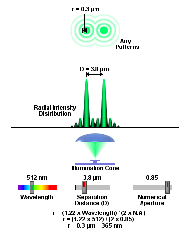

```{r setup, cache = F, echo = F, message = F, warning = F, tidy = F}
# make this an external chunk that can be included in any file
library(knitr)
options(width = 72)
opts_chunk$set(message = F, error = F, warning = F, comment = NA, fig.align = 'center', dpi = 100, tidy = F, cache.path = '.cache/', fig.path = 'figure/')

options(xtable.type = 'html')
knit_hooks$set(inline = function(x) {
  if(is.numeric(x)) {
    round(x, getOption('digits'))
  } else {
    paste(as.character(x), collapse = ', ')
  }
})
knit_hooks$set(plot = knitr:::hook_plot_html)
```


[Back to Index](../README.html)

According to the work of Airy, the diffraction limit
for an optical system is given by

$$R = \frac{1.22 \times \lambda}{2 \times NA} $$

where $R$ is the diffraction-limited resolution,
typically expressed in nm, $\lambda$ is the wavelength,
e.g. 450 nm for green light, and $NA$ is the numerical
aperture of the lens. The higher the $NA$, the larger
the collection angle and the more high-spatial frequency
information included in the image. Here we compute the
diffraction limit for three optical systems of interest.

```{r}
wavelength <- 450 # green light, nm
system <- c("vision", "BX-61", "BX-60")
obj <- c("5X LWD", "50X dry", "100X oil")
num.ap <- c(0.05, 0.85, 1.35)
diff.lim <- 0.5 * 1.22 * wavelength / num.ap
# result in microns
diff.lim <- round(diff.lim/1000, 2)

df <- data.frame("system"=system, "objective"=obj,
                 "NA"=num.ap, "diffraction limit"=diff.lim)
df
```

Note that the [FSU Molecular Expressions]
(http://micro.magnet.fsu.edu/primer/java/imageformation/rayleighdisks/)
site has a nice java simulation. The range of NA is limited. A
screen shot for the simulation for our BX-61 50X/0.85NA objective
is shown below.



[Back to Index](../README.html)


