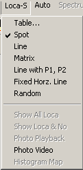
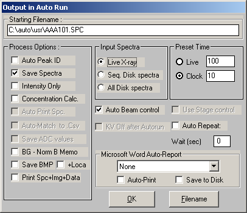

```{r setup, cache = F, echo = F, message = F, warning = F, tidy = F}
# make this an external chunk that can be included in any file
library(knitr)
options(width = 72)
opts_chunk$set(message = F, error = F, warning = F, comment = NA, fig.align = 'center', dpi = 100, tidy = F, cache.path = '.cache/', fig.path = 'figure/')

options(xtable.type = 'html')
knit_hooks$set(inline = function(x) {
  if(is.numeric(x)) {
    round(x, getOption('digits'))
  } else {
    paste(as.character(x), collapse = ', ')
  }
})
knit_hooks$set(plot = knitr:::hook_plot_html)
```


[Back to Index](../README.html)

## Key info
- ***EDAM Shell password:*** EDAM3PCI
- ***CM20UT system ID:*** HX-0412 (STEM 200kV: Field width is 194 mm)
- ***FIB620 system ID:*** HX-0382 detector from Phoenix HX-0183

### Perform a Multi-point Automated Beam Analysis

1. Double click on the SEM / TEM Multi-point Analysis icon, setup your sample in the microscope and collect an Image via the Image-Collect menu item or the toolbar .  Set the scanning mode ( Scan-F ) to spot mode, Scan-S. Then clear the EDX spectrum and position the red crosshair on a feature of the image and click on the Start button to start the spectrum analysis. Identify the peaks in the spectrum by using the Peak ID function. It is very important to identify all the elements that you may expect for the automated analysis.

2. Once the, image is acquired, select spot, line or matrix type from Location menu. Click on the EDAX image area to select the spot, line or matrix locations    
   
desired for analysis, then click on the  toolbar button to save each location.

3. Click on Table under the Location menu. The location table will display all selected X, Y coordinate data. At this point you can edit the number of points for the line (No-X) or matrix (No-X and No-Y).

4. To change location data to a new value click on the desired cell, type in the new value, and press the enter key or the C button (Change) will update the new value in that cell. After selecting all the analysis locations, click on Loca and Show Loca & No, to view all the analysis locations you'
ve defined on the image.

5. Select live time preset under the Setup, Preset & Mem..., say 20 seconds, for analysis.

6. Select Setup, Auto Output:   
 Choose Live X-ray, Save spectra, and Concentrations Calc. Input the desired filename for the spectra e.g. ``GABI001``, you may need to use the File button to specify this. Note that we are limited by the MS-DOS "8.3" name/extension convention - and the last three characters in the name need to be ``001``. Click on OK.

7. Click on Auto, and View Parameters, take note that the estimated runtime in the automation section has a time specified, otherwise it will display N/A or 0.0 for the Est.Time, and the autorun will not execute.

8. Clicking on the Auto menu item, and Start Auto begins the Automated run. ( This is all that needs to be done to start the auto run !!!). If enabled an audible tone will be generated at the conclusion of the Autorun, to inform you that the analysis has completed.

9. At the conclusion of the analysis you can view the summary data generated by clicking on Auto and Summary, and selecting the newly collected filename [ *.SMY ]. The results table will be read in and displayed. You can use the Copy function to export the data to the Clipboard and then to paste it into Microsoft Excel. 

To view the quantitative results graphically in SEM / TEM Multi-point Analysis, click on "Graph" from the results summary dialog.


### Setting up a line profile in MultiPoint

#### Setting a P1-P2 Line
- ***First*** click on any other method in the menu to reset the choice. Failure to do this causes a lot of annoyance...
- Click on the P1-P1 Line menu.
- Click on the P1 point in the image.
- Click on the S in the tool bar area to save the P1 point to the location table.
- Click on the P2 point in the image.
- Click on the S in the toolbar area to save the P2 point.
- Open the location table and verify the endpoints. Change the number of steps from 10 if desired.
- Verify by having it draw all loctions on the image.

## Fixes for annoying issues

### Menu bar issues on WinXP
Applications menu bar is partially obscured by the Genesis multi-tab
window. Note : On Windows XP this may not be a problem because of the
larger Title bar.

***To Resolve this:***
- Right click on the Windows desktop - Properties, Appearance,
- Select from the Item Drop Down list "Menu". 
- To the right of this dropdown there is a numerical up/down selection for the menu bars height.  If this set to 18, try around 29 for Small Font Mode and click on Apply.  Start the Genesis software by double clicking on the Genesis icon in the EDAX Genesis folder, or in the Windows explorer on the file "c:\edax32\genesis\GenTabs.exe", and you should see that the Genesis Spectrum software menu bar is not obscured by the EDAX tabbed window.

[Back to Index](../README.html)
