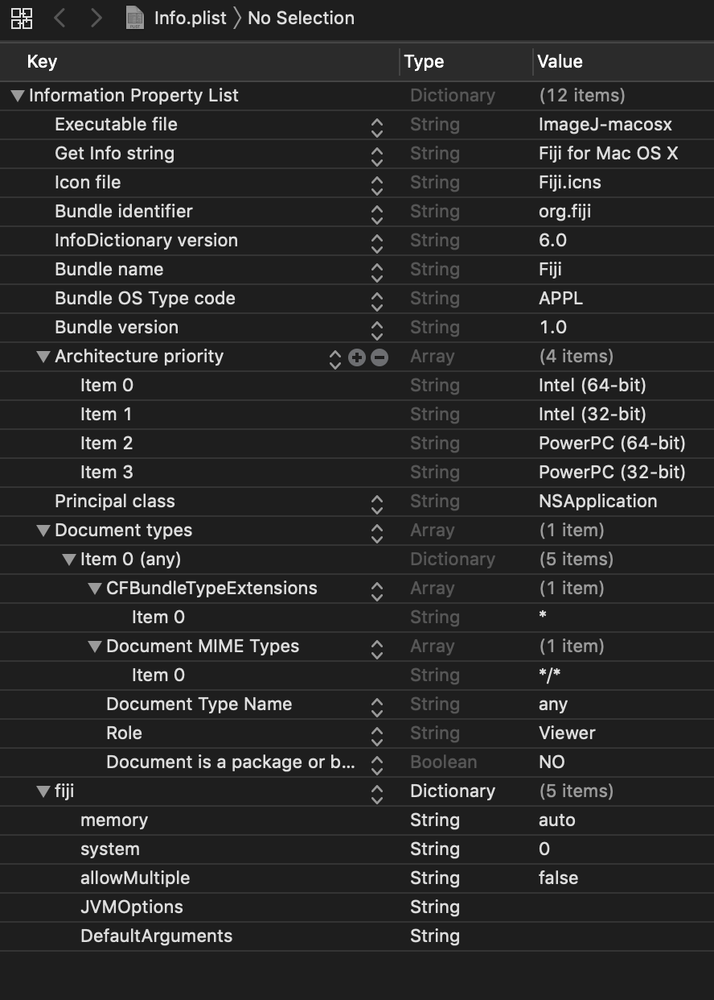
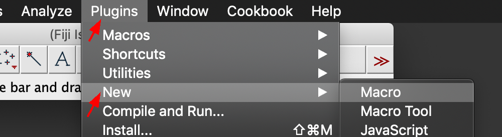
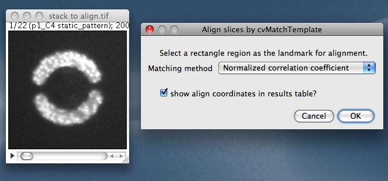
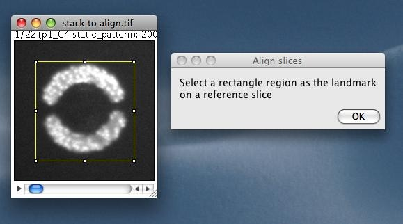
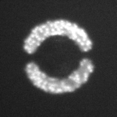
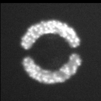
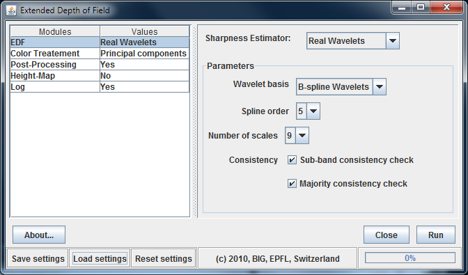
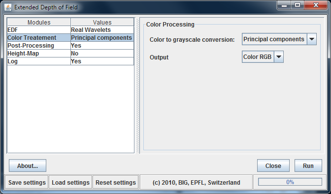
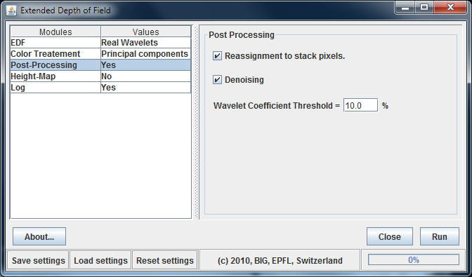

[Back to Index](../README.html)

I have collected these tips both from experience and from a very helpful user community.

# Quick tips

## A fix for Fiji startup problems on MacOS Mojave

I'm not having problems at the moment, but users with new installs are.

[Stefan Muenkner](mailto::stefan.muenkner@uni-saarland.de) wrote on
the ImageJ mailing list (2019-04-24):

>  I stumbled about the same problem. Using a terminal I could manually
> start Fiji by using:
> 
>    ```
>    /Applications/Fiji.app/Contents/MacOS/ImageJ-macosx
>    ```
>
> it complained about a Version 1.8 Java not being available but it started
> anyway. Out of curiosity I started:
>
>    ```
>    /Applications/Fiji.app/Contents/MacOS/ImageJ-tiger
>    ```
> 
> which fired the above error message about a Java6 needing to be installed.
> 
> Looking into `Info.plist` I found that the first key `CFBundleExecutable`
> was set to `ImageJ-tiger`
>
>    ```
>    <key>CFBundleExecutable</key>
>    <string>ImageJ-tiger</string>
>    ```
>
> Using the good old `vi` **[JRM note: use `subl`]**, I changed ImageJ-tiger
> to ImageJ-macosx in `Info.plist` and - after moving the `Fiji App` once
> out of `Applications` and back in - Fiji started. This might be a workaround
> for Mojave...

Note: My info.plist is different:



## Tutorials

See these ImageJ tutorials that use an ipython notebook. Clone
[this](https://github.com/imagej/tutorials) github repository
and follow the instructions.

To activate this environment, use

    ```
    conda activate scijava
    ```
    
To deactivate an active environment, use
    ```
    conda deactivate
    ```


## Start a new macro/script

The tool bar has changed (2019-03-24). This had me searching...



## Fonts too small

Wayne Rasband wrote (2019-01-16):

> Set "GUI scale" to 1.5 or higher in the Edit>Options>Appearance dialog in the ImageJ 1.52k30 daily build, restart ImageJ, and the "ImageJ" window will double in size. Set "GUI scale" to 2.5 and it will triple in size. On Linux, the font size of the menu bar and menus also double or triple on size. Weirdly, on Windows 10, the menu bar font size does not change. "GUI scale" replaces the "Text scale" option that was in previous 1.52k daily builds.

Curtis Rueden wrote (2019-01-16):

> The following JavaScript code will resize the main window directly:
>
>  importClass(Packages.ij.IJ)    
>  importClass(Packages.java.awt.Dimension)    
>  IJ.getInstance().setSize(new Dimension(850, 350))
> 
> You can run it with Plugins > New > Javascript, or the Script Editor, or Script Interpreter, or whatever code execution method you like.


## Image Processing Resources

- Image processing with machine learning resources by [Emmanuelle Gouillart 2019-01-06](https://twitter.com/EGouillart/status/1082030252900143104)

## Menu bar positions

These are in `IJ_Prefs.txt`.

### Mac

Use:

```
ij.x=86
ij.y=23

.actionbarIMCF\ toolbar.xloc=660
.actionbarIMCF\ toolbar.yloc=23
```


## Fix an error

In a discussion [here](http://forum.imagej.net/t/script-editor-error-when-working-with-python-scripts/5893/4)
Curtis Reuden proposed a workaround for this annoying error:

> `console:` Failed to install `''`: java.nio.charset.`UnsupportedCharsetException`: cp0.

This seems to be caused by moving to Jython 2.7.1. A work-around is to add

```
 -Dpython.console.encoding=UTF-8
```

to the startup.

On my windows box, my startup alias uses this string:

```
C:\Apps\Fiji.app.win64\ImageJ-win64.exe -Dpython.cachedir.skip=false -Dpython.console.encoding=UTF-8  --
```

and is set to start in

```
%IMG_ROOT%
```


## IJ_prefs.txt location

**MacOSX**: /Users/jrminter/Library/Preferences/IJ_Prefs.txt \
**Windows**: C:/Users/jrminter/.imagej/IJ_Prefs.txt

Note: I wrote a Python script (`getPrefsDirImageJ.py`) that will find
the the directory that contains `IJ_Prefs.txt`. It is in the
**OSImageAnalysis** github repository
[here](https://github.com/jrminter/OSImageAnalysis/tree/master/ImageJ/macros/py).


## Check the open image header for metadata

```
print(getMetadata("Info"));
```


# Mailing Lists

## ImageJ-devel

Send a message to ``imagej-devel@imagej.net``

## ImageJ

send message to ``imagej@list.nih.gov``

# The script editor

## Changing tabs

From Curtis Rueden 2017-01-25

> If you use ImageJ2's Script Editor [1], you can adjust the tab size in the
Edit > Tab sizes menu.

> [1] https://imagej.net/Script_Editor

# Useful keyboard shortcuts

`[` - Start the script editor. 

`Ctl-b` - burns into overlay something drawn

`Ctl-B` - open blobs sample image

`Ctl-l` - Bring up a search dialog to match commands to classes

`Clt-m` - measure a line or selected feature

`Ctl-t` - add a selection to the ROI manager

`Ctl-Enter` - Bring the main window to the front

See the full list [here](http://rsb.info.nih.gov/ij/docs/shortcuts.html)

# Stitching images using MosaicJ

The ``MosaicJ``plug-in for Fiji/ImageJ is a useful free alternative to the ``Multiple Image Alignment`` (MIA) module of analySIS Five. It does not have the nice initial rough alignment step using cross correlation, but gets the job done.

Here is a reasonable workflow.

1. **Pre-processing:** Open the individual images in Fiji and manually crop away most of the overlap legions. This will make your life a **lot** easier. Save these in a folder named ``prep``. 
2. **Start MosaicJ:** Open the plug-in from the ``Plugins > Stitching`` menu.
3. **Load your images:** From the MosaicJ file menu choose ``Load Image sequence`` and select the first image in your ``prep`` folder. This will load the images into MosaicJ's bottom panel.
4. **Rough placement:** Click each image in the bottom panel. It will place each image into the top panel. Use the mouse to roughly move each image into the position it should have in the array.
5. **Fine placement:** use the mouse to better align the tiles. The ``Scale > Magnifiy`` menu item will zoom. Note that ``Ctrl +`` (using the plus on the numeric keypad) shortcut zooms; ``Ctrl -`` shrinks. Do your best to move the images so the features overlap.
6. **Create the montage:** Use ``File > Create Mosaic`` to generate the montage image. Save it as a tif in the parent folder of your ``prep`` folder. You can then crop, correct aspect ratio, adjust the LUT as needed and burn a scale bar.

# Stack Alignment using the TemplateMatching Plug-in

From
[Qingzong (Zong) Tseng](https://sites.google.com/site/qingzongtseng/template-matching-ij-plugin/tuto2)

Download the plug-in from [here](https://sites.google.com/site/qingzongtseng/template-matching-ij-plugin#downloads).

1. Open the stack called "stack to align.tif" (download it [here](https://sites.google.com/site/fileqzt/file/Template_Matching_sample.zip?attredirects=0) ). You can see that it composed of several images of similar patterns but not well aligned.

2. Run ``Plugins > Template Matching > Align`` slices in stack...



3. Click ``OK``, then a dialog will appear to ask you to select a square ROI region as the landmark for aligning



4. After making a square ROI on the image stack, click on ``OK``.

5. All the slices in the stack will be aligned, and the displacements for each slice are printed out in both log window and results table. 

<figure>
  
  
<figcaption>**Left:** Before alignment. **Right:** After alignment.</figcaption>
</figure>


# Annotating images
From [wiki.imagej.net](http://wiki.imagej.net/Annotating_Images#Issues_with_adding_text)

Images can be annotated using the annotation tool. Double-click to get a configuration image. Adding text to a stack is a slightly different process. You can draw a text box by following the same steps, but on a stack, keyboard shortcut ``Ctrl+B`` will overlay the text on the current slice, while shortcut ``Ctrl+D`` will draw the text on every slice of the stack. These get written into an overlay.

The ``Cookbook > Annotating images > Add Scale bar`` choice from the menu opens a configurable dialog. One needs to set the scale from ``Analyze > Set Scale`` first.

There is a useful tutorial attributed to [Chris Ambrose](http://www.allandebono.org/show/protocols/imagejoverlays/)


# 16bit images

[Michael Schmid](http://imagej.1557.x6.nabble.com/Use-of-LUTS-give-different-results-td5010726.html) provides some interesting tips regarding LUTs for 16 bit images where there is a limited range of information. He notes:

> If you have 16-bit data and a LUT, it depends on the min & max of the display range of the pixels how it appears on the screen. By default, the display range is the full 16-bit range, 0-65535 

> See ``ImageProcessor.setMinAndMax(double min, double max)`` 

> In your case, with values between 15000 and 24000, just use 

```
ip.setMinAndMax(15000, 24000);
```
# Explicitly setting the standard grayscale LUT
[Michael Schmid](http://imagej.1557.x6.nabble.com/Problem-saving-PNG-files-in-particular-order-td5011977.html#a5012010) notes that one can explicitly set the standard grayscale LUT with the following snippet

```
 ip.setColorModel(ip.getDefaultColorModel()) 
```

# The Action Bar plug-in

Check out the [Action Bar](http://imagejdocu.tudor.lu/doku.php?id=plugin:utilities:action_bar:start) plug-in...

# Sources of plugins

## Stowers

[Stowers Research Institute](http://research.stowers.org/imagejplugins/)

Note: This adds a lot to the IJ prefs file. Entries like

```
.recent.command1=register jay readers jru v1
```

Reinstall if needed...


## Plugin performance

Java seems most efficient... Apparently written in 2005, [Hartenstein](https://www.mcdb.ucla.edu/Research/Hartenstein/software/imagej/other_plugins.html), of UCLA, cites these performance comparisons from a series of  ``Add Noise`` plug-ins by Albert Cardona performing operations on a 600x900 px image. I have archived copies of these in ``$GIT_HOME//OSImageAnalysis/ImageJ/Cardona-Language-Benchmarks``.

1. [Add_Noise.java](https://www.mcdb.ucla.edu/Research/Hartenstein/software/imagej/Add_Noise.java) 1-2 sec.
2. [Add_Noise.txt](https://www.mcdb.ucla.edu/Research/Hartenstein/software/imagej/Add_Noise.txt) 12 sec
3. [Add_Noise_1.py](https://www.mcdb.ucla.edu/Research/Hartenstein/software/imagej/Add_Noise_1.py) 15 sec (pythonesque version using java.util.Random)
4. [Add_Noise.py](https://www.mcdb.ucla.edu/Research/Hartenstein/software/imagej/Add_Noise.py) 44 sec (macro-like version, but using python's random.randint() function)

All this plugin/macro/script does is to duplicate the current image, get one pixel at a time and add random noise to it.
The ImageJ builtin macro language is certainly more specific to ImageJ and thus goes through less clutter than the more general jython interpreter. Still a 4x in execution time is quite astonishing. Luckily enough the biggest different is made when using the java.util.Random class instead of python's 'random' module.
Note that the complexity of the 3 files is quite similar, both in terms of length and in assumptions about the system. Thus the coder needs to learn several conventions before writing any of the 3 versions of this program. Stay with Java plugins if speed matters to your program!
Jython though really pays off when properly optimized, and it's particularly useful to make GUIs in no time.


# Reproducible Jython Scripting

For a couple of years I have been trying to follow the ``DRY`` process (Don't Repeat Yourself) for more reproducible Jython scripting with DTSA. Recently I have been migrating my ImageJ scripts to Jython to use with Fiji. I just learned how import user functions...

1. Create a folder ``Lib`` in FIJI_ROOT/jars/
2. Create your user module. My first one is ``jmFijiGen.py`` and place it in your new ``Lib`` folder. One of the first functions is ``ensureDir``.
3. Use the following to use ``utf-8``.

```
from org.python.core import codecs
codecs.setDefaultEncoding('utf-8')
```
4. To use ``ensureDir`` in your Jython scripts, include

```
import jmFijiGen as jmg
jmg.ensureDir(imgDir)
```
5. Converting integers to bytes. Wayne Rasband notes:

>  Java's byte data type is signed and has values ranging from – 128 to 127.

Think I found this idea from Albert Cardona. Here it is encapsulated as a useful function

```
def i2b(i):
  """def i2b(i)
  Convert an integer to a byte. Useful for LUTs."""
  if i > 127:
    i -= 256
  if i < -128:
    i = 128
  return i
```

I wanted to use a hue-based LUT for X-ray maps.

First we need and HSV to RGB function. I found that this worked

```
from colorsys import hsv_to_rgb
def hueDegToRGBCol(hue):
  """hueDegToRGBCol(hue)
  Convert a hue balue (0 to 360 degrees) to an RGB color.
  Useful for LUTs."""
  h = hue / 360.
  [r, g, b] =  hsv_to_rgb(h, 1.0, 1.0)
  ret = [255.0*r, 255.0*g, 255.0*b]
  return ret
```

And put it all together with

```
def applyHueLUT(imp, hueDeg, gamma=1.0):
  """applyHueLUT(imp, hueDeg, gamma=1.0)
  Create and a apply a LUT to an ImagePlus where the maximum intensity corresponds to
  the hue specified by hueDeg. Optionally apply a gamma.
  Input Parameters
  imp - the ImagePlus
  hueDeg - the hue angle, in degrees, from 0 to 360
  gamma  - an optional gamma correction, defaults to 1.0
  Returns
  an ImagePlus with the new LUT applied"""
  ret = imp.duplicate()
  r, g, b = hueDegToRGBCol(hueDeg)
  print(r,g,b)
  ra = jarray.zeros(256, 'b')
  ga = jarray.zeros(256, 'b')
  ba = jarray.zeros(256, 'b')
  
  for i in range(256):
    ra[i] = i2b(int(round(r*pow(float(i)/256., gamma))))
    ga[i] = i2b(int(round(g*pow(float(i)/256., gamma))))
    ba[i] = i2b(int(round(b*pow(float(i)/256., gamma))))

  lut = LUT(ra, ga, ba)
  ip = ret.getProcessor() 
  ip.setLut(lut)
  ret.updateImage() 
  
  return ret
```

# Extended depth of field

I wanted a substitute for analySIS Five's ``Extended Focus Imaging``. ImageJ/Fiji has some helpful plugins. To date I have not been able to script them...

## Test Images

I have a test image stacck (pre-aligned) in ``$GIT_HOME/OSImageAnalysis/images/extended-depth-of-field/Mattheddleite/Mattheddleite-jm-cr-align-stack.tif``.

## Procedure

1. Load all the TIF images. Crop them to the same side if need be.
2. Convert the loaded images to a stack (``Image > Stacks > Images to Stack``).
3. Align the images in the stack. (``Plugins > Registration > StackReg``). I choose the ``Translation`` option.
4. Process the aligned stack with (``Plugins > Process > Extended Depth of Field (Expert Mode)``). One can set the menus as below and ``Save settings``. In future runs, one can ``Load settings``.








# Alchemy...

## Inverting an image

I am always hunting for the invert command. it is **not** in the ``Process > Binary`` menu but rather in the ``Edit > Invert`` menu. The shortcut is ``Ctrl-Shift-I``

## Using a mu in a Jython script

[Stackexchange](http://tex.stackexchange.com/questions/33965/siunitx-%C2%B5-doesnt-work) helped!!!

The usual Windows key sequence for a $\mu$ is **not** a utf-8 character. Using this gives errors in Jython scripts. Here is how to define a $\mu$
as a utf-8 character:


```
# DO NOT use GREEK SMALL LETTER MU
# a = [0xCE, 0xBC]
# DO USE MICRO SIGN
a = [0xC2, 0xB5]
mu = "".join([chr(c) for c in a]).decode('UTF-8')
units  = mu+"m"
```

But there is an easier way...

```
from ij import IJ
units = IJ.micronSymbol + "m"
print(units)
```

Note that ``IJ`` also defines ``IJ.angstromSymbol`` and ``IJ.degreeSymbol`` ...


### Getting dir() to work with Jython in Fiji

One needs to start Fiji with a command switch. On MacOSX, this works:

```
/Applications/Fiji.app/Contents/MacOS/ImageJ-macosx -Dpython.cachedir.skip=false --
```

On Win7, this works from the ``fiji.cmd`` in ``C:\Apps\local``:

```
"C:\Apps\Fiji.app.win64\ImageJ-win64.exe" -Dpython.cachedir.skip=false --
```

And this works starting it with Java8 from the ``fiji8.cmd`` in ``C:\Apps\local``:

```
"C:\Apps\Fiji.app.win64\ImageJ-win64.exe" -Dpython.cachedir.skip=false --java-home "C:\Program Files\Java\jdk1.8.0_20"
```

Note that these command arguments may also be put in the shortcuts that start Fiji. I did this on ``ROCPW6C6XDN1``


### How do I launch ImageJ with a different version of Java?

[FAQ](http://fiji.sc/Frequently_Asked_Questions#How_do_I_launch_ImageJ_with_a_different_version_of_Java.3F)

Use the --java-home command line option. Examples:

On OS X:
```
/Applications/Fiji.app/Contents/MacOS/ImageJ-macosx --java-home \
  '/Library/Java/JavaVirtualMachines/jdk1.7.0_65.jdk/Contents/Home'
```

## Constructing line perpendicular to other line (saved in ROI manager)

From Wayne Rasband on IJ mailing list

```
count = roiManager("count");
  if (count==0)
     exit("ROI Manager line selection required");
  roiManager("select", count-1);
  if (selectionType!=5)
     exit("Straight line selection required");
  run("Rotate...", "angle=90");
  roiManager("Add");
  roiManager("Show All without labels");
```


# Edge-preserving averaging (smoothing) algorithms

## Thresholded Blur

[ImageJ Wiki](http://imagejdocu.tudor.lu/doku.php?id=plugin:filter:thresholded_blur:start)

# Plug-ins that don't return an image reference

Wayne Rasband noted (2013-05-22) that some reader plugins,
including Bio-Formats, open and display the image without
returning a reference. He offered the following
work-around in Jython scripts:

```
imp = IJ.openImage(path)
imp = WindowManager.getCurrentImage()

```

# Using overlays on image channels

Wayne Rasband provided (2013-05-24) this useful snippet

```
imp.setMode(CompositeImage.GRAYSCALE);
overlay = new Overlay();
// add rectangle that will be displayed on channel 1 of all 10 frames
rect1 = new Roi(100, 100, 100, 100);
rect1.setPosition(1, 1, 0);
overlay.add(rect1);

```

# Hints on video

Again [Michael Schmid](http://imagej.1557.x6.nabble.com/Compress-AVI-for-ImageJ-td5010753.html) provides some helpful hints

> If you open an (uncompressed) AVI as virtual stack, the file size does not matter, it only keeps the frame currently visible in memory. You can then view the video and perform read-only operations, such as "Analyze Particles" 
An alternative: Read only part of the video (the AVI import dialog has an option to select which frames), and process it in parts. 

> If you want to process the whole video in ImageJ: As soon as any operations modify the frames, ImageJ must load everything into memory. In that case it won't help to compress the video on disk, because it must be uncompressed as soon as it is in ImageJ. 

> Plain ImageJ only accepts very few compression techniques, to keep the code simple and partly related to licensing/copyright issues, but also because compression causes artifacts that should be avoided in scientific image processing. 

> Plain ImageJ supports the following types: 

> - Raw video with 8-bit or 16-bit grayscale and RGB (3 * 8 = 24 bits/pxl) 
- Various color ('chroma') subsampling types, because frame grabbers or cameras often deliver these as raw format (Y422, YUYV, I420, NV12, and the like) 
- PNG or JPEG compression of individual frames (the latter is also known as MJPG). 

# A nice example from the ImageJ Forum

From [MountainMan](https://forum.image.sc/u/mountain_man) responding to
a question by [holastello](https://forum.image.sc/u/holastello):


> Let me answer your last question first.
> 
> > More generally, does anyone have any advice on translating the java docs
> > for use with python? Everyone seems to refer to these docs but it’s not
> > obvious to me how to use them for python.
> 
> Unlike, for example, the ImageJ Macro (IJM) language, jython
> (a flavor of python) doesn’t know anything specific about
> ImageJ. Instead, jython is powerful because it knows about
> java. Specifically, jython has hooks that let it access java
> classes and call their methods. Since ImageJ is written
> (nearly entirely) in java, you can use jython to script ImageJ
> by instantiating ImageJ classes and manipulating them with
> their methods.
> 
> So ImageJ’s java api documentation is pretty much precisely
> the documentation you want for scripting ImageJ with jython.
> 
> (The division of labor is that you use jython syntax for the
> “glue” – for loops, if / else, basic lists, and so on. And the
> real image processing is done by the ImageJ java classes.)
> 
> First you need to poke around to get the lay of the land.
> Let’s say that you’ve figured out that ImageJ has an IJ
> class – a utility class with a bunch of static methods.
> 
> I’ll cheat by telling you that you can open a sample image
> with the `IJ.run()` method:

```
from ij import IJ
IJ.run ('Blobs (25K)')
```

> But the rest you can get pretty straightforwardly from the
> documentation.
> 
> Looking at the IJ.getImage() documentation, we see that
> you can get your hands on the open image:

```
from ij import IJ
IJ.run ('Blobs (25K)')
imp = IJ.getImage()
```
> `imp` is a jython variable that now refers to an instance of
> the java class `ImagePlus`. This is essentially the same as
> saying (in java):

```
ImagePlus imp = IJ.getImage();
 ```

> The “glue” (syntax) is jython, but the relevant documentation
> is the ImageJ java api documentation. `ImagePlus` has a
> `getProcessor()` method that returns (a reference to) an
> instance of `ImageProcessor`, and `ImageProcessor` has a
> `resize()` method that returns a new ImageProcessor containing
> a scaled copy of this image...

```
from ij import IJ
IJ.run ('Blobs (25K)')
imp = IJ.getImage()
ip = imp.getProcessor().resize (128, 127)
```

> So, `ip` is not `imp`'s `ImageProcessor` – it’s a new instance.
> We can now assign the new ip to imp, modifying the image:

```
from ij import IJ
IJ.run ('Blobs (25K)')
imp = IJ.getImage()
ip = imp.getProcessor().resize (128, 127)
imp.setProcessor (ip)
```

> > Can someone explain how ImagePlus and ImageProcessor objects interact?
> > Do I need to convert the ImageProcessor object to an ImagePlus object?
> > If so, how?
> 
> In general, the `ImageProcessor` is the actual image – it
> holds the pixels. (In fact, there are specific subclasses,
> `ByteProcessor`, `ShortProcessor`, etc., that hold the pixel
> values stored as java arrays of java primitive types.)
> 
> `ImagePlus` is a wrapper for `ImageProcessor` that knows
> things like how to display an image, and has various kinds
> of metadata like the image’s title. (It can also wrap fancier
> things like image stacks.) More concretely, `ImagePlus` has
> an `ImageProcessor` data member.
> 
> In between the downsizing and upsizing below I want to do other stuff,
> which I think requires conversion back to an ImagePlus object. Here’s
> what I have so far:

```
from ij import IJ

# Opening the image
img = IJ.openImage('path/to/image.tif')

# Downsize image
img = img.getProcessor().resize(200)

# convert img to ImagePlus
# do other stuff (e.g. apply Weka classifier)
        
# Upsize image
img = img.getProcessor().resize(2048)
```

> Not surprisingly, you can construct an `ImagePlus` from an
> `ImageProcessor (ImagePlus (String title, ImageProcessor ip))`.
> 
> Let’s upsize your downsized image and display it:

```
from ij import IJ
IJ.run ('Blobs (25K)')
imp = IJ.getImage()
ip = imp.getProcessor().resize (128, 127)
imp.setProcessor (ip)
ip2 = ip.resize (512, 508)
from ij import ImagePlus
imp2 = ImagePlus ('upsized image', ip2)
imp2.show()
```

> So you don’t convert between `ImageProcessors` and
> ImagePluss, _per se_ – the former is wrapped by the latter.
> 
> Depending on what you are doing, to modify an image you
> can construct a new ImagePlus that wraps a new or modified
> `ImageProcessor`, you can assign a new or modified
> `ImageProcessor` to an existing `ImagePlus`, or you can
> modify the pixel values of an `ImageProcessor` **in place**,
> without instantiating a new `ImageProcessor` or
> `ImagePlus`.


[Back to Index](../README.html)
