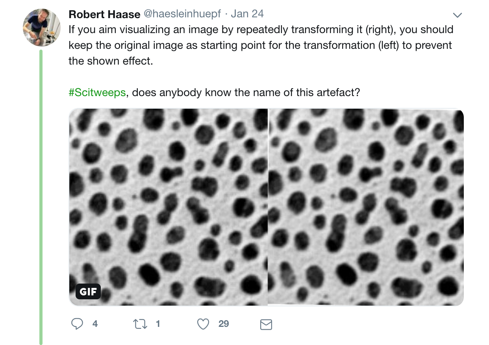
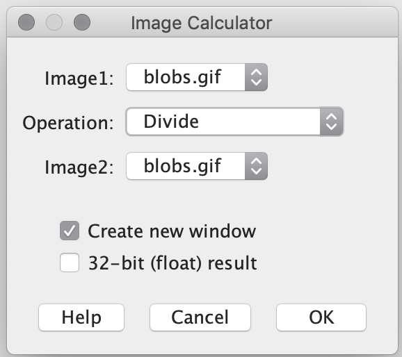
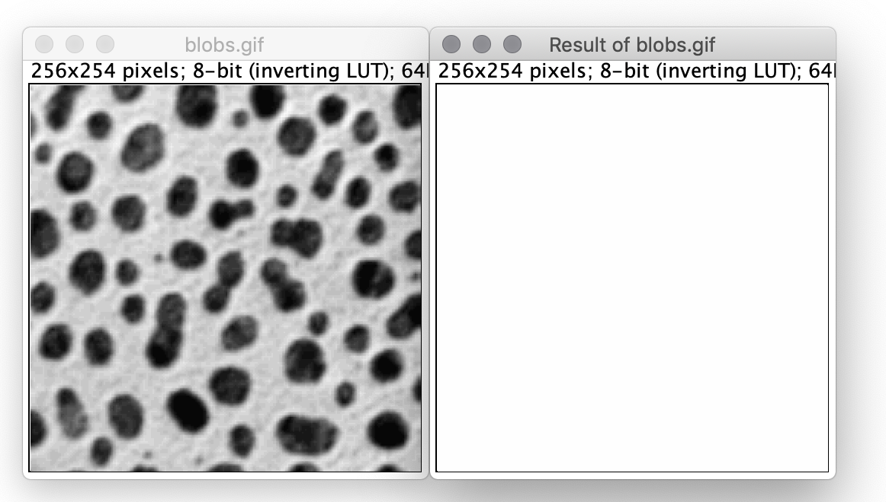

[Back to Index](../README.html)

# Key resources

I have collected these tips both from experience and from a very helpful user community.

**_Nota Bene_**: The presentation by Robert Haase _et al._ that is 
available on
[github](https://git.mpi-cbg.de/rhaase/lecture_applied_bioimage_analysis.git)
is **_awesome_**! The ppt slides are very well done!

There is a **very nice collection of tutorials** available on the
[ImageJ Forum](https://forum.image.sc/t/bioimage-analysis-recommended-reading-and-viewing/28051).

# The IJ.run() function

The `IJ.run()` function comes with **four** variants. **_None_ of these return a value**.

1.  `static void run(ImagePlus imp, java.lang.String command, java.lang.String options)`

    This runs an ImageJ command using the specified image and options.
    
2. `static void run(Interpreter interpreter, java.lang.String command, java.lang.String options)`

    The macro interpreter uses this method to run commands.

3. `static void run(java.lang.String command)`

    Runs an ImageJ command.

4. `static void run(java.lang.String command, java.lang.String options)`

    Runs an ImageJ command, with options that are passed to the GenericDialog and OpenDialog classes.

# Commands the macro recorder never records...

```
IJ.run("Make Binary")
IJ.run("Convert to Mask")
IJ.run("Open Next");	//This becomes the active image for the next session
close("\\Others")
```

jython version:
added to jmFijiGen.py 2019-07-04
```
def close_others():
	IJ.runMacro("close(\"\\\\Others\")")
```

# IJ problems with scientific TIF images on Windows

[cgholke](https://forum.image.sc/t/windows-freeze-for-multi-page-tiffs/27820/4)
writes:

> Thumbnails, previews, and Windows Explorer extensions are known to have
> issues with scientific TIFF files. Try to enable
> `Always show icons, never thumbnails` in the    
> `Folder Options > View`
> settings and disable the Explorer preview pane.

This can cause problems with `Windows Explorer`.


# Convert *.class to *.jar

From [here](https://introcs.cs.princeton.edu/java/85application/jar/jar.html).

1. Create a Manifest file

    For Nnd_.class the file would read:
    
    ```
    Manifest-Version: 1.0
    Main-Class: Nnd_
    ```
2. Create the archive from the command line by

    ```
    jar cmf Nnd_.mf Nnd_.jar Nnd_.class
    ```
    


# Breaking News

**Some good news from Albert Cardona** It looks like there is hope for
Jython to be extended. See
[here](https://forum.image.sc/t/tutorials-for-python-for-fiji/26563/8) 
and
[here](https://sourceforge.net/p/jython/mailman/message/36607206/).

**Beware of multiple image transformations** - Robert Hasse has an interesting
[Tweet](https://twitter.com/haesleinhuepf/status/1088546103866388481)
that warns of image degradation by repeated transformation. Robert and coworkers
call this an **Interpolation artifact**. It is demonstrated in
[imagelib2-realransform](https://github.com/imglib/imglib2-realtransform).
Robert noted that he observed it on



> Any axis. at.rotate(2,1);
> 
> I was just wondering if manipulation of an AffineTransform3D has the same
> effect on a transformed image later on as a sequence of transformations
> applied to the image...

Steven Saffield noted:

> Yes, same.  With affines, concatenate affines though because faster (one
> affine on all pixels instead of many). Also, for 2D images use AffineTransform2D.
> Also, check 
> [here](https://github.com/imglib/imglib2-realtransform/blob/master/src/main/java/net/imglib2/realtransform/RealViews.java#L159
> for rendering. Saves compute by adding differential vectors instead of
> matrix multiplication.


# Useful keyboard shortcuts and script parameters

`[` - Start the script editor. 

`Ctl-b` - burns into overlay something drawn

`Ctl-B` - open blobs sample image

`Ctl-l` - Bring up a search dialog to match commands to classes

`Clt-m` - measure a line or selected feature

`Ctl-t` - add a selection to the ROI manager

`Ctl-Enter` - Bring the main window to the front

- See the full list [here](http://rsb.info.nih.gov/ij/docs/shortcuts.html),

- See the list of `Script Parameters` [here](https://imagej.net/Script_Parameters).

- Use the [Pixel Inspector Tool](https://imagej.nih.gov/ij/plugins/pixel-tool/).
To add it to the ImageJ toolbar, select `Pixel Inspection Tool` from the
toolbar's `>>` menu.

# Autothreshold names...

```
Default, Huang, Intermodes, IsoData, IJ_IsoData, Li, MaxEntropy
Mean, MinError, Minimum, Moments, Otsu, Percentile, RenyiEntropy
Shanbhag, Triangle, Yen
```


# YouTube Video Playlists

1. My Youtube playlist of most
[helpful videos](https://www.youtube.com/playlist?list=PLYj1kur6z-iyQRsVBSxpJHNECZf2j1iDM).

2. [Manchester Bioimaging's](https://www.youtube.com/playlist?list=PLeM_d8ZXiMCOYmpf92IBfOpQQBduWuiw7) Youtube playlist.

# Fiji's Vimeo videos

1. Ellen Arena [Part 1](https://vimeo.com/218520761) covered basic useage
and segmentation and Trainable Weka segmentation.

2. Ellen Arena [Part 2](https://vimeo.com/218520432) covered basic
scripting. 

3. Mark Enter's [ImageJ Porosity Tutorial](https://vimeo.com/273045726)

# Setting the main window position & preference file

## Menu bar `x` and `y` positions

These are in `IJ_Prefs.txt`. These keep the main window from interfering
with icons on the Desktop.

### Mac

Use:

```
ij.x=86
ij.y=23

.actionbarIMCF\ toolbar.xloc=660
.actionbarIMCF\ toolbar.yloc=23
```

## Setting a persistent main window width

A wider main window **prevents comments from interfering with the search bar**
and on windows **prevents plugins that add to the top level menu from making**
**the top menu split to two lines on Windows systems**. Getting this to work
required **_a lot of help_** from the ImageJ Forum.

Add the macro `qResize_MainWindow.ijm` to the `Fiji.app/macros/AutoRun`
folder. Curtis Reuden contributed the macro (2019-05-31). I found a 
**gremlin**: I needed to install the macro in `Fiji.app/macros/AutoRun`
and adjust the name to `qResize_MainWindow.ijm` to make
certain that it ran **before** Jay Unruh's macro `Register_Jay_Reader.ijm`.
It would not run after Jay's plugin... All the gory details are explained in
this
[discussion](https://forum.image.sc/t/how-to-increase-the-width-of-the-main-fiji-window-at-startup/26174/8?u=john_minter)
on the ImageJ Forum. When run this way, the change is **_persistent_**.
What a relief!!!


## Explanation

We can set the **position** of the Fiji main window by setting `ij.x=136`
and `ij.y=26` in `IJ_prefs.txt`. To resize the main window, we need to use
Curtis Reuden's approach above.


## IJ_prefs.txt location

**MacOSX**: /Users/jrminter/Library/Preferences/IJ_Prefs.txt \
**Windows**: C:/Users/jrminter/.imagej/IJ_Prefs.txt

Note: I wrote a Python script (`getPrefsDirImageJ.py`) that will find
the the directory that contains `IJ_Prefs.txt`. It is in the
**OSImageAnalysis** github repository
[here](https://github.com/jrminter/OSImageAnalysis/tree/master/ImageJ/macros/py).

# Analyzing IJ results from stage micrometer

I used Fiji to segment the lines in an image recorded at 10X on the Olympus
BX61 microscope. The data analysis is [here](anaStageMicrometer.html).

# Generating and analyzing spherical particles

This is a work in progress. The goal is to model a distribution of
lognormal particles and generate test images. Currently I can model
the particles. See the results
[here](ana_generated_spheres.html).

# Debugging macros

A tip from Wayne Rasband for debugging macros:

> Open the macro in the Fiji Script Editor, type cmd-A (Select All),
> cmd-C (Copy), close the Script Editor and type cmd-V (Paste).
> The macro will open in an ImageJ macro editor window (named “Clipboard”)
> **that has a Debug menu**. On Linux and Windows, use the control key
> instead for keyboard shortcuts. 

# Don't get bit...

File parameters in scripts need this type of syntax:

```
#@ File (style="")  imageFile
```

without the `(style="")` they throw an error.

# Segmentation

Segmentation is the process of isolating features from an image. There are
many ways to approach the problem.

## Basic Segmentation

Ellen Arena did a nice tutorial on [Basic Segmentation](basic_segmentation.html)
I summarized the video.

## Machine Learning

A modern approach uses machine learning. One implementation is the
[Trainable Weka Segmentation](trainable_weka_segmentation.html).

# Basic Scripting

Ellen Arena did a nice tutorial on Basic Scripting. I have a cached copy
[here](basic_scripting.html) were I summarized the video.

Important takeaways

- The left bracket `[` on your keyboard opens the Script Editor

# Jython Scripting

I have started a document summarizing [Jython Scripting](jython_scripting.html).

# Groovy Scripting

I have started a [local summary](imagej_groovy.html) of Groovy Scripting. 

# Quick tips

- be **sure** to **_uncheck_** `Use SCIFIO when  opening files (BETA!)`.
Leaving it checked causes generation of problematic screen shots...
See the discussion on the ImageJ
[Forum](https://forum.image.sc/t/unexpected-behavior-from-screen-shot/25764).

- An interesting post on
[pyimagej](https://forum.image.sc/t/using-imagej-functions-like-type-conversion-and-setting-pixel-size-via-pyimagej/25755)

Install via conda:

```
conda install -c conda-forge pyimagej 
```
## The ParticleSizer Plugin

The `ParticleSizer` plugin measures particle size distributions and
has an interface to R that works in Windows. There are
details cached locally [here](particle_sizer.html).
 
## Helpful presentations

### Curtis Reuden

- [Fiji Introduction](http://imagej.github.io/presentations/fiji-introduction/#/)
and a [video](https://vimeo.com/218520761)


- [Fiji Segmentation](http://imagej.github.io/presentations/fiji-segmentation/#/)
and a [video](https://vimeo.com/218520761#t=1h05m49s)

- [Scripting with Fiji](http://imagej.github.io/presentations/fiji-scripting/#/)
and a [video](https://vimeo.com/218520432)

## Key sites

1. The ImageJ [Scripting](https://imagej.net/Scripting) site

2. Jan Eglinger's
[github script repository](https://github.com/imagejan/imcf-fiji-scripts)

3. The [ImageJ programming examples](https://github.com/imagej/tutorials)

4. Kota Miura's
[NEUBIAS 2019 Course](https://github.com/miura/NEUBIAS_AnalystSchool2019)

## Keyboard shortcuts

These are from a helpful online
[presentation](https://imagej.github.io/presentations/fiji-introduction/#/).

Note: Windows = **Ctl**, Mac = **Cmd**

- **Ctl/Cmd + L** opens a small window for searches to find commands. This expands
during use.

- **Ctl/Cmd + [** opens the Script Editor.

- Select an image window, then **Shift + T** - Threshold

- **Shift + Z** : Image > Color > Channel Tools

- **Shift + P** : Image > Properties

## Flat Field Correction

From [imagej.net](https://imagej.net/Image_Intensity_Processing#Flat-field_correction)

> **_Proper correction_**
>
> Use this technique on brightfield images. You can correct uneven illumination
> or dirt/dust on lenses by acquiring a "flat-field" reference image with the
> same intensity illumination as the experiment. The flat field image should be
> as close as possible to a field of view of the cover slip without any
> cells/debris. This is often not possible with the experimental cover slip,
> so a fresh cover slip may be used with approximately the same amount of
> buffer as the experiment.
>
> 
>
> 1. Open both the experimental image and the flat-field image.
>
> 2. Click the Select all button on the flat-field image and measure the average
> intensity. This value, the k1 value, will appear in the results window.
> 
> 3. Use the `Image Calculator plus` plugin ( `Analyze  ▶ Tools  ▶ `
> `Calculator plus`).
> 
> 4. i1 = experimental image;    
>    i2 = flat-field image    
>    k1 = mean flat-field intensity;
>    k2 = 0.     
>    Select the "Divide" operation.
>
> This can also be done using the `Process  ▶ Image Calculator` function with
> the 32-bit Result option checked. Then adjust the brightness and contrast and
> convert the image to 8-bit.
>
> .
>
> and the results...
>
> .


## Getting openjdk on mac

[Curtis Reuden](https://forum.image.sc/t/how-do-i-install-pyimagej/23189/7?u=john_minter) noted on the ImageJ Forum:

> You are right—I updated the instructions. Note that you also need to use
> `brew cask install adoptopenjdk8` rather than
> `brew install adoptopenjdk8`, since the **_AdoptOpenJDK_ formulas are casks**.

## Helpful resources

1. [Curtis Reuden's](https://github.com/miura/NEUBIAS_Bioimage_Analyst_Course2017/blob/master/docs/Preparation%20steps%20for%20the%20ImageJ2%20workshop.md)
Preparation steps for the ImageJ2 workshop.

2. [Setting up a development environment](https://github.com/miura/NEUBIAS_Bioimage_Analyst_Course2017/blob/master/docs/Setting%20up%20a%20Java%20development%20environment%20for%20Fiji%20and%20friends.md).

3. The [basic Program](https://github.com/miura/NEUBIAS_Bioimage_Analyst_Course2017/blob/master/docs/Bioimage%20Analyst%20School-%20Program.md)
for the workshop helped.

## Sources of Fiji/ImageJ Scripts

- My collection is in this
[github](https://github.com/jrminter/OSImageAnalysis/tree/master/ImageJ)
repository.

- A user "Sebi" has some nice Python examples in a
[github](https://github.com/sebi06/Tools_and_Scripts) repository.

- The [Scripting ImageJ](https://imagej.net/Scripting) page is helpful.

- The [Fiji Cookbook](https://github.com/fiji/cookbook) has some nice 
examples of (Legacy?) scripts in the directory `src/main/java/sc/fiji/cookbook`.

- The 
[Scripting with Fiji](https://imagej.github.io/presentations/fiji-scripting/#/)
slides are helpful.

- [Albert Cardona's](https://www.ini.uzh.ch/~acardona/fiji-tutorial/)
tutorial is very good.

- [axtimwalde](https://github.com/axtimwalde/fiji-scripts) has some interesting
`.bsh` scripts.

- [R Harks](https://github.com/rharkes/ImageJ-Macros) has a git repository
with his lab's examples. He also has a [Temporal-Median-Background-Subtraction](https://github.com/rharkes/Temporal-Median-Background-Subtraction)
plugin. This uses `ImgLib2`. There is a discussion of this plugin on the
[ImageJ Forum](https://forum.image.sc/t/learning-imglib2-development/24833).

- Tutorials on [github](https://github.com/imagej/tutorials).

# My Current Install

## Fiji Update Sites checked

**Updated 2019-07-06**

- ImageJ
- Fiji
- Java-8
- BAR
- BIG-EPFL
- Bioformats
- Biomedgroup
- BioVoxxel
- Cookbook
- CMCI-EMBL
- DiameterJ
- FFMPEG
- IBMP-CNRS
- IJPB-plugins
- IJ-OpenCV-plugins
- IJPB-plugins
- ImageJ-Latex
- ImageScience
- LOCI
- Morphology
- MOSAIC ToolSuite
- ParticleSizer
- SCF-MPI-CBG
- Scijava Jupyter Kernel
- SimonKlein
- Stowers
[- Linear Distance]?


**Entries in** `/Applications/Fiji.app/jars/Lib`:

- JmFijiGen.py
- kodakBubbles.py


# A fix for Fiji start-up problems on MacOS Mojave

I'm not having problems at the moment, but users with new installs are.

[Stefan Muenkner](mailto::stefan.muenkner@uni-saarland.de) wrote on
the ImageJ mailing list (2019-04-24):

>  I stumbled about the same problem. Using a terminal I could manually
> start Fiji by using:
> 
>    ```
>    /Applications/Fiji.app/Contents/MacOS/ImageJ-macosx
>    ```
>
> it complained about a Version 1.8 Java not being available but it started
> anyway. Out of curiosity I started:
>
>    ```
>    /Applications/Fiji.app/Contents/MacOS/ImageJ-tiger
>    ```
> 
> which fired the above error message about a Java6 needing to be installed.
> 
> Looking into `Info.plist` I found that the first key `CFBundleExecutable`
> was set to `ImageJ-tiger`
>
>    ```
>    <key>CFBundleExecutable</key>
>    <string>ImageJ-tiger</string>
>    ```
>
> Using the good old `vi` **[JRM note: use `subl`]**, I changed ImageJ-tiger
> to ImageJ-macosx in `Info.plist` and - after moving the `Fiji App` once
> out of `Applications` and back in - Fiji started. This might be a workaround
> for Mojave...

Note: My info.plist is different:


# Tutorials

See these ImageJ tutorials that use an ipython notebook. Clone
[this](https://github.com/imagej/tutorials) github repository
and follow the instructions.

To activate this environment, use

    ```
    conda activate scijava
    ```
    
To deactivate an active environment, use
    ```
    conda deactivate
    ```


## Start a new macro/script

The tool bar has changed (2019-03-24). This had me searching...


## Fonts too small

Wayne Rasband wrote (2019-01-16):

> Set "GUI scale" to 1.5 or higher in the Edit>Options>Appearance dialog in the ImageJ 1.52k30 daily build, restart ImageJ, and the "ImageJ" window will double in size. Set "GUI scale" to 2.5 and it will triple in size. On Linux, the font size of the menu bar and menus also double or triple on size. Weirdly, on Windows 10, the menu bar font size does not change. "GUI scale" replaces the "Text scale" option that was in previous 1.52k daily builds.

Curtis Rueden wrote (2019-01-16):

> The following JavaScript code will resize the main window directly:
>
>  importClass(Packages.ij.IJ)    
>  importClass(Packages.java.awt.Dimension)    
>  IJ.getInstance().setSize(new Dimension(850, 350))
> 
> You can run it with Plugins > New > Javascript, or the Script Editor, or Script Interpreter, or whatever code execution method you like.


## Image Processing Resources

- Image processing with machine learning resources by [Emmanuelle Gouillart 2019-01-06](https://twitter.com/EGouillart/status/1082030252900143104)


## Fix an error

In a discussion [here](http://forum.imagej.net/t/script-editor-error-when-working-with-python-scripts/5893/4)
Curtis Reuden proposed a workaround for this annoying error:

> `console:` Failed to install `''`: java.nio.charset.`UnsupportedCharsetException`: cp0.

This seems to be caused by moving to Jython 2.7.1. A work-around is to add

```
 -Dpython.console.encoding=UTF-8
```

to the start-up.

On my windows box, my start-up alias uses this string:

```
C:\Apps\Fiji.app.win64\ImageJ-win64.exe -Dpython.cachedir.skip=false -Dpython.console.encoding=UTF-8  --
```

and is set to start in

```
%IMG_ROOT%
```


## Check the open image header for metadata

```
print(getMetadata("Info"));
```


# Mailing Lists

## ImageJ-devel

Send a message to ``imagej-devel@imagej.net``

## ImageJ

send message to ``imagej@list.nih.gov``

# The script editor

## Changing tabs

From Curtis Rueden 2017-01-25

> If you use ImageJ2's Script Editor [1], you can adjust the tab size in the
Edit > Tab sizes menu.

> [1] https://imagej.net/Script_Editor


# Stitching images using MosaicJ

The ``MosaicJ``plug-in for Fiji/ImageJ is a useful free alternative to the ``Multiple Image Alignment`` (MIA) module of analySIS Five. It does not have the nice initial rough alignment step using cross correlation, but gets the job done.

Here is a reasonable workflow.

1. **Pre-processing:** Open the individual images in Fiji and manually crop away most of the overlap legions. This will make your life a **lot** easier. Save these in a folder named ``prep``. 
2. **Start MosaicJ:** Open the plug-in from the ``Plugins > Stitching`` menu.
3. **Load your images:** From the MosaicJ file menu choose ``Load Image sequence`` and select the first image in your ``prep`` folder. This will load the images into MosaicJ's bottom panel.
4. **Rough placement:** Click each image in the bottom panel. It will place each image into the top panel. Use the mouse to roughly move each image into the position it should have in the array.
5. **Fine placement:** use the mouse to better align the tiles. The ``Scale > Magnify`` menu item will zoom. Note that ``Ctrl +`` (using the plus on the numeric keypad) shortcut zooms; ``Ctrl -`` shrinks. Do your best to move the images so the features overlap.
6. **Create the montage:** Use ``File > Create Mosaic`` to generate the montage image. Save it as a tif in the parent folder of your ``prep`` folder. You can then crop, correct aspect ratio, adjust the LUT as needed and burn a scale bar.

# Stack Alignment using the TemplateMatching Plug-in

From
[Qingzong (Zong) Tseng](https://sites.google.com/site/qingzongtseng/template-matching-ij-plugin/tuto2)

Download the plug-in from [here](https://sites.google.com/site/qingzongtseng/template-matching-ij-plugin#downloads).

1. Open the stack called "stack to align.tif" (download it [here](https://sites.google.com/site/fileqzt/file/Template_Matching_sample.zip?attredirects=0) ). You can see that it composed of several images of similar patterns but not well aligned.

2. Run ``Plugins > Template Matching > Align`` slices in stack...


3. Click ``OK``, then a dialog will appear to ask you to select a square ROI region as the landmark for aligning


4. After making a square ROI on the image stack, click on ``OK``.

5. All the slices in the stack will be aligned, and the displacements for each slice are printed out in both log window and results table. 

<figure>
  
  
<figcaption>**Left:** Before alignment. **Right:** After alignment.</figcaption>
</figure>


# Annotating images
From [wiki.imagej.net](http://wiki.imagej.net/Annotating_Images#Issues_with_adding_text)

Images can be annotated using the annotation tool. Double-click to get a configuration image. Adding text to a stack is a slightly different process. You can draw a text box by following the same steps, but on a stack, keyboard shortcut ``Ctrl+B`` will overlay the text on the current slice, while shortcut ``Ctrl+D`` will draw the text on every slice of the stack. These get written into an overlay.

The ``Cookbook > Annotating images > Add Scale bar`` choice from the menu opens a configurable dialog. One needs to set the scale from ``Analyze > Set Scale`` first.

There is a useful tutorial attributed to [Chris Ambrose](http://www.allandebono.org/show/protocols/imagejoverlays/)


# 16 bit images

[Michael Schmid](http://imagej.1557.x6.nabble.com/Use-of-LUTS-give-different-results-td5010726.html) provides some interesting tips regarding LUTs for 16 bit images where there is a limited range of information. He notes:

> If you have 16-bit data and a LUT, it depends on the min & max of the display range of the pixels how it appears on the screen. By default, the display range is the full 16-bit range, 0-65535 

> See ``ImageProcessor.setMinAndMax(double min, double max)`` 

> In your case, with values between 15000 and 24000, just use 

```
ip.setMinAndMax(15000, 24000);
```
# Explicitly setting the standard gray scale LUT
[Michael Schmid](http://imagej.1557.x6.nabble.com/Problem-saving-PNG-files-in-particular-order-td5011977.html#a5012010) notes that one can explicitly set the standard gray scale LUT with the following snippet

```
 ip.setColorModel(ip.getDefaultColorModel()) 
```

# The Action Bar plug-in

Check out the [Action Bar](http://imagejdocu.tudor.lu/doku.php?id=plugin:utilities:action_bar:start) plug-in...

# Sources of plugins

## Stowers

[Stowers Research Institute](http://research.stowers.org/imagejplugins/)

Note: This adds a lot to the IJ prefs file. Entries like

```
.recent.command1=register jay readers jru v1
```

Reinstall if needed...


## Plugin performance

Java seems most efficient... Apparently written in 2005, [Hartenstein](https://www.mcdb.ucla.edu/Research/Hartenstein/software/imagej/other_plugins.html), of UCLA, cites these performance comparisons from a series of  ``Add Noise`` plug-ins by Albert Cardona performing operations on a 600x900 px image. I have archived copies of these in ``$GIT_HOME//OSImageAnalysis/ImageJ/Cardona-Language-Benchmarks``.

1. [Add_Noise.java](https://www.mcdb.ucla.edu/Research/Hartenstein/software/imagej/Add_Noise.java) 1-2 sec.
2. [Add_Noise.txt](https://www.mcdb.ucla.edu/Research/Hartenstein/software/imagej/Add_Noise.txt) 12 sec
3. [Add_Noise_1.py](https://www.mcdb.ucla.edu/Research/Hartenstein/software/imagej/Add_Noise_1.py) 15 sec (pythonesque version using java.util.Random)
4. [Add_Noise.py](https://www.mcdb.ucla.edu/Research/Hartenstein/software/imagej/Add_Noise.py) 44 sec (macro-like version, but using python's random.randint() function)

All this plugin/macro/script does is to duplicate the current image, get one pixel at a time and add random noise to it.
The ImageJ built-in macro language is certainly more specific to ImageJ and thus goes through less clutter than the more general jython interpreter. Still a 4x in execution time is quite astonishing. Luckily enough the biggest different is made when using the java.util.Random class instead of python's 'random' module.
Note that the complexity of the 3 files is quite similar, both in terms of length and in assumptions about the system. Thus the coder needs to learn several conventions before writing any of the 3 versions of this program. Stay with Java plugins if speed matters to your program!
Jython though really pays off when properly optimized, and it's particularly useful to make GUIs in no time.


# Extended depth of field

I wanted a substitute for analySIS Five's ``Extended Focus Imaging``. ImageJ/Fiji has some helpful plugins. To date I have not been able to script them...

## Test Images

I have a test image stack (pre-aligned) in ``$GIT_HOME/OSImageAnalysis/images/extended-depth-of-field/Mattheddleite/Mattheddleite-jm-cr-align-stack.tif``.

## Procedure

1. Load all the TIF images. Crop them to the same side if need be.
2. Convert the loaded images to a stack (``Image > Stacks > Images to Stack``).
3. Align the images in the stack. (``Plugins > Registration > StackReg``). I choose the ``Translation`` option.
4. Process the aligned stack with (``Plugins > Process > Extended Depth of Field (Expert Mode)``). One can set the menus as below and ``Save settings``. In future runs, one can ``Load settings``.


# Alchemy...

## Inverting an image

I am always hunting for the invert command. it is **not** in the ``Process > Binary`` menu but rather in the ``Edit > Invert`` menu. The shortcut is ``Ctrl-Shift-I``


### How do I launch ImageJ with a different version of Java?

[FAQ](http://fiji.sc/Frequently_Asked_Questions#How_do_I_launch_ImageJ_with_a_different_version_of_Java.3F)

Use the --java-home command line option. Examples:

On OS X:
```
/Applications/Fiji.app/Contents/MacOS/ImageJ-macosx --java-home \
  '/Library/Java/JavaVirtualMachines/jdk1.7.0_65.jdk/Contents/Home'
```

## Constructing line perpendicular to other line (saved in ROI manager)

From Wayne Rasband on IJ mailing list

```
count = roiManager("count");
  if (count==0)
     exit("ROI Manager line selection required");
  roiManager("select", count-1);
  if (selectionType!=5)
     exit("Straight line selection required");
  run("Rotate...", "angle=90");
  roiManager("Add");
  roiManager("Show All without labels");
```


# Edge-preserving averaging (smoothing) algorithms

## Thresholded Blur

[ImageJ Wiki](http://imagejdocu.tudor.lu/doku.php?id=plugin:filter:thresholded_blur:start)

# Plug-ins that don't return an image reference

Wayne Rasband noted (2013-05-22) that some reader plugins,
including Bio-Formats, open and display the image without
returning a reference. He offered the following
work-around in Jython scripts:

```
imp = IJ.openImage(path)
imp = WindowManager.getCurrentImage()

```


# Hints on video

Again [Michael Schmid](http://imagej.1557.x6.nabble.com/Compress-AVI-for-ImageJ-td5010753.html) provides some helpful hints

> If you open an (uncompressed) AVI as virtual stack, the file size does not matter, it only keeps the frame currently visible in memory. You can then view the video and perform read-only operations, such as "Analyze Particles" 
An alternative: Read only part of the video (the AVI import dialog has an option to select which frames), and process it in parts. 

> If you want to process the whole video in ImageJ: As soon as any operations modify the frames, ImageJ must load everything into memory. In that case it won't help to compress the video on disk, because it must be uncompressed as soon as it is in ImageJ. 

> Plain ImageJ only accepts very few compression techniques, to keep the code simple and partly related to licensing/copyright issues, but also because compression causes artifacts that should be avoided in scientific image processing. 

> Plain ImageJ supports the following types: 

> - Raw video with 8-bit or 16-bit grayscale and RGB (3 * 8 = 24 bits/px) 
- Various color ('chroma') subsampling types, because frame grabbers or cameras often deliver these as raw format (Y422, YUYV, I420, NV12, and the like) 
- PNG or JPEG compression of individual frames (the latter is also known as MJPG). 


[Back to Index](../README.html)
