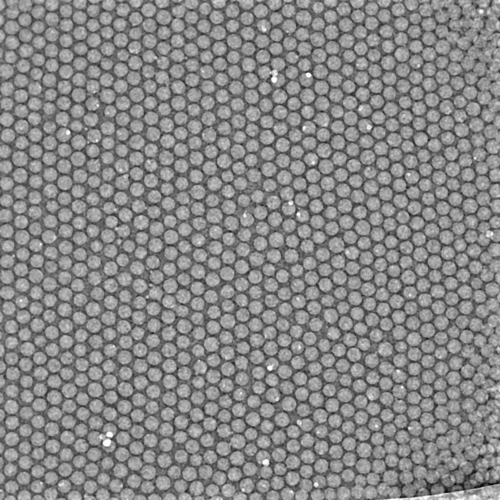
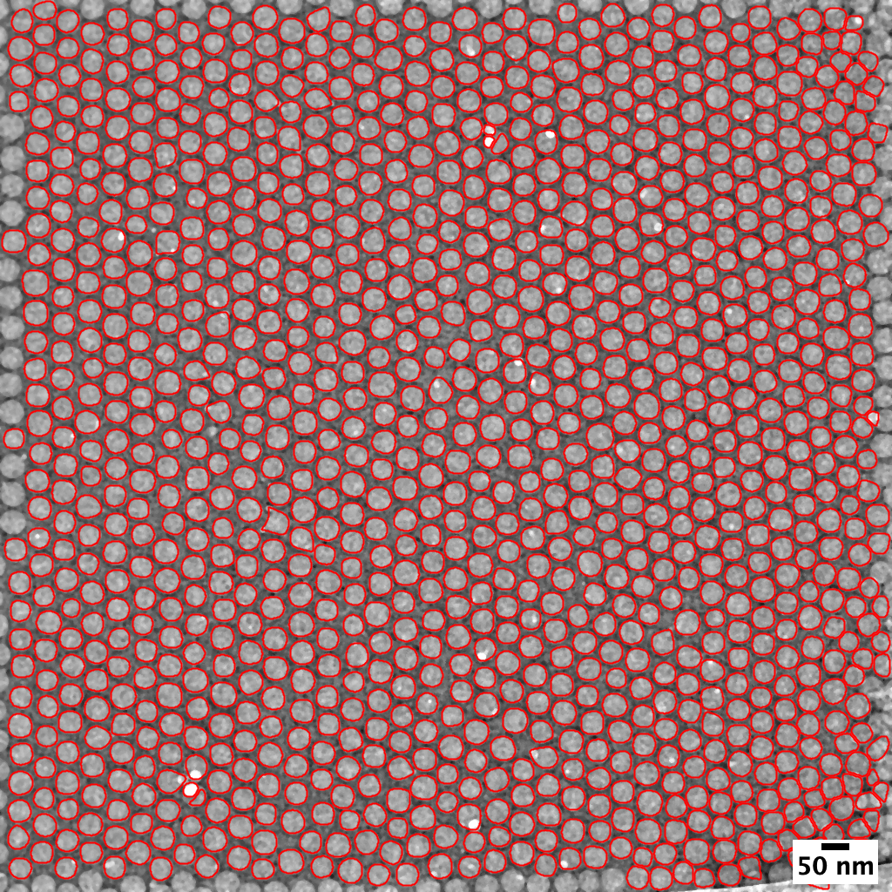

[Back to ImageJ](ImageJ.html)


# Introduction

The [ParticleSizer](https://imagej.net/ParticleSizer) plug-in was written by
[Thorsten Wagner](https://github.com/thorstenwagner) wraps a `particleSizer`
function that will size nanoparticles and has an interface to R that works
on Windows. The mechanism to set the path to R does not work on Mac or
Linux, but this part can be turned off in the IJ-Prefs.txt file.

I analyzed my background-subtrated POL4455 image





# Read in the data with R


```r
library(dplyr)
fi <-'./csv/pol4455-particle_sizer.csv'
df <- read.csv(fi, header=TRUE, as.is=TRUE)
# head(df)

particles <- data.frame(lab=df$Label, ecd=df$Area.equivalent.circle.diameter,
                        ar=df$Aspect.Ratio, circ=df$Circ., elong=df$Elong.,
                        conv=df$Convexity)
head(particles)
```

```
  lab    ecd    ar   circ elong conv
1   1 37.211 1.306 12.139 0.464    1
2   2 34.647 1.000 11.619 0.197    1
3   3 41.621 1.038 11.888 0.133    1
4   4 36.890 1.091 11.915 0.304    1
5   5 39.722 1.000 11.822 0.221    1
6   6 40.937 1.040 11.830 0.208    1
```

# Plot the histogram of ECD


```r
library(ggplot2)

bSave = FALSE

plt <- ggplot(particles, aes(ecd)) +
       geom_histogram(binwidth = 1.0) +
       ggtitle("Equivalent Circular Diameter") +
       theme(plot.title = element_text(lineheight=2, size=12)) +
       labs(x="diameter [nm]", y="Count") +
       ggtitle("Diameter distribution of soft latex particles in vitreous ice") +
       theme(axis.text=element_text(size=12), axis.title=element_text(size=14),
             plot.title = element_text(hjust = 0.5)) +
       NULL

if (bSave == TRUE) {
  ggsave("png/pol4455-ecd-histo.png", plot=plt,
         width=6, height=4, units="in", dpi=150)
}
print(plt)
```

<!-- -->


Try a linear distribution panel plot that uses base graphics. This assunmes
a linear (not lognormal) particle size distribution from my old `rAnaLab`
package.

Sometime I need to migrate this function to ggplot2...


```r
library(rAnaLab)

linear.distn.panel.plot(particles$ecd, n.brks = 25, distn.lab = "ecd [nm]",
  hist.legend = TRUE, legend.loc = "topright", kern.bw = "nrd0",
  plt.median = TRUE, scale.mult = 1.2)
```

<!-- -->

[Back to ImageJ](ImageJ.html)
