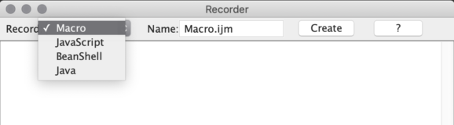
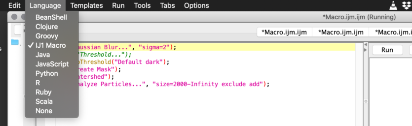
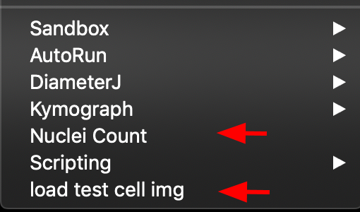
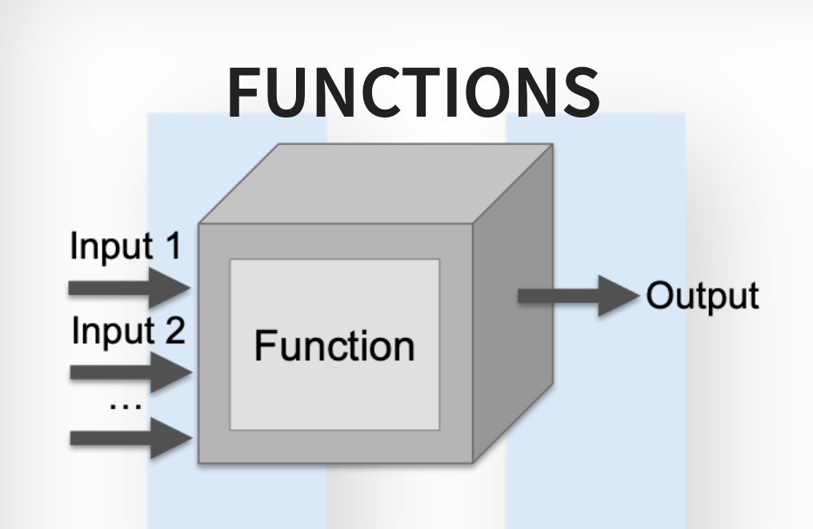
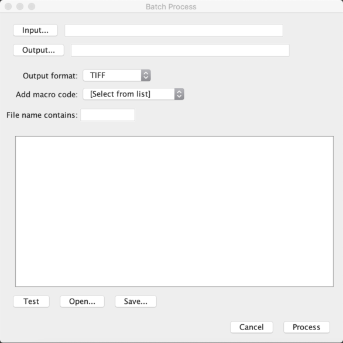
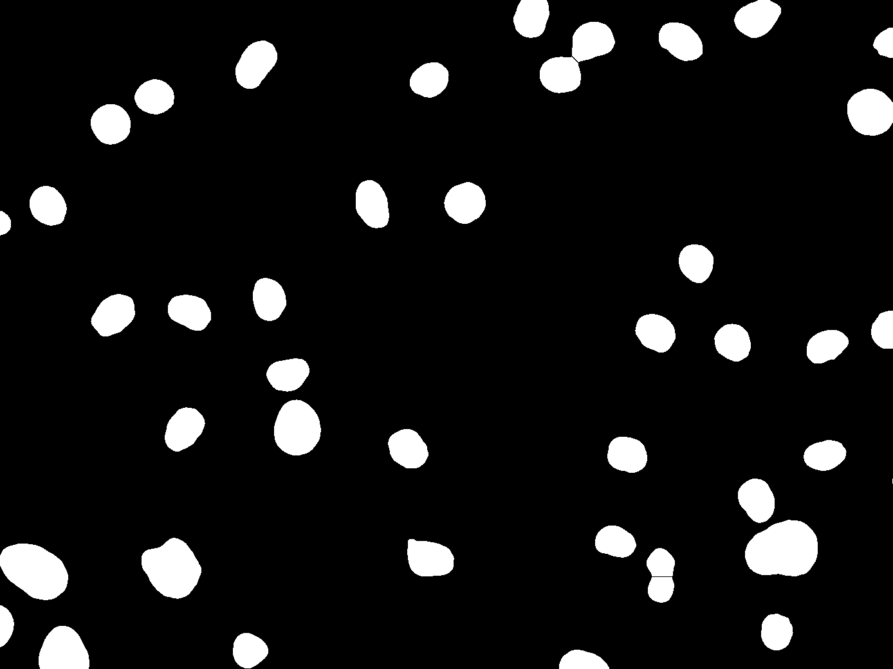

[Back to ImageJ](ImageJ.html)


# Introduction

We will use the images that I downloaded and installed in the `./tif`
directory. We will use the
[Scripting Slides](http://imagej.github.io/presentations/fiji-scripting/#/).
There are active links in the slides.

The video is [here](https://vimeo.com/218520432). I will include time stamps
for the exercises.

Ellen Arena is a postdoc at [LOCI](https://loci.wisc.edu/). She is one of the
maintainers of ImageJ.

(6:00)
Scripts help with documenting our work. Ellen thinks of them as her
lab notebook for computation. By adding comments you can record what you did
and why. The "what" is the code; the notes are the "why" (and your observations).
You always want to think about "down the road." I recall Karl Broman:

> Your closest collaborator is you, six months from now. And you don't respond
> to email...

Ask yourself:

> When you read it again, can you replicate it?

We all want to automate our analyses to avoid unneeded repetition and to have
reproducible analyses. And you want to share your work...

# The macro recorder

The macro recorder is built into Fiji/ImageJ. The recorder saves the steps in a
text file. You can record in multiple languages


- Use "l" to get the command finder and type `record` and select the
`Record...` entry and press `Run`. This starts the recorder.

   
  
  All the scripts today will be in the ImageJ macro language. it is not the most
  powerful language but it is a good place to start in ImageJ.
  
  Opening the `Blobs` sample image produces `run("Blobs (25K)");`. Note that
  threshold commands are recorded, even the check box toggles. (9:55)
  
  Creating a mask produces `run("Create Mask");`. Each step is recorded.
  
# The plan

1. Close the recorder
2. Read in one of the images using Bioformats importer to preserve metadata
3. Open image 5.
4. Switch LUT to Gray
5. Now open the recorder (`Record...`this prevents hard-coding opening images),
   Make sure we are recording in the macro language (12:35).
6. Do the following:
   - Gaussian Blur with sigma=2
   - Run Threshold, use the default with a dark background
   - Create a mask
   - Run a Watershed
   - Run `Analyze Particles` with size from 2000 to infinity, exclude edges,
     and add to ROI manager
   - Press `Create` to send the commands to the Script Manager
   - Make sure the language is `ImageJ Macro`. Note that more languages
     are available:
   
     
   - Our code looks like this (19:13)
    
     ```
     run("Gaussian Blur...", "sigma=2");
     //run("Threshold...");
     setAutoThreshold("Default dark");
     run("Create Mask");
     run("Watershed");
     run("Analyze Particles...", "size=2000-Infinity exclude add");
     ```
     
     It is a good start. Now we "fix it up"
     
     
# Introduction to Script Parameters (20:47)

1. We edit, adding a script parameter
   
    ```
    // @int(label = "Minimum size px") minSize
    run("Gaussian Blur...", "sigma=2");
    //run("Threshold...");
    setAutoThreshold("Default dark");
    run("Create Mask");
    run("Watershed");
    run("Analyze Particles...", "size=" + minSize + "-Infinity exclude add");
    ```
    
    We re-open image with Bioformats
    
    Variable names **are case-sensitive**! (28:29)

# Storing Macros

- From script editor, save the .ijm file in Fiji.app/scripts/Plugins
(note the capital P).

- We can also group scripts in subfolders of Plugins (37:17)
  I saved this as `Nuclei_Count.ijm` in `/Applications/Fiji.app/scripts/Plugins`.

- Close and re-open Fiji to have it find the script

   

**_Nota Bene_:** Save copies of your scripts in a git repository because if you
have to reinstall Fiji, you might lose your scripts!!!! (39:09).

Remember the code for this example is
[here](http://imagej.github.io/presentations/fiji-scripting/#/4/4).

and reproduced below:

```
#@int(label = "Minimum size") minSize

setBatchMode(true);
id = getImageID(); // get original image id
run("Duplicate...", " "); // duplicate original image and work on the copy
run("Gaussian Blur...", "sigma=2");
setAutoThreshold("Default dark");
//run("Threshold...");
run("Create Mask");
run("Watershed");
run("Analyze Particles...", "size=" + minSize + "-Infinity display exclude add");
run("Clear Results"); // delete contents of results table
selectImage(id); // activate original image
roiManager("Show All with labels"); // overlay ROIs
roiManager("Deselect");
roiManager("Measure"); // measure on original image
```

# More on the Script Editor

(Starting at 40:02)

1. The left bracket `[` opens the script editor.

2. The syntax highlighting in the Script editor helps us write code.

    **Green**: comments (not processed...) **Except** Script Parameters
    (more later...)
    
    **Yellow**: Functions
    
    **Magenta**: Strings
    
    **Blue**: Numbers and proxies like `true` and `false`
    
# Basic scripting (from slide)

  a. If it is not syntax colored, select a language
    
  b. Comments let us add notes of explanation.    
      Ex:    
       
       ```
       // Comments allow you to put human-readable thoughts
       // into your code.
       
       // The goal of this "macro" is simply to teach you about comments!
       
       // Comments help you to remember why you did something:
       // Set the value to "2" because my boss said so!
       value = 2; // Comments can be added to any line!

       // Code can be disabled by commenting it out:
       // x = y * 2;
       ```
    
       In ijm language use `//`    
       Code is inherently tricky to read. Think of a lab notebook...    
       We can comment out sections of code to track errors.     
       Script Parameters may be extracted from comments.    
       Ex: `#@int(label = "Minimum size") minSize`     
       (43:37)    
       
#  Variables
       
    A variable is a placeholder. The assignment operator is the `=` sign.
       
    In the macro language there are only two types of variables: **strings**
    and **numbers**. Booleans (**true** and **false**) are numbers. (45:03)
       
    ```
    // what sorts of values can we assign?
    title = "Hello, World!";                // string
    intensity = 255;                        // number
    // Note the error: x, y, and a are not yet assigned!!!
    a = exp(x * sin(y)) + atan(x * y – a);  // expression
    
    // string constant vs. variable name
    text = "title"; 
    // print(text);
    text = title;
    // print(title);
       
    x = 3;
    y = x;
    x = 5; // what is the value of y after this?

    // the variable is assigned after the expression is evaluated
    intensity = intensity * 2;
    ```
    
#  Functions
    
    
    
    `print()` is a function. There is a list of
    [built-in macro functions](http://imagej.net/developer/macro/functions.html)
    and it has a **search menu**! **JRM note**: for work in Jython or other
    languages, the source code for these built-in functions is
    [here](https://imagej.nih.gov/ij/developer/source/ij/macro/Functions.java.html).
    One can also search the [Fiji Wiki](https://imagej.net/Fiji_Wiki)
    for built-in macro functions.
    
#  Function examples (53:30):
    
    Recall that functions print to the **Log** window.
    
    Functions can **return values**.
    
    ```
    print("Hello, world!");
    // functions can return values
    // Hint: use parameters instead of calling getNumber
    number = getNumber("Type in a number!", 5);
    
    // the "run" function is the most important one
    // it follows the structure of run("Command...", "Argument(s) String");
    run("Duplicate...", "title=New");
    
    // for arguments with spaces, enclose in square brackets
    run("Duplicate...", "title=[with spaces]");
    ```
    
# Strings (57:12)
    
    ```
    name = "copy";
    
    // you can concatenate strings and strings with numbers
    text = "The name is " + name;
    
    // what happens when we type this?
    run("Duplicate...", "title=name");
    
    // what's different with this line?
    run("Duplicate...", "title=" + name);
    ```
    
#  Conditionals (1:00:22)
    
    ```
    #@String instructor

    if (getBoolean("Is " + instructor + " going too fast?")) {
        hint = "Tell them to to slow down!";
    }
    else {
        hint = "Try to modify the code, play with it...";
    }
    showMessage("Advice:", hint);
    ```
    
9.  Loops** (1:05:18)
    
    ```
    // For loops:
    // They use assignment, test, increment
    // Use when you know the # of times the loop will run
    for (i = 1; i <= 10; i++) {
        print("Counter: " + i);
     }
     
    // While loops:
    // Use when you do not necessarily know the # of times the loop will run
    while (getBoolean("Do you want me to keep going?")) {
         print("Ok, I'm still going...");
    }
    showMessage("Ok, I'm done!");
    ```
    
# Script parameters (1:16:03)

**Most important take-away**: When using script parameters they must be the
first entries at the top of your script (1:21:12)


1. Open the script editor (`[`)

2. From the script Editor open    
*Templates > Intro > Widgets (JavaScript)*

a. change line 17 to:

```
// @int(min = 0, max = 1000, style="scroll bar") boundedInteger
```

b. To the string parameter, add 

```
choices = {"quick fox", "lazy dog"}
```

line 21

```
// @String  (choices={"quick fox", "lazy dog"}) string
```

Insert at the end of the choices:

```
//@Date date
```


c. Run again...


3. Run
    
4. Fix the bugs...

5. To the `boundedInteger` parameter, add    
`style="scroll bar"`

6. To the `string` parameter, add:    
`choices = {"quick fox", "lazy dog"}`

7. Run again

# Batch processing (1:22:04)

Select:    
**Process  ▶  Batch  ▶  Macro**

To display



It is pretty easy to use to process a folder of images for a simple macro without
a lot of interaction.

you can search for it with `process...`

We can do better...

# Process folder IJ1 macro (1:24:55)

In Script Editor Open:

`Templates ▶ ImageJ 1.x ▶ Batch ▶ Process Folder (IJ1 Macro)`

Loops through a folder processing images.

Ellen's template

```
/*
* Macro to count nuclei in multiple images in a folder/subfolders.
*/

#@File(label = "Input directory", style = "directory") input
#@File(label = "Output directory", style = "directory") output
#@String(label = "File suffix", value = ".tif") suffix
#@int(label = "Minimum size") minSize

processFolder(input);
	
// function to scan folders/subfolders/files to find files with correct suffix
function processFolder(input) {
	list = getFileList(input);
	for (i = 0; i < list.length; i++) {
		if(File.isDirectory(input + File.separator + list[i]))
			processFolder("" + input + File.separator + list[i]);
		if(endsWith(list[i], suffix))
			processFile(input, output, list[i]);
	}
	//saves results for all images in a single file
	saveAs("Results", output + "/All_Results.csv"); 
}

function processFile(input, output, file) {
	setBatchMode(true); // prevents image windows from opening while the script is running
	// open image using Bio-Formats
	run("Bio-Formats", "open=[" + input + "/" + file +"] autoscale color_mode=Default rois_import=[ROI manager] view=Hyperstack stack_order=XYCZT");
  id = getImageID(); // get original image id
	run("Duplicate...", " "); // duplicate original image and work on the copy
	
	// create binary image
	run("Gaussian Blur...", "sigma=2");
	setAutoThreshold("Default dark");
	//run("Threshold...");
	run("Create Mask");
	run("Watershed");
	// save current binary image
	save(output + "/Binary_OUTPUT_" + file);
	
	run("Analyze Particles...", "size=" + minSize + "-Infinity exclude add");
  selectImage(id); // activate original image
  roiManager("Show All with labels"); // overlay ROIs
	roiManager("Deselect");
	roiManager("Measure"); // measure on original image
	
	// save ROIs for current image
	roiManager("Deselect");
	roiManager("Save", output+ "/" + file + "_ROI.zip"); // saves Rois zip file
	roiManager("Deselect");
	roiManager("Delete"); // clear ROI Manager for next image
}

```

This worked nicely.

The script is [here](ijm/Process_Folder.ijm).

Note that the call to import the image using `Bioformats` is a long call
(see Line 28. video: 1:31.40). The call is concatenating the input directory
and the file with the needed import information.

Ellen noted (1:33:27) that in this type of workflow she always save the mask
from the processing. The code notes that it is saving binary output (line 38).
Also note in lines 43 and 44 that she is **deselecting the mask and measuring**
**on the original image**. This gives the analyst the ability to later verify
that the selection was correct. Finally, she has the script clear the ROI manager
to prepare to process the next image.

To aid data provenance, Ellen saves the ROIs as a zip file (1:34:10).

At run time the dialog box prompts the user for two directories (input and output)
and a string - the file type. (1:35:47)

She also save a .csv file with the results (1:37:15, line 21). For a user of
both python and R, this makes data analysis easy to automate.

The csv file with the results is [here](batch_output/All_Results.csv).




       
# Batch Processing - Nuclei (1:29:58)

    ```
    #@int(label = "Minimum size") minSize
    setBatchMode(true);
    id = getImageID(); // get original image id
    run("Duplicate...", " "); // duplicate original image and work on the copy
    run("Gaussian Blur...", "sigma=2");
    setAutoThreshold("Default dark");
    //run("Threshold...");
    run("Create Mask");
    run("Watershed");
    run("Analyze Particles...", "size=" + minSize + "-Infinity display exclude add");
    run("Clear Results"); // delete contents of results table
    selectImage(id); // activate original image
    roiManager("Show All with labels"); // overlay ROIs
    roiManager("Deselect");
    roiManager("Measure"); // measure on original image
    ```

# Key take-aways

- Use the [Macro Recorder](https://imagej.net/Introduction_into_Macro_Programming#The_recorder)...

- Open the [Built-In Macro Functions](https://imagej.net/ij/developer/macro/functions.html) list

- print(); statements are your friend!

- Ask for help on the [Forum](https://forum.image.sc/)
      
# Further Reading (1:39:33)

- Help from the community is [here](http://imagej.net/Help).

- Use the [Scripting guide](http://imagej.net/Scripting)

- Additional [workshops and presentations](https://imagej.net/Presentations)
are available


[Back to ImageJ](ImageJ.html)
