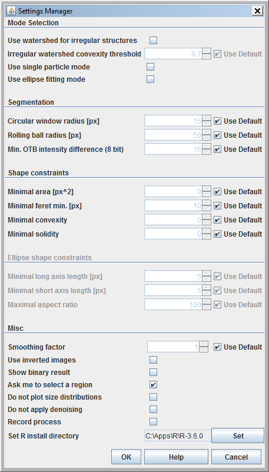
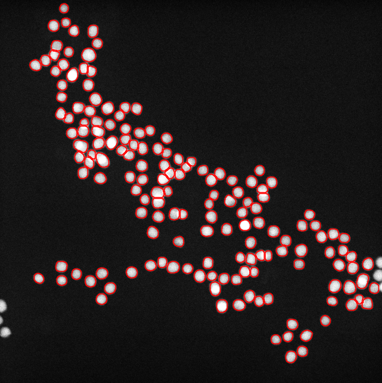

[Back to ImageJ](ImageJ.html)

# Introduction

The [ParticleSizer](https://imagej.net/ParticleSizer) plug-in was written by
[Thorsten Wagner](https://github.com/thorstenwagner) wraps a `particleSizer`
function that will size nanoparticles and has an interface to R that works
on Windows. The mechanism to set the path to R does not work on Mac or
Linux.

# Configuration

To configure the PlugIn select

> Plugins > NanoDefine > Settings Manager

# Example use

Thorsten Wagner supplied an image of nano-gold particles for analysis

Processing the image produces this image:

The script is [here](ijm/particle_sizer_au.ijm).

[Back to ImageJ](ImageJ.html)
