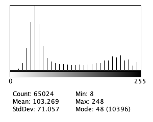
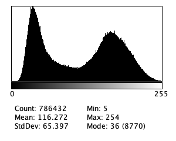

```{r setup, include=FALSE}
knitr::opts_chunk$set(echo = TRUE)
```

# Introduction

The current "standard" image for particle analysis in Fiji/ImageJ is the
`blobs.gif` image.


This image has a few issues. 

1. There is no published provenance.

2. It is supplied with an inverted look-up table., i.e. it is really light 
particles on a dark background.

3. The image has very few (31) equally spaced gray levels, The first entry in
the histogram begins at 8 and the final entry is 248.



4. The image lacks a **spatial calibration**

5. I cannot find any documentation on the provenance of the image.

To be fair, `blobs.gif` **is** a nice to demonstrate a particle amalysis
including watershed separation.

My question: **_Can we do better_**

# My hypothesis

I believe the blobs image is SEM image of Au islands on graphitic carbon imaged
on an older SEM. The particles would be bright because of secondary and
backscattered electrons emitted from the Au. There is little electron emission
from the C. Several vendors supply specimens like this for image resolution
tests. 

I wanted to compare the blobs image to images from a Au on C test specimen
supplied by Ted Pella (product number 617). The `617 TN.pdf` (available from
[here](https://www.tedpella.com/technote_html/617%20TN.pdf) - see page 2).
Pella markets specimens with different size distributions on Au particles on C
that are also discribed.

# Making a sample image.

I created a sample image from the micrograph in the brochure.
**_I would really prefer an original micrograph with provenance information_** 


And the histogram




