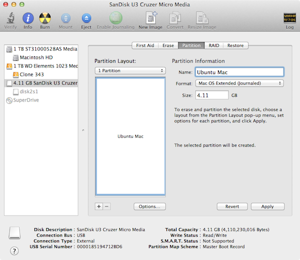
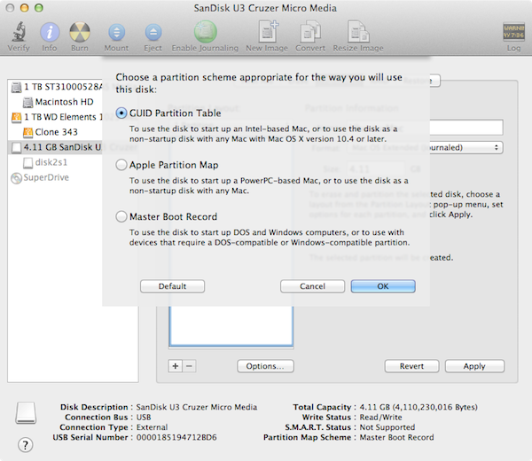
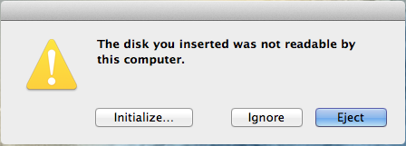

[Back to Index](../README.html)

Lubuntu is a light-weight Ubuntu distribution based upon [LDXE](http://wiki.lxde.org/en/Main_Page).

The Lubuntu Community documentation is [here](https://help.ubuntu.com/community/Lubuntu/Documentation). Note the [Editing the Menu](https://help.ubuntu.com/community/Lubuntu/Documentation/EditingTheMenu) Section.

# Update from the command line

```
# update database and upgrade current packages
sudo apt-get update; sudo apt-get upgrade
# do a distribution upgrade
sudo apt-get dist-upgrade
```


# Install a .deb file

From [askubuntu](http://
askubuntu.com/questions/40779/how-do-i-install-a-deb-file-via-the-command-line)

Install

```
sudo dpkg -i DEB_PACKAGE
```

or 

```
sudo apt install path-to-deb
```


Remove

```
sudo dpkg -r PACKAGE_NAME
```
# Creating a quick launcher

From [askubuntu.com](http://askubuntu.com/questions/466395/how-can-i-create-a-quick-launcher-in-lubuntu). I used this to set one up for DTSA-II Halley.

Run in terminal

```
lxshortcut -o ~/Desktop/myLauncher
```

# RStudio CRAN mirror

For `bionic beaver` add an entry

```
deb https://cran.rstudio.com/bin/linux/ubuntu bionic/
```

to your /etc/apt/sources.list file. By using https://cloud.r-project.org,
you will be automatically be redirected to a nearby CRAN mirror. See
https://cran.r-project.org/mirrors.html for the current list of CRAN
mirrors.


You will need the key... The Ubuntu archives on CRAN are signed with the
key of "Michael Rutter marutter@gmail.com" with key ID E084DAB9. To add
the key to your system with one command use (thanks to Brett Presnell
for the tip):

```
sudo apt-key adv --keyserver keyserver.ubuntu.com --recv-keys E084DAB9
```


To install the complete R system, use

```
sudo apt-get update
sudo apt-get install r-base
```

Users who need to compile R packages from source [e.g. package
maintainers, or anyone installing packages with install.packages()]
should also install the r-base-dev package:

```
sudo apt-get install r-base-dev
```

# Configuring proxy servers

from [askubuntu]( http://askubuntu.com/questions/175172/how-do-i-configure-proxies-in-ubuntu-server-or-minimal-cli-ubuntu)


 System-wide proxies in CLI Ubuntu/Server must be set as environment variables.

 Open the ``/etc/environment`` file with vi (or your favorite editor). This file stores the system-wide variables initialized upon boot. Add the following lines, modifying appropriately. You must duplicate in both upper-case and lower-case because (unfortunately) some programs only look for one or the other:
 
```
PATH="/home/shared/texlive/2016/bin/x86_64-linux:/usr/local/sbin:/usr/local/bin:/usr/sbin:/usr/bin:/sbin:/bin:/usr/games:/usr/local/games"
http_proxy="http://proxy1.kodak.com:81/"    
https_proxy="http://proxy1.kodak.com:81/"    
ftp_proxy="http://proxy1.kodak.com:81/"    
no_proxy="localhost,127.0.0.1,localaddress,.kodak.com"    
HTTP_PROXY="http://proxy1.kodak.com:81/"    
HTTPS_PROXY="http://proxy1.kodak.com:81/"    
FTP_PROXY="http://proxy1.kodak.com:81/"    
NO_PROXY="localhost,127.0.0.1,localaddress,.kodak.com"    

``` 
 
 
 ``apt-get``, ``aptitude``, etc. will not obey the environment variables when used normally with sudo. So separately configure them; create a file called ``95proxies`` in ``/etc/apt/apt.conf.d/``, and include the following:

```
Acquire::http::proxy "http://proxy1.kodak.com:81/";
Acquire::ftp::proxy "ftp://proxy1.kodak.com:81/";
Acquire::https::proxy "https://proxy1.kodak.com:81/";
```
 
Finally, logout and reboot to make sure the changes take effect.

# For R

See [Cran's Ubuntu page](http://cran.rstudio.com/bin/linux/ubuntu/)

add to ``/etc/apt/sources``

```
deb http://mirrors.rit.edu/CRAN/bin/linux/ubuntu xenial/
```

Then run
```
gpg --keyserver hkp://keyserver.ubuntu.com:80 --recv-keys E084DAB9
gpg -a --export E084DAB9 | sudo apt-key add -
sudo apt-get update
sudo apt-get install r-base
sudo apt-get install r-base-dev
```

# Check a disk for bad blocks

## Smartmontools

[Smartmontools](https://help.ubuntu.com/community/Smartmontools)

Smartmontools is a set of applications that can test hard drives and read their hardware SMART statistics. Note: SMART data may not accurately predict future drive failure, however abnormal error rates may be an indication of possible hardware failure or data inconsistency.

The most useful test is the extended test (long). You can initiate the test by typing:

```
sudo smartctl -t long /dev/sda 

```

## badblocks

From [tech Hacks](http://tech.chandrahasa.com/2013/06/09/how-to-check-your-hard-disk-for-bad-blocks-in-ubuntu/)

If your system regularly does disk checks or scan disks on boot up and if it often finds errors during the check, its highly possible that you have bad sectors on your hard disk.  In such cases its highly recommended to do a disk check to detect if you have bad sectors on the disk.

What is a bad sector? A bad sector is a sector on a computer’s disk drive or flash memory that cannot be used due to permanent damage (or an OS inability to successfully access it), such as physical damage to the disk surface (or sometimes sectors being stuck in a magnetic or digital state that cannot be reversed) or failed flash memory transistors.

The simplest way to do a check on a disk is to use the badblocks command from the command line in Linux. Here is how to check a disk partition(in this case /dev/sdc1) for errors:

```
sudo badblocks -v /dev/sdc1
```

The output will be in the following format:

```
tech@hacks:~$ sudo badblocks -v /dev/sdc1
Checking blocks 0 to 130954239
Checking for bad blocks (read-only test): 5621828 done, 3:37 elapsed
5621860 done, 8:43 elapsed
5621861 done, 13:25 elapsed
5621862 done, 17:57 elapsed
done
Pass completed, 4 bad blocks found.
```


If you find bad sectors it usually means its time to change your disk. The situation will most probably get worse over time, but there is a tiny possibility that these are false positives(mostly coz of problems elsewhere in the system). The alternative option is to mark these blocks as badblocks and tell your system to not write any data there. This will surely buy you some more life of the disk.

Note: The second option is cheaper(takes a bit of time though) and effective way of finding over time if your disk really had errors but if your data is very important to you, please back it up elsewhere or you risk losing it.

First we have to write the location of the bad sectors into a file.

```
sudo badblocks /dev/sdc > /home/hacks/bad-blocks
```

After that, we need to feed the file into the FSCK command to mark these bad sectors as 'unusable' sectors.

```
sudo fsck -l bad-blocks /dev/sdc
```

# Other

## Making a bootable Lubuntu USB from a mac

From [computers.tutsplus.com](http://computers.tutsplus.com/tutorials/how-to-create-a-bootable-ubuntu-usb-drive-for-mac-in-os-x--cms-21253)

1. Download the desired iso. For a mac get the `+mac` version. In our case, the file was `lubuntu-14.04.1-desktop-amd64+mac.iso`

2. Format a USB drive, of 2GB capacity or more with Disk Utility making a ``Mac OS Extended (Journaled)`` partition. 



Be sure to set the partition to use a GUID partition table



and then press the ``Apply`` button.

The rest you can do from terminal.

3. Convert the `.iso` to a `dmg`

```
hdiutil convert -format UDRW -o ~/Downloads/lubuntu-14.04.1-desktop-amd64+mac.dmg ~/Downloads/lubuntu-14.04.1-desktop-amd64+mac.iso
```

4. Find the disk id of the USB (likely `/dev/disk2`). Be **sure** to get this right!!!

```
diskutil list
```

5. Unmount the USB disk

```
diskutil unmountDisk /dev/disk2
```

6. Copy the image to the disk

```
sudo dd if=/Users/jrminter/Downloads/lubuntu-14.04.1-desktop-amd64+mac.dmg of=/dev/rdisk10 bs=1m
```

7. Ignore the `disk unreadable` error. Do **nothing**. Check the terminal output that the copy went well. 



Then eject from the command line.

```
diskutil eject /dev/disk2
```

Regarding the dialogue box, click Ignore to get rid of it. It is now safe to remove the USB drive from the Mac or to reboot and give it a try.

8. Hold down the ``Alt`` key during reboot to select the USB...

# More tips

[Ubuntu cleanup](http://www.stchman.com/cleanup.html)
 
 
[Fresh Install](http://www.noah.org/wiki/Ubuntu_Fresh_Install)


[Back to Index](../README.html)
