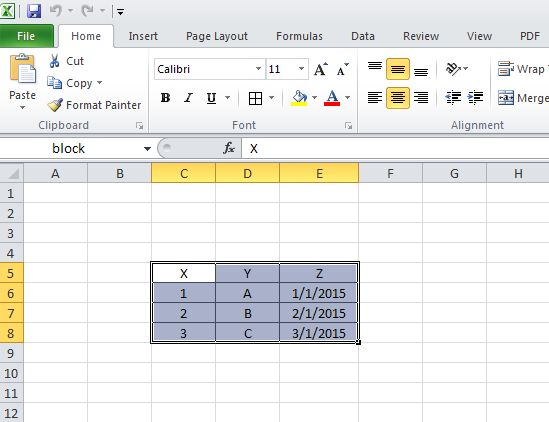

[Back to Index](../README.html)

## Overview

Like it or not, we need to extract data from Excel workbooks. These are
some tips I have collected.

## When what you know is the sheet, row, and column...

From [here](https://statcompute.wordpress.com/2015/05/10/read-a-block-of-spreadsheet-with-r/)



```
library(xlsx)
file <- loadWorkbook("path/test.xlsx")
df1  <- readColumns(getSheets(file)[[1]],
                    startColumn = 3, endColumn = 5,
                    startRow = 5, endRow = 8,
                    header = TRUE)
df1
#   X Y          Z
# 1 1 A 2015-01-01
# 2 2 B 2015-02-01
# 3 3 C 2015-03-01
```

## When you have a named range

From [here](https://statcompute.wordpress.com/2015/05/10/read-a-block-of-spreadsheet-with-r/)

If we can define a named range for the block in the worksheet, the
``XLConnect`` package might be more convenient. In the example below,
we first defined a range named as ``block`` within the spreadsheet and
then called this named range with ``readNamedRegionFromFile()``
function without the necessity of specifying rows and columns.

```
library(XLConnect)
df2 <- readNamedRegionFromFile("path/test.xlsx", "block")
df2
#   X Y          Z
# 1 1 A 2015-01-01
# 2 2 B 2015-02-01
# 3 3 C 2015-03-01

```


[Back to Index](../README.html)