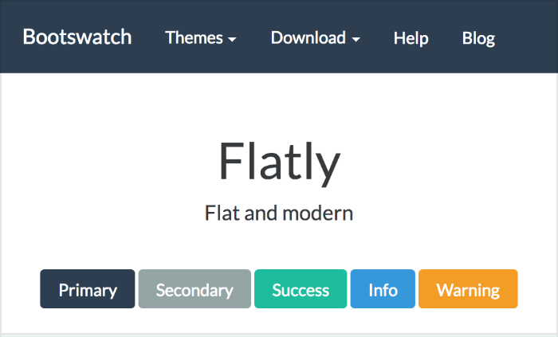
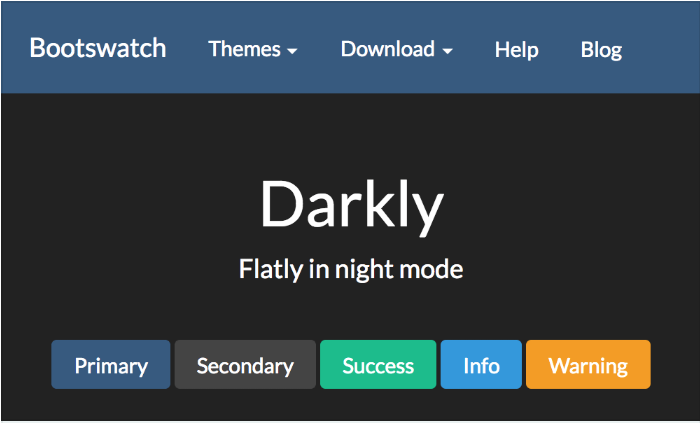
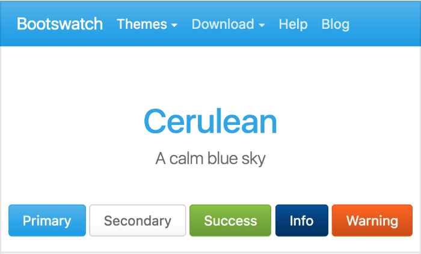

```{r setup, cache = F, echo = F, message = F, warning = F, tidy = F}
# make this an external chunk that can be included in any file
library(knitr)
library(ggplot2)
options(width = 72)
opts_chunk$set(message = F, error = F, warning = F, comment = NA,
               fig.align = 'center', dpi = 100, tidy = F,
               cache.path = '.cache/', fig.path = 'figure/')

options(xtable.type = 'html')
knit_hooks$set(inline = function(x) {
  if(is.numeric(x)) {
    round(x, getOption('digits'))
  } else {
    paste(as.character(x), collapse = ', ')
  }
})
knit_hooks$set(plot = knitr:::hook_plot_html)
```

[Back to Index](../README.html)

# Introduction

`knitrBootstrap` is a package developed by Jim Hester. The source is available
on [GitHub ](https://github.com/jimhester/knitrBootstrap). Jim describes it as:

> A framework to create bootstrap styled HTML reports from knitr Rmarkdown.

The package uses bootstrap `3.0` (as of 2019-03-04) the current version is `4.3`.
One can always check [here](https://getbootstrap.com/docs/versions/).

## Installation

Jim Hester notes that one can always install the development version of 
`knitrBootstrap` like this:

```
library(devtools)
install_github('rstudio/rmarkdown')
install.packages('knitr', repos = c('http://rforge.net',
                 'http://cran.rstudio.org'),
                 type = 'source')
install_github('jimhester/knitrBootstrap')
```

One can install the CRAN version like this:

```
install.packages('knitrBootstrap')
```


## Example YAML

Jim Hester provides this example YAML:

```
---
output:
  knitrBootstrap::bootstrap_document:
    title: "Test file"
    theme: amelia
    highlight: sunburst
    theme.chooser: TRUE
    highlight.chooser: TRUE
---

```

## Bootstrap themes

There are **many** bootstrap themes. There is a nice list at
[bootswatch.com](https://bootswatch.com/).

My favorites are:


1. **Flatly**

2. **Darkly**

3. **Cerulean**


There are also highlight themes. I like `GoogleCode`, `Github`, `Xcode`,
`Monokai`, and `Sunburst`.

See the example file [here](testKnitrBootstrap.Rmd).

[Back to Index](../README.html)
