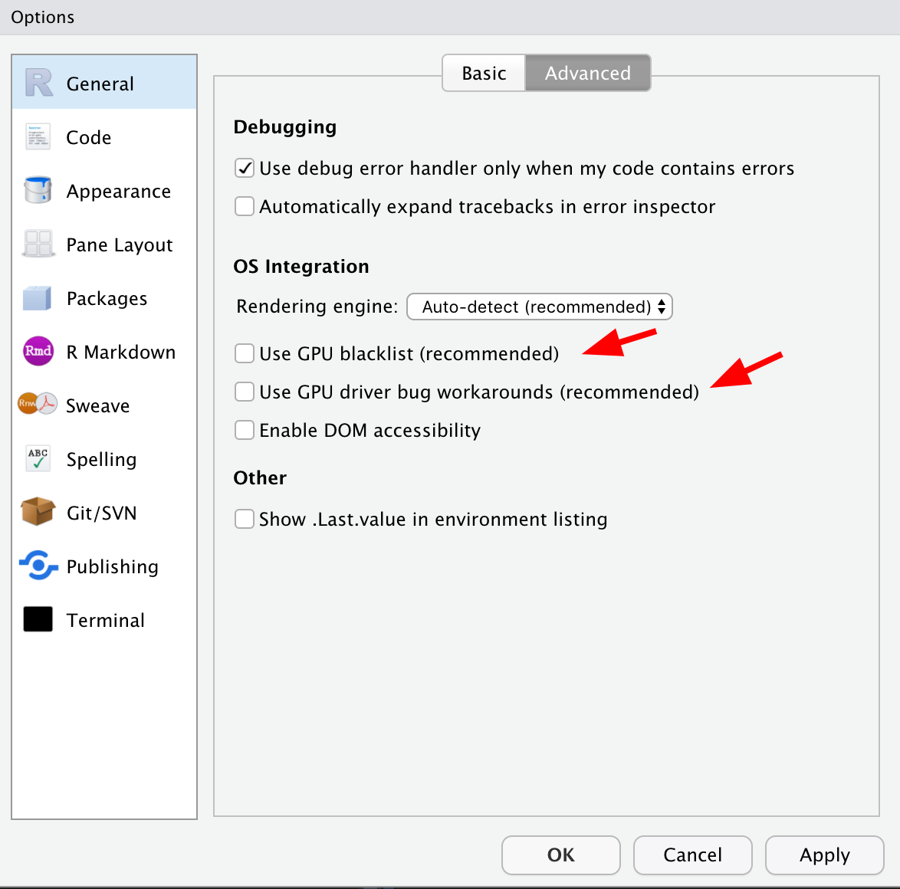

```{r setup, cache = F, echo = F, message = F, warning = F, tidy = F}
library(knitr)
# make this an external chunk that can be included in any file
options(width = 72)
# opts_chunk$set(message = F, error = F, warning = F, comment = NA, fig.align = 'center', dpi = 100, tidy = F, cache.path = '.cache/', fig.path = 'figure/')

options(xtable.type = 'html')
knit_hooks$set(inline = function(x) {
  if(is.numeric(x)) {
    round(x, getOption('digits'))
  } else {
    paste(as.character(x), collapse = ', ')
  }
})


knit_hooks$set(plot = knitr:::hook_plot_html)

# library(statshelpR)
# install_new("scales")
suppressPackageStartupMessages(library("tidyverse"))
```


[Back to Index](../README.html)

# Don't forget...

## Fixing pandoc access error on Windows

Use RStudio version `1.2.1186` (2018-12-10)
uses Pandoc 2.5. RStudio `1.2.1280` (2019-02-03)
which has an access error for long files.


## RStudio crashes on opening project

Seems to help to delete the `.Rproj.user` folder before opening. RStudio creates a 
new one as needed...

This is tracked in RStudio's [github](https://github.com/rstudio/rstudio/issues/4034)
repository. Kevin Ushey wrote me and suggested I **uncheck** two boxes in the
`Advanced General` pane.



## Issue with `-fopenmp`

See [nsaunders.wordpress.com](https://nsaunders.wordpress.com/2018/11/19/using-osx-compiling-an-r-package-from-source-issues-with-fopenmp-try-this/)

If you see an error like this

```
clang: error: unsupported option '-fopenmp'
make: *** [external_metis.o] Error 1
ERROR: compilation failed for package ‘TMB’
```
And you use Homebrew – first, do this:

```
brew install llvm
```

Then create the file `~/.R/Makevars`, if it does not exist and edit its
contents to look like this:

```
C=/usr/local/opt/llvm/bin/clang
CXX=/usr/local/opt/llvm/bin/clang++
```

Your R package should now compile without error. If it works as it
did for me :)


## Pandoc on macosx

The current version of R works besr with `pandoc-2.2.1`. I had that installed with miniconda but had some path issues. I created a copy in  $HOME/bin and put it first in the path in the `.Renviron` file. I have scripts to copy to/from Dropbox.

## Some great entries for the setup chunk

Add these to the `{r setup, include=FALSE}` chunk.
I learned this from an example by [drsimonj](https://github.com/drsimonj/tidyverse_tutorial-useR2018)
from the 2018 UseR tutorial on the `tidyverse`.

```
knitr::opts_chunk$set(echo=TRUE,
  comment = NA,
  fig.align = "centre",
  fig.height = 4,
  message = FALSE,
  warning = FALSE,
  error = FALSE)

```

## Key RStudio list files

RStudio keeps some very helpful lists. These are in the directory

```
$HOME/.rstudio-desktop/monitored/lists
```

on macOS and in 

```
%HOME%\AppData\Local\RStudio-Desktop\monitored\lists
```
on Windows(7).  These are **plain text files** and are easily edited.

- **project_mru**: text file with links to projects
- **file_mru**: list of recent files
- **help_history_links**: list of help queries
- **user_dictionary**:  list of terms not to flag in spell checker.


## How to understand the pipe (`%>%`) operator

The `tidyverse` pulls the pipe (`%>%`) operator from the `magritter`
package. Understanding it is often difficult at first. The best way
to read a sequence is to read the operator as **and then**. Note that
RStudio defines a keyboard shortcut `Ctrl+Shift+M` (Win) and  `CMD+Shift+M`
(Mac).

The examples came from a tutorial given by Simon Jackson at the
useR2018 conference. See the
[youtube video)](https://www.youtube.com/watch?v=E-Vvg8uzcVM)
and the [github repository](https://github.com/drsimonj/tidyverse_tutorial-useR2018).


```{r readPriceData, comment=NA}
library(tidyverse)
bookings <- read_csv("dat/bookings.csv")
# properties <- read_csv("dat/properties.csv")
bookings %>%
  filter(price_per_night < 80) %>% 
  select(room_nights, review_score) %>% 
  head(2)
```

Pipes are not new. Note that the Linux/Unix shell has been piping
commands for decades...

We don't need to create multiple objects and we can read the sequence
easily.

Another query from the `bookings` data.

> Write a data pipeline to get a tibble of the `property_id` and 
> `status` of all bookings made on a Wednesday.

```{r checkinWedData, comment=NA}
bookings %>%
  filter(checkin_day=='wed') %>% 
  select(property_id, status) %>% 
  head(5)
```

## Five tips to improve your R code

[drsimonj](https://drsimonj.svbtle.com/five-simple-tricks-to-improve-your-r-code)
has some great ways to improve R code. These include

### More fun to sequence from 1

- Sequence a vector

```{r seqVec, comment=NA}
x <- runif(10)
seq(x)
```

- Sequence an integer

```{r seqInt, comment=NA}
seq(nrow(mtcars))
```

### `vector()` what you `c()`

Next time you create an empty vector with `c()`, try to replace it with
`vector("type", length)`.

A numeric vector with 5 elements

```{r numVec, comment=NA}
vector("numeric", 5)
```

A character vector with 3 elements

```{r charVec, comment=NA}
vector("character", 3)
```

Doing this improves memory usage and increases speed!
You often know upfront what type of values will go into a vector,
and how long the vector will be. Using `c()` means R has to slowly
work both of these things out. So help give it a boost with `vector()`!

A good example of this value is in a for loop. People often write loops
by declaring an empty vector and growing it with `c()` like this:

```
{r slowVec, comment=NA}
x <- c()
for (i in seq(5)) {
  x <- c(x, i)
}

```

Instead, pre-define the type and length with vector(), and reference positions by index, like this:

```{r fastVec, comment=NA}
n <- 5
x <- vector("integer", n)
for (i in seq(n)) {
  x[i] <- i
}
```

Here's a quick speed comparison:

```
{r slowComp, comment=NA}

n <- 1e5

x_empty <- c()
system.time(for(i in seq(n)) x_empty <- c(x_empty, i))
```

```{r fastComp, comment=NA}
x_zeros <- vector("integer", n)
system.time(for(i in seq(n)) x_zeros[i] <- i)
```

That should be convincing enough!

### Ditch the which()

Next time you use `which()`, try to ditch it! People often use `which()`
to get indices from some boolean condition, and then select values at
those indices. This is not necessary.

Getting vector elements greater than 5:

```{r withWhich, comment=NA}
x <- 3:7
x[which(x > 5)]
```

```{r noWhich, comment=NA}
x <- 3:7
x[x > 5]
```

Or counting number of values greater than 5:

```{r withWhich2, comment=NA}
length(which(x > 5))
```

```{r noWhich2, comment=NA}
sum(x > 5)
```

Why should you ditch `which()`? It's often unnecessary and boolean
vectors are all you need.

For example, R lets you select elements flagged as `TRUE` in a
boolean vector:

```{r cond1, comment=NA}
condition <- x > 5
condition
```

```{r cond2, comment=NA}
x[condition]
```

Also, when combined with `sum()` or `mean()`, boolean vectors can be
used to get the count or proportion of values meeting a condition:

```{r sumCond, comment=NA}
sum(condition)
```

```{r meanCond, comment=NA}
mean(condition)
```

`which()` tells you the indices of `TRUE` values:

```{r shichCond, comment=NA}
which(condition)
```

And while the results are not wrong, it's just not necessary. For
example, I often see people combining `which()` and `length()` to test
whether any or all values are `TRUE`. Instead, you just need `any()` or
`all()`:

```{r tsetWhTwo, comment=NA}

x <- c(1, 2, 12)
if (length(which(x > 10)) > 0)
  print("At least one value is greater than 10")

# Wrapping a boolean vector with `any()`
if (any(x > 10))
  print("At least one value is greater than 10")

# Using `which()` and `length()` to test if all values are positive
if (length(which(x > 0)) == length(x))
  print("All values are positive")

# Wrapping a boolean vector with `all()`
if (all(x > 0))
  print("All values are positive")
```

Oh, and it saves you a little time...

```{r timeWhichTwo, comment=NA}
x <- runif(1e8)

print(system.time(x[which(x > .5)]))


print(system.time(x[x > .5]))
```
 
### Factor that factor!

Ever removed values from a factor and found you're stuck with old levels
that don't exist anymore? I see all sorts of creative ways to deal with
this. The simplest solution is often just to wrap it in `factor()` again.

This example creates a factor with four levels ("a", "b", "c" and "d"):

```{r fourLevfac, comment=NA}
# A factor with four levels
x <- factor(c("a", "b", "c", "d"))
x

plot(x)
```


If you drop all cases of one level ("d"), the level is still
recorded in the factor:

```{r dropfaLev, comment=NA}

# Drop all values for one level
x <- x[x != "d"]

# But we still have this level!
x
```

```{r plotX, comment=NA}
plot(x)
```

A super simple method for removing it is to use `factor()` again:

```{r fixFac, comment=NA}
x <- factor(x)
x
```

```{r plotX2, comment=NA}
plot(x)
```


This is typically a good solution to a problem that gets a lot of
people mad. So save yourself a headache and factor that factor!

Aside, thanks to Amy Szczepanski who contacted me after the original
publication of this article and mentioned `droplevels()`. Check it out
if this is a problem for you!

 
### First you get the `$`, then you get the power

Next time you want to extract values from a data.frame column where the
rows meet a condition, specify the column with `$` before the rows with
`[`.

**Examples**

Say you want the horsepower (`hp`) for cars with 4 cylinders (`cyl`),
using the `mtcars` data set. You can write either of these:

```{r cars1, comment=NA}
# rows first, column second - not ideal
mtcars[mtcars$cyl == 4, ]$hp
```

```{r cars2, comment=NA}
# column first, rows second - much better
mtcars$hp[mtcars$cyl == 4]
```

The tip here is to use the second approach.

But why is that?

First reason: do away with that pesky comma! When you specify rows
before the column, you need to remember the comma:
`mtcars[mtcars$cyl == 4,]$hp`. When you specify column first, this
means that you're now referring to a vector, and don't need the comma!

Second reason: speed! Let's test it out on a larger data frame:

Simulate a data frame...

```{r simDF, comment=NA}
n <- 1e7
d <- data.frame(
  a = seq(n),
  b = runif(n)
)
```


```{r testDF1, comment=NA}
# rows first, column second - not ideal
system.time(d[d$b > .5, ]$a)
```

```{r testDF2, comment=NA}
# column first, rows second - much better
system.time(d$a[d$b > .5])
```

Worth it, right?


## Key RStudio Project Settings

Tabs and spaces can be a **big** problem. The **tidyverse** and similar
projects use spaces for tabs and a 2 space equivalent. Below are my
current favorite project settings:

```
Version: 1.0

RestoreWorkspace: No
SaveWorkspace: No
AlwaysSaveHistory: Yes

EnableCodeIndexing: Yes
UseSpacesForTab: Yes
NumSpacesForTab: 2
Encoding: UTF-8

RnwWeave: knitr
LaTeX: XeLaTeX

BuildType: Package
PackageUseDevtools: Yes
PackageInstallArgs: --no-multiarch --with-keep.source
```


## Stop printing hashes

Use a chunk like this

```
{r cars, comment=NA, echo = TRUE}
summary(cars)
```

To not print hashes

```{r cars, comment=NA, echo = TRUE}
summary(cars)
```

## Easier Rounding

The brute force approach...

```{r bruteForce, comment=NA}
paste0(round(0.20394 * 100, 1), '%')
```

Use the `scales` package

```{r rounding, comment=NA}
library(scales)
percent(0.20394)
```

## Controlling images size in RMarkdown documents

Use a chunk like this

```
{r showImg,fig.width=7.5,echo=FALSE}

library(png)
library(grid)
manySampImg <- readPNG('inc/many-samples.png')
grid.raster(manySampImg)

```
That produces output like this

```{r showImg,fig.width=7.5,echo=FALSE}
library(png)
library(grid)
manySampImg <- readPNG('inc/many-samples.png')
grid.raster(manySampImg)
```

## Building R on Ubuntu 16.04

See [building from source](https://support.rstudio.com/hc/en-us/articles/218004217-Building-R-from-source)
and [changing versions](https://support.rstudio.com/hc/en-us/articles/200486138-Changing-R-versions-for-RStudio-desktop).

1. Need to enable source packages (edit  `/etc/apt/sources.list`). Then
run `sudo apt-get update`.

2. Install build dependencies. Run `sudo apt-get build-dep r-base`.

3. Build R

```
./configure --prefix=/home/jrminter/apps/R/3.5.1/ --enable-R-shlib --with-blas --with-lapack
make
make install
```

4. Make available to RStudio

From [here](https://askubuntu.com/questions/261760/setting-global-environment-variable-for-everyone)

In `.bashrc`

```
export RSTUDIO_WHICH_R="/home/jrminter/apps/R/3.5.1/bin/R"
```

In `/etc/environment` to make it system wide... I found I 
needed to set the TEMP environment too...

```
RSTUDIO_WHICH_R="/home/jrminter/apps/R/3.5.1/bin/R"
TEMP="/home/jrminter/tmp"
```


## Some hints on key packages

### From [Steph Locke](https://twitter.com/SteffLocke/status/990251709531344896)

My #rstats #datascience goto packages:

**IO**: odbc readxl httr    
**EDA**: DataExplorer    
**Prep**: tidyverse     
**Sampling**: rsample modelr    
**Feature Engineering**: recipes    
**Modelling**: glmnet h2o FFTrees    
**Evaluation**: broom yardstick    
**Deployment**: sqlrutils AzureML opencpu    
**Monitoring**: flexdashboard    
**Docs**: rmarkdown    

## Supress startup messages

I **really** like this one:

```{r supress.startup.messages}
suppressPackageStartupMessages(library("tidyverse"))
```

Might as well read the rest of the post that gave the idea and
learn the value of
[quasi-quotation](http://blog.jalsalam.com/posts/2017/quasi-quotation-applications/)
with the **tidyverse**.

## YAML for vignettes with numbered sections and a TOC

```
---
title: "The catchy title"
author: "John Minter"
date: "Started: 2018-05-01, Last updated: 2018-05-29"
output:
  rmarkdown::html_vignette:
    number_sections: true
    toc: true
    toc_depth: 2
vignette: >
  %\VignetteIndexEntry{The catchy title}
  %\VignetteEngine{knitr::rmarkdown}
  %\VignetteEncoding{UTF-8}
---

```

## Get key version information

```{r get.r.version}
R.version.string
```

```{r get.r.markdown.version}
packageVersion("rmarkdown")
```

Note that this will work from the command line in RStudio but not with knitr:

```
library(rstudioapi)
versionInfo()
```


## Get the .gitignore right...

[This](https://stackoverflow.com/questions/36185456/gitignored-files-still-shown-in-rstudio)
post on StackOverflow was **very** helpful. We want to ignore all the files in
`.Rproj.user` and the directories below. here is how you fix:

1. Remove what was previously committed

```
git rm -r --cached .Rproj.user/**
git commit -m "Removed files...."
```

2. Now add the right entry to **.gitignore**. Note the two asterics...

```
.Rproj.user/**
```


## Special symbols...

1. Use `demo(plotmath)` to see syntax for mathematical expressions.

2. Also look at `latex2exp` on [github](https://github.com/stefano-meschiari/latex2exp).

3. Use `bquote()`. Here are some tips based on a blog post
by [Tyler Rinker](https://trinkerrstuff.wordpress.com/2018/03/15/2246/)

- **Math notations require an expression or call**
See [Advanced R](http://adv-r.had.co.nz/Expressions.html) for details.
This [Stackoverflow](https://stackoverflow.com/questions/20355547/expression-vs-call)
question explains the difference between the two.

- **Use bquote:**  
**Strings**: Require quotes wrapped w/ tilde separator (e.g., "my text"  ~).  
**Math Expressions**: Unquoted & follow `?plotmath`.  
**Numbers**: Unquoted when part of math notation.  
**Variables**: Use `.()` (pass in string or numeric).

- An example using base graphics

```{r, bquoteBaseGraphics}
## A variable to pass in
cor <- -.321
cor2 <- '-.321'
 
par(mfrow = c(1, 2))
plot(1:10, 1:10, main = bquote("Hello" ~ r[xy] == .(cor) ~ "and" ~ B^2))
plot(1:10, 1:10, main = bquote("Hello" ~ r[xy] == .(cor2) ~ "and" ~ B^2))
```


- An example with `ggplot()` using Greek as well (suggested by
Julia Silge)

```{r, bquoteGGplot}
library(ggplot2)
cor2 <- '-.321'

df <- data.frame(x=1:10, y=1:10) 
plt <- ggplot() +
       geom_point(data=df, aes(x=x, y=y),  colour="darkblue") +
       scale_x_continuous(breaks = seq(from = 0, to = 10, by = 2),
                          limits = c(0, 10)) +
       scale_y_continuous(breaks = seq(from = 0, to = 10, by = 2),
                          limits = c(0, 10)) +
       xlab("x") +
       ylab("y") +
       ggtitle(bquote("Eq 1:" ~ y[i] == alpha + beta * x[i] + epsilon[i] ~ "or" ~ .(cor2))) +
       theme(axis.text=element_text(size=12),
       axis.title=element_text(size=12),
       plot.title=element_text(hjust = 0.5))

print(plt)
```


## To start Rserve

```
library(Rserve)
Rserve(args="--no-save")
```


## Get rJava packages to work

Use a call like this to unset `JAVA_HOME` so that the values in 
`R-3.4.x\etc\x64\Makeconf` and <br> 
`R-3.4.x\etc\i386\Makeconf`
are used:

```
if( Sys.info()['sysname'] == "Windows"){
	
	Sys.setenv(JAVA_HOME="")
	print("unset JAVA_HOME for Windows")
}

```

I had a terrible time getting `rcdk` to install....

I added this to `Rprofile.site` in 

```
C:\Apps\R\R-3.4.3\etc
```


## Vignettes

### To force building

#### Build locally

```
devtools::install(pkg = ".", build_vignettes = TRUE)
```
This builds and installs a binary package.

#### Build from github

```
devtools::install_github('jrminter/statshelpR',build_vignettes=TRUE)
```

### To browse
```
browseVignettes(package = NULL, lib.loc = NULL, all = TRUE)
e.g.
browseVignettes(package="statshelpR")

```


## Set the path in .Renviron on MacOSX

I needed this:

```
# Python 3.6
PATH=/Users/jrminter/miniconda3/bin:/Library/TeX/texbin:/usr/local/bin:/Users/jrminter/bin:/usr/bin:/bin:/usr/sbin:/sbin:/opt/X11/bin
LATEX=/usr/local/texlive/2017/bin/x86_64-darwin/pdflatex
WORK=/Users/jrminter/Documents/work
```

## Avoid rJava woes

Under windows, rJava needs to have **jvm.dll** in the path. On
my systems, it is best to add
**C:\\Apps\\Java64\\jre8\\bin\\server** to the path...

## Key R-Markdown resources

[R Notebooks](http://rmarkdown.rstudio.com/r_notebooks.html)

[Beamer presentations](http://rmarkdown.rstudio.com/beamer_presentation_format.html#overview)

[R Markdown v.2 home](http://rmarkdown.rstudio.com/index.html)

[Presentations in R Markdown with reveal.js](http://rmarkdown.rstudio.com/revealjs_presentation_format.html)

A cool tip from [A. Jonathan R. Godfrey](https://r-resources.massey.ac.nz/rmarkdown/):

> Get rid of those hash/number signs on the R output by using `comment=""` for all chunks that generate output.

For example, add it to the opening chunk

```
library(knitr)
opts_chunk$set(comment="")
```

## Changing dataframe column class

```
class(df$col) = "integer"
```

## How to use extra fonts

From the **Revolution Analytics** [blog](http://blog.revolutionanalytics.com/2012/09/how-to-use-your-favorite-fonts-in-r-charts.html)


1. Install the **extrafont** package

```
install.packages("extrafont")
```

2. Import the fonts into your system. This takes a few minutes... It loads the system fonts into extrafont's database

```
library(extrafont)
font_import()
```

3. See what fonts we have. I like **Open Sans Semibold**

```
fonts()
```

4. Get more detailed info

```
fonttable()
```

5. Create a PDF with fonts

```
cairo_pdf("plot-open-sans.pdf", family="Open Sans Semibold", width=9.0, height=6.0)

plot(mtcars$mpg, mtcars$wt, 
     main = "Fuel Efficiency of 32 Cars",
     xlab = "Weight (x1000 lb)",
     ylab = "Miles per Gallon")

dev.off()
```


or with **ggplot2**


```
library(extrafont)
loadfonts()
library(ggplot2)
p <- ggplot(mtcars, aes(x=wt, y=mpg)) + geom_point() +
     ggtitle("Fuel Efficiency of 32 Cars") +
     xlab("Weight (x1000 lb)") + ylab("Miles per Gallon") +
     theme_bw() +
     theme(text=element_text(family="Open Sans Extrabold", size=14))

ggsave("ggplot-open-sans-eb.pdf", p, width=9.0, height=6.0)

p <- ggplot(mtcars, aes(x=wt, y=mpg)) + geom_point() +
     ggtitle("Fuel Efficiency of 32 Cars") +
     xlab("Weight (x1000 lb)") + ylab("Miles per Gallon") +
     theme_bw() +
     theme(text=element_text(family="Open Sans Semibold", size=14))

ggsave("ggplot-open-sans-sb.pdf", p, width=9.0, height=6.0)
```

6. Embed the fonts in the PDF with **ghostscript**

```
Sys.setenv(R_GSCMD = "C:/Apps/gs/gs9.20/bin/gswin64c.exe")
embed_fonts("ggplot-open-sans-sb.pdf", outfile="ggplot-open-sans-sb-embed.pdf")
embed_fonts("ggplot-open-sans-eb.pdf", outfile="ggplot-open-sans-eb-embed.pdf")
```


## Other

[datascienceriot](https://www.datascienceriot.com/how-to-install-r-in-linux-ubuntu-16-04-xenial-xerus/kris/) shows how to install R and R-Studion on Ubuntu 16.04 Xenial Xerus.

RStudio - Tomorrow Night Bright theme is easy on the eyes. Monokai is somewhat better.

[rud.is](http://rud.is/b/2015/10/20/installing-r-on-os-x/) has a nice guide to installation on Mac OSX.

[Google](http://google-styleguide.googlecode.com/svn/trunk/Rguide.xml) has a nice R style guide.

R can be **really** frustrating at time. These are some
tips on matters that made me go *hmmm...*

# Hard things to find

# Adjustments for El Capitan

1. **Make changes to .Renviron** . This makes sure R (esp. RStudio) can find what it needs. Mine is:

```
PATH= /Library/TeX/texbin:/usr/local/bin:/Users/jrminter/scripts:/usr/bin:/bin:/usr/sbin:/sbin:/opt/X11/bin
LATEX=/usr/local/texlive/2015/bin/x86_64-darwin/pdflatex
```
2. **Make changes to .profile** This makes sure we can run make. Path is key. Mine uses environment variables and includes:

```
export PATH=/Library/TeX/texbin:/Library/Frameworks/R.framework/Versions/3.2/Resources/bin:/usr/local/bin:~/scripts:$PATH
export EDITOR="subl -n -w"
export JAVA_HOME=/Library/Java/JavaVirtualMachines/jdk1.8.0_60.jdk/Contents/Home
GIT_HOME=~/git
IMG_ROOT=~/dat/images
EDS_ROOT=~/dat/eds
export GIT_HOME
export IMG_ROOT
export EDS_ROOT
alias instR="R CMD INSTALL *.gz; rm -rf *.gz"
```


# Cool R-markdown Examples

[João Neto](http://www.di.fc.ul.pt/~jpn/r/) has some really nice examples. They plot as `.html` but one can change the extension to `.Rmd` to get the source.

# Speeding up compile on 64 bit R

From [here](http://www.rexamine.com/2015/07/speeding-up-r-package-installation-process/)

On many R installations, the build process is set up so that only one C/C++ source file is compiled at a time. Yet, there is a simple solution for that — we may ask GNU make to allow more than one job to be submitted at once. In order to do so, we edit the `/lib64/R/etc/Renviron` file (where `/lib64/R/etc/`) is the result to a call to the R.home() function in R) and set:

```
MAKE='make -j 8' # submit 8 jobs at once
```
instead of previously used settings. This significantly decreases the time needed to compile.

# Configuring local soft on Windows.

HT [stewid](https://github.com/ropensci/git2r/issues/139#issuecomment-101176755)

See [this](http://www.stats.ox.ac.uk/pub/Rtools/libs.html) for how
to configure `LOCAL_SOFT`.

I created `C:/Apps/R/local/local320` and unzipped `local320.zip` and
`spatial320.zip` there and set `LOCAL_SOFT` in `etc/{i386,x64}/Makeconf` (line 30)
files in the binary distribution. This means I could add other versions
accordingly.

# git2r for WinXP

HT [stewid](https://github.com/ropensci/git2r/issues/139#issuecomment-101176755)

> git2r is an interface to the libgit2 library. Since libgit2 dropped support for Windows XP with the v0.21.0 release, git2r can not support Windows XP.

> @jrminter you only need zlib on Windows, no need for openssl. If you have installed Rtools and configured LOCAL_SOFT, it should work to install with:

```
git clone https://github.com/ropensci/git2r.git
cd git2r
make
```


# Using Hmisc LaTeX functions without Miktex

TexLive does not include the expected Windows dvi viewer `yap` which is standard with Miktex and is expected on Windows with Hmisc. The workaround is to use the `option` command. Try this solution that will write a tex file in the `$TEMP` directory. *Note:* one must manually close the `dviout` window for the script to continue.

```{r, message=FALSE}
library(Hmisc)
wd <- getwd()
tmp <- Sys.getenv("TEMP")
if(tmp==""){
  tmp ="/home/jrminter/tmp"
}
setwd(tmp)
x <- matrix(1:6, nrow=2,
            dimnames=list(c('a','b'),c('c','d','this that')))

if(Sys.info()['sysname'] == "Windows"){
  options(xdvicmd='dviout.exe')
}
# This will display the file (and work...)
#
# latex(x, file='matrix.tex')
#
# we can supress display by specifying the file and storing the
# result in an object...
ignore <- latex(x, file='matrix.tex')
setwd(wd)
```

# Upgrade packages after new verion

```
update.packages(checkBuilt=TRUE, ask=FALSE)
```

# Some hints from Karl Broman for mac

from [Stack Overflow](https://github.com/kbroman/ProgrammingNotes)

## installing gfortran

```
cd ~/Desktop
wget http://r.research.att.com/libs/gfortran-4.8.2-darwin13.tar.bz2
sudo tar fxz ~/Desktop/gfortran-4.8.2-darwin13.tar.bz2 -C /
```

Place in `~/.R/config`:

```
CC=clang
CXX=clang++
F77=gfortran-4.8
FC=$F77
OBJC=clang
```

Also, place in `~/.R/Makevars`:

```
CFLAGS=-g -O2 -Wall -pedantic
CXXFLAGS=-g -O2 -Wall -pedantic
```

# Crash when using knitr

Make certain that

```{r}
library(knitr)
```

is in the first chunk calling R


# Data corruption in R 3.0.2 when using read.csv

From [John Myles White](http://www.johnmyleswhite.com/notebook/2014/01/29/data-corruption-in-r-3-0-2-when-using-read-csv/) 

He notes:

> It may be old news to some, but I just recently discovered that the automatic type inference system that R uses when parsing CSV files assumes that data sets will never contain 64-bit integer values.

> Specially, if an integer value read from a CSV file is too large to fit in a 32-bit integer field without overflow, the column of data that contains that value will be automatically converted to floating point. This conversion will take place without any warnings, even though it may lead to data corruption.

> The reason that the automatic conversion of 64-bit integer-valued data to floating point is problematic is that floating point numbers lack sufficient precision to exactly represent the full range of 64-bit integer values. As a consequence of the lower precision of floating point numbers, two unequal integer values in the input file may be converted to two equal floating point values in the data.frame R uses to represent that data. Subsequent analysis in R will therefore treat unequal values as if they were equal, corrupting any downstream analysis that assumes that the equality predicate can be trusted.

# Web scraping

Hadley Wickham recommend [selector gadget](http://selectorgadget.com/) as an aid to web scraping.

# Tables from knitr and Rmarkdown in RStudio


This used to work when using options to the R chunk
of ` echo=FALSE, results='asis' `

```
library(xtable)
slope <- rbind(sum.fit.l$coef, sum.fit.k$coef)
disp <- c("s","g", "g", "f", "g")
dig  <- c(0,4,2,2,2)
rownames(slope) <- c("Cu L", "Cu K")
xt <- xtable(slope, digits=dig, display=disp)
print(xt, type='html')
```

but it no longer does. The `pander` packages seems to work

```
n <- 100
x <- rnorm(n)
y <- 2*x + rnorm(n)
out <- lm(y ~ x)
library(pander)
# panderOptions("digits", 2)
pander(out)
```
as does this

```
df <- cars[1:4,]
pander(df)
```

# Using custom environment variables
Custom environment variables are helpful in standardizing relative
paths across systems. On Linux and MacOSX (using bash,)
I set these in ``.profile``

```
GIT_HOME=~/git
IMG_ROOT=~/dat/images
export GIT_HOME
export IMG_ROOT
```
In Windows, I set these as user environment variables.
Note that in Windows, I set one more like:

```
GITHOME C:\Users\jrminter\git
```
And on win32, I change

```
TEMP c:\Temp\tmp
```
Because the usual ``Documents and Settings\\username\\...`` path gets too 
long for building some R packages (like tikzDevice).

Note the windows path format (I hate backslashes.)
What were you thinking, Bill Gates??? BTW - what is wrong with short
path names like usr, bin, tmp ???

This lets me use a command file
to
```
cd %GITHOME%
```

This was useful in the command file
``__install-all-jrm-r-pkgs.cmd`` that I use to
install the latest version of my R-packages
from my git repository.

Running R from the terminal picks these up, but in Linux and MacOSX,
RStudio doesn't (not sure why it does on Windows). The work-around
is to use the r-environment file. 

On Linux, the site r-environment file is in:
```
$R_HOME/lib/R/etc/Renviron
```
On MacOSX with homebrew, this is in:
```
/Library/Frameworks/R.framework/Resources/etc/Renviron
```
This is a good place to set environment variables...

Then in R, one gets

```{r}
print(Sys.getenv("GIT_HOME"))
print(Sys.getenv("GITHOME"))
print(Sys.getenv("IMG_ROOT"))

```
# LaTeX in R Plots

## latexexp

This is from [here](http://www.magesblog.com/2015/07/adding-mathematical-notations-to-r-plots.html) and was accessed 2015-07-07.

One needs to remember to escape the `"\"` character, that is write `"\\"` instead of `"\"`.

```{r, fig.width=7.5, fig.height=7.5}
library(latex2exp)
x <- seq(-4, 4, len = 101)
y <- cbind(sin(x), cos(x))
 
op=par(mfrow=c(2,1))
# plotmath
matplot(x, y, type = "l", xaxt = "n",
        main = expression(paste("plotmath: ", plain(sin) * phi, "  and  ",
                                plain(cos) * phi)),
        ylab = expression("sin" * phi, "cos" * phi), # only 1st is taken
        xlab = expression(paste("Phase Angle ", phi)),
        col.main = "blue")
axis(1, at = c(-pi, -pi/2, 0, pi/2, pi),
     labels = expression(-pi, -pi/2, 0, pi/2, pi))
 
# latex2exp
matplot(x, y, type = "l", xaxt = "n",
        main = latex2exp("latex2exp: $\\sin \\phi$ and $\\cos \\phi$"),
        ylab = latex2exp("$\\sin \\phi$ and $\\cos \\phi$"),
        xlab = latex2exp("Phase Angle $\\phi$"),
        col.main = "blue")
axis(1, at = c(-pi, -pi/2, 0, pi/2, pi),
     labels = sapply(c("$-\\pi$", "$-\\pi/2$", 
                        "0", "$\\pi/2$", "$\\pi$"),
                     latex2exp))
par(op)
```

## TikzDevice

The tikzDevice R package is again being maintained and is back on CRAN.
This permits you to output a plot as a `.tex` file and have full $\LaTeX$
text. Here is an example. First we create the file `normDist.R` to output
the tikzpicture file as `normDist.tex`.

```
library(tikzDevice)

setwd('C:/Temp')

tikz('normDist.tex', width=7, height=7)
# Normal distribution curve
x <- seq(-4.5,4.5,length.out=100)
y <- dnorm(x)

# Integration points
xi <- seq(-2,2,length.out=30)
yi <- dnorm(xi)

# plot the curve
plot(x,y,type='l',lwd=3,col='red',ylab='\\Large{$p(x)$}',xlab='\\Large{$x$}')
# plot the panels
lines(xi,yi,type='s')
lines(range(xi),c(0,0))
lines(xi,yi,type='h')

#Add some equations as labels
title(main="\\LARGE{$p(x)=\\frac{1}{\\sqrt{2\\pi}}e^{-\\frac{x^2}{2}}$}")
int <- integrate(dnorm,min(xi),max(xi),subdivisions=length(xi))
text(2.8, 0.3, paste("\\Large{$\\displaystyle\\int_{", min(xi),
                     "}^{", max(xi), "}p(x)dx\\approx", round(int[['value']],3),
                     '$}', sep=''))

#Close the device
dev.off()


# this line lets one input the file...
str.ei <- '\\endinput'
cat(str.ei, file='normDist.tex', sep='\n', append=TRUE)
```

One can then simply include the file in the main $\LaTeX$ file

```
\input{"normDist.tex"}
```

# Using colClasses when reading data into R

[Mollie's Research Blog](http://www.mollietaylor.com/2013/09/using-colclasses-to-load-data-more.html)

Specifying a colClasses argument to read.table or read.csv can save time
on importing data, while also saving steps to specify classes for each
variable later.

```
largeData <- read.csv("huge-file.csv",
                      header = TRUE,
                      colClasses = c("character", "character", "complex",
                      "factor", "factor", "character", "integer", 
                      "integer", "numeric", "character", "character",
                      "Date", "integer", "logical"))
```

# Reading Excel workbooks

[Milano R net](http://www.milanor.net/blog/?p=779)
has a nice description of the available options.

# Reading large data tables

[Stack Overflow](http://stackoverflow.com/questions/1727772/quickly-reading-very-large-tables-as-dataframes-in-r)
has a nice example highligting fread

```
library(data.table)
# Demo speedup
n=1e6
DT = data.table( a=sample(1:1000,n,replace=TRUE),
                 b=sample(1:1000,n,replace=TRUE),
                 c=rnorm(n),
                 d=sample(c("foo","bar","baz","qux","quux"),n,replace=TRUE),
                 e=rnorm(n),
                 f=sample(1:1000,n,replace=TRUE) )
DT[2,b:=NA_integer_]
DT[4,c:=NA_real_]
DT[3,d:=NA_character_]
DT[5,d:=""]
DT[2,e:=+Inf]
DT[3,e:=-Inf]
standard read.table
write.table(DT,"test.csv",sep=",",row.names=FALSE,quote=FALSE)
cat("File size (MB):",round(file.info("test.csv")$size/1024^2),"\n")    
# File size (MB): 51 

system.time(DF1 <- read.csv("test.csv",stringsAsFactors=FALSE))        
#    user  system elapsed 
#   24.71    0.15   25.42
# second run will be faster
system.time(DF1 <- read.csv("test.csv",stringsAsFactors=FALSE))        
#    user  system elapsed 
#   17.85    0.07   17.98
```

# optimized read.table
```
system.time(DF2 <- read.table("test.csv",header=TRUE,sep=",",quote="",  
                          stringsAsFactors=FALSE,comment.char="",nrows=n,                   
                          colClasses=c("integer","integer","numeric",                        
                                       "character","numeric","integer")))


#    user  system elapsed 
#   10.20    0.03   10.32
```

# fread
```
require(data.table)
system.time(DT <- fread("test.csv"))                                  
 #    user  system elapsed 
#    3.12    0.01    3.22
```

# sqldf
```
require(sqldf)

system.time(SQLDF <- read.csv.sql("test.csv",dbname=NULL))             

#    user  system elapsed 
#   12.49    0.09   12.69
```

# sqldf as on SO
```
f <- file("test.csv")
system.time(SQLf <- sqldf("select * from f", dbname = tempfile(), file.format = list(header = T, row.names = F)))

#    user  system elapsed 
#   10.21    0.47   10.73
```

# ff / ffdf

```
require(ff)

system.time(FFDF <- read.csv.ffdf(file="test.csv",nrows=n))   
#    user  system elapsed 
#   10.85    0.10   10.99
```

# summary

```
#    user  system elapsed  Method
#   24.71    0.15   25.42  read.csv (first time)
#   17.85    0.07   17.98  read.csv (second time)
#   10.20    0.03   10.32  Optimized read.table
#    3.12    0.01    3.22  fread
#   12.49    0.09   12.69  sqldf
#   10.21    0.47   10.73  sqldf on SO
#   10.85    0.10   10.99  ffdf
```

# Colored sizeplot with ggplot2

[martinsbioblogg](http://martinsbioblogg.wordpress.com/2013/11/17/using-r-coloured-sizeplot-with-ggplot2/)

```{r}
library(ggplot2)
library(reshape2)
data <- data.frame(x=c(0, 0, 0, 0, 1, 1, 2, 2, 3, 3, 4, 4),
                   y=c(0, 0, 0, 3, 1, 1, 1, 2, 2, 1, 4, 4),
                   group=c(rep(1, 6), rep(2, 4), rep(3, 2)))
counts <- melt(table(data[1:2]))
colnames(counts) <- c(colnames(data)[1:2], "count")
counts <- subset(counts, count != 0)
counts.and.groups <- merge(counts, unique(data))
sizeplot.colour <- qplot(x=x, y=y, size=count, colour=factor(group), data=counts.and.groups) + scale_size(range=c(5, 10))

sizeplot.colour

```

# Least Squares and Maximum Liklihood Calibration
[Édouard Tallent](http://quantcorner.wordpress.com/2013/11/17/least-squares-and-maximum-likelihood-estimation-calibration-with-r/)

```{r}
# Least Squares Calibration
# Please see http://www.sitmo.com/article/calibrating-the-ornstein-uhlenbeck-model/

S <- c(3, 1.76, 1.2693, 1.196, 0.9468,
        0.9532, 0.6252, 0.8604, 1.0984,
        1.431, 1.3019, 1.4005, 1.2686,
        0.7147, 0.9237, 0.7297, 0.7105,
        0.8683, 0.7406, 0.7314, 0.6232)
n <- 20
delta <- 0.25

Sx <- sum(S[1:length(S)-1])
Sy <- sum(S[2:length(S)])
Sxx <- crossprod(S[1:length(S)-1], S[1:length(S)-1])
Sxy <- crossprod(S[1:length(S)-1], S[2:length(S)])
Syy <- crossprod(S[2:length(S)], S[2:length(S)])

a  <- (n*Sxy - Sx * Sy ) / ( n * Sxx - Sx^2 )
b  <- (Sy - a * Sx ) / n
sd <- sqrt((n * Syy - Sy^2 - a * (n * Sxy - Sx * Sy)) / (n * (n-2)))

lambda <- -log(a)/delta
mu <- b/(1-a)
sigma <- sd * sqrt( -2*log(a)/delta/(1-a^2))

res <- c(lambda, mu, sigma)
names(res) <- c("lambda", "mu", "sigma")

res

```


```{r}
# Maximum Likelihood Calibration
# PLease, see http://www.sitmo.com/article/calibrating-the-ornstein-uhlenbeck-model/

S <- c(3, 1.76, 1.2693, 1.196, 0.9468,
        0.9532, 0.6252, 0.8604, 1.0984,
        1.431, 1.3019, 1.4005, 1.2686,
        0.7147, 0.9237, 0.7297, 0.7105,
        0.8683, 0.7406, 0.7314, 0.6232)
n <- 20
delta <- 0.25

Sx <- sum(S[1:length(S)-1])
Sy <- sum(S[2:length(S)])
Sxx <- crossprod(S[1:length(S)-1], S[1:length(S)-1])
Sxy <- crossprod(S[1:length(S)-1], S[2:length(S)])
Syy <- crossprod(S[2:length(S)], S[2:length(S)])

mu  <- (Sy * Sxx - Sx * Sxy) / (n* (Sxx - Sxy) - (Sx^2 - Sx*Sy) )
lambda <- -log((Sxy - mu * Sx - mu * Sy + n * mu^2) /   (Sxx - 2 * mu * Sx + n * mu^2)) / delta
a <- exp(-lambda*delta)
sigmah2 <- (Syy - 2 * a * Sxy + a^2 * Sxx - 2 * mu * (1-a) * (Sy - a * Sx) + n * mu^2 * (1 - a)^2)/n
sigma <- sqrt(sigmah2 * 2 * lambda / (1 - a^2))

res <- c(lambda, mu, sigma)
names(res) <- c("lambda", "mu", "sigma")

res
```


# Mathematical annotation

# Resources
[Vistat Blog](http://vis.supstat.com/2013/04/mathematical-annotation-in-r/)

# Adding results to plot legends and saving to PDF
I like to add values to calibration plots where I have
computed the mean and standard error. Getting the $\pm$
symbol to work on multiple platforms was fun. Note the
``legend`` command.

The other issue is to be able to save a given plot in the
graphics window to a pdf without repeating the plot. The
``dev.copy2pdf`` command comes to the rescue. Note the code
following the plot. The grDevices exemplar warns:

> Note that these functions copy the device region and
> not a plot: the background colour of the device surface
> is part of what is copied. Most screen devices default
> to a transparent background, which is probably not what
> is needed when copying to a device such as png.

```{r, fig.width=4, fig.height=4}
cal.mu <- 5.01
cal.se <- 0.02
cal.un <- "nm/px"
x <- 1:10
y <- 5.01*x
plot(x,y)
abline(a=0,b=cal.mu, col='red')
legend("topleft",legend=bquote("calib:" ~ .(cal.mu) %+-% .(cal.se) ~ .(cal.un)))

str.pdf <-paste0("./figure/foo.pdf")
pdf.options(useDingbats=TRUE)
dev.copy2pdf(file="temp.pdf", width=9,
             height=6, pointsize=12)
embedFonts("temp.pdf","pdfwrite", str.pdf)
unlink("temp.pdf")
```
Note that I had odd results with this from R-Studio as
a function of window size. Especially when using Sweave,
I found it helpful to just write a controlled pdf and
from an R script and load/plot from Sweave in the report.

# An example from a R Script
```
my.plot.wrapper <- function(){
  #             B    L    T    R
  std.mar <- c(5.1, 4.1, 4.1, 2.1)
  plt.mar <- c(5.1, 4.1, 0.1, 0.1)
  par(mar=plt.mar)
  x <- 1:10
  y <- 1.5*x+2
  plot(x,y,xlab="X", ylab="Y")
  par(mar=std.mar)
}

# for the graphics window
my.plot.wrapper()

# second time for the pdf
str.pdf <- '../Sweave/inc/foo.pdf'
pdf.options(useDingbats=TRUE)
# note control of w and h and point size
pdf(file="temp.pdf", width=9, height=6, pointsize=14)
my.plot.wrapper()
dev.off()
embedFonts("temp.pdf","pdfwrite", str.pdf)
unlink("temp.pdf")
  
```

Then from LaTeX (e.g. in a beamer template)

```
\begin{frame}{\normalsize{Title}}
  \begin{center}
    \vspace{-0.35in}
    \includegraphics[width=\textwidth]
    {./inc/foo.pdf} \\
    \vspace{0.05in}
  \end{center}
  \vspace{-0.25in}
  \footnotesize{Note how I can control placement better.}
\end{frame}
```

# Tricks with sapply and friends

# A nice example via RBloggers

From [rforwork.info](http://rforwork.info/2013/08/15/sapply-is-my-new-friend/)

There are a couple of cases so far where I've found that sapply really comes in handy for me:

1. If I want to quickly see some descriptive stats for multiple columns in my dataframe. For example, the following would show me the medians of columns 10 through 20, displaying the column names above each median value.

    ```
sapply(mydf[,10:20], median, na.rm=true)
```


2. If I want to apply the same function to multiple vectors in my dataframe, modifying them in place. I oftentimes have count variables that have NA values in place of zeros. I made a "zerofy" function to add zeros into a vector that lacks them. So, if I want to use my function to modify these count columns, I can do the following, Which then replaces the original data in columns 30 through 40 with the modified data! Handy! 

    ```
mydf[,30:40] = sapply(mydf[,30:40], zerofy)
```


# Nice examples from Vistat

We can get a good list of symbols with

``demo(plotmath)``

```{r}
par(mar = c(4, 4, 2, 0.1))
plot(rnorm(100), rnorm(100),
  xlab = expression(hat(mu)[0]), ylab = expression(alpha^beta),
  main = expression(paste("Plot of ", alpha^beta, " versus ", hat(mu)[0])))

```

and

```{r}
par(mar = c(4, 4, 2, 0.1))
x_mean <- 1.5
x_sd <- 1.2
hist(rnorm(100, x_mean, x_sd),
  main = substitute(
    paste(X[i], " ~ N(", mu, "=", m, ", ", sigma^2, "=", s2, ")"),
    list(m = x_mean, s2 = x_sd^2)
  )
)

```
# Polygons

From [Daniel Marcelino](http://danielmarcelino.com/advanced-graphics/)
```{r}
# Generate standard normal distribution data for (-5,5)
x = seq(-5,5, length=250)
y = dnorm(x)
# Set up axes with empty plot
plot(x,y, las=1, ylab='dnorm', type='n', yaxs='i', ylim=c(0, 0.5))
# Generate data for the right tail
x2 = seq(qnorm(0.95), 5, length=50)
y2 = dnorm(x2)
# Draw the polygon
polygon(c(x2[1], x2, x2[length(x2)]),  c(0, y2, 0), border=NA, col='grey')
# For the left tail
# but for 2-sided, I think we use alpha/2 and 1-alpha/2
# x3 = seq(-5, qnorm(0.05), length=50)
# y3 = dnorm(x3)
# polygon(c(x3[1], x3, x3[length(x3)]),  c(0, y3, 0), border=NA, col='grey')
lines(x, y)

 
lines(c(2.5, 2.1), c(0.1, 0.02))
text(2.5, 0.115, expression(alpha==0.05))
# For the left tail
# lines(c(-2.5, -2.1), c(0.1, 0.02))
# text(-2.5, 0.115, expression(alpha==-0.05))
# dev.copy(jpeg, 'polygon.jpeg') # save plot as .jpeg
#dev.off()
```

# Drawing 95% Confidence intervals
[Natan Lemoine](http://climateecology.wordpress.com/2013/08/05/drawing-a-95-confidence-interval-in-r/) notes:

I'm writing a post on how to draw a in 95% confidence interval in R by hand. I spent an hour or so trying to figure this out, and most message threads point someone to the ellipse() function. However, I wanted to know how it works.

The basic problem was this. Imagine two random variables with a bivariate normal distribution, called y, which is an n x 2 matrix with n rows and 2 columns. The random variables are described by a mean vector mu and covariance matrix S. The equation for an ellipse is:

$(y – mu) S^1 (y – mu)' = c^2$

The number $c^2$ controls the radius of the ellipse, which we want to extend to the 95% confidence interval, which is given by a chi-square distribution with 2 degrees of freedom. The ellipse has two axes, one for each variable. The axes have half lengths equal to the square-root of the eigenvalues, with the largest eigenvalue denoting the largest axis. A further description of this can be found in any multivariate statistics book (or online).

To calculate the ellipse, we need to do a few things:
1. convert the variables to polar coordinates,
2. extend the new polar variables by the appropriate half lengths (using eigenvalues),
3. rotate the coordinates based on the variances and covariances, and 
4. move the location of the new coordinates back to the original means. This will make more sense when we do it by hand.

First, generate some data, plot it, and use the ellipse() function to make the 95% confidence interval. This is the target interval (I use it to check myself. If my calculations match, hooray. If not, I screwed up).

```{r}
library(mvtnorm) # References rmvnorm()
library(ellipse) # References ellipse()
set.seed(17)
 
# Set the covariance matrix
sigma2 <- matrix(c(5, 2, 2, 5), ncol=2)
 
# Set the means
mu <- c(5,5)
 
# Get the correlation matrix
P <- cov2cor(sigma2)
 
# Generate the data
p <- rmvnorm(n=50, mean=mu, sigma=sqrt(sigma2))
 
# Plot the data
plot(p)
 
# Plot the ellipse
lines( ellipse( P, centre = c(5,5)) , col='red')
```

Second, get the eigenvalues and eigenvectors of the correlation matrix.

```{r}
evals <- eigen(P)$values
evecs <- eigen(P)$vectors
```

Third, make a vector of coordinates for a full circle, from 0 to 2*pi and get the critical value ($c^2$).

```{r}
# Angles of a circle
a <- seq(0, 2*pi, len=100)
 
# Get critical value
c2 <- qchisq(0.95, 2)
c <- sqrt(c2)
```

The vector A above are angles that describe a unit circle. The coordinates of a unit circle are found by $x = cos(a)$ and $y = sin(a)$ (use trigonometry of a triangle to get this, where the hypotenuse = 1). We need to extend the unit circle by the appropriate lengths based on the eigenvalues and then even more by the critical value.

```{r}
# Get the distances
xT <- c * sqrt(evals[1]) * cos(a)
yT <- c * sqrt(evals[2]) * sin(a)
 
M <- cbind(xT, yT)
```

If you plot M, you'll get an ellipse of the appropriate axes lengths, but centered on 0 and unrotated. Rotate the ellipse using the eigenvectors, which describe the relationships between the variables (more appropriately, they give the directions for the vectors of the major axes of variation). Use the equation u*M' (write this out to see why this works).

```{r}
# Covert the coordinates
transM <- evecs %*% t(M)
transM <- t(transM)
```

The final step is to move the rotated ellipse back to the original scale (centered around the original means) and plot the data.

```(r)
lines(transM + mu)
```

This gives the following plot, with the red line being the output from the ellipse() function.

And that's that! Hopefully this helps someone like me who spent hours looking but couldn't find anything.


# Confidence levels and intervals.

# Confidence levels and intervals in lm fits

This one bit me recently.... Remember that if we want
the $\alpha$ confidence interval, R will report the
values at $(\alpha/2)$ and $(1-\alpha/2)$

Let's do a linear model fit from everybody's favorite
data set, **cars**

```{r}
# do the linear model
fit <- lm(100/mpg ~ disp + hp + wt + am, data=mtcars)
# look at the default 95% confidence intervals
confint(fit, level=0.95)
# and now look at 90% confidence intervals
confint(fit, level=0.90)

```

# Graphics tips

# A nice example from Jeff Leek:

[A useful reference (www.statmethods.net)](http://www.statmethods.net/advgraphs/axes.html)

```{r fig.width=6, fig.height=6}
load('./dat/movies.rda')
# Note the use of jitter on the factor axis...
# and note that the option axes=FALSE suppresses both x and y axes.
# xaxt="n" and yaxt="n" suppress the x and y axis respectively.
plot(movies$score ~ jitter(as.numeric(movies$rating)),
     col="blue",xaxt="n",pch=19)
# note how Jeff labeled the factor variables
axis(side=1,at=unique(as.numeric(movies$rating)),
     labels=unique(movies$rating))
# use of tapply to compute the means
meanRatings <- tapply(movies$score,movies$rating,mean)
points(1:4,meanRatings,col="red",pch="-",cex=5)
```

# RMySQL

# Building on Windows

Note: this works on WinXP and Win7 x64.

1. Download the
   ``mysql-connector-c-6.1.0-win32.msi`` (or ``-win64.msi``)
   installer.
2. Install it. Choose a custom install and install it to
   ``C:\Apps\MySQL\Connector\``. This gets around spaces in
   file names. There is a good workaround for win32, but it
   didn't work in Win7 x64...
3. Pull the RMySL source code from CRAN and unzip it.
4. Edit the RMySQL/src/Makevars.win32 (and .win64) so that
   the build process looks for the DLL in
   ``"${MYSQL_HOME}"/lib/libmySQL.dll``
5. Clean the cruft out of the source directory: ``*.0``,
   ``*.so``, ``*.rds``, ``*.rda``, ``*.dll``. 
6. Zip up the whole source tree with 7-zip so you don't
   have to do this again... 
7. set the ``MYSQL_HOME`` variable to
   ``C:/Apps/MySQL/Connector``
8. Build RMySQL ``R CMD build RMySQL``
9. Install ``R CMD INSTALL RMySQL_0.9-3.tar.gz``

Not sure why I get a warning message about the version
of MySQL. Haven't found it in the code...

An example to query MIDB...

```
require(RMySQL)

drv <- dbDriver("MySQL") 
con <- dbConnect(drv, user="myid",
                 password="mypw",
                 dbname="midb",
                 host="midb.rl.kodak.com")

ans <- dbListTables(con)

q1 <- "SELECT * FROM"
q2 <- "samples"
q3 <- "WHERE samples.LAB_ID = 'QM-03877' "

res <- dbSendQuery(con, paste(q1,
                              q2,
                              q3))
out <- fetch(res, n = -1)

print(out)
dbClearResult(res)
dbDisconnect(con)
dbUnloadDriver(drv)
```

# R and C/C++

# Rboolean type and obsolete headers

On 2013-05-24, Jan van der Laan wrote the r-devel mailing
list noting some problems when trying to pass an an argument
of type Rboolean to a function. He supplied the following
reproducible example.

```
// foo.cpp
#include <R.h>
#include <Rdefines.h>

void foo() {
   Rboolean b = TRUE;
}

```

Prof Brian Ripley (ripley@stats.ox.ac.uk) replied

> Don't use Rdefines.h: use Rinternals.h.

> Rdefines.h was for compatibility with S code from
> the 1990s: it is not kept up to date.

# Heat maps
# Correlation heatmap with ggplot2

from [Martin Johnsson](http://martinsbioblogg.wordpress.com/2013/03/21/using-r-correlation-heatmap-with-ggplot2/)

Just a short post to celebrate that I learned today how incredibly easy
it is to make a heatmap of correlations with ggplot2 (and reshape2, of
course).:

```{r fig.width=7, fig.height=6}
data(attitude)
require(ggplot2)
require(reshape2)
qplot(x=Var1, y=Var2, data=melt(cor(attitude)), fill=value, geom="tile")
```

# Alchemy

# Compiling an Rmath dynamic library
[Dirk Eddelbuettel](http://r.789695.n4.nabble.com/R-Rmath-R-libraries-from-C-on-Mac-OS-X-td814726.html) noted

```
 cd src/nmath/standalone
 make 
```
On Linux/MacOSX sytems these need to be in the
LD_LIBRARY path. I put sym links into /usr/local/lib

# Using stats::convolve effectively
[Michael Moers](https://stat.ethz.ch/pipermail/r-devel/attachments/20130623/232921bc/attachment.pl)

The function stats::convolve does not mention efficient usage of the 
underlying FFT algorithm, such as

1. if type="circular", then length(x)=length(y) should have many factors (e.g. length(x) = length(y) = 2^n)
2. if type="open" or "filter", then length(x)+length(y)-1 should have many factors (e.g. length(x)+length(y)-1 = 2^n)

In particular the latter may not be obvious to first time users, who may 
think that stats::convolve is slow, even though it is fast, if applied 
correctly.

Moreover for zero padding, one may apply stats::nextn to (a) length(x) 
or (b)  length(x)+length(y)-1.

Examples:

correct usage:

```{r}
x <- rnorm(514289)
y <- rnorm(10000)
#length(x) + length(y) - 1 = 2^19
system.time(convolve(x, y, type="open"))

#   user  system elapsed
#   1.17    0.02    1.18
```
Incorrect usage:

```
# not run...
x <- rnorm(300000)
y <- rnorm(10000)
system.time(convolve(x, y, type = "open"))
#   user  system elapsed
# 685.31    0.09  691.79
```

# Parse arguments of an R script
By [Gregor Gorjanc](http://ggorjan.blogspot.com/2013/07/parse-arguments-of-r-script.html)

R can be used also as a scripting tool. We just need to add shebang in the first line of a file (script):

```
#!/usr/bin/Rscript
```

and then the R code should follow.

Often we want to pass arguments to such a script, which can be collected in the script by the commandArgs() function. Then we need to parse the arguments and conditional on them do something. I came with a rather general way of parsing these arguments using simply these few lines:

```
# Collect arguments
args <- commandArgs(TRUE)
 
# Default setting when no arguments passed
if(length(args) < 1) {
  args <- c("--help")
}
 
# Help section
if("--help" %in% args) {
  cat("
      The R Script
 
      Arguments:
      --arg1=someValue   - numeric, blah blah
      --arg2=someValue   - character, blah blah
      --arg3=someValue   - logical, blah blah
      --help              - print this text
 
      Example:
      ./test.R --arg1=1 --arg2="output.txt" --arg3=TRUE \n\n")
 
  q(save="no")
}
 
# Parse arguments (we expect the form --arg=value)
parseArgs <- function(x) strsplit(sub("^--", "", x), "=")
argsDF <- as.data.frame(do.call("rbind", parseArgs(args)))
argsL <- as.list(as.character(argsDF$V2))
names(argsL) <- argsDF$V1
 
# Arg1 default
if(is.null(args$arg1)) {
  # do something
}
 
# Arg2 default
if(is.null(args$arg2)) {
  # do something
}
 
# Arg3 default
if(is.null(args$arg3)) {
  # do something
}
 
# ... your code here ...

```

It is some work, but I find it pretty neat and use it for quite a while now. I do wonder what others have come up for this task. I hope I did not miss some very general solution.

[Back to Index](../README.html)
