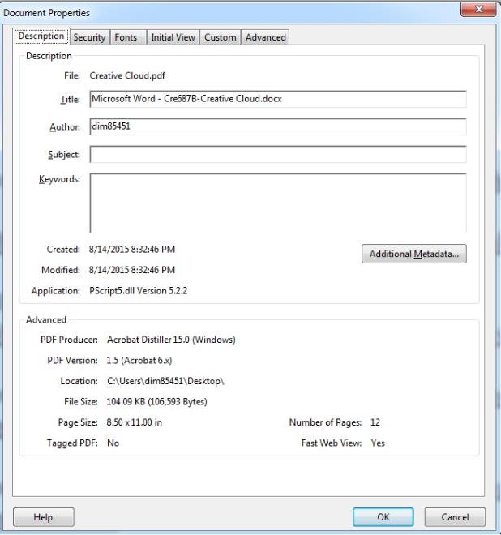
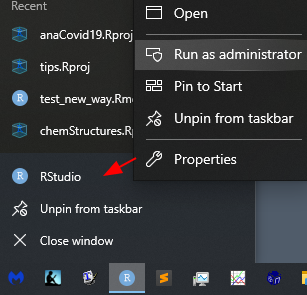

This repository contains the John Minter's useful tips in Rmarkdown
format.

- **USB drives**

  Note to self: Only buy **USB-3.1** thumb drives, They are **a _lot_ faster**
  than USB 3.0...

  see [Amazon](https://www.amazon.com/gp/product/B07D7PDLXC/ref=ppx_yo_dt_b_asin_title_o00_s00) for a nice drive...


- **Fix for annoying git message:**

  ```
  git config --global pull.rebase false
  ```

- **Quotes I Like**

  > Plod. don't sprint. Be fruitful like a tree, not efficient like a machine.
  > Use the gifts God has given you. - Douglas Wilson

  > The greatest value of a picture is when it forces us to notice what we never
  > expected to see. - J.Tukey

  > All models are wrong, but some are useful. - G. Box

  > Make everything as simple as possible but not simpler. - A. Einstein

  > Your closest collaborator is you, six months from now. You do not
  > respond to email.    
  > - Karl Browman

- From [DataArtisan](https://twitter.com/dataartisan1/status/1263784688432398338):

  Skills that make you stand out in #DataScience    
  
  Being good at     
  - making presentations    
  - public speaking    
  - explaining complex concepts    
  - listening     
  - changing plans on short notice    
  - receiving feedback    


**First**, some quickies:

1. Checking Author/date properties in a PDF

  > **Q: How do I find out when a PDF doc was originally created there is nothing under `File/Properties`? **

  > Answer by **RahulTyagi (Adobe Employee)**

  > Generally, it is shown under the document properties window in
  > Acrobat (As shown in the following snapshot).

  > 

  > However, if the sender/Author has removed metadata from the pdf then there
  > are chances that original file creation date is not displayed.

  
2. Key greek and other characters

  ```
  Φ(ρ𝑧)
  𝑧  script z   
  ```
  Happily, Rmarkdown handles these well in html documents. 
  Haven't been able to use them in LaTeX.  Need to try XeLaTeX...

  ```
  UC LC Name
  -- -- ----
  Α	 α	Alpha	
  Β	 β	Beta
  Γ	 γ	Gamma
  Δ	 δ	Delta
  Ε	 ε	Epsilon
  Ζ	 ζ	Zeta
  Η	 η	Eta
  Θ	 θ	Theta
  Ι	 ι	Iota
  Κ	 κ	Kappa
  Λ	 λ	Lambda
  Μ	 μ	Mu
  Ν	 ν	Nu
  Ξ	 ξ	Xi
  Ο	 ο	Omicron
  Π	 π	Pi
  Ρ	 ρ	Rho
  Σ	 σ,ς  Sigma
  Τ	 τ	Tau
  Υ	 υ  Upsilon	
  Φ	 φ	Phi
  Χ	 χ	Chi
  Ψ	 ψ	Psi
  Ω	 ω	Omega
  ```


  3. Today I learned (TIL)

      2020-05-25:    
      It appears that now I need to run RStudio as an **administrator** on
      **Windows 10** to **install packages**.
      
      Two ways to do it:
      
      - Right click on a **Desktop** RStudio icon and choose `Run as Administrator`
       - Right click on the tool-bar RStudio Icon, **pull up**, and choose `Run as Administrator`.
   
      
   
        This **really annoying** since my profile is an administrator...

   
   

        2020-05-14:    
        **Do not update your iPhone OS right before a run**. The update
        **appeared** to be done, but my music was skipping for about
        20 min. Guess there was processing in the background.
   
        2020-05-18:    
        **Update Microsoft Office**    
        - Open an Office application, such as Word, Excel, or PowerPoint. ...    
        - Click on `Account` or `Office Account` on the list.    
        - Under Product Information, click on `Update Options` next to `Office Updates`.    
        - From the list of options, click on `Update Now`.

  4. Chrome Bookmarks - How to move a folder...

        From [here](https://support.google.com/chrome/thread/3479132?hl=en).
   
        > **Under Bookmarks**, open Bookmark Manager. If you want to move FOLDERS
        > that are within another folder (parent folder) you need to select the
        > parent folder in the left window. Then you click on the NAME of the
        > folder you want to move in the right side window. DO NOT click on the
        > little 'folder' icon-- it will not work.


  5. Keyboard shortcut for the `dplyr` pipe operator

      ```
      Win: `%>%` - Ctl + Shift + M    
      Mac: `%>%` - CMD + Shift + M   
      ```

  6. Fix a `recurring guthub credential problem` - run:
   
      ```
      Sys.unsetenv("GITHUB_PAT")
      Sys.getenv("GITHUB_PAT")
      ```

  7. The R `janitor` package is your friend. It cleans up
     non-standard column names .

  8. CDC Corona Virus Recommendations

      > The CDC recommends washing with soap and water for at least 20 seconds after
      > using the bathroom, before eating and after blowing your nose or sneezing. It
      > also advises not to touch your eyes, nose and mouth and to clean objects and
      > surfaces you touch often.
      >
      > “These are all things you can do to prevent the spread of pretty much any
      > respiratory virus,” Brewer said.

  9. Closed captions in CBS All access

      > Go to www.cbs.com. Find a full episode of a series that you're
      > interested in and click on it. To turn the captions on, bring your
      > cursor into the middle of the video to see the menu show up. Look 
      > for and click on the plus sign for "More" on the lower right hand
      > side, click again on "CC captions" just once.


  10. The Feynman technique of learning:

      - Step 1: Pick and study a topic

      - Step 2: Explain the topic to someone, like a child, who is unfamiliar
        with the topic

      - Step 3: Identify any gaps in your understanding 

      - Step 4: Review and Simplify!
    
      More [here](./Feynman_technique/Feynman_technique.html)...
    
  11. Install command line tools on MacOS

      `xcode-select --install`

  12. Reset a Fitbit Ionic watch

      Press and hold the left and bottom right buttons at the same time until you
       see the Fitbit logo. Let go of the buttons, and your tracker will restart.

  13. Regex for youtube time stamps. Useful in SublimeText3!

      `\d\d:\d\d`

  14. Symbolic links. I always get this backwards...

      ```
      file     link
      ln -s source destination
      ```

  15. Fun snippets

      > Your closest colaborator is you, six months from now    
      > ... and you don't respond to email     
      > - Karl Broman

      > DRY (do not repeat yourself) vs WET (waste everyones time) coding
      > styles    
      > - Peter Baker (UseR 2018)

  16. Getting started with data science

      - A very helpful article from
          [Datacamp](https://www.datacamp.com/community/tutorials/setup-data-science-environment).

  17. Clear the Chrome Cache

      - Press "CTRL" + "Shift" + "Delete" keys in Windows or Linux
      - Press "Command" + "Shift" + "Delete"" keys on MacOS.

  18. Delete Specific Cookies in Chrome for Mac OS X

      From [osxdaily.com](http://osxdaily.com/2016/07/02/delete-cookies-chrome-browser/)
      You can remove a specific website cookie from Chrome by doing the following
      This skips several steps from original article!    
      - Open `chrome://settings/siteData` as a URL

      - Scroll to look at the list or use the `Search` box if you want to
      quickly find a specific site URL.

      - To remove the cookie(s), then select the site and click the
      **trash can icon** to delete cookies for the site.

      - Rinse and repeat for other sites...

      - Avoid cookie placement and cache generation in the first place by using
      the Chrome `Incognito Mode` private browsing feature.
  
  19. Automatically download all files in a directory

      Let's also exclude all the `index.html` files... 
      
      ```
      wget -r --no-parent --reject "index.html*" http://my/url
      ```
        
  20. How to block someone on Facebook

      - Click at the top right of Facebook and choose `Settings`.
      - Click `Blocking` in the left side menu.
      - In the `Block` users setting, enter the name of the person you want to
      block and click `Block`.
      - Select the specific person you want to block ans click
      `Block > Block [name]`


  21. Convert `.mkv` to `.mp4` from the command line

      ```
      ffmpeg -i vid.mkv -c copy vid.mp4
      ```

  22. HTML Syntax

  - A link
    
      ```
      <a href="https://...">Label</a>
      ```
    
  - A paragraph
    
      ```
      <p>A paragraph</p>
      ```
    
  - A quote
    
    ```
    <q>A quote</q>
    ```
        
  - A blockquote
    
    ```
    <blockquote cite="https://www.w3schools.com/tags/tag_blockquote.asp">
    <p>A long paragraph of text.</p>
        
    <p>A second long paragraph of text.</p>
        
    </blockquote>
    ```
        


**Topics**

[AccessToSqlite](./AccessToSqlite/AccessToSqlite.html)

[EkAutomater](./automater/automater.html)

[Oxford AZtec](./AZtec/AZtec.html)

[bibtex](./bibtex/bibtex.html)

[C++11](./C++11/C++11-Tips.html)

[Carbon Film Thickness](./carbonFilmThickness/carbonFilmThickness.html)

[chemStructures](./chemStructures/chemStructures.html)

[chntpw](./chntpw/chntpw.html)

[Color](./color/color.html)

[Conductive Epoxies](./ConductiveEpoxy/ConductiveEpoxy.html)

[DataScience-linux64](./DataScience-linux64/DataScience-linux64.html)

[Debian](./Debian/Debian.html)

[Denton Coaters](./Denton/Denton.html)

[Diffraction Limit](./DiffractionLimit/DiffractionLimit.html)

[DTSA-II](./dtsa2/dtsa2.html)

[DTSA-II Scripting](./dtsa2-scripting/dtsa2-scripting.html)

[Earth Science](./earth-sci/earth-sci.html)

[EDAX](./EDAX/EDAX.html)

[EPMA Matrix Correction](./epma-matrix-corr/epma-matrix-corr.html)

[Excel](./Excel/Excel.html)

[Feynman Technique](./Feynman_technique/Feynman_technique.html)

[Fiji plugin development](./fiji-plugin-development/fiji-plugin-development.html)

[Fitness](./fitness/fitness.html)

[Font Test](./font-test/font-test.html)

[French Press Instructions](./french-press-instructions/french-press-instructions.html)

[generator](./generator/generator.html)

[gfortran](./gfortran/gfortran.html)

[ggplot2 workshop](./ggplot2_workshop/ggplot2_workshop.html)

[Building up a ggplot2 figure](./ggplot2figure/ggplot2-figure.html)

[ggplot2Examples](./ggplot2Examples/ggplot2Examples.html)

[ggplot2Intro](./ggplot2Intro/ggplot2Intro.html)

[ggvisIntro](./ggvisIntro/ggvisIntro.html)

[git](./git/git-tips.html)

[gnuplot](./gnuplot/gnuplot.html)

[Haklev's tips on data wrangling with R](./hacklev/hacklev.html)

[hearing aids](hearing-aids/hearing-aids.html)

[homebrew](./homebrew/homebrew.html)

[html](./html/html.html)

[hyperspy](./hyperspy/hyperspy.html)

[Image-J](./ImageJ/ImageJ.html)

[Inkscape](./inkscape/inkscape.html)

[iOS](./iOS/iOS.html)

[Jekyll on github.io](./jekyll-github/jekyll-github.html)

[json](./json/json.html)

[LaTeX for Rmarkdown](./latex-eqns-for-rmarkdown/latex-eqns-for-rmarkdown.html)

[legacy equipment](./legacy/Legacy.html)

[Logos Library System](./Logos/Logos.html)

[Low Carb Diet (Denninger)](./Low-Carb-Diet/Low-Carb-Diet.html)

[Lubuntu](./Lubuntu/Lubuntu.html)

[mac](./mac/mac.html)

[mac-for-data-science](./mac-for-data-science/mac-for-data-science.html)

[microscopy](./micro/micro.html)

[microscopy sample prep](./micro-sample-prep/micro-sample-prep.html)

[midb](./midb/midb.html)

[Monte Carlo methods in R](./monteCarlo/monteCarlo.html)

[MS Office](./msOffice/msOffice.html)

[MySQL](./mysql/mysql.html)

[Octave](./Octave/Octave.html)

[OnePassword](./OnePassword/OnePassword.html)

[Oracle Virtual Box](./Oracle-Virtual-Box/Oracle-Virtual-Box.html)

[OS Package Links](./osPkgs/osPkgs.html)

[pandoc](./pandoc/pandoc.html)

[phi-rho-z](./phi-rho-z/phi-rho-z.html)

[plagiarism](./plagiarism/plagiarism.html)

[pool](./pool/pool.html)

[portable makefiles](./portableMakefiles/portableMakefiles.html)

[Preparation of samples for EDS](./prepForEDS/prepForEDS.html)

[Probe for EPMA](./probeForEPMA/probeForEPMA.html)

[python](./python/python.html)

[python image processing with skimage](./skimage/skimage.html)

[qqplotr](./qqplotr/qqplotr.html)

[R](./R/R-tips.html)

[R-Anova](./R-Anova/R-Anova.html)

[R-bar-plots](./R-bar-plots/R-bar-plots.html)

[R-boxplots](./R-boxplots/R-boxplots.html)

[R-caracas](./R-caracas/R-caracas.html)

[R-data-cleaning](./R-data-cleaning/R-data-cleaning.html)

[R-data-pipeline](./R-data-pipeline/R-data-pipeline.html)

[R-Excel](./R-Excel/R-Excel.html)

[R-foreach](./R-foreach/R-foreach.html)

[R-gt (great tables)](./R-gt/Rgt.html)

[R-knitrBootstrap](./R-knitrBootstrap/R-knitrBootstrap.html)

[R-lm](./R-lm/R-lm.html)

[R-loess](./R-loess/R-loess.html)

[R-markdown](./R-markdown/R-markdown.html)

[R-matrix-algebra](./R-matrix-algebra/R-matrix-algebra.html)

[R-memes](./R-memes/R-memes.html)

[R-model-predict](./R-model-predict/R-model-predict.html)

[R-Packages](./R-packages/R-packages.html)

[R-sys-admin](./R-sys-admin/R-sys-admin.html)

[Reproducible Research](./ReproducibleResearch/ReproducibleResearch.html)

[Research](./research/research.html)

[Sage](./sage/sage.html)

[Screen Cast](./screencast/screencast.html)

[SEM](./SEM/SEM.html)

[shell](./shell/shell-tips.html)

[Sirion](./Sirion/Sirion.html)

[skills](./skills/skills.html)

[skimage](./skimage/skimage.html)

[Software Development](./software-dev/software-dev.html)

[SQL](./SQL/SQL.html)

[Sublime Text 3](./ST3/ST3.html)

[Stratagem](./Stratagem/Stratagem.html)

[Sweave](./Sweave/Sweave.html)

[TEM](./TEM/TEM.html)

[TeX](./tex/tex-tips.html)

[Tidy Data](./tidyData/tidyData.html)

[Tidy Models](./tidyModels/tidyModels.html)

[TV](./TV/Tv.html)

[Ubuntu](./ubuntu/ubuntu.html)

[vacuum systems](./vacuum/vacuum.html)

[Win](./win/win.html)

[winCasino](./winCasino/winCasino.html)

[Workflow](./workflow/workflow.html)

[Write Usefully (by Paul Graham)](./write_usefully/write_usefully.html)

[WxMaxima](./WxMaxima/WxMaxima.html)

