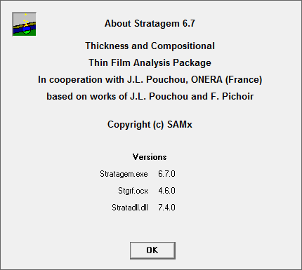
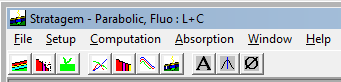
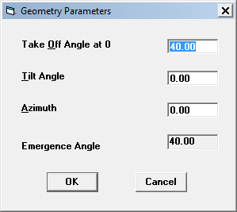
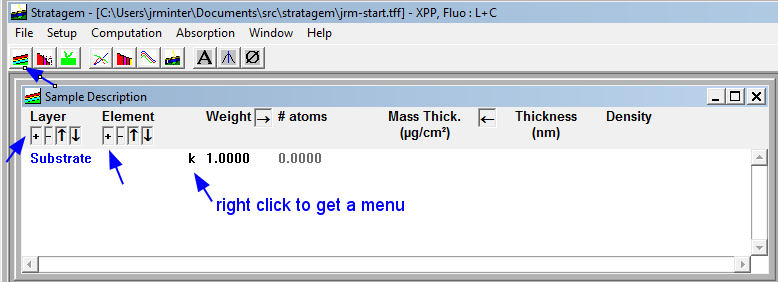
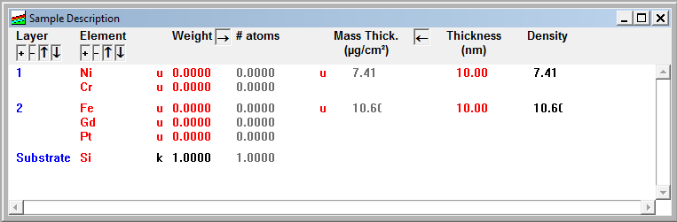
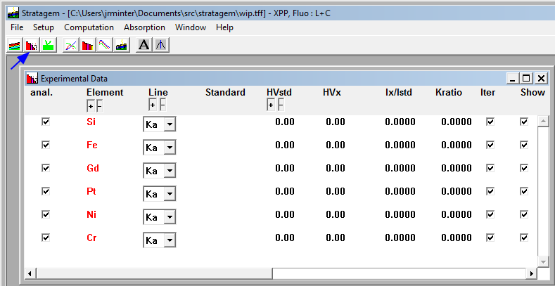
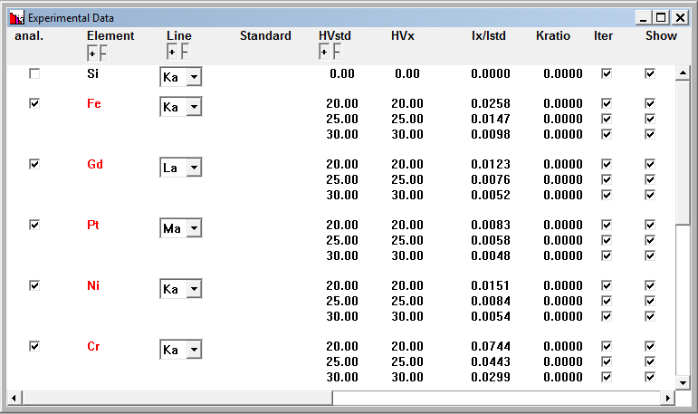
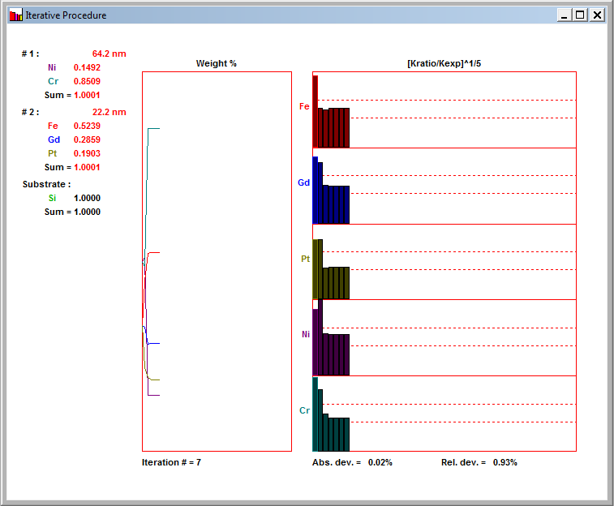
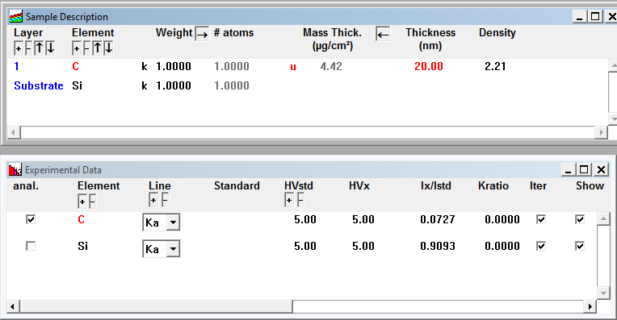
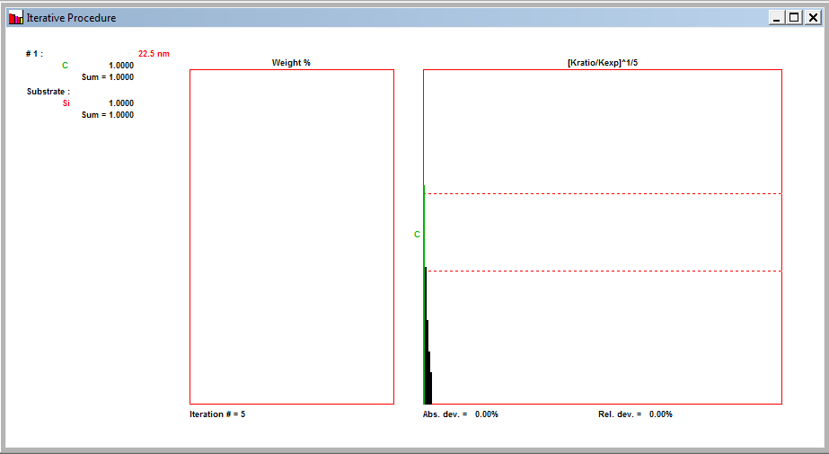

[Back to Index](../README.html)

# Introduction

[Stratagem](http://www.samx.com/microanalysis/products/stratagem_us.html) is
a software package for analysis of X-ray EDS and electron microprobe analysis
of **stratified thin films**. It was developed based upon the work of
Jean-Louis Pouchou and his coworkers [@Pouchou1993a]. It is a close-source
commercial package that requires a USB key to run. It can compute the layer
thicknesses and compositions of stratified layers. It works because the
electron penetration, X-ray generation and emission vary with composition
and electron probe voltage.

One needs the observed X-ray intensities relative to a standard. These
are typically called **k-ratios**. Consider the elemental composition,
density, and thickness of each layer as variables. Some are known, others
are unknown. One needs at least one observed X-ray k-ratio for each unknown.
These can and should come at multiple electron probe voltages.

We really want the problem to be overdetermined - that is to have more
observed k-ratios than unknowns to reduce the effect of uncertainty in
the observed k-ratios on the model fit.

# Installation

I ended up installing from installer files on an original CD (2013) and then
running an upgrade. This was a bit of a "learning experience." The software
has developed over several years and changes in Windows operating system
releases. These instructions have been tested under Windows 7 x64 on native
hardware and under Windows 10 x64 in a Parallels VM under Mac OSX Sierra.

0. If changing a standard install, uninstall **all** SamX software
and restart the computer.

1. Install the driver for the USB key. I used
**Sentinel Protection Installer 7.6.3.exe** (2010-10-20).

2. Install Stratagem to a directory that can have **read-write permissions**.
Do **not** use the default directory
(**C:\\Program Files (x86)\\Stratagem\\**).  On Windows boxes I have created
a **C:\\Apps\\** directory for all my customized applications. I used the
**StratagemSetup.exe** program (2013-08-09),

3. Start the Stratagem and make sure it reads the key.

4. Install the update **stratagemupd.exe** (2017-05-13). It should find
Stratagem and do the update. Start the program. If you have previously
updated the key is should work.

5. If you get a key error, run **key.exe** (2017-05-14). The program should
now work normally.

My current banner when starting the software:



## Optional: Install Phillipe Pinard's **stratagemtools** python package.

Phillipe's [stratagemtools](http://stratagemtools.readthedocs.io/en/latest/)
python package is a great way to script Stratagem. I have a Windows x64 box
and typically run 64 bit python 3.6. Phillipe's package requires 32 bit 
python. The [Anaconda Google Group](https://groups.google.com/a/continuum.io/forum/?fromgroups#!searchin/anaconda/both$2032$20and$2064$20bit/anaconda/bJgetQok1-I/QO_b7zDzGMoJ) to the rescue!

The basic idea is to install **both** 32 and 64 bit **miniconda**
distributions and switch them using a symbolic length. Here is the
basic procedure. I edited it to use my path conventions... Change as
appropriate.

### Installation

1. Download **both** the 32 and 64 bit miniconda installers from
[conda.io](https://conda.io/miniconda.html).

2. Install 64 bit Anaconda to **C:\\Apps\\miniconda**

3. Rename **C:\\Apps\\miniconda** to **C:\\Apps\\miniconda-64**

4. Install 32 bit Anaconda to **C:\\Apps\\miniconda**

5. Rename **C:\\Apps\\miniconda** to **C:\\Apps\\miniconda-32**

### Enable 32 bit python (for strategemtools)


```
rmdir C:\Apps\miniconda
mklink /J C:\Apps\miniconda C:\Apps\miniconda-64
```


### Enable 64-bit Version (for other needs...)

In a command window

```
rmdir C:\Apps\miniconda
mklink /J C:\Apps\miniconda C:\Apps\miniconda-64
```

### Installing **stratagemtools**

1. Switch to the 32 bit python as shown above.

2. Use **conda** to install the prerequisites. 

```
conda update --all
conda install pyparsing nose
```

I usually install a couple of other useful packages (such as the IDE spyder
and jupyter for the notebook)...

```
conda install numpy scipy matplotlib seaborn jupyter spyder
```

3. Install **stratagemtools**. You might as well use the latest 
and greatest from github. From a git shell:

```
cd your/repository/directory
git clone https://github.com/ppinard/stratagemtools.git
```

4. Install **stratagemtools** from a **cmd** window:

```
cd your/repository/directory/stratagemtools
pip install .
```

See Philippe's [Tutorial](http://stratagemtools.readthedocs.io/en/latest/tutorial/tutorial.html) for examples. **This** is why we installed **spyder** (type 'spyder' from the command line to prototype in an IDE...) and jupyter (type 'jupyter notebook' from the command line to do a reproducible report...).


# Important Initial Choices

Careful forethought is the key to an efficient and relatively painless
analysis. We need to pose and answer the following questions. It helps
to summarize these in a document or spread sheet when it comes time
to enter data into the program.

For each layer **and** the substrate:

- **What is the composition of the layer?** Can we treat it as constant or
do we need the program to calculate it? Do I have independent analyses that
I trust or can at least use to set the starting conditions for the fit?
- **What is the density of the layer?** Reasonable estimates are usually
sufficient.
- **What is the estimated thickness of the layer?** We will need to make
certain that we measure the k-ratios at voltages where the probe does not
fully penetrate the stack to voltages where it penetrates well into the
substrate. Some initial Monte Carlo simulations can be helpful here.
- **How precise are my k-ratios?** This depends upon many factors, one
of which is the reliability of the measured probe current.

# Steps to set up a new analysis

The main menu looks like this:



## Set the system parameters

We want to set us a new analysis after a fresh start of Stratagem. Begin by
choosing **Setup > Geometry Parameters...**. We need to set the take-off
angle. For our example it will be **40.0** degrees.



Next we want to set up the computational parameters by 
choosing **Setup > Computational Parameters...**. We will choose **XPP**.

I save this basic setup as **jrm-start.tff**.

## Set up the layers

Next we want to set-up layers. We will actually do this manually
for an analysis Stratagem supplies as a tff file in order to
illustrate the process. First, open the **Sample description** window
by clicking on the first icon from the left (red/green lines).




We first add and edit layers **from the bottom up**.

In this case we enter the element **Si** for the substrate and then add a the
middle layer with the **+** button on the **Layer** bar. Then we add three
elements (**Fe, Gd, and Pt**) to that layer. Finally we add the top layer 
with the **+** button on the **Layer** bar and add the **Ni and Cr** elements.
I save this as **wip.tff** (a work in progress...)  This makes it easy to
revert if something isn't right... We can then go through and right click
on each black **k** and set it to a **red u** with a **right mouse click**.
At the same time make sure all the weights are set to **0**.

Then go enter the two densities (7.41 and 10.6) and save to **wip.tff**.
Now our sample description looks like:




## Add the data

Open the **Experimental Data** window using the second icon on the
top menu bar.



**First** uncheck the **anal.** box on Si. We don't want to **analyze** for Si but we **do want** to iterate and show the Si. Then set the **Gd** to and **La** and the **Pt** to an **Ma**. Then add 2 additional KVs to each line with the **+ HVstd** button. Set the values for **both** HVStd and HVx to **20, 25, and 30kV**. Our final window is shown below.



**Save this to jrm-NiCr-on-FeGdPt-onSi-In.tff before running!**

## Run the analysis

Choose **Computation > Iterative** or **Ctl/T** to run the analysis. 
The result is show below. Save the result to **jrm-NiCr-on-FeGdPt-onSi-run.tff**.




# Stratagem Import File Format

The process above has a lot of **point/click/copy/paste**. It is reproducible 
because one can save the '.tff' files. These are binary files which are 
not the best choice for reproducible research with version control. 

The Stratagem Import File is an ASCII file that contains different components,
each component being introduced by a "key-record", a record beginning with
the '$' sign. This is available to anyone.

```

# Comments
#     Characters past (and including) '#' are comments
#     Empty lines are ignored

# File version

$StrataImport_3
#   File & version identifier. Must be 1st non-comment record.

# Computation parameters definition

$Comp PhiRhoZ  Fluo  NbIterations 

#   PhiRhoZ is one of XPP or Para (for parabolic).
#   Fluo is one of None, Line, Conti (for continuum).
#   This record is optional, the default values in Stratagem will be used.

# Layer definition

$Layer Density  Thickness  State 

#   Thickness is given in angstroms.
#   State is one of k or u (for known or unknown).
#   This record must be followed by element definitions. The first record is
#       the upper layer, the last one is the substrate and should not set
#       Density, Thickness nor State. This record is not relevant in case of
#       importing experimental data only.

# Element definition

$Elt NrAtom  Weight  State 

#   One line per element. State is one of k, u,  t, d, s (for known, unknown,
#        trace, difference, stoichiometry).
#   The weights will be normalized after getting all elements. Each
#        element pertains to the last layer defined before its position in
#        the file. This record has no meaning without a preceding layer
#        definition.

# Standard definition

$Std name

#    The first record is the standard tilt angle in degrees :

     TiltAngle

#    The following records (up to the next $-record) will describe the
#        standard :

    $$Layer Density  Thickness or $$Layer

#        Thickness is given in angstroms.
#        A layer with no information on density is considered as
#             the substrate

         $$Elt  NrAtom  WeightPercent

#         Element name and composition within the layer
#               The standard file name.tfs will be created with the
#               given description
#
#         TiltAngle is optional and will be defaulted to 0 (in degrees).
#
#         The WeightPercent's will be normalized

# Geometry definition

$Geom TakeOff  Tilt  Azimuth 

#    All angles are in degrees
#   This record is optional, the default values in Stratagem will be used

# Intensities

$K NrAtom  Line  HVx HVstd StdName

#    NrAtom	- he element atomic number
#    Line - one of Ka, Kb, La, Lb, Ma, Mb

#    HVx -   the sample voltage (kV)
#    HVstd   - the standard voltage (kV)
#    StdName - the standard name 
#              If StdName is not present the the standard
#              is a pure standard
#
#    The following records (up to the next $-record) will contain a
#    list of K (= Ix/Istd). There can be any number of values per line,
#    separated by one or more spaces
```

## An example from the manual

This one - straight from the manual -- crashed when run in Stratagem
Now the file works as expected.

```
# Sample input file for StrataGem
$StrataImport_3         # required

# Sample Description
$Comp Para Conti 199    # Use Parabolic, fluo. cont., nb max steps 199

$Layer 8.69 100 u       # Ni-Fe layer, unknown thickness
$Elt 28 0.5 u           # unknown concentrations
$Elt 26 0.5 u

$Layer                  # Cr Substrate
$Elt 24 1.0 k

# Experimental Data Description
$Geom 40 0 0            # 40 degree Take Off , no Tilt, nor Azimuth 

$K 26 Ka 15 15 nife     # Fe measurements Ix/Istd (nife standard)
0.7140 0.7086 0.7069
0.7082 0.7110

$K 28 Ka 15 15 nini     # Ni measurements Ix/Istd (nini standard)
0.8089 0.8142
0.8120 0.8130 0.8102

$K 24 Ka 15 15          # Cr measurements Ix/Istd (pure element)
0.2867  0.2883

$Std nife                # Definition of standard named nife
0                        # tilt = 0
$$Layer 2.67 100         # Coating Density, Thickness
$$Elt 6 100              # C 100%
$$Layer                  # Substrate
$$Elt 26 20.0            # Fe 20%
$$Elt 28 80.0            # Ni 80%

$Std nini                # Definition of standard named nine
0                        # tilt = 0
$$Layer 19.4 100         # Coating Density, Thickness
$$Elt 79 100             # Au 100%
$$Layer                  # Substrate
$$Elt 28 100.0           # Ni 100%

# End of file

```

## A simple example - C thickness on Si

I put this together because it is a common question I have.
I run it as follows:

1. I start Stratagem and import the file. It displays the `Sample Description` and `Experimental Data` windows as expected.

2. I **uncheck the anal box for the Si K-factor** in the `Experimental Data` window to have not analyze Si and Zero the unknowns. The display is shown 
below



3. I run **Computation > Iterative (Ctl/T)** and get this result:




Finally, here is the script...


```
# Sample input file for StrataGem
$StrataImport_3         # required

# Sample Description
$Comp XPP Conti 199     # Use XPP, Conti, nb max steps 199

$Layer 2.21 200 u       # C layer, 20 nm, unknown
$Elt 6 1.0 k            # known concentrations

$Layer                  # Si Substrate
$Elt 14 1.0 k

# Experimental Data Description
$Geom 35 0 0            # 35 degree Take Off , no Tilt, nor Azimuth 


$K 6 Ka 5 5             # C measurement Ix/Istd (C standard)
0.0727

$K 14 Ka 5 5            # Si measurements Ix/Istd (Si standard)
0.9093                  # N.B. need to turn off anal for Si in exptl data


```


[Back to Index](../README.html)
