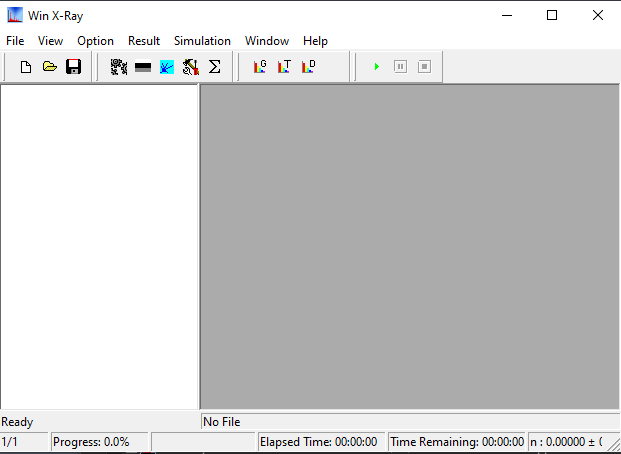
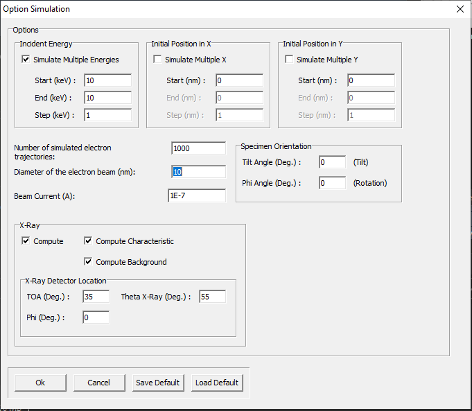
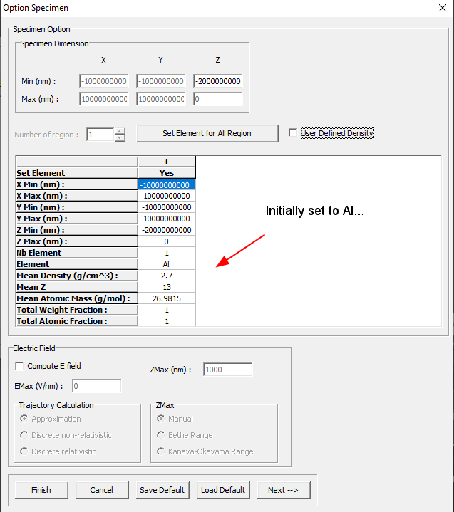
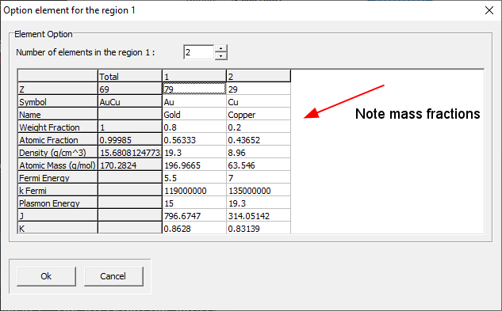

[Back to Index](../README.html)

# Introduction

## WinXray?

Adapted from [here](https://www.gel.usherbrooke.ca/casino/tutorial/tutorial_frames.html) to
be able to get html and pdf output. Minor reformatting from the original and adding PDF output.

# Creating a Simulation

## Step 1: Creating the Simulation

You will be greeted with a main menu that has a series of icons
at the top.

To create a new simulation select File/New from the menu or click the first icon on the menu bar.

The `NEW SIMULATION WIZARD` will appear on the screen.

Then you hit the `Next` 

## Step 2: Creating Layers

The first dialog box will be the Option Specimen dialog. In this dialog you will create your sample. The first choice will be
a bulk sample that is pre-figured for `Al`.

Note that there is a box labeled `Set Element for All Region` and
a check-box to set a `user defined density`.

Note that at the bottom of the dialog you have a choice to make
this `the default simulation`.

[Back to Index](../README.html)

