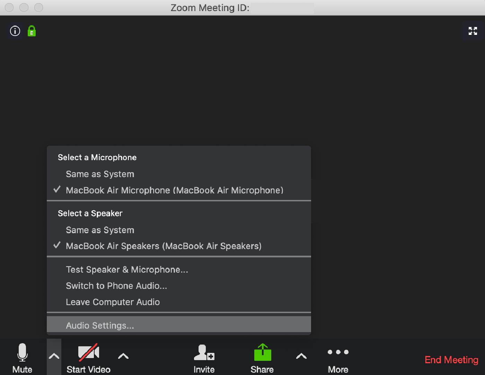
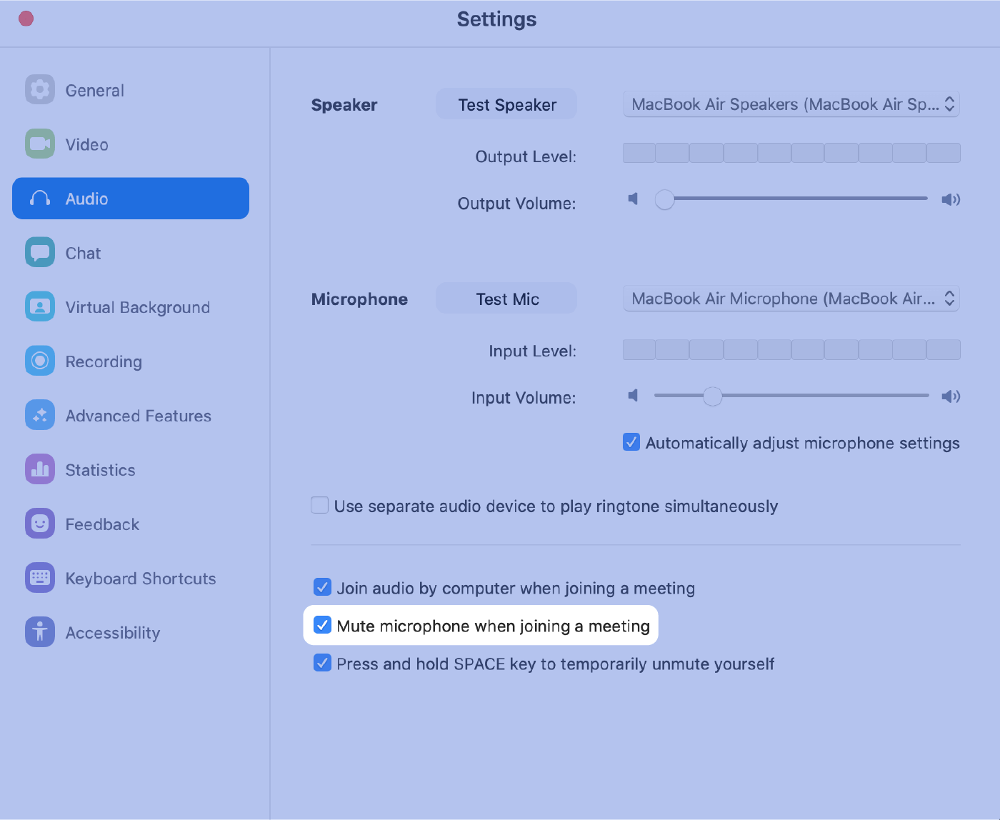
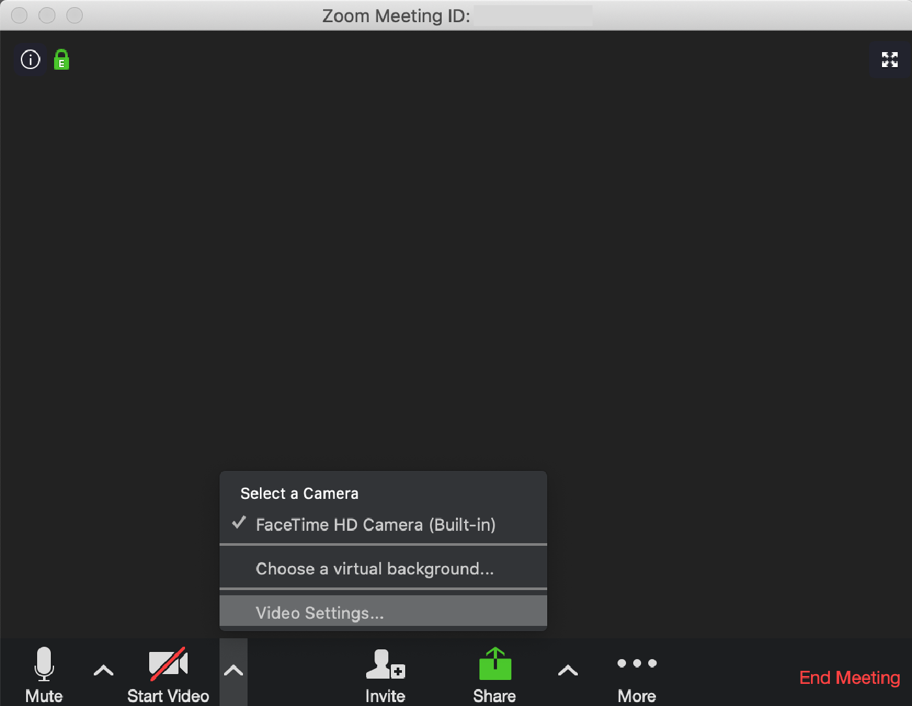
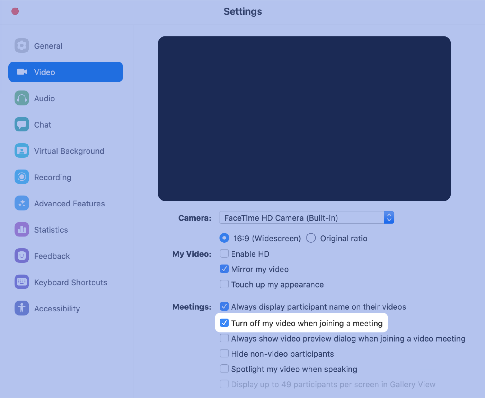
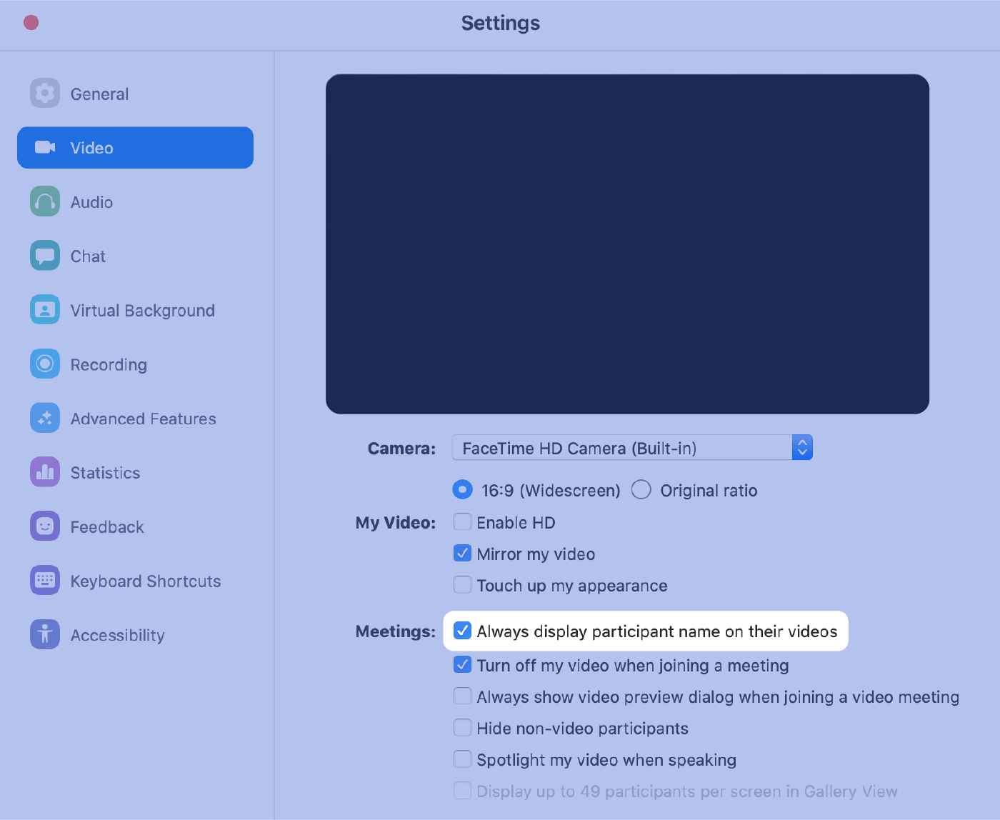
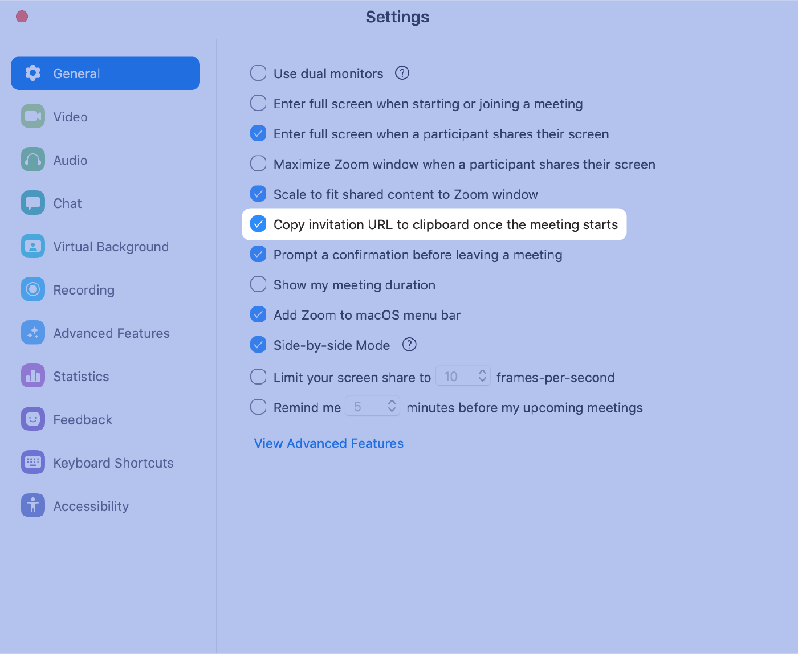
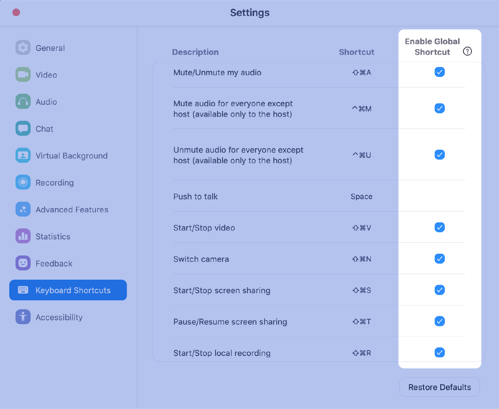
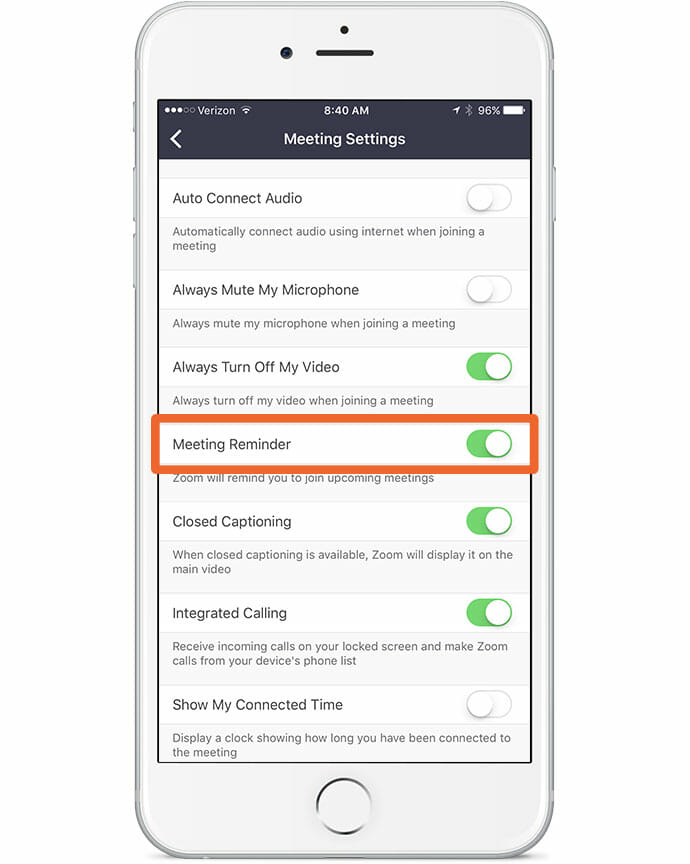
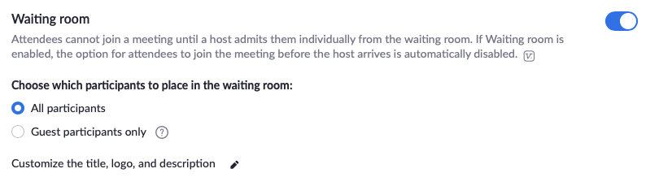

[Back to Index](../README.html)

# Introduction

Zoom is a very helpful tool for online meetings. There are many settings
to tweak. I especially like the tips from groovehq.com below.

# groovehq.com

I like tips from  [groovehq.com](https://www.groovehq.com/blog/zoom-tips-and-tricks).
Some of my favorite tips from `groovehq.com` are below

1. Quick Invite
   When you are in a meeting, type **⌘Cmd+I** (PC: **Alt+I**) to open the
   `Invite` window.

2. Always Turn Video Off

    Unless video is a necessity, we have found that turning it off can
help increase the clarity of the call.

    This particular setting allows you to turn it off when entering a call
(you can always turn it on later) — which is another helpful way to
reduce sudden interruptions.

    **You can access Video Settings directly from a Zoom call by clicking**
**the arrow next to the camera**.

3. Record the Meeting

    Recording is a **tremendously useful** feature in Zoom.

    Want to save key meetings or employee one-on-one’s? Record them for
reference.

    Doing an interview and don’t want to slow things down by taking notes?
**Record it and get it transcribed**. We do this for all of our founder
interviews.

    Just type ⌘Cmd+Shift+R (PC: Alt+R) to start recording any meeting.

    Type **⌘Cmd+Shift+P (PC: Alt+P)** to pause/resume recording.
    
4. Share Screen

    Screen sharing is one of the key features that Zoom does better than any
other video conferencing platform we tried.

    To start a screen share, type ⌘Cmd+Shift+S (PC: Alt+Shift+S).

    To pause/resume a screen share, type ⌘Cmd+Shift+T (PC: Alt+T).

5. Mute Audio

    Use ⌘Cmd+Shift+A (PC: Alt+A) to mute/unmute your audio.

6. Quickly Turn Off Video

   To quickly turn video off/on, hit **⌘Cmd+Shift+V** (**PC: Alt+V**).

7. Mute **Everyone**

    Our daily huddles now involve 20 people.

    Ambient or background noise can often get in the way of clear
    communication.

    We found this trick where the meeting host can hit 
    **⌘Cmd+Ctrl+M (PC: Alt+M)** to mute **everyone** on the call at once.

    This shortcut has single-handedly shaved minutes off of our daily
    meetings.

8. Zoom Settings

   If you fix these settings once, they’ll reward you with
   optimized Zoom meetings forever…

9.  Always Mute Microphone

    This setting ensures you enter meetings quietly without bring in 
    sudden noise to the call.

    You can access Audio Settings directly from a Zoom call by
    **clicking the arrow next to the microphone**.
    
    

    

    The same setting exists (and as a rule, should always be used) on th
    mobile app.

10. Always Turn Video **_Off_**

    Unless video is a necessity, we’ve found that turning it off can help
    increase the clarity of the call.
    
    This particular setting allows you to turn it off when entering a
    call (you can always turn it on later)—which is another helpful way
    to reduce sudden interruptions.

    You can access Video Settings directly from a Zoom call by clicking
    the arrow next to the camera.
    

Check **Turn off my video when joining a meeting**.

**Auto-copy Invite URL When Starting a Meeting**

The Invite keyboard shortcut is great, but this setting takes things a
step further.

Found in **General settings**, this option makes it super easy to invite
people to any meeting, without even going through the process of manually
copying the invite URL.

Keyboard shortcuts are our friend...

It is hard to keep track of meeting times. Let Zoom remind you.

Remember the host must admit participants. If you are a host, configure
the waiting room.

Our calls are mostly internal anyway (and it can take a while to admit
10+ people individually), so we turned this setting off under 
`Settings > In Meeting (Advanced) > Waiting room.`

(Note: It takes a while to scroll through all the options on this page,
so we suggest you `CTRL+F` “waiting room” to find it quickly!

**Touch Up My Appearance**

This is more on the spectrum of “fun” than “useful”.

In `Settings > Video, check “Touch up my appearance,”` and Zoom will
soften the focus on your camera, theoretically minimizing any issues
with your skin.

**Zoom Integrations**

Zoom works seamlessly with other products you may already use.
We meet in Zoom, but we live in Slack.

Which is why the Zoom/Slack integration is so helpful. You can use it
to start Zoom meetings right from Slack. Just type “/zoom” in Slack
to see all the options.

[Back to Index](../README.html)

