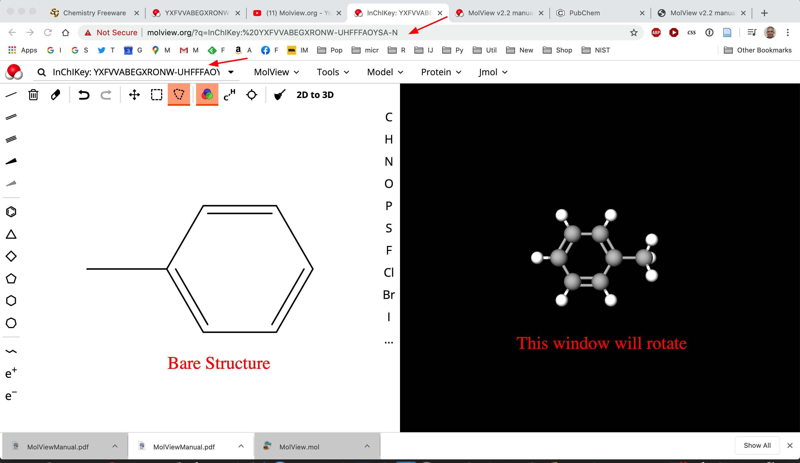
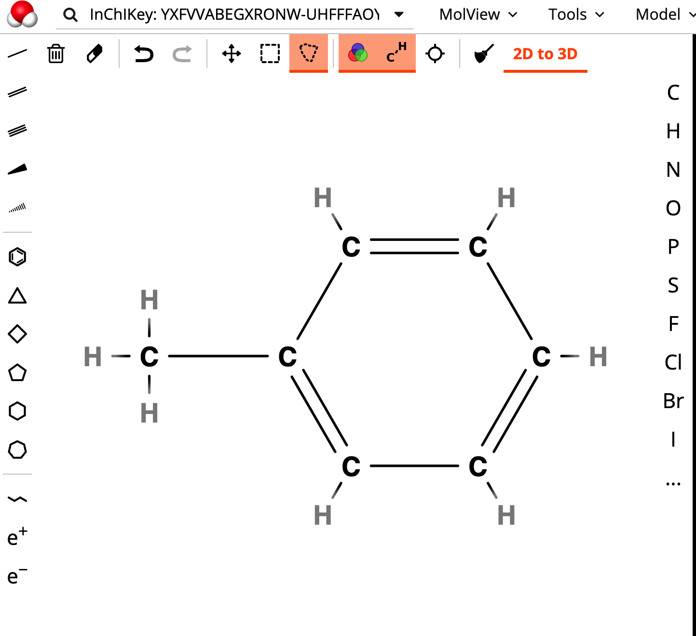
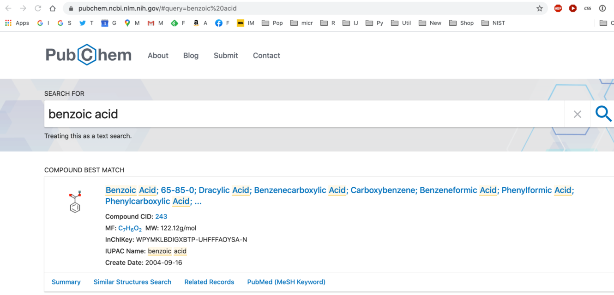
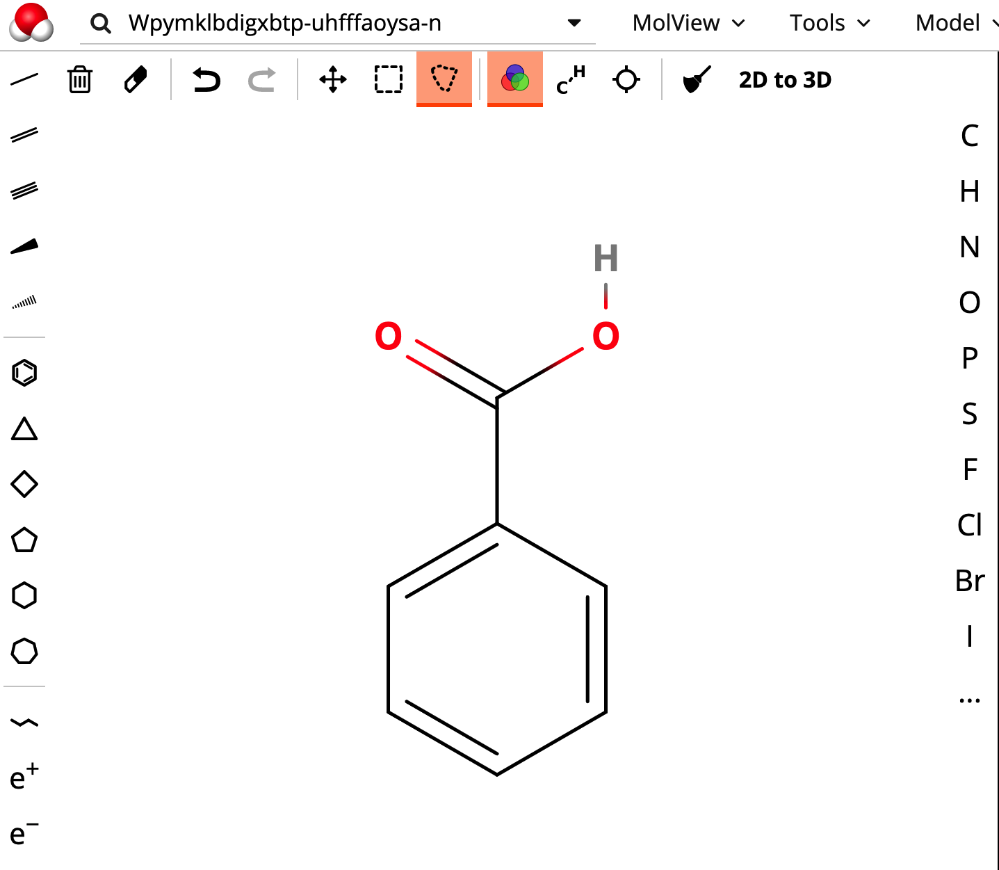
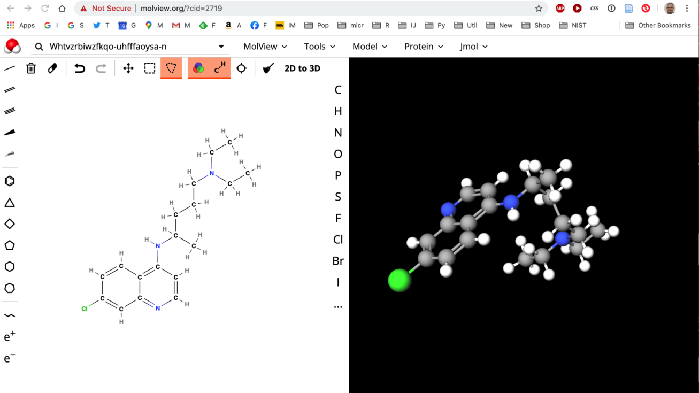

[Back to Index](../README.html)

```{r options, message=FALSE, warning=FALSE, include=FALSE}
knitr::opts_chunk$set(
  collapse = TRUE,
  comment = NA)
```


# Visualizing Chemical Structures

Chemists and students studying Chemistry typically need to draw visual
representations of chemical structures. Before computers were common, chemists
had plastic templates to trace differebt features to build up structures.

There are now several expensive software packages to do this. Examples are
[ACD Chemsketch](https://www.acdlabs.com/resources/freeware/chemsketch/)
which has a free version for personal/academic use. It runs on `Windows 64 bit`
computers. ACD Labs notes that it will run on MacOS in a Windows Virtual
Machine.

There is also a package called [Chem Doodle](https://www.chemdoodle.com/)
that runs on Windows, MacOS, and Linux. It sounds great, right? There is
a problem: The license costs $15/month or $150/year ot $750/life. Ouch!

Here is the good news: There is a website online that serves an Open Source
package called [MolView](http://molview.org/). This is great: No software to
download. It runs in your Web Browser!

There is a manual available in PDF format
[here](http://molview.org/docs/manual.pdf). There is a helpful video
by Roger Nixon on [YouTube](https://www.youtube.com/watch?v=BamwweL2B4E)
that demonstrates how to use MolView.

One advantage of Molview is that one can find input data for many
organic molecules on the [Pubchem](https://pubchem.ncbi.nlm.nih.gov/) website.
This makes it easy to find molecular structures.

One can query for a molecule like
[toluene](https://pubchem.ncbi.nlm.nih.gov/#query=toluene). Note that Pubchem
lists an `InChIKey` for toluene: `YXFVVABEGXRONW-UHFFFAOYSA-N`. If one
types that key into the Molview `search box` at the top,
Molview will draw the structure. That is really helpful!



We can also toggle certain features (like bonds and H) in the display


We can search for `benzoic acid` on PubChem. The search returns



Note the key information:

```
MF: C7H6O2  MW: 122.12g/mol  
InChIKey: WPYMKLBDIGXBTP-UHFFFAOYSA-N  
IUPAC Name: benzoic acid  
```

Let's use the InChIKey to get the structure in MolView



# Chloroquine

This is the covid-19 candidate drug.

The InChI Key: WHTVZRBIWZFKQO-UHFFFAOYSA-N




# Export Data

Note what you can export from the `tools` menu:


[Back to Index](../README.html)

