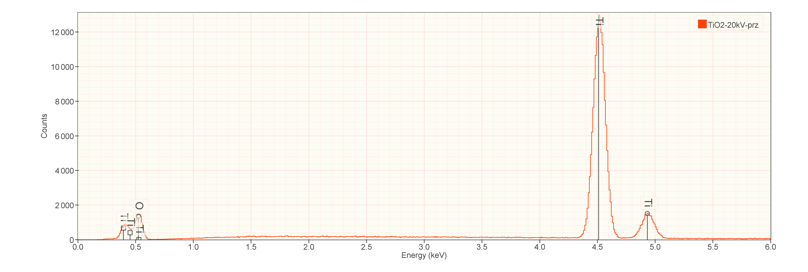
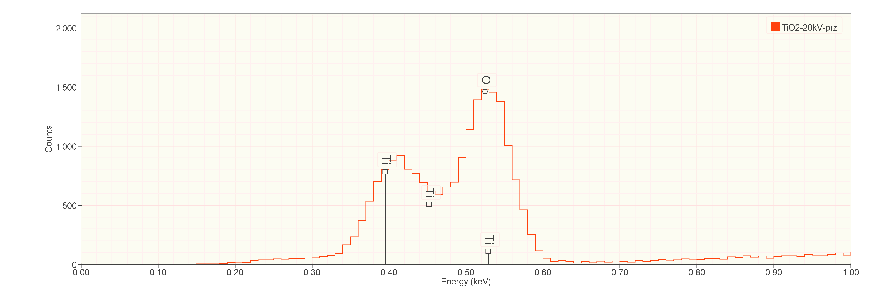

[Back to Index](../README.html)

# Introduction

DTSA-II had a very helpful scripting language. This document explains key
functions. We can get help from the `command line`. Karl Browman points out
that:

> Your closest collaborator is you, six months from now. You don't responf
> to email. This document is primarily for `future John`...

When we first start DTSA-II, we can get help. At the command prompt,
`1 >` type `help()` and press `Ctrl` + `Enter` and DTSA-II will respond with:

```
DTSA-II is an open source application for quantification and simulation of
microanalysis experiments. DTSA-II provides a GUI to simplify common operations
and a scripting interface to implement more sophisticated functionality. The
scripting interface is based on a Java implementation of the Python language
called Jython.

+ Type 'dir()' to get a list of global classes and methods or dir(package) for
  a list of methods and classes within package.
  
+ Type 'help(item)' for basic assistance on the class, function or method
  identified by name as item.
  
+ For help with the important class ScriptableSpectrum, type
  'help(ScriptableSpectrum)'.
```

So follow the instructions and type: `dir()` at the prompt.

```
2 > dir()
```

DTSA-II will respond with a list of classes and functions:

At first glance the list is daunting.  here is a `RosettaStone`
to help.

1. Note that the first line and part of the second have names like `App` and
`DataManager`.

2. If you type `dir(DataManager)` you will get an unhelpful message:

```
2> dir(DataManager)
The most base type
```

These are actually `classes`. Try typing `dir(DataManager)` to get the list of
functions inside the class:

```
3> dir(DataManager)

['ADD_SPECTRUM', 'DetectorSort', 'NameSort', 'REMOVE_SPECTRUM',
'REORDER_SPECTRA', 'SELECTION_CHANGE', 'TimestampSort', 'UPDATE_SPECTRUM',
'__class__', '__copy__', '__deepcopy__', '__delattr__', '__doc__',
'__ensure_finalizer__', '__eq__', '__format__', '__getattribute__', '__hash__',
'__init__', '__ne__', '__new__', '__reduce__', '__reduce_ex__', '__repr__',
'__setattr__', '__str__', '__subclasshook__', '__unicode__', 'actionListener',
'actionPerformed', 'addActionListener', 'addSpectrum', 'class',
'clearAllActionListeners', 'clearSelections', 'clearSpectrumList',
'containsSpectrum', 'empty', 'enableEvents', 'equals', 'eventsEnabled',
'getClass', 'getInstance', 'getSelected', 'getSelectedCount', 'group',
'hashCode', 'isEmpty', 'isSelected', 'isSet', 'listSpectra', 'moveSelectedDown',
'moveSelectedUp', 'notify', 'notifyAll', 'notifyUpdated',
'removeActionListener', 'removeSpectrum', 'replaceSpectra', 'replaceSpectrum',
'select', 'selected', 'selectedCount', 'setSelected', 'sortSpectra',
'spectrumList', 'toString', 'wait']
```


# Creating Materials

To simulate a spectrum, one first needs to describe the materials involved.

Try `help(material)`

```
4> help(material)
material("TiO2",[density=4.27])

The function creates a Composition object by first checking the material database
for a material with the specified name. If the material isn't in the database it
will then attempt to parse the name as a chemical formula.  If both of these
fail the method will return None.
```

**Note:**  the `defineMat` function is **designed to use mass fractions!**

```
def defineMat(elms,qty,name,density=None):
    # Note: epq.Composition(Element[] elms, double[] massFracs)
    c=epq.Composition(map(element,elms),qty,name)
    if density:
        c=epq.Material(c,epq.ToSI.gPerCC(density))
    return(c)
```

Compute and output the weight fractions for MnBi. The `False` second parameter
indicates **not** to normalize to `1.0`.

The javadoc function from
[here](https://www.cstl.nist.gov/div837/837.02/epq/dtsa2/JavaDoc/index.html).

```
public double weightFraction(Element elm,
                             boolean normalized)
                             
Computes the mass fraction of the specified element in this Material.
If normalized=true then the sum of the weightFraction for all elements
in the Material will equal 1.0.

Parameters:

elm - Element
normalized - boolean

Returns: double
```
We use these as shown below. `DTSA2` parses the chemical formula. Note that
we can extract mass fractions easily:

```
5> mnbi = material("MnBi",8.6)
6> wfMn = mnbi.weightFraction(epq.Element.Mn, False)
7> round(wfMn, 5)
0.20816

8> wfBi = mnbi.weightFraction(epq.Element.Bi, False)
9> round(wfBi, 5)
0.79184
```

There are more complicated materials where we might want to generate the
composition from a list of mass fractions. This is helpful for alloys and
glasses.


# Analytical model  $\phi$($\rho$ z) simulations are easy.

In DTSA-II, analytical simulations are **only** for single layers.

Here is an example for TiO~2~:

```
tio2 = material("TiO2",density=4.27)
spc_tio2 = simulate(tio2, det=findDetector("Si(Li)"), keV=20.0, dose=60.0,
                    withPoisson=True)
spc_tio2.rename("TiO2-20kV-prz")
spc_tio2.setAsStandard(tio2)
spc_tio2.display()
```






[Back to Index](../README.html)
