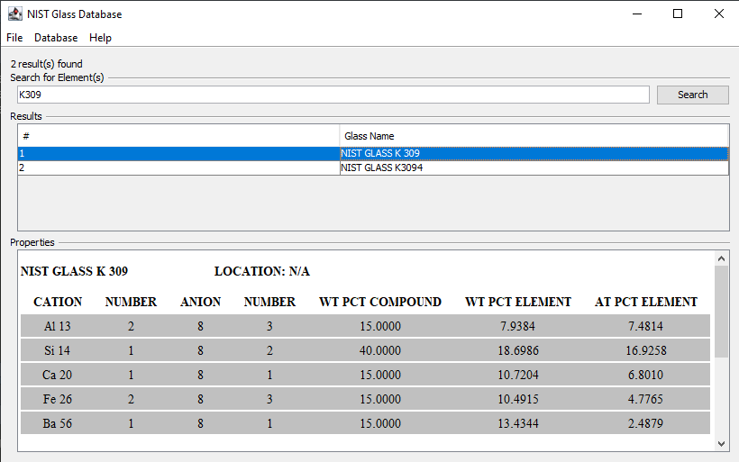

[Back to Index](../README.html)

Note that Nicholas Ritchie has released some helpful videos on
[YouTube](https://www.youtube.com/channel/UCt4nKyhfFQ8xecHyuTnCvIA).
He tries to put out a new release yearly and bug-fix releases as
needed.

# Key tricks

## Setting up DTSA-II Microcopium on MacOS

This worked on my MacBook Pro with macOS Big Sur v. 11.2.3.
I currently have Micro-03-07 and Micro-03-16 on the MacBook Pro.

I currently have the following JVMs on the MacBook Pro:
`adoptopenjdk-11.jdk`, `amazon-corretto-11.jdk`, `jdk1.8.0_251.jdk`
`adoptopenjdk-8.jdk`,	`jdk-10.0.2.jdk`, and `openjdk-11.0.1.jdk`.

1. Install the desired DTSA installer into `Applications` folder.
It will have a name like `NIST DTSA-II Microscopium 2021-03-16`.
Open the appropriate `NIST DTSA-II Microscopium` folder for the
particular release date.

2. In the folder for the desired release, navigate to the `dtsa2.jar`
file and create an alias. I suggest a name like `Micro-03-16`. Drag that
to your desktop. Clicking on the alias will start the program.

## An exchange on the Probe Software Forum (2020-03-31)

### 1 DTSA II / Re: DTSA-II for geological materials - 1 month of results
« Last post by NicholasRitchie on 2021-03-31 at 04:32:01 AM »
Orlandin: Thanks for sharing your results.


Probeman: WRT zero strobe - I don't know how to use the zero strobe to normalize changes in beam current.  As I understand, the zero strobe is a stream of "0 V" pulses inserted into the pulse processor as though they were x-ray events.  This can be used 1) to stabilize the "offset" (so only the "gain" needs to be otherwise calibrated) and 2) to measure the electronic noise component of the resolution function.  In this model, the number of zero strobe pulses is just a function of the frequency with which they are inserted.  (My mental model could be wrong.)


### 2 DTSA II / Re: How to sum up few spectra
« Last post by NicholasRitchie on 2021-03-31 at 04:03:16 AM »
DTSA-II uses an extension of the "Fiori model" to estimate the resolution of an EDS detector as a function of energy. (See Goldstein) The "Calibration Alien" fits a high energy peak and a low energy peak and uses this to estimate the "noise" term in the resolution model. The standard is to report the resolution at Mn Ka but this doesn't mean I can't compute it at other energies.

The artifacts at low energies result from two classes of effects - first, the continuum has real edge structure at low energies.  Second, there are numerous small "chemical" or "solid state" effects that lead to changes in X-ray energy, X-ray weights-of-lines, mass absorption coefficient, fluorescence yield, Coster-Kronig and other factors.  These factors lead to the structure seen in the residual under low energy peaks.  It is physics not a shortcoming of the fitting process.

Finally, I assume that the image is in focus and the focal distance is the working distance.  I suggest setting the focal distance once (I always use 17 mm in my instrument) and then using the Z-axis of the stage to keep the sample in focus.  This maintains the constant working distance as the optical microscope does for WDS.  If you don't maintain the same working distance, your quant will not work out correctly just as in WDS.

I'd love help.  If you contribute a useful, novel algorithm in Python, I'd be happy to rewrite it in Java.

### 3 DTSA II / Re: How to sum up few spectra
« Last post by sem-geologist on 2021-03-31 at 03:17:16 AM »
sorry for post after post...
But maybe this could benefit from my ideas. I see that calibration alien uses only single element for calibration. How then DTSA-II would know what peak broadening factor at given energy is? it is not only characteristic peaks which are broadened by pulse counter gain noise, but all continuum (that includes absorption edges). And most EDS by different vendors have non-linear broadening (as other noise gets more important at low energies). This could be measured and calibrated (as vendors does not give the factor how broadening changes) from 3 peaks instead of single (Mn Ka) - in example C, F (from CaF2) and Mn. This could then help in better auto reference fitting. The same is applicable for absorption edges, with better assessed broadening factor for given energy there should be less of artifacts at residual spectra at lower energies. It looks for me that they are resulting not only from peak shifts, but by too sharp absorption edge models applied.

P.S. I would contribute some code if this would be in python (maybe You are aware - I was doing some work on HyperSpy), unfortunately my brain is not Java friendly  ;) .

Getting back to my complaint for not reading/loading working distance from spx - that is rather correct behaviour. SEM often uses beam focus with physical working distance interchangeably. There is no problem if beam is fully focused, but in case if dealing with the beam-sensitive material, with defocused beam WD is reported incorrectly. It is better to fill this by hand.


### 4 DTSA II / Re: How to sum up few spectra
« Last post by sem-geologist on 2021-03-31 at 02:13:51 AM »
Gagarinite by EDS looks nearly impossible, that is due to La M lines overlapping on the F (major peak), and I can't find any metal La standards to buy (available LaF3 and La2O3, or what we have in lab: La-glass, LaPO4, or LaP4O12 (or something like that)) - none of those has La M lines without nearby other element peaks or overlaps. I am not giving up, I think I could try removing Oxygen peak from my LaPO4 spectra and feed that artificially Oxygen-less spectra as a reference, as it needs only the shape of those lines. I probably should do the same for all LREE references as I see the DTSA-II auto reference for those lines does not work satisfactory (see attachement), getting those right is important also for correct overlap correction of Na. I should say that on WDS (PC0 XTAL for F, and TAP for Na) the situation is similarly over complicated and background is impossible to be measured accurately for this set of elements on WDS (maybe MAN of ProbeSoftware would cut through this problem, but I have none to try it out). Oh, but that is not the worst case - we also have some phases with this set of elements + Ba (with its M lines... and oxygen).

I am wondering why is this like that:
maybe detector is not well imported into DTSA-II (it would overestimate the absorption properties of window (wrong type?) it looks correct for me.
maybe DTSA is applying spectra broadening in linear fashion, while Bruker detectors have non-linear peak resolution
maybe relative theoretical intensity of M lines for REE are a bit too far from correct in the database of DTSA; In particular If You will check the height of La M3-N1 line marker (in the attachement) is quite strongly undershot; and maybe due to to little intensity it is modeled to be completely absorbed.

I understand that this is really hard, and now I very clearly see why we need to rely on the reference peaks.


## An exchange on the Probe Software Forum (2020-03-30)

### DTSA II / Re: How to sum up few spectra
« Last post by orlandin on 2020-03-30 at 03:08:21 PM »
Hi sem-geologist - your last point about the size of the results window and how often one might want to go back in the workflow to tinker with a setting/standard (cough carbon thickness) is something I have solved by cutting and pasting the whole results output into a pre-formatted Excel spreadsheet that extracts the wt% and uncertainty into different rows. Then moving back and forth through the steps and seeing if you made a difference is very quick and easy without committing to the 'finish' - although I am learning that the Report file saved automatically after hitting 'finish' is VERY USEFUL for remembering what the heck you did.
ReplyQuoteNotify

### DTSA II / Re: How to sum up few spectra
« Last post by sem-geologist on 2020-03-30 at 10:04:17 AM »
actually O is not a problem, I calculate it stochiometrically.
So That was that: I had to setup standard bundle files prior trying doing quanti alien. And it went all well. I am impressed – The result is quite remarkable (there is some minor deficiencies, but that probably can be solved with better calibrations, i.e. Lanthanium and Si got quite significantly (La2O3 8 % instead of 10%; and SiO2 17.3 instead of 18%) undercalculated; in case of La i can't see there problem lies, but for Si I think SiO2 is not good standard, I normally use diopside on EPMA. Anyway, other elements are just close to what I get on EPMA for same mineral. It is even more mind-blowing if comparing the conditions: on EPMA that takes (well, measured more trace elements) tens of minutes, while this is just 1minute EDS spectra. on EPMA I had to resolve more than 30 peak-overlaps calibration of those all stuff took few weeks to get close to what it is supposed to be from structural analysis. And these EDS calibrations are just 1 minute calibrations. I just wonder how far this can go.

Now some things which gets in the way and is annoying at DTSA: wizard window is not resizable. When final result for quantification is displayed in the wizard I can't see a thing as there is so many elements and that automatically narrows columns in the result table so I can see only zeroes. The only way to see the result is to finish the wizard and look into Report, and then If I want to change something in quantification process I need to do all things from the beginning in quantification alien, instead stepping back in the wizard. I get that my application is a bit niche (it is no secret, that I am getting into similar issues (which are alien for most of normal people) with OEM software on EPMA), but if window can't be resized, it would be nice if result table could be scroll-able.
ReplyQuoteNotify

### DTSA II / Re: How to sum up few spectra
« Last post by NicholasRitchie on 2020-03-30 at 09:22:40 AM »
With respect to the low energy lines, you can specify which elements are visible on a detector using the "Calibration Alien".  This creates a new calibration that can then be applied to the unknown spectrum using the "Spectrum Properties" dialog.  I often set the first visible K line to Sc, the first L to La, first M to La and first N to Am.  This is ok at high beam energies but isn't suitable at low beam energies at which the relative visibility of these lines increases.

What you have is a very challenging problem.  To fit O, you need to account for the interfering peaks due to Ti L and the REE Ms.  When peaks interfere, you can't just fit some of the peaks.  You have to fit them all.

### DTSA II / Re: How to sum up few spectra
« Last post by sem-geologist on 2020-03-30 at 09:21:00 AM »
Oh I see, So I need to go through "Bundle" option and at tab "references" click Auto for REE's and Y files when making standard bundles. so basically there are few ways, and they differ a bit. I was importing spectras as standards at Quanti alien wizard, thats probably a problem. If I will prepare bundles for every element I need, maybe this will progress.
ReplyQuoteNotify

### DTSA II / Re: How to sum up few spectra

« Last post by NicholasRitchie on Today at 08:53:38 AM »
You are right that it is possible to fit Gaussians (and a continuum model) to the X-ray peaks.  In fact, the "Spectrum Bundler" can do this for you when a reference simply isn't available.  (Use the "Auto" button on the "References" tab) However, the true peak shape is only approximately Gaussian.  Additional subtleties like incomplete charge collection introduce non-Gaussian characteristics to the shape.  The results is that modeled peaks shape references won't work as well as measured ones.  This becomes a particular issue when trying to resolve peak interferences.

Unfortunately, both YPO4 and YAG require a Y reference.  Al is too close to the Y L2-M3 and P covers the Y L3-M5.  It is true that some materials that are suitable for WDS are not suitable for references for EDS.  In the meanwhile, I'd be tempted to use the "Auto" reference button on the YAG spectrum.  It might work reasonably well.

### DTSA II / Re: How to sum up few spectra
« Last post by sem-geologist on Today at 08:33:58 AM »
I start to fear that DTSA-II will not cut through my case at the moment, as that would require investment in additional standards. I.e. on EPMA I use two Yttrium standards YPO4 and YAG (Y-alumina garnet), both of them looks poor for DTSA-II, while are perfectly OK on EPMA; I probably should use YF3 to succeed, but what about LREE.... This shape reference thing makes me scratch my head – is not EDS spectrum broadening a result of pure natural distribution/or Gaussian which is just gain noise from multi-channel processing unit? I mean why we need the peak shapes if it is just sum of Gaussian convoluted spectra. Why not just do deconvolution on spectra with dynamic sigma Gaussian? On the other hand, doing similar method on WDS scans - this real shape approach would be the only working approach as on WDS shape is riddled with artifacts and is nearly impossible to correctly be modeled. I am probably missing something from big picture again.

### DTSA II / Re: How to sum up few spectra
« Last post by sem-geologist on 2021-03-30 at 08:03:09 AM »
Thanks a lot,
Simple summing of spectras through jython (no comparison) is much more practical for my 2 second unknown spectras (due to very short time it is natural that they will be significantly different), and bundle button looks more practical for standards. When I sum the spectra through command line it will sum live time automatically?

But I had bumped into another problem (See attachement):
Why Quanti alien is asking me for those lines, It is unobtainable at 20kV, even in pure form of those elements the lines would be poor (and getting new metal REE standards just for this would be quite an overkill). I probably again had missed something. I am stuck at that point (well the final mineral which I need to determine composition is not chevkinite, but gagarinite - that is Na(Ca,REE)F6, but to convince colleagues that EDS result of gagarinite is good I need to show-off that chevkinite can be done with exactly same method (which has near 40 elements). Well, this is quite complicated...
ReplyQuoteNotify

### DTSA II / Re: How to sum up few spectra
« Last post by NicholasRitchie on 2021-03-30  at 06:38:45 AM »
Advanced users:
There is also another method to sum spectra from the command line.
Part 1: Select some spectra
Mode A: Select the currently displayed spectra
```
1> ss = selected()
Mode B: Select from all loaded spectra.  First list spectra and then use the alias to create a list.
1> ls()
Name   Spectrum
s21   Mn 1
s22   Mn 2
s23   Mn 3
s24   Mn 4
s25   Mn 5
s26   Mn std
2> ss = [ s21, s22, s24 ]
Part 2:  Sum the spectra and display it
3> s = sum(ss)
4> display(s)

or in short:
1> display(sum(selected()))
or
1> display(sum( [ s21, s22, s24 ]))
```

### DTSA II / Re: How to sum up few spectra

« Last post by NicholasRitchie on 2021-03-30 at 06:28:16 AM »
I think I can help you.
The tool you want is the "Standard Bundler."  The "Standard Bundler" performs a number of tasks and I've been working on enhancing it recently to make it much more efficient to use.
I'll describe the process in the most recent "pre-release" version of DTSA-II available here: DTSA-II Pre-Release
First, select all the spectra you wish to combine in the "Spectrum list" on the "Spectrum" tab
1. Right click the spectrum list and select "Make "Spectrum Bundle"" menu item to initiate the "Spectrum Bundler" dialog
2. You can now enter probe current and live time data here in the first panel of the "Spectrum Bundler".  Select the spectra to update and then enter the "probe current" and "live time" as necessary.
3. In the next panel, enter the material and other meta data
4. In the next panel, the spectra are compared one to another.  The score tells you how similar the spectra are.  ~1 is excellent but is realized only for the most homogeneous samples and careful measurements.  Spectra that are more than a factor of two above the mean score should probably be removed.
5. In the "Special Options" panel, specify special options.  (Probably none to start...)
6. In the "References" panel, any required references are listed and can be provided.
When the "Finish" button is selected, you will be asked for a directory into which to place the "Standard Bundle" with a "zstd" extension containing the standard and any provided references and an "msa" file with the sum standard spectrum.   You may use either as a standard although if references are required, the "zstd" will be simpler and quicker to use.

This should help you to construct a standard database which you can reuse over time.

### DTSA II / How to sum up few spectra
« Last post by sem-geologist on 2021-03-30  at 06:01:57 AM »
Hello,
Recently I got into trying to use DTSA-II, I watched the videos and had read few papers about DTSA-II. It is mentioned that it is good practice to get few measurements of standards instead of single but very long measurement of the standard. The problem is that I can't find how to sum such separate spectra into a single entity.

For standards it is not such a huge problem as those are pretty stable, but I need that for my unknown mineral from some experiments. It is losing sodium like crazy, so I made 30 separate measurements of 2 seconds length and want to sum this batch into a single spectra. My files are bruker spx.

I appreciate the working examples how to do Quanti alien, but I feel I am missing the step-by-step understanding how to build my standard database. Maybe I am understanding the workflow wrongly?

On EPMA (I am used to Cameca microprobes) we can have these huge standard databases built, as temperature stability in the room and WDS position repeatability and forced geometry, also gas-flow proportional counters (constant gas properties) allows to get the same measurements of standards in few months, and even years. We don't need to do every-day re-calibration, just QC checks to be sure that there is no changes.

I don't see this in DTSA-II, we need to keep standards as separate files? and with every quantification attempt we need those to be imported, and missing fields filled in (spx, or Bruker system has no idea about probe current, coating, and DTSA-II is not reading some fileds which are in spx like WD). This looks a bit inefficient and I hate doing the same things again and again (who does not hate it), I probably am missing something very obvious. Or this is just forced feature as I know lots of laboratories don't run stable air conditioning and does not keep track of other microscope parameters, so is it to force to do new standard analyses per sample?


## DTSA-II Prerelase

Nicholas Ritchie wrote on the Probe Software Forum (2021-03-07):

> DTSA II / Pre-Release Versions of DTSA-II    
> Last post by NicholasRitchie on March 07, 2021, 06:21:30 AM    
>
> I'm often making small improvements to DTSA-II but it is quite a
> bureaucratic hassle to get the updates to the NIST website :-\.
> If you are a little adventurous and want to have access to the
> latest pre-release version, you can download it from
> 
> [here](https://drive.google.com/file/d/17YAXRYkQ9vAQ509AwP5eZagdGfShX-dE/view?usp=sharing)
>
> It won't be as extensively tested as the release version but it will
> often have bug fixes that haven't yet made it to release.  You win
> some, you lose some...

One observation: without some kind of version numbering, one may need
to find a scheme for saving the DTSA `.jar` file with at least a
download date.

I will note that Dr. Ritchie released this to included changes to the
`SpectrumBundler` (He wrote this: DTSA II / Re: Element specified to quantify missing from final results (F in apatite)
« Last post by NicholasRitchie on March 07, 2021, 04:59:03 AM »)

## Recent install issues...

One observation I have noticed is that DTSA_II normally generates
the folder for results and the folder for the database has historically
been in the "Documents" folder. Both Mac and Windows have a nasty habit
of making these folders in a networked folder. That may not be a bad
choice for many, but it is easy to fill up cloud storage. I am not
sure what to do... Generally, one likes to backup these folders
on a regular basis. There can be issues with preliminary data ending up
in the cloud. Lots to think about...

## Some help from Jon Fournelle

Jon Fournelle offered this Windows Powershell function for
dealing with eV/channel.

```
function Select-Folder($message='Select a folder', $path = 0) {
$object = New-Object -comObject Shell.Application
$folder = $object.BrowseForFolder(0, $message, 0, $path) 
if ($folder -ne $null) {   
	$folder.self.Path
	}
}

$folderPath = Select-Folder 'Select the folder with the EMSA files to be corrected'

Write-host "The selected folder path is $folderPath"

$files = Get-ChildItem -Path $folderPath -Recurse -Include *.EMSA

foreach ($f in $files){
    $outfile = $f.FullName + "_out.EMSA"
    (Get-Content $f.FullName) -replace '#XPERCHAN    : 0.01', '#XPERCHAN    : 10' | Set-Content $outfile
}

If ($folderPath) { Write-Host 'Processing files' }
Else { Write-Host 'No folder selected' }
```

## Uncertainty in measurement 

Nicholas Ritchie reported on the
[Probe Software Forum](https://probesoftware.com/smf/index.php?topic=1362.msg9792#msg9792)  **2021-03-27)** :

> It is worth remembering there are two kinds of uncertainty.
> Type A: The kind that is improved by making more or longer measurements -
> can be thought of like `precision` or `reproducibility`. 
>
> - This is what count statistics calculations and t-tests can illuminate
> Type B: The kind that results from inaccuracies in the measurement model
> (ie matrix correction) - can be thought of like`accuracy`.
>
> - This is harder to understand as it can only be evaluated by comparing
> measurements with the correct value established through other means.  You can
> estimate a range of values into which the true value is likely to fall but
> **no amount of repeating measurements will help** (although you could imagine
> ways to use multi-keV measurements to estimate the influence of the MAC since
> MACs become less significant at lower overvoltages.)
> 
> As are learning from studies of the transition metal L-lines,  the concept
> that we can always compute material MACs from elemental MACs is flawed - a
> model failure.  File under: "All models are wrong, some models are useful."
>
> It is a very useful model for almost all K-lines and many L- and M-lines but
> not all. This means that estimates of the uncertainty in a material MAC must
> go beyond simply asking how elemental MACs vary between tabulations.  We need
> to develop an understanding of where material MACs are simply weighed sums and 
> where this model fails.  This remains a subject of study.
> 
> The uncertainty calculation in DTSA-II is based on a less sophisticated model
> than discussed in my recent Embracing Uncertainty - Part I & II articles.
> I continue to believe the DTSA-II model (from a 2012 M&M article) gives
> answers that are basically correct and I don't expect to update to the full
> model any time soon.  However, the full model can compute uncertainties due
> to other sources like surface quality.

John Donovan [replied](https://probesoftware.com/smf/index.php?topic=1362.msg9792#msg9792):

> Nicholas is of course exactly correct.
> 
> I tend to think of uncertainty as consisting of sources of random uncertainty
> (which as he says can be improved by simply making further measurements), and
> systematic uncertainties, which require more thoughtful efforts to correct for.
>
> The rub is that the same source can contribute to one type of uncertainty or
> the other, or even contribute both types of uncertainty in our measurements.
> For example, stage reproducibility issues can produce random uncertainties in
> moving back to the standard calibration position Z position. But the stage could
> also produce systematic uncertainties if the stage is drifting mechanically in
> one direction.
> 
> Hey, if it was easy, anyone could do it! 

## Tricks with `tabulate`

From Nicholas Ritchie on the Probe Software Forum

> DTSA II / Re: Quant results as tables for large batches of samples    
> 2021-03-03   
> Phil,    
> I'm glad to hear that DTSA-II is working for you.    
> There is function on the scripting side that might do what you want    
> `tabulate(...)`
> 
> First, you need to know that the spectra currently being displayed can
> be accessed using the `selected()` function.  Then
> tabulate(selected())    
> will tabulate the *measured composition* as mass fractions for the
> selected spectra.  To display, the normalized mass, fraction,    
> 
> `tabulate(selected(), normalize=True)`    
> 
> To display, the atom fractions    
> `tabulate(selected(), massFracs=False)`    
>
> If you need more sophisticated output or a different format, you can
> use the the Python code for tabulate as a template to develop your own
> output function.

**Ways to track problems (2021-03-04)**

One needs:

- The standard spectra - as bundles if that is what you are using
- An unknown or two
- The detector

> The detector definition can be exported from the
> "File" => "Preferences" menu item.  Select the detector in the
> tree view and scroll to the bottom of the detector definition page.
> There is an "Export detector" button that will export an .xdet file.

## Making Reports portable

DTSA-II writes reports into the users working directory.

On my MacBook it is in a directory like this.

```
/Users/jrminter/Documents/DTSA-II Reports/2020/July/12-July-2020
```

On my Win10 box it is

```
C:/Users/johnr/Documents/DTSA-II Reports/2020/July/12-Jul-2020
```

An experiment on windows 10:

I set a user environment variable, `DTSA2_REPORT_DIR`, to
`C:/Users/johnr/Documents/DTSA-II Reports`. When I use it to construct
a path in a Jython Script

The `index1.html` is the first report for the day. These reports
use **hard-coded** paths to the spectra and images. This is problematic
if one moves the report. There are some helpful search and replace
strategies that help. I edit the html files to use **relative paths**.

**Note;** If you do **not** want DTSA-II to over write a report, chnage the name
to `report1.html`.

An example would be a long string like:

```
file:/Users/jrminter/NIST%20DTSA-II%20Reports/2020/July/12-Jul-2020/my_spectra.msa
```
One searches for the appropriate string (see above...)

and **replaces** the long path wih a **relative path**:

```
file:./my_spectra.msa
```

To make my analyses portable, I include all spectra and images in the
working report directory and then search and replace all file paths
with their relative equivalents. This makes it easy to move reports
to different computers.

I also tend to make an archive of each report and the date.

One issue is that I typically keep the jython scripts in github 
repositories. The best solution is to keep a zipped report with the
jython script.

I find it helpful to keep a text file with the path options
in a separate window. I typically keep something like this
as a hint on the search and replace:

```

file:/Users/jrminter/NIST%20DTSA-II%20Reports/2020/July/12-Jul-2020/

file:./

```

## Oxides used for glasses

To model and simulate spectra, one needs to know the composition of the
glass. These tend to be produced from a number of oxides from the elements..
The table below contains the oxide and density. One can use these to compute the
composition. The NIST Glass database is especially helpful. Below is a list
of oxides and densities in ascending order of density.



### Common oxides for glass and their densities

One can estimate the glass density from the mass fractions of the oxides.
It is a decent estimate...

**_Nota bene_** The DTSA material "alien" will properly handle a string like

```
0.3*B2O3+0.5*SiO2+0.1*CaO+0.1*P2O5
```
and we can use a calculator for and set the name for `unknown`

```
0.3*2.46+0.5*2.65+0.1*2.21+0.1*2.39
```
To get a density estimate of `2.52`

**And here is a handy table of oxides...**

```
El   Oxide  g/cm3
--   -----  -----
Ca - CaO    2.21
K  - K2O    2.35
B  - B2O3   2.46
Si - SiO2   2.65
P  - P2O5   2.39
Mg - MgO    3.58
As - As2O3  3.74
Al - Al2O3  3.95
Rb - Rb2O   4.0
Ti - TiO2   4.23
Ge - GeO2   4.25
Cs - Cs2O   4.65
Sr - SrO    4.7
Sb - Sb2O3  5.2
Fe - Fe2O3  5.24
Te - TeO2   5.67
Ba - BaO    5.72
La - La2O3  6.51
Gd - Gd2O3  7.07
Ce - CeO2   7.22
Eu - Eu2O3  7.40
Pb - PbO    9.53

```


## Notes on java for macos for DTSA-II

From [here](https://installvirtual.com/install-openjdk-11-mac-using-brew/)

> 1. Brew tap    
First of all, we need to tap a brew repo. Execute the following command:

```
$ brew tap AdoptOpenJDK/openjdk
```

The above will add more repositories to brew.

Read Also: How to uninstall/remove Java 10 from Mac

2. Install OpenJDK 11 Mac

> After adding tap, let’s install OpenJDK using brew.

> $ brew cask install adoptopenjdk11

So, now we have installed Java 11, we can check the installation with
the following command.

3. Check JDK Version

> Now we can check the JDK version.

> java -version
openjdk version "11.0.2" 2019-01-15
OpenJDK Runtime Environment AdoptOpenJDK (build 11.0.2+9)
OpenJDK 64-Bit Server VM AdoptOpenJDK (build 11.0.2+9, mixed mode)

Now Java has installed properly.

4. Java Location

> Now let’s check the java path.

```
# which java
/usr/bin/java
```

5. Good practice

It is probably not a good idea to run a DTSA script in a 
git repository. It is probably better to run the script
in a work directory and store the results and script in the
repository...


## Notes from Nicholas Ritchie's videos

### The mouse wheel

**The mouse wheel** zooms in and out on intensity.Can also click and
drag by the counts on the left side.

### Right mouse button menus

**Right mouse button** - displays a context sensitive menu with helpful
tools or options to set. Can also copy status text to the clipboard
from this menu. Can select how lines are labeled. IUPAC is preferred
or element abbreviation for an uncluttered look.

### Copy as bitmap

**Copy as bitmap** produces a high resolution bitmap. Scaling is a bit
counter-intuitive. Lettering size is a function of size on the screen.
N. Ritchie typically drags window to 800x250 pixels. On the Mac I can't
get below 270, so I tried 900x300.


### The Material Editor

Nicholas Ritchie suggests that good material name start with a letter
and only have letters and numbers. This helps the search functions.

**When using the material editor**, start with a throw-away name like
"Unknown" to prevent overwriting something in the database by accident.
This permits storage and re-use. A good name begins with a letter and
has only letters and numbers. Do not use spaces or odd characters like
`+` or `-` because they can be interpreted as a formulas or sum of
fractions.    
    
    We can type `SiO2` and it will parse the formula. Then all we need
    do is add the density. Be **careful** with capitalization. Only
    capitalize the first letter of each element's abbreviation or you
    will get unexpected results. It can parse the formula for
    fluoroapatite (`Ca5(PO4)3F`). It will also parse sums of mass
    fractions....    
    
    We can also do oxide fractions like this for eagleXG:

  ```
  0.6447825*SiO2+0.1702057*Al2O3+0.1051482*B2O3+0.0542376*CaO+0.0128153*MgO+0.0082368*SrO+0.0015215*SnO2+0.0012188*BaO+0.0005078*Fe2O3+0.0004635*Sb2O3+0.0003145*As2O3+0.0002938*ZrO2+0.0002540*TiO2
  ```
Type the string above into the empty dialog and press "add". We can then
add the density (2.36) and change the name to '**EagleXG**' and save the
results.

**Note:** `Ctl/enter` in database adds marker for a composition. E.g.
enter `SiO2` and `Ctl/enter` and DTSA adds all the markers!

I frequently need to be reminded of the material names for the materials
that I have in the database. Happily, DTSA-II provides the function
`listMaterials()` from the command line.


### Stiching Emission and Trajectory images

I occasionally want to make a montage of a couple of element
emission images and the trajectory image output by DTSA-II Monte Carlo
Simulations. The result of a simulation of an Fe-Cr alloy at 20 kV. The result
is shown below.


1. Convert each image to an `RGB TIF` image using Fiji/ImageJ.

2. Name each of these with `tile-1.tif`, `tile-2.tif`, ...

3. Use ImageJ macro, `stitch.ijm` macro to process the image. You can
a grid of images. Yo can insert a blanks to fill the array.

Below is an example with a single row of three images.
**Do not change the large blank area after `order=[Down & Right` ... **

```
run("Grid/Collection stitching", "type=[Grid: column-by-column] order=[Down & Right                ] grid_size_x=3 grid_size_y=1 tile_overlap=0 first_file_index_i=1 directory=C:/Users/johnr/Documents/stitch file_names=tile-{i}.tif output_textfile_name=TileConfiguration.txt fusion_method=[Linear Blending] regression_threshold=0.30 max/avg_displacement_threshold=2.50 absolute_displacement_threshold=3.50 computation_parameters=[Save memory (but be slower)] image_output=[Fuse and display] use");
saveAs("Tiff", "C:/Users/johnr/Documents/stitched.tif");    
run("RGB Color");    
selectWindow("stitched.tif");    
close();    
selectWindow("stitched.tif (RGB)");    
saveAs("Tiff", "C:\\Users\\johnr\\Documents\\stitch\\stitched.tif");  
// set a scle bar if needed...
// run("Set Scale...", "distance=1 known=2.822 unit=nm");    
// run("Add Scale Bar", "width=100 height=9 font=48 color=White location=[Lower Right] bold");    
// close();    

```


### DTSA's two "Composition" values

**There are two "Composition" values**. There is the accepted or
standard value that we enter through the material editor and the measured 
composition from spectra.

### Spectrum List functions

**Spectra list** also has a context-sensitive menu accessed by right click

### Report Tab Functions

**The Report tab** has summary of the experiment. Because it is HTML these
reports are search-able using the OS.

The Report menu has a "Report Note" button that lets the user add
comments or notes to the report. One can also add the 
spectrum display to the report.

I find it helpful to type the comments in a text editor with a spell
checker before entering into the report. DTSA's report functions are
looking more favorable each time I use them.

**To do:** Consider
what best practices would look like in syncing these between computers. It
also looks like DTSA overwrites the report each time. Too bad because one
cannot keep it open in an editor with a spell checker and have it correct
spelling.

### The command Line

**The command line** is useful for repetitive tasks.

**Generic Python Utility Methods**

- `dir()` Displays a list of global functions, classes and variables
- `dir(obj)` Displays a list of methods and properties of the object obj
- `help()` Displays global help
- `help(obj)` Displays help on the object obj

**DTSA-II Specific Utility Methods**

- `ls()` Displays a list of all spectra in the Spectrum List with aliases
(`s?` here `?` is an integer)
- `spectra()` Returns a list object containing the spectra in the
Spectrum List. `spectra(True)` returns only the selected spectra.
- `listDetectors()` Displays a list of all available detectors with
aliases ('d?' where ? is an integer)
- `listEdges("Pb")` - List absorption edges for an element
- `listTransitions("Fe")` - list the X-ray Transitions
- `listData("Si")` - list the X-ray data for an element
- `getElement()` Opens a GUI to delect a single element
- `getElements()` Opens a GUI to delect multiple elements
- `createMaterial()` Opens a GUI to select or create a new Composition
or Material
- `display(getMac("S310"))` - display the mass absorption for a material
- `mac("S310","Fe")`

    ```
Density = 7.89 g/cm^3
XRT         MAC    u(MAC)   Range
	       (cm^2/g)	(cm^2/g)   (um)
Fe K-L3   163.226  11.6626  7.76486
Fe K-L2   164.145  11.7284  7.72137
Fe K-M3	  132.804  9.07225  9.54362
Fe K-M2	  132.804  9.07225  9.54362
Fe K-M5   135.127  24.8619  9.3795
Fe L3-M5  5974.97  1219.93  0.212123
Fe L3-M4  5974.97  1219.93  0.212123
Fe L3-M1  7167.91  1519.88  0.17682
Fe L2-M4  10903.4  4982.74  0.116241
Fe L2-M3  6238.73  1245.58  0.203155
Fe L2-N1  10885.2  4974.14  0.116436
Fe L2-M1  6821.43  1442.1   0.185801
Fe L1-M3  10674.6	2169.09	0.118733
Fe L1-M2  10674.6	2169.09	0.118733

    ```
- **Useful Objects**

    ```
    elm = element("Fe")
    shell = atomicShell("Fe L3")
    xrt = transition("Fe L3-M5")
    comp = material("Fe2O3")
    mat = material("Fe2O3", 5.23)
    xrts = epq.XRayTransitionSet(epq.Element.Fe,
                                 epq.XRayTransitionSet.K_FAMILY)

    ```
- **Common Aliases**

    ```
import gov.nist.microanalysis.Utility as epu
import gov.nist.microanalysis.EPQLibrary as epq
import gov.nist.microanalysis.Utility as epu
import gov.nist.microanalysis.EPQTools as ept
import gov.nist.microanalysis.EPQLibrary.Detector as epd
import java.util as ju
import java.io as jio
import java.nio.charset as cs
import dtsa2.mcSimulate3 as mc3
import java.lang as jl
    ```


- **Spectrum Math:** Given spectrum `s1` = Fe, `s2` = Cr and `s3` = Ni,
we can write an expression with operations `+`, `-`, `*`, and `abs()`:

    ```
    1> res = (0.6*s6+0.25*s4+0.15*s10)
    2> res.rename("Name")
    3> res.display()
    ```


- The `tabulate()`
function is helpful. For example, one might select a range of values
and enter

    ```
    1> tabulate(selected())
   ```

    and then copy the results to the clipboard to go into Excel or
    a Rmarkdown table.

    One can also get information about materials and detectors.

- Get key functions are:

1. `listMaterials()`
2. `describe()`
3. listDetectors()
4. findDetector("name")

Here is an example:

```
1> listMaterials()
[AZO2, AZO5, AdmiraltyBrass, Ag, Al, Al2O3, AlFe, AuPd, Benitoite, C, C2F4, Ca(OH)2,
 CaCO3, CaCl2, Co, Cu, Cu standard, CuAl2, EDOT, EagleXG, Epon828, Fe, Fe standard,
 Fe2O3, Fe3O4, FeNi, Henoc, K240, K411, K412, K496, KBr, KCl, Kapton, Mg, Mn,
 Mn standard, NaCl, Ni, Orthoclase, PAN, PET, PMMA, Pd, SRM484, SS309, SS316,
 Sanborite, Si, SiO, SiO2, Ta, TiB2, TiO2, V2O5, Zn, Zn standard, ZnO, nbsNiFe]
```

followed by

```
2> describe("AdmiraltyBrass")
AdmiraltyBrass
Density 8 g/cm³
Element Z          Mass Frac  Norm Mass Atom Frac
Copper 29          0.69       0.69      0.699224
Zinc   30          0.3        0.3       0.295351
Tin    50          0.01       0.01      0.0054246
--     29.51       1          1.0       1.0
```

and

```
3> describe("AZO5")
AZO5
Density    6 g/cm³
Element    Z        Mass Frac Norm Mass Atom Frac
Oxygen     8        0.20128   0.201282  0.499999
Aluminum  13        0.01697   0.0169702 0.024997
Zinc      30        0.78174   0.781748  0.475004
--        25.2831   0.99999   1.0       1.0
35>
```

For `tabulate(selected())` I tried an experiment where I simulated a
SiO~2~ standard at 4 kV with 12,000 trajectories. I then simulated
two SiO "unknowns" : The first with 3,000 trajectories and the second
with 12,000 trajectories. I then used the `Quantification Alien` to 
measure the composition of each spectrum. I selected the two unknown
spectra from the Spectrum window and went to the command line and ran

```
1> tabulate(selected())
Name                    O       Si      Total
sim-SiO-4kV-3k-traj     36.7215 63.9725 100.6939
sim-SiO-4kV-12k-traj    36.7516 63.8028 100.5544
Average                 36.7365 63.8876
```

This might make an interesting problem for scripting spectra with more
noise...


### Detector Parameters

**Entering the detector parameters** permits us to simulate
**dose-correct** spectra. One can also tune the parameters by
running a series of simulations. The manufacturer's values may
not be correct. I discovered this with the Oxford detector on the
Sirion because the solid angle appeared to be lower than claimed.


### Element Dialog tips

**If the material is in the database** (e.g. K240), type the name in the
element dialog and type control-enter and it will add all the lines.

### Analytical Simulations

**The analytical simulation uses XPP** - the simplified model of
Pouchou (Ritchie pronounces as "Pooshoo") and Pichoir
(Ritchie pronounces as "Poushwar"). My French has always sounded
awful...

### Monte Carlo Simulations

**Monte Carlo Simulations** are more flexible. Knowing the density is
more critical for specimens that are not flat.

### Peak Shape References


All quantitative EDS measurements involve
comparing the intensity of the peak in the unknown to that from a
standard measured under (or corrected to) the same conditions. This
process usually involves spectrum fitting. The unknown specimen is fit
to spectra from the various elements from standard specimens. The 
composition of the unknown is determined from the results from those
fits.

Consider an example of analysis of a complex glass, K-240, where we
will focus on the elements Ba and Ti. In the region around 4.5 kVe Ba
and Ti have a particularly nasty overlap. A good strategy in 
quantitative analysis is to choose a standard similar in composition
to what you expect for the unknown. This minimizes the magnitude of
the matrix corrections and reduces the uncertainty of our results.
    
In this case we choose Benitoite. The relative intensity in the
region of interest is similar. The K-240 differs in that it has 
additional Zr, Mg, and Zn.
    
Benitoite has a problem as a standard for K-240: There is a
significant overlap between Ba and Ti near 4.5 keV. To extract the
information about Ba and Ti is challenging. We can fit a pure Ti
spectrum and a pure Ba spectrum without other interferences in this
region to the peak shape of our unknown. We can extract with good
precision the intensities from Ba and Ti in this region. We might
use a pure Ti sample and a sample of Sanbornite which is Ba silicate
and does not contain Ti. We will treat Ti and Sanbornite as peak
references. Reference spectra are only required if the standard has
interferences.

### The Make Standard Bundle

Use the Make Standard Bundle. Specify the material. For Benitoite,
see [webmineral.com](http://webmineral.com/data/Benitoite.shtml#.W7Pw2BNKg_V).
    
We start with this dialog
    

    
When we set reference spectrum, we need to **list all the elements** in
the spectrum. Only the specified element will be highlighted when we
start. We need to supply the rest by checking the box in the dialog.
    

    
We really only need to know the elements present in the reference. It is
only being used for the **peak shape** information to fit the overlapped
peaks in the unknown (and perhaps the standard as in this case).
    
The software is looking for a "sufficient separation" of peaks so that 
background regions can be defined. This requires a separation from other
peaks of about one full width at half maximum on each side. We need to
know the background to get the peak intensity. In DTSA-II's filter fit,
this requires this 1 FWHM on each side to make a sufficiently precise
measurement of the background. The **Standard Bundler** makes this easier
for the user.
    
After working through the K240 example from the Advanced Quant video, it
seems that one should generate a standard bundle for each of the standards
one will use and use those `.zstd` files for the quantification.

## Saving and reading spectra as XML

DTSA-II has a function to store and read spectra in `.xml` format
which stores much more metadata than the `.msa` format. We can do
this from the command line. After reading in (or simulating) a
spectrum, set the composition (if appropriate). Then go to the
command and list the spectra with

```
ls()
```

Spectra will be labeled `s1`, `s2`, ... Note the spectrum identifier 
associated with the spectrum you want to store as an XML file.
Save the file from the command line:

```
s2.toXML("/Users/jrminter/Desktop/Cu-2017-12-14-5eV-ch-2K.xml")
```

Read the spectrum from the command line with:

```
spc = spectrumFromXML("/Users/jrminter/Desktop/simulated-EagleXG.xml")
spc.display()
```

## X-ray transitions from the command line

1. Define a transition using the IUPAC name

    ```
    tra = transition('Si K-L3')
    ```

2. Print the Siegbahn name

   We print to render the unicode...

    ```
    print(tra.getSiegbahnName())
    Si Kα1
    ```
    Compare to IUPAC name
    
    ```
    print(tra.getIUPACName())
    Si K-L3
    ```
3. Get the relative weight

    ```
    tra.getWeight(0)
    1.0
    ```
    
    Compare to normalized
    
    ```
    tra.getWeight(1)
    0.6441638752898737
    ```
    
    Now compare to K-L2
    
    ```
    tra = transition('Si K-L2')
    tra.getWeight(0)
    0.505
    print(tra.getSiegbahnName())
    Si Kα2
    ```
    
    Now specify explicitly. This gives us granular control.
    The class defines many strings...
    
    ```
    xrts = epq.XRayTransitionSet(epq.Element.Fe,
                                 epq.XRayTransitionSet.K_FAMILY)
    xrts = epq.XRayTransitionSet(epq.Element.Fe,
                                 epq.XRayTransitionSet.L_FAMILY)
    xrts = epq.XRayTransitionSet(epq.Element.Fe,
                                 epq.XRayTransitionSet.K_ALPHA)
    
    ```
    
    


## Using the **Simulation alien** to simulate individual spectrum components.

In general, I prefer to use a script to do simulations, but the
simulation alien has the ability to turn off/on different components.
Note the dialog below:


## Sources for free microanalysis software

DTSA-II is also included in
[this](http://probesoftware.com/smf/index.php?topic=927)
list from the Probe Software Forum!

## Energies for low energy L-l lines (L_II.III_) from light elements 

These are from Bearden (1967).

| Element | eV |
|:--------|---:|
| Na | 30.45 |
| Mg | 49.3 |
| Al | 72.4 |
| Si | 91.5 |
| P | 119.4 |
| S | 148.7 |

## For spectrum rename

| Symbol  | Description  |
|:--------|:-------------|
| \$I\$ | Index |
| \$ACQ\$ | Acquisition date and time |
| \$E0\$ | kV |
| \$I0\$ | probe current |
| \$CLIENT\$ | client |
| \$SPOT\$ | spot size | 
| \$DT\$ | dead time | 
| \$DET\$ | detector |  
| \$INST\$ | instrument | 
| \$OPER\$ | operator | 
| \$LT\$ | live time | 
| \$COMP\$ | composition | 
| \$OCR\$ | output count rate | 
| \$PA\$ | | 
| \$PROJ\$ | project | 
| \$PPS\$ | | 
| \$PPT\$ | | 
| \$RT\$ | | 
| \$RES\$ | resolution | 
| \$SHAPE\$ | shape | 
| \$MT\$ | | 
| \$SPEC\$ | specimen | 
| \$THICK\$ | thickness | 
| \$POS\$ | position | 
| \$PREV\$ | previous | 


## Database

see [vogella.com](http://www.vogella.com/tutorials/ApacheDerby/article.html)

see [apache.org](https://db.apache.org/derby/papers/DerbyTut/install_software.html)

Install derby.

On Windows, set environment variables

```
DERBY_INSTALL    C:\Apps\derby

CLASSPATH        %DERBY_INSTALL%\lib\derby.jar;%DERBY_INSTALL%\lib\derbytools.jar;.

JAVA_HOME        C:\Apps\Java64\jdk1.8.0_121

```

then start ij from a command prompt with:

```
java org.apache.derby.tools.ij
```


Use ij

```
connect 'jdbc:derby:/path/to/DTSA/Database v2/';

on Window

show schemas;
show tables in APP;
show indexes in app;

select * from APP.DETECTOR;


disconnect;
```

dump the schema

```
dump the schema

dblook -d 'jdbc:derby:/Users/jrminter/DTSA/Database v2/' -z APP -o dtsa2-db.sql
```

looks like

[ddlutils](http://db.apache.org/derby/integrate/db_ddlutils.html) can backup databases...

## Frequently needed scripts

### The OSImageAnalysis git repository

**In dtsa2/productionScripts directory:**

- JmGen.py is the workhorse.
- DumpMaterials.py and the **restore script** stds.py. Edit this last one to add new materials.
- listDetCalibrations.py to see what calibrations we have
- testGetMassFraction.py to aid adding new standards

### The dtsa2Scripts git repository

This repository has many examples

- jmGen.py is in the `jmGen` folder

- jmMC3.py is in the `jmMC3` folder

- The `materials` folder has code to create the materials database

- the `rplScripts` folder has some examples of creating and processing
data cubes

- The `utility` folder has many test scripts


## A proposed standard

Mark suggested I might be able to order this from
[Ted Pella](https://www.tedpella.com/calibration_html/UHV-EL_Reference_Standards_for_EDS_WDS.htm)
in Dec.

```
From Ted Pella

A standard
6075    UHV-EL 6 Rectangular Retainer, 9 x 12 mm,
        with 6 reference standards (select from list)  each    685.00  
or
6076    UHV-EL 9 Square Retainer, 13 x 12 mm,
        with 9 reference standards (select from list)  each    995.0

1. Faraday Cup, for beam current measurement, is available for all of the
   retainers and will take one of the spaces.
2. 146. Zinc Oxide  ZnO HP  ?
3. 102. Silicon Si  C   5N*
4.   1. Aluminum    Al  F   3N* or 
     3. Aluminum Oxide Al2O3 C 4N*
5.  30. Copper  Cu  F   2N or 
    31. Cupric Oxide    CuO P   3N
6.  89. Palladium   Pd  P   3N
7.  16. Boron Phosphide BP  P   3N
8. 108. Silver  Ag  F   3N5
9. 179. Rutile  TiO2

```

## Defining a custom material

It is important to add a name when one define a name when defining a
custom material that will be used with the MC3 simulations. Here is an
example for PET.
**Note that the mass fractions are useful for complex materials.**


```
pet = epq.Material(epq.Composition([epq.Element.C,epq.Element.H,epq.Element.O],
                                   [0.62502,0.04196,0.069042]),epq.ToSI.gPerCC(1.37))
pet.setName("PET")
```

or

```
k412 = epq.Material(epq.Composition([epq.Element.O,
                                     epq.Element.Mg,
                                     epq.Element.Al,
                                     epq.Element.Si,
                                     epq.Element.Ca,
                                     epq.Element.Fe],
                                    [ 0.4276,
                                      0.1166,
                                      0.0491,
                                      0.2120,
                                      0.1090,
                                      0.0774]
                                      ),
                                    epq.ToSI.gPerCC(2.600))
k412.setName("K412")

```


The final step is **really important** - sometime the simple approach produces Unicode characters in output file name generated automatically and these crash. **Simple names are better!!!**

**Get the mass fractions from the molecular formula the easy way:** 
I added a function to jmGen.py (v. 0.0.7) that wraps the utility functions in DTSA-II. The prototype is:

```
getMassFractions(compound, elemList, iDigits)
```

that one uses like this for an AZO compound with 2\% Al substituted for Zn:

```
import gov.nist.microanalysis.EPQLibrary as epq
import dtsa2.jmGen as jmg

elements = [epq.Element.Al, epq.Element.Zn, epq.Element.O]
massFra = jmg.getMassFractions("Al2Zn98O100", elements, 5)
```

which returns a dictionary with the mass fractions:

```
{'Al': 0.00669, 'O': 0.19841, 'Zn': 0.7949}
```


## File naming tricks

For simulations, I often name files with a **compound-kV-nTraj** type syntax. Writing a helper function can minimize repetition.
I added getSpecPath(baseName, baseDir, e0, nTraj) to jmMC3.py


Here is my work-in-progress for a quantification script


```

ff = epq.FilterFit(det, epq.ToSI.keV(e0))
ff.addReference(element("Al"), al)
ff.addReference(element("Zn"), zno)
ff.addReference(element("O"), zno)
kr  = ff.getKRatios(azo)
kO  = kr.getKRatioU(epq.XRayTransition(epq.Element.O,epq.XRayTransition.KA1))
kZn = kr.getKRatioU(epq.XRayTransition(epq.Element.Zn,epq.XRayTransition.LA1))
kAl = kr.getKRatioU(epq.XRayTransition(epq.Element.Al,epq.XRayTransition.KA1))

fs = "%g\t%g\t%g\t%g\t%g\t%g" 

znoMat = epq.Material(epq.Composition([epq.Element.Zn,epq.Element.O],
                                      [0.80349,0.19651]),
                                      epq.ToSI.gPerCC(5.61))

stds = { epq.Element.Zn : znoMat, epq.Element.O : znoMat }

print (fs % (kO.doubleValue(), kO.uncertainty(),
             kZn.doubleValue(), kZn.uncertainty(),
             kAl.doubleValue(), kAl.uncertainty() ))


qr = quant(kr, 35.0, e0, stds, None, False, None, None)

print(qr)

print(dir(qr))

print(dir(qr.atomicPercentU(epq.Element.Al)))


def formatElement(qr, el):
    strLine  = "%s, " % el.toAbbrev()
    strLine += "%.6f, " % qr.atomicPercentU(el).doubleValue()
    strLine += "%.6f" % qr.atomicPercentU(el).uncertainty()
    return(strLine)

print("El, at.fra.mu, at.fra un")
out = formatElement(qr, epq.Element.Al)
print(out)
out = formatElement(qr, epq.Element.Zn)
print(out)
out = formatElement(qr, epq.Element.O)
print(out)


```


# System Administration

## Preferences

### Windows

On Windows, preferences are stored in the registry. The base key is:

```
[HKEY_CURRENT_USER\Software\JavaSoft\Prefs\gov]
```
It is always useful to export this as a `.reg` file.

### MacOS

On MacOS, preferences are stored in a `.plist` file...

```
~/Library/Preferences/gov.nist.microanalysis.plist
```
Edit this using XCode.

To force reloading from the cache file see [here](https://nethack.ch/2014/03/30/quick-tip-flush-os-x-mavericks-plist-file-cache/
), use the following from the terminal

```
defaults read gov.nist.microanalysis.plist
```

I added the alias `read-dtsa-plist` to my `.bash_profile` file to
make this easy.


# Getting NISTMonte Monte Carlo packages to work with Iona and Jupiter

DTSA-II Iona seems to not export classes that were available
in Halley. I noticed that the `mcSimulate3.py` file had these
curious lines at the top:

```
import sys
sys.packageManager.makeJavaPackage("gov.nist.microanalysis.NISTMonte.Gen3", "CharacteristicXRayGeneration3, BremsstrahlungXRayGeneration3, FluorescenceXRayGeneration3, XRayTransport3", None)
```

Note: it does **not** like the lines to be split...

I did a Google search  and found
[this](http://sourceforge.net/p/jython/mailman/message/6725556/)
explanation: The following code works with Jython launched from the jar in the standard install:

```
import java.awt
f = java.awt.Frame()
f.title = "Hello AWT"
f.visible = True
```

but when run with `Jython.jar` from the standalone install
the code gives

```
>java -jar jython.jar
Jython 2.2b1 on java1.6.0 (JIT: null)
Type "copyright", "credits" or "license" for more information.
>>> import java.awt
Traceback (innermost last):
  File "", line 1, in ?
ImportError: no module named awt
>>> ^Z
```

WORKROUND

You need to nudge the system to do what caching would have done:-

```
import sys
sys.packageManager.makeJavaPackage("java.awt", "Window", None)
import java.awt
f = java.awt.Frame()
f.title = "Hello AWT"
f.visible = True
```

[Back to Index](../README.html)
