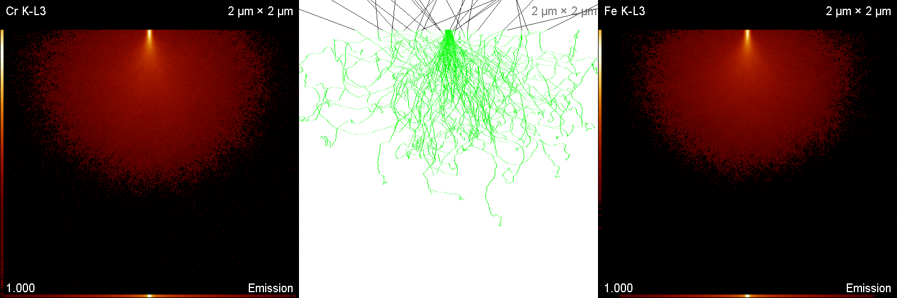
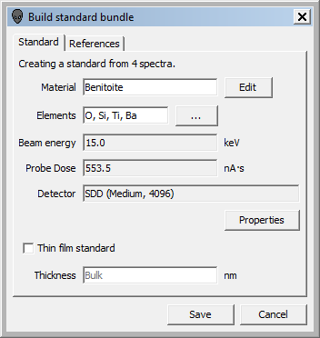
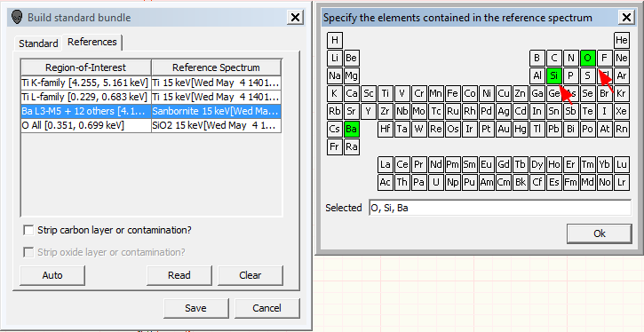
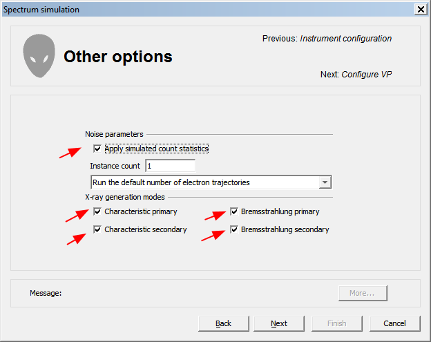

[Back to Index](../README.html)

Note that Nicholas Ritchie has released some helpful videos on
[YouTube](https://www.youtube.com/channel/UCt4nKyhfFQ8xecHyuTnCvIA).
He tries to put out a new release yearly and bug-fix releases as
needed.

# Key tricks

## Making Reports portable

DTSA-II writes reports into the users working directory.

On my MacBook it is in a directory like this.

```
/Users/jrminter/Documents/DTSA-II Reports/2020/July/12-July-2020
```

On my Win10 box it is

```
C:/Users/johnr/Documents/DTSA-II Reports/2020/July/12-Jul-2020
```

An experiment on windows 10:

I set a user environment variable, `DTSA2_REPORT_DIR`, to
`C:/Users/johnr/Documents/DTSA-II Reports`. When I use it to construct
a path in a Jython Script

The `index1.html` is the first report for the day. These reports
use **hard-coded** paths to the spectra and images. This is problematic
if one moves the report. There are some helpful search and replace
strategies that help. I edit the html files to use **relative paths**.

**Note;** If you do **not** want DTSA-II to over write a report, chnage the name
to `report1.html`.

An example would be a long string like:

```
file:/Users/jrminter/NIST%20DTSA-II%20Reports/2020/July/12-Jul-2020/my_spectra.msa
```
One searches for the appropriate string (see above...)

and **replaces** the long path wih a **relative path**:

```
file:./my_spectra.msa
```

To make my analyses portable, I include all spectra and images in the
working report directory and then search and replace all file paths
with their relative equivalents. This makes it easy to move reports
to different computers.

I also tend to make an archive of each report and the date.

One issue is that I typically keep the jython scripts in github 
repositories. The best solution is to keep a zipped report with the
jython script.

I find it helpful to keep a text file with the path options
in a separate window. I typically keep something like this
as a hint on the search and replace:

```

file:/Users/jrminter/NIST%20DTSA-II%20Reports/2020/July/12-Jul-2020/

file:./

```


## Notes from Nicholas Ritchie's videos

### The mouse wheel

**The mouse wheel** zooms in and out on intensity.Can also click and
drag by the counts on the left side.

### Right mouse button menus

**Right mouse button** - displays a context sensitive menu with helpful
tools or options to set. Can also copy status text to the clipboard
from this menu. Can select how lines are labeled. IUPAC is preferred
or element abbreviation for an uncluttered look.

### Copy as bitmap

**Copy as bitmap** produces a high resolution bitmap. Scaling is a bit
counter-intuitive. Lettering size is a function of size on the screen.
N. Ritchie typically drags window to 800x250 pixels. On the Mac I can't
get below 270, so I tried 900x300.


### The Material Editor

**When using the material editor**, start with a throw-away name like
"Unknown" to prevent overwriting something in the database by accident.
This permits storage and re-use. A good name begins with a letter and
has only letters and numbers. Do not use spaces or odd characters like
`+` or `-` because they can be interpreted as a formulas or sum of
fractions.    
    
    We can type `SiO2` and it will parse the formula. Then all we need
    do is add the density. Be **careful** with capitalization. Only
    capitalize the first letter of each element's abbreviation or you
    will get unexpected results. It can parse the formula for
    fluoroapatite (`Ca5(PO4)3F`). It will also parse sums of mass
    fractions....    
    
    We can also do oxide fractions like this for eagleXG:

  ```
  0.6447825*SiO2+0.1702057*Al2O3+0.1051482*B2O3+0.0542376*CaO+0.0128153*MgO+0.0082368*SrO+0.0015215*SnO2+0.0012188*BaO+0.0005078*Fe2O3+0.0004635*Sb2O3+0.0003145*As2O3+0.0002938*ZrO2+0.0002540*TiO2
  ```
Type the string above into the empty dialog and press "add". We can then
add the density (2.36) and change the name to '**EagleXG**' and save the
results.

I frequently need to be reminded of the material names for the materials
that I have in the database. Happily, DTSA-II provides the function
`listMaterials()` from the command line.


### Stiching Emission and Trajectory images

I occasionally want to make a montage of a couple of element
emission images and the trajectory image output by DTSA-II Monte Carlo
Simulations. The result of a simulation of an Fe-Cr alloy at 20 kV. The result
is shown below.



1. Convert each image to an `RGB TIF` image using Fiji/ImageJ.

2. Name each of these with `tile-1.tif`, `tile-2.tif`, ...

3. Use ImageJ macro, `stitch.ijm` macro to process the image. You can
a grid of images. Yo can insert a blanks to fill the array.

Below is an example with a single row of three images.
**Do not change the large blank area after `order=[Down & Right` ... **

```
run("Grid/Collection stitching", "type=[Grid: column-by-column] order=[Down & Right                ] grid_size_x=3 grid_size_y=1 tile_overlap=0 first_file_index_i=1 directory=C:/Users/johnr/Documents/stitch file_names=tile-{i}.tif output_textfile_name=TileConfiguration.txt fusion_method=[Linear Blending] regression_threshold=0.30 max/avg_displacement_threshold=2.50 absolute_displacement_threshold=3.50 computation_parameters=[Save memory (but be slower)] image_output=[Fuse and display] use");
saveAs("Tiff", "C:/Users/johnr/Documents/stitched.tif");    
run("RGB Color");    
selectWindow("stitched.tif");    
close();    
selectWindow("stitched.tif (RGB)");    
saveAs("Tiff", "C:\\Users\\johnr\\Documents\\stitch\\stitched.tif");  
// set a scle bar if needed...
// run("Set Scale...", "distance=1 known=2.822 unit=nm");    
// run("Add Scale Bar", "width=100 height=9 font=48 color=White location=[Lower Right] bold");    
// close();    

```


### DTSA's two "Composition" values

**There are two "Composition" values**. There is the accepted or
standard value that we enter through the material editor and the measured 
composition from spectra.

### Spectrum List functions

**Spectra list** also has a context-sensitive menu accessed by right click

### Report Tab Functions

**The Report tab** has summary of the experiment. Because it is HTML these
reports are search-able using the OS.

The Report menu has a "Report Note" button that lets the user add
comments or notes to the report. One can also add the 
spectrum display to the report.

I find it helpful to type the comments in a text editor with a spell
checker before entering into the report. DTSA's report functions are
looking more favorable each time I use them.

**To do:** Consider
what best practices would look like in syncing these between computers. It
also looks like DTSA overwrites the report each time. Too bad because one
cannot keep it open in an editor with a spell checker and have it correct
spelling.

### The command Line

**The command line** is useful for repetitive tasks.

**Generic Python Utility Methods**

- `dir()` Displays a list of global functions, classes and variables
- `dir(obj)` Displays a list of methods and properties of the object obj
- `help()` Displays global help
- `help(obj)` Displays help on the object obj

**DTSA-II Specific Utility Methods**

- `ls()` Displays a list of all spectra in the Spectrum List with aliases
(`s?` here `?` is an integer)
- `spectra()` Returns a list object containing the spectra in the
Spectrum List. `spectra(True)` returns only the selected spectra.
- `listDetectors()` Displays a list of all available detectors with
aliases ('d?' where ? is an integer)
- `listEdges("Pb")` - List absorption edges for an element
- `listTransitions("Fe")` - list the X-ray Transitions
- `listData("Si")` - list the X-ray data for an element
- `getElement()` Opens a GUI to delect a single element
- `getElements()` Opens a GUI to delect multiple elements
- `createMaterial()` Opens a GUI to select or create a new Composition
or Material
- `display(getMac("S310"))` - display the mass absorption for a material
- `mac("S310","Fe")`

    ```
Density = 7.89 g/cm^3
XRT         MAC    u(MAC)   Range
	       (cm^2/g)	(cm^2/g)   (um)
Fe K-L3   163.226  11.6626  7.76486
Fe K-L2   164.145  11.7284  7.72137
Fe K-M3	  132.804  9.07225  9.54362
Fe K-M2	  132.804  9.07225  9.54362
Fe K-M5   135.127  24.8619  9.3795
Fe L3-M5  5974.97  1219.93  0.212123
Fe L3-M4  5974.97  1219.93  0.212123
Fe L3-M1  7167.91  1519.88  0.17682
Fe L2-M4  10903.4  4982.74  0.116241
Fe L2-M3  6238.73  1245.58  0.203155
Fe L2-N1  10885.2  4974.14  0.116436
Fe L2-M1  6821.43  1442.1   0.185801
Fe L1-M3  10674.6	2169.09	0.118733
Fe L1-M2  10674.6	2169.09	0.118733

    ```
- **Useful Objects**

    ```
    elm = element("Fe")
    shell = atomicShell("Fe L3")
    xrt = transition("Fe L3-M5")
    comp = material("Fe2O3")
    mat = material("Fe2O3", 5.23)
    xrts = epq.XRayTransitionSet(epq.Element.Fe,
                                 epq.XRayTransitionSet.K_FAMILY)

    ```
- **Common Aliases**

    ```
import gov.nist.microanalysis.Utility as epu
import gov.nist.microanalysis.EPQLibrary as epq
import gov.nist.microanalysis.Utility as epu
import gov.nist.microanalysis.EPQTools as ept
import gov.nist.microanalysis.EPQLibrary.Detector as epd
import java.util as ju
import java.io as jio
import java.nio.charset as cs
import dtsa2.mcSimulate3 as mc3
import java.lang as jl
    ```


- **Spectrum Math:** Given spectrum `s1` = Fe, `s2` = Cr and `s3` = Ni,
we can write an expression with operations `+`, `-`, `*`, and `abs()`:

    ```
    1> res = (0.6*s6+0.25*s4+0.15*s10)
    2> res.rename("Name")
    3> res.display()
    ```


- The `tabulate()`
function is helpful. For example, one might select a range of values
and enter

    ```
    1> tabulate(selected())
   ```

    and then copy the results to the clipboard to go into Excel or
    a Rmarkdown table.

    One can also get information about materials and detectors.

- Get key functions are:

1. `listMaterials()`
2. `describe()`
3. listDetectors()
4. findDetector("name")

Here is an example:

```
1> listMaterials()
[AZO2, AZO5, AdmiraltyBrass, Ag, Al, Al2O3, AlFe, AuPd, Benitoite, C, C2F4, Ca(OH)2,
 CaCO3, CaCl2, Co, Cu, Cu standard, CuAl2, EDOT, EagleXG, Epon828, Fe, Fe standard,
 Fe2O3, Fe3O4, FeNi, Henoc, K240, K411, K412, K496, KBr, KCl, Kapton, Mg, Mn,
 Mn standard, NaCl, Ni, Orthoclase, PAN, PET, PMMA, Pd, SRM484, SS309, SS316,
 Sanborite, Si, SiO, SiO2, Ta, TiB2, TiO2, V2O5, Zn, Zn standard, ZnO, nbsNiFe]
```

followed by

```
2> describe("AdmiraltyBrass")
AdmiraltyBrass
Density 8 g/cm³
Element Z          Mass Frac  Norm Mass Atom Frac
Copper 29          0.69       0.69      0.699224
Zinc   30          0.3        0.3       0.295351
Tin    50          0.01       0.01      0.0054246
--     29.51       1          1.0       1.0
```

and

```
3> describe("AZO5")
AZO5
Density    6 g/cm³
Element    Z        Mass Frac Norm Mass Atom Frac
Oxygen     8        0.20128   0.201282  0.499999
Aluminum  13        0.01697   0.0169702 0.024997
Zinc      30        0.78174   0.781748  0.475004
--        25.2831   0.99999   1.0       1.0
35>
```

For `tabulate(selected())` I tried an experiment where I simulated a
SiO~2~ standard at 4 kV with 12,000 trajectories. I then simulated
two SiO "unknowns" : The first with 3,000 trajectories and the second
with 12,000 trajectories. I then used the `Quantification Alien` to 
measure the composition of each spectrum. I selected the two unknown
spectra from the Spectrum window and went to the command line and ran

```
1> tabulate(selected())
Name                    O       Si      Total
sim-SiO-4kV-3k-traj     36.7215 63.9725 100.6939
sim-SiO-4kV-12k-traj    36.7516 63.8028 100.5544
Average                 36.7365 63.8876
```

This might make an interesting problem for scripting spectra with more
noise...


### Detector Parameters

**Entering the detector parameters** permits us to simulate
**dose-correct** spectra. One can also tune the parameters by
running a series of simulations. The manufacturer's values may
not be correct. I discovered this with the Oxford detector on the
Sirion because the solid angle appeared to be lower than claimed.


### Element Dialog tips

**If the material is in the database** (e.g. K240), type the name in the
element dialog and type control-enter and it will add all the lines.

### Analytical Simulations

**The analytical simulation uses XPP** - the simplified model of
Pouchou (Ritchie pronounces as "Pooshoo") and Pichoir
(Ritchie pronounces as "Poushwar"). My French has always sounded
awful...

### Monte Carlo Simulations

**Monte Carlo Simulations** are more flexible. Knowing the density is
more critical for specimens that are not flat.

### Peak Shape References


All quantitative EDS measurements involve
comparing the intensity of the peak in the unknown to that from a
standard measured under (or corrected to) the same conditions. This
process usually involves spectrum fitting. The unknown specimen is fit
to spectra from the various elements from standard specimens. The 
composition of the unknown is determined from the results from those
fits.

Consider an example of analysis of a complex glass, K-240, where we
will focus on the elements Ba and Ti. In the region around 4.5 kVe Ba
and Ti have a particularly nasty overlap. A good strategy in 
quantitative analysis is to choose a standard similar in composition
to what you expect for the unknown. This minimizes the magnitude of
the matrix corrections and reduces the uncertainty of our results.
    
In this case we choose Benitoite. The relative intensity in the
region of interest is similar. The K-240 differs in that it has 
additional Zr, Mg, and Zn.
    
Benitoite has a problem as a standard for K-240: There is a
significant overlap between Ba and Ti near 4.5 keV. To extract the
information about Ba and Ti is challenging. We can fit a pure Ti
spectrum and a pure Ba spectrum without other interferences in this
region to the peak shape of our unknown. We can extract with good
precision the intensities from Ba and Ti in this region. We might
use a pure Ti sample and a sample of Sanbornite which is Ba silicate
and does not contain Ti. We will treat Ti and Sanbornite as peak
references. Reference spectra are only required if the standard has
interferences.

### The Make Standard Bundle

Use the Make Standard Bundle. Specify the material. For Benitoite,
see [webmineral.com](http://webmineral.com/data/Benitoite.shtml#.W7Pw2BNKg_V).
    
We start with this dialog
    

    
When we set reference spectrum, we need to **list all the elements** in
the spectrum. Only the specified element will be highlighted when we
start. We need to supply the rest by checking the box in the dialog.
    

    
We really only need to know the elements present in the reference. It is
only being used for the **peak shape** information to fit the overlapped
peaks in the unknown (and perhaps the standard as in this case).
    
The software is looking for a "sufficient separation" of peaks so that 
background regions can be defined. This requires a separation from other
peaks of about one full width at half maximum on each side. We need to
know the background to get the peak intensity. In DTSA-II's filter fit,
this requires this 1 FWHM on each side to make a sufficiently precise
measurement of the background. The **Standard Bundler** makes this easier
for the user.
    
After working through the K240 example from the Advanced Quant video, it
seems that one should generate a standard bundle for each of the standards
one will use and use those `.zstd` files for the quantification.

## Saving and reading spectra as XML

DTSA-II has a function to store and read spectra in `.xml` format
which stores much more metadata than the `.msa` format. We can do
this from the command line. After reading in (or simulating) a
spectrum, set the composition (if appropriate). Then go to the
command and list the spectra with

```
ls()
```

Spectra will be labeled `s1`, `s2`, ... Note the spectrum identifier 
associated with the spectrum you want to store as an XML file.
Save the file from the command line:

```
s2.toXML("/Users/jrminter/Desktop/Cu-2017-12-14-5eV-ch-2K.xml")
```

Read the spectrum from the command line with:

```
spc = spectrumFromXML("/Users/jrminter/Desktop/simulated-EagleXG.xml")
spc.display()
```

## X-ray transitions from the command line

1. Define a transition using the IUPAC name

    ```
    tra = transition('Si K-L3')
    ```

2. Print the Siegbahn name

   We print to render the unicode...

    ```
    print(tra.getSiegbahnName())
    Si Kα1
    ```
    Compare to IUPAC name
    
    ```
    print(tra.getIUPACName())
    Si K-L3
    ```
3. Get the relative weight

    ```
    tra.getWeight(0)
    1.0
    ```
    
    Compare to normalized
    
    ```
    tra.getWeight(1)
    0.6441638752898737
    ```
    
    Now compare to K-L2
    
    ```
    tra = transition('Si K-L2')
    tra.getWeight(0)
    0.505
    print(tra.getSiegbahnName())
    Si Kα2
    ```
    
    Now specify explicitly. This gives us granular control.
    The class defines many strings...
    
    ```
    xrts = epq.XRayTransitionSet(epq.Element.Fe,
                                 epq.XRayTransitionSet.K_FAMILY)
    xrts = epq.XRayTransitionSet(epq.Element.Fe,
                                 epq.XRayTransitionSet.L_FAMILY)
    xrts = epq.XRayTransitionSet(epq.Element.Fe,
                                 epq.XRayTransitionSet.K_ALPHA)
    
    ```
    
    


## Using the **Simulation alien** to simulate individual spectrum components.

In general, I prefer to use a script to do simulations, but the
simulation alien has the ability to turn off/on different components.
Note the dialog below:




## Sources for free microanalysis software

DTSA-II is also included in
[this](http://probesoftware.com/smf/index.php?topic=927)
list from the Probe Software Forum!

## Energies for low energy L-l lines (L_II.III_) from light elements 

These are from Bearden (1967).

| Element | eV |
|:--------|---:|
| Na | 30.45 |
| Mg | 49.3 |
| Al | 72.4 |
| Si | 91.5 |
| P | 119.4 |
| S | 148.7 |

## For spectrum rename

| Symbol  | Description  |
|:--------|:-------------|
| \$I\$ | Index |
| \$ACQ\$ | Acquisition date and time |
| \$E0\$ | kV |
| \$I0\$ | probe current |
| \$CLIENT\$ | client |
| \$SPOT\$ | spot size | 
| \$DT\$ | dead time | 
| \$DET\$ | detector |  
| \$INST\$ | instrument | 
| \$OPER\$ | operator | 
| \$LT\$ | live time | 
| \$COMP\$ | composition | 
| \$OCR\$ | output count rate | 
| \$PA\$ | | 
| \$PROJ\$ | project | 
| \$PPS\$ | | 
| \$PPT\$ | | 
| \$RT\$ | | 
| \$RES\$ | resolution | 
| \$SHAPE\$ | shape | 
| \$MT\$ | | 
| \$SPEC\$ | specimen | 
| \$THICK\$ | thickness | 
| \$POS\$ | position | 
| \$PREV\$ | previous | 


## Database

see [vogella.com](http://www.vogella.com/tutorials/ApacheDerby/article.html)

see [apache.org](https://db.apache.org/derby/papers/DerbyTut/install_software.html)

Install derby.

On Windows, set environment variables

```
DERBY_INSTALL    C:\Apps\derby

CLASSPATH        %DERBY_INSTALL%\lib\derby.jar;%DERBY_INSTALL%\lib\derbytools.jar;.

JAVA_HOME        C:\Apps\Java64\jdk1.8.0_121

```

then start ij from a command prompt with:

```
java org.apache.derby.tools.ij
```


Use ij

```
connect 'jdbc:derby:/path/to/DTSA/Database v2/';

on Window

show schemas;
show tables in APP;
show indexes in app;

select * from APP.DETECTOR;


disconnect;
```

dump the schema

```
dump the schema

dblook -d 'jdbc:derby:/Users/jrminter/DTSA/Database v2/' -z APP -o dtsa2-db.sql
```

looks like

[ddlutils](http://db.apache.org/derby/integrate/db_ddlutils.html) can backup databases...

## Frequently needed scripts

### The OSImageAnalysis git repository

**In dtsa2/productionScripts directory:**

- JmGen.py is the workhorse.
- DumpMaterials.py and the **restore script** stds.py. Edit this last one to add new materials.
- listDetCalibrations.py to see what calibrations we have
- testGetMassFraction.py to aid adding new standards

### The dtsa2Scripts git repository

This repository has many examples

- jmGen.py is in the `jmGen` folder

- jmMC3.py is in the `jmMC3` folder

- The `materials` folder has code to create the materials database

- the `rplScripts` folder has some examples of creating and processing
data cubes

- The `utility` folder has many test scripts


## A proposed standard

Mark suggested I might be able to order this from
[Ted Pella](https://www.tedpella.com/calibration_html/UHV-EL_Reference_Standards_for_EDS_WDS.htm)
in Dec.

```
From Ted Pella

A standard
6075    UHV-EL 6 Rectangular Retainer, 9 x 12 mm,
        with 6 reference standards (select from list)  each    685.00  
or
6076    UHV-EL 9 Square Retainer, 13 x 12 mm,
        with 9 reference standards (select from list)  each    995.0

1. Faraday Cup, for beam current measurement, is available for all of the
   retainers and will take one of the spaces.
2. 146. Zinc Oxide  ZnO HP  ?
3. 102. Silicon Si  C   5N*
4.   1. Aluminum    Al  F   3N* or 
     3. Aluminum Oxide Al2O3 C 4N*
5.  30. Copper  Cu  F   2N or 
    31. Cupric Oxide    CuO P   3N
6.  89. Palladium   Pd  P   3N
7.  16. Boron Phosphide BP  P   3N
8. 108. Silver  Ag  F   3N5
9. 179. Rutile  TiO2

```

## Defining a custom material

It is important to add a name when one define a name when defining a
custom material that will be used with the MC3 simulations. Here is an
example for PET.
**Note that the mass fractions are useful for complex materials.**


```
pet = epq.Material(epq.Composition([epq.Element.C,epq.Element.H,epq.Element.O],
                                   [0.62502,0.04196,0.069042]),epq.ToSI.gPerCC(1.37))
pet.setName("PET")
```

or

```
k412 = epq.Material(epq.Composition([epq.Element.O,
                                     epq.Element.Mg,
                                     epq.Element.Al,
                                     epq.Element.Si,
                                     epq.Element.Ca,
                                     epq.Element.Fe],
                                    [ 0.4276,
                                      0.1166,
                                      0.0491,
                                      0.2120,
                                      0.1090,
                                      0.0774]
                                      ),
                                    epq.ToSI.gPerCC(2.600))
k412.setName("K412")

```


The final step is **really important** - sometime the simple approach produces Unicode characters in output file name generated automatically and these crash. **Simple names are better!!!**

**Get the mass fractions from the molecular formula the easy way:** 
I added a function to jmGen.py (v. 0.0.7) that wraps the utility functions in DTSA-II. The prototype is:

```
getMassFractions(compound, elemList, iDigits)
```

that one uses like this for an AZO compound with 2\% Al substituted for Zn:

```
import gov.nist.microanalysis.EPQLibrary as epq
import dtsa2.jmGen as jmg

elements = [epq.Element.Al, epq.Element.Zn, epq.Element.O]
massFra = jmg.getMassFractions("Al2Zn98O100", elements, 5)
```

which returns a dictionary with the mass fractions:

```
{'Al': 0.00669, 'O': 0.19841, 'Zn': 0.7949}
```


## File naming tricks

For simulations, I often name files with a **compound-kV-nTraj** type syntax. Writing a helper function can minimize repetition.
I added getSpecPath(baseName, baseDir, e0, nTraj) to jmMC3.py


Here is my work-in-progress for a quantification script


```

ff = epq.FilterFit(det, epq.ToSI.keV(e0))
ff.addReference(element("Al"), al)
ff.addReference(element("Zn"), zno)
ff.addReference(element("O"), zno)
kr  = ff.getKRatios(azo)
kO  = kr.getKRatioU(epq.XRayTransition(epq.Element.O,epq.XRayTransition.KA1))
kZn = kr.getKRatioU(epq.XRayTransition(epq.Element.Zn,epq.XRayTransition.LA1))
kAl = kr.getKRatioU(epq.XRayTransition(epq.Element.Al,epq.XRayTransition.KA1))

fs = "%g\t%g\t%g\t%g\t%g\t%g" 

znoMat = epq.Material(epq.Composition([epq.Element.Zn,epq.Element.O],
                                      [0.80349,0.19651]),
                                      epq.ToSI.gPerCC(5.61))

stds = { epq.Element.Zn : znoMat, epq.Element.O : znoMat }

print (fs % (kO.doubleValue(), kO.uncertainty(),
             kZn.doubleValue(), kZn.uncertainty(),
             kAl.doubleValue(), kAl.uncertainty() ))


qr = quant(kr, 35.0, e0, stds, None, False, None, None)

print(qr)

print(dir(qr))

print(dir(qr.atomicPercentU(epq.Element.Al)))


def formatElement(qr, el):
    strLine  = "%s, " % el.toAbbrev()
    strLine += "%.6f, " % qr.atomicPercentU(el).doubleValue()
    strLine += "%.6f" % qr.atomicPercentU(el).uncertainty()
    return(strLine)

print("El, at.fra.mu, at.fra un")
out = formatElement(qr, epq.Element.Al)
print(out)
out = formatElement(qr, epq.Element.Zn)
print(out)
out = formatElement(qr, epq.Element.O)
print(out)


```


# System Administration

## Preferences

### Windows

On Windows, preferences are stored in the registry. The base key is:

```
[HKEY_CURRENT_USER\Software\JavaSoft\Prefs\gov]
```
It is always useful to export this as a `.reg` file.

### MacOS

On MacOS, preferences are stored in a `.plist` file...

```
~/Library/Preferences/gov.nist.microanalysis.plist
```
Edit this using XCode.

To force reloading from the cache file see [here](https://nethack.ch/2014/03/30/quick-tip-flush-os-x-mavericks-plist-file-cache/
), use the following from the terminal

```
defaults read gov.nist.microanalysis.plist
```

I added the alias `read-dtsa-plist` to my `.bash_profile` file to
make this easy.


# Getting NISTMonte Monte Carlo packages to work with Iona and Jupiter

DTSA-II Iona seems to not export classes that were available
in Halley. I noticed that the `mcSimulate3.py` file had these
curious lines at the top:

```
import sys
sys.packageManager.makeJavaPackage("gov.nist.microanalysis.NISTMonte.Gen3", "CharacteristicXRayGeneration3, BremsstrahlungXRayGeneration3, FluorescenceXRayGeneration3, XRayTransport3", None)
```

Note: it does **not** like the lines to be split...

I did a Google search  and found
[this](http://sourceforge.net/p/jython/mailman/message/6725556/)
explanation: The following code works with Jython launched from the jar in the standard install:

```
import java.awt
f = java.awt.Frame()
f.title = "Hello AWT"
f.visible = True
```

but when run with `Jython.jar` from the standalone install
the code gives

```
>java -jar jython.jar
Jython 2.2b1 on java1.6.0 (JIT: null)
Type "copyright", "credits" or "license" for more information.
>>> import java.awt
Traceback (innermost last):
  File "", line 1, in ?
ImportError: no module named awt
>>> ^Z
```

WORKROUND

You need to nudge the system to do what caching would have done:-

```
import sys
sys.packageManager.makeJavaPackage("java.awt", "Window", None)
import java.awt
f = java.awt.Frame()
f.title = "Hello AWT"
f.visible = True
```

[Back to Index](../README.html)
