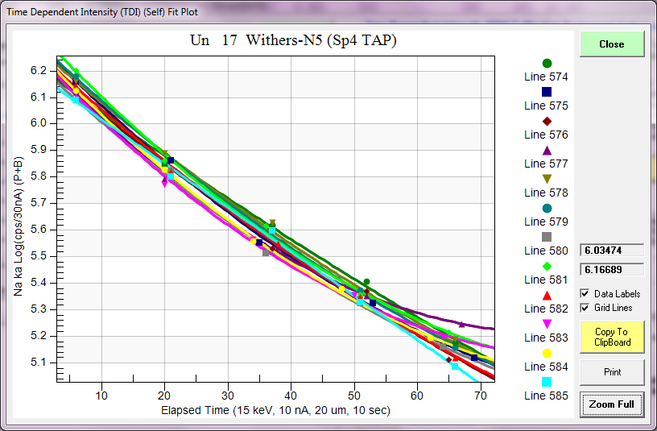

[Back to Index](../README.html)

From [here](https://probesoftware.com/smf/index.php?topic=92.msg7701#msg7701).


Since I mentioned the effect of not including water by difference as it affects the matrix correction in my JEOL Listserver post,
I will "show my work" as to how the various unanalyzed elements affects the analyzed elements, as they are added to the matrix
correction of a hydrous glass. For a publication reference see
[this](https://link.springer.com/article/10.1007%2Fs00445-005-0003-z) paper.

In this example I selected an experimental glass from Withers, which nominally contains 4.9 wt.% H~2~O, but FTIR showed 5.06 wt%.
Here is the analysis of this glass as an unknown with nothing but the analyzed elements:

```
Un   17 Withers-N5, Results in Elemental Weight Percents
 
ELEM:       Na       K      Cl      Ba       F      Ti      Fe      Mn      Ca      Si      Al      Mg       O       H       O
TYPE:     ANAL    ANAL    ANAL    ANAL    ANAL    ANAL    ANAL    ANAL    ANAL    ANAL    ANAL    ANAL    ANAL    SPEC    SPEC
BGDS:      MAN     LIN     LIN     LIN     LIN     LOW     MAN     LIN     MAN     MAN     MAN     MAN     EXP
TIME:    60.00   20.00   10.00   20.00   40.00   10.00   40.00   10.00   20.00   20.00   20.00   60.00     ---     ---     ---
BEAM:     9.98    9.98    9.98    9.98    9.98    9.98    9.98    9.98    9.98    9.98    9.98    9.98     ---     ---     ---

ELEM:       Na       K      Cl      Ba       F      Ti      Fe      Mn      Ca      Si      Al      Mg     O-D       H       O   SUM 
   574   1.206   3.594    .218    .029    .046    .106   2.963    .058    .154  30.812   4.487   -.010     ---    .000    .000  43.664
   575   1.187   3.590    .221    .016    .045    .122   2.951    .076    .140  30.681   4.454   -.014     ---    .000    .000  43.469
   576   1.163   3.469    .192    .032    .054    .135   2.960    .080    .121  30.677   4.413   -.019     ---    .000    .000  43.275
   577   1.171   3.500    .276    .040    .059    .096   2.993    .056    .109  30.817   4.512   -.020     ---    .000    .000  43.610
   578   1.225   3.549    .276   -.013    .045    .071   3.001    .078    .108  30.727   4.451   -.012     ---    .000    .000  43.505
   579   1.218   3.559    .255   -.077    .038    .122   3.019    .079    .123  30.718   4.502   -.015     ---    .000    .000  43.541
   580   1.143   3.579    .238    .015    .048    .100   2.954    .052    .124  30.733   4.422   -.020     ---    .000    .000  43.387
   581   1.235   3.438    .264   -.019    .065    .116   2.933    .048    .144  30.823   4.443   -.015     ---    .000    .000  43.475
   582   1.170   3.501    .175   -.025    .043    .132   3.028    .049    .112  30.879   4.462   -.012     ---    .000    .000  43.514
   583   1.160   3.556    .233   -.061    .018    .145   2.995    .030    .136  30.874   4.465   -.017     ---    .000    .000  43.534
   584   1.183   3.491    .227    .004    .018    .122   2.956    .061    .125  30.945   4.416   -.017     ---    .000    .000  43.532
   585   1.148   3.503    .204    .029    .038    .119   2.978    .059    .153  30.943   4.465   -.015     ---    .000    .000  43.623

AVER:    1.184   3.527    .232   -.002    .043    .115   2.978    .060    .129  30.802   4.458   -.016     ---    .000    .000  43.511
SDEV:     .031    .051    .032    .038    .014    .020    .029    .015    .016    .095    .032    .003     ---    .000    .000    .105
SERR:     .009    .015    .009    .011    .004    .006    .009    .004    .005    .028    .009    .001     ---    .000    .000
%RSD:     2.59    1.43   13.87-1520.63   33.07   17.23     .99   25.47   12.47     .31     .72  -21.27     ---     .00     .00
STDS:      336     374     285     835     835      22     395      25     358     162     336      12     ---     ---     ---

STKF:    .0735   .1132   .0602   .7431   .1715   .5547   .6779   .7341   .1693   .2018   .1333   .4736     ---     ---     ---
STCT:   2447.9  2423.7   839.3  8520.6  2398.7  6097.6 14136.8 13590.2  2247.6 34290.6 23223.7 24410.3     ---     ---     ---

UNKF:    .0082   .0301   .0017   .0000   .0002   .0010   .0258   .0005   .0011   .2710   .0411  -.0001     ---     ---     ---
UNCT:    274.6   645.2    24.2     -.2     2.7    10.8   538.5     9.5    15.2 46037.3  7157.6    -6.4     ---     ---     ---
UNBG:     16.0    12.6     5.0    29.0     3.8     5.8    30.1    16.1     5.4   173.0   135.8    23.3     ---     ---     ---

ZCOR:   1.4355  1.1708  1.3315  1.3476  2.1906  1.1747  1.1530  1.1748  1.1290  1.1368  1.0853  1.2443     ---     ---     ---
KRAW:    .1122   .2662   .0289   .0000   .0011   .0018   .0381   .0007   .0068  1.3426   .3082  -.0003     ---     ---     ---
PKBG:    18.14   52.35    6.39    1.00    1.77    3.03   18.90    1.61    3.79  267.17   53.70     .72     ---     ---     ---
INT%:     ----    ----    ----   -3.80    ----    -.02    ----    ----    ----    ----    ----    ----     ---     ---     ---
```

If we calculate the above elemental analysis as oxide formulas (but still without oxygen included in the matrix correction), we get
the following results:

```
Un   17 Withers-N5, Results in Oxide Weight Percents

ELEM:     Na2O     K2O      Cl     BaO       F    TiO2     FeO     MnO     CaO    SiO2   Al2O3     MgO     O-D     H2O       O   SUM 
   574   1.625   4.330    .218    .033    .046    .177   3.812    .075    .216  65.918   8.479   -.016     ---    .000    .000  84.911
   575   1.600   4.324    .221    .018    .045    .203   3.797    .098    .196  65.639   8.415   -.024     ---    .000    .000  84.533
   576   1.568   4.179    .192    .035    .054    .225   3.808    .103    .169  65.629   8.338   -.032     ---    .000    .000  84.267
   577   1.578   4.216    .276    .045    .059    .161   3.851    .072    .153  65.928   8.526   -.033     ---    .000    .000  84.831
   578   1.651   4.276    .276   -.015    .045    .118   3.861    .100    .152  65.736   8.410   -.020     ---    .000    .000  84.588
   579   1.642   4.287    .255   -.086    .038    .204   3.884    .102    .171  65.716   8.507   -.025     ---    .000    .000  84.696
   580   1.540   4.311    .238    .017    .048    .166   3.800    .068    .173  65.749   8.356   -.034     ---    .000    .000  84.432
   581   1.665   4.141    .264   -.021    .065    .193   3.773    .062    .202  65.942   8.395   -.025     ---    .000    .000  84.656
   582   1.577   4.217    .175   -.028    .043    .220   3.895    .063    .157  66.061   8.431   -.020     ---    .000    .000  84.792
   583   1.564   4.283    .233   -.068    .018    .241   3.853    .039    .190  66.051   8.437   -.028     ---    .000    .000  84.813
   584   1.595   4.205    .227    .004    .018    .204   3.803    .079    .175  66.202   8.344   -.027     ---    .000    .000  84.829
   585   1.547   4.220    .204    .032    .038    .198   3.831    .076    .214  66.199   8.436   -.024     ---    .000    .000  84.971

AVER:    1.596   4.249    .232   -.003    .043    .192   3.831    .078    .181  65.897   8.423   -.026     ---    .000    .000  84.693
SDEV:     .041    .061    .032    .042    .014    .033    .038    .020    .023    .204    .060    .005     ---    .000    .000    .207
SERR:     .012    .018    .009    .012    .004    .010    .011    .006    .007    .059    .017    .002     ---    .000    .000
%RSD:     2.59    1.43   13.87-1520.63   33.07   17.23     .99   25.47   12.47     .31     .72  -21.27     ---     .00     .00
STDS:      336     374     285     835     835      22     395      25     358     162     336      12     ---     ---     ---
```

Note that total is much better, but the SiO~2~ concentration is only 65.8 wt.%.  Now we will recalculate the glass but this time include
stoichiometric oxygen in the matrix correction:

```
Un   17 Withers-N5, Results in Oxide Weight Percents

ELEM:     Na2O     K2O      Cl     BaO       F    TiO2     FeO     MnO     CaO    SiO2   Al2O3     MgO     O-D     H2O       O   SUM 
   574   2.177   4.249    .205    .033    .085    .179   3.990    .077    .225  70.085   9.983    .016     ---    .000    .000  91.303
   575   2.144   4.244    .207    .018    .083    .206   3.974    .101    .205  69.801   9.909    .008     ---    .000    .000  90.901
   576   2.102   4.100    .180    .036    .099    .227   3.986    .107    .179  69.809   9.823   -.002     ---    .000    .000  90.646
   577   2.115   4.136    .258    .045    .109    .162   4.031    .074    .163  70.096  10.042   -.004     ---    .000    .000  91.230
   578   2.211   4.195    .258   -.015    .082    .119   4.041    .103    .161  69.906   9.904    .012     ---    .000    .000  90.978
   579   2.200   4.206    .239   -.087    .069    .206   4.064    .105    .181  69.881  10.022    .007     ---    .000    .000  91.093
   580   2.067   4.230    .223    .017    .087    .168   3.978    .070    .182  69.960   9.850   -.004     ---    .000    .000  90.828
   581   2.234   4.061    .248   -.021    .120    .195   3.949    .064    .211  70.160   9.897    .007     ---    .000    .000  91.123
   582   2.116   4.137    .164   -.028    .079    .222   4.076    .065    .166  70.273   9.939    .012     ---    .000    .000  91.222
   583   2.100   4.202    .218   -.068    .033    .244   4.032    .040    .198  70.295   9.953    .003     ---    .000    .000  91.248
   584   2.141   4.125    .213    .004    .033    .206   3.981    .082    .184  70.459   9.840    .003     ---    .000    .000  91.271
   585   2.076   4.141    .191    .032    .070    .200   4.010    .079    .223  70.423   9.943    .007     ---    .000    .000  91.394

AVER:    2.140   4.169    .217   -.003    .079    .194   4.009    .080    .190  70.096   9.925    .005     ---    .000    .000  91.103
SDEV:     .055    .060    .030    .042    .026    .034    .039    .021    .022    .230    .069    .006     ---    .000    .000    .223
SERR:     .016    .017    .009    .012    .008    .010    .011    .006    .006    .066    .020    .002     ---    .000    .000
%RSD:     2.55    1.44   13.88-1522.79   33.11   17.23     .98   25.47   11.70     .33     .70  120.12     ---     .00     .00
STDS:      336     374     285     835     835      22     395      25     358     162     336      12     ---     ---     ---
```

Please note that by including the stoichiometric oxygen in the matrix correction the SiO~2~ concentration went from 65.8 wt.% to 70.09 wt.%.
This is because oxygen absorbs Si Ka more than Si.  So without stoichiomtric oxygen in the matrix correction, the matrix is anomalously
high in Si, which again, does not absorb Si Ka as much as oxygen, so the matrix correction for Si is underestimated.

But we still have a total of only 91.1 wt.%, so one might be forgiven to estimate the water by difference as 8.9 wt.%.  But one would be
wrong because we haven't provided a correction for the ion migration of Na and the effect on the other elements. The TDI correction for
Na in this glass is around 100% as seen here in this plot of log intensity vs. time:



So turning on the TDI correction we obtain these analyses:

```
Un   17 Withers-N5, Results in Oxide Weight Percents

ELEM:     Na2O     K2O      Cl     BaO       F    TiO2     FeO     MnO     CaO    SiO2   Al2O3     MgO     O-D     H2O       O   SUM 
   574   4.117   4.182    .204    .033    .084    .179   3.989    .077    .224  69.392  10.084    .018     ---    .000    .000  92.582
   575   4.842   4.291    .207    .018    .082    .206   3.973    .101    .205  70.089  10.042    .010     ---    .000    .000  94.065
   576   4.255   3.997    .180    .036    .097    .227   3.985    .107    .179  69.839   9.930   -.001     ---    .000    .000  92.831
   577   4.575   4.261    .258    .045    .108    .162   4.029    .074    .163  69.847  10.167   -.002     ---    .000    .000  93.688
   578   4.550   4.211    .258   -.015    .081    .119   4.039    .103    .161  69.530  10.023    .013     ---    .000    .000  93.073
   579   4.687   4.256    .239   -.087    .068    .206   4.062    .105    .181  69.813  10.148    .008     ---    .000    .000  93.685
   580   4.257   4.207    .223    .017    .086    .168   3.976    .070    .182  69.621   9.960   -.003     ---    .000    .000  92.765
   581   4.968   4.191    .247   -.021    .118    .195   3.947    .064    .210  70.217  10.033    .008     ---    .000    .000  94.177
   582   4.447   4.237    .164   -.028    .079    .222   4.074    .065    .166  70.473  10.054    .013     ---    .000    .000  93.966
   583   4.547   4.070    .218   -.068    .032    .244   4.030    .040    .198  69.777  10.078    .004     ---    .000    .000  93.170
   584   4.524   4.049    .212    .004    .032    .206   3.979    .082    .184  70.249   9.959    .005     ---    .000    .000  93.486
   585   3.984   4.322    .191    .032    .069    .200   4.008    .078    .223  70.019  10.041    .008     ---    .000    .000  93.176

AVER:    4.479   4.190    .217   -.003    .078    .194   4.008    .080    .190  69.905  10.043    .007     ---    .000    .000  93.389
SDEV:     .288    .101    .030    .042    .026    .033    .039    .020    .022    .317    .072    .006     ---    .000    .000    .534
SERR:     .083    .029    .009    .012    .007    .010    .011    .006    .006    .091    .021    .002     ---    .000    .000
%RSD:     6.43    2.40   13.86-1523.55   33.08   17.23     .98   25.47   11.70     .45     .71   95.57     ---     .00     .00
STDS:      336     374     285     835     835      22     395      25     358     162     336      12     ---     ---     ---
```

Note that the Na concentration went from around 2.2 wt% to 4.4 wt.%, but the Si dropped slightly because the TDI effect on Si is usually
an increase in intensity as the Na intensity drops due to ion migration under the electron beam.

Now based on our totals of around 93.4 wt.%, our water by difference estimate would be around 6.6 wt.%, but that isn't very close to the
FTIR H~2~O measurement of 5.06 wt.%. So what's going on?  Well we have not yet included the water by difference into the matrix correction.

Once we do that we obtain these results:

```
Un   17 Withers-N5, Results in Oxide Weight Percents

ELEM:     Na2O     K2O      Cl     BaO       F    TiO2     FeO     MnO     CaO    SiO2   Al2O3     MgO     O-D     H2O       O   SUM 
   574   4.191   4.211    .205    .033    .086    .180   4.037    .078    .227  70.047  10.230    .020     ---   6.454    .000 100.000
   575   4.912   4.315    .207    .018    .084    .207   4.012    .102    .207  70.615  10.157    .011     ---   5.152    .000 100.000
   576   4.329   4.024    .181    .036    .100    .229   4.032    .108    .181  70.477  10.069    .001     ---   6.233    .000 100.000
   577   4.646   4.286    .259    .046    .110    .164   4.071    .075    .165  70.405  10.292   -.001     ---   5.483    .000 100.000
   578   4.627   4.239    .259   -.015    .083    .120   4.085    .104    .163  70.140  10.158    .015     ---   6.022    .000 100.000
   579   4.760   4.281    .240   -.088    .070    .207   4.104    .106    .182  70.371  10.272    .010     ---   5.485    .000 100.000
   580   4.333   4.236    .224    .018    .088    .169   4.024    .070    .184  70.264  10.101   -.001     ---   6.290    .000 100.000
   581   5.040   4.214    .248   -.021    .120    .196   3.985    .064    .212  70.735  10.146    .010     ---   5.052    .000 100.000
   582   4.513   4.261    .164   -.028    .080    .224   4.114    .065    .168  71.014  10.173    .015     ---   5.237    .000 100.000
   583   4.624   4.096    .218   -.069    .033    .246   4.075    .040    .200  70.382  10.213    .006     ---   5.936    .000 100.000
   584   4.597   4.074    .213    .004    .033    .207   4.022    .083    .186  70.832  10.085    .007     ---   5.658    .000 100.000
   585   4.050   4.350    .191    .033    .071    .202   4.053    .079    .225  70.631  10.176    .010     ---   5.929    .000 100.000

AVER:    4.552   4.216    .217   -.003    .080    .196   4.051    .081    .192  70.493  10.173    .009     ---   5.744    .000 100.000
SDEV:     .288    .100    .030    .043    .026    .034    .039    .021    .022    .284    .070    .007     ---    .469    .000    .000
SERR:     .083    .029    .009    .012    .008    .010    .011    .006    .006    .082    .020    .002     ---    .135    .000
%RSD:     6.33    2.38   13.86-1528.18   33.05   17.22     .97   25.48   11.66     .40     .69   76.35     ---    8.16     .00
STDS:      336     374     285     835     835      22     395      25     358     162     336      12     ---     ---     ---
```

Note that our SiO~2~ concentration went up slightly because we added additional oxygen (from H~2~O) into the matrix calculation, and so now our
water by difference is around 5.7 wt.% which is quite close to our FTIR value of 5.06 wt.%.  If we had included other trace elements in the
analysis, we would get even closer.

So, the lesson is, always include all the unanalyzed elements into the matrix correction, or you will have significant errors in the analyzed
elements.  Excel is great, but it doesn't know physics!  Please let me know if anyone has any questions.

[Back to Index](../README.html)
