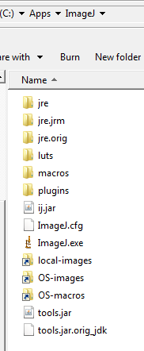

[Back to Index](../README.html)

# Introduction

Plugins make image processing and analysis in `Fiji/ImageJ` easier by wrapping
many steps into a plug-in. The process is complicated because there are two
different underlying approaches. The oldest is the approach used by `ImageJ1`.
I have written many scripts for this mode over several years. There is a newer,
more complex system in `ImageJ2`. Both of these approaches use  the `Java` language
and `Maven` as a build manager, typically using `Eclipse`. Ultimately, there are
automated builds and the code is expected to be maintained under version control
on `github`. Getting started is a bit intimidating and there is
**_a lot_ to learn**. This document serves as my reference and a way for me to
understand the development process.

The [Tomancak](https://www.youtube.com/watch?v=YIWpoBnnLio) group provided a 
helpful example video that is on YouTube.

**2019-05-06**

I am having problems with legacy ImageJ1 plugins that compile without errors
but do not work when called from jython scripts. When installed, they do not
appear in the menus (a known limitation). I did get an ImageJ2 example to
compile and execute as expected. I might do better to stick with Jython script
libraries while I teach myself to build ImageJ2 plugins. Grrrrr....

See a work-around below...

# Quick and dirty compilation of legacy IJ1 plugins

1. Install current `ImageJ1` software from Wayne's repository. The current
release is IJ-152. I downloaded the 64 bit window version for `crunch`
and installed it in `C:\Apps\ImageJ`. This is bundled with
`jre1.8.0_112`

2. I downloaded
`java-1.8.0-openjdk-1.8.0.212-1.b04.ojdkbuild.windows.x86_64` from
[github](https://github.com/ojdkbuild/ojdkbuild#downloads-for-windows-x86_64)
and replaced the existing jre (`jre-orig`) with this `jre`. I renamed
the original `tools.jar` to `tools.jar.orig_jdk` and added the
`tools.jar` from the openjdk to be consistent.

3. I created a launcher on my Windows Desktop named `my_javaw`, This
launches ImageJ with the command:

    ```
    C:\Apps\ImageJ\jre\bin\java.exe -mx100m -cp ij.jar;tools.jar ij.ImageJ
    ```
    
    It starts in
    
    ```
    C:\Apps\ImageJ
    ```
    
    This procedure picks up the consistent tool set.
    
    

4. I place my desired `plug_in.java` file in the `ImageJ\plugins\Examples`
folder. I then run `Compile and Run`.

5. Once I am satisfied, I create the `.jar` file by:

    ```
    jar cvf plug_in_name.jar plug_in_name.class
    ```
    
    It is important to store the `.xml`, `.class` and `.java` files
    in a `git` repository under version control. **_N.B._**: If you
    forget to remove the `.class` file, ImageJ complains about a
    `duplicate plugin` because both the `.class` and `.jar` files are
    there.
    
    I got all my legacy plugins built by **2019-05-08**!


# My current software configuration

1. **Java**: Currently building for Fiji/ImageJ with **jdk 1.8.0_201** (64 bit)

2. **Eclipse**: 2019-03

3. A download of the
[example-imagej-command](https://github.com/imagej/example-imagej-command)
repository from github.

4. The [javadocs](https://javadoc.scijava.org/) for the ImageJ/Fiji ecosystem.
  
    > "Use the source, Luke!"


# Setup for Maven builds with Eclipse

Both `ImageJ1` and `ImageJ2` use development with `Maven`. While the class
structure of the two branches are different, there are similarities in the
configuration and compilation steps.

## `Pom.xml` files

Configuration information is passed to `Eclipse` and `Maven` by means of a
`Pom.xml` file. The file listed below is from the `ImageJ2` example but is
representative of the `Imagej1` build as well.

```
<?xml version="1.0" encoding="UTF-8"?>
<project xmlns="http://maven.apache.org/POM/4.0.0"
	xmlns:xsi="http://www.w3.org/2001/XMLSchema-instance"
	xsi:schemaLocation="http://maven.apache.org/POM/4.0.0
		http://maven.apache.org/xsd/maven-4.0.0.xsd">
	<modelVersion>4.0.0</modelVersion>

	<parent>
		<groupId>org.scijava</groupId>
		<artifactId>pom-scijava</artifactId>
		<version>26.0.0</version>
		<relativePath />
	</parent>

	<groupId>com.mycompany</groupId>
	<artifactId>Process_Pixels</artifactId>
	<version>0.1.0-SNAPSHOT</version>

	<name>Process Pixels</name>
	<description>A Maven project implementing an ImageJ 1.x plugin.</description>
	<url>http://mycompany.com/imagej/process-pixels/</url>
	<inceptionYear>2012</inceptionYear>
	<organization>
		<name>My Company</name>
		<url>http://mycompany.com/</url>
	</organization>
	<licenses>
		<license>
			<name>Simplified BSD License</name>
			<distribution>repo</distribution>
		</license>
	</licenses>

	<developers>
		<developer>
			<id>ctrueden</id>
			<name>Curtis Rueden</name>
			<url>https://imagej.net/User:Rueden</url>
			<roles>
				<role>lead</role>
				<role>developer</role>
				<role>debugger</role>
				<role>reviewer</role>
				<role>support</role>
				<role>maintainer</role>
			</roles>
		</developer>
	</developers>
	<contributors>
		<contributor>
			<name>Johannes Schindelin</name>
			<url>https://imagej.net/User:Schindelin</url>
			<roles><role>founder</role></roles>
			<properties><id>dscho</id></properties>
		</contributor>
		<contributor>
			<name>Olivier Burri</name>
			<url>https://imagej.net/User:Oburri</url>
			<properties><id>lacan</id></properties>
		</contributor>
		<contributor>
			<name>Mark Hiner</name>
			<url>https://imagej.net/User:Hinerm</url>
			<properties><id>hinerm</id></properties>
		</contributor>
		<contributor>
			<name>Jules Maselbas</name>
		</contributor>
		<contributor>
			<name>Kota Miura</name>
			<url>https://imagej.net/User:Miura</url>
			<properties><id>cmci</id></properties>
		</contributor>
		<contributor>
			<name>Yili Zhao</name>
			<url>https://imagej.net/User:Panovr</url>
			<properties><id>panovr</id></properties>
		</contributor>
	</contributors>

	<mailingLists>
		<mailingList>
			<name>Image.sc Forum</name>
			<archive>https://forum.image.sc/</archive>
		</mailingList>
	</mailingLists>

	<scm>
		<connection>scm:git:git://github.com/imagej/example-legacy-plugin</connection>
		<developerConnection>scm:git:git@github.com:imagej/example-legacy-plugin</developerConnection>
		<tag>HEAD</tag>
		<url>https://github.com/imagej/example-legacy-plugin</url>
	</scm>
	<issueManagement>
		<system>GitHub Issues</system>
		<url>https://github.com/imagej/example-legacy-plugin/issues</url>
	</issueManagement>
	<ciManagement>
		<system>None</system>
	</ciManagement>

	<properties>
		<package-name>com.mycompany.imagej</package-name>
		<main-class>com.mycompany.imagej.Process_Pixels</main-class>
		<license.licenseName>bsd_2</license.licenseName>
		<license.copyrightOwners>My Company, Inc.</license.copyrightOwners>
	</properties>

	<dependencies>
		<dependency>
			<groupId>net.imagej</groupId>
			<artifactId>ij</artifactId>
		</dependency>
	</dependencies>
</project>

```

## Key observations

0. Software required

    - Current Eclipse installer (64 bit)
    
    - `example-imagej-command-master` plugin from github

1. **The group id convention**: Group ids are entered in the format

    ```
    domain-name.organization-name.group-name
    ```
    
    In the video, this was:
    
    ```
    de.mpicb.tomancak
    ```
    
2. One should not use **spaces** or **dashes** in Artifact ID (i.e. plugin name).

    Use `GaussianFilter` instead of `Gaussian Filter` for the plugin name.
    Curtis Reuden notes that a '_' character is acceptable.
    
3. Enter the version number of your plugin. The default was
   `0.1.0-SNAPSHOT`. Curtis Reuden explains it like this:
   
   > ...the version (note that you typically want to use a version number
   > ending in -SNAPSHOT to mark it as a work in progress rather than a
   > final version)
    
4. Provide a brief, short description of the plugin.

5. There is an expectation that the plugin is under version control and the
XML has fields for the github repository and for the place to file issues.
6. There are fields for the contact information and roles of the main developer
and for contributors. If there are no contributors enter **None**.

7. Make sure all the fields are filled out and double check the syntax. The save
the `pom.xml` file at the **top level** of the workspace. One should also include
an explanatory `README.md` file.

8. You need to choose a license. `gpl2` is reasonable...

9. The plug-in java source file (e.g `ShadingCorrect.java`) goes in the source
tree. The directory structure is a bit daunting at first

      ```
      src
          main
              java
                  com
                      group (or company) name
                          imagej
                  PlugIn.java is in the `java` directory with the `com` folder
                  resources  (folder is at the same level as java )
                      plugins-config (is in the resources folder)
      
      target (directory is at the same level as src)
      ```

    
  10. When you are done editing, save the `pom.xml` file at the top level and
  give the `readme.md` file another look...
  

## Create a new Legacy ImageJ1 plugin the easy way

Edit the sample plug-in to make your own and push to GitHub.

Curtis Reuden explained how to do this in the README.md file:
[here](https://github.com/imagej/example-legacy-plugin). I added step 0.

0. Delete the `.git` folder and run `git init` after finishing editing your
   copy to make the new plugin

1. Call `git status` to verify .gitignore lists all the files (or file patterns)
   that should be ignored
   
2. Call `git add .` and `git add -u` to stage the current files for commit

3. Call `git commit` ( or `git gui`) to commit the changes

4. Create a new [GitHub repository](https://github.com/new).

5. `git remote set-url origin git@github.com:<username>/<projectname>`

6. `git push origin HEAD`

## Configure Eclipse for your plug-in

[Curtis Reuden](https://github.com/imagej/example-legacy-plugin)
explains that this step ensures that Maven copies the plugin to
your `ImageJ` folder.

1. Go to _Run Configurations_...

2. Choose _Maven Build_

3. Add the following parameter:

- name: `imagej.app.directory` 

- value: `/path/to/ImageJ.app/

This ensures that the final .`jar` file will also be copied to your ImageJ
plugins folder every time you run the Maven Build.

**JRM Note** Verify that this works with Fiji.app!


# Eclipse configuration

# Building Legacy IJ1 Plugins

Curtis Reuden explains this in the README.md [here](https://raw.githubusercontent.com/imagej/example-legacy-plugin/master/README.md)
This is reproduced below...

This is an example Maven project implementing an ImageJ 1.x plugin.

It is intended as an ideal starting point to develop new ImageJ 1.x plugins
in an IDE of your choice. You can even collaborate with developers using a
different IDE than you.

* In [Eclipse](http://eclipse.org), for example, it is as simple as
  _File&gt;Import...&gt;Existing Maven Project_.

* In [NetBeans](http://netbeans.org), it is even simpler:
  _File&gt;Open Project_.

* The same works in [IntelliJ](http://jetbrains.net).

* If [jEdit](http://jedit.org) is your preferred IDE, you will need the
  [Maven Plugin](http://plugins.jedit.org/plugins/?MavenPlugin).

Die-hard command-line developers can use Maven directly by calling `mvn`
in the project root.

However you build the project, in the end you will have the `.jar` file
(called *artifact* in Maven speak) in the `target/` subdirectory.

To copy the artifact into the correct place, you can call
`mvn -Dimagej.app.directory=/path/to/ImageJ.app/`.
This will not only copy your artifact, but also all the dependencies. Restart
your ImageJ or call *Help>Refresh Menus* to see your plugin in the menus.

Developing plugins in an IDE is convenient, especially for debugging. To
that end, the plugin contains a `main` method which sets the `plugins.dir`
system property (so that the plugin is added to the Plugins menu), starts
ImageJ, loads an image and runs the plugin. See also
[this page](https://imagej.net/Debugging#Debugging_plugins_in_an_IDE_.28Netbeans.2C_IntelliJ.2C_Eclipse.2C_etc.29)
for information how ImageJ makes it easier to debug in IDEs.

Since this project is intended as a starting point for your own
developments, it is in the public domain.

## How to use this project as a starting point

Either

* `git clone git://github.com/imagej/example-legacy-plugin`, or
* unpack https://github.com/imagej/example-legacy-plugin/archive/master.zip

Then:

1. Edit the `pom.xml` file. Every entry should be pretty self-explanatory.
   In particular, change
    1. the *artifactId* (**NOTE**: should contain a '_' character)
    2. the *groupId*, ideally to a reverse domain name your organization owns
    3. the *version* (note that you typically want to use a version number
       ending in *-SNAPSHOT* to mark it as a work in progress rather than a
       final version)
    4. the *dependencies* (read how to specify the correct
       *groupId/artifactId/version* triplet
       [here](https://imagej.net/Maven#How_to_find_a_dependency.27s_groupId.2FartifactId.2Fversion_.28GAV.29.3F))
    5. the *developer* information
    6. the *scm* information
2. Remove the `Process_Pixels.java` file and add your own `.java` files
   to `src/main/java/<package>/` (if you need supporting files -- like icons
   -- in the resulting `.jar` file, put them into `src/main/resources/`)
3. Edit `src/main/resources/plugins.config`
4. Replace the contents of `README.md` with information about your project.

If you cloned the `example-legacy-plugin` repository, you probably want to
publish the result in your own repository:

1. Call `git status` to verify .gitignore lists all the files (or file
   patterns) that should be ignored
2. Call `git add .` and `git add -u` to stage the current files for
   commit
3. Call `git commit` or `git gui` to commit the changes
4. [Create a new GitHub repository](https://github.com/new)
5. `git remote set-url origin git@github.com:<username>/<projectname>`
6. `git push origin HEAD`

### Eclipse: To ensure that Maven copies the plugin to your ImageJ folder

1. Go to _Run Configurations..._
2. Choose _Maven Build_
3. Add the following parameter:
    - name: `imagej.app.directory`
    - value: `/path/to/ImageJ.app/`

This ensures that the final `.jar` file will also be copied to your ImageJ
plugins folder every time you run the Maven Build.

# Building ImageJ2 Commands

Curtis Reuden explains this in the README.md [here](https://github.com/imagej/example-imagej-command/)
This is reproduced below...

This is an example Maven project implementing an ImageJ command.

It is intended as an ideal starting point to develop new ImageJ commands
in an IDE of your choice. You can even collaborate with developers using a
different IDE than you.

* In [Eclipse](http://eclipse.org), for example, it is as simple as
  _File&gt;Import...&gt;Existing Maven Project_.

* In [NetBeans](http://netbeans.org), it is even simpler:
  _File&gt;Open Project_.

* The same works in [IntelliJ](http://jetbrains.net).

* If [jEdit](http://jedit.org) is your preferred IDE, you will need the
  [Maven Plugin](http://plugins.jedit.org/plugins/?MavenPlugin).

Die-hard command-line developers can use Maven directly by calling `mvn`
in the project root.

However you build the project, in the end you will have the `.jar` file
(called *artifact* in Maven speak) in the `target/` subdirectory.

To copy the artifact into the correct place, you can call
`mvn -Dimagej.app.directory=/path/to/ImageJ.app/`.
This will not only copy your artifact, but also all the dependencies. Restart
your ImageJ or call *Help>Refresh Menus* to see your plugin in the menus.

Developing plugins in an IDE is convenient, especially for debugging. To
that end, the plugin contains a `main` method which sets the `plugins.dir`
system property (so that the plugin is added to the Plugins menu), starts
ImageJ, loads an image and runs the plugin. See also
[this page](https://imagej.net/Debugging#Debugging_plugins_in_an_IDE_.28Netbeans.2C_IntelliJ.2C_Eclipse.2C_etc.29)
for information how ImageJ makes it easier to debug in IDEs.

Since this project is intended as a starting point for your own
developments, it is in the public domain.

## How to use this project as a starting point

Either

* `git clone git://github.com/imagej/example-imagej-command`, or
* unpack https://github.com/imagej/example-imagej-command/archive/master.zip

Then:

1. Edit the `pom.xml` file. Every entry should be pretty self-explanatory.
   In particular, change
    1. the *artifactId* (**NOTE**: should contain a '_' character)
    2. the *groupId*, ideally to a reverse domain name your organization owns
    3. the *version* (note that you typically want to use a version number
       ending in *-SNAPSHOT* to mark it as a work in progress rather than a
       final version)
    4. the *dependencies* (read how to specify the correct
       *groupId/artifactId/version* triplet
       [here](https://imagej.net/Maven#How_to_find_a_dependency.27s_groupId.2FartifactId.2Fversion_.28GAV.29.3F))
    5. the *developer* information
    6. the *scm* information
2. Remove the `GaussFiltering.java` file and add your own `.java` files
   to `src/main/java/<package>/` (if you need supporting files -- like icons
   -- in the resulting `.jar` file, put them into `src/main/resources/`)
4. Replace the contents of `README.md` with information about your project.

If you cloned the `example-imagej-command` repository, you probably want to
publish the result in your own repository:

1. Call `git status` to verify .gitignore lists all the files (or file
   patterns) that should be ignored
2. Call `git add .` and `git add -u` to stage the current files for
   commit
3. Call `git commit` or `git gui` to commit the changes
4. [Create a new GitHub repository](https://github.com/new)
5. `git remote set-url origin git@github.com:<username>/<projectname>`
6. `git push origin HEAD`

### Eclipse: To ensure that Maven copies the plugin to your ImageJ folder

1. Go to _Run Configurations..._
2. Choose _Maven Build_
3. Add the following parameter:
    - name: `imagej.app.directory`
    - value: `/path/to/ImageJ.app/`

This ensures that the final `.jar` file will also be copied to your ImageJ
plugins folder every time you run the Maven Build.


# Current  Plugins


[Back to Index](../README.html)