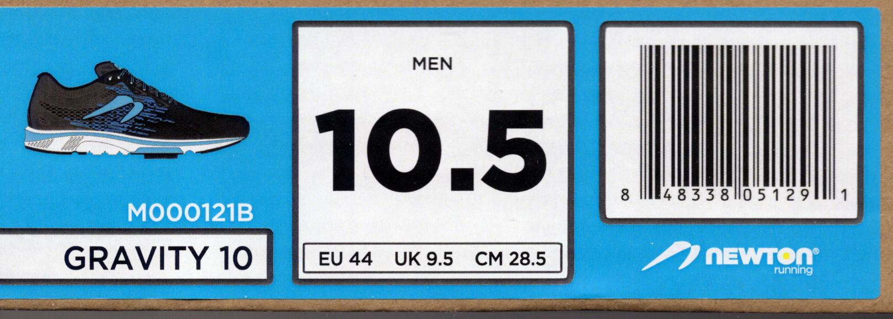

[Back to Index](../README.html)

# Sole F63 Treadmill

From [Sole](https://www.soletreadmills.com/treadmills/f63-sole-treadmill)

## Specs

-   3.0 HP motor provides a range of speeds including the challenging 12 mph top speed

-   Cushion Flex Whisper Deck reduces impact to joints by 40%

-   15 levels of incline provide the right challenge for runners and walkers of all abilities

-   Flywheels create a smoother, vibration free surface

-   Heavy-duty steel construction guaranteed for life

## Overview

-   Named “Best in its Price Range” by Fit Rated, Run Reviews, Treadmill Reviews,
    and many others
-   Easy Assist Folding Deck Design makes storing your treadmill easy and
    convenient
-   High-end rollers create a static free motion leading to a long lifespan

-   Smoothest treadmill when making adjustments mid-workout

-   LCD screen provides real-time statistics to monitor progress towards goals

## Technology

-   Bluetooth Audio Speakers - listen to music from your smart devices through
    the speakers on the console.
    
-   USB Port - Charge your smart devices while working out

-   Integrated tablet holder - gives you the freedom to use your smart devices
    to watch shows or follow your workout routines
    
-   Unmatched convenience with handlebar adjustment technology

-   Integrated entertainment systems make time fly during workouts

## More

### Machine Dimensions

- Height(in.): 66"
- Item Weight(lbs.): 254 lbs.
- Length(in.): 82"
- Weight Capacity(lbs.): 325 lbs.
- Width(in.): 35"
- Running Surface: 20" X 60"
- Rollers: 2.5"
- Step Up Height: 8"
- Box Dimensions: 86"X36"X17"
- Controls & Features
- Bluetooth Speaker Compatible: Yes
- Tablet/Phone: Yes
- USB Device Charging: Yes
- Bluetooth Compatible: Yes
- Standard Programs: 6
- Custom Programs: 2
- Heart Programs: 2
- Heart Rate Monitoring: Pulse Grips & Chest Strap Compatible
- Chest Strap Included: Yes
- Cooling Fans: Yes
- Sound System: Yes
- Workout Display: 6.5" LCD
- Display Color: White Back-lit
- Motor : 3.0 HP, DC Type
- Speed : .5 - 12 mph
- Incline: 0 - 15 Levels
- Easy Assist Folding: Yes

## Warranty

- Frame: Lifetime
- Motor: Lifetime
- Deck: 3 Years
- Electronics: 3 Years
- Parts: 3 Years
- Labor: 1 Years

# Dealing with Joint Pain

From [here](https://orthopedicassociates.org/when-is-joint-popping-a-problem/).

**How do I stop my joints from popping?**

If you want to stop your joints from popping, there's only one solution: get up
and get moving. “Motion is lotion,” as the saying goes. 

**Stretching and movement should prevent muscle tightness and keep your joints**
**lubricated, thus preventing them from rubbing together**. (2018-03-19)

# How to Fall Asleep

From FitBit video dated 2020-05-03
 
1. Relaxed openness

2. Pretend you are falling asleep.

3. Start breathing as if your body were asleep. Body knows a rhythm.

4. Pretend you need to convince someone you are asleep.

5. Breathing like you sleep. Getting into it... Getting the body into in to it.

6. Breath into a sleep pattern. Might be all you need - following down into sleep.

7. Give the mind something to do - follow the breathing, let yourself drift. Watch the play of images as you start to drift. Strange images. Let them un-spool... breathing lake you are asleep, alone... Lightly follow image, let them take you. Randomness of images... Dream sounds. Follow image. breath in breathing, seeping mode.

8. No resistance to body or mind. Breath automatically... Drifting... Breathing like you are asleep... Letting go of the need to know... Let it go.. Trust the process...Don't need to know or notice anything.

9. Rest well...

# My favorite Merrell shoes

**J77587, 10.5 medium, 8457 60244**

Seem to be discontinued. When I need to replace, the
[**Trail Glove 5**](https://www.merrell.com/US/en/trail-glove-5/36207M.html)
might be a decent choice.

# My Favorite Newton Shoes

These are my favorite shoes for walking. 

[From Here](https://www.newtonrunning.com/products/mens-gravity-10)
**M000121B size 10.5**

# From Jeff Galloway

## Ice treatment

[2017-11-21](http://jeffgalloway.typepad.com/jeff_galloways_blog/2017/11/injured-ice-massage-the-right-way-to-do-it.html)

Many runners assume that any frozen item can be used in an ice treatment,
even frozen bags of peas. In my experience, these forms of ice treatment
do no good at all. When ice is rubbed directly on the skin, as noted
below, it is a very powerful treatment or aches, pains and injuries that
are just below the skin. Deeper damage does not usually respond to the
ice treatment.

- Put a Styrofoam cup full of water in your freezer. Keep at least one
there, as "insurance".
- At the first sign of an ache or pain in the area close to the skin,
peel the Styrofoam off the top, and rub.
- For 15 minutes, rub constantly on the limited area until it gets numb.
- Do this every night – even for a week after all the pain goes away.

It is the direct contact of Ice, and the constant massage rub that seems
to do the job.

## Walking as an Endurance Exercise 
[2015-05-10](http://jeffgalloway.typepad.com/jeff_galloways_blog/2015/05/walking-as-an-endurance-exercise.html)

> What is endurance exercise?

> The essence of endurance exercise is to go farther – to keep doing an exercise long enough so that the body must find more efficient ways of moving, of processing energy, sending blood, etc. For untrained muscles, a walk of 10 minutes will do this. As we push back this threshold, our first goal is to get to 3 sessions a walk of 30 minutes each. For continuing progress, one of these could be a long one that pushes up to the current endurance limit or beyond (45 minutes, then 60 minutes, then whatever you want).

## [2015-03-09](http://jeffgalloway.typepad.com/jeff_galloways_blog/2015/03/when-to-start-walk-breaks.html) When to start walk breaks

> Walk breaks taken early in the run keep the muscles strong and resilient enough so the legs can move with strength and efficiency throughout. This will significantly reduce or eliminate the excess stress around the knees, ankles, feet, etc. which produces injury. The little “back-up” muscle groups can stay in reserve and fine-tune the running motion after fatigue sets in.

> The earlier you take the walk breaks, the more they help you! To receive maximum benefit, you must start the walk breaks before you feel any fatigue in the first mile. If you wait until you feel the need for a walk break, you’ve already reduced your potential performance. Even waiting until the two-mile mark to take the first one will reduce the resiliency you could regain from walking in the first mile. 

## [2014-09-28](http://jeffgalloway.typepad.com/jeff_galloways_blog/2014/09/motivation-to-get-out-the-door-early-morning.html) Motivation to get out the door in the early morning

> A high percentage of busy people find that the best time to exercise is before work. Here is the rehearsal that has been effective in getting out the door to the workout – even for those who are "non-morning persons".

> 1. The night before: lay out the clothes you will need, near the coffee pot.
2. Before bed, say: "Feet on the floor, alarm off, to the coffee pot". Say this over and over as you fall asleep.
3. When the alarm goes off, without thinking put your feet on the floor, turn the alarm off and head to the coffee pot.
4. While putting on one piece of clothing at a time, sip the coffee without any thought of exercise.
5. Caffeine helps to "wake up"" the central nervous system making early morning exercise a better experience.
6. With coffee cup in hand, walk to the door (or exercise room), and step outside for a weather check (or check the availability of the exercise equipment).
7. If outside, walk to the end of the block. As above, once you have walked 100 steps, you are almost certain to continue outside.
8.Once on the treadmill, etc., you will tend to get in your workout.

> The principle here is "A body on the bed wants to stay on the bed. But once a body is in motion, it wants to stay in motion". 

## [2014-09-14](http://jeffgalloway.typepad.com/jeff_galloways_blog/2014/09/long-run-facts.html) Long Run Facts

> - Twenty miles with walking breaks equals 20 miles run continuously…at any speed (but you recover faster with walk breaks).
- Forget about speed on long runs. Focus only on the component of endurance.
- You can’t run too slowly on the long runs. Run at least two minutes per mile slower than you could run that distance on that day accounting for heat, humidity, etc.
- The day before the long run should be a no-exercise day.

[Back to Index](../README.html)
