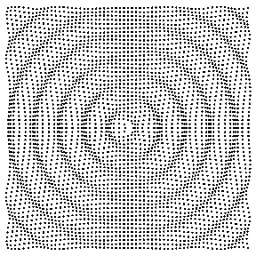

[Back to Index](../README.html)

These are John Minter's tips for a workflow using gifs.

There is a great **MP4-to-GIF** converter [here](https://cloudconvert.com/mp4-to-gif).

I used it to create this image of

I also enjoyed  this image from Penn State.

[Back to Index](../README.html)