```{r setup, include=FALSE}
knitr::opts_chunk$set(echo = TRUE)
library(knitr)
```


[Back to Index](../README.html)

# My quick tips

## Key sources

1. [Testing distributions](https://sourceforge.net/projects/gnuplot/files/gnuplot/testing/)

2. [Vanderbilt physics](https://my.vanderbilt.edu/physicslabs/gnuplot-tutorial/) tutorial

3. [Raymii.org](https://raymii.org/s/tutorials/GNUplot_tips_for_nice_looking_charts_from_a_CSV_file.html)

4. [Clark University tutorial](http://physics.clarku.edu/sip/tutorials/gnuplot/)

5. [SMU Physics](http://www.physics.smu.edu/fattarus/GnuplotTutorial.html)

## A suggestion from  Shigeharu Takeno

He was able to verify the crash

> Well, I built a windows binary from gnuplot source version 5.4.0 by
> msys2-mingw64, and I ran it with wxt terminal as 
> 
> > gnuplot.exe -e "set term wxt; cd 'demo' ; load 'all.dem'"
> 
> then it works fine.
> 
> For windows terminal, certainly crashes as reported.
> 
> > gnuplot.exe -e "set term win; cd 'demo' ; load 'all.dem'"
>
>  But, when I **specify the window size explicitly** as
> 
> > gnuplot.exe -e "set term win size 640,400; cd 'demo' ; load 'all.dem'"
>
> It works fine. Please try.

He is correct. This works on my Win10 box.

Note: This seems to work from the Windows gui:

> set term windows size 1024,768


I have been exploring command lines like

```
gnuplot.exe -e "set term win size 1024,768; cd 'C:/Users/johnr/Documents/gnuplot'; load 'sinx-win.plt'; pause

gnuplot.exe -e "set term qt size 1024,768; cd 'C:/Users/johnr/Documents/gnuplot'; load 'sinx-qt.plt'; pause
```


[sites.google.com ](https://sites.google.com/site/scientificsimulation/other-software/gnuplot)

recommends for the mac suggests adding to `.zshrc` and `.bashrc`

```
export GDFONTPATH=$HOME/Library/Fonts:/Library/Fonts:/System/Library/Fonts
```


They work well. The command line is my friend!


## Try a pipe

An idea from [stackoverflow](https://stackoverflow.com/questions/31173774/how-can-i-use-pipe-function-in-r-to-command-gnuplot)

```
# set up pipe for writing 
gp <- pipe('gnuplot','w')

# send some data to it
cat('set terminal latex; set output "eg1.tex"; plot [-3.14:3.14] sin(x)',
    file=gp)

# close the connection
close(gp)
```
Note that this works on mac...
```{r testPipe}

if (Sys.info()[1] == 'Windows'){
  print("windows")
  gp <- pipe('gnuplot','w')
  cat('set terminal png; set output "eg1.png"; plot [-3.14:3.14] sin(x)', file=gp)
}

if(Sys.info()[1] == 'Mac'){
  print("mac")
  gp <- pipe('/usr/local/bin/gnuplot','w')
  # gp <- pipe('gnuplot', 'w')
  setwd("./")
  cat('set terminal png
     set output "eg1.png"
     plot [-3.14:3.14] sin(x)', file=gp)
  close(gp)
}

```

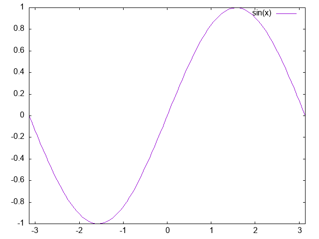


## Update 2020-08-27

I was having terrible problems with Gnuplot on Windows 10. The windows
application crashed on both my desktop and on the VM on mac.
I have no idea why... I **did** however, find a solution, thanks to
[stackoverflow](https://stackoverflow.com/questions/55088900/saving-pdf-output-in-gnuplot-via-qt)

1. Use the `qt` terminal instead of the `windows` terminal.

2. Put `reset` at the top of the script. This ensures a **clean environment**!

It appears more complicated... Even with `reset` at the top of each script,
I could get a problem. Happily, running from the windows gnuplot prompt

```
`gnuplot > load 'C-peak-shape-Lehigh17-p51.plt'`
```

produced this error:

```
D2d: Unable to resize swap chain. hr = 887a0001

```

This seems to be associated with resizing a widget. However, I get the error
even if I do not resize the window...

## Some helpful links

1. Help on [terminals](http://www.gnuplotting.org/output-terminals/).
It is a bit dated (2010-04-17).

2. The current gnuplot help documentation recommends the `windows` terminal
for Microsoft Windows. They also note that the cross platform terminals
`wxt` and `qt` terminals for Windows.

```
    set term wxt {<n>}
                 {size <width>,<height>} {position <x>,<y>}
                 {background <rgb_color> | nobackground}
                 {{no}enhanced}
                 {font <font>} {fontscale <scale>}
                 {title "title"}
                 {linewidth <lw>} {butt|rounded|square}
                 {dashlength <dl>}
                 {{no}persist}
                 {{no}raise}
                 {{no}ctrl}
                 {close}
             
    set term qt {<n>}
                {size <width>,<height>}
                {position <x>,<y>}
                {title "title"}
                {font <font>} {{no}enhanced}
                {linewidth <lw>} {dashlength <dl>}
                {{no}persist} {{no}raise} {{no}ctrl}
                {close}
                {widget <id>}

```

My initialization File

```
###
### Gnuplot version 5.0 intialization file
### This file is loaded by gnuplot at the start of each run.
### It is provided as a template, with all commands commented out.
### Uncomment and customize lines for local use.
### Any commands placed here will affect all users.
### To customize gnuplot's initial state for an individual user,
### place commands in a private file ~/.gnuplot instead.
#
#  Demo file is in C:/Program Files/gnuplot/demo

###
### Language initialization
###
# set locale
# set encoding locale

###
### Default line colors and repeat cycle
###
set linetype 1 lc rgb "dark-violet" lw 1
set linetype 2 lc rgb "#009e73" lw 1
set linetype 3 lc rgb "#56b4e9" lw 1
set linetype 4 lc rgb "#e69f00" lw 1
set linetype 5 lc rgb "#f0e442" lw 1
set linetype 6 lc rgb "#0072b2" lw 1
set linetype 7 lc rgb "#e51e10" lw 1
set linetype 8 lc rgb "black"   lw 1
set linetype cycle 8

###
### Initialize the default loadpath for shared gnuplot scripts and data.
### Please confirm that this path is correct before uncommented the line below.
###

set loadpath "C:/Program Files/gnuplot/demo"

###
### Some commonly used functions that are not built in
###
set terminal qt size 1024,768 font "Arial,12"
sinc(x) = sin(x)/x
rgb(r,g,b) = sprintf("#%06x",256.*256.*255.*r+256.*255.*g+255.*b)
hsv(h,s,v) = sprintf("#%06x",hsv2rgb(h,s,v))

###
### Other preferences
###
# set clip two


```

## Direct output to png

On Windows, I usually set gnuplot output to print to a Windows terminal.
I sometimes write to post script, but recently I have been writing png
output directly. Note the `s` on the `windows` terminal... It took me a
while to find the problem... I sounded like this guy...

<center>

</center>


An example of output lines is:


```
# set terminal postscript enhanced "Times-Roman" 12
# set terminal png enhanced large size 1024,768
# set output "K227-overlap.png" 
# set terminal qt size 1024,768
# set terminal svg size 1024,768
# set output "K227-overlap.svg"
set terminal windows size 1024,768
```

An example of the output:

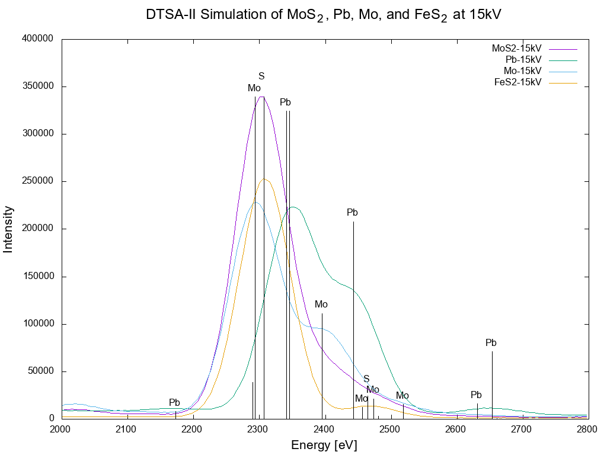


## Reasonable gnuplot colors

**2020-08-16**

Getting a reasonable color pallete is a challenge. This is about
as good as I have seen...

From [here](http://www.evangelistalab.org/2014/04/color-palette/).

```
# Canonical colors - full line
set style line 1 lc rgb '#000000' lt 1 lw 3.0 ps 0.5 pt 7 # black
set style line 2 lc rgb '#16469D' lt 1 lw 3.0 ps 0.5 pt 7 # dark blue
set style line 3 lc rgb '#BD202D' lt 1 lw 3.0 ps 0.5 pt 7 # red
set style line 4 lc rgb '#00A14B' lt 1 lw 3.0 ps 0.5 pt 7 # green
set style line 5 lc rgb '#4B96D1' lt 1 lw 3.0 ps 0.5 pt 7 # light blue
set style line 6 lc rgb '#F16521' lt 1 lw 3.0 ps 0.5 pt 7 # orange
set style line 7 lc rgb '#9F6EAF' lt 1 lw 3.0 ps 0.5 pt 7 # light purple
# Canonical colors - dashed line
set style line 11 lc rgb '#000000' lt 2 lw 3.0 ps 0.5 pt 7 # black
set style line 12 lc rgb '#16469D' lt 2 lw 3.0 ps 0.5 pt 7 # dark blue
set style line 13 lc rgb '#BD202D' lt 2 lw 3.0 ps 0.5 pt 7 # red
set style line 14 lc rgb '#00A14B' lt 2 lw 3.0 ps 0.5 pt 7 # green
set style line 15 lc rgb '#4B96D1' lt 2 lw 3.0 ps 0.5 pt 7 # light blue
set style line 16 lc rgb '#F16521' lt 2 lw 3.0 ps 0.5 pt 7 # orange
set style line 17 lc rgb '#9F6EAF' lt 2 lw 3.0 ps 0.5 pt 7 # light purple
```


**2020-08-15**

Although there are graphical interfaces for gnuplot,
it is also has a command line

A useful way to check the terminal type is

```
gnuplot <<<'show terminal'
```

[stackoverflow](https://stackoverflow.com/questions/60820836/cant-find-qt-or-x11-terminal-gnuplot-with-catalina)
had a great tip:

1. Install gnuplot with qt on mac

```
# Remove existing stuff to be sure my technique really works!
brew rm qt gnuplot

# Install qt and gnuplot afresh
brew install qt gnuplot
```

On mac add

```
export GNUTERM=qt
```
To both `.profile` and `.zshrc` add `export GNUTERM=qt`

For special cases you can reset the terminal from the
gnuplot command line.

```
gnuplot> set terminal
```

will give the complete list...

My favorite terminals

```
epslatex
gif
pdfcairo
pngcairo
postscript
png
pslatex
pstricks
qt
svg
```

A full 


**2020-07-18**

On MacOS I currently have minimal gnuplot support. I ended up uninstalling
and reinstalling Homebrew. Here the install info:

```
sudo chown -R $(whoami) $(brew --prefix)/*
cd /usr/local
mkdir Frameworks
sudo chown -R $(whoami) $(brew --prefix)/*
sudo chmod a+w Frameworks
```

I now just have:

```
brew install gnuplot --with-cairo --with-pdflib-lite --with-tex --with-x11 --HEAD
brew install openssl
brew install sqlite
brew install pandoc
brew install imagemagick
brew install ghostscript
brew link --overwrite ghostscript
```

Set the terminal to 

```
set terminal png 
```

and use

```
 gnuplot cOnSi5kV-all.plt > plt.png
```

This is `proc-gnuplot` on the mac

```
#!/bin/bash
# Call this script with 1 parameter
# proc-gnuplot.sh basename
# version 2018-01-10  set path to use imagemagik to get convert
PATH=/usr/local/Cellar/imagemagick@6/6.9.9-31/bin:$PATH
ps2pdf $1.ps temp.pdf
pdfcrop --margins 4 temp.pdf $1.pdf
rm -rf temp.pdf
convert -density 150 $1.pdf $1.png
```


On Windows I am currently using `gnuplot 5.4 patchlevel rc1` 64 bit.

1. The gray bar on the Windows GUI has icons that send common commands
   to the terminal.
   
    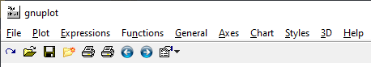

    - The first icon - a circular arrow - will run `replot`.
   
    - The second icon - an open folder - will let you easily navigate
      to the desired directory. Navigation is amore complicated noe.
      
      One can always use commands from the gnuplot prompt, e.g.:
      
      ```
      gnuplot> pwd
      C:\Users\johnr\Documents
      gnuplot> cd 'C:\Users\johnr\Documents\gnuplot'
      gnuplot> load 'amC-on-Cu-7kV.plt'
      gnuplot> 
      
      ```
      
    - The third icon - that looks like a floppy disk - will let you navigate to
      where you want to save the plot.
      
    - The folder icon with a red dot will open a window that will let you browse
      for a gnuplot script file.
      
    - The first printer icon sends terminal output to a terminal
    
    - The second printer icon prints current screen (win wxt qt)
      
    - The left and right arrow let you toggle through commands.
    
    - The last icon lets you change settings.
    
    Note: on Windows the options are in:    
    
    "C:\\Users\\username\\AppData\\Roaming\\wgnuplot.ini"
    
    Defaults:    
    GraphOrigin=208 208    
    GraphSize=1424 765   I changed to 1024 768    
    
    

# Other good sources

These are John Minter's tips for using gnuplot. They were
compiled from several web sources. Some helpful ones:

[The Gnuplot FAQ](http://www.gnuplot.info/faq/faq.html)

[Gnuplot tricks](http://gnuplot-tricks.blogspot.com/2009/05/gnuplot-tricks-many-say-that-it-is.html)

[gnuplotting.org](http://www.gnuplotting.org/) It has a nice viridis colormap example.

[A nice example using Fortran](http://personal.ph.surrey.ac.uk/~phs3ps/fortweb/unit8.html)


## JRM Note: some example code


A command file to build a fortran module to create a dataset

```
SET PATH=%PATH%;C:\Apps\R\Rtools\mingw_64\bin
gfortran sinplot.f -o sinplot.exe
pause
```

And the `gfortran` program code:

```
      program sinplot

      real :: x
      integer :: i

      open(unit=20,file='sin.dat')

      ! write out sin(x) for 0 < x < 2*pi
      do i=0,200,1
        x=i*6.283185/200.0
        write(20,*) x,sin(x)
      end do
      end program sinplot
```


# Helpful script files

## Use ImageMagick to convert an `emf` file to `png`

Note: the file `EagleXG_15kV_gnuplot.emf` must exist in the work directory

The best way for me to generate this file is to start in Gnuplot GUI with

```
set terminal windows
```

which responds with

```
Terminal type is now 'windows'
Options are '0 color solid butt enhanced standalone wsize 1440,765'
```

Then load the plot file from the Windows GUI


Then use the `Options` > `Save as EMF` to save the EMF file


Then run the ImageMagick conversion with the Windows `CMD` file below:

```
rem plot_gnuplot_EagleXG_15kV.cmd
rem Use ImageMagick to convert an existing gnuplot emf file to png format
print "converting..."
print "change to correct directory"
cd C:\Users\johnr\Documents\gnuplot\EagleXG\
del /f EagleXG_15kV_gnuplot.png
C:\Apps\ImageMagick\convert.exe EagleXG_15kV_gnuplot.emf EagleXG_15kV_gnuplot.png

pause

```


# Key modifications to the plot file

## Some source information.

- The hints on [gnuplot-tricks.blogspot.com](http://gnuplot-tricks.blogspot.com/2009/05/gnuplot-tricks-many-say-that-it-is.html)
though old (2009), were helpful.

- EMF terminal information from [soc.if.usp.br](http://soc.if.usp.br/manual/gnuplot-doc/htmldocs/emf.html)
was helpful.


- The [**Math and Physics** Youtube channel](https://www.youtube.com/channel/UCvOPaVkZjvJoNawmowRCBww) has four *_very helpful_* videos:


  [gnuplot Tutorial 1: basic Plotting tips & tricks, errorbars, png output](https://www.youtube.com/watch?v=9QUtcfyBFhE)
  
  [gnuplot Tutorial 2: linestyles, better plots, symbols, fonts & pngcairo](https://www.youtube.com/watch?v=F_XcgIxdExE)
  
  [gnuplot Tutorial 3: Curve Fitting, SSR and WSSR (unweighted and weighted)](https://www.youtube.com/watch?v=vHM_5AeKwXE)
  
  [gnuplot Tutorial 4: Animated gifs and STATS (statistical summary](https://www.youtube.com/watch?v=DF0dCOllLFI)


      
    
I like what DTSA-II writes with a date modified to ISO...

```
# Generated by the NIST EPQ Library
# 2018-09-13 modified by J. R. Minter  
# 2020-01-02 modified by J. R. Minter with better terminal descriptors
```

## A block with terminal information and conversion scripts

```
# NOTE: TO SAVE FILES AS ENCAPSULATED POST SCRIPT FILES, OR AS OTHER FILE FORMATS,
#       COMMENT OUT THE "TERMINAL WINDOW" SECTION, SET THE TERMINAL AS
#       THE CHOSEN TYPE, AND SET THE OUTPUT.
# set terminal postscript enhanced "Times-Roman" 12
# set output "ZnO_on_Si_7kV.ps"
#
# set terminal emf 'Arial, 18'
# set output "ZnO_on_Si_7kV.emf"
#
# set terminal png font arial 12 size 1024, 768 background '#ffffff'
# set output "ZnO_on_Si_7kV.png"
#
# set terminal window
#
# On Mac use the aqua terminal and save as PDF from the aqua window
# set terminal aqua
#
```

## A block with font  declarations and a title

```
lablFont = "Arial,12"
titlFont = "Arial,14"
keyFont  = "Arial,12"
ticFont  = "Arial,12"

set title "My title" font titlFont
```

## Set up the scales

```
unset logscale xy
set xrange [200:350.0]
set yrange [0.0:120000.0]
```

## Set up the axes

```
set xlabel "Energy [eV]" font titlFont
set ylabel "Intensity" font titlFont
set format x "%g"
set format y "%g"
set key spacing 1.5
set xtics font ticFont
set ytics font ticFont
```

## Set up the labels

```
unset label
set label 1 "C K{/Symbol a}" at first 281.8, 119000 center font lablFont
```


## Set up a plot

We can use HTML colors

Note also how we plot a series of data sets, splitting
the long line with the `\` character: 

```
plot "-" with lines lw 2 lc rgb "#000000" title "Cu", \
     "-" with lines lw 2 lc rgb "#543005" title " 1 nm", \
     "-" with lines lw 2 lc rgb "#8c510a" title " 5 nm", \
     "-" with lines lw 2 lc rgb "#bf812d" title "10 nm", \
     "-" with lines lw 2 lc rgb "#dfc27d" title "15 nm", \
     "-" with lines lw 3 lc rgb "#3333cc" title "20 nm", \
     "-" with lines lw 2 lc rgb "#f6e8c3" title "25 nm", \
     "-" with lines lw 2 lc rgb "#c7eae5" title "30 nm", \
     "-" with lines lw 2 lc rgb "#80cdc1" title "35 nm", \
     "-" with lines lw 2 lc rgb "#35978f" title "40 nm", \
     "-" with lines lw 2 lc rgb "#01665e" title "45 nm", \
     "-" with lines lw 2 lc rgb "#003c30" title "50 nm", \
     "-" with impulses lt -1 notitle
```

# A helpful setup for penepma

Plotting the output from `penepma` can be challenging. I typically want to
plot the    
`pe-spect-01.dat` file. Note the change of `eV` to `keV` by the syntax    
`u ($1/1000.):2:3` in the final line in the script below:

```
# Gnuplot
# Plots the characteristic line intensities of Orthoclase at 15 kV
# simulated by penepma16
#
# 2019-12-31
# By jrminter
#
# set terminal postscript enhanced color "Arial" 14
# set output "Ir-12kV.ps"
# proc-gnuplot.sh Ir-12kV
# set terminal png
# set terminal window
# set terminal aqua

lablFont = "Arial,14"
titlFont = "Arial,16"
keyFont  = "Arial,14"
ticFont  = "Arial,12"

set key font keyFont
set key right
set tics font ticFont

unset xzeroaxis
set zero 1.0e-60
set format y "%.1te%+-3T"
#set format xy "%.1te%+-3T"
#set format z "%.1te%+-3T"
#set format cb "%.1te%+-3T"

set zero 1.0e-60
set xzeroaxis
set xrange [0:4]         # Show the relevant range...
set yrange [1e-9:*]      # Show the relevant range...

set title 'PENEPMA Simulation of Orthoclase at 15 kV' font titlFont
set key top left
set xlabel "energy [keV]" font lablFont
set ylabel "PDF [1/(sr*electron)]" font lablFont
set logscale y

plot 'pe-spect-01.dat' u ($1/1000.):2:3 notitle w lines lw 2 lc rgb '#1B325F'

```

## Using the Windows gnuplot GUI

The Windows Gnuplot GUI is helpful for visualizing plots. 

The menu bar in the top left corner of the GUI has an `Options` window


When the `Options` is clicked, it displays a pull-down menu.

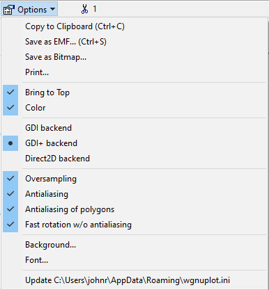

Note the `Save as EMF... (Ctl+C)` with the handy short cut. This permits
one to save the image as an Extended Meta file. The ImageMagick program
`convert` will convert the .emf file to a `.ps`, `.png` or `.pdf` file
from the command line:

```
$ convert  Orthoclase-15kV.emf  Orthoclase-15kV.pdf
```

The `png` file has reasonable resolution...


# Installing and Running on MacOSX


## Installing with Homebrew

1. Install using [Homebrew](https://stackoverflow.com/questions/32421713/install-gnuplot-5-0-1-on-osx)

Note: 2019-12-30 - Recent changes really mess this up so this doesn't work
anymore. Note that HomeBrew installs into `/usr/local/bin`.

```
brew cask install aquaterm; brew install gnuplot --with-aquaterm
```

This installation no longer works any more. Boo! Hiss!

## MacPorts

I installed Mac Ports - download the bundle [here](https://github.com/macports/macports-base/releases/).

and installed:

`sudo port -v install gnuplot`


See [here](https://ports.macports.org/port/gnuplot/summary).


2. Set the terminal

```
set terminal aqua
```

## Installing with MacPorts

This installs into `/opt/local/bin` and works better...


# Hacking the .plt file

## Gnuplot palettes

Very helpful images from [phd-bachephysicdun.blogspot.com](http://phd-bachephysicdun.blogspot.com/2014/01/)

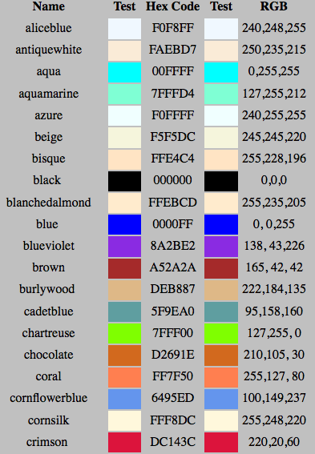


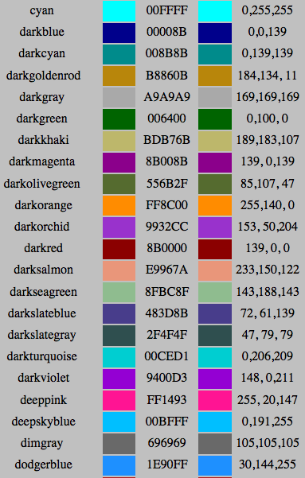


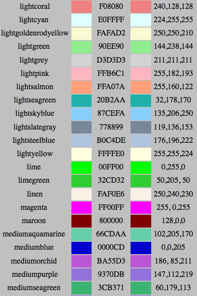


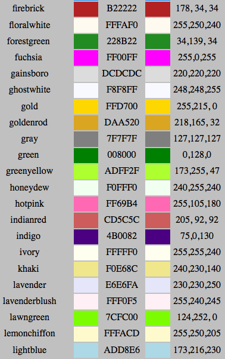


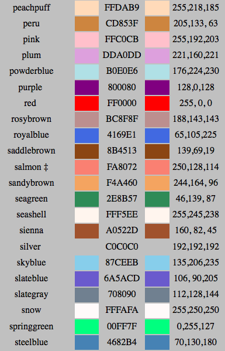


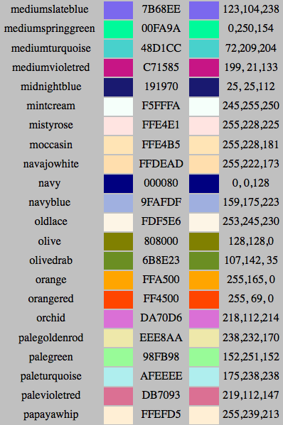


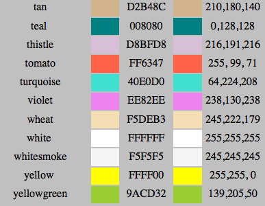


## Adding a marker line

This came from [stackoverflow](https://stackoverflow.com/questions/4457046/how-do-i-draw-a-vertical-line-in-gnuplot) from user `Throwback1986`.

The syntax to draw a line (an arrow with no head...) is:

```
set arrow from x1,y1 to x2,y2 nohead lw 2 lc rgb 'red'
```

The example below is to draw a red vertical line on a `penepma` simulation of amorphous c for the line marker:

```
set arrow from 0.277,1e-11 to 0.277,1e-8 nohead lw 2 lc rgb 'red'
```


## Changing (scaling) data for a plot

This idea came from [](http://folk.uio.no/inf3330/scripting/doc/gnuplot/Kawano/datafile2-e.html)

I needed to scale data written by penepma. Note the use of 
`($1/1000.)`.

```
# Plots x-ray energy spectra generated by 'penepma.f'

unset xzeroaxis
set zero 1.0e-60
#set format xy "%.1te%+-3T"
#set format z "%.1te%+-3T"
#set format cb "%.1te%+-3T"

#unset mouse

set zero 1.0e-60
set xzeroaxis
set xrange [*:*]
set yrange [1e-11:*]

set title 'EPMA spectrum. Detector #1'
set xlabel "energy [keV]"
set ylabel "PDF [1/(eV*sr*electron)]"
set logscale y
plot 'pe-spect-01.dat' u ($1/1000.):2:3 w errorbars ls 2, \
     'pe-spect-01.dat' u ($1/1000.):2 notitle w histeps ls 1
```

I also needed to force a cropped plot with logarithmic axis to use
log notation for the labels. This command did the trick:

```
# Force Y axis to exponential scale
set format y "10^{%L}"
```

That example came from the `tics` section of the Gnuplot
[not so Frequently Asked Questions ](http://lowrank.net/gnuplot/index-e.html)
site (**a very helpful resource**). Note: the link above is to the English
section. The site is from Japan.

## Devices

### Use postscript to get both pdf and png output

The best png output comes via postscript. Make sure ImageMagick's
**convert** program is <span style="color:red">**ahead**</span> of windows **convert** program in the
path. Then use this macro to produce <span style="color:red">**both**</span> **pdf** 
<span style="color:red">**and**</span> **png** plots at the same time!

Use something like this:

```
# easy to comment out with #
# set terminal postscript enhanced color "Arial" 14
# set output "foo.ps"
# proc-gnuplot.sh foo
# set terminal png
set terminal window
# set terminal aqua
```

Where the **proc-gnuplot.sh** script (in C:/Apps/local/path) converts the file to
pdf and crops the margins by using ps2pdf (from TexLive) and convert (from ImageMagick) like this:

```
ps2pdf $1.ps temp.pdf
pdfcrop --margins 4 temp.pdf $1.pdf
rm -rf temp.pdf
convert -density 150 -geometry 68.82% $1.pdf $1.png
```
Cropping the margins is especially helpful for inclusion
in $\LaTeX$ documents. This produces a 1024 pixel wide png image of the plot.


One can also this manually using Fiji's "Import PDF" and choosing a 200 dpi from the dialog. This is nice because one can copy an image of a ROI from which an EDS spectrum was collected and paste it into the PNG of the spectrum to make a self-contained figure.


# Useful DTSA Spectrum Plot hacks

```
unset logscale x
set logscale y
set xrange [0.0:10000.0]
set yrange [1.0:5700.0]
set xlabel "Energy [eV]" font "Arial,16"
set ylabel "Intensity" font "Arial,16"
set format x "%g"
set format y "%g"
set key spacing 1.5

unset label
```

Note that one can add a title and split the plot line, like


```
# Note LaTeX
set title "Put key info here...Al_2O_3" font "Arial,16"


plot "-" with lines lt 1 lw 2 lc rgb "#9ecae1" \
     title "  0 nm Al on Si 5 kV", \
     "-" with lines lt 1 lw 2 lc rgb "#6baed6" \
     title " 20 nm Al on Si 5 kV", \
     "-" with lines lt 1 lw 2 lc rgb "#4292c6" \
     title " 40 nm Al on Si 5 kV", \
     "-" with lines lt 1 lw 2 lc rgb "#2171b5" \
     title " 60 nm Al on Si 5 kV", \
     "-" with lines lt 1 lw 2 lc rgb "#08519c" \
     title " 80 nm Al on Si 5 kV", \
     "-" with lines lt 1 lw 2 lc rgb "#08306b" \
     title "100 nm Al on Si 5 kV", \
     "-" with impulses lw 2 lt -1 notitle

```

if one only has two elements in a DTSA plt, one can

```
unset label

set label "Sn lines in black, Cl lines in red" at 400,20000

plot "-" with lines lt 1 lw 2 lc rgb "#133463" title "Sn", \
     "-" with lines lt 1 lw 2 lc rgb "#3A89C9" title "SnCl_{2}", \
     "-" with impulses lw 2 lc rgb "red" lt -1 notitle, \
     "-" with impulses lw 2 lc rgb "black" lt -1 notitle
```

followed by (at the end)

```
e
# Cl
2622.4, 34888.0
# Cl
2620.8, 17653.3
# Cl
2815.6, 1604.8
# Cl
2815.6, 3289.9
e
# Sn ***Note the split here...***
619.9, 846.0
# Sn
3444.0, 23114.0
# Sn
577.9, 169.2
# Sn
3435.5, 2621.1
# Sn
3045.0, 961.5
# Sn
4067.5, 62.4
# Sn
3750.3, 3575.7
# Sn
3662.8, 10044.4
# Sn
4132.2, 1340.6
# Sn
690.5, 3384.0
# Sn
490.0, 16.9
# Sn
3971.4, 124.8
# Sn
3272.3, 365.2
# Sn
3708.3, 2191.2
# Sn
396.2, 1692.0
# Sn
732.5, 169.2
# Sn
4463.0, 37.0
# Sn
4376.1, 742.0
# Sn
404.7, 169.2
# Sn
4376.1, 44.6
# Sn
3904.9, 3395.2
# Sn
4019.6, 74.0
e

```

## A 2-up plot

I got the idea from [here](http://stackoverflow.com/questions/10774646/gnuplot-how-to-put-two-figures-side-by-side).


```
set terminal postscript color enhanced size 10,5
set output 'figure.ps'
# proc-gnuplot.sh figure

unset title

set multiplot layout 1, 2
unset logscale xy

set title "Sin"
set xlabel "x"
set ylabel "y"
plot(sin(x))

set title "Cos"
set xlabel "x"
set ylabel "y"
plot(cos(x))

unset multiplot

```


# Color

## RGB Colors

One can use these names
[Hamburg-Schneider](http://www.uni-hamburg.de/Wiss/FB/15/Sustainability/schneider/gnuplot/colors.htm)

## HTML Colors

One can define custom palettes using
[ColorBrewer](http://colorbrewer2.org/)

R makes this easy:

```{r}
library(RColorBrewer)
pal <-brewer.pal(8,"Oranges")
pal
```

## Plotting lines

use these in gnuplot like
```
1 lt rgb "#FFF5EB"
2 lt rgb "#FEE6CE"
3 lt rgb "#FDD0A2"
4 lt rgb "#FDAE6B"
5 lt rgb "#FD8D3C"
6 lt rgb "#F16913"
7 lt rgb "#D94801"
8 lt rgb "#8C2D04"

plot "-" with lines lt 1 lw 2 lc rgb "#FDD0A2" title "100 nm Cu", ...
```

or
```{r}
pal <-brewer.pal(8,"Blues")
pal
```

## Changing label colors

Try

```
set label 3 "Si (ignored)" at first 1730,90000 \
    center textcolor rgb "skyblue"
```

# Adding symbols

```
# Setting the terminal postscript with the options
set terminal postscript eps color enhanced "Helvetica" 20

# Setting the output file name
set output 'plot.eps'

#Setting up the grid and labels
set grid
set title "A simple graphic without LaTeX"
set xrange [-pi:pi]
set xlabel "Angle {/Symbol a}"
set ylabel "{/Symbol Dw}"
set ytics 0.5
set xtics ("{/Symbol p}" -pi, "{/Symbol p}/2" -pi/2, "0" 0, \
           "{/Symbol p}/2" pi/2, "{/Symbol p}" pi)

# Setting the legend
set key horizontal below height 2
set key box lt 2 lc -1 lw 3

# The plot itself (\ is to broke lines)
set size 1,1
plot sin(x)**2 w l lt 1 lc 1 lw 3 t "sin^2({/Symbol a})", \
sin(2*x)/x w l lt 2 lc 3 lw 3 t "sin(2{/Symbol a})/{/Symbol a}", \
sin(x) w l lt 3 lc 2 lw 3 t "sin{/Symbol a})"

```

# Controlling borders

The FAQ suggests:

```
set lmargin at screen 0.05
set bmargin at screen 0.05
set rmargin at screen 0.95
set tmargin at screen 0.95
```

# Some examples from the web...

## Examples from Michael Zimmerman


These came from [here](http://triclinic.org/2015/04/publication-quality-plots-with-gnuplot/).

```
set terminal postscript eps enhanced size 3in,3in
set output 'file.eps'
```

To generate a Postscript file (best for images around 6″-6.5″ square):

```
set terminal postscript enhanced size 6in,6in
set output 'file.ps'
```


To generate an SVG file (best for images around 4″-6″ square):

```
set terminal svg enhanced size 500,500
set output 'file.svg'
```

The **enhanced** option to the svg terminal is important. It allows more sophisticated titles to be set:

```
set encoding iso_8859_1
set title 'This is the title of the graph'
set xlabel 'Molecular weight (kDa)'
set ylabel 'Solvent-inaccessible surface area x 1000 ({\305}^2)'

```

The ‘enhanced’ option to the svg terminal is important. It allows more sophisticated titles to be set:

```
set encoding iso_8859_1
set title 'This is the title of the graph'
set xlabel 'Molecular weight (kDa)'
set ylabel 'Solvent-inaccessible surface area x 1000 ({\305}^2)'
```

‘^’ allows superscripting and ‘_’ subscripting as in LaTeX. Non-ASCII characters may be included as well:

```
{\305}  Angstroms
```

Controlling the legend (key):

```
  set nokey          # turn off the legend
  set key top left
```
Controlling the axis ranges:

```
  set xrange [0:10]
  set xtics 0,2,10   # set an increment of 2
  set yrange [0:1000]
```

Adding a function to print, such as a regression curve:

```
  f(x) = 0.039440 * x + 0.678467
```
Now that we have all of the parameters set, we use the plot function to actually generate the graph data:

```

plot 'data1.dat' using 1:2 w p, \
     'data2.dat' using ($2/1000):($3/1000) w lp pt 13 ps 1.5 lt 1 lc -1 lw 1,
     f(x)
```

‘w’ stands for ‘with’. The first argument is the style, which is how the data should be plotted. Some possible arguments are:

```
points(p)       - unconnected points
linespoints(lp) - points connected by lines
```

Some of the other arguments are:

```
pointtype(pt)  - controls the appearance of points
pointsize(ps)  - controls the size of points
linetype(lt)   - controls the appearance of lines (solid, dashed, etc.)
linecolor(lc)  - controls the line (and point) color
linewidth(lw)  - controls the width of lines
```

Unfortunately, the arguments for these options are specified as arbitrary numbers, which are defined by the specific driver. For the SVG driver, these are the pointtypes:

```
0   dot
1   +
2   x
3   *
4   open square
5   closed square
6   open circle
7   closed circle
8   open upward-pointing triangle
9   closed upward-pointing triangle
10  open downward-pointing triangle
11  closed downward-pointing triangle
12  open diamond
13  closed diamond
```


The SVG linecolors:

```
-1  black
0   gray
1   red
2   green
3   blue
4   cyan
5   dark green
6   dark blue
7   orange
8   teal?
9   light green
10  purple
11  light orange
12  magenta
13  yet another green
```

There do not appear to be different linetypes other than solid for the SVG driver (though that can be corrected in Inkscape). If that is an issue, the postscript terminal does have many kinds of dashed lines. An easy way to see the capabilities of a terminal is to issue the ‘test’ command.

The images can then be exported with Inkscape at arbitrary resolution to a lossless PNG file. This can also be done at the command line:

```
  $ inkscape --export-area-drawing --export-png=file.png \
             --export-dpi=300 file.svg
```

Using the open-source program ‘convert’ from the ImageMagick suite of tools, this can be converted to TIFF or another format, optionally removing the transparency and adding a border:

```
  $ convert -background "#ffffff00" -flatten -bordercolor "#ffffff00" \
            -border 50x50 input.png output.tiff
```
‘convert’ may also be used to convert an EPS image to a raster format:

```
  $ convert -density 300 input.eps -geometry 900x900 output.tiff
```

It can also convert SVG to raster formats, but I find its output inferior to that of Inkscape.


## Examples from Source Forge


- From: [gnuplot on sourceforge](http://gnuplot.sourceforge.net/demo_5.2/).
Note that the current app has these demo files in:

    ```
    C:\Program Files\gnuplot\demo
    ```


- From: [alvinalexander.com](https://alvinalexander.com/technology/gnuplot-charts-graphs-examples#sample-data-files)

- From [https://courses.physics.illinois.edu/](https://courses.physics.illinois.edu/phys466/sp2013/comp_info/gnuplot.html)

from [here](http://www.bersch.net/gnuplot-doc/complete-list-of-terminals.html)


# A full list of gnuplot terminals and their parameters

```
# Macos
set terminal aqua {<n>} {title "<wintitle>"} {size <x> <y>}
                  {font "<fontname>{,<fontsize>}"}
                  {linewidth <lw>}"}
                  {{no}enhanced} {solid|dashed} {dl <dashlength>}}

set terminal emf {color | monochrome}
                 {enhanced {noproportional}}
                 {rounded | butt}
                 {linewidth <LW>} {dashlength <DL>}
                 {size XX,YY} {background <rgb_color>}
                 {font "<fontname>{,<fontsize>}"}
                 {fontscale <scale>}

set term gif font "arial,11"
set terminal gif 
       {{no}enhanced}
       {{no}transparent} {rounded|butt}
       {linewidth <lw>} {dashlength <dl>}
       {tiny | small | medium | large | giant}
       {font "<face> {,<pointsize>}"} {fontscale <scale>}
       {size <x>,<y>} {{no}crop}
       {animate {delay <d>} {loop <n>} {{no}optimize}}
       {background <rgb_color>}

set terminal jpeg 
       {{no}enhanced}
       {{no}interlace}
       {linewidth <lw>} {dashlength <dl>} {rounded|butt}
       {tiny | small | medium | large | giant}
       {font "<face> {,<pointsize>}"} {fontscale <scale>}
       {size <x>,<y>} {{no}crop}
       {background <rgb_color>}

Latex
set terminal {latex | emtex} {default | {courier|roman} {<fontsize>}}
             {size <XX>{unit}, <YY>{unit}} {rotate | norotate}

Deprecated...
set terminal pdf {monochrome|color|colour}
                 {{no}enhanced}
                 {fname "<font>"} {fsize <fontsize>}
                 {font "<fontname>{,<fontsize>}"} {fontscale <scale>}
                 {linewidth <lw>} {rounded|butt}
                 {dl <dashlength>}}
                 {size <XX>{unit},<YY>{unit}}

set term pdfcairo
             {{no}enhanced} {mono|color}
             {font <font>} {fontscale <scale>}
             {linewidth <lw>} {rounded|butt|square} {dashlength <dl>}
             {background <rgbcolor>}
             {size <XX>{unit},<YY>{unit}}


set terminal png 
       {{no}enhanced}
       {{no}transparent} {{no}interlace}
       {{no}truecolor} {rounded|butt}
       {linewidth <lw>} {dashlength <dl>}
       {tiny | small | medium | large | giant}
       {font "<face> {,<pointsize>}"} {fontscale <scale>}
       {size <x>,<y>} {{no}crop}
       {background <rgb_color>}

set term pngcairo
             {{no}enhanced} {mono|color}
             {{no}transparent} {{no}crop} {background <rgbcolor>
             {font <font>} {fontscale <scale>}
             {linewidth <lw>} {rounded|butt|square} {dashlength <dl>}
             {pointscale <ps>}
             {size <XX>{unit},<YY>{unit}}


set terminal postscript {default}
set terminal postscript {landscape | portrait | eps}
                        {enhanced | noenhanced}
                        {defaultplex | simplex | duplex}
                        {fontfile [add | delete] "<filename>"
                         | nofontfiles} {{no}adobeglyphnames}
                        {level1 | leveldefault | level3}
                        {color | colour | monochrome}
                        {background <rgbcolor> | nobackground}
                        {dashlength | dl <DL>}
                        {linewidth | lw <LW>} {pointscale | ps <PS>}
                        {rounded | butt}
                        {clip | noclip}
                        {palfuncparam <samples>{,<maxdeviation>}}
                        {size <XX>{unit},<YY>{unit}}
                        {blacktext | colortext | colourtext}
                        {{font} "fontname{,fontsize}" {<fontsize>}}
                        {fontscale <scale>}

set term qt {<n>}
            {size <width>,<height>}
            {position <x>,<y>}
            {title "title"}
            {font <font>} {{no}enhanced}
            {linewidth <lw>} {dashlength <dl>}
            {{no}persist} {{no}raise} {{no}ctrl}
            {close}
            {widget <id>}
		  

set terminal svg {size <x>,<y> {|fixed|dynamic}}
                 {mouse} {standalone | jsdir <dirname>}
                 {name <plotname>}
                 {font "<fontname>{,<fontsize>}"} {{no}enhanced}
                 {fontscale <multiplier>}
                 {rounded|butt|square} {solid|dashed} {linewidth <lw>}
                 {background <rgb_color>}
			  

set terminal windows {<n>}
                     {color | monochrome}
                     {solid | dashed}
                     {rounded | butt}
                     {enhanced | noenhanced}
                     {font <fontspec>}
                     {fontscale <scale>}
                     {linewdith <scale>}
                     {pointscale <scale>}
                     {background <rgb color>}
                     {title "Plot Window Title"}
                     {{size | wsize} <width>,<height>}
                     {position <x>,<y>}
                     {docked {layout <rows>,<cols>} | standalone}
                     {close}
				 
```


[Back to Index](../README.html)