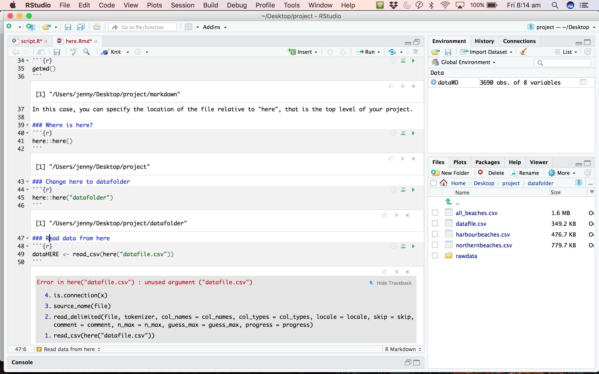
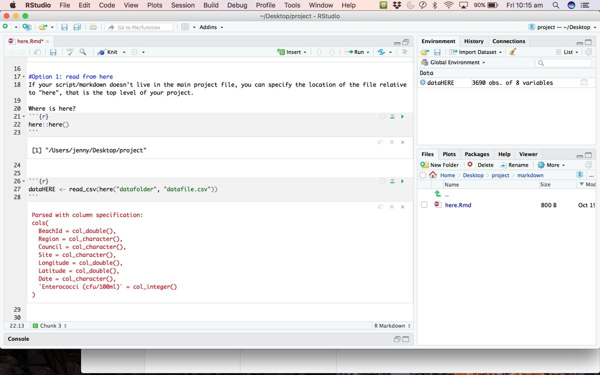

[Back to Index](../README.html)

# Info from Jenny Richmond

From [the `here` package](http://jenrichmond.rbind.io/post/how-to-use-the-here-package/)

hi #rstats friends, how do YOU use the `here` package? I thought I had my head around it but I'm doing something wrong. Here my markdown lives within the "markdown" folder, so I set here to the "data" folder, call read_csv(here("datafile.csv") and it doesn't work... help

TFW you figure you have broken something so decide that now seems like a good time to learn `reprex`, you delete everything irrelevant to the problem out of the script and folders and then it decides to work. I should threaten my code with `reprex` more often #rstats

I found two other posts on `http://jenrichmond.rbind.io`

# HOW TO USE THE `HERE` PACKAGE

I’m still working on getting my head around where R thinks we work and how to tell it where my stuff lives (aka working directories). On twitter yesterday Alison Hill, Adam Gruer, Zoe Meers and Irene Steves helped me sort out my issues with here. hi #rstats friends, how do YOU use the `here` package? I thought I had my head around it but I'm doing something wrong. Here my markdown lives within the "markdown" folder, so I set here to the "data" folder, call read_csv(here("datafile.

# WHERE IS HERE?

As I add new projects to my rstats portfolio and work collaboratively on projects with students the issue of working directories is becoming more and more complicated. Not really understanding how working directories and file paths actually work, I have been relying on the beginner logic… Everything will be just fine as long as you keep your datafiles in the same folder as your .rmd file via GIPHY

# This post from Twitter

I am an academic @ UNSW Sydney, mother, and juggler. Learning new things and writing about it. Thoughts probably not suitable for public consumption. I'm still working on getting my head around where R thinks we work and where my stuff lives (AKA working directories.

On twitter yesterday Alison Hill (@apresshill), Adam Grues (@AdamGruer), Zoe Meers (@zoe_meers) and Irene Steves (@i_steves) helped me sort out my issues with `here`.

A/Prof Jenny Richmond @JenRichmond wrote:

> Hi #rstats friends. How do you use the `here` package? I thought I head around it, but 
> I'm doing something wrong. Here my markdown lives within the "markdown" folder, so I
> set `here` to the "data" folder, called `read_csv(here("datafile.csv")) and it doesn't
> work... Help!

Relative paths **work differently** in `.R` files compared to `.Rmd`

[Back to Index](../README.html)