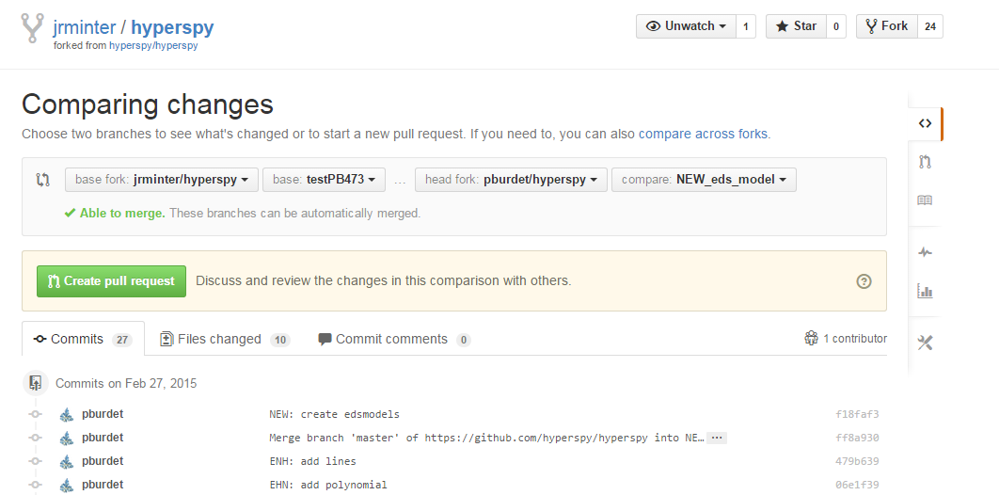

[Back to Index](../README.html)

See also [python tips](../python/python.html)

#  Updates

## Issues

**N.B.** [francisco-dlp](https://github.com/hyperspy/hyperspy/issues/790) noted this problem with hyperspy when updating anaconda.

```
...
from skimage.external.tifffile import imsave, TiffFile
...
RuntimeError: module compiled against API version a but this version of numpy is 9
```

One can check the version with

```
import numpy
print numpy.__version__
```

## Anaconda

### Conda install of hyperspy.  From [here](https://github.com/hyperspy/hyperspy/pull/792).

```
conda env create -f anaconda_hyperspy_environment.yml
source activate hyperspy
```

To deactivate

```
source deactivate
```

### Get a detailed list for an environment

```
conda list -e
```

## setting up a newly clone repo

```
cd git
rm -rf hyperspy
git clone https://github.com/jrminter/hyperspy.git
cd hyperspy
git remote add upstream https://github.com/hyperspy/hyperspy.git
git checkout master
git fetch upstream
git rebase upstream/master
git push
git checkout --track origin/0.8.x
git checkout 0.8.x
git fetch upstream
git rebase upstream/0.8.x
git push
```

## latest remote

```
git remote add vidartf https://github.com/vidartf/hyperspy.git
git checkout --track vidartf/hyperspyui_py3 
```

## My pull script from `~/git/pullAll.sh` on `jrmFastMac`

```
cd ~/git/hyperspy
echo hyperspy 
echo hyperspy: branches set 2016-03-02
git fetch 
git fetch upstream
git fetch pburdet
git fetch to266
git fetch dnjohnstone
git fetch vidartf
git checkout hyperspyui_py3
git pull 
git checkout 0.8.x
git pull
git checkout EHN_map_multiprocessing
git pull
git checkout ENH_environment
git pull
git checkout NEW_eds_model
git pull
git checkout edslab
git pull  
git checkout master
git pull
git checkout testPB473
git pull
git checkout master
git status
```

note the branches defined

```
jrminter 1: git remote -v
dnjohnstone	https://github.com/dnjohnstone/hyperspy.git (push)
dnjohnstone	https://github.com/dnjohnstone/hyperspy.git (fetch)
origin	https://github.com/jrminter/hyperspy.git (fetch)
origin	https://github.com/jrminter/hyperspy.git (push)
pburdet	https://github.com/pburdet/hyperspy.git (fetch)
pburdet	https://github.com/pburdet/hyperspy.git (push)
to266	https://github.com/to266/hyperspy (fetch)
to266	https://github.com/to266/hyperspy (push)
upstream	https://github.com/hyperspy/hyperspy.git (push)
upstream	https://github.com/hyperspy/hyperspy.git (fetch)

jrminter 2: git branch -a
  EHN_map_multiprocessing
  ENH_python3
  NEW_eds_model
  checkout
  edslab
* master
  testPB473
  remotes/dnjohnstone/0.6
  remotes/dnjohnstone/0.7
  remotes/dnjohnstone/0.7.x
  remotes/dnjohnstone/ENH_map_generalised
  remotes/dnjohnstone/NEW_dev-guide
  remotes/dnjohnstone/NEW_eds_model
  remotes/dnjohnstone/NEW_find_peaks_2D
  remotes/dnjohnstone/New_Model2D
  remotes/dnjohnstone/affine_transform
  remotes/dnjohnstone/diffraction_tem
  remotes/dnjohnstone/edslab
  remotes/dnjohnstone/eelslab
  remotes/dnjohnstone/find_distortion
  remotes/dnjohnstone/find_strain_rotation
  remotes/dnjohnstone/master
  remotes/dnjohnstone/raman_tools
  remotes/dnjohnstone/vector_extraction
  remotes/origin/0.6
  remotes/origin/0.7
  remotes/origin/0.7.x
  remotes/origin/0.8.x
  remotes/origin/HEAD -> origin/master
  remotes/origin/NEW_eds_model
  remotes/origin/eelslab
  remotes/origin/master
  remotes/origin/revert-492-BUGFIX_migration_to_ipython3.0
  remotes/origin/testPB473
  remotes/pburdet/EHN_map_multiprocessing
  remotes/pburdet/EHN_test_notebook_doc_docstr
  remotes/pburdet/ENH_3D_mayavi_isosurface
  remotes/pburdet/ENH_plot_orthoview
  remotes/pburdet/NEW_absorption_coeff
  remotes/pburdet/NEW_det_efficiency
  remotes/pburdet/NEW_eds_background_model
  remotes/pburdet/NEW_eds_model
  remotes/pburdet/NEW_get_signal_signal
  remotes/pburdet/NEW_simulate_simple_EDS_model
  remotes/pburdet/NEW_tomographic_reconstruction
  remotes/pburdet/edslab
  remotes/pburdet/edslab_abs2
  remotes/pburdet/image_FFT
  remotes/pburdet/master
  remotes/pburdet/storing_result
  remotes/to266/0.6
  remotes/to266/0.8
  remotes/to266/0.8+dev
  remotes/to266/0.8.x
  remotes/to266/API_append_axis_private
  remotes/to266/BUGFIX_1D_signal_with_0D_data
  remotes/to266/BUGFIX_32bit_test_decomposition
  remotes/to266/BUGFIX_DTB_print_maxlen
  remotes/to266/BUGFIX_Dictionary_tree_browser_axes
  remotes/to266/BUGFIX_EELSmodel_weights
  remotes/to266/BUGFIX_adjust_position
  remotes/to266/BUGFIX_fancy_variance_indexing
  remotes/to266/BUGFIX_line_endings
  remotes/to266/BUGFIX_migration_to_ipython3.0
  remotes/to266/BUGFIX_model_as_signal_multi_dim_comps
  remotes/to266/BUGFIX_model_del
  remotes/to266/BUGFIX_model_tests_new_scipy
  remotes/to266/BUGFIX_multiple_nosetest_deprecation_warning_bugs
  remotes/to266/BUGFIX_polynomial_repr
  remotes/to266/BUGFIX_save_signals_with_variances
  remotes/to266/BUGFIX_saving_unicode
  remotes/to266/BetheFSR
  remotes/to266/ENH_DictionaryTreeBrowser_Signals
  remotes/to266/ENH_SP_reflectometry_peak
  remotes/to266/ENH_attrsetter_utility
  remotes/to266/ENH_component_active_pixel
  remotes/to266/ENH_component_init
  remotes/to266/ENH_create_getinitargs_for_components
  remotes/to266/ENH_doc_tidyup
  remotes/to266/ENH_double_linear_component
  remotes/to266/ENH_environment
  remotes/to266/ENH_extension
  remotes/to266/ENH_fold_model
  remotes/to266/ENH_general_fancy_signal_indexing
  remotes/to266/ENH_gitter_badge
  remotes/to266/ENH_hdf5_write_oom
  remotes/to266/ENH_hist_tools_numerical_optimisation
  remotes/to266/ENH_image_cursor_printing
  remotes/to266/ENH_interpolate_between_delta
  remotes/to266/ENH_ipython3
  remotes/to266/ENH_no_progressbar_in_tests
  remotes/to266/ENH_parallel_multifit
  remotes/to266/ENH_python3
  remotes/to266/ENH_python3to2
  remotes/to266/ENH_save_lists_quick
  remotes/to266/ENH_save_model
  remotes/to266/ENH_setup_py
  remotes/to266/ENH_signal_map_out
  remotes/to266/ENH_signal_nearest_nearest_points
  remotes/to266/ENH_signals_plot_model
  remotes/to266/ENH_slugify_faster
  remotes/to266/ENH_stash_model
  remotes/to266/NEW_GOS_as_dict
  remotes/to266/NEW_expression_component
  remotes/to266/NEW_extract_zlp
  remotes/to266/NEW_model_componnts
  remotes/to266/NEW_saving_multiple_signals
  remotes/to266/New_Model2D
  remotes/to266/SP_edition
  remotes/to266/as_signal_components
  remotes/to266/chi_squared
  remotes/to266/compare_signals
  remotes/to266/components_to_spectrum
  remotes/to266/edslab
  remotes/to266/francisco_dlp_clone_ENH_plot_arguments
  remotes/to266/master
  remotes/to266/model_as_dict
  remotes/to266/option_for_output_in_model.as_signal
  remotes/to266/parafit_old
  remotes/to266/parafit_scalable
  remotes/to266/plot_model_components
  remotes/to266/plot_paramater_report
  remotes/to266/quicker_array_initialisation
  remotes/to266/removing_unnecessary_lines
  remotes/to266/samfire
  remotes/to266/save_to_figure
  remotes/to266/test_things
  remotes/to266/threshold_line_plot
  remotes/to266/tools_for_bulk
  remotes/to266/traitlets
  remotes/upstream/0.6
  remotes/upstream/0.7
  remotes/upstream/0.7.x
  remotes/upstream/0.8.x
  remotes/upstream/eelslab
  remotes/upstream/master
  remotes/upstream/revert-492-BUGFIX_migration_to_ipython3.0
```


and an install of a branch...

```
pip uninstall hyperspy
cd %GITHOME%/hyperspy
pip install -e ./
```

From my cmd-anaconda prompt...

```
conda update conda
conda update anaconda
conda update --all
```

# hyperspy

## Temporarily install a branch

From my cmd-anaconda prompt...
```
pip uninstall hyperspy
cd %GITHOME%/hyperspy
pip install -e ./
```

## Not affected by git...

To be **really** clean...

1. delete everything from the local git repo but `.git`
2. From git bash prompt

```
git checkout <branch>
git reset --hard
```

From my cmd-anaconda prompt...
```
pip uninstall hyperspy
cd %GITHOME%/hyperspy
python setup.py install
```


# Key imports for iPy3 notebooks

A really helpful post on [stackoverflow](http://stackoverflow.com/questions/3828723/why-we-need-sys-setdefaultencodingutf-8-in-a-py-script)

The last answer (big surprise...) had the key. On Widows set an
environment variable.

```
PYTHONIOENCODING=UTF-8
```

there are **many** warnings to **not** use

```
import sys
reload(sys)
sys.setdefaultencoding("utf-8")
```

## My current Notebook setup block
```
%matplotlib inline
import os
import numpy as np
import matplotlib.pyplot as plt
import hyperspy.hspy as hs
# set the default figure size
plt.rcParams['figure.figsize'] = 11, 7
```

Note, with this approach we need to be more explicit with the
class structure. Where older scripts wrote

```
signals.Spectrum()
```

It now requires more explict

```
hs.signals.Spectrum()
```

# Getting development right to test new EDS model

1. Deleted old hyperspy fork.

2. Created a new hyperspy fork.

3. Clone this locally.

```
git clone https://github.com/jrminter/hyperspy.git
cd hyperspy
```

4. Create a branch testPB473 `git checkout -b testPB473` Add some
   text to eds.rst. Push with `git push`.
   
5. I used the github gui to send my forked hyperspy repository from Pierre Burdet's.

<figure>
  
<figcaption>Figure 1. Pull request 473. </figcaption>
</figure>

6. I merged the pull request on github. I then pulled it down. I now have branches `master` and `testPB473`. Should just need to pull this down at home...

7. Pull down the remote branch(es) locally

```
git checkout --track origin/testPB473
```

and

```
git checkout --track origin/NEW_eds_model
```

8. To install (master) in anaconda

from git prompt

```
git checkout master
```

From my cmd-anaconda prompt...

```
conda update conda
conda update anaconda
conda update --all
cd %GITHOME%/hyperspy
pip install -e ./
```


[Back to Index](../README.html)
