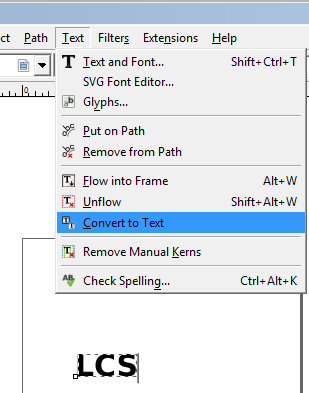
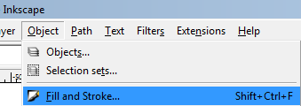
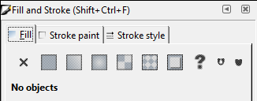
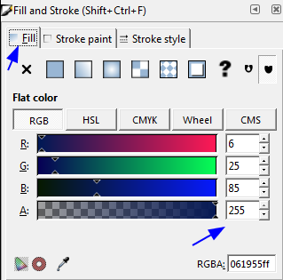
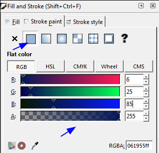
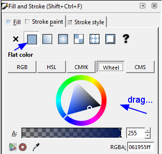

[Back to Index](../README.html)

```{r setup, include=FALSE}
knitr::opts_chunk$set(echo = TRUE)
```

[Inkscape](https://inkscape.org/en/) is a professional vector graphics
editor for Windows, Mac OS X and Linux. It's free and open source.
The current release is version `0.92.3`.

# Fast Tips

## Trouble with text not showing up.

The site
[www.inkscapeforum.com](http://www.inkscapeforum.com/viewtopic.php?t=25142)
offered this helpful solution:

> Flowed text won't show up on the internet. Convert back to regular text:    
> **Text menu `>` Convert to text**. You might have to realign.

This bit me when trying to make an svg for a presentation



## Resetting preferences

From
[http://inkscape.13.x6.nabble.com](http://inkscape.13.x6.nabble.com/Reset-all-Inkscape-settings-td2884795.html)

> I restarted Inkscape after deleting the file "preferences.xml".
This file (according to
[tavmjong.free.fr](http://tavmjong.free.fr/INKSCAPE/MANUAL/html/Customize-Files.html)) is located
in the following directory:

- On Linux:   `~/.config/.inkscape`    

- On Windows: `%APPDATA%\Roaming\inkscape`    

## Setting fill and stroke

There is a helpful [Youtube](https://www.youtube.com/watch?v=o9fBSIwVvGs)

1. select `Object > Fill and Stroke` from the top menu




2. This reveals the `Fill and Stroke` dialog



3. set the `Fill`



4. set the `Stroke`, if desired



6. You can also use the color wheel and drag...




