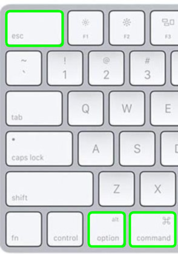
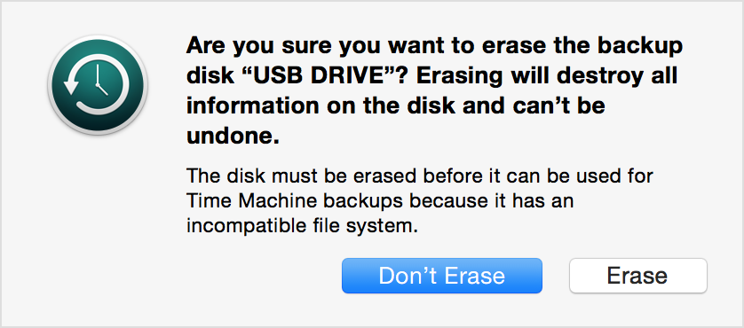
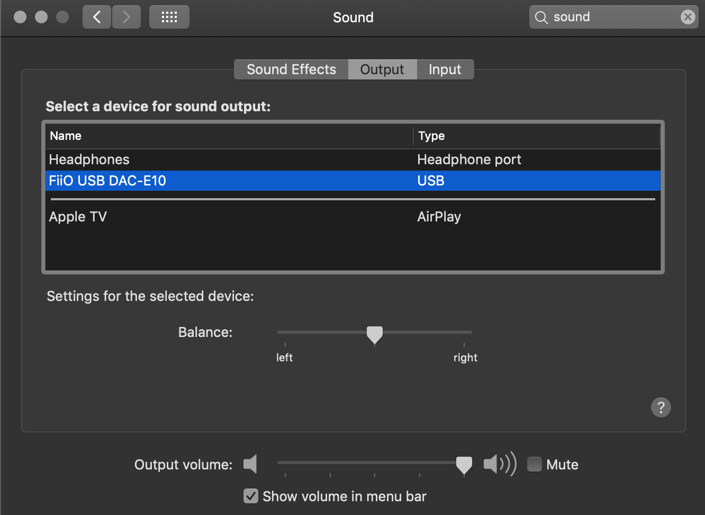
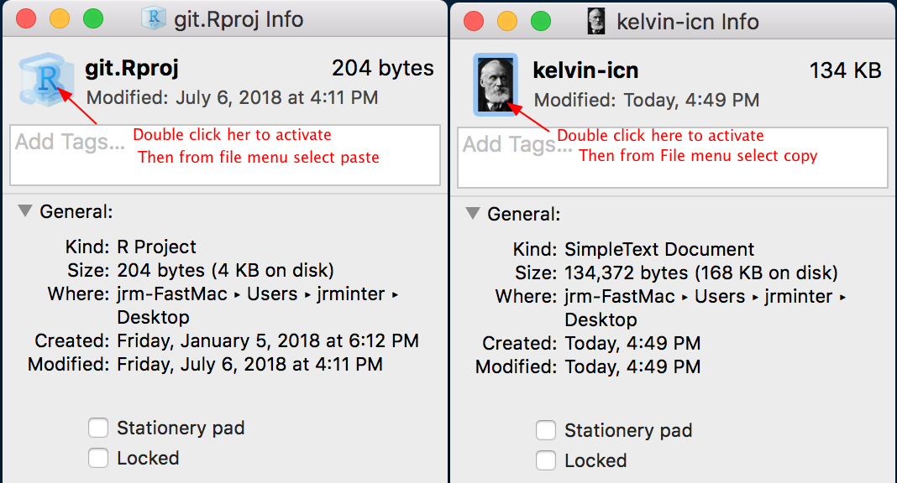
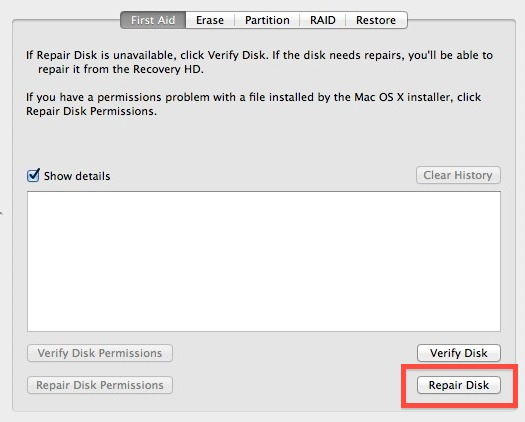
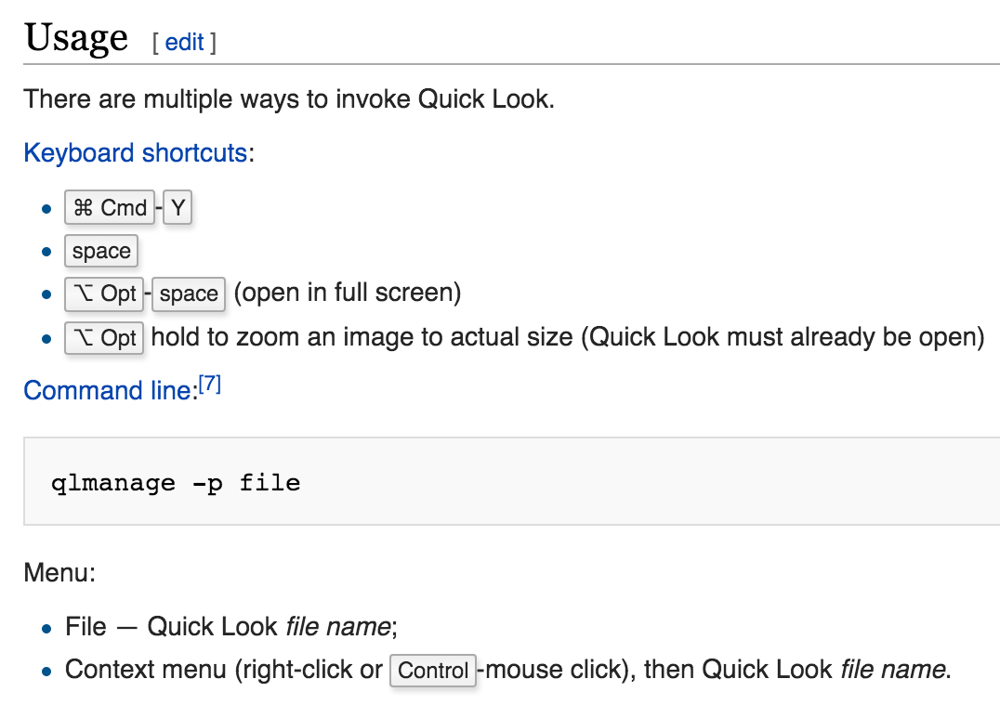
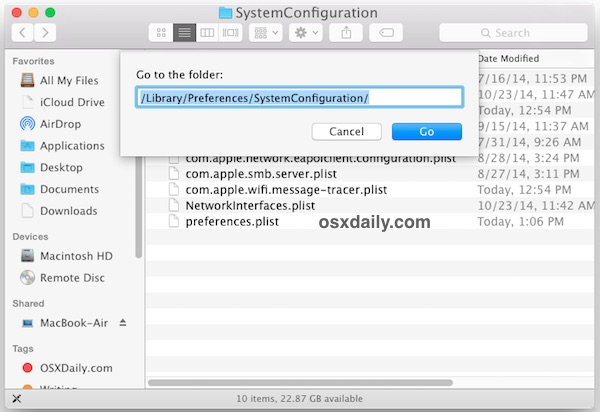
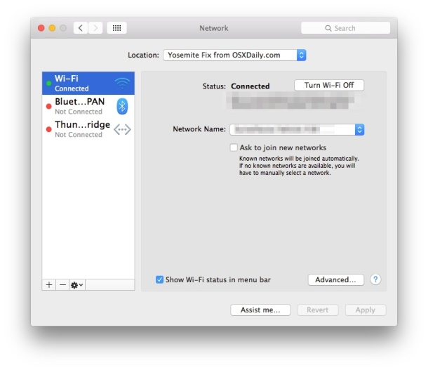
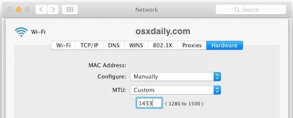

[Back to Index](../README.html)

# Dealing with iCloud

I am a bit annoyed with Apple trying to move content to iCloud.
I want easy manual control. There is a nice explanation on how to do that 
[here](https://discussions.apple.com/thread/7823435)
My Late 2013 Macbook Pro (running Big Sur) does not store in iCloud.
My 2020 MacBook Pro does default to iCloud. On 2021-02-28, I created
a `Local-Docs` folder to store them locally... We will see how this
works out.

Note: one can use `cd /users` to get to the file system... Note that
from the command line `cd Docunments` goes to the iCloud drive;
`cd Local-Docs` goes to the my `Local Docs` directory.

Apple explains the system [here](https://support.apple.com/en-us/HT206985) 

# Setting up for Command Line Tools

From [here](https://stackoverflow.com/questions/52522565/git-is-not-working-after-macos-update-xcrun-error-invalid-active-developer-pa)

```
sudo xcode-select -switch /Library/Developer/CommandLineTools
```

# Updating 1Password from the App Store

Took me a bit to figure this out. Before you try to update 1Password,
first look at the top menu bar. Iirst, quit OnePassword from the top menu
bar (it looks like a bullseye). Then go to the App Store and update
1Password.

# Old MacBook Pro Charging Adapter

From [Amazon](https://www.amazon.com/Apple-MagSafe-Adapter-MacBook-display/dp/B008ALAAV0).
I recently (2021-03-06) received two for Beth's macbook (one for home,
one for school...)


# Notifications

I find that notifications close before I have read them.
To see previous notifications, click on the **upper right hand corner**
of the **screen** for a pull left menu with the notifications.

# Make path visible in Finder window

```
defaults write com.apple.finder _FXShowPosixPathInTitle -bool YES; killall Finder
```

From [here](http://www.snazzylabs.com/five-advanced-tricks-for-mac-users/)

# R Library Path on macos

```
/Library/Frameworks/R.framework/Resources/library
```

# Setting up SublimeText3

> ln -s /Applications/Sublime\ Text.app/Contents/SharedSupport/bin/subl /usr/local/bin/subl

# Mac keyboard shortcuts

There are **lot** of keyboard shortcuts...

[A handy PDF](pdf/mac-keyboard-shortcuts.pdf) from Apple...

Here is a list of the best shortcuts from
[Snazzy Labs](https://www.youtube.com/watch?v=HPQobUOx17o).

The list is below:

1. Spotlight does an excellent job in finding files. Once you found it,
you can press `Enter` to open. You can also hold down the `Command` key
and it will show you the path to the file. Press the `R` key and it will
open the file inside if finder.

2. In any browser you can press `Cmd L` and it will highlight the URL in
the address bar that you can copy and paste into another application. 
So the sequence is `Cmd-L` `Cmd-C` `Cmd-V` See the Apple website
[here](https://support.apple.com/en-us/HT201361)

`Cmd-shift-3` does a screen shot.

`Cmd-shift-4` gives a cross-hair to capture a portion of the screen.

3. In any text document you can make a hyperlink by
`pressing and highlighting the region` and pressing `Cmd-K`,
paste the link (`Cmd V`), and then `OK`.

4. Hold mouse over the window's `radio button`. Hold the mouse there
and you get a menu. Adjust the window position. You can also send to the
`iPad` via `Sidecar`.

5. `Hot corners` - specify an action when you mouse to corner. It is
**easily** accidentally triggered on small displays. You can configure
to have 2 keys to trigger an action....

6. `Cmd H` hides currently active App. `Cmd Option H` does the inverse.
This is a great way to cleanup your workspace.

7. `Cmd tab` cycle through Apps cmd "`" (grave) will cycle through
windows in an app that has more widows. `Reverse` the order by holding
down `Shift`.

8 `CMD` on hidden menu lets you move it **w/o moving active window.**

9. `CMD D` Make a duplicate of a file.  `CMD I` and click stationary pad.
Great for forms. Word knows about it... It is an old relic...

10. Want to do an upload but it is in the wrong folder,
**Drag to the upload window** and it creates a **duplicate**...

11. Hold down the `Option` key and click `Wifi` icon in the menu bar and
it gives you more info on your connection. You can also disconnect from
wifi w/o turning wifi off. Lets you use Airpad up but get off a coffee
shop network.

12. `Option Command D` toggles a document `on` and `off`.
**This is my friend!!!88

13, When I forget to use tabs in finder I can fix it by clicking
`Window > Merge All Windows`. I like this too!!!

14. Move to trash `CMD-Delete` (Backspace).

15. `Shift-Cmd-A` takes you directly to `Applications folder`,
`shift-cmd-D` takes you to the `Desktop`. Only works when the finder
is **active**.

16. Go to dock. Click an App **hold down the cmd key**.

17. **Notification center**. Author **hates** this too...
Hold doen `Option` key as you click on `Notification Center`.  This will
toggle it on and off.

18. Lock screen, `Ctl-Cmd-q`.

19. reset mac pw

From [here](https://www.hellotech.com/guide/for/how-to-reset-admin-password-on-mac)

> https://www.hellotech.com/guide/for/how-to-reset-admin-password-on-mac
> How to Reset Admin Password on Mac
> The easiest way to reset your admin password is to enter recovery mode.
> Here’s how to do that:
> 
> Restart your Mac. You can only access the recovery mode while the
> laptop is booting up, which is why you need to restart it.
>
> While it is restarting, press and hold the Command + R keys until you
> see the Apple logo. If you see the login screen, you will have to
> restart and repeat this step again until you get to Recovery Mode.
>
> How to Reset Admin Password on Mac
> The easiest way to reset your admin password is to enter recovery mode.
> Here’s how to do that:
>
> Type “resetpassword” in the terminal window. Don’t use any space in
> between the words.
>
> Then hit Enter. This will open the Reset Password Assistant screen.
> 
> Note: If you have several user accounts or an older Mac, you will have
> to select “forgot all passwords,” then select the user account you
> want to reset the password for. Finally, you will have to click the
> Apple icon in the upper-left corner and select Restart from the
> drop-down menu.
>
> Finally, click Restart. Once you get to the Login screen, select the
> admin user you just reset the password for and type your new password.
> Click Enter. 


# Clear Preview Cache

> File, 
>
> Open Recent, 
> 
> Clear Menu 

# Homebrew

Bob Rudis recommends frequently running:

```
brew update && brew upgrade && brew cleanup
```

To see what is installed:

```
brew list
```

Current list (2020-07-28)

```
cairo			ilmbase			openjpeg
docbook			imagemagick		openssl@1.1
docbook-xsl		jpeg			pandoc
fontconfig		libcerf			pango
freetype		libde265		pcre
fribidi			libffi			pixman
gd			libheif			python@3.8
gdbm			liblqr			qt
gettext			libomp			readline
ghostscript		libpng			shared-mime-info
glib			libsigc++@2		sqlite
glibmm			libtiff			webp
gnu-getopt		libtool			x265
gnuplot			little-cms2		xmlto
graphite2		lua			xz
harfbuzz		lzo			youtube-dl
htop			ncurses
icu4c			openexr
```

# Getting preferences from command line

```
defaults read TeXShop
```

# Force quit an application

1. Choose `Force Quit` from the Apple Menu

2. From Keyboard press `CMD + Option + Escape`

    
    
# Tim's clean install instructions

1. Download a copy of Catalina from the App Store:

```
    https://apps.apple.com/us/app/macos-catalina/id1466841314?mt=12
```

2. Format a USB drive (at least 12GB or larger) as MacOS Extended


3. Run in terminal `sudo /Applications/Install\ macOS\ Catalina.app/Contents/Resources/createinstallmedia --volume /Volumes/[MyVolume]`
[My Volume] = whatever the name of your USB drive is

# Overiding security

## Turning `Gatekeeper` on and off.

Hat tip to Tim Minter who pointed (2020-07-19) me to:
[cronotek.net](https://cronotek.net/blog/how-to-disable-gatekeeper-on-macos-mojave-and-catalina).

There is a video here on [YouTube](https://www.youtube.com/watch?v=NaKgn9iEgyk).

**To disable Gatekeeper:** 

`sudo spctl --master-disable` 


**To enable Gatekeeper:**  

`sudo spctl --master-enable`


## How I did it by hand...

Note: I had this app for two years before I updated to the latest
Catalina update.

The latest version of Catalina will not permit opening unsigned 
applications (even if they are from reputable sites like
SqliteStudio) The app store alternates are expensive and have
short trial periods. Turns out there is a workaround from
[here](https://superuser.com/questions/898124/the-application-someapp-app-can-t-be-opened).


> Problem: after downloading an application in OS X Yosemite (10.10.x)
> trying to open the application (either from the command-line or by
> double-clicking the application) produces a dialog saying
>
> The application "SomeApp.app" can’t be opened.
> 
> 
> I could not get any dialog or open Security panel. So I followed these
> instructions from StackExchange:
> 
> After extensive trial-and-error, and a lot of fruitless Googling,
> I found the solution required modifying the executable status of the
> `inner` application file. This line:
> 
> chmod +x SomeApp.app/Contents/MacOS/*
> 
> Fixed the problem in all cases that I observed. The +x flags a file
> as executable, and the only file in the `/Contents/MacOS/` directory
> is a binary representing the actual file that should be executed when
> you double-click the application (a .app file is really just a folder).
> Hope this helps someone else!

    
# Screen Recording

These instructions are for MacOS Catalina. The default application for
screen recording is `Quicktime Player`. It does not work well for me.
I prefer `Photo Booth`. Click the Movie Frame icon. 

1. Record screen with photobooth. It will save as file.mov
2. Use `ffmpeg test-3.mov test-3.mp4` to compress.


# Set default applications

From [here](https://www.imore.com/how-set-mac-app-default-when-opening-file).

1. Right-click on a **file** that uses the **file type** you'd like to
**change the default** for.

2. Click on **Get Info** in the pop-up.

3. Click Open With if the section isn't already expanded.

4. Click the dropdown and choose an **app**.

5. Click `Change All`...

# Reset a non-functioning trackpad

*Q:* How do you fix an unresponsive trackpad on a MacBook Pro?

*A:*  Reset the Mac SMC

1. Shutdown your MacBook.
2. Connect the MagSafe adapter.
3. Hold down Shift+Control+Option and the Power button at the same time.
4. Release the keys and look to see if the MagSafe adapter briefly changes color. If it does, the SMC reset has worked.
5. Reboot your Mac and test the trackpad.

# Install command line tools

From: [AtoZ Programming Tutorials](https://www.youtube.com/watch?v=jF_RiRYk-Wo) on Youtube.

   `xcode-select --install`
   
   Accept the license.
   
   Test from the command line:
   
   `clang --version`
   
   Generate a test program:
   
   ```
   #include <stdio.h>

   int main(void){
      printf("Hello, World!\n"); 
   }
   ```
   
   Compile with:
   
   ```
   clang -std=c18 -Wall -Wextra -pedantic hello.c -o hello
   ```
   
   Test from the command line with:
   
   ```
   ./hello
   ```
   
   The C++ version
   
   ```
   #include <iostream>
   #include <vector>

   int main() {
   std::vector<int> V{1, 2, 3, 4, 5, 6};
   for(const auto &e : V){
     std::cout << e << ' ';
   }
   std::cout << '\n';
   }
   ```
   
   and compile with
   
   ```
   clang++ -std=c++17 -Wall -Wextra -pedantic hello.cpp -o hello
   ```
   
   and run with
   
   ```
   ./hello
   ```
   
   
   
   
# Update macports

   `sudo port selfupdate`
   
   `sudo port upgrade outdated`

# Update homebrew


   `brew update`
    
   `brew upgrade`
   
# Disks for TimeMachine Backups

From [here](https://support.apple.com/en-us/HT202784#drive).

Time Machine can back up to an external drive connected to a USB, Thunderbolt,
or FireWire port on your Mac.


## How to format a disk for Time Machine

Time Machine supports all Mac OS Extended (Journaled) formats and Xsan
formats. If the disk isn't using the correct format, Time Machine
automatically prompts you to erase it when you connect it to your Mac:



If you need to erase the disk manually, use the Disk Utility app to erase
using the Mac OS Extended (Journaled) format.

Time Machine can't back up to an iOS device or disk formatted for Windows.
And if your disk uses the Master Boot Record (MBR) partition scheme, some
of its partitions might not be available for use with Time Machine.

- Published Date: April 10, 2019


# Clear recent files on VLC

    1. Open VLC and click `File`.
    2. Scroll down to `Open Recent`.
    3. Select `Clear Menu` to clear the current list.


# Configuring my FiiO headphone amplifier

First, I need to use apple headphones. The knock-off seem to have poor quality
control on connectors. I need to configure the sound properties as shown below.

1. Open `System Preferences` control panel

2. Type `sound` in the search bar

3. Configure the panel as shown below

    

# Erase a time capsule disk

To erase a time capule disk:

1. Launch the AirPort Utility.

2. Select the **Time Capsule** whose **disk** you want to erase.

3. Hit the "**Manual Setup**" button.

4. Click the "**Disks**" icon button.

5. Click the "**Disks**" tab.

6. Select the **disk** (not a sub-volumene, the disk itself ).

7. Click "**Erase...**".

8. Follow the dialogs from there.

# Fixing gnuplot

From: [here](https://gist.github.com/scuxiayiqian/c8ea9452f86dc1918de92b136e772c80#gistcomment-2878171):

> The Brew implementation of gnuplot is not really usable because it no longer
> supports the necessary terminals (e.g., you can no longer provide
> `--with-aquaterm` or `--with-x11` during installation).
>
> However, the MacPorts package manager has a usable install for gnuplot
> (it's safe to have both Brew and MacPorts installed).
>
> See [macports](https://www.macports.org/)
>
> After installing AquaTerm, I used the following to install gnuplot, and all
> is working as expected:
>
>    ```
>    sudo port install gnuplot +aquaterm
>    ```


I'm using macOS Mojave 10.14.4.

**Note**: 2019-05-16

An upgrade of homebrew caused a regression. I fixed with:

```
brew unlink gnuplot
sudo port install gnuplot +aquaterm
```

I tried out the MacPorts plot with [this file](plt/simCorningEagleXG.plt).
This launches a persistent menu.

The AquaTerm `Filemenu` has a  `SaveAs` option to export either `.eps` or
`.pdf` files. This is helpful.

# A jmol installation

I installed jmol in `/Users/jrminter/apps/jmol-14.30.1`. To start, from terminal
change to the directory and type `./jmol.sh` to start.

A good source of mol files is `http://molview.org/`. Download and store them
locally.


# Packages installed via homebrew

These were installed (other dependencies came with...)

```
brew install wget sqlite R rstudio youtube-dl gdal dos2unix
brew install gnuplot fish cowsay curl docutils bibutils

brew cask install sublime text
ln -s  /Applications/Sublime\ Text.app/Contents/SharedSupport/bin/subl $HOME/bin/subl

```

## Set terminal for `gnuplot`

`gnuplot` now installs `qt` so to run a plot,
[mark Setchel](https://stackoverflow.com/questions/54296621/brew-install-gnuplot-with-qt-with-x11-not-working)
reported that this works (and I confirmed...):

```
export GNUTERM=qt
```

reports:

```
Terminal type is now 'qt'
```

and the following throws up a Qt window:

```
gnuplot> plot sin(x)
```

This explanation was helpful:

> I contacted the brew maintainer who had most recently modified the gnuplot
> formula. Brew is no longer allowing options in formulas, so
> 
> > `brew install gnuplot --with-x11`
>
> can no longer be done, but
>
> > `brew install gnuplot`
>
> installs the `qt` terminal and useful terminals from the `cairo` package,
> but not the `x11` terminal. I caught the formula during a couple of hour
> window when the formula was broken. It is now working, but with no way to
> install the x11 terminal.

I have to paste in the window because the qt window quits at the end...


## The importance of updates

For mac rstats folks install/update R etc from Homebrew

From [Bob Rudis](https://twitter.com/hrbrmstr/status/1111046690872705025)
Periodically run...

```
brew update && brew upgrade && brew cleanup
```

and consider updating your 📦/modules/et. al. that depend on any libraries
from them.


## Install R etc from Homebrew

**2019**

Jenny Bryans's what they forgot [site](https://whattheyforgot.org/set-up-an-r-dev-environment.html)
has a more recently updated description of how to install R from
`homebrew`.

She notes: 

> Instead, if you prefer the convenience of homebrew, we recommend
> installing the `"r cask install"`. **NOTE**: the cask used to be named `r-app`
> but the `-app` suffix was dropped due to a homebrew policy change around
> **2019-03-11**. Use:

    ```
    brew cask install r
    ```
> This will install the CRAN R distribution, so all package binaries will
> be available just like they would be from installing R manually.

**Note**: one still needs to install the `clang-6.0.0.pkg` and
`gfortran-6.1.pkg`  files.


**2017-07-12**

Use [this](https://gist.github.com/pachamaltese/a789eb3bc96f33b47e5a1499481c0f4b) gist is dated but has some ideas. 

## Issues with building R packages

1. Download and install the command line tools from
[developer.apple.com](https://developer.apple.com/download/more/)

2. Install the macOS SDK headers 

    From a comment by clason [here](https://github.com/neovim/neovim/issues/9050).

    > Starting with Mojave, the headers are no longer installed under
    > `/usr/include/` by default -- look under `Command Line Tools -> New Features`
    > in the release notes.
    >
    > Running:
    >
    >```
    > open /Library/Developer/CommandLineTools/Packages/macOS_SDK_headers_for_macOS_10.14.pkg
    >```
    > from the command line fixes the issue (at least for me and using `brew`).
    > 
    > The release notes also states that this compatibility package will no longer
    > be provided in the near future, so the build system on macOS will have to be
    > adapted to look for headers in the SDK, making this (at that future point)
    > indeed an nvim issue (if you do not want to punt this to homebrew). @jamessan


# Other packages

## Get/Use iTerm2

1. Get it from [here](https://www.iterm2.com/).

2. [Dale Roberts](https://github.com/daleroberts/itermplot) has created an
awesome iTerm2 backend for Matplotlib, so you can plot directly in your
terminal.

3. Documentation is [here](https://www.iterm2.com/faq.html).

4. : Preferences, including profiles, are stored in     `~/Library/Preferences/com.googlecode.iterm2.plist`. Not particualrly
useful...


## Clear Preview recent files

From [here](https://discussions.apple.com/thread/7567153).

1. Open Preview

2. File > Open Recent > Clear Menu

3. Quit Preview

4. Drag Preview icon from Dock (goes poof) or option remove from Dock

5. Open Preview from Applications folder or Launch Pad  option>Keep in Dock

Scroll to the bottom to see the clear menu option

## The global `.gitignore_global` file

It should contain: 

```
*~
.DS_Store
```

HT [Yihui Xie](https://yihui.name/en/2017/09/ds-store-crap/).

## Set default browser

1. Open System Preferences

2. Choose the General tab

3. Choose the default browser from the drop down menu

## Browser Cache locations

Plan is to not back these up to timemachine

```
/Users/jrminter/Library/Caches/Google/Chrome/Default
/Users/jrminter/Library/SafariTechnologyPreview
```

## Setup tips

18 setup tips from
[cnet.com](https://www.cnet.com/how-to/things-to-tweak-when-setting-up-a-new-macbook/).

## Upgrading bash

From [itnext.io](https://itnext.io/upgrading-bash-on-macos-7138bd1066ba).

The problem: 

```
> Johns-MacBook-Pro:~ jrminter$ bash --version    
GNU bash, version 3.2.57(1)-release (x86_64-apple-darwin18)    
Copyright (C) 2007 Free Software Foundation, Inc.    
```

The solution:

```
brew install bash
```

Since you want to use the newly installed Bash shell as the default shell,
it must be able to act as a login shell. That means, you have to add it to 
the `/etc/shells` file. You can edit this file as the root user:

```
$ sudo subl /etc/shells
```

And add the /usr/local/bin/bash shell to its content, so that the file looks something like this:

```
/bin/bash
/bin/csh
/bin/ksh
/bin/sh
/bin/tcsh
/bin/zsh
/usr/local/bin/bash
```

### Set Default Shell

At this point, if you opened a new terminal window, you would still be using
Bash 3.2. This is because `/bin/bash` is still set as the default shell.
To change this to your new shell, execute the following command:

```
$ chsh -s /usr/local/bin/bash
```

That's it! The default shell for your current user is now set to the new version
of Bash. If you close and reopen the terminal window, you should now be using the
new version already. You can verify this as follows:

```
$ echo $BASH_VERSION
5.0.0(1)-release
```

The chsh command changes the default shell only for the user who executes
the command. If you want to change the default shell for other users too,
you can repeat this command by assuming another user’s identity (e.g. with su).
Most importantly perhaps you might want to change the default shell for the
root user, which you can do as follows:

```
$ sudo chsh -s /usr/local/bin/bash
```

In this way, if you use sudo su to open a shell as the root user, it will
also use the new Bash version.


## Change your Family Sharing payment method

From [support.apple.com](https://support.apple.com/en-us/HT201079)

- Go to Settings > [your name].
- Tap Payment & Shipping. You might need to enter your Apple ID password.
- Tap your current payment method.
- Update your account, then tap Save.


## Installing R on MacOSX

- There is a great explanation of how to install R on MacOSX [here](https://github.com/tidyverse/tidyverse/issues/154). This solves many problems and works on MacOS Mojave.

- [rud.is](http://rud.is/b/2015/10/20/installing-r-on-os-x/) has a nice guide to installation on Mac OSX.

## Make ~/Library visible

From Herb Schulz on TeXLive mailing list:

> One more thing... You can easily make `~/Library` permanently visible in your `HOME` folder. Open your `HOME` folder (`Shft-Cmd-H` in Finder). Then open` View->Show View Options` (`Cmd-J`). Check the `Show Library Folder` box and then close the View Options window. That Library folder is now permanently visible.

## Toggle the dock

The `CMD+Option+D` command toggles hiding and showing the dock.

## C compilation after upgrade to macOS Mojave

This was a head banger... 

After installing XCode and the Command Line tools, I got errors like
this:

```
fatal error: 'stdlib.h' file not found. include <stdlib.h>
/* Not used by R itself, but widely assumed in packages */
```

The answer was on [forums.developer.apple.com](https://forums.developer.apple.com/thread/104296#317543).

```
The Command Line Tools package installs the macOS system headers
inside the macOS SDK. Software that compiles with the installed
tools will search for macOS headers at the standard include path:

/Applications/Xcodebeta.app/Contents/Developer/Platforms/MacOSX.platform/Developer/SDKs/MacOSX10.1 4.sdk/usr/include
For legacy software that looks for the macOS headers in the base system
under /usr/include, please install the package file located at:

/Library/Developer/CommandLineTools/Packages/macOS_SDK_headers_for_macOS_10.14.pkg
```


## Change the icon on a file/alias.

I never remember how to do this, so here it is...

1. For both the source file and the file with the icon, right click
and select `Get Info`.

2. On the Info Window from the file with the icon you want to copy,
double click on the icon and select `Copy` from the `File` menu.

3. On the Info Window from the file with the icon you want to replace,
double click on the icon and select `Paste` from the `File` menu.

An example is shown below



You can turn a png file into an icon [here](https://iconverticons.com/online/).

## Add autocomplete to terminal

I adapted this example by [Tim Leland](https://timleland.com/how-to-enable-autocomplete-in-mac-terminal/)
below. Tim used the `nano` editor; I used the `subl` shortcut to use 
Sublime Text 3.

1. Type in terminal

    ```
    subl ~/.inputrc
    ```

2. Add the lines below and save the file

    ```
    set completion-ignore-case on
    set show-all-if-ambiguous on
    TAB: menu-complete
    ```

3. Open a new Terminal window or tab to open a new session with autocomplete enabled

4. Type the beginning of a command and hit the tab key

## Removing java

For all

```
sudo rm -rf /Library/Internet Plug-Ins/JavaAppletPlugin.plugin
sudo rm -fr /Library/Internet\ Plug-Ins/JavaAppletPlugin.plugin
sudo rm -rf /Library/PreferencePanes/JavaControlPanel.prefPane
sudo rm -rf ~/Library/Application Support/Java
sudo rm -rf /Library/Java/JavaVirtualMachines/jdk*
```

Then install the JDK that you want...

Next, make sure you reconfigure Java for R and RStudio

```
sudo R CMD javareconf
```


## Screen print. Works with Parallels on too...

- **Shift+Command+3**: take a screenshot of the entire screen, and saves it directly to the clipboard for pasting elsewhere

- **Shift+Command+4**: Draw a box for screenshot

- **Shift+Command+5**: New in Mojave. It calls up a small panel at the
bottom of your display with your screen capture options. There are three
screenshot buttons that let you capture the entire screen, a window or
a selection of your screen. Likewise, the two video-recording buttons
let you record your entire screen or a selection of it. On the left is
an X button to close the screenshot panel, but you can also just hit the
Escape key to exit out.    
    
    On the right side is an Options button. It lets you choose where to save
    your screenshot -- Desktop, Documents, Clipboard, Mail, Messages or
    Preview -- and set a 5- or 10-second delay so you can line up items that
    might otherwise disappear when you engage your screenshot tool.
    
    By default, the Show Floating Thumbnail option is enabled, which puts a
    little preview thumbnail of your just-capture screenshot in the
    lower-right corner of your screen, similar to the screenshot procedure
    introduced with iOS 11 (and with which you are intimately familiar
    should you own and operate an iPhone X). Unlike your iPhone, you can
    turn off this preview thumbnail on your Mac. Lastly, you can choose
    to show your mouse pointer in a screenshot or video.
    
    If the screenshot panel is in your way, you can grab its left edge and
    drag it to a new spot on your screen.


## Change all files in a directory to lower case

From [stackoverflow.com](https://stackoverflow.com/questions/7787029/how-do-i-rename-all-files-to-lowercase).

```
for f in *; do mv "$f" "$f.tmp"; mv "$f.tmp" "`echo $f | tr "[:upper:]" "[:lower:]"`"; done
```
## Change file extensions 

Note: to change file extensions from `.for` to `.f`, use

```
for file in *.for; do mv "$file" "${file%.for}.f"; done
```
This tip from
[stackoverflow.com](https://stackoverflow.com/questions/14887275/changing-file-extensions-for-all-files-in-a-directory-osx)
was easier. HT `Renaud`.

Install the `ren` (rename) utility. I used this to change file
extensions

```
brew install ren
ren '*.for' '#1.f'
```

## tar from the command line

1. Tar a directory

```
tar -czvf compile.tar.gz compile
```

2. Uncompress a tarred gzip file

```
tar -zxvf compile.tar.gz

```

## Fixing DTSA-II

Problem on Mac getting to preferences. Below
are entries for quantitative algorithms from Linux version

```
1. CorrectionAlgorithm

XPP - Pouchou &amp; Pichoir Simplified (Non-normal)
Proza96 - Bastin et al. (Non-normal)
PAP - Pouchou &amp; Pichoir's Full φ(ρz)
ZAF-Style
One-to-one (ZA=1.0)
Armstrong CITZAF - Particle

2. Mass Absorption
NIST-Chantler 2005
Heinrich IXCOM 11 (DTSA)
Heinrich IXCOM
Bastin & Heijligers (1985, 1988, 1989)
DTSA CitZAF
Henke 1982
Henke (1993)
Pouchou & Pichoir 1991

3. Brehmstrallung Angular
Acosta 2002 (Cubic)
Acosta 2002 (Linear)

4. Ionization Cross-section
Bote/Salvat-2008
Casnati 1982

```

## Reset Launchpad

From the terminal:

```
defaults write com.apple.dock springboard-columns -int 7
defaults write com.apple.dock springboard-rows -int 4
defaults write com.apple.dock ResetLaunchPad -bool TRUE;
```

Then restart.


## Speed up time machine

From [here](http://www.mackungfu.org/massively-speed-up-time-capsule-time-machine-backups)

> Time Machine and its network-equipped brother, Time Capsule, are
> superb innovations. They make backup seamless, invisible and easy.
> They’re also slow. Really slow. I’ve had to wait before I put my
> MacBook Pro to sleep sometimes while a backup finishes and, of
> course, the initial backup can literally take days.
> 
> Here’s how to fix that.
> 
> Open a Terminal window
>
> `sudo sysctl debug.lowpri_throttle_enabled=0`
> 
> This command prevents Time Machine’s backup process assuming a
> low CPU priority, allowing backups to complete insanely quickly
> In fact, you’ll see MB and GBs tick past on the Time Capsule
> progress display in a second-by-second fashion (provided your
> Mac isn’t very busy with some other task).
> 
> , this command is forgotten when you reboot. If you want it to
> stick around when you reboot, you’ll need to add a launch-time script,
> as > follows.

I changed this a bit

1. In terminal, type

```
sudo subl /Library/LaunchDaemons/nothrottle.plist
```
2. Paste the following code:

```
<?xml version="1.0" encoding="UTF-8"?>
<!DOCTYPE plist PUBLIC "-//Apple//DTD PLIST 1.0//EN" "http://www.apple.com/DTDs/PropertyList-1.0.dtd">
<plist version="1.0">
<dict>
<key>Label</key>
<string>nothrottle</string>
<key>ProgramArguments</key>
<array>
<string>/usr/sbin/sysctl</string>
<string>debug.lowpri_throttle_enabled=0</string>
</array>
<key>RunAtLoad</key>
<true/>
</dict>
</plist>
```
Save the file.

3. In the Terminal window

```
sudo chown root /Library/LaunchDaemons/nothrottle.plist;sudo launchctl load /Library/LaunchDaemons/nothrottle.plist
```

4. if you want to turn this off:

```
sudo launchctl unload -w /Library/LaunchDaemons/nothrottle.plist
```
and reboot.

To check verification from the terminal

```
ps aux | grep fsck
```


## Key shortcuts

**Shift-Command-4**: Screen shot a portion of your screen
**Shift-Command-3**: Screen shot entire screen    

## Convert .webm to .mp4

From [stack-overflow](https://stackoverflow.com/questions/18123376/webm-to-mp4-conversion-using-ffmpeg)

1. Install `ffmpeg`

```
brew install ffmpeg
```

2. Convert `1.webm` to `1.mp4`

```
ffmpeg -fflags +genpts -i 1.webm -r 24 1.mp4
```

## Stop indexing and searching USB keys

From [osx-daily](http://osxdaily.com/2012/01/24/stop-spotlight-from-indexing-time-machine-backup-volumes-external-drives/)

To stop `JRM-TO-GO`

```
mdutil -i off /Volumes/JRM-TO-GO
```

## Toggle visibility of hidden files in Finder

```
Cmd + Shift + .
```


## Subscripts & Superscripts in Keynote

From menu bar: **Format > Font > Baseline > Superscript**. Note 
**Baseline** is the next to last choice in that menu.
Shortcuts: `Ctrl-Cmd-+` and `Ctrl-Cmd-`. Note the - works, not the plus.

## Go to folder

From Finder window, hit "**Command+Shift+G**". Note that
this menu supports both **tab completion**
**drag and drop**.

## Running CalcZAF under Parallels.

1. Before starting the Win 10 VM, use `CMD+Option+D` to hide the dock.

2. Start the Win 10 VM.

3. Use Full Screen mode in the Win 10 VM from the view menu (or Shift-CMD-F).
To exit FS mode, move the cursor to the **top left** of the screen and hit the
green button.

4. Run Standard and Configure and run PENEPMA.

5. When done with the VM, exit FS mode and shut down. Use `CMD+Option+D`
to restore the dock.

## Startup options

From [tekrevue.com](https://www.tekrevue.com/tip/mac-startup-options/)
with an addition from [apple](https://support.apple.com/en-us/HT202731)

| STARTUP KEYS | DESCRIPTION |
|:-------------|:------------|
| Command-R | Boot to OS X Recovery Mode |
| Alt/Option | Access Mac Startup Manager |
| C	| Boot to CD, DVD, or USB |
| D | Run Apple Diagostics on macs after June 2013 |
| N	| NetBoot |
| Shift	| Safe Boot |
| Command-V | Verbose Mode |
| Command-S | Single User Mode |
| Command-Option-P-R | Reset PRAM |
| T | Enable Target Disk Mode |

**Options at the end of Apple Diagnostics**

- To repeat the test, click "Run the test again"" or press Command-R.
- For more information, including details about your service and support options, click "Get started"" or press Command-G.
- To restart your Mac, click Restart or press R.
- To shut down, click Shut Down or press S. 

**Mode Explanations**

- **Startup Manager**: choose from icons of bootable volumes
- **Safe Boot**: start with minimal drivers and check integrity
- **Reset PRAM**: resets important system information
- **Verbose Mode**: see all the startup messages.
- **Single User Mode**: see start up messages and boot to terminal. Can do hard drive repair from here.
- **Target Disk Mode**: you can connect your Mac to another Mac via FireWire or Thunderbolt and see the contents of the Mac’s drive mounted on the second Mac as if the drive were an external FireWire or Thunderbolt device. This not only lets you easily access data on a Mac’s hard drive, it also lets you use one Mac’s hardware to boot another Mac’s operating system and data.


## External disks

[Western Digital](https://support.wdc.com/knowledgebase/answer.aspx?ID=20502) has a nice tutorial on partitoning drives for external disks.

## The High-Sierra vulnerability

Note: Mac released a patch on 2017-11-29

### Helpful comments from [slashdot](https://news.ycombinator.com/item?id=15800676)

**abritishguy**:

> Just in case it is relevant for anyone here this is what our security
> team have established thus far:
>
> - Can be mitigated by enabling the root user with a strong password
> - Can be detected with `osquery` using: \
`SELECT * FROM plist WHERE path = "/private/var/db/dslocal/nodes/Default/users/root.plist" AND key = "passwd" AND length(value) > 1;";`
>- You can see what time the root account was enabled using \
`SELECT * FROM plist WHERE path = "/private/var/db/dslocal/nodes/Default/users/root.plist" WHERE key = "accountPolicyData";` \
> then base 64 decoding that into a file and then running \
> `plutil -convert xml1` and looking at the `passwordLastSetTime` field.
>
> Note: `osquery` needs to be running with `sudo` but if you have it
> deployed across a fleet of macs as a daemon then it will be running
> with `sudo` anyway.

**RJIb8RBYxzAMX9u**

> `osquery` is not a built-in tool. You can get the same info with
> `plutil(1)`: \
> `$ sudo plutil -p /private/var/db/dslocal/nodes/Default/users/root.plist`
>  If I understand OP correctly, if passwd is a lone asterisk, then
> you haven't been exploited.
>
> Edit: trying a little harder to dump accountPolicyData:
> `$ sudo defaults read /private/var/db/dslocal/nodes/Default/users/root.plist accountPolicyData | grep -oE '[[:xdigit:]]+' | xxd -r -p`


**simias**

> > if passwd is a lone asterisk, then you haven't been exploited.
>
>  At the risk of sounding a bit pedantic you can't really assume that,
> it's possible that somebody used this vulnerability, installed some
> sort of backdoor and then disabled the account to hide their tracks.
reply
    
**abritishguy**

> That's correct.

    
**timsutton**

> `sudo dscl . -read Users/root accountPolicyData`


## Use disk utilty to check/repair

From [osxdaily](http://osxdaily.com/2012/02/08/repair-boot-disk-mac-os-x-disk-utilit/)

The trick is to boot the Mac into Recovery Mode first, and run the
Repair function from there. Once booted into Recovery mode you’ll find
the limitations on Disk Utility’s repair function has been removed, and
you can go about repairing the boot disk as intended. We’ll cover
exactly how to do this, step by step.

1. Reboot the Mac and hold down Command+R to boot into Recovery, or hold
down OPTION.
2. Select "Recovery HD"" at the boot menu
3. At the Mac OS X Utilities screen, select "Disk Utility""
4. Select the boot volume or partition from the left menu and click on
the "Repair"" tab.

Repair Disk is now possible, click on "Repair Disk"" to repair the boot
volume.



## Disk check with `fsck`

From [here](http://osxdaily.com/2013/08/07/how-to-repair-a-mac-disk-with-fsck-from-single-user-mode/)

The fsck tool is bundled with every Mac, but because it’s accessible
exclusively through the command line it may appear complex and sound
more intimidating than it really is. Fear not though, because using
fsck is actually quite simple, and there are several cases where it
can repair a problem with a drive that Disk Utility was unable to.

**How to use Single User Mode and fsck to repair a disk**

1. Boot the Mac into Single User Mode by holding down Command+S during
system boot after you hear the boot chime, you know you will have
successfully entered Single User Mode because you will see a bunch
of white text on a black background scroll by

2. When the Single User boot sequence has finished, you'll find a small
command prompt at the bottom of the screen prefixed by a hash sign (#),
when you see that type the following command exactly:

```
fsck -fy
```

3. Once fsck completes, if you see a `File system was modified` message,
then you should run `fsck -fy` again until you see a message stating
`The volume (name) appears to be OK` – this is standard procedure of
using fsck.

4. Type `reboot` to leave Single User Mode and boot the Mac back into
OS X as usual.

Once OS X is booted again, it can be a good idea to confirm all is well
by going back to Disk Utility and running the `Verify` tool to check on
the drives health.

Keep in mind that if the `fsck` tool continuously fails or reports
errors and Disk Utility is a no go as well, the hard drive itself very
well may be failing and on its last legs, so be sure to initiate a back
up all of your critical data using Time Machine or your backup method of
choice, and aim to get the drive replaced sooner than later.


## Sublime Text

```
ln -s "/Applications/Sublime Text.app/Contents/SharedSupport/bin/subl" /usr/local/bin/subl
```


## Unison

Unison is a great file synch tool. The preference files on the mac are in:

```
/Users/userid/Library/Application Support/Unison
```

## Logos

For ESV to have it read use `CMD R`. (It is in the pull-down menu for the
resource)

Some key helps in Library

```

type:bible AND lang:english
type:ency
type:comme
type:lex

type:lect
type:cal
```

## Minimal Homebrew

### Key Utilities

1. Verify the ownership of `/usr/local` tree

```
sudo chown -R $(whoami) /usr/local
```

2. Make sure  `/usr/local/sbin` exists you own it

```
sudo mkdir -p /usr/local/sbin
sudo chown -R $(whoami) /usr/local/sbin
```


### A major annoyance on High Sierra

This [stackoverflow](https://stackoverflow.com/questions/46459152/cant-chown-usr-local-for-homebrew-in-osx-10-13-high-sierra)
discussion notes a major issue:

From **Uri Meirav** : The problem kept occurring... after digging deeper
I found that only uninstalling Homebrew and then re-installing it solved
this issue.

**Uninstall Homebrew**:

```
/usr/bin/ruby -e "$(curl -fsSL https://raw.githubusercontent.com/Homebrew/install/master/uninstall)"
```

**Then re-install it**:

```
/usr/bin/ruby -e "$(curl -fsSL https://raw.githubusercontent.com/Homebrew/install/master/install)"
```


### Some examples

Start with this from [ilovezfs](https://github.com/Homebrew/brew/issues/3228):

```
sudo chown -R $(whoami) $(brew --prefix)/*
cd /usr/local
mkdir Frameworks
sudo chown -R $(whoami) $(brew --prefix)/*
sudo chmod a+w Frameworks
```

I now just have:

```
jrminter 1: brew install gnuplot --with-cairo --with-pdflib-lite \ 
                                 --with-tex --with-x11 --HEAD
jrminter 2: brew install openssl
jrminter 3: brew install sqlite
jrminter 4: brew install pandoc
jrminter 5: brew install imagemagick
```

**Note:** For R I need to use the gfortran4.8 from att. On my backup disk...

## Screenshot

```
defaults write com.apple.screencapture type jpg
```
 
## Encrypt

```
encrypt (change path): openssl enc -aes-256-cbc -e -in {path-in} -out {path-out}
decrypt (change path): openssl enc -aes-256-cbc -d -in {path-in} -out {path-out}
```


## Updates

```
defaults write com.apple.SoftwareUpdate ScheduleFrequency -int 1
```

## Option-volume control on top bar 

lets get preferences
 
## Prevent sleep

```
caffeinate -i -t 3600
```

or just

```
caffinate
```

and don't close terminal. Just **ctl/c** to quit


# Hints on mac Sierra

From the [win-vector blog](http://www.win-vector.com/blog/2017/01/upgrading-to-macos-sierra-nee-osx-for-r-users/)

How does one update an existing Apple machine to macOS Sierra and then restore enough functionality to resume working? Please read on for my notes on the process.

## Why to upgrade:

I won’t really go too deeply into why one would want to update to macOS Sierra. My reasons were vain hopes the "OSX spinny" would go away, and having to interoperate with Keynote users themselves running macOS Sierra (which has a different version of Keynote). I haven’t really noticed that many differences (I think Grab can now export PNG, the volume control can now send system sound to networked devices), and the upgrade was fairly painless. As expected the upgrade broke a lot of software I use to actually work. This is why I upgrade a scratch machine first. Searching around on the web I think I found enough fixes to restore functionality.

## Why to not upgrade (or why to wait):

Cran seems to still build and test packages for OSX Mavericks, so moving to macOS Sierra puts you further out of sync with the primary R repository. Also Homebrew (a source of non-decade out of date Posix/Unix software) is likely still catching up to macOS Sierra.

## List of issues and workarounds found in upgrading.

1. **ssh breaks:** ssh is needed to log in to remote systems and to share Git source control data securely requires a user password each and every time use use it after the upgrade, even if you have put the control password in OSX’s keychain. The fix is to add a file called "config" to your "~/.ssh" directory with the following contents. Then after you unlock your ssh credential once (oddly enough by using the ssh password, not the keychain password) it should remain available to the operating system.

```
Host *
   UseKeychain yes
   AddKeysToAgent yes
   IdentityFile ~/.ssh/id_rsa
```

To add insult to injury the above config is not compatible with OS X El Capitan, so there is no config that works both before and after an operating system upgrade. Also, I have no good documentation on these features, I presume it is the "UseKeychain" argument doing all the work.

2. **Java breaks:**  A current Java is needed for some R packages (such as rJava and rSymPy). Fixing Java seems to take some combination of all of the steps cobbled together from here and here. You re-install Java 8 from Oracle. And then:

```
# Fix Java Home in .profile or .bashrc, in my case add the line
export JAVA_HOME=/Library/Java/JavaVirtualMachines/jdk1.8.0_65.jdk/Contents/Home/
# symlink a Java dynamic library, as some software looks the wrong place
sudo ln -f -s $(/usr/libexec/java_home)/jre/lib/server/libjvm.dylib /usr/local/lib
# Try to convince R where Java is
sudo R CMD javareconf
# Inside R re-install the rJava package
install.packages("rJava",type='source')
```

After that you may also want to fix "legacy Java 6" (it turns out I need it for my XML editor OxygenAuthor). That is just a matter of downloading and installing from [Apple](https://support.apple.com/kb/dl1572) (despite it claiming not to be for Sierra).

3. **Homebrew breaks:**  Homebrew is one of the currently available ways to get somewhat up to date Unix/Posix software on a Mac. I think Homebrew is not yet officially supporting macOS Sierra, but some combination of the following seemed to bring it back (the sudo commands were all suggested by "brew doctor", run at your own risk).

```
brew doctor
sudo chown -R $(whoami):admin /usr/local
brew update
sudo chown root:wheel /usr/local
```


# Dealing with directory permissions in el Capitan

```
sudo chown -R $(whoami) /usr/local
sudo chown -R $(whoami) /Library/Ruby
```

Then

```
gem install jekyll
```

works... Helps for TeXlive too!

## Test Jekyll

Instructions

```
cd 
gem install jekyll
jekyll new my-awesome-site
cd my-awesome-site
bundle install
bundle exec jekyll serve

# => Now browse to http://localhost:4000
```


# Getting Environment Variables loaded in el Capitan

edit

```
/etc/launchd.conf

may need to

defaults write com.apple.dt.Xcode UseSanitizedBuildSystemEnvironment -bool NO
```

From [how-to-geek](http://www.e-howtogeek.com/60745/setting-environment-variables-launchd-longer-yosemite-capitan)

A more recent similar reference: [Shotgun Support](https://support.shotgunsoftware.com/hc/en-us/articles/219042108-Setting-global-environment-variables-on-OS-X)

this last article notes that we can activate environment.plist with

```
launchctl load ~/Library/LaunchAgents/environment.plist
```

If it is already loaded and you have modified the plist file, see your updates by running:

```
launchctl stop ~/Library/LaunchAgents/environment.plist
launchctl unload ~/Library/LaunchAgents/environment.plist
launchctl load ~/Library/LaunchAgents/environment.plist
launchctl start ~/Library/LaunchAgents/environment.plist
```

Create an environment.plist file in `~/Library/LaunchAgents/` with this content: I have this content:

```
<?xml version="1.0" encoding="UTF-8"?>
<!DOCTYPE plist PUBLIC "-//Apple//DTD PLIST 1.0//EN" "http://www.apple.com/DTDs/PropertyList-1.0.dtd">
<plist version="1.0">
<dict>
  <key>Label</key>
  <string>my.startup</string>
  <key>ProgramArguments</key>
  <array>
    <string>sh</string>
    <string>-c</string>
    <string>launchctl setenv HOME /Users/jrminter
    launchctl setenv IMAGE_ROOT /Users/jrminter/dat/images
    launchctl setenv EDS_ROOT /Users/jrminter/dat/eds
    launchctl setenv GIT_HOME /Users/jrminter/Documents/git</string>

  </array>
  <key>RunAtLoad</key>
  <true/>
</dict>
</plist>
```

You can add many launchctl commands inside the <string></string> block.

The plist will activate after system reboot. You can also use `launchctl load ~/Library/LaunchAgents/environment.plist` to launch it immediately.

The same solution works in El Capitan too.

Xcode 7.0+ doesn't evaluate environment variables by default. The old behaviour can be enabled with this command:

```
defaults write com.apple.dt.Xcode UseSanitizedBuildSystemEnvironment -bool NO
```

flag

# Rendering markdown with Quick Look

From [Wikipedia](https://en.wikipedia.org/wiki/Quick_Look)

Quick Look is a quick preview feature developed by Apple Inc. which was introduced in its operating system, Mac OS X 10.5 Leopard.


We can install a markdown extension - [qlmarkdown](https://github.com/toland/qlmarkdown)- using `homebrew`

```
$ brew update
$ brew cask install qlmarkdown
```

To uninstall

```
$ brew cask uninstall qlmarkdown
```

Quick Look doesn't allow selecting text. If you want to select the text in the markdown preview, you will need to enable text selection in Quick Look by running the following in Terminal:

```
defaults write com.apple.finder QLEnableTextSelection -bool TRUE; killall Finder
```

# El Capitan & Homebrew

From [DomT4](https://raw.githubusercontent.com/Homebrew/homebrew/master/share/doc/homebrew/El_Capitan_and_Homebrew.md)

Part of the OS X 10.11/El Capitan changes is something called [System Integrity Protection](https://en.wikipedia.org/wiki/System_Integrity_Protection) or "SIP".

SIP prevents you from writing to many system directories such as `/usr`, `/System` & `/bin`, regardless of whether or not you are root. The Apple keynote is [here](https://developer.apple.com/videos/wwdc/2015/?id=706) if you'd like to learn more.

One of the implications of SIP is that you cannot simply create `/usr/local` if it is removed or doesn't exist for another reason. However, as noted in the keynote, Apple is leaving `/usr/local` open for developers to use, so Homebrew can still be used as expected.

Apple documentation hints that `/usr/local` will be returned to `root:wheel restricted` permissions on [every OS X update](https://developer.apple.com/library/prerelease/mac/releasenotes/General/rn-osx-10.11/); Homebrew will be adding a `brew doctor` check to warn you when this happens in the near future.

If you haven't installed Homebrew in `/usr/local` or another system-protected directory, none of these concerns apply to you.

This is how to fix Homebrew on El Capitan if you see permission issues:

## If `/usr/local` exists already:

```bash
sudo chown $(whoami):admin /usr/local && sudo chown -R $(whoami):admin /usr/local
```

## If `/usr/local` does not exist:

* Reboot into Recovery mode (Hold Cmd+R on boot) & access the Terminal.
* In that terminal run:
    `csrutil disable`
* Reboot back into OS X
* Open your Terminal application and execute:

```bash
  sudo mkdir /usr/local && sudo chflags norestricted /usr/local && sudo chown $(whoami):admin /usr/local && sudo chown -R $(whoami):admin /usr/local
```

* Reboot back into Recovery Mode & access the Terminal again.
* In that terminal execute:
  `csrutil enable`
* Reboot back into OS X & you'll be able to write to `/usr/local` & install Homebrew.


# Command line tips
From [www.mitchchn.me](http://www.mitchchn.me/2014/os-x-terminal)

## open

```
$ open /Applications/Safari.app/

NAME
     open -- open files and directories

SYNOPSIS
     open [-e] [-t] [-f] [-F] [-W] [-R] [-n] [-g] [-h] [-b bundle_identifier]
          [-a application] file ... [--args arg1 ...]
```

## pbcopy/pbpaste

```
$ ls ~ | pbcopy
$ pbcopy < blogpost.txt
$ curl http://www.google.com/doodles#oodles/archive | grep -A5 'latest-doodle on' | grep 'img src' | sed s/.*'> tasklist.txt


NAME
  pbcopy,  pbpaste  -  provide copying and pasting to the pasteboard (the Clipboard) 
                       from command line

SYNOPSIS
  pbcopy [-help] [-pboard {general | ruler | find | font}]

  pbpaste [-help] [-pboard {general | ruler | find | font}]
          [-Prefer {txt | rtf | ps}]
```

## mdfind

```
$ mdfind -onlyin ~/Documents essay

NAME
     mdfind -- finds files matching a given query

SYNOPSIS
     mdfind [-live] [-count] [-onlyin directory] [-name fileName] query
```

## screencapture

```
$ screencapture -C -M image.png
$ screencapture -c -W
$ screencapture -T 10 -P image.png
$ screencapture -s -t pdf image.pdf

NAME
     screencapture -- capture images from the screen and save them to a file
     or the clipboard

SYNOPSIS
     screencapture [-SWCTMPcimswxto] file
     
DESCRIPTION
     The screencapture utility is not very well documented to date.  A list of
     options follows.
     -c      Force screen capture to go to the clipboard.

     -C      Capture the cursor as well as the screen.  Only allowed in non-
             interactive modes.

     -i      Capture screen interactively, by selection or window.  The con-
             trol key will cause the screen shot to go to the clipboard.  The
             space key will toggle between mouse selection and window selec-
             tion modes.  The escape key will cancel the interactive screen
             shot.

     -m      Only capture the main monitor, undefined if -i is set.

     -M      Open the taken picture in a new Mail message.

     -o      In window capture mode, do not capture the shadow of the window.
     -P      Open the taken picture in a Preview window.

     -s      Only allow mouse selection mode.

     -S      In window capture mode, capture the screen instead of the window.

     -t      <format> Image format to create, default is png (other options
             include pdf, jpg, tiff and other formats).

     -T      <seconds> Take the picture after a delay of <seconds>, default is
             5.

     -w      Only allow window selection mode.

     -W      Start interaction in window selection mode.

     -x      Do not play sounds.
     -x      Do not play sounds.

     -a      Do not capture attached windows.

     -r      Do not add screen dpi meta data to captured file.

     files   where to save the screen capture, 1 file per scree

```
##  launchctl

`launchctl` lets you interact with the OS X init script system, launchd. With launch daemons and launch agents, you can control the services that start up when you boot your computer. You can even set up scripts to run periodically or at timed intervals in the background, similar to cron jobs on Linux.

For example, if you’d like to have the Apache web server start automatically when you turn on your Mac, simply type:

```
$ sudo launchctl load -w /System/Library/LaunchDaemons/org.apache.httpd.plist
```

Running launchctl list will show you what launch scripts are currently loaded. `sudo launchctl unload [path/to/script]` will stop and unload running scripts, and adding the `-w` flag will remove those scripts permanently from your boot sequence. I like to run this one on all the auto-update "helpers" created by Adobe apps and Microsoft Office.

Launchd scripts are stored in the folllowing locations:

```
~/Library/LaunchAgents    
/Library/LaunchAgents          
/Library/LaunchDaemons
/System/Library/LaunchAgents
/System/Library/LaunchDaemons
```

To see what goes into a launch agent or daemon, there’s a great blog post by [Paul Annesley](http://paul.annesley.cc/2012/09/mac-os-x-launchd-is-cool/) that walks you through the file format. And if you’d like to learn how to write your own launchd scripts, Apple provides some helpful documentation on their [Developer site](https://developer.apple.com/library/mac/documentation/MacOSX/Conceptual/BPSystemStartup/Chapters/CreatingLaunchdJobs.html). 

## say

```
say "I'm done" -v Samantha

NAME
  say - Convert text to audible speech

SYNOPSIS
  say [-v voice] [-r rate] [-o outfile [audio format options] | -n name:port |
  -a device] [-f file | string ...]
```

## diskutil

```
diskutil list

/dev/disk0
   #:                       TYPE NAME                    SIZE       IDENTIFIER
   0:      GUID_partition_scheme                        *500.3 GB   disk0
   1:                        EFI EFI                     209.7 MB   disk0s1
   2:          Apple_CoreStorage                         499.4 GB   disk0s2
   3:                 Apple_Boot Recovery HD             650.0 MB   disk0s3
/dev/disk1
   #:                       TYPE NAME                    SIZE       IDENTIFIER
   0:                  Apple_HFS jrm-FastMac            *499.0 GB   disk1
                                 Logical Volume on disk0s2
                                 8B76568F-93D3-4A49-B3F6-721A4642738D

diskutil repairPermissions [-plist] device

diskutil repairPermissions /dev/disk1

see man diskutil
```

# An annoyance with R and Gtk2 with R-3.2.0

Using Gtk2 from homebrew seemed to work

Got the idea from [StackOverflow](http://stackoverflow.com/questions/15868860/r-3-0-and-gtk-rgtk2-error) -- the second answer...

```
brew install gtk+
export PKG_CONFIG_PATH=/usr/X11/lib/pkgconfig:$PKG_CONFIG_PATH
R
install.packages("RGtk2")
install.packages("cairoDevice")
```

I also added the line to my fixYosemite.app AppleScript


# Yosemite

There is a significant problem passing environment variables. Nice solution posted on [stackoverflow](http://stackoverflow.com/questions/25385934/yosemite-launchd-conf-no-longer-work).

You can still use launchctl setenv variablename value to set a variable so that is picked up by all applications (graphical applications started via the Dock or Spotlight, in addition to those started via the terminal).

Obviously you will not want to do this every time you login.

[Edit]: To avoid this, launch AppleScript Editor, enter a command like this:

``do shell script "launchctl setenv variablename value"``

(Use multiple lines if you want to set multiple variables)

Now save (⌘+s) as File format: Application. Finally open System Settings → Users & Groups → Login Items and add your new application.

[Original answer]: To work around this place all the variables you wish to define in a short shell script, then have a look at this previous answer about how to run a script on MacOS login. That way the the script will be invoked when the user logs in.

Neither solution is perfect as the variables will only be set for that specific user but I am hoping/guessing that may be all you require.

If you do have multiple users you could either manually set a Login Item for each of them or place a copy of com.user.loginscript.plist in each of their local Library/LaunchAgents directories, pointing at the same shell script.

Granted, neither of these workarounds is as convenient as /etc/launchd.conf.

# Quick

## See what the installer is doing

During a recent install of the Yosemite release candidate, the intaller hung for over an hour at the "2 min left" point. Turrns out that this was a known issue on upgrade installs since it is copying files back from a recovery partition to ``/usr/local/``. With Homebrew and TeXLive installed, I had a lot there. The log is our friend...

Type ``⌘+l`` to see the log.


## Some hints for SSDs
From [alutam.com](http://blog.alutam.com/2012/04/01/optimizing-macos-x-lion-for-ssd/)

There is no GUI switch to turn these local backups off, but it can easily be done on the command line. Just start Terminal.app and execute the following command:

```
sudo tmutil disablelocal
```

Once you do this, the TM Preferences panel will immediately reflect it – the text will change from "Time Machine keeps local snapshots as space permits, and:"" to "Time Machine keeps:". To turn it back on, you can simply run the following in the Terminal:

```
sudo tmutil enablelocal
```

Also note, this feature gets turned on automatically whenever you turn off and on the Time Machine – so don’t forget to turn the local backups back off again whenever you do that.

## Lock Screen
Cntl-shift-eject keys

## Fix wireless problems

From [osx daily](http://osxdaily.com/2014/10/25/fix-wi-fi-problems-os-x-yosemite/)

Some Mac users who upgraded to OS X Yosemite have discovered a variety of wireless network connectivity issues, ranging from dropping wi-fi connections, to an inability to connect to the outside world despite being connected to a wifi router, even suddenly and strangely slow internet speeds. These network issues seem to occur most often on Macs that have updated to OS X Yosemite from Mavericks rather than those who performed a clean Yosemite install, which could suggest the issue has to do with improper network setting and preferences, or even a corrupted file somewhere. That’s a good thing, because it should mean a resolution is fairly easy to implement, as we’re about to show you.

It should be noted that it’s difficult to point to a single cause for sudden and unexpected wireless troubles with any OS X version, and there may be different causes for different users. Accordingly, it’s challenging to offer a single solution to the Yosemite Wi-Fi problems that users are experiencing. With that said, we’ve been able to resolve the problem for many Macs by using the steps outlined below. This involves editing some system level configuration files, and you should probably start a Time Machine backup before proceeding just to be on the safe side of things.

### 1: Remove Network Configuration & Preference Files

Manually trashing the network plist files should be your first line of troubleshooting. This is one of those tricks that consistently resolves even the most stubborn wireless problems on Macs of nearly any OS X version. This is particularly effective for Macs who updated to Yosemite that may have a corrupt or dysfunctional preference file mucking things up:

1. Turn Off Wi-Fi from the Wireless menu item
2. From the OS X Finder, hit Command+Shift+G and enter the following path:

```
/Library/Preferences/SystemConfiguration/
```



Within this folder locate and select the following files:
```
com.apple.airport.preferences.plist
(com.apple.network.identification.plist
com.apple.wifi.message-tracer.plist(
NetworkInterfaces.plist(
preferences.plist
```

Move all of these files into a folder on your Desktop called ‘wifi backups’ or something similar – we’re backing these up just in case you break something but if you regularly backup your Mac you can just delete the files instead since you could restore from Time Machine if need be
Reboot the Mac
Turn ON WI-Fi from the wireless network menu again
This forces OS X to recreate all network configuration files. This alone may resolve your problems, but if you’re continuing to have trouble we recommend following through with the second step which means using some custom network settings.

### 2: Create a New Wi-Fi Network Location with Custom DNS

What we’re doing here is creating a new network location which is going to have a configuration different from the defaults. First, we’ll use a completely new network setup. Then, we’ll set DNS on the computer rather than waiting for OS X to get DNS details from the wi-fi router, which alone can resolve many issues with DNS lookups, since Yosemite seems to be finicky with some routers. Finally, we’re going to set a custom MTU size that is slightly smaller than the default, which will get rejected less often by a router, it’s an old netadmin trick that has long been used to fix network troubles.

Open the  Apple menu and go to System Preferences, then choose "Network"
Pull down the "Locations" menu and choose "Edit Locations", then click the [+] plus button, give the new network location a name like "Yosemite WiFi" then click Done



Next to "Network Name" join your desired wifi network as usual
Now click the "Advanced" button, and go to the "DNS" tab
Click the [+] plus button and specify a DNS server – we’re using 8.8.8.8 for Google DNS in this example but you should use the fastest DNS servers you can find for your location, it will vary. You can also use your own ISP DNS servers
Now go to the "Hardware" tab and click on ‘Configure’ and choose "Manually"
Click on MTU and change it to "Custom" and set the MTU number to 1453 (this is a networking secret from ancient times, and yes it still works!), then click on "OK"



Now click on "Apply" to set your network changes
Quit and relaunch any apps that require network access, like Safari, Chrome, Messages, Mail, and your wireless connectivity should be flawless and back at full speed at this point.

### Unload & Reload discoveryd to Fix DNS & Wi-Fi Failures in OS X Yosemite

Another trick that was left in the comments (thanks Frank!) involves refreshing the discoveryd service by unloading and reloading it with the launchctl command. This is a bit curious but apparently it works for some users, suggesting there could be an issue with discovery or resolving DNS on some Yosemite Macs. It’s certainly worth a try if the above tricks failed to resolve your wi-fi connectivity problems in OS X 10.10, as there are a fair amount of positive reports with this one:

Open Terminal (found in /Applications/Utilities/ or with Spotlight) and enter the following command:

```
sudo launchctl unload -w /System/Library/LaunchDaemons/com.apple.discoveryd.plist
```

Hit return and enter an admin password to use the sudo command
Now run the following command to reload discoveryd (this used to be called mDNSResponder)

```
sudo launchctl load -w /System/Library/LaunchDaemons/com.apple.discoveryd.plist
```

Again hit Return to finish the command
You may need to relaunch apps that require network connectivity. Note that if you reboot the Mac with this one, you will have to repeat the above steps to unload and reload discoveryd into launchd.

### Bonus OS X Yosemite Wi-Fi Troubleshooting Tricks

- Here are some other less than ideal solutions that have been reported to remedy wi-fi issues in OS X Yosemite.

- Join a 2.4GHZ network (N network) – some users report no trouble with 2.4GHz networks
Set the wi-fi routers 5GHz (G) channel to be somewhere between 50-120

- Turn Off Bluetooth – We have seen several reports that disabling Bluetooth will resolve wifi problems with some networks, but this is obviously not appropriate for Macs that have bluetooth accessories

If none of the above works, there could be other problems. Sometimes starting fresh with a clean install could resolve them, or if you believe the problem to be a bug and you had a trouble free experience in prior versions of Mac OS, you could always downgrade from OS X Yosemite to Mavericks again until an update to Yosemite arrives to resolve the issue once and for all.

Have you experienced wireless connectivity issues with OS X Yosemite? What have you tried, and how did you resolve them? Let us know what has been working to remedy your wifi troubles by leaving a comment!


## Change the login screen

[osx daily](http://osxdaily.com/2013/11/04/change-login-screen-wallpaper-os-x-mavericks/)

## Postgres
[an example](http://www.mikeball.us/blog/setting-up-postgres-on-mac-osx-with-homebrew)

[another example](https://gist.github.com/lxneng/741932)

[lunchy](http://www.moncefbelyamani.com/how-to-install-postgresql-on-a-mac-with-homebrew-and-lunchy/)

```
lunchy start postgres
lunchy stop postgres
```

On first install
```
initdb /usr/local/var/postgres
```
You can now start the database server using:
```
postgres -D /usr/local/var/postgres
```
or
```
pg_ctl -D /usr/local/var/postgres -l logfile start
```
i.e.
```
pg_ctl -D /usr/local/var/postgres -l /usr/local/var/postgres/server.log start &
```

Some tips
```
$ psql testdb
testdb=# create table users(id serial, name varchar(25));
testdb=# insert into users(name) values('john');
testdb=# insert into users(name) values('minter');
testdb=# select * from users;
testdbmy=# \q
```

later
```
$psql testdb
testdb=# \l
testdb=# \d
testdb=# \d company
testdb=# \c testdb;
```

## Watch for this
[Reports](https://discussions.apple.com/message/23505531#23505531) of battery life issue after upgrade to Mavericks. Note that [Apple](http://www.apple.com/batteries/notebooks.html) has some tips about batteries.

## Startup items

### my favorite color for desktop - pre Mojave

RGB: 0,34,64

### my favorite color for desktop - Mojave Dark Mode

RGB: 53,53,53

## global environment variables
If one has global environment variables to set at
launch time and be avaible to all applications (that
might note get them from ``.profile``) one can put
them in ``/etc/launchd.conf``. An example might be

```
setenv IMG_ROOT /Users/jrminter/dat/images
```

Note how this uses ``csh`` syntax...

## Personal environment variables
These are best set in ``.profile``

# Create an install disk for for El Capitan

From [ars technica](http://arstechnica.com/apple/2015/09/how-to-make-your-own-bootable-os-x-10-11-el-capitan-usb-install-drive/)

Apple has actually included a terminal command that can create an install disk for you. Assuming that you have the OS X El Capitan installer in your Applications folder and you have a Mac OS X Extended (Journaled)-formatted USB drive named "Untitled" mounted on the system (you can rename an old one in Disk Utility...), you can create an El Capitan install drive by typing the following command into the Terminal.

```
sudo /Applications/Install\ OS\ X\ El\ Capitan.app/Contents/Resources/createinstallmedia --volume /Volumes/Untitled --applicationpath /Applications/Install\ OS\ X\ El\ Capitan.app --nointeraction
```

The command will erase the disk and copy the install files over. Give it some time, and your volume will soon be loaded up with not just the OS X installer but also an external recovery partition that may come in handy if your hard drive dies and you're away from an Internet connection.

Whichever method you use, you should be able to boot from your new USB drive either by changing the default Startup Disk in System Preferences or by holding down the Option key at boot and selecting the drive. Once booted, you'll be able to install or upgrade El Capitan as you normally would.


# C++11
Guess there are issues. One suggestion from
[Sebastian Raschka](http://stackoverflow.com/questions/19649421/something-odd-happened-to-c-11-in-mavericks)

```

clang++ -std=c++11 -stdlib=libc++

```
# Homebrew

Current error building R packages

A hint from [StackOverflow](http://stackoverflow.com/questions/19533220/cannot-install-r-package-from-source-in-mac-osx-maverick) fixed the problem!!!

Edit ``Makeconf`` in  ``/Library/Frameworks/R.framework/Resources/etc``

set

```
CC=clang
CXX=clang++
```

Error described below:

It uses something like:

```
llvm-gcc-4.2 -arch x86_64 -std=gnu99 -I/Library/Frameworks/R.framework/Resources/include -DNDEBUG  -I/usr/local/include    -fPIC  -mtune=core2 -g -O2  -c spectrum.c -o spectrum.o
```

Which produces this error

```
make: llvm-gcc-4.2: No such file or directory
```

This seemed to work for me until I updated homebrew...
From [John Bohn](http://jjbohn.info/blog/2013/10/02/fixing-homebrew-on-mac-osx-mavericks/)

I've had lots of problems with homebrew since upgrading to Mavericks.
The same problems also existed when trying to ``rbenv install`` and
really anything else that compiles. The root cause of the issue ended
up being a conflict Mountain Lion Command Line Tools and the ones
provided by Maverick.

There was an easy solution however. By running ``xcode-select``
(a tool provided to change the path to the current active developer
directory) it will fix the issue.

Specifically, run this from your terminal:

```
xcode-select --install
```

This will bring up a dialog to install the Command Line Tools
(which you will have to type in your password) and will fix the problem.

## QT problem
From [Cliff Rowley](https://github.com/mxcl/homebrew/pull/23793)

```
brew install https://raw.github.com/cliffrowley/homebrew/patched_qt/Library/Formula/qt.rb --HEAD
```

Still have issues with lib mismatch between sip, qt, and pyqt. Grrr...

## Hardware tips
### Eject a stuck CD/DVD
1. Restart the computer. If necessary, use the reset/interrupt
button.
2. Immediately after the system startup tone, press and
hold the ``CMD-OPT-O-F`` key combination. The computer starts
up to a text-only screen, indicating that you are in
Open Firmware.
3. At the prompt, type ``eject cd`` and return.
4. At the prompt, type ``mac-boot`` and return.

[Back to Index](../README.html)