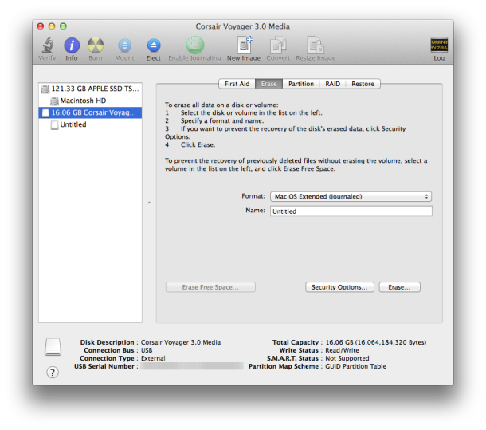
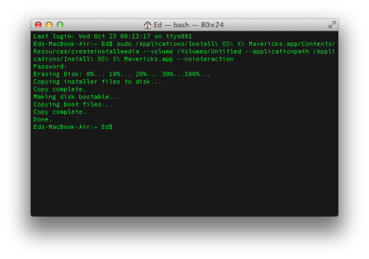

[Back to Index](../README.html)

## An annoyance with R and Gtk2 with R-3.2.0

Using Gtk2 from homebrew seemed to work

Got the idea from [StackOverflow](http://stackoverflow.com/questions/15868860/r-3-0-and-gtk-rgtk2-error) -- the second answer...

```
brew install gtk+
export PKG_CONFIG_PATH=/usr/X11/lib/pkgconfig:$PKG_CONFIG_PATH
R
install.packages("RGtk2")
install.packages("cairoDevice")
```

I also added the line to my fixYosemite.app AppleScript


## Yosemite

There is a significant problem passing environment variables. Nice solution posted on [stackoverflow](http://stackoverflow.com/questions/25385934/yosemite-launchd-conf-no-longer-work).

You can still use launchctl setenv variablename value to set a variable so that is picked up by all applications (graphical applications started via the Dock or Spotlight, in addition to those started via the terminal).

Obviously you will not want to do this every time you login.

[Edit]: To avoid this, launch AppleScript Editor, enter a command like this:

``do shell script "launchctl setenv variablename value"``

(Use multiple lines if you want to set multiple variables)

Now save (⌘+s) as File format: Application. Finally open System Settings → Users & Groups → Login Items and add your new application.

[Original answer]: To work around this place all the variables you wish to define in a short shell script, then have a look at this previous answer about how to run a script on MacOS login. That way the the script will be invoked when the user logs in.

Neither solution is perfect as the variables will only be set for that specific user but I am hoping/guessing that may be all you require.

If you do have multiple users you could either manually set a Login Item for each of them or place a copy of com.user.loginscript.plist in each of their local Library/LaunchAgents directories, pointing at the same shell script.

Granted, neither of these workarounds is as convenient as /etc/launchd.conf.

## Quick

### See what the installer is doing

During a recent install of the Yosemite release candidate, the intaller hung for over an hour at the "2 min left" point. Turrns out that this was a known issue on upgrade installs since it is copying files back from a recovery partition to ``/usr/local/``. With Homebrew and TeXLive installed, I had a lot there. The log is our friend...

Type ``⌘+l`` to see the log.

### Fixing ``/usr/local`` permissions for ``homebrew`` and ``texlive``
```
sudo chown -R $USER /usr/local
```

### Some hints for SSDs
From [alutam.com](http://blog.alutam.com/2012/04/01/optimizing-macos-x-lion-for-ssd/)

There is no GUI switch to turn these local backups off, but it can easily be done on the command line. Just start Terminal.app and execute the following command:

```
sudo tmutil disablelocal
```

Once you do this, the TM Preferences panel will immediately reflect it – the text will change from "Time Machine keeps local snapshots as space permits, and:"" to "Time Machine keeps:". To turn it back on, you can simply run the following in the Terminal:

```
sudo tmutil enablelocal
```

Also note, this feature gets turned on automatically whenever you turn off and on the Time Machine – so don’t forget to turn the local backups back off again whenever you do that.

### Lock Screen
Cntl-shift-eject keys

### Fix wireless problems

From [osx daily](http://osxdaily.com/2014/10/25/fix-wi-fi-problems-os-x-yosemite/)

Some Mac users who upgraded to OS X Yosemite have discovered a variety of wireless network connectivity issues, ranging from dropping wi-fi connections, to an inability to connect to the outside world despite being connected to a wifi router, even suddenly and strangely slow internet speeds. These network issues seem to occur most often on Macs that have updated to OS X Yosemite from Mavericks rather than those who performed a clean Yosemite install, which could suggest the issue has to do with improper network setting and preferences, or even a corrupted file somewhere. That’s a good thing, because it should mean a resolution is fairly easy to implement, as we’re about to show you.

It should be noted that it’s difficult to point to a single cause for sudden and unexpected wireless troubles with any OS X version, and there may be different causes for different users. Accordingly, it’s challenging to offer a single solution to the Yosemite Wi-Fi problems that users are experiencing. With that said, we’ve been able to resolve the problem for many Macs by using the steps outlined below. This involves editing some system level configuration files, and you should probably start a Time Machine backup before proceeding just to be on the safe side of things.

#### 1: Remove Network Configuration & Preference Files

Manually trashing the network plist files should be your first line of troubleshooting. This is one of those tricks that consistently resolves even the most stubborn wireless problems on Macs of nearly any OS X version. This is particularly effective for Macs who updated to Yosemite that may have a corrupt or dysfunctional preference file mucking things up:

1. Turn Off Wi-Fi from the Wireless menu item
2. From the OS X Finder, hit Command+Shift+G and enter the following path:

```
/Library/Preferences/SystemConfiguration/
```


Within this folder locate and select the following files:
```
com.apple.airport.preferences.plist
(com.apple.network.identification.plist
com.apple.wifi.message-tracer.plist(
NetworkInterfaces.plist(
preferences.plist
```

Move all of these files into a folder on your Desktop called ‘wifi backups’ or something similar – we’re backing these up just in case you break something but if you regularly backup your Mac you can just delete the files instead since you could restore from Time Machine if need be
Reboot the Mac
Turn ON WI-Fi from the wireless network menu again
This forces OS X to recreate all network configuration files. This alone may resolve your problems, but if you’re continuing to have trouble we recommend following through with the second step which means using some custom network settings.

#### 2: Create a New Wi-Fi Network Location with Custom DNS

What we’re doing here is creating a new network location which is going to have a configuration different from the defaults. First, we’ll use a completely new network setup. Then, we’ll set DNS on the computer rather than waiting for OS X to get DNS details from the wi-fi router, which alone can resolve many issues with DNS lookups, since Yosemite seems to be finicky with some routers. Finally, we’re going to set a custom MTU size that is slightly smaller than the default, which will get rejected less often by a router, it’s an old netadmin trick that has long been used to fix network troubles.

Open the  Apple menu and go to System Preferences, then choose “Network”
Pull down the “Locations” menu and choose “Edit Locations”, then click the [+] plus button, give the new network location a name like “Yosemite WiFi” then click Done


Next to “Network Name” join your desired wifi network as usual
Now click the “Advanced” button, and go to the “DNS” tab
Click the [+] plus button and specify a DNS server – we’re using 8.8.8.8 for Google DNS in this example but you should use the fastest DNS servers you can find for your location, it will vary. You can also use your own ISP DNS servers
Now go to the “Hardware” tab and click on ‘Configure’ and choose “Manually”
Click on MTU and change it to “Custom” and set the MTU number to 1453 (this is a networking secret from ancient times, and yes it still works!), then click on “OK”


Now click on “Apply” to set your network changes
Quit and relaunch any apps that require network access, like Safari, Chrome, Messages, Mail, and your wireless connectivity should be flawless and back at full speed at this point.

#### Unload & Reload discoveryd to Fix DNS & Wi-Fi Failures in OS X Yosemite

Another trick that was left in the comments (thanks Frank!) involves refreshing the discoveryd service by unloading and reloading it with the launchctl command. This is a bit curious but apparently it works for some users, suggesting there could be an issue with discovery or resolving DNS on some Yosemite Macs. It’s certainly worth a try if the above tricks failed to resolve your wi-fi connectivity problems in OS X 10.10, as there are a fair amount of positive reports with this one:

Open Terminal (found in /Applications/Utilities/ or with Spotlight) and enter the following command:

```
sudo launchctl unload -w /System/Library/LaunchDaemons/com.apple.discoveryd.plist
```

Hit return and enter an admin password to use the sudo command
Now run the following command to reload discoveryd (this used to be called mDNSResponder)

```
sudo launchctl load -w /System/Library/LaunchDaemons/com.apple.discoveryd.plist
```

Again hit Return to finish the command
You may need to relaunch apps that require network connectivity. Note that if you reboot the Mac with this one, you will have to repeat the above steps to unload and reload discoveryd into launchd.

#### Bonus OS X Yosemite Wi-Fi Troubleshooting Tricks

- Here are some other less than ideal solutions that have been reported to remedy wi-fi issues in OS X Yosemite.

- Join a 2.4GHZ network (N network) – some users report no trouble with 2.4GHz networks
Set the wi-fi routers 5GHz (G) channel to be somewhere between 50-120

- Turn Off Bluetooth – We have seen several reports that disabling Bluetooth will resolve wifi problems with some networks, but this is obviously not appropriate for Macs that have bluetooth accessories

If none of the above works, there could be other problems. Sometimes starting fresh with a clean install could resolve them, or if you believe the problem to be a bug and you had a trouble free experience in prior versions of Mac OS, you could always downgrade from OS X Yosemite to Mavericks again until an update to Yosemite arrives to resolve the issue once and for all.

Have you experienced wireless connectivity issues with OS X Yosemite? What have you tried, and how did you resolve them? Let us know what has been working to remedy your wifi troubles by leaving a comment!


### Change the login screen

[osx daily](http://osxdaily.com/2013/11/04/change-login-screen-wallpaper-os-x-mavericks/)

### Postgres
[an example](http://www.mikeball.us/blog/setting-up-postgres-on-mac-osx-with-homebrew)

[another example](https://gist.github.com/lxneng/741932)

[lunchy](http://www.moncefbelyamani.com/how-to-install-postgresql-on-a-mac-with-homebrew-and-lunchy/)

```
lunchy start postgres
lunchy stop postgres
```

On first install
```
initdb /usr/local/var/postgres
```
You can now start the database server using:
```
postgres -D /usr/local/var/postgres
```
or
```
pg_ctl -D /usr/local/var/postgres -l logfile start
```
i.e.
```
pg_ctl -D /usr/local/var/postgres -l /usr/local/var/postgres/server.log start &
```

Some tips
```
$ psql testdb
testdb=# create table users(id serial, name varchar(25));
testdb=# insert into users(name) values('john');
testdb=# insert into users(name) values('minter');
testdb=# select * from users;
testdbmy=# \q
```

later
```
$psql testdb
testdb=# \l
testdb=# \d
testdb=# \d company
testdb=# \c testdb;
```

### Watch for this
[Reports](https://discussions.apple.com/message/23505531#23505531) of battery life issue after upgrade to Mavericks. Note that [Apple](http://www.apple.com/batteries/notebooks.html) has some tips about batteries.

## Startup items
### my favorite color for desktop
RGB: 0,34,64

## global environment variables
If one has global environment variables to set at
launch time and be avaible to all applications (that
might note get them from ``.profile``) one can put
them in ``/etc/launchd.conf``. An example might be

```
setenv IMG_ROOT /Users/jrminter/dat/images
```

Note how this uses ``csh`` syntax...

## Personal environment variables
These are best set in ``.profile``

## Prework for Yosemite

Create an install disk. I did this after download

```
sudo /Applications/Install\ OS\ X\ Yosemite.app/Contents/Resources/createinstallmedia --volume /Volumes/Mac\ OS\ X\ Install\ ESD --applicationpath /Applications/Install\ OS\ X\ Yosemite.app --nointeraction
```

## Prework for Mavericks

### For a clean Install

#### First, [Apple's version](http://support.apple.com/kb/HT5856)

With OS X Mavericks, you can create a bootable OS X installer which can be used to install the operating system while started from removable media, such as a USB flash drive.

Before being able to create a bootable OS X installer, you'll need to do the following first:

1. Use the Mac App Store to download the OS X installer app.
2. Mount the volume you wish to convert into a bootable installer. This could be removable media such as a USB flash drive or a secondary internal partition.
3. You can then use the ``createinstallmedia`` tool to convert the volume from step two into a bootable installer based off the installer app from step one. To learn how to use ``createinstallmedia``, use the following command in ``Terminal``:

```
/Applications/Install\ OS\ X\ Mavericks.app/Contents/Resources/createinstallmedia
```

For example, assuming you have a volume mounted at ``/Volumes/MyVolume`` and the OS X installer app is at ``/Applications/Install\ OS\ X\ Mavericks.app`` you could erase ``/Volumes/MyVolume`` and convert it into a bootable installer with this command:

```
sudo /Applications/Install\ OS\ X\ Mavericks.app/Contents/Resources/createinstallmedia --volume /Volumes/MyVolume --applicationpath /Applications/Install\ OS\ X\ Mavericks.app
```

You may need to adjust the path to the OS X installer app in the above command.

***Note:*** ``createinstallmedia`` is an advanced option for system administrators and as such, requires some knowledge of the command line in order to be used properly. It is only intended to be used with the version of OS X installer app it came with.

#### From [Christina Warren](http://mashable.com/2013/10/23/clean-install-os-x-mavericks/) and [Ed Rhee](http://howto.cnet.com/8301-11310_39-57608836-285/how-to-create-a-bootable-os-x-mavericks-usb-install-drive/)

Creating an OS X USB installer from the App Store download hasn't been very straightforward in the past, and the old methods no longer work for OS X 10.9. However, there's a new Apple utility with Mavericks that makes it relatively simple, and thanks to MacForums member, tywebb13, we know how to use it. With a USB installer, you'll be able to perform a clean installation of Mavericks whenever you want and without having to download it again from the App Store. Here's how to create a bootable OS X Mavericks install drive:

**Step 1:** Download the OS X Mavericks installer from the App Store, but don't run the installer yet. If you've already upgraded, you'll have to download the installer again from the App Store, since it deletes itself after the upgrade. Make sure the installer is located in the Applications folder.

**Step 2:** Format a USB flash drive that's at least 8GB, as Mac OS Extended (Journaled) and keep the default name as "Untitled." Make sure that you don't have another volume with the same name. If you do, unmount the other volume or rename it temporarily. You can also name the USB flash drive to something other than "Untitled," but just make sure to change the command in Step 3 to reflect the correct name.


**Step 3:** Open a terminal window and enter the following command:

```
sudo /Applications/Install\ OS\ X\ Mavericks.app/Contents/Resources/createinstallmedia --volume /Volumes/Untitled --applicationpath /Applications/Install\ OS\ X\ Mavericks.app --nointeraction
```


Since the utility requires root privileges, you'll need to enter your password to continue. It shouldn't take more than 20 minutes or so for it to complete.

That's it. You should now be able to boot with the USB installer while holding down the Option key and begin your clean install of OS X Mavericks. If the utility seems to be stuck at "Copying installer files to disk," try switching to a different USB flash drive. Another issue that seems to come up is the USB installer not appearing in Startup Manager. Again, try switching to a different USB flash drive if you have problems booting into it. If you're not having any luck with the Apple utility, you might also want give DiskMaker X (formerly Lion DiskMaker) a try.

### C++11
Guess there are issues. One suggestion from
[Sebastian Raschka](http://stackoverflow.com/questions/19649421/something-odd-happened-to-c-11-in-mavericks)

```

clang++ -std=c++11 -stdlib=libc++

```
### Homebrew

Current error building R packages

A hint from [StackOverflow](http://stackoverflow.com/questions/19533220/cannot-install-r-package-from-source-in-mac-osx-maverick) fixed the problem!!!

Edit ``Makeconf`` in  ``/Library/Frameworks/R.framework/Resources/etc``

set

```
CC=clang
CXX=clang++
```

Error described below:

It uses something like:

```
llvm-gcc-4.2 -arch x86_64 -std=gnu99 -I/Library/Frameworks/R.framework/Resources/include -DNDEBUG  -I/usr/local/include    -fPIC  -mtune=core2 -g -O2  -c spectrum.c -o spectrum.o
```

Which produces this error

```
make: llvm-gcc-4.2: No such file or directory
```

This seemed to work for me until I updated homebrew...
From [John Bohn](http://jjbohn.info/blog/2013/10/02/fixing-homebrew-on-mac-osx-mavericks/)

I've had lots of problems with homebrew since upgrading to Mavericks.
The same problems also existed when trying to ``rbenv install`` and
really anything else that compiles. The root cause of the issue ended
up being a conflict Mountain Lion Command Line Tools and the ones
provided by Maverick.

There was an easy solution however. By running ``xcode-select``
(a tool provided to change the path to the current active developer
directory) it will fix the issue.

Specifically, run this from your terminal:

```
xcode-select --install
```

This will bring up a dialog to install the Command Line Tools
(which you will have to type in your password) and will fix the problem.

### QT problem
From [Cliff Rowley](https://github.com/mxcl/homebrew/pull/23793)

```
brew install https://raw.github.com/cliffrowley/homebrew/patched_qt/Library/Formula/qt.rb --HEAD
```

Still have issues with lib mismatch between sip, qt, and pyqt. Grrr...

## Hardware tips
### Eject a stuck CD/DVD
1. Restart the computer. If necessary, use the reset/interrupt
button.
2. Immediately after the system startup tone, press and
hold the ``CMD-OPT-O-F`` key combination. The computer starts
up to a text-only screen, indicating that you are in
Open Firmware.
3. At the prompt, type ``eject cd`` and return.
4. At the prompt, type ``mac-boot`` and return.

[Back to Index](../README.html)