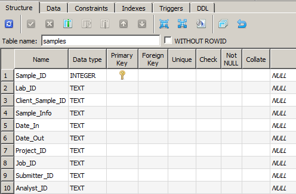
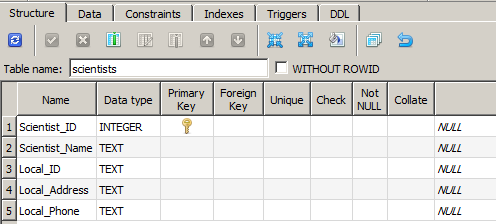
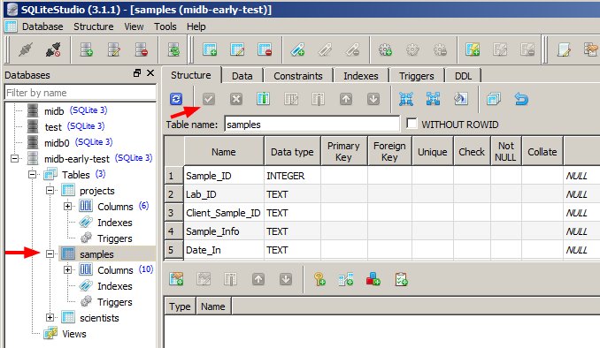
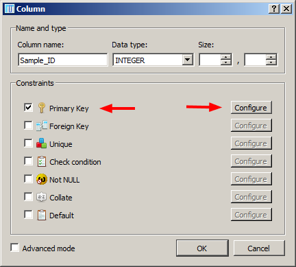
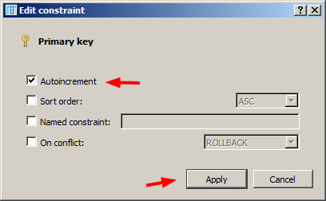

  
[Back to Index](../README.html)

# Current version of MIDB

In mid 2017, the Linux server that hosted the "Lite" **MySQL MIDB** sample
and project database was unreliable and my first thought was to get
the system working on my desktop computer. I did so only to find
that corporate WWIS had locked down the ports required to access the
database from lab computers. **Grrr...**

I had been looking at the
[Software Carpentry](https://swcarpentry.github.io/sql-novice-survey/)
database material and the videos: Parts 
[1](https://www.youtube.com/watch?v=Fw7s1qEfpn4),
[2](https://www.youtube.com/watch?v=74ADpklXo9c),
[3](https://www.youtube.com/watch?v=5u66tF5q3LA), and
[4](https://www.youtube.com/watch?v=JTN95fa_UrY).
I found them quite helpful, even though they are a bit dated (2012).

I noticed that they taught database use using **SQLite**. The advantage
of this system
is that it is **file based**. The database could exist as a file
(**midb.db**) on a network share and could be accessed from any
computer on the network. I ported the python code that accessed the
MySQL database to use SQLite.


This is a **work in progress** that I tune in my spare time and adapt to
my workflow. My goal is to follow the **Do not Repeat Yourself** (DRY)
philosophy of software development. By keeping the information in the
database up to date, I need only enter values once.

During data analysis and report generation with either a workflow
based on **R** (R 3.4.2 / Rmarkdown / Rstudio) or **python** 
(python 3.6, and Jupyter notebook) I can process the data and access
the sample information.

These are my notes and tips for the current version:

## Tools

1. [sqlite](https://www.sqlite.org/)
2. [SQLiteStudio v. 3.3.1](https://sqlitestudio.pl/index.rvt)

## Create the schema

Run sqlite from the command line to create the schema and save it
to the file `midb.db`.

```
sqlite3 midb.db
# sqlite> .schema
CREATE TABLE projects(
  "Proj_ID" int AUTO_INCREMENT,
  "Project_Code" TEXT,
  "Project_Name" TEXT,
  "Charge_No" TEXT,
  "Principal_Sci_ID" TEXT,
  "Project_Objective" TEXT
);
CREATE TABLE scientists(
  "Scientist_ID" int AUTO_INCREMENT,
  "Scientist_Name" TEXT,
  "Local_ID" TEXT,
  "Local_Address" TEXT,
  "Local_Phone" TEXT
);
CREATE TABLE samples(
  "Sample_ID" int AUTO_INCREMENT,
  "Lab_ID" TEXT,
  "Client_Sample_ID" TEXT,
  "Sample_Info" TEXT,
  "Date_In" date DEFAULT NULL,
  "Date_Out" date DEFAULT NULL,
  "Project_ID" TEXT,
  "Job_ID" TEXT,
  "Submitter_ID" TEXT,
  "Analyst_ID" TEXT
);
```

## Backup the database from the command line.

I typically work on a copy in the the
`%HOME%\Documents\work\midbSQLite3` directory. I backup like
this:

```
> sqlite3 midb.db .dump > ./2017-11-02-midb.sql
```

## Fix database schema from SQLite

If you have damaged the database, you can also use **SQLiteStudio** to
load **.csv** files from your backups. I typically do this from python
and make schema fixes from SQLiteStudio. I can get a fix to work from SQL...

See the script in

`%HOME%\Documents\work\midbSQLite3`

```
> sqlite3 midb.db < fix-midb-after-csv-import.sql
```

When you are finished, the tables should look like this:







Here is how you do it by hand... You need to check the schema as well.
I haven't figured out how to pass the schema to pandas...









## Environment variables help


It helps to use **environment variables** to specify the directory
and database paths for **MIDB_DIR** (the base directory of the database)
and **MIDB_PATH** for the path to the database file, **midb.db** file.

Use a python function like this to dump the database to a file:

```
import os
import sys
import sqlite3
import csv

midbPath = os.getenv("MIDB_PATH")
midbDir = os.getenv("MIDB_DIR")
csvDir = midbDir + "/csv"

def dumpTableToCsv(dbPath, tblName, csvPath, verbose=True):
    if(verbose):
        print(dbPath)
    con = sqlite3.connect(dbPath)
    q = "SELECT * From %s" % (tblName)
    con.row_factory=sqlite3.Row
    c = con.execute(q)
    row = c.fetchone()
    titles = row.keys()
    c.close()
    
    data = con.execute(q)
    if sys.version_info < (3,):
        f = open(csvPath, 'wb')
    else:
        f = open(csvPath, 'w', newline="")
    writer = csv.writer(f,delimiter=',')
    writer.writerow(titles)
    writer.writerows(data)
    f.close()
    data.close()
    con.close()
    print(titles)
    
tblName = "samples"
csvOut = csvDir + "/" + tblName + ".csv"
print(csvOut)
dumpTableToCsv(midbPath, tblName, csvOut, verbose=True)

tblName = "projects"
csvOut = csvDir + "/" + tblName + ".csv"
print(csvOut)
dumpTableToCsv(midbPath, tblName, csvOut, verbose=True)

tblName = "scientists"
csvOut = csvDir + "/" + tblName + ".csv"
print(csvOut)
dumpTableToCsv(midbPath, tblName, csvOut, verbose=True)
```

## Sample management script

This is my current workhorse to login and manage samples. I can get
sample information using queries from R or Python. Currently I have
R scripts that retrieve the desired sample information from the database
during report generation with R. I use Rmarkdown in RStudio for
report generation.

```
from tkinter import *
from tkinter import filedialog as fd
import sqlite3
import sys
import string
import os
import configparser

midbPath = os.environ['MIDB_PATH']

class App:
    def __init__(self,parent):
        # define the variables
        self.mVerbose = IntVar()
        # variables changed from year-to-year
        # nOffset = 5100 for 2017
        self.mOffset = 5100
        # If one deletes a record from the database, things get
        # messed up. Increment this by one. Zero when you redo the
        # database each year...
        self.mFudge = 0
        self.mStart = 'qm-0'
        self.mMidbKey = StringVar()
        self.mLabID = StringVar()
        self.mAnalyst_ID = StringVar()
        self.mClient_ID = StringVar()
        self.mProject_ID = StringVar()
        self.mJob_ID = StringVar()
        self.mClient_Sample_ID = StringVar()
        self.mSample_Info = StringVar()
        self.mDate_In = StringVar()
        self.mDate_Out = StringVar()
        self.mMessage = StringVar()
        # initialize variables
        self.mMidbKey.set("1")
        self.mMessage.set("Message")
        
        f = Frame(parent)
        f.pack(padx=15,pady=15)
        #we then create an entry widget,pack it and then 
        #create two more button widgets as children to the frame.
        self.lab0 = Label(f, text='MIDB Key')
        self.lab0.pack(side = TOP, pady=1)
        self.MidbKeyBox = Entry(f,textvariable=self.mMidbKey, width=12)
        self.MidbKeyBox.pack(side= TOP,padx=10,pady=2)
        self.lab1 = Label(f, text='Lab ID')
        self.lab1.pack(side = TOP, pady=1)
        self.LabIdBox = Entry(f,textvariable=self.mLabID, width=12)
        self.LabIdBox.pack(side= TOP,padx=10,pady=2)
            
        self.lab2 = Label(f, text='Analyst ID')
        self.lab2.pack(side = TOP, pady=1)
        self.AnalystIdBox = Entry(f,textvariable=self.mAnalyst_ID, width=12)
        self.AnalystIdBox.pack(side= TOP,padx=10,pady=2)
            
        self.lab3 = Label(f, text='Project ID')
        self.lab3.pack(side = TOP, pady=1)
        self.ProjectIdBox = Entry(f,textvariable=self.mProject_ID, width=12)
        self.ProjectIdBox.pack(side= TOP,padx=10,pady=2)
            
        self.lab4 = Label(f, text='Job ID')
        self.lab4.pack(side = TOP, pady=1)
        self.JobIdBox = Entry(f,textvariable=self.mJob_ID, width=12)
        self.JobIdBox.pack(side= TOP,padx=10,pady=2)

        self.lab5 = Label(f, text='Client ID')
        self.lab5.pack(side = TOP, pady=1)
        self.ClientIdBox = Entry(f,textvariable=self.mClient_ID, width=12)
        self.ClientIdBox.pack(side= TOP,padx=10,pady=2)
            
        self.lab6 = Label(f, text='Client Sample ID')
        self.lab6.pack(side = TOP, pady=1)
        self.ClientSampleIdBox = Entry(f,textvariable=self.mClient_Sample_ID,width=50)
        self.ClientSampleIdBox.pack(side= TOP,padx=10,pady=2)
            
        self.lab7 = Label(f, text='Sample Description')
        self.lab7.pack(side = TOP, pady=1)
        self.ClientSampleInfoBox = Entry(f,textvariable=self.mSample_Info, width=50)
        self.ClientSampleInfoBox.pack(side= TOP,padx=10,pady=2)
            
        self.lab8 = Label(f, text='Date In')
        self.lab8.pack(side = TOP, pady=1)
        self.DateInBox = Entry(f,textvariable=self.mDate_In, width=12)
        self.DateInBox.pack(side= TOP,padx=10,pady=2)
            
        self.lab9 = Label(f, text='Date Out')
        self.lab9.pack(side = TOP, pady=1)
        self.DateOutBox = Entry(f,textvariable=self.mDate_Out, width=12)
        self.DateOutBox.pack(side= TOP,padx=10,pady=2)
        
        self.cb    = Checkbutton(f, text="Debug Info", variable=self.mVerbose)
        self.cb.pack(side = TOP, pady=1)
        
            
        # message box
        self.lab10 = Label(f, text='')
        self.lab10.pack(side = TOP, pady=1)
        self.lab11 = Label(f, text='Messages')
        self.lab11.pack(side = TOP, pady=2)
        self.MessageBox = Entry(f,textvariable=self.mMessage, width=50)
        self.MessageBox.pack(side= TOP,padx=10,pady=2)
            
        # this time, we pass a number of options to the
        # constructor, as keyword arguments. The first button
        # is labeled "exit"and the second is labelled "Hello". 
        # Both buttons also take a command option. This option 
        # specifies a function, or (as in this
        # case) a bound method, which will be called when the button is clicked.
            
        self.button = Button(f, text="LogIn",command=self.log_in)
        self.button.pack(side=LEFT,padx=2,pady=10)
            
        self.button = Button(f, text="LogOut",command=self.log_out)
        self.button.pack(side=LEFT,padx=2,pady=10)
            
        self.button = Button(f, text="Query DB",command=self.query_db)
        self.button.pack(side=LEFT,padx=2,pady=10)
            
        self.button = Button(f, text="write file",command=self.write_file)
        self.button.pack(side=LEFT,padx=2,pady=10)
            
        self.button = Button(f, text="read file",command=self.read_file)
        self.button.pack(side=LEFT,padx=2,pady=10)
            
        self.button = Button(f, text="update sample",command=self.update_sample)
        self.button.pack(side=LEFT,padx=2,pady=10)

        self.exit = Button(f, text="exit", command=f.quit)
        self.exit.pack(side=LEFT,padx=2,pady=10)
        
        # pull in last data
        self.ReadLast()
        
    def log_in(self):
        strQueryCny = "SELECT count(*) FROM samples"
        cnx = sqlite3.connect(midbPath)
        curQ = cnx.cursor()
        curQ.execute(strQueryCny)
        while (1):
            x = curQ.fetchone()
            if x == None: break
            nCount = int(x[0])

            if(self.mVerbose):
                print(nCount)

            strLabID = self.mStart + str(self.mOffset + nCount + 1)
            self.mLabID.set(strLabID)
            strLogIn = (
                "INSERT INTO samples (Sample_ID, Lab_ID, "
                "Client_Sample_ID, Sample_Info, Date_In, "
                "Date_Out, Project_ID, Job_ID, Submitter_ID, "
                "Analyst_ID) VALUES (NULL, '")
            strLogIn =    strLogIn + self.mLabID.get() + "', '"
            strLogIn =    strLogIn + self.mClient_Sample_ID.get() + "', '"
            strLogIn =    strLogIn + self.mSample_Info.get() + "', '"
            strLogIn =    strLogIn + self.mDate_In.get() + "', '"
            strLogIn =    strLogIn + self.mDate_Out.get() + "', '"
            strLogIn =    strLogIn + self.mProject_ID.get() + "', '"
            strLogIn =    strLogIn + self.mJob_ID.get() + "', '"
            strLogIn =    strLogIn + self.mClient_ID.get() + "', '"
            strLogIn =    strLogIn + self.mAnalyst_ID.get() + "')"
            cursor = cnx.cursor()
            cursor.execute(strLogIn)
            cursor.execute("commit;")
            if(self.mVerbose):
                print(strLogIn)
            cursor.close()
            cursor = cnx.cursor()
            strCheck = "SELECT * FROM samples WHERE LAB_ID = '"
            strCheck = strCheck + self.mLabID.get()
            strCheck = strCheck + "'"
            cursor.execute(strCheck)
            while (1):
                row = cursor.fetchone ()
                if row == None: break
                self.mMidbKey.set(str(row[0]))
                self.mLabID.set(str(row[1]))
                self.write_last()
                strMsg = str("Logged in Lab ID " + self.mLabID.get())
                self.mMessage.set(strMsg)
        curQ.close()
        cursor.close()
        cnx.close()
        self.write_last()
        if(self.mVerbose):
            print(strCheck)

    def log_out(self):
        # strCheck = "SELECT * FROM samples WHERE LAB_ID = '%s'"
        # self.mLabID.get()
        q1 =    "SELECT * FROM samples WHERE LAB_ID = '"
        q2 = self.mLabID.get()
        query = q1 + q2 + "'"    
        cnx = sqlite3.connect(midbPath)
        cursor = cnx.cursor()
        # cursor.execute(strCheck, self.mLabID.get())
        cursor.execute(query)
        for x in cursor:
            if(self.mVerbose):
                print(x[1])
            q1 = "UPDATE samples SET Date_Out='"
            q2 = self.mDate_Out.get()
            q3 = "' WHERE Lab_ID = '"
            q4 = self.mLabID.get()
            q5 = "'"
            query = q1 + q2 + q3 + q4 + q5
            cur = cnx.cursor()
            cur.execute(query)
            q1 = "SELECT Lab_ID, Client_Sample_ID, Date_Out FROM "
            q2 = "samples WHERE Lab_ID = '"
            q3 = self.mLabID.get()
            q4 = "'"
            query = q1 + q2 + q3 + q4
            cur.execute(query)
            for y in cur:
                strMsg = str("Logged out Lab ID " + y[0])
                self.mMessage.set(strMsg)
            cursor.execute("commit;")
            cur.close()
        cursor.close()
        cnx.close()

    def update_sample(self):
        q1    = "UPDATE samples SET Client_Sample_ID='"
        q2    = self.mClient_Sample_ID.get()
        q3    = "', Sample_Info='"
        q4    = self.mSample_Info.get()
        q5    = "', Date_In='"
        q6    = self.mDate_In.get()
        q7    = "', Date_Out='"
        q8    = self.mDate_Out.get()
        q9    = "', Project_ID='"
        q10 = self.mProject_ID.get()
        q11 = "', Job_ID='"
        q12 = self.mJob_ID.get()
        q13 = "', Submitter_ID='"
        q14 = self.mClient_ID.get()
        q15 = "', Analyst_ID='"
        q16 = self.mAnalyst_ID.get()
        q17 = "' WHERE LAB_ID='"
        q18 = self.mLabID.get()
        q19 = "'"
        query = q1 + q2 + q3 + q4 + q5 + q6 + q7 + q8 + q9 + q10 + q11
        query = query + q12 + q13 + q14 + q15 + q16 + q17 + q18 + q19
        cnx = sqlite3.connect(midbPath)
        cursor = cnx.cursor()
        cursor.execute(query)
        cursor.execute("commit;")
        cursor.close()
        cnx.close()
        strMsg = str("Updated Lab ID " + self.mLabID.get())
        self.mMessage.set(strMsg)
        self.write_last()
        
    def query_db(self):
        cnx = sqlite3.connect(midbPath)
        cursor = cnx.cursor()

        q1 =    "SELECT * FROM samples WHERE LAB_ID = '"
        q2 = self.mLabID.get()
        query = q1 + q2 + "'" 
        
        if(self.mVerbose):
            print(query)
        
        cursor.execute(query)

        for x in cursor:
            self.mMidbKey.set(x[0])
            self.mLabID.set(x[1])
            self.mClient_Sample_ID.set(x[2])
            self.mSample_Info.set(x[3])
            self.mDate_In.set(x[4])
            self.mDate_Out.set(x[5])
            self.mProject_ID.set(x[6])
            self.mJob_ID.set(x[7])
            self.mClient_ID.set(x[8])
            self.mAnalyst_ID.set(x[9])
        cursor.close()
        cnx.close()


    def write_file(self):
        strOutFile = fd.asksaveasfilename(initialdir='/data/midb/',
                                          filetypes= [("ini files",
                                                       "*.ini")])
        if strOutFile    == "": return
        config = configparser.ConfigParser()
        config.add_section('LAST')
        config['LAST']['mVerbose'] = str(self.mVerbose.get())
        config['LAST']['mMidbKey'] = self.mMidbKey.get()
        config['LAST']['mLabID'] = self.mLabID.get()
        config['LAST']['mClient_Sample_ID'] = self.mClient_Sample_ID.get()
        config['LAST']['mSample_Info'] = self.mSample_Info.get()
        config['LAST']['mDate_In'] = self.mDate_In.get()
        config['LAST']['mDate_Out'] = self.mDate_Out.get()
        config['LAST']['mProject_ID'] = self.mProject_ID.get()
        config['LAST']['mJob_ID'] = self.mJob_ID.get()
        config['LAST']['mClient_ID'] = self.mClient_ID.get()
        config['LAST']['mAnalyst_ID'] = self.mAnalyst_ID.get()
        with open(strOutFile, 'w') as configfile:        # save
            config.write(configfile)

    def write_last(self):
        strFile = '/data/midb/last_sample.ini'
        config = configparser.ConfigParser()
        config.add_section('LAST')
        config['LAST']['mVerbose'] = str(self.mVerbose.get())
        config['LAST']['mMidbKey'] = self.mMidbKey.get()
        config['LAST']['mLabID'] = self.mLabID.get()
        config['LAST']['mClient_Sample_ID'] = self.mClient_Sample_ID.get()
        config['LAST']['mSample_Info'] = self.mSample_Info.get()
        config['LAST']['mDate_In'] = self.mDate_In.get()
        config['LAST']['mDate_Out'] = self.mDate_Out.get()
        config['LAST']['mProject_ID'] = self.mProject_ID.get()
        config['LAST']['mJob_ID'] = self.mJob_ID.get()
        config['LAST']['mClient_ID'] = self.mClient_ID.get()
        config['LAST']['mAnalyst_ID'] = self.mAnalyst_ID.get()
        with open(strFile, 'w') as configfile:        # save
            config.write(configfile)

    def read_file(self):
        self.mMessage.set("")
        strInFile = fd.askopenfilename(initialdir='/data/midb',
                                       filetypes= [("ini files",
                                                     "*.ini")])
        if strInFile    == "": return
        config = configparser.ConfigParser()
        config.read(strInFile)
        self.mVerbose.set(int(config['LAST']['mVerbose']))
        self.mMidbKey.set(config['LAST']['mMidbKey'])
        self.mLabID.set(config['LAST']['mLabID'])
        self.mClient_Sample_ID.set(config['LAST']['mClient_Sample_ID'])
        self.mSample_Info.set(config['LAST']['mSample_Info'])
        self.mDate_In.set(config['LAST']['mDate_In'])
        self.mDate_Out.set(config['LAST']['mDate_Out'])
        self.mProject_ID.set(config['LAST']['mProject_ID'])
        self.mJob_ID.set(config['LAST']['mJob_ID'])
        self.mClient_ID.set(config['LAST']['mClient_ID'])
        self.mAnalyst_ID.set(config['LAST']['mAnalyst_ID'])

    def ReadLast(self):
        self.mMessage.set("")
        strFile = '/data/midb/last_sample.ini'
        config = configparser.ConfigParser()
        config.read(strFile)
        self.mVerbose.set(int(config['LAST']['mVerbose']))
        self.mMidbKey.set(config['LAST']['mMidbKey'])
        self.mLabID.set(config['LAST']['mLabID'])
        self.mClient_Sample_ID.set(config['LAST']['mClient_Sample_ID'])
        self.mSample_Info.set(config['LAST']['mSample_Info'])
        self.mDate_In.set(config['LAST']['mDate_In'])
        self.mDate_Out.set(config['LAST']['mDate_Out'])
        self.mProject_ID.set(config['LAST']['mProject_ID'])
        self.mJob_ID.set(config['LAST']['mJob_ID'])
        self.mClient_ID.set(config['LAST']['mClient_ID'])
        self.mAnalyst_ID.set(config['LAST']['mAnalyst_ID'])
    
root = Tk()
root.title('MIDB Sqlite3 Sample Manager v. 0.18.0')
app = App(root)

root.mainloop()
```

# Legacy MySQL version of MIDB

By 2006, J. Minter was the last user of "QCM" instance of the OneLims
database. My workflow needed access to the database for productive
management of sample information. Starting in 2006 I developed a lite
sample and project management system using MySQL. I named this MIDB,
since I was managing microscopy sample and project information.

These are tips on setting up the MySQL version of `midb`.

I will represent my favorite password with `my_pw`

```
GRANT ALL PRIVILEGES ON *.* TO 'jrminter'@'%' IDENTIFIED BY 'my_pw' WITH GRANT OPTION;
GRANT ALL PRIVILEGES ON *.* TO 'jrminter'@'localhost' IDENTIFIED BY 'my_pw' WITH GRANT OPTION;
commit;
create database midb;
GRANT ALL ON midb.* TO 'jrminter'@'%';
commit;
```

Older

```
// Create the midb database
parrot 2: mysql -h localhost -u root -p
(pw)
mysql> create database midb;
mysql> GRANT ALL ON midb.* TO 'jrminter'@'%';
mysql> commit;
mysql> quit;

cryo 3: mysql -h localhost -u jrminter -p
Enter password:

mysql> SHOW DATABASES;
mysql> use midb;
mysql> SHOW TABLES;

can do the rest in python...

mysqldump -u root -p  midb > midb.sql

restore

mysql -u root -p midb < midb.sql


mysqldump -u jrminter -p --opt midb projects > projects.sql

mysql -u jrminter -p midb < samples.sql

```

# The original version of MIDB

The **Microscopy Image Database** (MIDB) was a project in the Kodak
Analytical Technology Division that was developed in the late 1990s
that stored images and sample information in an Oracle SQL database.
The plan was initially conceived by Bruce Newell and the key
developers were Dan Adams and Dan Gaffney. The goal was to store
images and results from quantitative microscopy analyses, such as 
particle size distributions from imaging of silver halide particles.

From a microscopist/analyst perspective, the strongest point of the
system was the ability to programatically access sample information
and reports by analysts in our sizing and report generation workflow.

This system mothballed in 2002 and J. Minter was the last remaining
user and owner of the system. The system was partially replaced by
the OneLims system. The ability for the users to access the database
from our workflow software was lost. The Quantitative Colloid Microscopy
group used the OneLims system from 2002 until mid 2006.


[Back to Index](../README.html)
