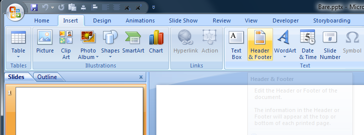
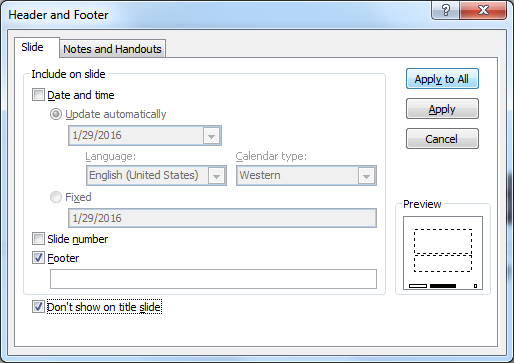

[Back to Index](../README.html)

These are John Minter's tips for MS Office.
They were compiled from several web sources.

# Excel

A VBA macro to convert selected dates to ISO format

```
Sub toIsoDate()
'
' Convert the selected data to the ISO date format
'
    Selection.NumberFormat = "yyyy-mm-dd;@"
End Sub

```

# Excel charts

I really find it annoying to do scatter plots in Excel when the data is separated columnns. One I get one right and need different ranges of rows (like diameter data for different classes) then the text editor is my friend. I needed multiple ranges likey and discovered:


```
=SERIES('qm-05111'!$G$1,'qm-05111'!$B$2:$B$11,'qm-05111'!$G$2:$G$11,1)

=SERIES('qm-05111'!$H$1,'qm-05111'!$B$2:$B$11,'qm-05111'!$H$2:$H$11,1)


=SERIES('qm-05111'!$G$1,'qm-05111'!$B$12:$B$20,'qm-05111'!$G$12:$G$20,1)

=SERIES('qm-05111'!$H$1,'qm-05111'!$B$12:$B$20,'qm-05111'!$H$12:$H$20,1)


=SERIES('qm-05111'!$G$1,'qm-05111'!$B$12:$B$20,'qm-05111'!$G$21:$G$30,1)

=SERIES('qm-05111'!$H$1,'qm-05111'!$B$12:$B$20,'qm-05111'!$H$21:$H$30,1)

```

# Skype for Business

How do I use Skype for Business? 
  
Click [here](https://www.youtube.com/watch?v=7_c4zVJ739M&feature=youtu.be) to watch a Skype for Business: Step-by-step guide for new users 
  
Some additional Training videos:   
  
Click [here](https://www.youtube.com/watch?v=qVq7A7nS_TQ&feature=youtu.be&list=PLH5ElbTc1hWQirKampULE7vlfTbhSqssq) for a video Introducing Skype for Business 
  
Click [here](https://www.youtube.com/watch?v=eCIGpbukmow&feature=youtu.be&list=PLH5ElbTc1hWQirKampULE7vlfTbhSqssq) to see how to add a contact in Skype for Business 
  
Click [here](https://youtu.be/oEBQgOgAtnk?list=PLH5ElbTc1hWQirKampULE7vlfTbhSqssq) for a video on Presence and IM in Skype for Business 
  
Click [here](https://youtu.be/i9ubU-ndMZE?list=PLH5ElbTc1hWQirKampULE7vlfTbhSqssq) to see how to Meet and share using Skype for Business 
  
Click [here](https://youtu.be/XNuIQks8kuk?list=PLH5ElbTc1hWQirKampULE7vlfTbhSqssq) to see how to schedule a Skype for Business meeting


# Outlook

I have had problems with links with spaces. The key is to surround the
link with what
[Microsoft](https://support.office.com/en-ie/article/Add-links-containing-spaces-to-an-e-mail-message-65e3086b-8f1c-4e4c-88ab-7489b3c823b1)
calls `chevrons`. See the example below

```
<\\ekc1\fs1\My Project\@Weekly Meeting\+2015 Characterization Meeting Agenda>
```

# PowerPoint

# Footers don't show up

From [Holly Green](http://blogs.mccombs.utexas.edu/the-most/2012/06/04/when-the-slide-number-doesnt-show-in-powerpoint/)

If you're working in PowerPoint, and you want the slide number to display on the slide, the process is generally simple:

1. Go to the Insert tab.
2. Click the Slide Number button.
3. On the Slide tab, check the Slide Number box.
4. Click Apply to All to make the slide number show on all slides, or Apply to make the slide number show on just the current slide.

**JRM note:** This caused me major annoyance in later versions of PowerPoint.

In later versions one also needs to go to the `Insert` menu and select `Header & Footer`.

<center></center>

This produces a dialog box, where one chooses how to apply the slide numbers.

<center></center>


# Template location

On Win7 ``C:\Users\jrminter\AppData\Roaming\Microsoft\Templates``


[Back to Index](../README.html)