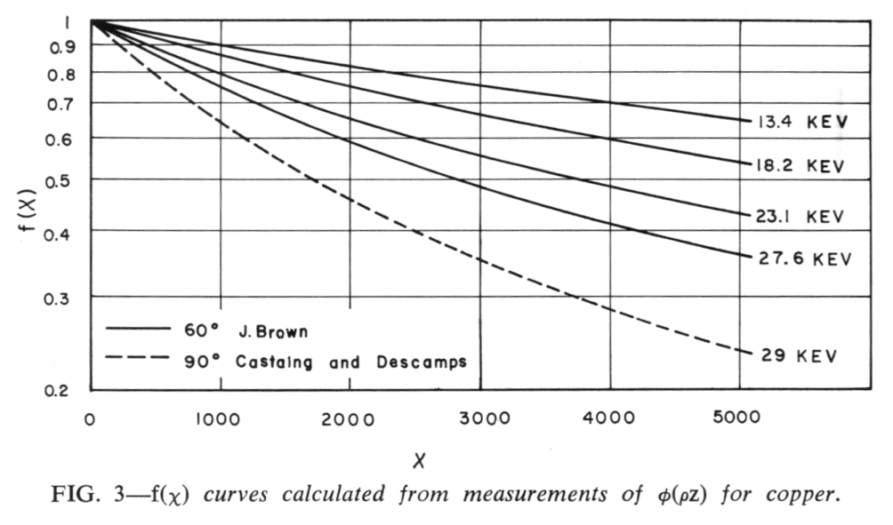
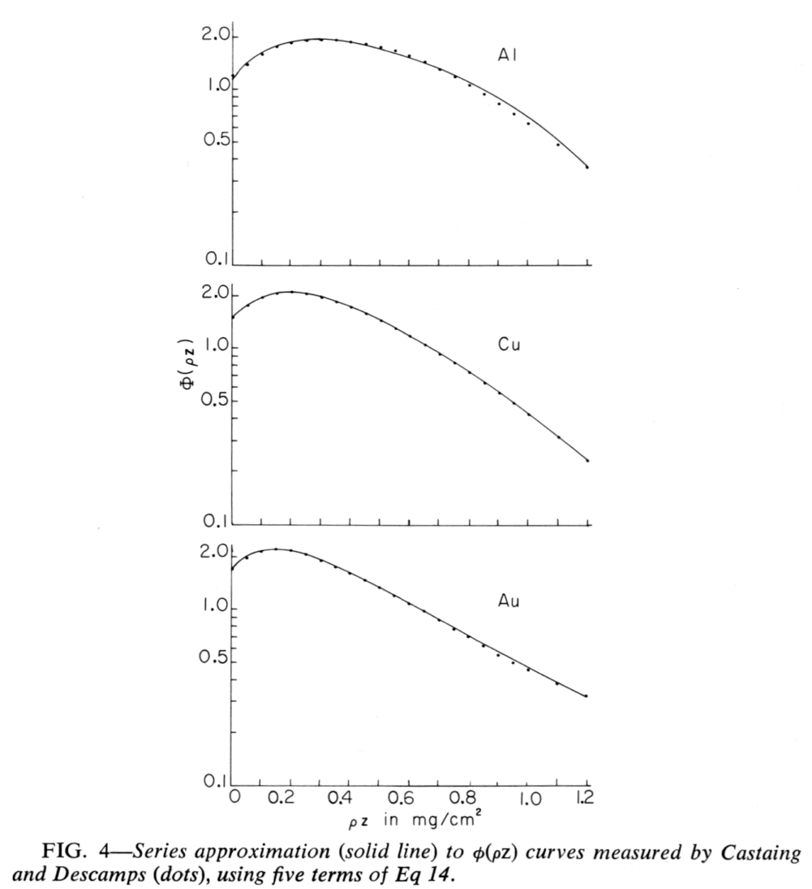

[Back to Index](../README.html)

```{r setup, include=FALSE}
knitr::opts_chunk$set(echo = TRUE)
```

# Introduction

This document contains notes on the $\phi (\rho z)$ approach to quantification
of x-ray microanalysis.

# Notes from J.W. Criss (1968)

These notes are extracted from pages 291-306 from J. W. Criss,
"**Progress in Quantitative Electron Probe Microanalysis**,"
*Fifty Years of Progress in Metallogaphic Techniques, ASTM STP 430*,
Am. Soc. Testing Mats., pp 291-314.


p. 300

Measurements of $\phi (\rho z)$ -Castaing and Descamps [j6], in 1955, used
a sandwich-sample technique to measure a relative ¢(pz), the ratio of the
X-ray generation in a layer at depth z to the X-ray generation in an identical,
but isolated, layer at the surface.

Tracer layers of copper, zinc, and bismuth were used in specimens of aluminum,
copper, and gold, respectively, with a probe voltage of 29 kV. Recently, J. D.
Brown [13] used the same technique to measure a relative $\phi(\rho z)$
for copper at 13.4, 18.2, 23.1, and 27.6 kV. Figure 3 shows the $\phi(\rho z)$
curves that result.





# Mathematical  Representation of $\phi(\rho z)$

The absorption function, $f(\chi)$, is obtained from measured $\phi(\rho z)$
curves via Eq 8,

$$ f_{mn}(\chi_{mn}) = \int_{0}^{\infty} \phi(\rho z) exp(-\chi_mn \rho z) d(\rho z) ) $$


either by numerical integration or by closed form integration after
$\phi(\rho z)$ is represented mathematically.

In the case of secondary fluorescence, it is particularly
desirable to express $\phi(\rho z)$ by a suitable mathematical expression.

Wittry [11] suggested the series

$$ \phi(\rho z) = \sum_{n=0}^{\infty} [ a_n \ { exp [-b ( \rho z - \rho z_0 )] - 1 }^{2n}] ... $$ (19)


where $\rho z_0$ is the value of $\rho z$ at which the maximum in $\phi$ occurs.

He obtained good fits to experimental curves using the first two terms of the
series and the condition that $\phi(\infty) = 0$ :

$$ \phi(\rho z) = a_0 - a_0{exp[-b(\rho z - \rho z_0)]- 1}^2 ...$$ (20)


Criss and Birks [12] obtained good agreement with the measured curves
of Castaing and Descamps (Fig. 4), using Eq 14.





**Theoretical Expression for $f(\chi)$ ** - Philibert [17], in his theoretical
treatment, assumed that the number of electrons traveling downward at any depth
followed the Lenard law, with the Lenard coefficient depending on only the
electron beam voltage. A factor which accounted for the effect of scattering was
assumed to vary with depth according to a simple exponential law. Moreover, the
ionization cross section was assumed to be constant (with depth) for a given
shell of the element excited. Further simplification led to

$$f(\chi) = \frac{1+h}{(1 + {x / \sigma})[1 + h (1 + \frac{\chi}{\sigma})]}$$ (21)


where $\sigma$ is the Lenard coefficient, and 

$$h = 1.2 \times \frac{<A>}{<Z>^2}$$

where $<A>$ and $<Z>$  being average atomic weight and average atomic number.


The assumptions made in Philibert's treatment cause $h$ and $a$ to lose some of
their physical meaning, especially since these parameters were adjusted to
make $f(\chi)$ fit results from the measurements of Castaing and Descamps [16].

Nevertheless, this method has been found useful for a wide range of elements.
Philibert's expression becomes less accurate as the electron voltage $E_o$ 
approaches $E_k$, the excitation potential for the measured characteristic line.

Duncumb and Shields [41] suggest that excellent agreement with Green's measured
$f(\chi)$  curves [19] would be obtained if Philibert's $\sigma$ were changed to

$$ \sigma = \frac{2.38 \times 10^5}{E^1.5_0 - E^1.5_k} $$
where $E_o$ and $E_k$ are in kilovolts.


Belk [2J] further simplified Philibert's equation for $f(\chi)$ and established
criteria for the error in his expression to be within given limits.
This simplification might be useful for rapid hand calculation, when great
accuracy is not needed.


[Back to Index](../README.html)