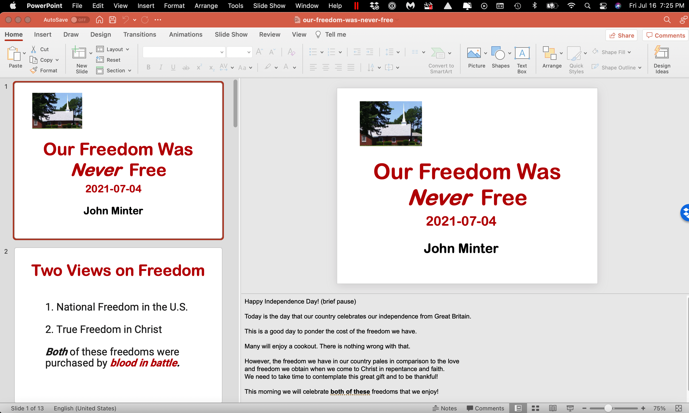

[Back to Index](../README.html)

```{r setup, include=FALSE}
knitr::opts_chunk$set(echo = TRUE)
library(knitr)

```



1. The slide deck is in the left panel.

2. The active slide in the top right hand panel.

3. From the top menu 

3. The speaker notes are in the bottom right. Note that
the speaker can  scroll down the notes. In tend to keep a
slide to a single topic.

4. To start a slide show 


[Back to Index](../README.html)