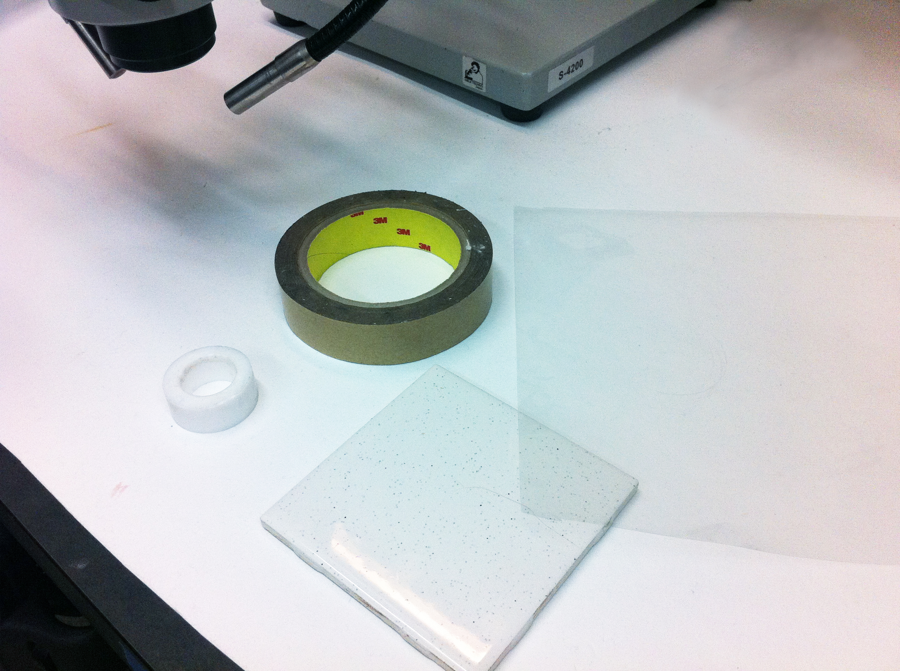
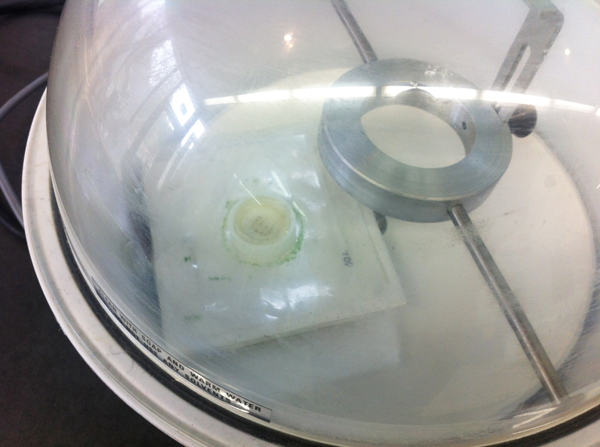
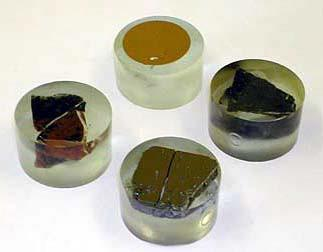
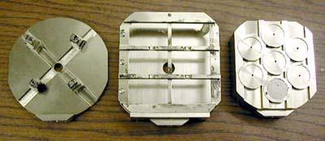
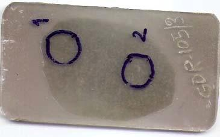
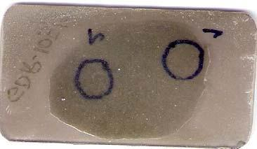

[Back to Index](../README.html)

```{r setup, include=FALSE}
knitr::opts_chunk$set(echo = TRUE)
```

# Tips from the **Probe Software Forum**

## Make a thin section without equipment

From [here](http://probesoftware.com/smf/index.php?topic=169)

**Philipp Poeml** asked:

> I have some terribly radioactive material from the Chernobyl accident.
> It is a silicate melt that formed from the molten core and structural
> materials from the building. To do a thin section of this stuff would
> be absolutely mega cool.
> 
> How can I make a thin section with the least possible equipment? Like,
> manually, by hand? I think that should be possible. I can introduce
> certain things into that glovebox (which are contaminated and lost
> then) so I want to minimize waste, cost, and so on.

**John Donovan** answered:

> Seriously, I made hundreds of thin sections by hand at UCB when I was investigating blueschist minerals about 20 years ago. 
>
> I used SiC and Al~2~O~3~ powders on glass plates with water for the grinding and polishing. The only thing I used a mechanical device for that would have been difficult by hand is the thin section cutoff operation, after the "chip" is glued to the slide, to get it roughly 1 mm thick prior to hand grinding.

In reply, "Probeman" notes:

> The glass plates are just for a flat surface that can be rinsed easily to remove the grinding/polishing material from the previous steps. **The key is to use your finger pressure on the back of the glass to increase the grinding action on various areas of the thin section glass (which will bend very, very slightly to allow this) to bring the thickness down evenly over the whole section, given that different hardness materials are often in the same section.**
> 
> To judge the thickness of the section one would normally use a petrographic microscope, however, this device here which we use, is much easier for all hand thin section grinding because one can see the crossed polarizer view from arms length!


[Andrew Mott](http://probesoftware.com/smf/index.php?topic=580.msg3310#msg3310) posed the following question that produced helpful answers (below).

> Does anyone have a particular company they would recommend when it comes to diamond polish? I'm looking to purchase some 1, 6, and 9 um suspension/slurry. Also, has anyone here experimented with mono-crystalline vs poly-crystalline products - is there a significant difference in the final polish?

**Owen Neill** notes:

> I've had a lot of success with the Buehler MetaDI diamond suspensions. They're kind of expensive, so there may be a "generic" brand knock-off out there, but they work very well. 
> 
> Never experimented with the mono- vs. polycrystalline thing, but I can't imagine there would be much difference unless the polycrystalline grit breaks down faster over time. 


**Malcolm Roberts** notes:

> I use the Struers stuff myself. I buff my standards on a stack of filter paper and find the buehler stuff destroys the filter paper faster than the struers. My experiences over the years have pointed to no significant differences in the performance between brands. However, delving deep into the dark recesses of my memory makes me recall that the best polishing I ever got was using diamond pastes rather than slurries on laps lubricated with meths... (**JM note** methanol?)

## Clean and repolish standards

From [here](http://probesoftware.com/smf/index.php?topic=741.0):

**Nick Bulloss** asked: 

> I have a few standard blocks (mineral and pure elements) that need to be re-polished, cleaned and carbon coated. What polishing and cleaning methods have worked best for people? I had a suggestion of 1um diamond suspension for polishing (Peter McSwiggen). How do you best clean samples/standards without leaving any residue?

**Dan MacDonald** responded:

> I have tried a 0.25 micron aluminum oxide suspension on a fine silk lap and had fairly good results, after which I ultra-sonicate the standard block for several minutes and finish with a light rinse with methanol.  This method seems to work well with silicate mounts, but it isn't necessarily the best method for metal standards (especially Ti and Mg).  I am running into the same issues as you are with metal standards (e.g., the JEOL metals block), having tried methanol or ethanol as a suspension and rinsing agent.  Using an organic that is too reactive towards epoxy-based mounts can be disastrous, so it is best to try some of the solvent on the back side of the standard block first, to see if the solvent softens the epoxy at all.  One method I am toying with is using a dry-polish method using fine lapping films from [Lee Valley](http://www.leevalley.com/en/wood/page.aspx?p=68943&cat=1,43072) - they have 0.5 and 0.1 um diamond lapping film  .  I think this would work well, and I am going to give it a try with a standard mount that I don't use anymore.  I use this type of film to polish my hand-carving tools at home. 


**Concrete** can be a problem.
[Owen Neil](http://probesoftware.com/smf/index.php?topic=800.0) asked:

> I was wondering if anyone out there had experience with polishing cement/concrete. To my knowledge, the concrete we are trying to polish is a typical mix of Portland-type cement and mineral aggregates (mostly quartz and feldspar, although EDS suggests there are other minerals present as well). 
> 
> So far, we have tried alumina, diamond, and SiC polishing compound, on paper and felt/cloth pads with a variety of naps, using both oil or H2O as lubricants. The problem we've encountered with every attempt so far is that minerals polish well, but the cement matrix does not polish at all, and the cement matrix is what my customers are interested in both imaging (at fine scales, looking for features unfortunately similar to polish marks) and probing. Any advice would be much appreciated.

**Probeman** replied:

> The world's expert (that I know of) on preparing/polishing cement or concrete samples is Tim Teague at UCB.
> 
> But at the UofO we've run a number of cement samples for ODOT for EPMA and EBSD and the only method we found that works is to do a final polish with colloidial silica or alumina on a Vibropolisher lap with some weight on the sample.
> 
> This not only gives an excellent flat smooth surface for EPMA but even for EBSD.

He also noted:

> We only use colloidal alumina nowadays.  In think we found it works better on most materials.

## Polish ater soluble samples

A [question](http://probesoftware.com/smf/index.php?topic=993.0)
was asked about how to polish water-soluble specimens.

**Probeman** responded:

> I learned from Tim Teague at UC Berkeley many years ago that the sharp
> edge of epoxy around the edges of a polished grain can be eaten away
> (at microscopic levels) by isopropyl alcohol (and even worse is
> acetone), but that pure (*undenatured*) 190 proof ethanol works
> excellently and does not damage epoxy.  The concern being that the
> conductive coating might not "bridge" the "moat" you describe above.
>
> I also remember him telling me
> 
>> Always rub the excess ethanol off with a KimWipe (lint free and non
>> scratching) until the surface is
>> dry".
>
> The idea being, I think, that if one allows the ethanol to dry by
> evaporation, the dissolved residues will be left deposited on the
> surface.
>
> But it further occurs to me that Tim Teague's slow RPM oil based
> polishing methods would be better for prepping such water soluble
> materials as you mentioned above, but that's about all I know on that
> subject.  Could one use hexane as a polishing lubricant for water
> sensitive materials I wonder?

**Anette von der Handt** also replied:

> We have people dealing with water-soluble samples (carbonates and
> carbonatites) and they simply polish their samples dry with diamond
> powder on a soft polishing cloth.
> 
> I also know that people have good results by polishing with petroleum
> ether as the lubricant.

# Tips from the UMASS Geology Microprobe lab (Michael Jercinovic)

## For Petrographic thin sections or polished sections:

1. Use mounting epoxy with low vapor pressure
	 - Buehler Epoxide, Epo-thin
	 - Petropoxy 154
	 - Struers EpoFix		

2. Important to polish surface flat (minimum relief)
      - Flatness generally achieved with diamond polishing on low-nap cloths

3. Eliminate visible scratches and pits if possible
	 - High polish: 0.3-0.05 μm 
	 - Generally finish with alumina – low nap
	 - Can use colloidal silica polishing (chemical-mechanical,essential for EBSD)

## Electron Microprobe Samples (thick samples)

1. Generally encapsulated in low vapor pressure, hard-curing epoxy
  - Buehler Epo-Thin
  - Struers EpoFix, SpeciFix(can use conductive fillers)
  - cut, and polished as above
  - Porous materials can be vacuum-impregnated with low-viscosity epoxy
  
## Cleaning

All samples should be as clean and dry as possible

  1. 2-stage ultrasonic cleaning in clean water followed by isopropyl alcohol preferable
  2. Quick acetone rinse
  3. Final rinse in methanol, be sure there is no residue 		(use lint-free cloth)
  4. Dry in oven, on hot plate, or in vacuum


	


# Tips from the UCLA/Getty Conservation Program

This document is archived from [UCLA/Getty Conservation Program](https://uclagettyprogram.wordpress.com/2014/03/29/mounting-small-samples/). It may be helpful for sample preparation for EDS. The original author was **Vanessa Muros**, Conservation Specialist, UCLA/Getty Program. It was published on 2014-04-29.

We are all aware of how difficult it is to be able to take a sample from an artifact (both permission-wise and logistically) and when we need to, more often than not, the samples we take are extremely small.  Once we have our precious sample, we try to use as many examination and analytical techniques we can that are non-destructive to get the greatest amount of information from that one sample.  We may reach the point, however, where we need to use an analytical technique that may require the sample to be mounted, cut up or consumed, and we need to find ways to have the samples extend as far as possible through all the stages of investigation.

In our lab, we’ve been working on several projects (focusing on Egyptian blue pigments, as well as archaeological glass from the Mediterranean and China) that require taking very small samples from archaeological objects. Most of us are at the stage in our research that require the samples to be mounted in epoxy and polished for various types of instrumental analysis.  Because we can only take very small samples (about a few millimeters in size) and we need to use several techniques (SEM-EDS, EPMA, SIMS, Raman), we’ve been trying to figure out the best way to prepare our samples so that they can be used for all the techniques that will be applied.   Since the analytical methods we want to use will all work on polished samples mounted in resin blocks, we decided to try and mount the samples this way. In order to make it easier and faster to analyze several mounted samples, we decided to place several of our samples in the same resin block.  Arranging the samples all in one mount, documenting them in a way so you know which sample is which and embedding and polishing them successfully is challenging enough. When you are mounting 10-16 samples, about a few mm wide, in a 1 inch diameter sample holder, it’s even more difficult!

Before you start, it’s good to have all the supplies you need out at your work area, along with your samples. Using a binocular microscope is key to mounting such small samples. The materials/supplies we had for mounting our samples were: 

- **the sample holder** (we embedded our samples in 1 inch diameter disc of epoxy resin and used a Teflon ring cut from a longer Teflon tube) as our sample holder
- **tweezers**
- **double-sided tape** (at least 1 inch wide)
- **Mylar** (2-3 mil polyester film),
- **a pen**
- **small, hard portable, surface for mounting** (we used a small tile or piece of glass).

Steady hands of course are essential.  No sneezing is allowed, and holding your breath for a bit may also be helpful when dealing with such small samples.  Of course don’t forget to eventually breathe-just not on your samples!.



Once we had our supplies and samples at the microscope, we did the following:

1. We took our hard portable surface (in this case a small tile) and attached a piece of Mylar to the top of the tile using double sided tape.  The Mylar will act as a barrier and prevent the epoxy we use for mounting from adhering to the tile (if not it will be impossible to remove the mounted samples from the surface of the tile).
2. In the center of the Mylar covered tile, we placed 2 pieces of double sided tape, making sure the taped area was larger than 1 inch in diameter.  The tape will be used to hold the samples (and then the Teflon ring) in place during mounting.
3. We took the Teflon ring and placed it over the two pieces of tape and drew a line to mark the interior diameter.  This would help guide us in placing our samples on the tape, making sure they are positioned in the center of the ring.


Now it’s time to take your samples and place them on the double sided tape.  Since we’re going to mount several samples, we placed our in rows, and tried to position them so they would fall within the center of the Teflon ring when mounted.  We marked the top of the Mylar to indicate orientation.  We also took notes and made a drawing to map where we were positioning the samples. Because some of the analysis we will be conducting will require quantitative analysis and the use of standards, we mounted small samples taken from a set of Corning Museum glass standards (A-D) we had in the lab along side our archaeological samples.


Once we placed all our samples on the tape, we positioned the Teflon ring around them, on the guide lines we drew earlier.  Because the ring is made of Teflon, we don’t need to add any release agent because the epoxy resin won’t stick to it.


Now we’re ready to mix up and pour in the epoxy resin to embed the samples.  **We use Struer’s Epofix epoxy resin for mounting**.

Even though the Teflon ring is well adhered to the double sided tape, there is the possibility that some of the resin might leak out from the bottom edge of the ring.  One way to avoid this is to seal the bottom edge of the Teflon ring.

A couple things we’ve tried are:

- putting tape along the bottom exterior edge of the Teflon ring  (in the image above we used blue masking tape)
- putting plasticine or modeling clay along the bottom edge
- or sealing the exterior bottom edge with latex (This is the one that worked best for me.  I brushed Latex #74 molding compound from Douglas and Sturgess around the bottom edge.  Once the latex was set, I mixed together the epoxy resin and poured it into the ring and.... no leaks!)

When embedding our samples in resin, **we like to put them in a vacuum chamber after pouring in the epoxy to remove any air from the resin and the pores of our samples.**  This will ensure the samples are completely impregnated with epoxy.  This is particularly important with porous samples, such as some of the very weathered glass samples I was going to analyze.





After the epoxy cures, the pressure is released from the vacuum and the tile/ring/mounted samples removed.


The Teflon ring can now be lifted off the Mylar and the mounted samples removed from the ring.  The final step is to polish the samples. **We start off with very fine grit sand paper (ranging from 600-1200 grit)** and **finish with [Buehler MetaDi Diamond polishing suspension](https://shop.buehler.com/consumables/grinding-polishing/diamond-polishing-suspension-paste/metadi-diamond-suspensions-pastes)**, first with **6 micron suspension** followed by polishing with the **1 micron suspension** as the final step. We want to make sure that the samples are exposed and that there are no scratches on the surface.


Once the mounted samples are polished, they are ready to be analyzed.


Having to mount numerous small samples together is tricky, but having all these samples in the same mount, plus the standards, will certainly save time during analysis!

# Tips on mounting/polishing from Indian Government EPMA Lab

From: The Indian Government EPMA lab [portal.gsi.gov.in]([http://www.portal.gsi.gov.in/gsiDoc/pub/updated%20sop%20for%20epma%20lab%202014.pdf)

EPMA requires preparation of flat well-polished epoxy mounted
sections. A brief protocol is provided here:

1. Nearly any solid material can be analyzed. In most cases, samples are prepared as standard-size thin–polished sections, 46-48 mm in length and 25 mm width and 1 mm thick. The solid blocks should be 25 mm in diameter (inner circle) and should not be more than 15 mm thick. It must be perfectly rounded and may be mounted either in bakelite or in PVC. Rectangular sections of rock or similar materials are most often prepared as 30-micron-thick sections without cover slips. Alternatively, 1-inch 3 cores can be polished. Chips or grains can be mounted in epoxy disks, then polished half way through to expose a cross-section of the material.




2. The most critical step prior to analysis is giving the sample a fine polish so that surface imperfections do not interfere with electron-sample interactions. This is particularly important for samples containing minerals with different hardness; polishing should yield a flat surface of uniform smoothness (see polishing instructions below). Good polish means good results.

3. Most silicate minerals are electrical insulators. Directing an electron beam at the sample can lead to electrical charging of the sample, which must be dissipated. Prior to analysis, samples are typically coated with a thin film of a conducting material (carbon, gold and aluminum are most common) by means of evaporative deposition. Once samples are placed in a holder, the coated sample surface must be put in electrical contact with the holder (typically done with a conductive paint or tape). Choice of coating depends on the type of analysis to be done; for example, most EPMA chemical analysis is done on samples coated by C, which is thin and light enough that interference with the electron beam and emitted X-rays is minimal. Samples are loaded into the sample chamber via a vacuum interlock and mounted on the sample holders The sample chamber is then pumped to obtain a high vacuum.



5. To begin a microprobe session, suitable analytical conditions must be selected, such as accelerating voltage and electron beam current, and the electron beam must be properly focused. If quantitative analyses are planned, the instrument first must be standardized for the elements desired.

The steps followed for Sample preparation are

Stage 1: After finishing with 1000-mesh carborundum powder, start polishing with chrome oxide for about 30 minutes. During polishing, sample should be checked intermittently and depending upon the condition of the, if required, timing should be reduced.

Stage 2: Polish with 6-micron diamond paste (DP) for 20 minutes.

Stage 3: Polish with 3-micron DP for 20 minutes.

Stage 4: Polish with 1-micron DP for 20 minutes

Stage 5: Finally polish with 1⁄4 micron DP for 5 minutes.

After each stage wash the slide thoroughly. Use separate cloth for each stage. However the above steps are suitable for fresh and hard rocks. Depending on the nature of sample, the polishing time should be reduced.

## Pre-AnalysisStudies:

Detailed petrographic study of the thin sections or polished stubs to be carried out to define the objectives of the study. For P-T estimates, mineral assemblage in equilibrium is to be identified and marked with colored circles on the backside of the slide using OHP markers. Reaction textures, the reacting minerals and the products provide useful information on the petrogenesis and metamorphic evolution and need to be demarcated for microanalysis. Unidentified phases, zoned grains, accessory minerals and minute inclusions should also be carefully studied and marked for analysis





After petrographic study, the thin sections are carbon coated in the separate carbon coating units for better conductivity. The thickness of coating may be around 20 nm.


[Back to Index](../README.html)