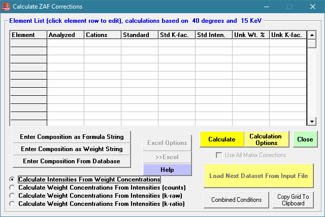

[Back to Index](../README.html)

```{r setup, include=FALSE}
knitr::opts_chunk$set(echo = TRUE)
```

Probe for EPMA is a commercial EPMA software package with demo packages,
especially CalcZAF. I have long term interest. 

# Getting started

There is a good [Getting Started with CalcZAF](http://probesoftware.com/smf/index.php?topic=81.msg292#msg292)
by John Donovan on the Probe Software Forum.


**Getting help**: Access the the Probe for EPMA User Reference manual by hitting the **F1** key in CalcZAF. **Note:** Win 10 does **not** support
the old style **.hlp** files. The easiest thing to do is to copy
**win32help.exe** from an old WinXP box to someplace in your path.
**Caution:** these .hlp files are not secure, so only use files from
sources you trust.

# Calculation options

Note the main CalcZAF screen layout below.



Note that one can write input files (.dat) for each of these modes.
Examples are shown below. Note that **each** of these assumes the
example is the **first entry** in the **.dat** file (hence the first 0).

## Key definitions

CalcZAF and Probe for EPMA use several versions of **k-factors**.
Happily, they provide some succinct definitions:


and finally...


## Basic Input - Pseudo Code example

First some hints:

Note 1:

```
CalcMode% = 0 for calculation of k-ratios from concentrations
CalcMode% = 1 for calculation of concentrations from unknown and standard intensities
CalcMode% = 2 for calculation of concentrations from "raw" k-ratios (no standard intensities necessary)
CalcMode% = 3 for calculation of concentrations from "normalized" k-ratios (no standards necessary)
```

Note 2:

```
OxideorElemental%=1 calculate oxide output based on stoichiometry
OxideorElemental%=2 calculate as elemental output (default)
```


**Note 3:** all strings (element symbols, etc.) must be in double
quotes, elements not analyzed (specified concentrations or calculated)
are indicated by a blank (empty double quotes) x-ray line string. If
the element is a specified concentration, be sure to give the
concentration in elemental weight percent for the
`"ElmPercents!(I%)"` parameter and leave the count intensity
fields zero.


**Now the pseudo code...**

```
' Read calculation mode (0, 1, 2, or 3), number of elements, 
' kilovolts and takeoff, (optional sample name)
Input #3, CalcMode%, LastChan%, Kilovolts!, Takeoff!, (SampleName$)


' Read oxide/elemental mode, difference, stoichiometry, relative
Input #3, OxideOrElemental%, DifferenceElement$, StoichiometryElement$,  StoichiometryRatio!, RelativeElement$, RelativeToElement$, RelativeRatio!


' Loop on each element
For i% = 1 To LastChan%
   Input #3, Elsyms$(i%), Xrsyms$(i%), NumCat%(i%), NumOxd%(i%), StdAssigns%(i%), ElmPercents!(i%), UnkCounts!(i%), StdCounts!(i%)
next i%

```


**Now the examples...**

## Mode 0 - Calc Intensities from weight concentrations

```
0,2,15,40.,”MgO K-ratio""

2,"","",0.0,"","",0.0

"mg","ka",1,1,0,60.0,0.0,0.0

"o","ka",1,0,0,40.0,0.0,0.0
```

## Mode 1 - (calculates concentrations from unk and std intensities)

```
0,3,15,40.,”Fe2SiO4”

2,"","",0.0,"","",0.0

"fe","ka",1,1,895,0.0,7568.1,10265.7

"si","ka",1,2,14,0.0,1329.4,5268.2

"o","ka",1,0,895,0.0,2519.6,2498.1
```

## Mode 2 - Calculates concentrations from "raw" k-ratios

```
0,3,15,40.,”Fe2SiO4”

2,"","",0.0,"","",0.0

"fe","ka",1,1,895,0.0,.96283,0.

"si","ka",1,2,914,0.0,.00003,0.

"o","ka",1,0,895,0.0,1.09972,0.

```

This is what the results look like:

I need a clear summary of the difference between **standard k-factors** and
**k-raw**.


# Mode 3 - calculates concentrations from normalized k-ratios

```
0,2,20,40.,”MgO”

2,"","",0.0,"","",0.0

"mg","ka",1,1,0,0.,.418853,0.0

"o","ka",1,0,0,0.,.190763,0.0
```

# Monte Carlo Simulations

Note that one starts Monte Carlo simulations from the **Standards.exe** window


The image below shows how to run a basic simulation using **penepma12**


1. Create an input file. One may do it three ways:

- Select a material from the standards list (this example)

- Create a material from a chemical formula

- create a material from weight fractions

2. Select a geometry and your input parameters and then
**create the PENEPMA Input file**.
Note it has a **.in** extension. Note that this is a text file that is well
commented.

```
TITLE  Characteristic X-ray Production Model
       .
       >>>>>>>> Electron beam definition.
SENERG 1.50E+04                  [Energy of the electron beam, in eV]
SPOSIT 0 0 1                     [Coordinates of the electron source]
SDIREC 180 0              [Direction angles of the beam axis, in deg]
SAPERT 0                                      [Beam aperture, in deg]
       .
       >>>>>>>> Material data and simulation parameters.
MFNAME Corning 'X' glas.MAT           [Material file, up to 20 chars]
MSIMPA 1.0E+3 1.0E+3 1E+3 0.1 0.1 1E+3 1E+3 [EABS(1:3),C1,C2,WCC,WCR]
       .
       >>>>>>>> Geometry of the sample.
GEOMFN bulk.geo                  [Geometry definition file, 20 chars]
DSMAX  1 1.5e-2             [IB, Maximum step length (cm) in body IB]
       .
       >>>>>>>> Interaction forcing.
IFORCE 1 1 4 -10    0.1 1.0           [KB,KPAR,ICOL,FORCER,WLOW,WHIG]
IFORCE 1 1 5 -400   0.1 1.0           [KB,KPAR,ICOL,FORCER,WLOW,WHIG]
       .
       >>>>>>>> Photon detectors (up to 10 different detectors).
PDANGL 50.0 60.0 0.0 360.0 0           [Angular window, in deg, IPSF]
PDENER .0 20e+03 1000                [Energy window, no. of channels]
       .
       >>>>>>>> Job properties
RESUME dump1.dat               [Resume from this dump file, 20 chars]
DUMPTO dump1.dat                  [Generate this dump file, 20 chars]
DUMPP  120                                   [Dumping period, in sec]
       .
NSIMSH 2.0e+09                  [Desired number of simulated showers]
RSEED  1 1                     [Seeds of the random-number generator]
TIME   100000                      [Allotted simulation time, in sec]

```

3. Run the file.  Wait - it gives progress reports. For a single
run the program automatically plots the spectrum. This outputs
the **.mat** file whcih is a text result file.

4. You will typically want to select a log scale. You can then 
copy to the clipboard. I check this with ImageJ. **It would be
really cool to output the file in .msa format.**

And this is what I obtained.


# System Administration

These are tips for use and
sysadmin.


# Key directories in my install

## preferred install dir

```
C:\Apps\CalcZAF
```

This has programs and some data

## Windows ProgramData

```
C:\ProgramData\Probe Software\Probe for EPMA 
```

**standard.mdb** goes in here, as do update installers. John Donovan
occasionally updates this file.

## User data

```
C:\UserData
```

Has the following tree with data files


 

## UserImages
 
 This would have images from the system
 
 ```
 C:\UserImages
 ```

Currently empty in my installs


[Back to Index](../README.html)