[Back to Index](../README.html)

```{r setup, include=FALSE}
knitr::opts_chunk$set(echo = TRUE)
```

Probe for EPMA is a commercial EPMA software package with demo packages,
especially CalcZAF. I have long term interest.

# Fast Tips

## Using on a Mac Parallels VM

1. Before starting the Win 10 VM, use CMD+Option+D to hide the dock.

2. Start the Win 10 VM.

3. Use Full Screen mode in the Win 10 VM from the view menu
(or Shift-CMD-F). To exit FS mode, move the cursor to the **top left**
of the screen and hit the green button.

4. Run Standard and Configure and run PENEPMA.

5. When done with the VM, exit FS mode and shut down. Use CMD+Option+D
to restore the dock.

## Path to standard files

`C:\ProgramData\Probe Software\Probe for EPMA`

## Standard Databases

1. I renamed John Donovan's standard database to `jd-standard.mdb`

2. I added some compostions to John Donovan's base file (`standard.mdb`)

## Fix a Win 7 problem

From [here](https://probesoftware.com/smf/index.php?topic=76.msg2289#msg2289)

We now have a fix for the Windows Installer issues that I have been seeing on some Win7 64 computers. The steps are amazingly easy, so here they are, but do let me know if you have trouble with them.

1. Open the command prompt in administrator mode by typing "cmd" in the Start button "Search Programs and Files field, then once the Cmd.exe app appears in the file list, right click the Cmd.exe app and select "Run As Administrator" from the menu. 

2. Then navigate to “C:\Windows\System32” folder using the DOS cd command and type following command line:

```
regsvr32 msi.dll
```

3. Now , navigate to “C:\Windows\SysWow64” folder and again type same command line:

```
regsvr32 msi.dll
```

That fixed all the Windows installer and update issues on all the computers I've tried it on so far.

# Getting started

There is a good [Getting Started with CalcZAF](http://probesoftware.com/smf/index.php?topic=81.msg292#msg292)
by John Donovan on the Probe Software Forum.


**Getting help**: Access the the Probe for EPMA User Reference manual by
hitting the **F1** key in CalcZAF. **Note:** Win 10 does **not** support
the old style **.hlp** files. The easiest thing to do is to copy
**win32help.exe** from an old WinXP box to someplace in your path.
**Caution:** these .hlp files are not secure, so only use files from
sources you trust.

# Calculation options

Note the main CalcZAF screen layout below.


Note that one can write input files (.dat) for each of these modes.
Examples are shown below. Note that **each** of these assumes the
example is the **first entry** in the **.dat** file (hence the first 0).

## Key definitions

CalcZAF and Probe for EPMA use several versions of **k-factors**.
Happily, they provide some succinct definitions:

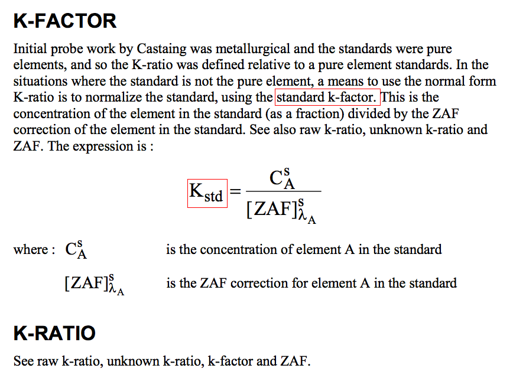

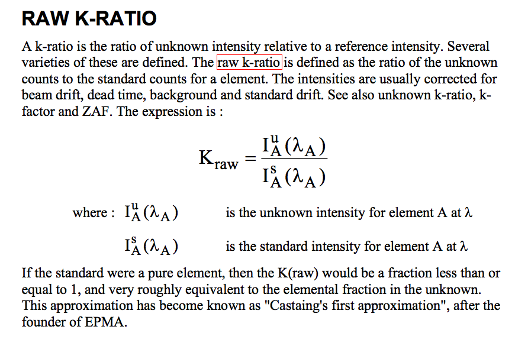

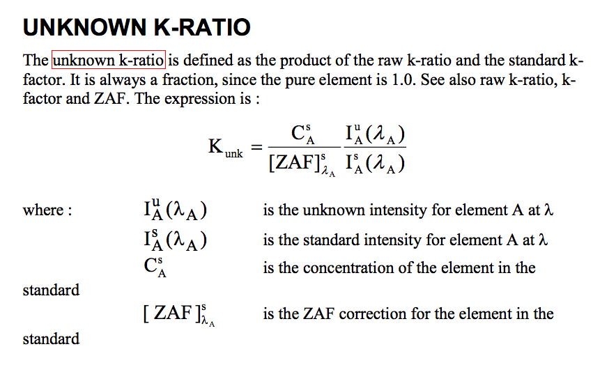

and finally...

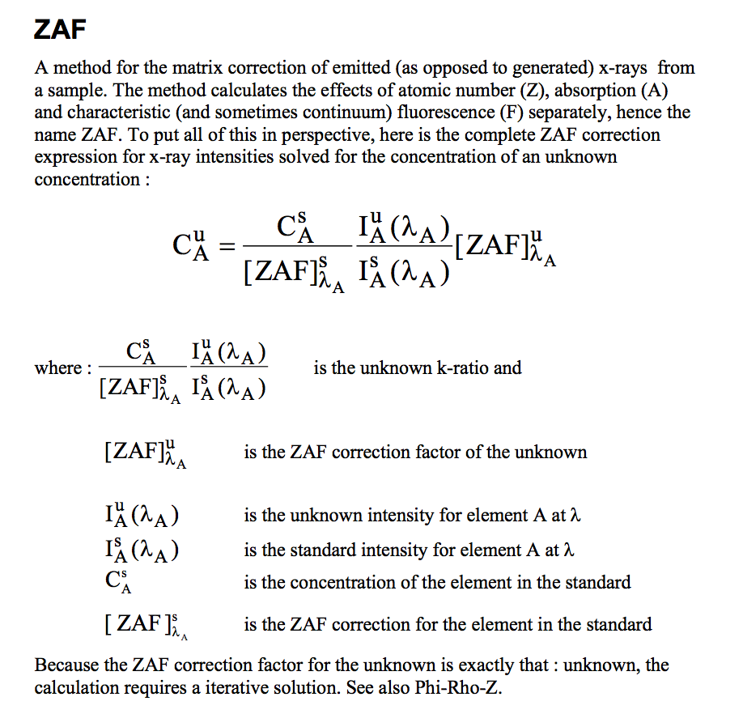

## Working with Standards

Probe for EPMA maintains a standard database that is very convenient to
use when the standards have been set up. I found setting them up a bit 
confusing at first. CalcZAF makes use of these for the computations and
it reduces repetitive input.

To work with standards, one uses **both** the 
**CalcZAF.exe** program and the **Standard.exe** program.

We'll start with the **New** function...

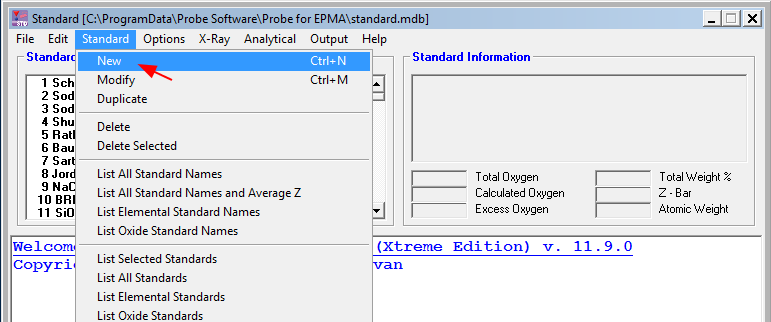

See the example below.


### Creating and modifying standards

In one of our labs in the Lehigh Quantitative Microanalysis course we
wanted to create three standards for Ir~X~Si~Y~ inter-metallic compounds
and to use one that had been verified by wet chemistry as a standard to
analyze an unknown to see if we could properly identify the unknown.

In this case, we will set up the standard for the **Ir~3~Si~5~**
inter-metallic that will be used as a standard in our computations.

We create the standard from the **Standard.exe** program. When we start
that program we need to choose a standard file. In this case we use the
default, **standard.mdb**. The top menu bar has a **Standard** button
that displays the following menu. 

This presents a dialog box that we can fill in. The figure below shows a
complete box. Under the bottom of the red arrow is what the blank fields
looks like. **Note:**  Compositions are in **weight percent** not weight
fractions.

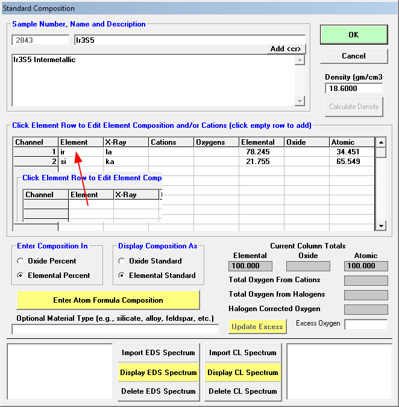

When one clicks the mouse button on a **blank element field** a dialog
appears to set up the standard parameters for that element. The Ir field
is shown below.

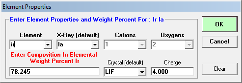

We repeat the process for Si and then I computed an estimate of the
density that was in the completed dialog above.

Standard numbering is systematic for Probe for EPMA. For our use with
CalcZAF we can assign non-assigned numbers. I'll figure out the
convention later...

**We repeat the process for all our standards for the run**.


### Using standards in a computation

To use standards in a computation, we have to use the **Standard** menu
from **CalcZAF** to **Add Standards To/From Run**.

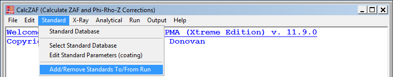

So we can set up our analysis of our unknown as follows:

First add the information for the unknown for **both** Ir and Si and
assign the standard:


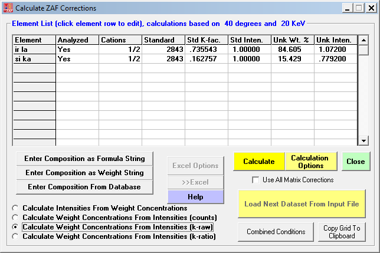

Before we run the model, let's look at the results using elemental
standards...

```
CalcZAF Sample () at 40 degrees and 20 keV

STANDARD PARAMETERS (TOA= 40):

 ELEMENT  STDNUM STDCONC STDKFAC   Z-BAR  ABSCOR  FLUCOR  ZEDCOR  ZAFCOR                  
   Ir La     577  99.700   .9956 76.7930   .9997   .9999  1.0019  1.0014
   Si Ka     514 100.000  1.0000 14.0000  1.0000  1.0000  1.0000  1.0000

 ELEMENT STP-POW BKS-COR   F(x)e   F(x)s      Eo      Ec   Eo/Ec
   Ir La  1.0030   .9989   .9459   .9462   20.00 11.2150  1.7833
   Si Ka  1.0000  1.0000   .8503   .8503   20.00  1.8390 10.8755

SAMPLE: 0, TOA: 40, ITERATIONS: 3, Z-BAR: 67.79354

 ELEMENT  ABSCOR  FLUCOR  ZEDCOR  ZAFCOR STP-POW BKS-COR   F(x)u      Ec   Eo/Ec    MACs uZAF/sZAF
   Ir la   .9910   .9999  1.0789  1.0691  1.1233   .9604   .9545 11.2150  1.7833 122.499  1.067533
   Si ka  1.5826   .9907   .7777  1.2193   .5790  1.3433   .5373  1.8390 10.8755 1295.53  1.219305

 ELEMENT   K-RAW K-VALUE ELEMWT% OXIDWT% ATOMIC% FORMULA KILOVOL                                        
   Ir la  .78920  .78570  83.997   -----  46.058   3.685   20.00                        
   Si ka  .11790  .11790  14.376   -----  53.942   4.315   20.00                        
   TOTAL:                 98.373   ----- 100.000   8.000


```

And we get....

```
CalcZAF Sample () at 40 degrees and 20 keV

STANDARD PARAMETERS (TOA= 40):

 ELEMENT  STDNUM STDCONC STDKFAC   Z-BAR  ABSCOR  FLUCOR  ZEDCOR  ZAFCOR                  
   Ir La    2843  80.415   .7355 64.6615   .9884   .9999  1.1062  1.0933
   Si Ka    2843  19.585   .1628 64.6615  1.5380   .9914   .7892  1.2033

 ELEMENT STP-POW BKS-COR   F(x)e   F(x)s      Eo      Ec   Eo/Ec
   Ir La  1.1660   .9487   .9459   .9570   20.00 11.2150  1.7833
   Si Ka   .6025  1.3099   .8503   .5529   20.00  1.8390 10.8755

SAMPLE: 0, TOA: 40, ITERATIONS: 3, Z-BAR: 67.28297

 ELEMENT  ABSCOR  FLUCOR  ZEDCOR  ZAFCOR STP-POW BKS-COR   F(x)u      Ec   Eo/Ec    MACs uZAF/sZAF
   Ir la   .9905   .9999  1.0833  1.0730  1.1303   .9585   .9549 11.2150  1.7833 123.777  .9814445
   Si ka  1.5752   .9908   .7796  1.2166   .5828  1.3377   .5398  1.8390 10.8755 1308.24  1.011044

 ELEMENT   K-RAW K-VALUE ELEMWT% OXIDWT% ATOMIC% FORMULA KILOVOL                                        
   Ir la 1.07200  .78850  84.605   -----  44.484   3.559   20.00                        
   Si ka  .77920  .12682  15.429   -----  55.516   4.441   20.00                        
   TOTAL:                100.034   ----- 100.000   8.000

```

The totals has improved.... I don't remember f(&Chi;) being that bad...

And we can test the effect of models

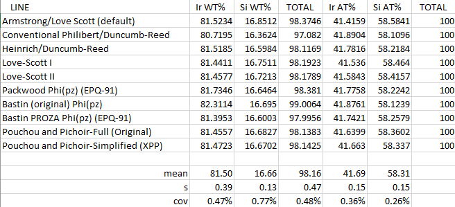


## Basic Input - Pseudo Code example

First some hints:

Note 1:

```
CalcMode% = 0 for calculation of k-ratios from concentrations
CalcMode% = 1 for calculation of concentrations from unknown and standard intensities
CalcMode% = 2 for calculation of concentrations from "raw" k-ratios (no standard intensities necessary)
CalcMode% = 3 for calculation of concentrations from "normalized" k-ratios (no standards necessary)
```

Note 2:

```
OxideorElemental%=1 calculate oxide output based on stoichiometry
OxideorElemental%=2 calculate as elemental output (default)
```


**Note 3:** all strings (element symbols, etc.) must be in double
quotes, elements not analyzed (specified concentrations or calculated)
are indicated by a blank (empty double quotes) x-ray line string. If
the element is a specified concentration, be sure to give the
concentration in elemental weight percent for the
`"ElmPercents!(I%)"` parameter and leave the count intensity
fields zero.


**Now the pseudo code...**

```
' Read calculation mode (0, 1, 2, or 3), number of elements, 
' kilovolts and takeoff, (optional sample name)
Input #3, CalcMode%, LastChan%, Kilovolts!, Takeoff!, (SampleName$)


' Read oxide/elemental mode, difference, stoichiometry, relative
Input #3, OxideOrElemental%, DifferenceElement$, StoichiometryElement$,  StoichiometryRatio!, RelativeElement$, RelativeToElement$, RelativeRatio!


' Loop on each element
For i% = 1 To LastChan%
   Input #3, Elsyms$(i%), Xrsyms$(i%), NumCat%(i%), NumOxd%(i%), StdAssigns%(i%), ElmPercents!(i%), UnkCounts!(i%), StdCounts!(i%)
next i%

```


**Now the examples...**

## Mode 0 - Calc Intensities from weight concentrations

```
0,2,15,40.,”MgO K-ratio""

2,"","",0.0,"","",0.0

"mg","ka",1,1,0,60.0,0.0,0.0

"o","ka",1,0,0,40.0,0.0,0.0
```

## Mode 1 - (calculates concentrations from unk and std intensities)

```
0,3,15,40.,”Fe2SiO4”

2,"","",0.0,"","",0.0

"fe","ka",1,1,895,0.0,7568.1,10265.7

"si","ka",1,2,14,0.0,1329.4,5268.2

"o","ka",1,0,895,0.0,2519.6,2498.1
```

## Mode 2 - Calculates concentrations from "raw" k-ratios

```
0,3,15,40.,”Fe2SiO4”

2,"","",0.0,"","",0.0

"fe","ka",1,1,895,0.0,.96283,0.

"si","ka",1,2,914,0.0,.00003,0.

"o","ka",1,0,895,0.0,1.09972,0.

```

This is what the results look like:

I need a clear summary of the difference between **standard k-factors** and
**k-raw**.

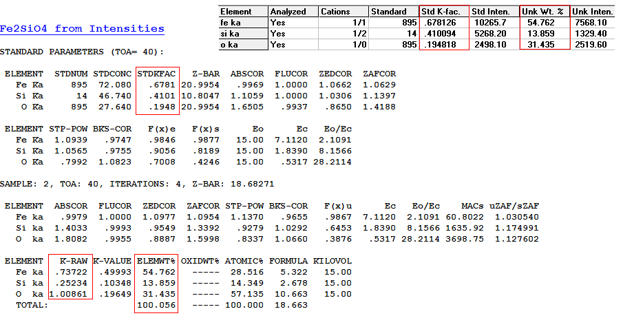

# Mode 3 - calculates concentrations from normalized k-ratios

```
0,2,20,40.,”MgO”

2,"","",0.0,"","",0.0

"mg","ka",1,1,0,0.,.418853,0.0

"o","ka",1,0,0,0.,.190763,0.0
```

# Monte Carlo Simulations

Note that one starts Monte Carlo simulations from the **Standards.exe** window

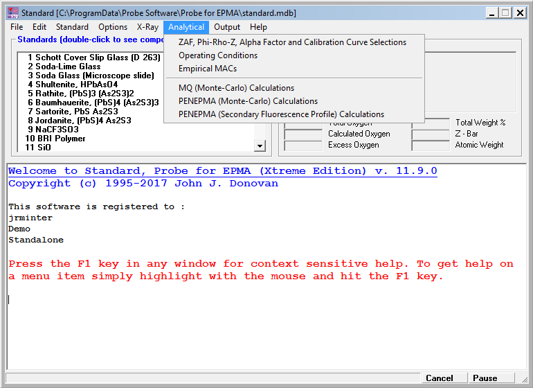

The image below shows how to run a basic simulation using **penepma12**

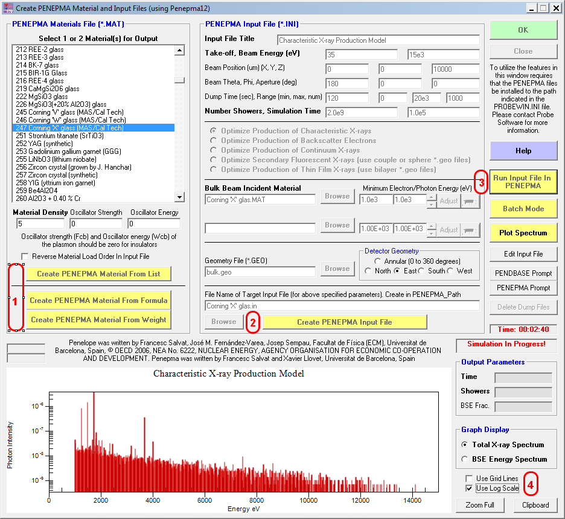

1. Create an input file. One may do it three ways:

- Select a material from the standards list (this example)

- Create a material from a chemical formula

- create a material from weight fractions

2. Select a geometry and your input parameters and then
**create the PENEPMA Input file**.


Note the default input parameters:


- Enter simulation time values on the last line of the **name.in** file for the simulation.
- Enter the energy ranges are on the `MSIMPA` lines of the **name.in** file for the simulation.


| hrs for sim | seconds |
|------------:|--------:|
| 1 | 3600 |
| 2 | 7200 |
| 4 | 14440 |
| 8 | 28800 |
| 24 | 86400 |
| 27.8 | 10^5^ (default) |


Note it has a **.in** extension. Note that this is a text file that is well
commented.


```
TITLE  Characteristic X-ray Production Model
       .
       >>>>>>>> Electron beam definition.
SENERG 1.50E+04                  [Energy of the electron beam, in eV]
SPOSIT 0 0 1                     [Coordinates of the electron source]
SDIREC 180 0              [Direction angles of the beam axis, in deg]
SAPERT 0                                      [Beam aperture, in deg]
       .
       >>>>>>>> Material data and simulation parameters.
MFNAME Corning 'X' glas.MAT           [Material file, up to 20 chars]
MSIMPA 9.0E+1 9.0E+1 1E+3 0.1 0.1 1E+3 1E+3 [EABS(1:3),C1,C2,WCC,WCR]
       .
       >>>>>>>> Geometry of the sample.
GEOMFN bulk.geo                  [Geometry definition file, 20 chars]
DSMAX  1 1.5e-2             [IB, Maximum step length (cm) in body IB]
       .
       >>>>>>>> Interaction forcing.
IFORCE 1 1 4 -10    0.1 1.0           [KB,KPAR,ICOL,FORCER,WLOW,WHIG]
IFORCE 1 1 5 -400   0.1 1.0           [KB,KPAR,ICOL,FORCER,WLOW,WHIG]
       .
       >>>>>>>> Photon detectors (up to 10 different detectors).
PDANGL 50.0 60.0 0.0 360.0 0           [Angular window, in deg, IPSF]
PDENER .0 20e+03 1000                [Energy window, no. of channels]
       .
       >>>>>>>> Job properties
RESUME dump1.dat               [Resume from this dump file, 20 chars]
DUMPTO dump1.dat                  [Generate this dump file, 20 chars]
DUMPP  120                                   [Dumping period, in sec]
       .
NSIMSH 2.0e+04                  [Desired number of simulated showers]
RSEED  1 1                     [Seeds of the random-number generator]
TIME   3600                        [Allotted simulation time, in sec]
```

3. Run the file.  Wait - it gives progress reports. For a single
run the program automatically plots the spectrum. This outputs
the **.mat** file which is a text result file.

4. You will typically want to select a log scale. You can then 
copy to the clipboard. I check this with ImageJ. **It would be
really cool to output the file in .msa format.**

And this is what I obtained. Note that if one wanted to compute K-ratios
from spectra, it might be worth computing more trajectories... It would
also be nice to be able to export these to **.msa** spectrum files to
plot in DTSA-II with markers and make publication quality graphics with
gnuplot... I think Probe for EPMA uses Surfer... 

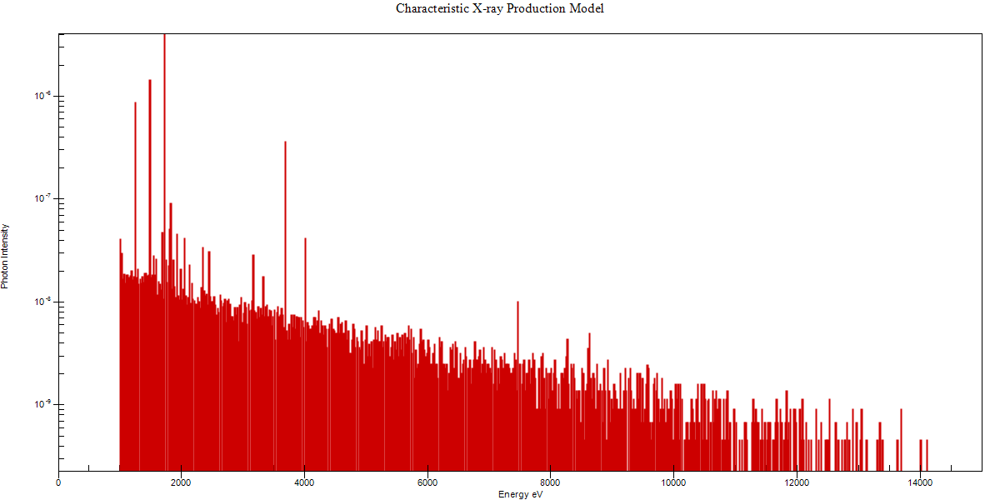

And this is the output after an hour on the VM on my MacBook

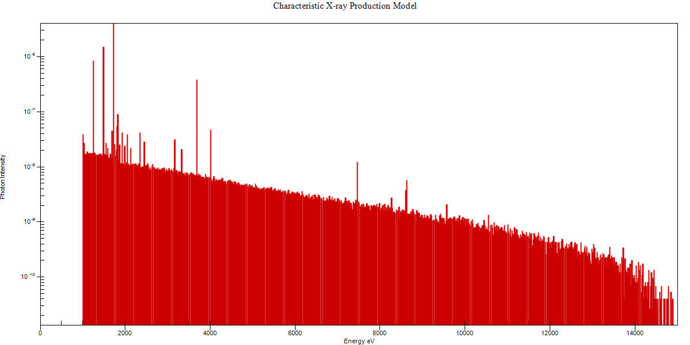

Note that the spectrum was output in

```
C:\UserData\Penepma12\Penepma\pe-spect-01.dat
```

The columns are:

```
 #  Whole spectrum. Characteristic peaks and background.
 #  1st column: photon energy (eV).
 #  2nd column: probability density (1/(eV*sr*electron)).
 #  3rd column: statistical uncertainty (3 sigma).

```

I'm not certain how to convert to a peak intensity...

There is the **pe-intens-01.dat** file that has the intensity of the characteristic lines... Think I'd get k-ratios from that... 

## Bilayer simulations

Note [this](http://probesoftware.com/smf/index.php?topic=57.0) thread on the Probe software forum. Seems there was a bug...

John Donovan suggests that the finished product should look like this:

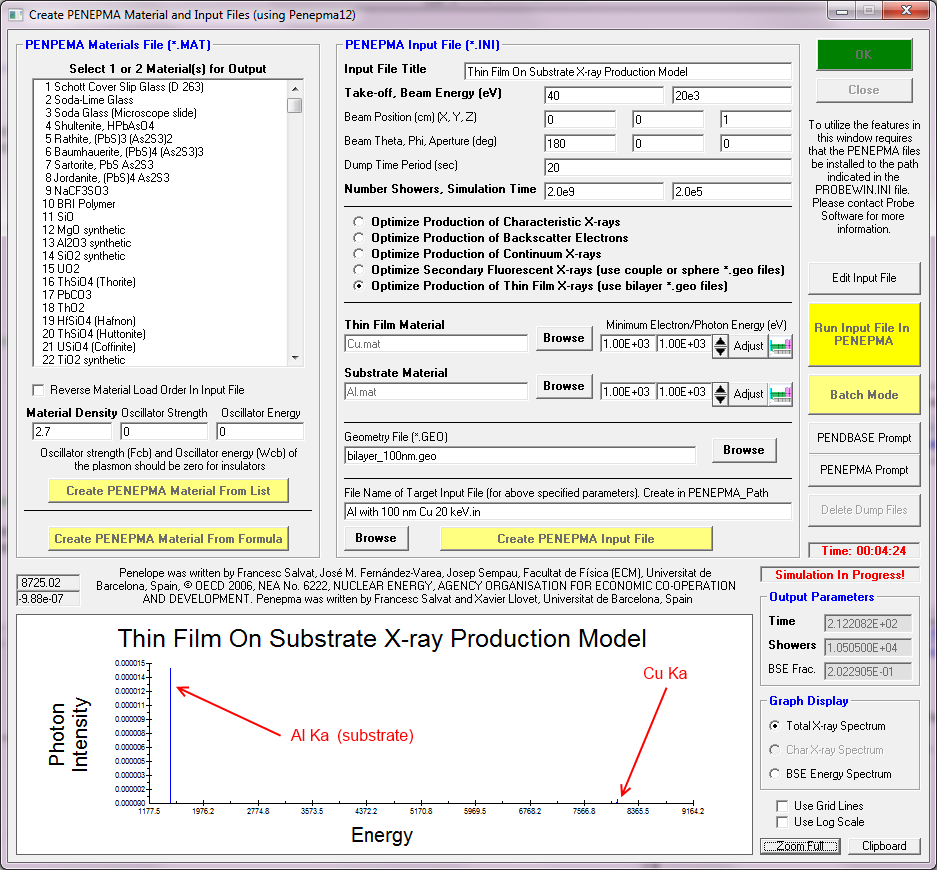

An my implementation...

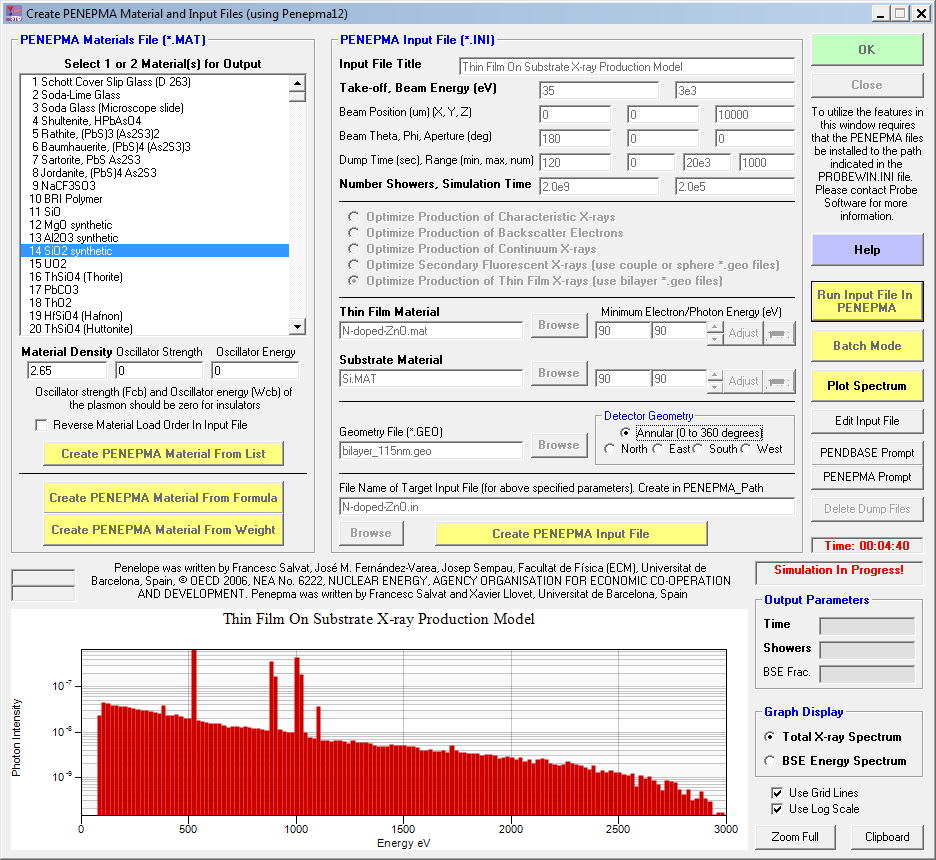


# Plotting $\phi \rho z$ curves. 

This feature was added in May 2018. A nice example is
[here](http://probesoftware.com/smf/index.php?topic=1070.msg7144#msg7144).
Brian Joy implemented the computations for XPP and PAP models.

1. Start by using the Analytical menu to get to a dialog that permits
setting the desired $\phi \rho z$ model.
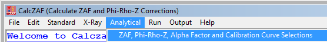

2. Choose the ZAF Phi-Rho-Z button to get to the next menu.
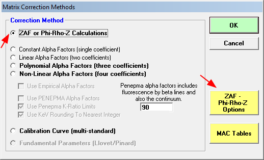
3. Choose the desired method. In this case PAP. Select `OK` to return.
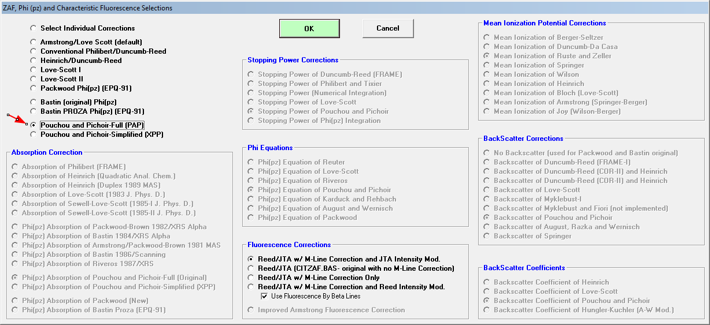


4. Use the Calculation Options button to set the `Calculation Options`
and the `Enter Composition` button to enter our compound (`al2o3`)
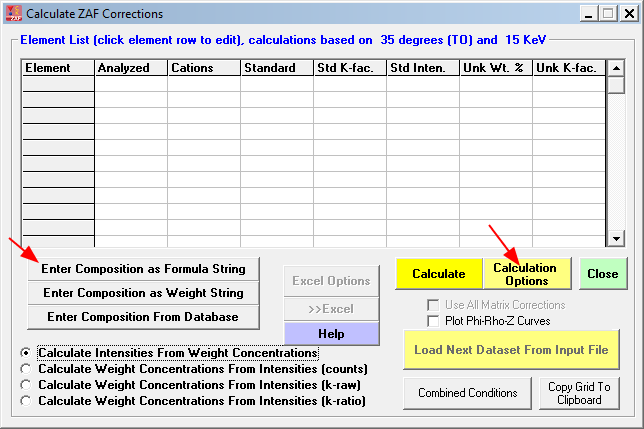

5. Then use the `Calculation Options` to set the density  to 3.95
for our Al~2~O~3~ example.
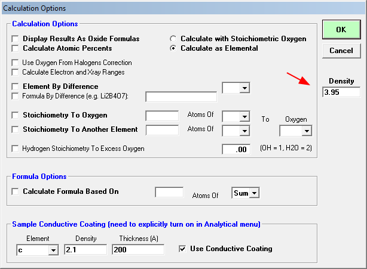

6. Our final pane should look like this. We then press the `calculate` button.
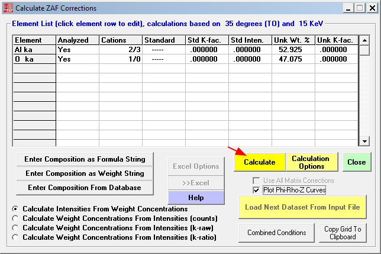

7. The result window contains a plot.Note the option to `Export Data`
(as a tab-delimited file) and the ability to switch between $Z$ and $\rho Z$
display modes.
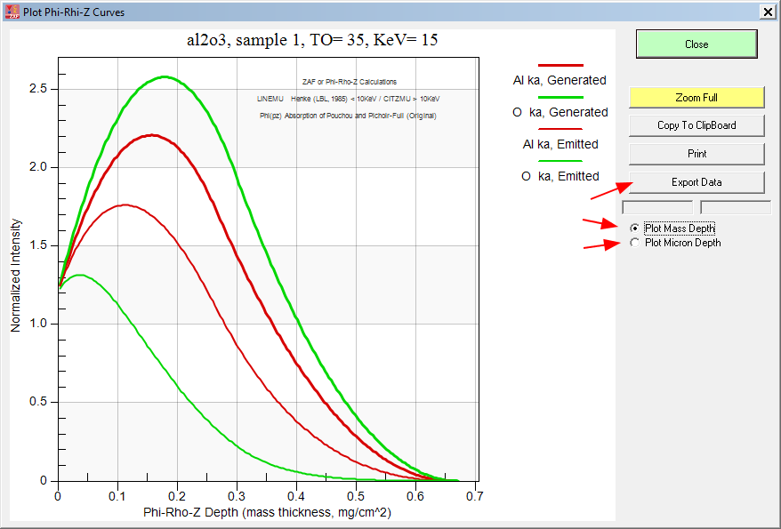


# System Administration

These are tips for use and sys-admin.


# Key directories in my install

## preferred install dir

```
C:\Apps\CalcZAF
```

This has programs and some data

## Windows ProgramData

```
C:\ProgramData\Probe Software\Probe for EPMA 
```

**standard.mdb** goes in here, as do update installers. John Donovan
occasionally updates this file.

## User data

```
C:\UserData
```

Has the following tree with data files

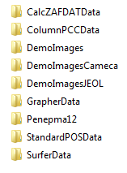
 

## UserImages
 
This would have images from the system
 
```
C:\UserImages
```

Currently empty in my installs


[Back to Index](../README.html)