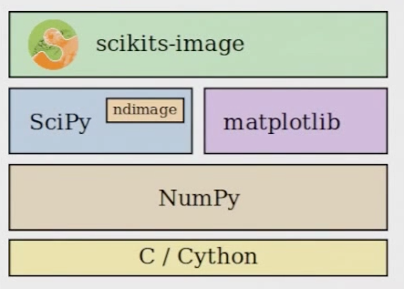
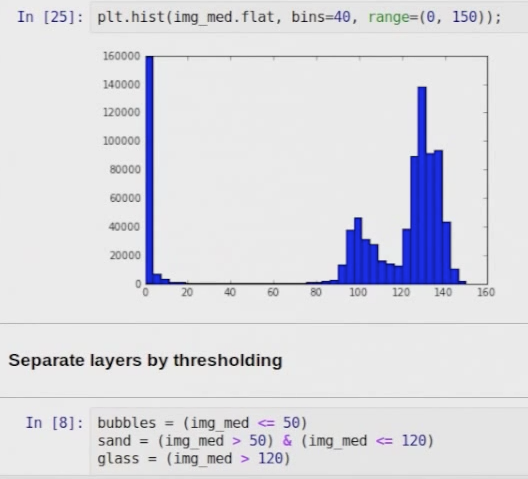

[Back to Index](../README.html)

See also [Intermediate Python](http://book.pythontips.com/en/latest/)


# Python image processing

## Youtube videos

### Stefan van der Walt (2012)
[skimage 2012 Stefan van der Walt](https://www.youtube.com/watch?v=QXTyYYx5_6o) - a nice introduction 



`ndimage` is written in pure C. See the [ndimage](http://docs.scipy.org/doc/scipy/reference/ndimage.html) docs. He illustrated with the SEM image of glass looking for bubbles (it is a BSE image).

He showed a great way to get a histogram by flattening...



### Others


[Image Processing with Scikit Image | EuroSciPy 2015 | Emmanuelle Gouillart, Juan Nunez Iglesias](https://www.youtube.com/watch?v=SZvez2u-w9I), 
[SciPy 2014 Juan Nunez Iglesia and Tony Yu](https://www.youtube.com/watch?v=MP-MTiCETYg), 
[Ravi Chityala](https://www.youtube.com/watch?v=LIltHIIxZxo) who wrote [Image Processing and Acquisition using Python](https://www.crcpress.com/Image-Processing-and-Acquisition-using-Python/Chityala-Pudipeddi/9781466583757), and
[PyCon Australia](https://www.youtube.com/watch?v=hqOsfS3dP9w) by Edward Scofield.

# ipython4 and jupyter

Jupyter must be installed separately. See [jupyter github](https://github.com/jupyter/notebook)

An easy way to update aftet **the big split** from [blog.jupyter.org](http://blog.jupyter.org/2015/08/12/first-release-of-jupyter/)

```
pip install --upgrade ipython[all]  
```

or BF&I

```
# ensure setuptools/pip are up-to-date
pip install --upgrade setuptools pip
cd ~/git
git clone https://github.com/jupyter/notebook.git
cd notebook
pip install --pre -e .
jupyter notebook
```

# hyperspy

See also [hyperspy tips](../hyperspy/hyperspy.html)

**N.B.** [francisco-dlp](https://github.com/hyperspy/hyperspy/issues/790) noted this problem with hyperspy when updating anaconda.

```
...
from skimage.external.tifffile import imsave, TiffFile
...
RuntimeError: module compiled against API version a but this version of numpy is 9
```

One can check the version with

```
import numpy
print numpy.__version__
```

# Spyder problem on Py 3.4

Had problems with crashes. Turned out to be Babel 2.0. Ended up installing both Babel and Spyder from source. 

# Anaconda

## Getting a good Anaconda set-up on Win7 x64

1. Uninstall all system Pythons
2. Install Anaconda3 2.4.1 in `C:\Apps\Anaconda3`
3. move `C:\Apps\Anaconda3;C:\Apps\Anaconda3\Scripts;C:\Apps\Anaconda3\Library\bin;` to right after R in PATH
4. `conda update conda`
5. `conda update anaconda`   (does nothing)
6. `conda update --all`
7. `conda install mysql-connector-python`
8. Fix path in `startMIDB3.bat`
9. `cd C:\Data\eds\hyperspy`
10. `conda env create -f testHS.yml`
11. Go to hyperspy `git reset --hard; git checkout master`, install hyperspy from command line `(source) activate testHS` and `python setup install`


## Launching

On MacOSX, a recent update broke the launcher for spyder,
glueviz,and qtconsole. In reality, it is easier to use the Finder
to navigate to the desired directory, use the `cd to.app` to open
a terminal in that directory and start with one of

```
ipython qtconsole
ipython notebook
spyder
```

Note that starting `launcher` from the terminal makes the
graphical start work. Go figure...

## Updating

```
conda update conda
conda update anaconda
```

To update all packages

```
conda update --all
```

## Environments

The definitive guide is [here](http://conda.pydata.org/docs/using/envs.html)

To list all environments

```
conda info --envs
```
or

```
conda env list
```

To list a detailed package list for an environment

```
conda list -e
```

To create an environment from the command line

```
conda create --name myEnv python=3 scipy otherpackage
```

or from a yaml file

```
conda env create -f environment.yml
```

Export this file with from the active environment

```
conda env export > myName.yml
```

Remove an environment

```
conda remove --name theName --all
```

## iPython Notebook

Some hints from version 3.

- `--pylab` flag has been disabled as a flag; one should use
`%pylab` or `%matplotlib` in the notebook to enable matplotlib. 

- `--notebook-dir=<Unicode> (NotebookApp.notebook_dir)` the 
default is `u''`. This is the directory to use for notebooks
and kernels.  If one starts from the Anaconda Launcher, it seems
to start in one's home directory. One can navigate to the
desired folder.

## Checking outdated packages

```
pip install wheel
pip install some-package.whl

```

For python 2

```
pip2 list --outdated

pip2 install h5py --upgrade
pip2 install traitsui --upgrade
```

## Microsoft Visual C++ Compiler for Python 2.7

### Installing and Uninstalling

The compiler package will default to installing just for the current user and does not require administrative privileges. To install for all users of a machine, execute `msiexec /i <path to MSI> ALLUSERS=1` from an elevated Command Prompt.

To remove or repair the compiler package, locate the entry in Programs and Features and select Remove or Repair.

### Using with Python distribution tools
Python package developers should download and use this compiler to produce binary wheels for their Python packages to upload to PyPI. Installing the wheel package, updating to setuptools 6.0 or later, and adding setup.py bdist_wheel upload to your build process will produce the correct files (remember to do this for both 32-bit and 64-bit versions).

If a Python package you are installing does not have a wheel, you can install this compiler package on your own machine. Once the compiler is installed and you have updated to setuptools 6.0 or later, you can use pip install to build and install the Python package. If you are managing multiple machines and need to install the Python package on all of them, you should install the wheel package and use pip wheel to produce a wheel that can be installed on machines without requiring this package.

## installing from git repos

For python 3
```
$ cd repo
$ pip3 install -e ./
```

For python 2
```
$ cd repo
$ pip install -e ./
```

## Uninstalling Python 3.4.1 on Win7 x64

Following the hints below:

1. I uninstalled all other installed py34 pgms. Uninstalled 3.4.1. Failed.
2. Did a regedit search for ``Python 3.4.1`` and deleted all keys
3. Did a ``Python`` search and deleted all keys
4. Ran CCCleaner and cleaned all
5. Deleted everything in Python34 except empty Scripts folder
6. Restarted
7. Ran CCCleaner and cleaned all
8. Installed 3.4.2

Not the first person to run into this problem. Found [this](http://www.gossamer-threads.com/lists/python/python/1157273)

On 8/29/2014 11:26 PM, Llelan D. wrote: 

> Actually, I do know more than a little about the Windows MSI service and 
> application, and had already perused the logs to no avail. All of the 
> listed registry keys were deleted without changing the problem. The 
> missing file is of no importance since I already know the installation 
> directory is deleted. It's just that the installer should normally 
> supply that information. 
> 
> The error messages are Windows System errors that are being caused by 
> requirements of the MSI installer file and not the msiexec.exe 
> application. The problem is with how the installer is written and not 
> the MSI system. 
> 
> There's always a simple answer to things like this. It's just that the 
> simple answers are harder to find in poorly written code. 
> 
> I randomly poked around the registry a lot more, deleting anything I 
> could find referring to Python34 and then the string "Python 3.4.1". I 
> finally got desperate enough to delete the python installer entries 
> under the Windows Installer key (the list of installed applications in 
> the Windows "Uninstall or Change a Program" Control Panel). You know, 
> the registry keys you are *NEVER* to use as an indication if the 
> application is currently installed because MS constantly corrupts this 
> list and can leave your installation in an un-installable, 
> un-repairable, and un-removable state? 
> 
> Well it worked. The Python installer no longer sees the application as 
> installed and happily performs a full installation. I did that, a full 
> removal to get rid of any other problems, and a clean installation and 
> everything works fine now. 
> 
> This installer is seriously screwed up and desperately needs a re-write. 
> It should use its own key to indicate whether the application is 
> installed but should not depend on it in case of a partially 
> installed/removed state, should not require any installed file to fully 
> repair or remove the application, and should query the user if any 
> information required is missing from the installation or registry. In 
> other words, the normal MSI installer guidelines. 
> 
> I hope this is of help to someone out there. 

## Fixing python-win32 on python 3.4

From [stackoverflow](http://stackoverflow.com/questions/22490233/win32com-import-error-python-3-4)

We need to re-run the install script to get ``import win32wnet`` to work.

```
python C:\Python34\Scripts\pywin32_postinstall.py -install
```


## Creating the default ipython profiles

Clean out any old ones

```
cd ~
rm -rf .ipython
# create new defaults
ipython profile create
```

[A useful ref](http://ipython.org/ipython-doc/dev/config/intro.html)

## 2to3

``2to3`` is a utility installed with python3 that helps convert. The documentation is [here](http://docs.python.org/2/library/2to3.html).

# Getting Python 2 and 3 to play well with Win7
There was a great discussion on [StackOverflow](http://stackoverflow.com/questions/15912063/how-do-i-run-python-2-and-3-in-windows-7) that suggested the [Python launcher for Windows](http://www.python.org/dev/peps/pep-0397/) introduced in Python 3. The documentation is on [bitbucket](https://bitbucket.org/vinay.sajip/pylauncher/src/tip/Doc/launcher.rst).

## Building Python Extensions on Win 7 x64

One must precisely match the compiler used to
build the binaries. For Python 3.3, this is
Visual Studio 2010.  I did a custom install of
Visual Studio 2010 Premium to get the x64 compilers
installed. I also installed Service Pack 1 and
the x64 redistributable package.

### Get the environment variables set

The easiest way to do this is to use the ``Visual
Studio x64 Win64 Command Prompt`` command window.

### Example: compiling the 0.10 dev version of scikit-image

1. I started the ``x64 Win64 Command Prompt``
2. I downloaded the source from github.
3. When I first tried ``python setup.py build`` it complained about missing the cython dependency.
4. I did ``pip3 install cython`` from the command window.
5. On my second attempt at ``python setup.py build`` I got an error complaining about undefined ``M_PI``. This should have been picked up by ``include math.h`` but was not. I placed this in the two affected files

```
#ifndef M_PI
  #define M_PI 3.14159265358979323846
#endif
```

This built and installed without further error messages.


## GUI
### Eclipse
#### Install from PyDev
Install from update site ``http://pydev.org/updates``
### Color themes
Install from update site ``http://eclipse-color-theme.github.io/update/``

They have a nice Sublime Text 2 theme

## Directory operations

### get the current working directory
```
import os
os.getcwd()
```
### remove an entire tree
```
import shutil
shutil.rmtree(path, ignore_errors=False, onerror=None)
```

## ini files
[StackOverflow](http://stackoverflow.com/questions/8884188/how-to-read-and-write-ini-file-with-python)

```
import configparser

config = configparser.ConfigParser()
config.read('FILE.INI')
print(config['DEFAULT']['path'])     # -> "/path/name/"
config['DEFAULT']['path'] = '/var/shared/'    # update
config['DEFAULT']['default_message'] = 'Hey! help me!!'   # create

with open('FILE.INI', 'w') as configfile:    # save
    config.write(configfile)
```

Seems to work fine...

## List Comprehensions

From [Carl Groner](http://carlgroner.me/Python/2011/11/09/An-Introduction-to-List-Comprehensions-in-Python.html)

### The basics.
Let’s start with a simple list.

```
>>> my_list = [1, 2, 3, 4, 5, 6, 7, 8, 9, 10]
>>> my_list
[1, 2, 3, 4, 5, 6, 7, 8, 9, 10]
```

Quite often, we’ll need to build a new list from the elements of an existing list. For example, let’s say we want to make a list containing all elements of ``my_list``, each multiplied by 2. 

### Using Python's List Comprehension
Now let’s take a look at how to do this using Python’s list comprehension syntax.

```
>>> new_list = [x * 2 for x in my_list]
>>> new_list
[2, 4, 6, 8, 10, 12, 14, 16, 18, 20]
```
### Syntax
The syntax for list comprehension is based on set builder notation. Given the form ``[Y for X in LIST]``, ``Y`` is commonly referred to as the ***output function*** , ``X`` is the ***variable***, and ``LIST`` is the ***input set***. This statement says to do ``Y`` on each ``X`` in ``LIST``.

For an example of using a different output function, let’s say say we want a new list that contains each number in ``my_list`` as a string type…

```
>>> [str(x) for x in my_list]
['1', '2', '3', '4', '5', '6', '7', '8', '9', '10']
```

You may be asking yourself why we wouldn't just use ``map()`` here:

```
>>> map(str, my_list)
['1', '2', '3', '4', '5', '6', '7', '8', '9', '10']
```

In this example, ``map`` looks like a good alternative. However, for slightly more complicated requirements, list comprehension can be a bit more concise. For example, when we’d like to specify a predicate .

### The predicate
Consider our previous example, where we want to create a list of string types for each element in ``my_list``, except this time we only want the elements which are even numbers. A typical way to do this would be:

```
>>> new_list = []
>>> for x in my_list:
...   if (x % 2) == 0:
...     new_list.append(str(x))
... 
>>> new_list
['2', '4', '6', '8', '10']
```

In order to use map() here we would need to first filter the list to exclude the odd numbers.

Using the list comprehension syntax would look like this:

```
>>> new_list = [str(x) for x in my_list if (x % 2) == 0]
>>> new_list
['2', '4', '6', '8', '10']
```

This version introduces the predicate, an expression after the list which acts as a filter on which elements get passed to the output function.

Neat, clear and concise.

### Loops of loops.
Finally, it’s worth mentioning that you can use list comprehensions to iterate on more than one list. For example:

```
>>> list_a = ['A', 'B']
>>> list_b = [1, 2]
>>> [(x, y) for x in list_a for y in list_b]
[('A', 1), ('A', 2), ('B', 1), ('B', 2)]
```

Just like you would expect in for loops, the last loop moves the fastest. Also note that this method returns a list of tuples. If you’d like nested lists, you can also nest one list comprehension within another.

```
>>> list_a = ['A', 'B']
>>> list_b = ['C', 'D']
>>> [[x+y for x in list_a] for y in list_b]
[['AC', 'BC'], ['AD', 'BD']]
```

### Summary.

List comprehension in Python can often provide a neat, clear, and concise syntax for creating lists from other lists. However, one should always be aware that, particularly for complex transformations or predicates, the concise and terse syntax can quickly become very difficult to read. In these cases, it's often beneficial to revert to traditional looping constructs.


## Alchemy...

## A DM3 image reader in python
[ImageJ Wiki](http://imagejdocu.tudor.lu/doku.php?id=plugin:utilities:python_dm3_reader:start)

## MySQL

## With Python 3

JRM...

Try
[mysql-connector-python](http://dev.mysql.com/doc/relnotes/connector-python/en/)

```
easy_install mysql-connector-python
```

documentation
[mysql.com](http://dev.mysql.com/doc/refman/5.6/en/connector-python.html)


[stackoverflow](http://stackoverflow.com/questions/15434930/python-3-mysql-and-pymysql-on-a-windows-7-box)
> I might be asking the impossible. However, I am trying to
> connect to MySQL on a windows 7 box using Python 3.3.0.
> I've using PyMySQL as a way to connect, but this appears
> not to be supported for a Windows box.

offered this answer

> Rather than use any other connector. I found that MySQL
> have a Python 3.3 MySQL connector which solves this issue.
> [see](http://dev.mysql.com/doc/refman/5.6/en/myconnpy_example_connecting.html)


Note that
[this question](http://stackoverflow.com/questions/4960048/python-3-and-mysql)
suggested that

> You should probably use pymysql - Pure Python MySQL
> client instead. It works with Python 3.x, and doesn't
> have any dependencies.
> 
> This pure Python MySQL client provides a DB-API to a
> MySQL database by talking directly to the server via
> the binary client/server protocol.
>
> Example:

```
import pymysql
conn = pymysql.connect(host='127.0.0.1', unix_socket='/tmp/mysql.sock', user='root', passwd=None, db='mysql')
cur = conn.cursor()
cur.execute("SELECT Host,User FROM user")
for r in cur:
    print(r)
cur.close()
conn.close()

```

They offered the link to
[gohkle's](http://www.lfd.uci.edu/~gohlke/pythonlibs/)
Win binaries. Currently (2013-06-01), the list doesn't
list py3.2 binaries. I do note that there are py3.2
binaries for Oursql that claims to support MySQL
databases
see [this example](http://pythonhosted.org/oursql/tutorial.html#establishing-a-connection).


[Back to Index](../README.html)
