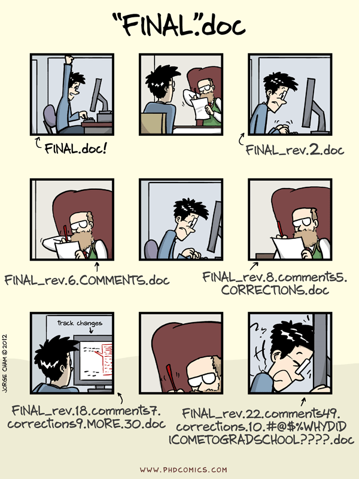

[Back to Index](../README.html)

These are tips on effective scientific research collected by John Minter from selected web sources.

# Software Carpentry

Greg Wilson is an excellent teacher!

Some files that we need are available [here](https://files.software-carpentry.org/). There is also a version of the course taught by Tiziano Zito at the [Berlin Institute of Technology](https://itb.biologie.hu-berlin.de/~zito/teaching/SC/) that has all the files we need (download the zipped archive and look in the `lec/inc/` directory) for all the files needed for the course from 2012 that was recorded by Greg for the [youtube](https://www.youtube.com/playlist?list=PLhFTuW7KWApwoo2DHzpWLhA19zenWF1LF) playlist.


## Key suggestions:

1. Greg begins by noting that our work is really **'brain limited'**. Neuroscience research studies show that people can hold **7 $\pm$ 2** unrelated facts in short term memory. We then develop **'mental inter-relations'** between these to form patterns. **Example:** We do not recall the five dots on a dice as separate facts but as a pattern or unit. We call this **chunking**. Forming these interconnections is part of long term memory.  The **key take-away** is that we **work best** when we **accommodate our physiology**. For example, Write and test logical units that fit the 7 $\pm$ 2 items one can keep in short term memory and assemble the into functions/blocks. **Note:** The shell history or iPython history can save typing and help. 

2. Plan your work in approximately **45 to 60 minute segments** where you have optimal focus. It is important to get up, walk around and get some oxygen to be refreshed. **Example:** Cadets at the U. S. Military Academies are taught to do push-ups to refresh their focus.

3. Test and debug as you go. This saves time in the long run.

4. Commit short, logical blocks to version control using meaningful commit messages to aid in later search.

5. **The importance of peer instruction:** From Eric Mazur at Harvard. If we get a misconception, likely someone in the group will understand and explain the misconception. Recent learners are often much better at this than experts. I call this **the importance of a second pair of eyes**.

6. **Clarity is more important that brevity**. We are writing code with our **future selves in mind**. It is important that humans can quickly understand the algorithm behind the code. Consider these two solutions:

```
# add up the number of creatures in a data file
reader = open('the-name.txt', 'r)
total = 0
for line in reader:
    if not(line.startswith('#') or line.startswith('Date')):
        temp = line.strip()
        fields = temp.split(',')
        count = int(fields[2])
        total = total + count
reader.close()
print('total number of creatures seen', total)
```

compared to this version


```
# add up the number of creatures in a data file
reader = open('the-name.txt', 'r)
total = 0
for line in reader:
    if (line.startswith('#') or line.startswith('Date')):
        pass # skip comments and data set title lines
    else:
        temp = line.strip()
        fields = temp.split(',')
        count = int(fields[2])
        total = total + count
reader.close()
print('total number of creatures seen', total)
```

The second is more quickly understood.


## Installing the software on Windows

Getting the software set up on Windows can be a challenge. I like the Msys2 system. 

Get the basic installer [here](https://msys2.github.io/). There are great packages on [github](https://github.com/Alexpux/MSYS2-packages), and they are easily installed using **`pacman`**. 

1. Download and install the appropriate [**msys2 installer**](https://msys2.github.io/). I like to install it in **`C:/Apps/msys64/`**.
2. Update the pacman database: `pacman -Sy pacman`
3. Install base devel: `pacman -S base-devel`
4. Install sqlite: `pacman -S sqlite`
5. Install nano: `pacman -S nano`
6. Install ruby: `pacman -S ruby` (optional dependency for svn)
7. Install svn: `pacman -S svn`

## An example of building up a workflow using a shell

We will analyze the `fish.txt` file. Use the `up-arrow` key to reduce typing

1. Remove the `Species` header

```
grep -v Species fish.txt
```

2. Extract just the species

```
up-arrow
grep -v Species fish.txt | cut -d , -f 2 
```

3. sort the species

```
up-arrow
grep -v Species fish.txt | cut -d , -f 2 | sort
```

4. Get just the species and count

```
up-arrow
grep -v Species fish.txt | cut -d , -f 2 | sort | uniq -c
```

Note the development process$\ldots$ The shell history is our friend$\ldots$
We have a command and trust it because we "grew it in stages".

**This is a habit we need to develop (in all our software development and problem solving)**. Think in terms of cycles of build/assemble then test$\ldots$ We need to 'check our work' repeatedly along the way.

You can tell a lot about whether a paper you are reviewing is likely to be correct by asking a few questions about the "how". Look at the build/test process. Is there a record (like saving the history$\ldots$)

For example, use:

```
history > second-record.txt
```

**There is no way to check** the 'how' inside a GUI tool!

Note we can search the history. Greg used

```
history | grep tail
```

to find this exemplar (at line 149):

```
cut -d , -f 2  fish.txt | sort | uniq -c | tail +2
```

which was the first way to count species. **Note:** we can re-run with 

```
!149
```

I tested with:

```
jrmFastMac [~/Documents/software-carpetry]
jrminter 41: wc tail-at-the-end.txt grep-at-the-start.txt 
       4       8      44 tail-at-the-end.txt
       4       8      44 grep-at-the-start.txt
       8      16      88 total

jrmFastMac [~/Documents/software-carpetry]
jrminter 42: diff tail-at-the-end.txt grep-at-the-start.txt 
```

## The Importance of using **predictable file names**


`fish.txt` is a **really bad name** for a data file! After a while one gets a series of files that have unhelpful names... 

Que PhD Comics cartoon$\ldots$



We need to use meaningful file-names and consistent data entry or data cleaning becomes a nightmare!

**The more consistent the data and the file name**, the easier it is to extract data


We can Use the `*` wildcard to get the shell to match for all characters!

Consistent file names help. Can use mv to rename and move files to consistent names and directories.

**This makes file selection and data cleaning easier!**


**THE KEY IDEAs: **

1. Use consistent file naming conventions
2. Use consistent file content/structure
3. Use the pattern matching from the shell and iPython terminal to reduce typing and errors.
4. **Test early and incrementally** to minimize errors. 
5. Encapsulation (the idea that objects contain data and methods, that is they contain things and know how to do things, is probably the most important idea when it comes to structuring large programs.
6. Use pipelines.
7. When changes are all localized, this is an indicator of good design. e.g. - we want to print in one place (function) so that format is consistent. Otherwise, sooner or later I will forget to change one... 


## Some key **`sqlite`** commands:

### Create the database by

```
sqlite3 experiments.db < create-db.sql
```

### Do a query

```
sqlite3 experiments.db < project-hours.sql
```

# Good advice from Philip Guo

The PDF is on [his website](http://www.pgbovine.net/PhD-memoir/pguo-PhD-grind.pdf) His github repository is at [pgbovine](https://github.com/pgbovine)

## His summary 

From pp. 100-106

1. Results trump intentions
2. Outputs trump inputs
3. Find relevant information
4. Create lucky opportunities
5. Play the game
6. Lead from below
7. Professors are human
8. Be well-liked
9. Pay some dues
10. Reject bad defaults
11. Know when to quit
12. Recover from failures
13. Ally with insiders
14. Give many talks
15. Sell, sell, sell
16. Generously provide help
17. Ask for help
18. Express true gratitude
19. Ideas beget ideas
20. Grind hard and smart


## Real research is never done in a vacuum

> Contrary to romanticized notions of a lone scholar sitting outside sipping a latte and doodling on blank sheets of notebook paper, real research is never done in a vacuum. (p. 18)

Note: Guo describes his struggle with burnout and the consequences of isolation on p. 16 and 37. This also led to procrastination. He tried to read and think on his own. Gou's summary

> But without proper guidance or context, I ended up wasting a lot of time and not extracting any meaningful insights from my readings. p. 16

> We also experienced isolation and loneliness from spending day and night grinding on obscure, ultra-specialized problems that few people around us understood or even cared about. p. 37

He also learned from his first year burn-out and changed his approach to work:

> I now paced myself a lot better to remain healthy and avoid burnout. (p. 34).

He also recognized that some projects are destined to fail because of **misaligned incentives**. (p. 35) This led him to later note:

> These two opposing experiences taught me the importance of deeply understanding the motivations and incentives of one’s potential collaborators before working with them. (p. 36)

**Inspiration** strikes at odd times (p. 52)

**Having a good idea is necessary but nowhere near sufficient for producing publishable research.** Junior researchers - usually Ph.D. students - must spend anywhere from hundreds to thousands of hours "sweating the details"" to bring that idea to fruition. (p. 57)

and

> Even though I wasn’t in love with my previous research projects earlier in grad school and during college, the technical skills and judgment that I gained from those experiences made it possible for me to now implement my own ideas that I truly cared about. (p. 58)

> I understood the importance of aligning with the subjective preferences of senior collaborators (and paper reviewers), even when doing research in supposedly objective technical fields. (p. 91)

## Write for the audience

> I had unwisely framed the pitch for IncPy in a way that led to my paper being reviewed by researchers in a subfield that wasn't as "friendly" to my research philosophy. In theory, technical papers should be judged on their merit alone, but in reality, reviewers each have their own unique subjective tastes and philosophical biases. So I drastically rewrote my introductory pitch with the aim of getting more amicable reviewers and then resubmitted to a second-tier conference to further improve its chances of acceptance. My plan worked. (p. 71)

> I spent a lot of effort crafting new introductory and concluding chapters to turn my dissertation into more than merely a description of five separate tools that I had built over the past few years. Throughout the writing process, Jeff and Margo gave me great feedback on how to frame my research contributions in a more substantive intellectual light. (p. 95)

## Key questions for an outline of a project pitch presentation

Guo describes (p. 30) pitching ideas for a project. I think his outline is effective.

1. What's the problem?
2. What's my proposed solution?
3. What compelling experiments can I run to demonstrate the effectiveness of my solution?

## The importance of networking.

He cites his experience applying for internsips at Microsoft Research

> If I had blindly submitted my resume online like hundreds of other applicants, I would have probably not been able to attract Tom's attention. Most of my fellow interns also got their jobs through connections, although usually their advisors made a direct recommendation to a relevant MSR colleague. (p. 48)

and

> I learned about the importance of being endorsed by an influential person; simply doing good work isn’t enough to get noticed in a hyper-competitive field. (p. 48)

and

> Tom would drop by my office at 5pm each afternoon before he left work to check up on my progress. Although daily check-ups could potentially be stressful, I actually found them immensely helpful since Tom wasn't intimidating or judgmental at all. Getting immediate daily feedback made it easy for me to stay focused and motivated. The combination of a well-defined, short-term goal and continual helpful feedback made my internship workdays much more productive than those during my previous three years of grad school. The best part was that I worked only during normal office hours (9am to 6pm). (pp. 48-49)

This reminded me of a Yogi Berra quote (You can see a lot just by looking around...) Greg Wilson would likely say that this is recognizing patterns and moving it into long-term memory:

> Many refinements to my initial idea came from observing computational researchers at work and interviewing them about the challenges they faced in managing their multitude of experiment notes, code, and data files. (pp. 91 -92)


# Good advice from Neal Anderson

From [Practical Process Research and Development - A guide for Organic Chemists, Second Edition 2nd Edition, p. 19](http://www.amazon.com/dp/0123865379). Hat Tip [ChemJobber](http://chemjobber.blogspot.co.uk/2016/02/bonus-process-wednesday-life-tips-from.html).

> The attitudes for chemists in process R&D may differ from those of drug discovery chemists.

> 1. Teamwork is key. Optimize interactions between discovery chemists, engineers, analysts. microbiologists, operators, Environmental Health & Safety officer, pharmaceutical chemists. QA/QC personnel, attorneys for patent applications, out-sourcing (CROs, CMOs), your manufacturing counterparts, and regulatory personnel. **Don't trivialize the work of others, especially if you don't understand their job.** (emphasis mine)
2. Recognize that the need to minimize impurities drives process development.
3. Know the edge of failure for your operations. For rapid development, stay away from the edge. For cost-effective processes, you may want to operate close to the edge.
4. Reproducible, accurate analytical data are necessary for effective process development.
5. If an operation is extremely difficult, reconsider. Perhaps additional information will simplify the operation.
6. Heed the advice of ecologists: "We're all in this together." Humor helps defuse the gravity of most difficult situations.
7. During process introduction and scale-up boring situations can be good - that means there are no problems to address.


# William Shockley on what makes an effective researcher
[Brian McGill](http://dynamicecology.wordpress.com/2014/01/23/william-shockley-on-what-makes-a-person-write-a-lot-of-papers-and-the-superstar-researcher-system/) has a nice summary on Shockley's view of research. He used publication as a metric and noted the factors that were required:

1. ability to think of a good problem
2. ability to work on it
3. ability to recognize a worthwhile result
4. ability to make a decision as to when to stop and write up the results
5. ability to write adequately
6. ability to profit constructively from criticism
7. determination to submit the paper to a journal
8. persistence in making changes (if necessary as a result of journal action).

Shockley then posits, what if the odds of a person clearing hurdle ``i`` from the list of 8 above is $p_i$? Then the rate of publishing papers for this individual should be proportional to $p_{1}p_{2}p_{3}\dots p_{8}$. This gives the multiplication of random variables needed to explain the lognormal distribution of productivity (Shockley goes on to note that if one person is 50% above average in each of the 8 areas then they will be 2460% more productive than average at the total process).

Another conclusion is that if you are really bad at just one factor ($p_{i}$ close to zero for just one $i$), it sinks your overall productivity. This is innate in the multiplicative model. This is a solid rationale for working on one's weakest required skill before enhancing one's best requirement - or at least collaborating with those skills who complement yours.


[Back to Index](../README.html)