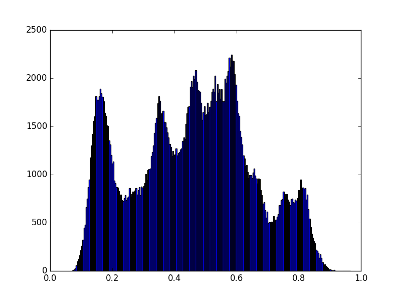

```{r setup, cache = F, echo = F, message = F, warning = F, tidy = F}
# make this an external chunk that can be included in any file
library(knitr)
options(width = 72)
opts_chunk$set(message = F, error = F, warning = F, comment = NA, fig.align = 'center', dpi = 100, tidy = F, cache.path = '.cache/', fig.path = 'figure/')

options(xtable.type = 'html')
knit_hooks$set(inline = function(x) {
  if(is.numeric(x)) {
    round(x, getOption('digits'))
  } else {
    paste(as.character(x), collapse = ', ')
  }
})
knit_hooks$set(plot = knitr:::hook_plot_html)
```
[Back to Index](../README.html)

skimage is a useful image processing package

# Things that made me go huh...

## Synching my local scikit-image repository

```
echo   
echo "synch scikit-image repositories. Version 2016-06-23"
echo 
cd $GIT_HOME/scikit-image
echo scikit-image
git checkout master
git pull
git fetch upstream
git merge upstream/master master
git push
git pull
git checkout v0.12.x
git pull
git merge upstream/v0.12.x v0.12.x
git push . v0.12.x
git pull
git checkout master

```


## Building from github repo under python 3.5

This has me pulling hair... Python 3.5 is supposed to use Visual Studio 2015. I've had lots of trouble. I finally got it to work from `crunch`. Some of this is alchemy...

1. Make sure latest Anaconda Python 3.5 is installed. Need to install some packages

```
conda install dask wheel 
```

1. I updated the repo. Cleared all but `.git` directory and did `git reset --hard`.

2. For some reason building from the VS2015_X64 commanbd prompt was problematic. Building from the git bash prompt worked. Go figure...

3. The `dist` directory has `scikit_image-0.12.dev0-py3.5-win-amd64.egg`. I made a `.whl` by
a tip from [here](http://stackoverflow.com/questions/21856048/can-i-convert-an-egg-to-wheel).

```
conda install wheel

cd  ~/git/scikit-image/dist
wheel convert ./scikit_image-0.12.dev0-py3.5-win-amd64.egg
```

# Key documentation

## Core components

- [The API Reference](http://scikit-image.org/docs/dev/api/api.html) should be my first stop...

- [Key examples](http://scikit-image.org/docs/dev/auto_examples/index.html) - they have lots of examples to get started.

- [The SciPy Lecture Notes](http://www.scipy-lectures.org/) provide a lot of complementary information.

- Tutorial notebooks on [GitHub](https://github.com/scikit-image/skimage-tutorials/tree/master/lectures). We owe Stéfan Van Der Walt, Emmanuelle Gouillart, and others a debt of gratitude for these.

## Individuals

- **Emmanuelle Gouillart** ([website](http://www.svi.cnrs-bellevue.fr/spip/spip.php?article27)) has an excellent  [blog](http://emmanuelle.github.io/). Her tutorial on [segmentation](http://emmanuelle.github.io/a-tutorial-on-segmentation.html) is **particularly relevant**.  She reminded me that following the [NumPy doc string convention](http://emmanuelle.github.io/tools-and-tips-for-documenting-scientific-python-projects.html) gets me a long way along the road to clarity. The details are [here...](https://github.com/numpy/numpy/blob/master/doc/HOWTO_DOCUMENT.rst.txt#sections).

- **Stéfan Van Der Walt** ([website](http://bids.berkeley.edu/people/st%C3%A9fan-van-der-walt)) seems to be the primary maintainer of `skimage`. His personal lecture notes are  available on [GitHub](https://github.com/stefanv/teaching).

- **Juan Nunez-Iglesias** ([website](https://www.vlsci.org.au/researcher/juan-nunez-iglesias)) has a helpful [blog](http://ilovesymposia.com/). One particularly helpful post is on reading [metadata from microscopy images](http://ilovesymposia.com/2014/08/10/read-microscopy-images-to-numpy-arrays-with-python-bioformats/). His [GitHub](https://github.com/jni) repository has some helpful code. He uses python/skimage as well as ImageJ/Fiji.

- **Sébastien Brisard** ([website](http://navier.enpc.fr/BRISARD-Sebastien?lang=en)) specializes in X-ray Tomography. His  [blog](http://sbrisard.github.io/posts/20150223-Orientation_correlations_among_rice_grains-01.html) has a really nice series on 3-D segmentation of rice grains.

## Youtube videos

### Stéfan Van Der Walt

[Image Analysis in Python with SciPy and Scikit Image](https://www.youtube.com/watch?v=olb7R1cuzyU) from SciPy 2015

[Image Processing in Python with Scikits image](https://www.youtube.com/watch?v=QXTyYYx5_6o) from PyData 2012 is a slightly older video, but a nice introduction to how Numpy, SciPy, and skimage all fit together. 


`ndimage` is written in pure C. See the [ndimage](http://docs.scipy.org/doc/scipy/reference/ndimage.html) docs. He illustrated with the SEM image of glass looking for bubbles (it is a BSE image).

He showed a great way to plot a histogram by flattening (note the call to `plt.hist`)

```
from skimage import data, color
from matplotlib import pyplot as plt

img = color.rgb2gray(data.lena())
plt.hist(img.flat, bins=256)
plt.show();
```
<center></center>

### Others

- Emmanuelle Gouillart and Juan Nunez Iglesias
[Image Processing with Scikit Image](https://www.youtube.com/watch?v=SZvez2u-w9I) from EuroSciPy 2015. In the first half, Juan Iglesia had problems with the video projector. They fixed it before Emanuelle's presention, which was especially helpful. She has her tutorials on [github](https://github.com/emmanuelle/image-processing-tutorials). She processes SEM images as well and is a contributor to skimage...


- Juan Nunez Iglesia and Tony Yu, **Image analysis in Python with scipy and scikit image** [Part 1](https://www.youtube.com/watch?v=MP-MTiCETYg), [Part 2](https://www.youtube.com/watch?v=SE7h0IWD93Y), and [Part 3](https://www.youtube.com/watch?v=Yxpnvc4RHy4) from SciPy 2014.

- Ravi Chityala [mage Processing using Python](https://www.youtube.com/watch?v=LIltHIIxZxo) from an "All Things Python meetup" in 2014. Ravi wrote [Image Processing and Acquisition using Python](https://www.crcpress.com/Image-Processing-and-Acquisition-using-Python/Chityala-Pudipeddi/9781466583757). 


# A useful image montage function

This creates a montage of images with an optional colorbar. I spent **a lot of time** getting that colorbar to work right!

```
from matplotlib import pyplot as plt
from mpl_toolkits.axes_grid1 import make_axes_locatable

def plotImageMontage(lData, lTitles, nrows, ncols, title=None,
                     baseSize=5, fSize=12, bare=False, cb=False, **kwargs):
    xSize = ncols*baseSize
    ySize = nrows*baseSize
    fig, axes = plt.subplots(nrows=nrows, ncols=ncols, figsize=(xSize, ySize))
    if title != None:
        fig.suptitle(title, fontsize=fSize+2)
    for ax, im, ti in zip(axes.flat, lData, lTitles):
        ax.set_title(ti, fontsize=fSize)
        cim = ax.imshow(im, **kwargs)
        if cb == True:
            # Create divider for existing axes instance
            div = make_axes_locatable(ax)
            # Append axes to the right of ax, with 10% width of ax
            cax = div.append_axes("right", size="10%", pad=0.05)
            # Create colorbar in the appended axes
            cbar = plt.colorbar(cim, cax=cax)
        # Remove xicks from ax
        if bare == True:
            ax.xaxis.set_visible(False)
            ax.yaxis.set_visible(False)
    plt.show()
    return(fig)


res = plotImageMontage([orig,astro,deconvolved], ['orig', 'blurred', 'deconvolved'], 1, 3,
                       title='Skimage Deconvolution Demo',baseSize=5, bare=True,
                       cb=True, vmin=0, vmax=1)

```

# Useful ipython notebooks

[morphology](http://nbviewer.ipython.org/github/chintak/scikit-image-examples/blob/master/skimage_morphology.ipynb)    
[another morphology](http://nbviewer.ipython.org/url/www.cs.put.poznan.pl/wjaskowski/pub/teaching/kck/lectures/notebooks/morphology.ipynb) and [the whole group](http://www.cs.put.poznan.pl/wjaskowski/pub/teaching/kck/lectures/notebooks/)      
[parallel image processing](http://nbviewer.ipython.org/github/minrk/IPython-parallel-tutorial/blob/master/Index.ipynb) - especially [this one](http://nbviewer.ipython.org/github/minrk/IPython-parallel-tutorial/blob/master/examples/Parallel%20image%20processing.ipynb) 


[Back to Index](../README.html)