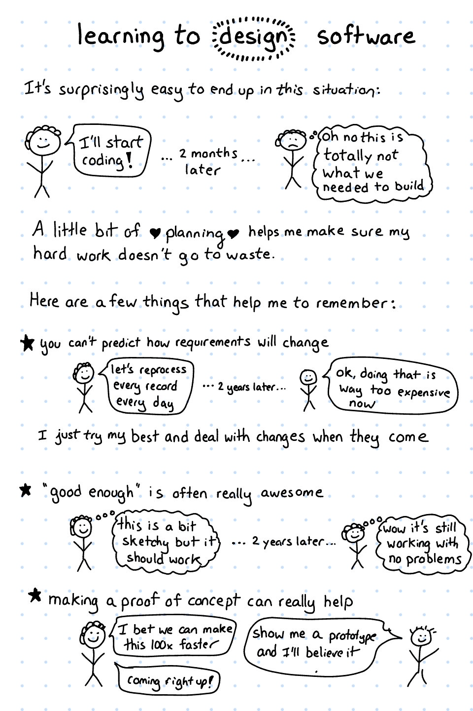

```{r setup, cache = F, echo = F, message = F, warning = F, tidy = F}
# make this an external chunk that can be included in any file

library(knitr)
options(width = 72)
opts_chunk$set(message = F, error = F, warning = F, comment = NA, fig.align = 'center', dpi = 100, tidy = F, cache.path = '.cache/', fig.path = 'figure/')

options(xtable.type = 'html')
knit_hooks$set(inline = function(x) {
  if(is.numeric(x)) {
    round(x, getOption('digits'))
  } else {
    paste(as.character(x), collapse = ', ')
  }
})
knit_hooks$set(plot = knitr:::hook_plot_html)
```


[Back to Index](../README.html)

# Some tips from Julia Evans



# Team Tips

## Ideas from [Kate Heddleston](https://kateheddleston.com/blog/becoming-a-10x-developer)

**10 Ways to be a Better Teammate**

1. Create an environment of psychological safety
2. Encourage everyone to participate equally
3. Assign credit accurately and generously
4. Amplify unheard voices in meetings
5. Give constructive, actionable feedback and avoid personal criticism
6. Hold yourself and others accountable
7. Cultivate excellence in an area that is valuable to the team
8. Educate yourself about diversity, inclusivity, and equality in the workplace
9. Maintain a growth mindset
10. Advocate for companies policies that increase workplace equality

[Back to Index](../README.html)

