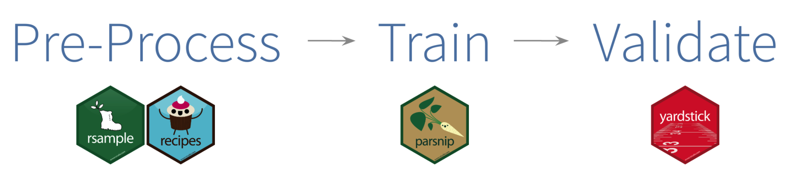

```{r setup, include=FALSE}
knitr::opts_chunk$set(echo = TRUE, comment = NA)
```

[Back to Index](../README.html)

# Introduction - Max Kuhn

From [here](https://www.tidyverse.org/blog/2018/08/tidymodels-0-0-1/)

The tidymodels package is now on CRAN. Similar to its sister package tidyverse,
it can be used to install and load tidyverse packages related to modeling and
analysis. Currently, it installs and attaches `broom`, `dplyr`, `ggplot2`,
`infer`, `purrr`, `recipes`, `rsample`, `tibble`, and `yardstick`.

Load packages

```{r loadPackages}
library(tidymodels)
library(parsnip)
```

`tidymodels` also contains a burgeoning list of tagged packages. These can be
used to install sets of packages for specific purposes. For example, if you are
in need of additional tidy tools for analyzing text data:

```{r attachTextAnalysis}
tag_attach("text analysis")
```

The number of tidyverse modeling package continues to grow. Some packages on the
development horizon include:

`parsnip`: a unified interface to models. This should significantly reduce the
amount of syntactical minutia that you’ll need to memorize by having one
standardized model function across different packages and by harmonizing the
parameter names across models.

`dials`: tools for tuning parameters. `dials` contains objects and methods for
creating and validating tuning parameter values as well as grid search tools.
This is designed to work seamlessly with `parsnip`.

`embed`: an add-on package for `recipes`. This can be used to efficiently encode
high-cardinality categorical predictors using supervised methods such as
likelihood encodings and entity embeddings.

`modelgenerics`: a developer-related tool. This lightweight package can help
reduce package dependencies by providing a set of generic methods for classes
which are used across packages. For example, if you are creating a new tidy
method for your model, this package can be used instead of broom (and its
dependencies).

Keep an eye on the tidymodels organization page for up-to-date information.

Note: One needs to install `generics` from github

```
devtools::install_github("r-lib/generics")
```

# An Gentle Introduction - Edgar Ruiz


From [Edgar Ruiz](https://rviews.rstudio.com/2019/06/19/a-gentle-intro-to-tidymodels/).


Recently, I had the opportunity to showcase tidymodels in workshops and talks.
Because of my vantage point as a user, I figured it would be valuable to share
what I have learned so far. Let’s begin by framing where tidymodels fits in
our analysis projects.

The diagram above is based on the R for Data Science book, by Wickham and
Grolemund. The version in this article illustrates what step each package
covers. Even though it is a single step, developing models can benefit from
having a tidyverse-friendly interface. That is where tidymodels comes in.

It is important to clarify that the group of packages that make up tidymodels
do not implement statistical models themselves. Instead, they focus on making
all the tasks around fitting the model much easier. Those tasks are data pre-processing and results validation.

In a way, the `Model` step itself has sub-steps. For these sub-steps, `tidymodels`
provides one or several packages. This article will showcase functions from four
tidymodels packages:

`rsample` - Different types of re-samples    
`recipes` - Transformations for model data pre-processing    
`parnip` - A common interface for model creation
`yardstick` - Measure model performance

The following diagram illustrates each modeling step, and lines up the 
`tidymodels` packages that we will use in this article:



In a given analysis, a tidyverse package may or may not be used. Not all projects
need to work with time variables, so there is no need to use functions from the
`hms` package. The same idea applies to tidymodels. Depending on what type of
modeling is going to be done, only functions from some its packages will be used.

## An Example

We will use the `iris` data set for an example. Its data is already imported, and
sufficiently tidy to move directly to modeling.

### Load only the tidymodels library

This may be the first article I have written where only one package is called via
`library()`. Apart from loading its core modeling packages, `tidymodels` also
conveniently loads some tidyverse packages, including dplyr and `ggplot2`.
Throughout this exercise, we will use some functions out of those packages, but
we don’t have to explicitly load them into our R session.

JRM Note: we previously loaded `tidymodels`...

### Pre-Process

This step focuses on making data suitable for modeling by using data
transformations. All transformations can be accomplished with `dplyr`, or other
`tidyverse` packages. Consider using `tidymodels` packages when model development 
is more heavy and complex.

### Data Sampling

The `initial_split()` function is specially built to separate the data set into
a **training** and **testing** set. By default, it holds 3/4 of the data for
training and the rest for testing. That can be changed by passing the `prop`
argument. This function generates an rplit object, not a data frame.
The printed output shows the row count for testing, training, and total.

```{r irisSplit}
iris_split <- initial_split(iris, prop = 0.6)
iris_split
```

To access the observations reserved for training, use the `training()` function. 
Similarly, use `testing()` to access the testing data.

```{r accessTraining}
iris_split %>%
  training() %>%
  glimpse()
```

These sampling functions are courtesy of the rsample package, which is part
of `tidymodels`.

## Pre-process interface

In tidymodels, the recipes package provides an interface that specializes in
data pre-processing. Within the package, the functions that start, or execute,
the data transformations are named after cooking actions. That makes the
interface more user-friendly. For example:

- `recipe()` - Starts a new set of transformations to be applied, similar to
the `ggplot()` command. Its main argument is the model’s formula.

- prep() - Executes the transformations on top of the data that is supplied
(typically, the training data).

Each data transformation is a step. Functions correspond to specific types of
steps, each of which has a prefix of step_. There are several `step_` functions;
in this example, we will use three of them:

- `step_corr()` - Removes variables that have large absolute correlations with
other variables

- `step_center()` - Normalizes numeric data to have a mean of zero

- `step_scale()` - Normalizes numeric data to have a standard deviation of one

Another nice feature is that the step can be applied to a specific variable,
groups of variables, or all variables. The `all_outocomes()` and
`all_predictors()` functions provide a very convenient way to specify groups of
variables. For example, if we want the `step_corr()` to only analyze the predictor
variables, we use `step_corr(all_predictors())`. This capability saves us from
having to enumerate each variable.

In the following example, we will put together the `recipe()`, `prep()`, and 
step functions to create a recipe object. The `training()` function is used to
extract that data set from the previously created split sample data set.

```{r irisRecipeOne}
iris_recipe <- training(iris_split) %>%
  recipe(Species ~.) %>%
  step_corr(all_predictors()) %>%
  step_center(all_predictors(), -all_outcomes()) %>%
  step_scale(all_predictors(), -all_outcomes()) %>%
  prep()
```

If we call the `iris_recipe` object, it will print details about the recipe.
The Operations section describes what was done to the data. One of the operations
entries in the example explains that the correlation step removed the
`Petal.Length` variable.

```{r irisRecipeTwo}
iris_recipe
```

## Execute the pre-processing

The testing data can now be transformed using the exact same steps, weights, and
categorization used to pre-process the training data. To do this, another function
with a cooking term is used: `bake()`. Notice that the `testing()` function is
used in order to extract the appropriate data set.

```{r irisRecipeThree}
iris_testing <- iris_recipe %>%
  bake(testing(iris_split)) 

glimpse(iris_testing)
```

Performing the same operation over the training data is redundant, because that
data has already been prepped. To load the prepared training data into a variable,
we use `juice()`. It will extract the data from the `iris_recipe` object.

```{r irisRecipeFour}
iris_training <- juice(iris_recipe)

glimpse(iris_training)
```

## Model Training

In R, there are multiple packages that fit the same type of model. It is common
for each package to provide a unique interface. In other words, things such as
an argument for the same model attribute is defined differently for each package.
For example, the `ranger` and `randomForest` packages fit
**Random Forest models**. In the `ranger()` function, to define the number of
trees we use `num.trees`. In `randomForest`, that argument is named `ntree`.
It is not easy to switch between packages to run the same model.

Instead of replacing the modeling package, `tidymodels` replaces the interface.
Better said, tidymodels provides a single set of functions and arguments to
define a model. It then fits the model against the requested modeling package.

In the example below, the `rand_forest()` function is used to initialize a
**Random Forest model**. To define the number of trees, the trees argument is
used. To use the `ranger` version of Random Forest, the `set_engine()` function
is used. Finally, to execute the model, the `fit()` function is used. The expected
arguments are the **formula** and **data**. Notice that the model runs on top of
the **juiced trained data**.

```{r irisRangerOne}
iris_ranger <- rand_forest(trees = 100, mode = "classification") %>%
  set_engine("ranger") %>%
  fit(Species ~ ., data = iris_training)
```

The payoff is that if we now want to run the same model against `randomForest`,
we simply change the value in `set_engine()` to “randomForest”.

```{r irisRangerTwo}
iris_rf <-  rand_forest(trees = 100, mode = "classification") %>%
  set_engine("randomForest") %>%
  fit(Species ~ ., data = iris_training)
```

It is also worth mentioning that **the model is not defined in a single, large**
**function with a lot of arguments**. The model definition is separated into
**smaller functions** such as `fit()` and `set_engine()`. This allows for a more 
flexible - and easier to learn - interface.

## Predictions

Instead of a vector, the `predict()` function ran against a `parsnip` model
returns a `tibble`. By default, the prediction variable is called `.pred_class`.
In the example, notice that the **baked testing data is used**.

```{r irisPredictOne}
predict(iris_ranger, iris_testing)
```

It is very easy to add the predictions to the baked testing data by using 
dplyr’s `bind_cols()` function.

```{r irisPredictTwo}
iris_ranger %>%
  predict(iris_testing) %>%
  bind_cols(iris_testing) %>%
  glimpse()
```

## Model Validation

Use the `metrics()` function to measure the performance of the model. It will
automatically choose metrics appropriate for a given type of model. The function
expects a tibble that contains the actual results (truth) and what the model
predicted (estimate).

```{r irisValidOne}
iris_ranger %>%
  predict(iris_testing) %>%
  bind_cols(iris_testing) %>%
  metrics(truth = Species, estimate = .pred_class)
```

Because of the consistency of the new interface, measuring the same metrics
against the randomForest model is as easy as replacing the model variable at
the top of the code.

```{r irisValidTwo}
iris_rf %>%
  predict(iris_testing) %>%
  bind_cols(iris_testing) %>%
  metrics(truth = Species, estimate = .pred_class)
```

## Per classifier metrics

It is easy to obtain the probability for each possible predicted value by setting
the type argument to `prob`. That will return a tibble with as many variables as
there are possible predicted values. Their name will default to the original
value name, prefixed with `.pred_`.

```{r irisClassMetOne}
iris_ranger %>%
  predict(iris_testing, type = "prob") %>%
  glimpse()
```

Again, use `bind_cols()` to append the predictions to the baked testing data
set.

```{r irisClassMetTwo}
iris_probs <- iris_ranger %>%
  predict(iris_testing, type = "prob") %>%
  bind_cols(iris_testing)

glimpse(iris_probs)
```

Now that everything is in one tibble, it is easy to calculate curve methods.
In this case we are using `gain_curve()`.

The curve methods include an `autoplot()` function that easily creates a
ggplot2 visualization.

```{r irisClassMetVizOne}
iris_probs%>%
  gain_curve(Species, .pred_setosa:.pred_virginica) %>%
  autoplot()
```

This is an example of a `roc_curve()`. Again, because of the consistency of the 
interface, only the function name needs to be modified; even the argument values
remain the same.

```{r irisClassMetVizTwo}
iris_probs%>%
  roc_curve(Species, .pred_setosa:.pred_virginica) %>%
  autoplot()
```

To measured the combined single predicted value and the probability of each
possible value, combine the two prediction modes (with and without prob type).
In this example, using dplyr’s `select()` makes the resulting tibble easier
to read.


```{r irisPredOne}
predict(iris_ranger, iris_testing, type = "prob") %>%
  bind_cols(predict(iris_ranger, iris_testing)) %>%
  bind_cols(select(iris_testing, Species)) %>%
  glimpse()
```

Pipe the resulting table into `metrics()`. In this case, specify `.pred_class`
as the estimate.

```{r irisPredTwo}
predict(iris_ranger, iris_testing, type = "prob") %>%
  bind_cols(predict(iris_ranger, iris_testing)) %>%
  bind_cols(select(iris_testing, Species)) %>%
  metrics(Species, .pred_setosa:.pred_virginica, estimate = .pred_class)
```

## Closing remarks

This end-to-end example is intended to be a gentle introduction to tidymodels.
The number of functions, and options of such functions, were kept at a minimum
for the purposes of this demonstration, but there is much more that can be done
with this wonderful group of packages. Hopefully, this article will help you get
started, and maybe even encourage you to expand your knowledge further.


Thank you!

[Back to Index](../README.html)
