[Back to Index](../README.html)

# How to back up Windows 11

I do this alot. I want it easipy visible...

1. Go to Control Panel, select Backup and Restore (Windows 7),
   then click Create a system image. ...
   
2. In the next window, choose the location you want the image backup to be
   sent to, then click **Next.**.
    
3. **Select any drives you wish to back up**, then click **Next** to begin
   the backup process.

This is currently a placeholder...

# Some useful quick tips for Windows 10

## Denninger on Device Security

Note to Those Running Windows 10

From: [here](https://market-ticker.org/akcs-www?post=242828).

Go into "Windows Security Settings" and type "Security".

Click "Windows Security Settings" (top item) then from
there click "Open Windows Security".

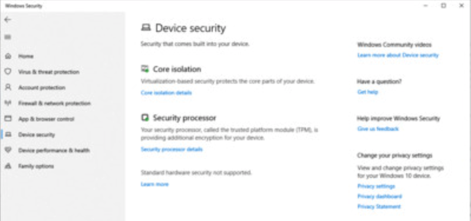

ImageSelect the first one, "Core isolation details".

If you have a reasonably recent processor that can do
virtualization there will be an entry called
"Memory Integrity" as the only entry. If it is off,
turn it on.

It may fail. If it does it will give you a clickable list of reasons.

The reason(s) are usually old device drivers and similar.

Those may or may not be hidden time bombs that are siphoning off
data; every one of them has privileges and thus can interdict
anything it wants and exfiltrate it off your machine.

If you do not know what they are, find out and, if possible remove them.
Getting rid of them can be a bit complex.but it can be done.

Reboot.

Then get an elevated command prompt (click the windows, type "CMD",
right click BEFORE you hit enter and select "Run as Administrator"
and in the command window type "SFC/SCANNOW".)

If there is anything found and repaired you almost certainly had some
piece of crap on your box.

You're welcome...

(This was easy to follow...)


## Fixing conda cleanup

fixing-conda-issues.txt

This fixes errors after conda updates.

An example error message:

```
C:\Apps\Miniconda3\Scripts\pip.exe.c~ could not be cleaned up
```


Run this in Anaconda Powershell

```
cd C:\Apps\Miniconda3\Scripts
del *.c~.conda_trash
del *.c~
```


## Key locations

1. Note that Windows 10 maps `Onedrive\\Documents` to    
   ```
   C:\Users\userid\OneDrive\Documents
   
   ```
   
2. I prefer    
   ```
   C:\Users\userid\Documents\`
   ```
   on my win10 Win10 box for **local storage**!.
   
   I also use:


   ```
   C:\Users\userid\Documents\git

   C:\Users\userid\Documents\local-scans

   C:\Users\userid\Documents\ppt

   C:\Users\userid\Documents\EpsonScanner

   C:\Users\userid\Documents\DTSA-II Reports

   C:\Users\userid\Documents\gnuplot

   C:\Users\userid\Documents\TeX

   ```
   
## Backing up my Win 10 Desktop

From [here](https://answers.microsoft.com/en-us/windows/forum/windows_10-update/backup-drive-is-running-out-of-space/8a61f9a3-9a44-40c4-8b56-84b3e046ad63)

I was noting that my backup was getting full and I do not need the
old backups. 

I kept the last couple of months of backup and deleted the previous
backups.

> In Windows 10, you can either use File History in Settings or Backup
> and Restore (Windows 7) in Control Panel to back up your files or the
> image of your Windows 10. Just to clarify, what tool did you use
> to back up your files or image? 
>
> If you used Back and Restore (Windows 7) and you set up a back up
> schedule, the drive that you're using for the back up will surely
> consume a large amount of space. To free up disk space, you can either
> delete an old back up or you can set up Backup and Restore (Windows 7)
> to only save the latest backup file. To do this, follow these steps:
> 
> **Delete an old backup file:**
>
> - Open Control Panel and access Backup and Restore (Windows 7).
> - Click Manage space.
> - Select View backups....
> - Choose the backup the you want to delete, and then press Delete.
> - Keep the latest system image:
> 
> **Open Control Panel and access Backup and Restore (Windows 7).**
>
> - Click Manage space.
> - Select Change settings....
> - Choose Keep only the latest system image and minimize space
>   used by backup, and then press OK.
> 
> If you do not want to use the current location of your backup anymore
> and you want to change it to your external drive, you can do so by
> following these steps:
> 
> - Open Backup and Restore (Windows 7) in Control Panel.
> - Press Change settings.
> - Choose the drive you want to save your backup file, and then click Next.
> - Choose your backup settings.
> - Press Save settings and run backup.
>
> If you want to create a bootable media or an installation media of
> Windows 10, you can do so by using the Media Creation Tool.
> Please take note that you need a USB flash drive with at least 8 GB
> of space so that you can create a bootable media. You can download
> the Media Creation Tool here. The link also has the steps on how
> to create and use the bootable media.

## Moving icons on the Desktop

I had a problem (2021-04-09) where I could not move icons on the desktop.
Restarting fixed it.

## Patch Tuesday

From Wikipedia:

> Patch Tuesday occurs on the second, and sometimes fourth, Tuesday of
each month in North America. As far as the integrated Windows Update (WU)
function is concerned, Patch Tuesday begins at 18:00 or 17:00 UTC
(10:00 PST (UTC−8) or 10:00 PDT (UTC−7)). The updates show up in
Download Center before they are added to WU, and the KB articles and the
Technet bulletin are unlocked later.

> Microsoft has a pattern of releasing a larger number of updates in
even-numbered months, and fewer in odd-numbered months.

## Resetting OneDrive

This resets OneDrive:

1. First, close the OneDrive app. ...
2. Press `WinKey + R` to bring up the `Run` dialog.
3. In the Run command dialog, type/paste the following command: 

   ```
%localappdata%\Microsoft\OneDrive\onedrive.exe /reset.
   ```
4. Press ENTER .


## Changing the file extension for multiple files

The Oxford software writes an exported spectrum with a `.txt` file extension.
I want to change the file extension to `.msa` - the default for microscopy
spectra. Use the Windows `ren` command from a command prompt:

```
ren *.txt *.msa
```
## Key Windows System Directories

1. `%AppData% ` - a folder with useful config files

   This is how [PC World](https://www.pcworld.com/article/2690709/whats-in-the-hidden-windows-appdata-folder-and-how-to-find-it-if-you-need-it.html)
   describes it:
   
   > The Application Data—or AppData—folder contains data created by programs. Almost every program you install creates its own folder in AppData and stores information there. At least in theory, users don’t have to worry about these files.

   > But in reality, you probably do. For instance, Firefox and Thunderbird profiles reside inside AppData and can be transferred from there between PCs. If you’re using an older version of Outlook, that program’s data is probably in AppData as well.

   > Finding this folder is easy if you know the tricks. The AppData folder resides in your user folder—the same location that contains Documents, Music, and other library folders (unless you’ve moved them elsewhere). Normally this is something such as `C:\Users\[username]\AppData`, but unlike those other folders, AppData is hidden, which means you can’t normally see it.

## See who is logged on

1. Press the `Windows logo key + R` simultaneously to open the Run box.

2. Type `cmd` and press `Enter`.

3. When the Command Prompt window opens, type `query user` and press Enter.
It will list all users that are currently logged on your computer.

## See who logged on when

1. Open Start (magnifying glass next to Win Logo).

2. Search for Event Viewer, click the top result to launch the experience.

3. Browse the following path: Event Viewer > Windows Logs > Security.

   Double-click the event with the 4624 ID number, which indicates a
   successful sign-in event.


# Change the default PDF Viewer

  -  Right-click on a PDF file.    
  -  Click on "Open with" > "Choose another app".   
  -  Change Default Viewer.     
  -  A pop-up window will prompt you to choose your preferred software. (Sumatra PDF...)    
  Note that Adobe Acrobat is too much for my purpose...     
  -  Tick the "Always use this app" check box and click "OK".
  
# An easy way to change the default app for a given file extension

1. Create a dummy `foo.txt` file and change the extension to whatever
you want (e.g. foo.text). Then go to `Settings` and select
`Choose default apps by file type`. Pick the desired file extension. 

2. A tip from
[addictivetips.com](https://www.addictivetips.com/windows-tips/file-app-association-command-prompt-windows-10/).

> Windows 10 allows you to set any app of your choice as the default app to open
> a certain type of file. In some cases, e.g., with your browser, it will
> relentlessly try and push Edge as a superior option but with other file types and
> apps you don’t run into much resistance. Of course, app defaults often reset and
> sometimes they fail to set altogether. If that’s the case, you can always set a
> file app association from Command Prompt.
>
> ## File App Association
>
> In order to set a file app association from the Command Prompt, you need
> administrative rights. The first thing you need to do is find the file
> extension for the file that you want to set a default app for. This is
> easy enough; open File Explorer to the location with the file in it.
> 
> Right-click the file and select Properties from the context menu. On the
> General tab, you will see a ‘Type of File’ section that tells you what the
> file’s extension is.
>
> Open `Command Prompt` with **administrative rights** and run the following command
> in it.
>
> **Syntax**
> 
> `assoc .fileextension`
> 
> **Example**
> 
> `assoc .html`
> 
> This command will return the file type that the file is. This result is what
> you need to execute the command to set a file app association.
> 
> The file type that the command has returned is “htmlfile”.
>
> Next, find the absolute path to the `EXE` of the app you want to associate with
> the file type. Run the following command.
> 
> **Syntax**
> 
> `ftype File Type="absolute-path-to-application" "%1"`
>
> **Example**
>
> `ftype htmlfile="C:\Program Files (x86)\Google\Chrome\Application\chrome.exe" "%1"`
>
> If the file app association is set successfully, Command Prompt will return the
> following:
> 
> `File Type="absolute-path-to-application" "%1"`
> 
> From this point forward, Windows 10 will use the set app to open the type of file
> you associated with it. This method doesn’t guarantee that the file association
> cannot be reset, or that no other apps can change it.


  
# Issues with Wifi on HP Obelisk Desktop 875

Info is [here](https://h30434.www3.hp.com/t5/Gaming-Desktops/Frequent-WiFi-disconnects-with-Omen-Obelisk-Desktop/td-p/7322896).

> Product: OMEN By HP Obelisk Desktop 875-0xxx    
> Operating System: Microsoft Windows 10 (64-Bit)    
> 
> I have an Omen Obelisk Desktop (about 6 months old) that frequently
> disconnects from WiFi. I don't have trouble with any other devices in
> my place and our router is new. Should be using the most up to date
> driver. What can I do to fix this?
>
> That model card has had problems ever since it came out and Realtek
> is constantly updating drivers in an effort to remedy the frequent
> network disconnection issues.
> 
> So, the only suggestion I can offer if you have not done so already
> would be to update the wifi and Bluetooth drivers to their latest
> versions and restart the PC.

It looks like it has a 

`Realtec RTL8822BE 802.11ac PCIeAdapter`

I downloaded and installed the latest driver from
HP's web site. I could try my previous solution that I purchased from Amazon...

[Carantee USB WiFi Adapter 1200Mbps, Wireless Network WiFi Dongle](https://www.amazon.com/dp/B07F9JWY7X?psc=1&ref=ppx_pop_dt_b_product_details). It cost $27. I don't recall drops...


**I _think_ I may have found the root cause!** Time will tell...

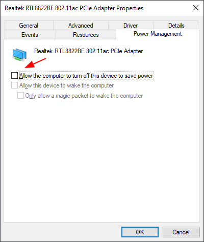


# Add a user in Win10

1. From the Start menu, navigate to Settings.
   
   Note:
   For help navigating, see Get around in Windows.

2. Select Accounts.

3. In the left menu, select Family & other users.

4. Click `Add someone else to this PC`.

5. Choose whether to create a Microsoft account or a local account.
   To create a local account:
   
   a. At the bottom, click I don't have this person's sign-in information.
   
   b. Click `Add a user without a Microsoft account`.
   
   c. Enter a username and, if desired, a password.

      See: https://www.youtube.com/watch?v=tqbx8cqzysw

# Turn off Compatibility Telemetry in Windows 10

This was really annoying on my Win10 64 Pro VM in Parallels!

Soution is from number two from  [here](https://www.easeus.com/partition-manager-software/fix-windows-10-microsoft-compatibility-telemetry-high-disk-usage.html).

1. Press the Windows logo key + R  then type `regedit` in the box and click OK.

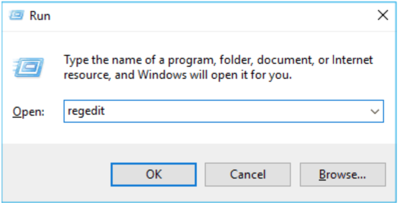

2. Click `YES` when prompted by User Account Control.

3. Go to:

```
HKEY_LOCAL_MACHINE > SOFTWARE > Policies > Microsoft > Windows > DataCollection
```

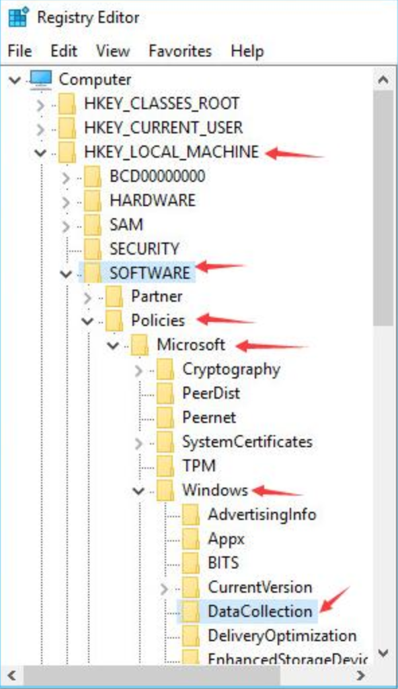

3. Right-click on `DataCollection` and choose `New > DWORD (32-bit) Value`. Then name the new value `Allow Telemetry` then double-click `Allow Telemetry`.

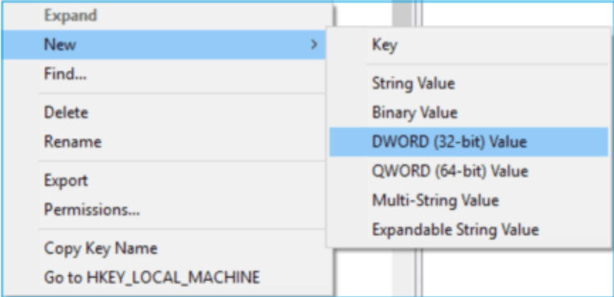


# Connect to Shared Folder on Windows 10 from Mac OS X

Written by: Aseem Kishore, Twitter: @akishore (2018-03016)

who claims thsathis little tutorial will save you hours of frustration...

I recently upgraded one of my computers to Windows 10 and setup a shared folder so that I could easily transfer files from my MacBook Pro and Windows 7 machines to Windows 10 over the home network. I did a clean install of Windows 10, created a shared folder and attempted to connect to my shared folder from OS X.

Unfortunately, I was not able to connect and it took me a little time to figure it out. In this article, I’ll walk you through the steps to connect to a shared folder on Windows 10 from OS X.

**Step 1 – Configure Windows 10 for Sharing**

Obviously, the first thing you’ll need to do is create a shared folder on Windows 10. Right-click on the folder, go to Properties and click on the Sharing tab. Go ahead and share the folder and set the permissions to whatever you desire in terms of access.

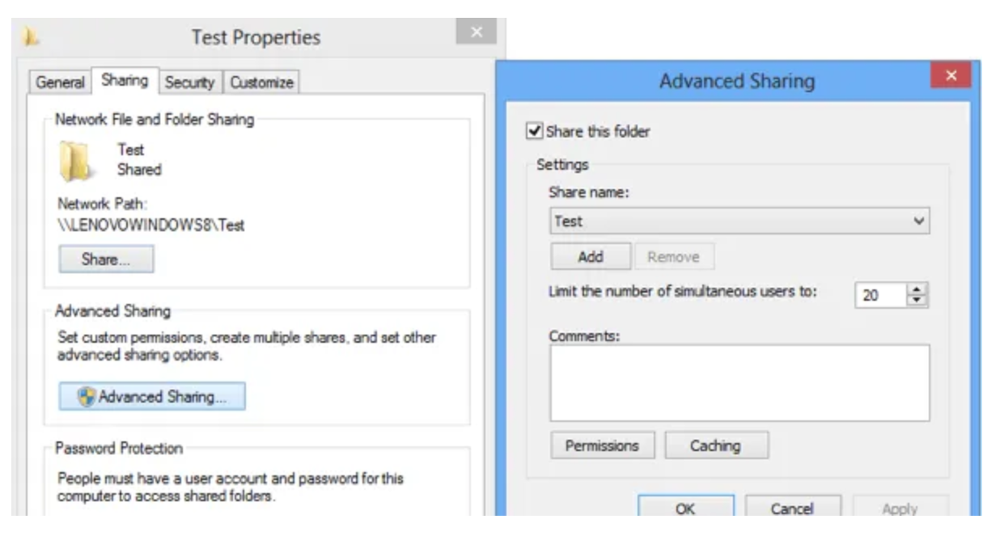

I suggest clicking on Advanced Sharing as you have more fine-grain control over everything. Check the Share this folder box and then give the share a name. Click on Permissions and then add groups or users that you want to give access.

If you want to make it easy and the folder doesn’t have sensitive data, just add the Everyone group and give them Full Control. This way, you’ll be able to access the folder from any computer or device without having to worry about entering credentials.

The next thing you need to do is make sure that File and Printer Sharing is turned on and allowed through the Windows Firewall in Windows 10. Go to Control Panel and click on Windows Defender Firewall. Then click on Allow an app or feature through Windows Firewall.

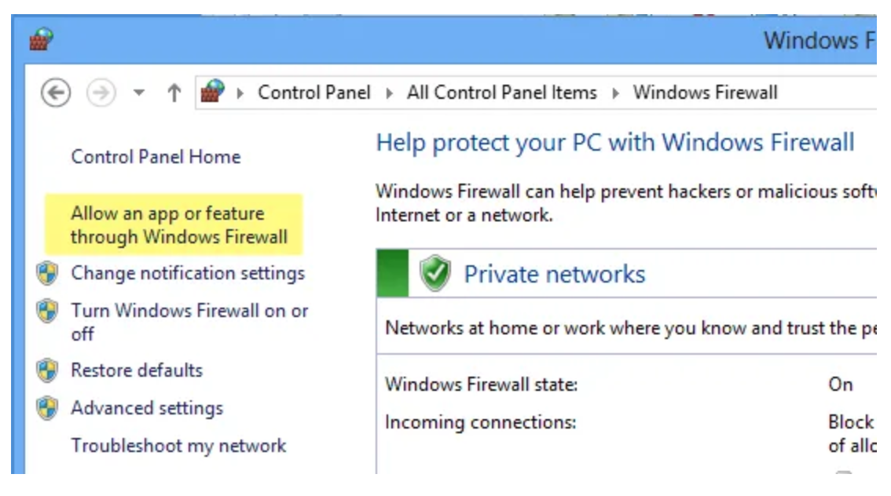

Scroll down until you see File and Printer Sharing and make sure that it is checked for the Private network. You may have to first click on the Change settings button at the top before you can select a box.

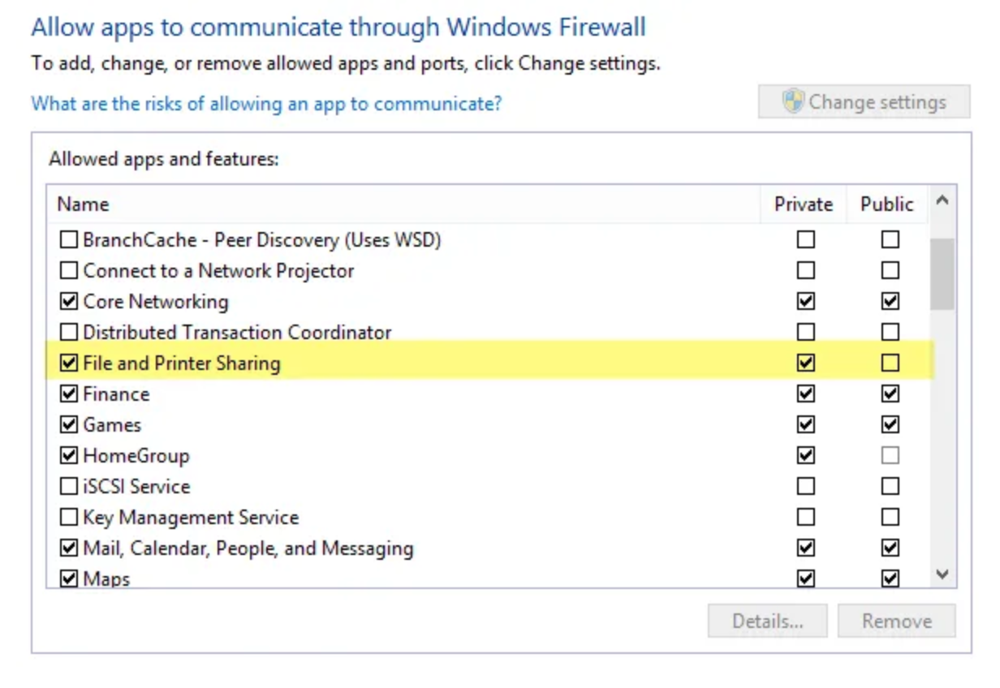

Lastly, you can decide how you want users to access the folder on Windows 10. By default, when connecting from another machine, you have to enter the username and password of an account that has access to that shared folder on Windows 10. If you setup a Windows 10 user account without adding a password, you won’t be able to connect to the shared folder.

You’ll first have to add a password and then you could connect. However, if you feel your home network is super secure, you can always turn off password protected sharing, which means anyone can connect to the shared folder without having to type in a username or password.

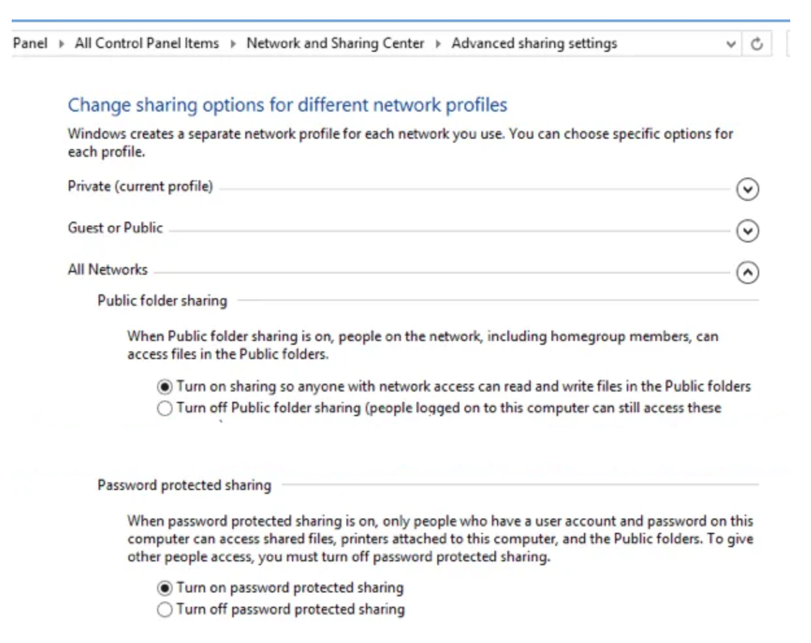

You can do that by going to Control Panel, Network and Sharing Center, Advanced sharing settings and then expanding All Networks. Here you will see an option called Password protected sharing, which you can turn off. I personally keep it turned on, but if you really hate having to type in a username and password to connect, this is an option.

Also, if you use Windows 10 without a password, this would save you from having to setup a password on your account. Note that even if you have a Windows account with a password, if you turn off password protected sharing, then people can still connect without typing any credentials.

**Step 2 – Connect to Windows Shared Folder from OS X**

Finally, on the Mac, open Finder and look under the Shared section for the Windows 10 PC. If Shared is not in the sidebar, you have to add it. With Finder open, click on Finder and then Preferences at the top. Click on Sidebar and check all the items under Shared.

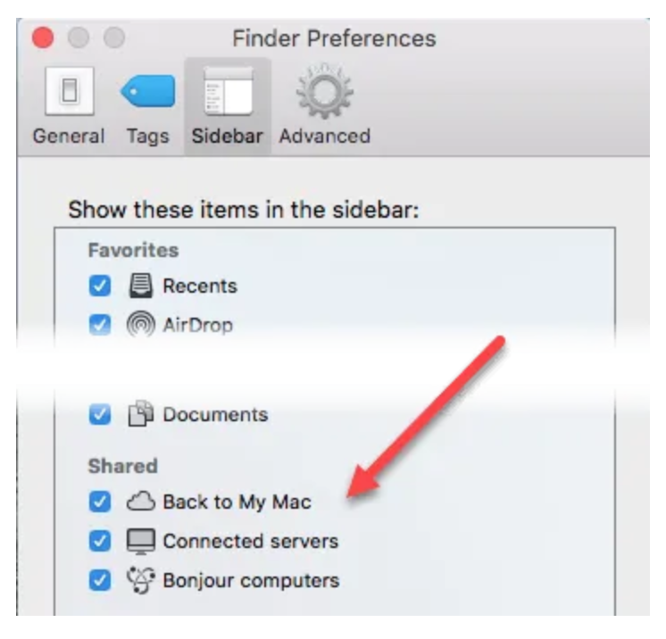

Now go back to Finder and wait till your computer shows up. Note that it can take a little while until the Windows 10 PC shows up. If it doesn’t show up after 5 minutes, try restarting the PC once.

If your Windows PC refuses to show up in the Shared devices list in Finder, you can try connecting manually using SMB. To do that, open Finder and click on Go and then Connect to Server.

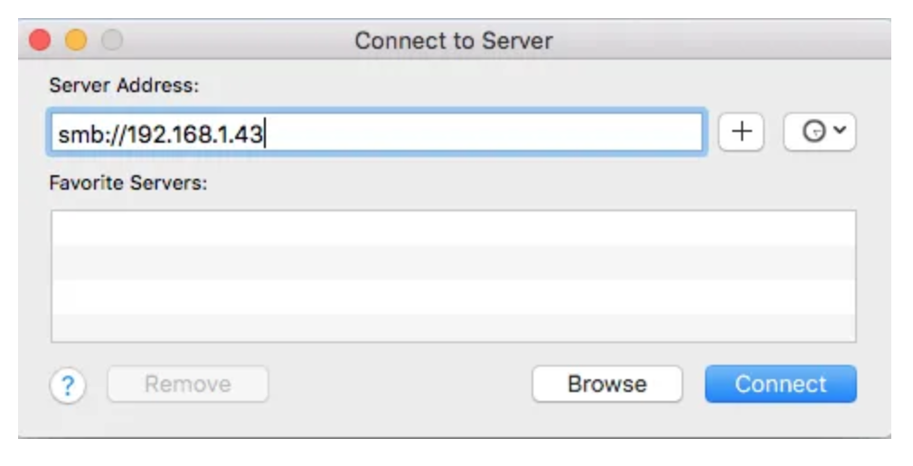

Now type in the following as shown, replacing the IP address below with the IP address of your Windows 10 PC.

```
smb://192.168.1.43
```

Click the Connect button and you’ll be asked to type in credentials again. If that is entered correctly, you’ll be asked which volume you want to mount.

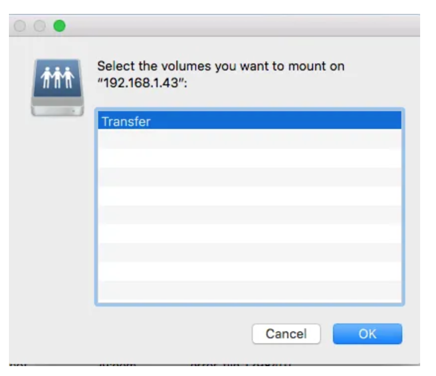

If you’re still not able to connect using SMB, then there is some issue on your Windows PC. You have to make sure the firewall is configured properly.

Once it shows up in the sidebar, go ahead and click on it. When you click on it, it will try to connect and you may get a message saying Connection Failed or Not Connected.

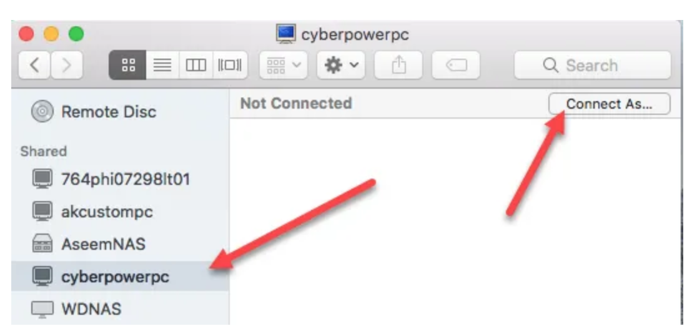

That’s OK! That’s where that password protected folder setting in Windows 10 comes into play. If it’s turned on, you need to connect using the Windows 10 account credentials. You can do that by clicking the Connect As button at the top right.

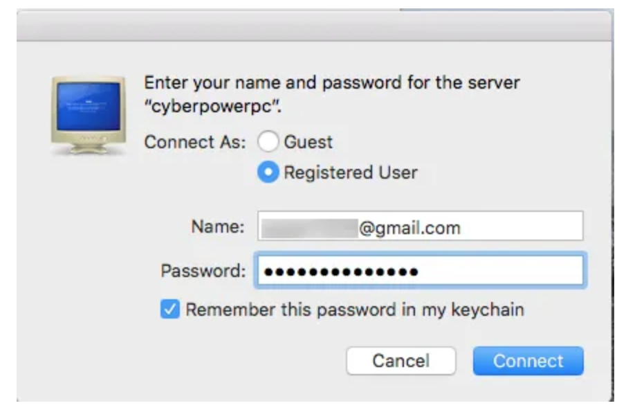

Go ahead and type in your credentials and then click OK. Note that if it’s a Microsoft account you have setup on Windows 10, you’ll need to type in the full email address and the same password that you use to login to your Microsoft account.


That’s about it! Now you should see the Windows 10 shared folders in Finder on your Mac. If you have any questions about connecting to Windows 10 PC from a Mac, post a comment here and I’ll try to help out. Enjoy!


# Change the size of desktop icons

How to Change the Size of Desktop Icons in Windows 10

1. Right-click on an empty space on the desktop.
2. Select View from the contextual menu.
3. Select either Large icons, Medium icons, or Small icons...
3. Right-click on an empty space on the desktop.
4. Select Display settings from the contextual menu

# jrmSimulationPC

On 2019-11-29 I purchased an HP OMEN Obelisk Desktop 875-0xxx
PC from BestBuy with 16 GB RAM and an i7-9700 CPU 3GHZ.
It is a nice system. As a gaming PC it has red lights that
that are remincent of a house of ill repute.

The good news is that one can turn off the lights by

1. Search for OMEN Control.
2. Click the Profile. Find the lighting Name field.
3. Change the color - or as I did - turn them off.

See [here](https://support.hp.com/us-en/document/c05238081).

## Enable remote destop on Windows 10

From [windowscentral.com](https://www.windowscentral.com/how-use-remove-desktop-app-connect-pc-windows-10-0)

**How to enable remote connections on your PC**

If you're trying to start a remote connection inside your local network, you
only need to make sure the computer you're trying to access is configured to
allow to handle remote desktop.

**Important**: Windows 10 Home **_doesn't_** include support for remote desktop
connections, **you can only enable this feature on Windows 10 Pro** and
business variants of the operating system.

To allow a remote PC to accept remote connections, do the following:

1. Open Control Panel.

2. Click on System and Security.

3. Click on Allow remote access.

4. Under Remote Desktop make sure to select Allow remote connections to this
computer.

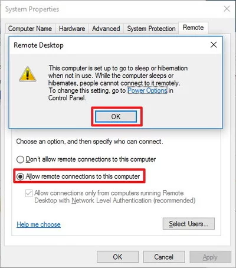

## Fix missing mscomct2.ocx

The ocx control should be in your `Syswow64` (if 64 bit pc) folder and not in
the app folder, and it needs to be registered manually (common vb6 problem in
Win7, 8 ,10).

It seems you can see the file, but it might not be registered.

Run cmd in administrator mode, type `regsvr32 C:\Windows\SysWOW64\MSCOMCTL.OCX`.

This should solve the problem


## Display port problem

DisplayPort No Signal Solved!
In one last desperate attempt to avoid screwing in DVI cables, I tried to get
to the bottom of this once and for all. I did some further searching round the
Internet and found that a few other people had encountered this issue before.

To solve this issue, it turned out to be as basic as:

1. Turn off the PC.
2. Disconnect the PC from its power source.
3. Disconnect all monitors
4. Unplug the monitor you’re having issues with from its power source.
5. Wait approximately 1 minute.
6. Reconnect ONLY the monitor you were having issues with to the power, and
to the PC.
7. Reconnect the PC to the power source.
8. Turn on the PC.


# Some tips

1. **Steps Recorder**
   a. Type "Steps recorder" in search box.
   

# Manually clean up Win10 PCs

How to manually delete cache files and unneeded files in Win 10.
From a [youtube](https://www.youtube.com/watch?v=z3cjTqCQemU) video.

1. Start Windows Explorer.
2. Go to the C:\\ drive.
3. There may be a Windows.old folder (more later)
4. Go into the **Windows** directory
5. Find the **Software Distribution** Folder. Open the **Download** folder. This is all downloaded files. Highlight and delete all. Use the **Delete** Key
6. Use **Windows** + **R** Key to get a Run box. Enter %temp% and OK. This will take you to the temp folder. You can delete all the content. Note: you can add a delete key to the menu bar from the dropdown menu.
7. Run Box. enter **temp**. Continue. Delete all content.
8. Run Box. emter **prefetch**.
9. Run Box. Enter **wsreset**,
10. Clear Edge cache
11. Start > Settings >  Privacy > Clear
12. Admin command prompt > ipconfig/flushDNS
13. Runbar type clean get Disk Cleanup
14. System Restore. Delete old restore and create a new one.


# Create a System Recovery Drive in Win 10

From [here](https://www.partitionwizard.com/clone-disk/cant-create-recovery-drive-win10.html).

If you’re running Windows 10, you need to create USB recovery drive that allows
you to restore your system from a restore point, an image backup, or through a
complete reinstall if Windows won't allow to access. Same with Windows 8,
Windows 10 offers the option to create recovery drive. First of all, let's have
a quick review on how to create USB recovery drive:

This post tells how to create a Windows 8 recovery disk.

## Before you do...

1. Prepare a USB drive that is no smaller than 4 GB.
2. Make sure your USB drive is connected successfully.
3. Make sure your computer is running Windows 10.

## Step 1

At Search bar type: create recovery drive. Windows 10 will list the best match
and the specific utility will appear in the first place. Please hit Enter on
your keyboard then.

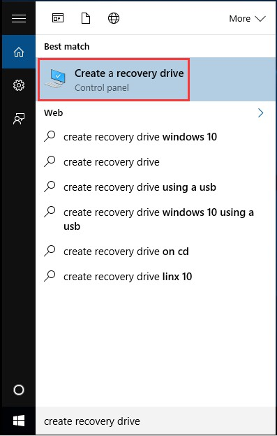

## Step 2

The Recovery Drive utility comes out immediately. Please keep the option
`Back up system files to the recovery drive` checked (to back up system files
necessary for a full reinstall) and continue.

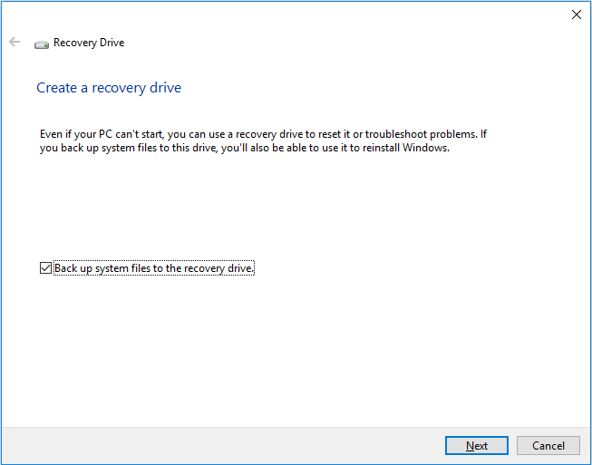

## Step 3

Please wait patiently until the wizard successfully detects your USB drive and
gets prepared to copy files. Then press `Next` to go on.

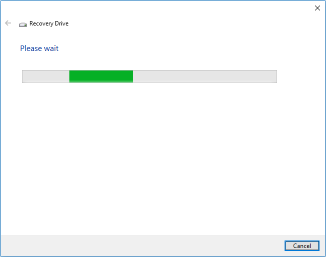


## Step 4

You will receive a warning message saying everything on the USB drive will be
deleted. Please make sure you have made a backup of the important data if there
is any before you continue.

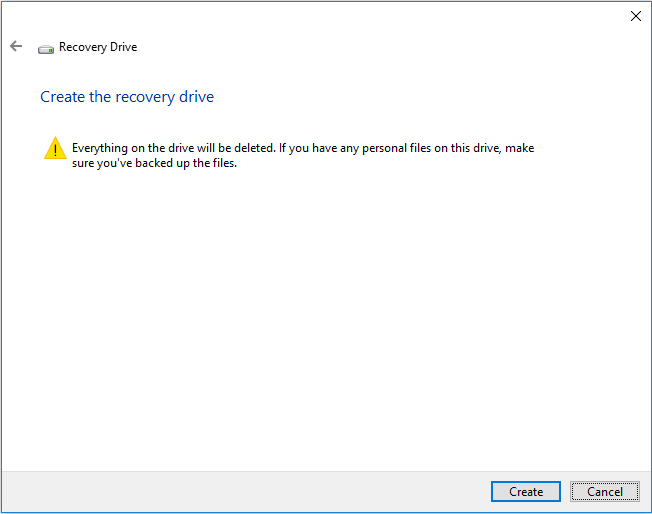

## Step 5

Creating the recovery drive can take some time. You should wait patiently or
you can go for something else.

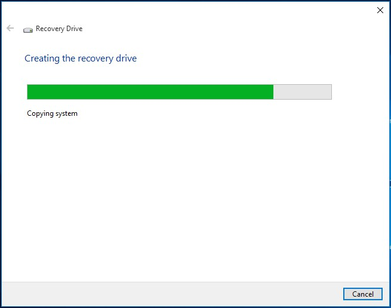

## Step 6

When the recovery drive is ready, click `Finish`.

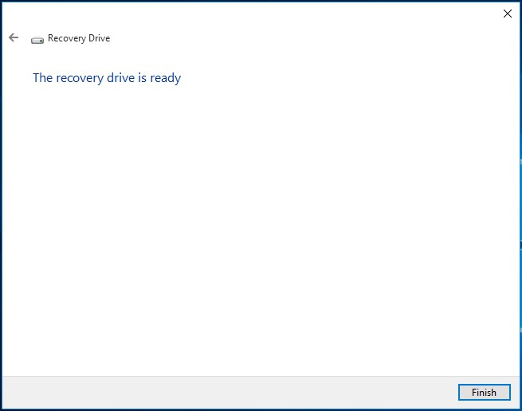

## Tip

No product key is required when using a Recovery Drive to reinstall Windows 10.
But if you do a complete reinstall, you are likely to be required to enter your
Product ID number to prove that you can legally run Windows 10 on this machine.
So you should Google a product which can save the Product ID number and help
you activate Windows 10.

## Countermeasures

1. If creating recovery drive in Windows 10 fails, it seems your PC is
suffering from a corrupted system file. Here’s how to find out and hopefully fix it:

**Step 1:** Type `cmd` in the `Search` field. In the search results,
**right-click** `Command Prompt` and select `Run as administrator`.

2. Once you’re inside the command environment, type `sfc/scannow` and press
`Enter`. The System File Checker (SFC) program will examine Windows files and
replace any that appear to be corrupt. This scan usually takes about several
minutes only.

3. After the scan, exit command prompt and try creating Windows 10 recovery
drive again.

4. Solution 2: Try another Flash Drive...


# Sources of OpenJDK

See [ojdkbuild](https://github.com/ojdkbuild/ojdkbuild)

# SHA2 support required for Win7 after July 2019

From [slashdot](https://tech.slashdot.org/story/19/02/19/0356237/windows-7-users-you-need-sha-2-support-or-no-windows-updates-after-july-2019) and 
[zdnet.com](https://www.zdnet.com/article/windows-7-users-you-need-sha-2-support-or-no-windows-updates-after-july-2019/).

[Microsoft](https://support.microsoft.com/en-us/help/4472027/2019-sha-2-code-signing-support-requirement-for-windows-and-wsus) will update the process as the date gets closer.


# Fix multiple reinstall of win10 updates

1. run admin command prompt

```
    sfc /scannow
```

2. Check log

```
    subl  C:\Windows\Logs\CBS\CBS.log
```

# Manual cleanup of Win10

How to manually delete cache files and unneeded files in Win 10. From a 
[Youtube](https://www.youtube.com/watch?v=z3cjTqCQemU).

1. Start Windows Explorer.

2. Go to the `C:\` drive.

3. There may be a Windows.old folder. Delete this.

4. Go into the **Windows** directory. Find the **Software Distribution** Folder.
Open the **Download** folder. This is all downloaded files. Highlight and delete
all the files using the **Delete** key.

5. Use **Windows** + **R** Key to get a Run box. Enter `%temp%` and `OK`. This
will take you to the temp folder. You can delete all the content. **Note**: you
can add a delete key to the menu bar from the dropdown menu on the top window.

6. Run Box. enter **temp**. Continue. Delete all content.

7. Run Box. Enter **prefetch**.

8. Run Box. Enter **wsreset**.

9. Clear the Edge browser cache.

10. `Start` > `Settings` >  `Privac`y > `Clear`.

11. Open an Administrator command prompt. Type: `ipconfig/flushDNS`.

12. Run Box. Enter clean.  Get Disk Cleanup.

13. System Restore. Delete old restors and create a new one.

# Backup fails with `0x8007002`

## If all else fails...

PC recommends [AOMEI Backupper](https://www.aomeitech.com/download.html)...

## Key Comments

**Note**: I could never get this to work on `crunch`. Further research suggests that
these cannot be easily restored see [this](https://lennox-it.uk/a-complete-guide-to-wbadmin-windows-backups)
article.

The problem that started all this was that my backups
would fail with a crypic error (`0x8007002`). I ultimately deleted my backups and
started a clean backup with just the `L:` drive loaded. 


## Another search

This [comment](https://social.technet.microsoft.com/Forums/en-US/6d84b1aa-956c-4216-9e56-e776e4bbf5c4/statuswait2-0x80070002-error-when-using-windows-7-style-backup-in-windows-10?forum=win10itprogeneral) from 2018-02-28 was interesting. Might be worth trying if the current attempt fails...

**The suggestion**:

Please try the following steps and check the result.

1. In `Control Panel`, open `Backup and Restore`.

2. In the `Backup` section, click `Change settings`. In the `Set up backup` dialog box, click `Next`.

3. In the **What do you want to back up** dialog box, click `Let me choose`, and then click `Next`.

4. Expand `Data Files`, expand `<your user name> Libraries`.

5. Expand `Additional` Locations, and then click to clear the `AppData` folder, `Contacts`, and `Searches` check boxes.

6. Expand `Computer`, expand the item for your system drive (for example, expand `Local Disk (C:)`), Expand `Users`, expand `<your user name>`, and then click to select the `AppData`, `Contacts`, and `Searches` check boxes if they exist. Click `Next`, and then click `Save` settings and exit.

7. In `Backup and Restore`, click `Back up now` to perform a new backup. The backup operation should complete without errors.

If the problem still persists, I suppose that there might be something wrong with your system, you may need to perform a clean install.


## Similar advice from 2009-06-11

From [here](https://social.technet.microsoft.com/Forums/windows/en-US/148b768b-4a25-4c05-a333-447a487d0a44/windows-backup-error-code-0x8100002f?forum=w7itprogeneral).

Looks like the updated locations of your folders are not getting reflected in your libraries. We will investigate on the issue. Meanwhile, as a workaround, please try the following:


1. Click on `Change backup settings` from troubleshoot dialog
2. Expand the `user node` whose libraries are getting reported as skipped.
3. Deselect the library that is causing the issue.
4. Expand the `Computer`  node in the treeview and select the redirected location of the folders. 
5. Save settings.

You should not hit the skipped files issue after this.  Hope this helps.

Thanks,
Sneha [MSFT]

## Backup in safe mode

From [www.easeus.com](https://www.easeus.com/todo-backup-resource/backup-files-in-safe-mode.html)

Lots of things can cause your system fail to boot. If you can load Windows 10/8/7 successfully, you can try Windows recovery options to restore your system back. If you cannot boot Windows normally, you should handle this situation carefully.

To prevent data loss in the process of restoring the system, you need to backup files in Safe Mode in advance. Generally, when your system is unable to boot Windows normally, you can enter Safe Mode.

However, most of the backup program will not work in Safe Mode. Luckily, no matter you are running Windows 7, Windows 8 or Windows 10, you can always use WBadmin commands to backup your computer data.

Steps to Backup Files in Safe Mode with the Help of Command Prompt

1. Start your computer, and press the F8 key repeatedly before showing the Windows logo.

2. It will lead you to Advanced Boot Options. From there, select Safe Mode with Command Prompt.

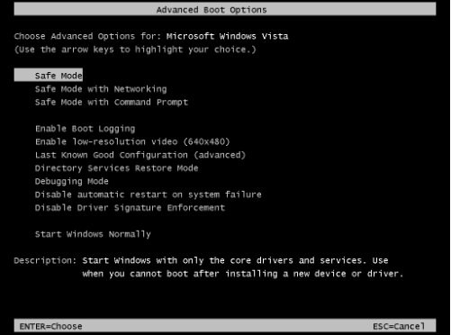

select safe mode with command prompt

3. Within the command prompt, you can enter a WBadmin command to backup your data. For example, if you want to backup all the data saved on C: drive to F: drive, then you can type:

```
Wbadmin start backup -backuptarget:L: -include:C:
```

If you can't boot into you cannot even boot into Safe Mode, you can still backup your files without any requirements for Windows system.


# File times on Win 7

Had some problems with incorrect file creation times for my penepma simulations.
[Superuser.com](https://superuser.com/questions/715536/wrong-date-created-for-files-in-windows-when-copying-files-if-the-file-has-alre)
recommended a registry fix. Testing now...

# Get a command prompt in a folder

From [stackoverflow](https://stackoverflow.com/questions/378319/windows-explorer-command-prompt-here/379804):

Type `cmd` to **location bar**. That's it. It will start a new command
prompt in current path. This solution was confirmed to work in Windows XP,
Vista, 7, 8 and 10 (including Creators Update).

**Shortcut** to move focus to the location bar: `Alt-D` in English, so the
quick way is `Alt-D cmd`.


# Win 10 ideas

- **To get sysinfo:** Go to the Windows Run ("Windows key + R" shortcut)
and then type `msinfo32`


# See chkdsk output

1. Run `chkdsk`. Note: on **crunch** it took a *long* time (about 20 hrs)...

2. Press the Windows + R keys to open the Run dialog, type `eventvwr.msc`,
and press Enter. If prompted by UAC, then click on Yes.


3. In the left pane of Event Viewer, double click on Windows Logs to expand it, then right click on Application and click on Find.

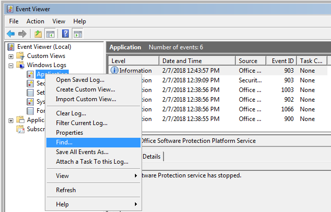
4. The information is in the `Details area`

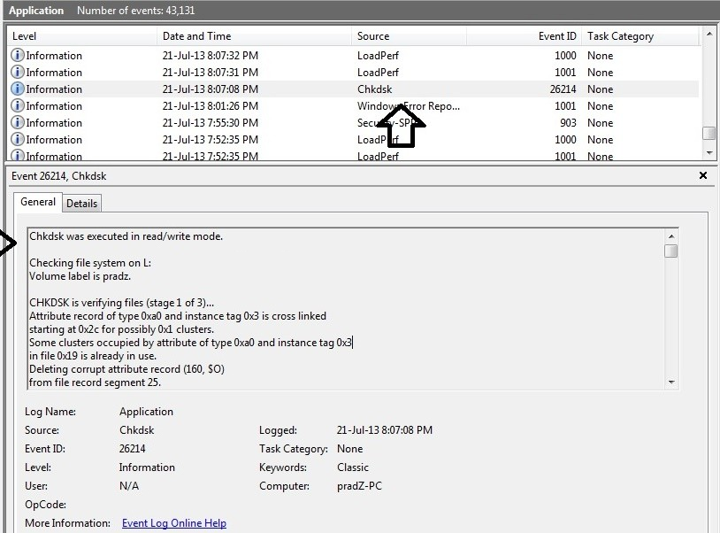

My most recent was:

```
Checking file system on C:
The type of the file system is NTFS.

A disk check has been scheduled.
Windows will now check the disk.                         

CHKDSK is verifying files (stage 1 of 5)...
  1194752 file records processed.                                          File verification completed.
  1449 large file records processed.                                      0 bad file records processed.                                        2 EA records processed.                                              103 reparse records processed.                                       CHKDSK is verifying indexes (stage 2 of 5)...
  1481876 index entries processed.                                         Index verification completed.
  0 unindexed files scanned.                                           0 unindexed files recovered.                                       CHKDSK is verifying security descriptors (stage 3 of 5)...
  1194752 file SDs/SIDs processed.                                         Cleaning up 819 unused index entries from index $SII of file 0x9.
Cleaning up 819 unused index entries from index $SDH of file 0x9.
Cleaning up 819 unused security descriptors.
Security descriptor verification completed.
  143563 data files processed.                                            CHKDSK is verifying Usn Journal...
  34692312 USN bytes processed.                                             Usn Journal verification completed.
CHKDSK is verifying file data (stage 4 of 5)...
  1194736 files processed.                                                 File data verification completed.
CHKDSK is verifying free space (stage 5 of 5)...
  191685679 free clusters processed.                                         Free space verification is complete.
CHKDSK discovered free space marked as allocated in the
master file table (MFT) bitmap.
CHKDSK discovered free space marked as allocated in the volume bitmap.
Windows has made corrections to the file system.

 982185983 KB total disk space.
 213715412 KB in 819720 files.
    401488 KB in 143564 indexes.
         0 KB in bad sectors.
   1326363 KB in use by the system.
     65536 KB occupied by the log file.
 766742720 KB available on disk.

      4096 bytes in each allocation unit.
 245546495 total allocation units on disk.
 191685680 allocation units available on disk.

Internal Info:
00 3b 12 00 ff b0 0e 00 0a 77 1a 00 00 00 00 00  .;.......w......
a4 06 00 00 67 00 00 00 00 00 00 00 00 00 00 00  ....g...........
00 00 00 00 00 00 00 00 00 00 00 00 00 00 00 00  ................

Windows has finished checking your disk.
Please wait while your computer restarts.

```


# Windows tips from the [Probe Software Forum](http://probesoftware.com/smf/index.php?topic=996.0)

## Easy access to command window

John Donovan noted that in Windows Explorer, when you hold the shift key
and right-click the mouse on a folder, you get this menu

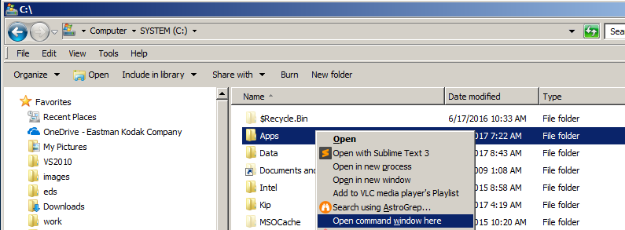

## An easy dated log file

Mike Matthews responded with another helpful tip:

> One tip I got told that I find particularly useful for keeping a
> maintenance log file: open a new text file and put .LOG on it's own
> on the first line. Every time you open the file thereafter the current
> date and time is automatically appended to the end of the file. Put a
> shortcut to the file on the desktop and it becomes super easy to add
> date stamped log entries as and when you need.


# Command Line Fu

## Change a drive letter from the command line.

Note this example where I change K to F

1. Start `diskpart` and list the volumes

```
> diskpart

Microsoft DiskPart version 6.1.7601
Copyright (C) 1999-2008 Microsoft Corporation.
On computer: CRUNCH

DISKPART> list volume

  Volume ###  Ltr  Label        Fs     Type        Size     Status     Info
  ----------  ---  -----------  -----  ----------  -------  ---------  --------
  Volume 0     E                       DVD-ROM         0 B  No Media
  Volume 1     C                NTFS   Partition    936 GB  Healthy    Boot
  Volume 2     D   Data         NTFS   Partition    926 GB  Healthy
  Volume 3                      FAT32  Partition    100 MB  Healthy    System
  Volume 4     L   JRM-DATA     NTFS   Partition    931 GB  Healthy
  Volume 5     K   Sneaker64    exFAT  Removable     57 GB  Healthy
  Volume 6     G                       Removable       0 B  No Media
  Volume 7     H                       Removable       0 B  No Media
  Volume 8     I                       Removable       0 B  No Media
  Volume 9     J                       Removable       0 B  No Media
```

2. Select the volume to change. Make sure the desired letter is
available. If so change it (in this case to `F`).

```
DISKPART> select volume 5

Volume 5 is the selected volume.

DISKPART> assign letter=F
```

## Create a USB Win 7 System Restore USB

From [http://www.lazesoft.com/](http://www.lazesoft.com/windows-recovery/build-a-windows-7-usb-system-repair-disc.html)

**Second Method: Manually create a Windows 7 USB bootable system**
**recovery USB flash disk**

You can also create a USB bootable system recovery USB flash disk under Windows 7. However, this process is somewhat complicated and you must burn a DVD to write a USB disk. Windows 7 cannot directly build a system recovery flash drive.

1. Open 'Backup and Restore' by clicking the Windows 7 <Start> button, clicking <Control Panel>, clicking <System and Maintenance>, and then clicking <Backup and Restore>.

2. In the left pane, click <Create a system repair disc>. (If you are prompted for an administrator password or confirmation when open the tool, type the password or provide confirmation.)

3. Select your DVD drive. Insert a blank DVD into the DVD drive and then click the <Create disc> button to start creating a bootable DVD.

4. Wait for the burning task to complete.

5. When the Windows 7 repair DVD is ready, you can now create a Windows 7 recovery USB drive. Insert your USB flash drive into your computer and backup information files on it.

6. Open 'Command Prompt' with administrator privileges. To do this, right click 'Command Prompt' and then select 'Run as administrator'. The 'Command Prompt' option is on the 'All programs -> Accessories' menu.

7. Type 'DISKPART' and press <Enter>.

8. Type 'SELECT DISK 1' and press <Enter>. (Replace '1' with your USB disk number)

9. Type 'CLEAN' and press <Enter>.

10. Type 'CREATE PARTITION PRIMARY' and press <Enter>.

11. Type 'SELECT PARTITION 1' and press <Enter>.

12. Type 'ACTIVE' and press <Enter>.

13. Type 'FORMAT FS=NTFS' and press <Enter>.

14. Type 'ASSIGN' and press <Enter>.

15. Type 'EXIT' and press <Enter>.

16. Now, copy all the files and folders (contains three items) on the previously created repair DVD to the USB flash drive. You can use your bootable USB disk now.


## Change the command line prompt.

When running git bash from a Windows command window the long default
path (the current directory) which is typically helpful


These codes are available (prompt/?)

```
  $A   & (Ampersand)
  $B   | (pipe)
  $C   ( (Left parenthesis)
  $D   Current date
  $E   Escape code (ASCII code 27)
  $F   ) (Right parenthesis)
  $G   > (greater-than sign)
  $H   Backspace (erases previous character)
  $L   < (less-than sign)
  $N   Current drive
  $P   Current drive and path
  $Q   = (equal sign)
  $S     (space)
  $T   Current time
  $V   Windows version number
```

I like prompt `$G $S` and set this in `sp.bat` in my local dir, so 
`sp` (simple prompt) works from the command line.

## Delete a directory from the command line

This will bypass Trash! Make sure the directory is not being used.
You may need to log out and back on. See the example below:

> `rd /s C:\Apps\msys64`

This was great. After removing MSYS2 with the installer, it took forever
to remove what was left behind. Would be great of old TexLive installs.

## Location of the backup drive letter in the registry

`HKEY_LOCAL_MACHINE\SOFTWARE\Microsoft\Windows\CurrentVersion\WindowsBackup\ScheduleParams\TargetDevice`

## Some tips from SoftwareCarpentry and elsewhere

### Install Git

1. **Install the latest git**: Get the latest installer
[here](https://git-for-windows.github.io/). Run with the steps
below:

- Click on `Next` two times.
- Select: \
`Use a TrueType font in all console windows.`
- Click on `Next` two times.
- Select: \
`Use Git and optional Unix tools from the Windows Command Prompt` \
and click on `Next`. If you forgot to do this programs that you
need for the workshop will not work properly. If this happens rerun
the installer and select the appropriate option.
- Click on `Next`.
- Select: \
`Use Windows' default console window"` \
and click on `Next` five times.
- Click on `Install`
- Click on `Finish`.
- Download the
[win32 nano](https://www.nano-editor.org/dist/win32-support/)
`nano` executable, copy it to the
`C:\Program Files\Git\usr\bin` folder and change the name to
`nano.exe`.

2. Make sure your **HOME** environment is properly set.
- Open command prompt (Open Start Menu then type **cmd** and press [Enter])
- Type the following line into the command prompt window exactly as shown: \
`setx HOME "%USERPROFILE%"` \
You should see: \
`SUCCESS: Specified value was saved.`

- Quit command prompt by typing `exit` then pressing [Enter] \
This will provide you with both Git and Bash in the Git Bash program.

3. Add \
`C:\Program Files\Sublime Text 3` \
to your path. You will then be able to edit the python file `foo.py`
by typing \
`subl foo.py`

### Work from the command line

I tend to store source files on my network share in a sub-folder: \
`/src/sqlite` \
and on my local computer in the `Documents` folder like \
`C:/Users/userid\Documents/src/software-carpentry/2012/sql` \
Note that Windows happily accepts `/` for `\`.
These makes long paths are a pain when using the command window on
Windows when working from the command line.
It simplifies matters to work on files in `C:/tmp`


## Register an OCX file

From the directory: 

```
Regsvr32 /u foo.ocx
```

## Install or remove a program

To install:

```
  C:\> MSIEXEC /I /QB software-name.MSI
```

To remove:

```
  C:\> MSIEXEC /X /QB software-name.MSI
```

(`/QB` tells msiexec to install the app with the default options, and throw up no gui dialogs)

**N. B.:** Consider the [Chocolatey](https://chocolatey.org/) package manager.

# Win 7 and 10

## Fix the MBR on Win 10

From: [superuser.com](http://superuser.com/questions/949219/how-to-fix-windows-10-boot-loader-from-windows):

from an administrator command prompt:

```
bootsect /nt60 C: /mbr
```

## Clean Installs

Nice series from **techsupportalert.com**
[Part 1](http://www.techsupportalert.com/partitioning-hard-drives-1.htm),
[Part 2](http://www.techsupportalert.com/partitioning-hard-drives-2.htm),
and [Part 3](http://www.techsupportalert.com/partitioning-hard-drives-3.htm).

See also [pcadvisor](http://www.pcadvisor.co.uk/how-to/windows/how-reinstall-windows-reinstall-windows-10-reinstall-windows-10-3535423/).

[partition wizard](https://www.partitionwizard.com/faqvideo/how-to-build-free-bootable-partition-manager-with-pwfree91-iso.html) and dealing with the [missing os](https://www.partitionwizard.com/partitionmagic/missing-os-after-upgrading-windows-10.html) problem.


Nice detailed instructions for Win7:

1. [about.com](http://pcsupport.about.com/od/operatingsystems/ss/windows-7-clean-install-part-1.htm#step1), 

2. The [Microsoft](https://support.microsoft.com/en-us/help/15088/windows-create-installation-media) how to download installation media, esp. [Win7](https://www.microsoft.com/en-us/software-download/windows7).

3. [Barnacules](https://www.youtube.com/watch?v=k9EA4t3GHwk) video. Especially helpful because he deals with drivers needed at install time and the endless updates...

4. [The Beginner Guide](https://www.youtube.com/watch?v=-V63GbpyNqs) has nice partitioning example.

5. [HowTo Geek](http://www.howtogeek.com/172580/how-to-create-a-separate-data-partition-for-windows/) has a nice article.

6. **DIY PC Repairs** has a pair of short, videos demonstrating how to first reformat the drive and do a clean install of Win 7 and then split the drive into separate partitions. [Part 1](https://www.youtube.com/watch?v=mME9VLT7-xw) - the clean install with a single large partition. [Part 2](https://www.youtube.com/watch?v=i5_wI5YqMjI) - splitting the large partition.  


Not to mention  [How to completely clean install Windows 10 on a UEFI PC](https://petermeinl.wordpress.com/2015/09/06/how-to-really-do-a-clean-install-of-windows-10-on-a-uefi-pc/)....


Consider [DriverMax](http://www.drivermax.com/)

And the drivers for the
[ASUS CM6870](https://www.asus.com/us/support/Download/14/11/6/19/kitfFCbsOpUyO2nz/30/).
Consider unzipping them and putting the on a USB drive (**DO NOT plug it into a USB 3 port!**).


Win7 Antivirus - [AVG](http://www.avg.com/us-en/download-antivirus-for-windows)


## Locations

Start Menu Entries

```
C:\ProgramData\Microsoft\Windows\Start Menu\Programs
```

Themes

```
%USERPROFILE%\AppData\Local\Microsoft\Windows\Themes
```

Quick Launch

```
%USERPROFILE%\AppData\Roaming\Microsoft\Internet Explorer\Quick Launch
```

Most other application configurations...

```
%USERPROFILE%\AppData\Local
```

and

```
%USERPROFILE%\AppData\Roaming
```

## Environment Variables

```
+---------------------------+------------------------------------------+
|   Environment Variable    |             Default Path                 |
+---------------------------+------------------------------------------+
| %ALLUSERSPROFILE%         | C:\ProgramData                           |
| %APPDATA%                 | C:\Users\{username}\AppData\Roaming      |
| %COMMONPROGRAMFILES%      | C:\Program Files\Common Files            |
| %COMMONPROGRAMFILES(x86)% | C:\Program Files (x86)\Common Files      |
| %COMSPEC%                 | C:\Windows\System32\cmd.exe              |
| %HOMEDRIVE%               | C:                                       |
| %HOMEPATH%                | C:\Users\{username}                      |
| %LOCALAPPDATA%            | C:\Users\{username}\AppData\Local        |
| %PROGRAMDATA%             | C:\ProgramData                           |
| %PROGRAMFILES%            | C:\Program Files                         |
| %PROGRAMFILES(X86)%       | C:\Program Files (x86) (only in 64-bit)  |
| %PUBLIC%                  | C:\Users\Public                          |
| %SystemDrive%             | C:                                       |
| %SystemRoot%              | C:\Windows                               |
| %TEMP% and %TMP%          | C:\Users\{username}\AppData\Local\Temp   |
| %USERPROFILE%             | C:\Users\{username}                      |
| %WINDIR%                  | C:\Windows                               |
+---------------------------+------------------------------------------+
```

Couldn't get the escape characters to work in Rmarkdown...

from [askvg.com](http://www.askvg.com/list-of-environment-variables-in-windows-xp-vista-and-7/)


## Turning off Cortana

According to [zdnet.com](http://www.zdnet.com/article/windows-10-tip-turn-off-cortana-completely/),
the Windows 10 Anniversary Update made it harder to turn off Cortana. Now we
heed a registry hack on Windows 10 Home.

Find (or create) the key

```
HKLM\Software\Policies\Microsoft\Windows\Windows Search
```

and set the `DWORD` value `AllowCortana` and set it to 0.


## Clear Windows Update cache

From [www.404techsupport.com](https://www.404techsupport.com/2013/01/how-to-delete-cached-windows-updates-in-windows-78/)

> To delete the downloaded updates in Windows Vista, 7, or 8, browse to C:\Windows\SoftwareDistribution\Download. (You may have to show hidden files to browse there.) Then select all the files (Ctrl+A) and delete them. Once the files are deleted, restart the computer.


## How to Install Windows 7-10 from a bootable USB

See [Barnacules youtube](https://www.youtube.com/watch?v=f4e4HujCeg8) video.

[Tool](http://wudt.codeplex.com/) referenced in video

[Alternate tool](http://www.wintobootic.com/) that works with folders and media

[Full end to end instructions](http://social.technet.microsoft.com/wiki/contents/articles/913.using-the-windows-7-usbdvd-download-tool.aspx) on obtaining image and deployment


# Win 10 stuff

## Compatibility Mode

[tenforums.com](http://www.tenforums.com/tutorials/15523-compatibility-mode-settings-apps-change-windows-10-a.html) shows where this information is stored in the registry.

[Microsoft](https://support.microsoft.com/en-us/help/15078/windows-make-older-programs-compatible) has a page designed to help. So does [howtogeek](http://www.howtogeek.com/228689/how-to-make-old-programs-work-on-windows-10/).

There is a [youtube](https://www.youtube.com/watch?v=1KNLP3T5cic) video.


It turns out that the information is stored in the registry. The key is:

```
HKEY_CURRENT_USER\SOFTWARE\Microsoft\Windows NT\CurrentVersion\AppCompatFlags\Layers
```

My current entries on crunch are:

```
"C:\\Apps\\GMRFilm\\GMRFILM.EXE"="WINXPSP2 RUNASADMIN"
"C:\\Program Files (x86)\\ScanSoft\\OmniPagePro12.0\\OmniPage.exe"="$ WRPMitigation"
"C:\\Program Files\\Oxford Instruments NanoAnalysis\\AZtec\\Aztec.exe"="^ WIN7RTM"
```

## Install gets stuck on 'Checking for updates'

[HT http://alinirimia.com/](http://alinirimia.com/2016/04/widows-10-install-stuck-at-checking-for-updates/) was originally from [MS]( http://answers.microsoft.com/en-us/insider/forum/insider_wintp-insider_install/window-10-install-stuck-on-checking-for-updates/e294932f-149e-412b-b996-6f1253973399?auth=1).

1. Go to Start – All Programs – Accessories – right click on Command Prompt and select "Run as administrator""
2. Type net stop wuauserv  (this will stop windows update service)
3. Wait till you get : The windows update service was stopped successfully.
4. Type net start wuauserv  (this will start windows update service)
5. Don't close the Command prompt window, you will need it later.

After that the windows setup will go from Checking for updates to Getting information on your PC and then will go to Getting updates, if you are getting stuck again (I was) repeat 1, 2, 3, 4. After that the window will ask few install questions , if you want to keep apps and data etc , after selecting the options you want it will go again at getting updates and get stuck again.   Go in command prompt and type again **net stop wuauserv** , you will notice that when you type **net start wuauserv** a message will say the service is already started, that is OK . Now the install window will complete getting updates very fast and after the window will change to Ready to install.  Press install and from now on the installer wont get stuck and complete successfully.

## privacy

[security/tips1](http://www.itpro.co.uk/operating-systems/25802/15-windows-10-problems-and-how-to-fix-them-5)

[pc-world](http://www.pcworld.com/article/2971725/windows/how-to-reclaim-your-privacy-in-windows-10-piece-by-piece.html)

[youtube - Barnacules](https://www.youtube.com/watch?v=u1kGMCfb2xw)

## tuning

[config](http://www.makeuseof.com/tag/speed-windows-10-boot-shut/)

[winaero](http://winaero.com/blog/) seems to have some good tips


### Copy a theme

1. Type `Windows-R` to run. Then enter `%localappdata%\Microsoft\Windows\Themes`

the Copy `Custom.theme` to media

## Getting a shortcut to run as an administrator.

Hat tip [cnet](http://www.cnet.com/how-to/always-run-a-program-in-administrator-mode-in-windows-10/)

  

# Cleaning win 7

## Clearing the Win 7  Windows Update cache

[youtube](https://www.youtube.com/watch?v=5r-h5CMJp_A)

## Cleanup tool
[delete old folder](http://www.bleepingcomputer.com/tutorials/delete-windows-old-folder/)

# Connecting to Ubuntu Samba shares from Win7

From [ubuntu forums](http://ubuntuforums.org/showthread.php?t=1942514)

> I resolved my problem connecting my Windows 7 box to my Ubuntu samba (11.10). I Had the "Windows cannot access" error (0x80070035 - the network path was not found" when trying to access the server (or share). I tried a lot of things, but when it came down to what actually solved it (all other items reversed) it was the "Microsoft Network client: Digitally sign communications (always)" setting that was causing my problem. Once it was disabled, I could see the shares and map the drive.

> for the record, my "Microsoft Network client: Digitally sign communications" is set to 0 in the registry.

# Notepad++ style persistence

From [superuser.com](http://superuser.com/questions/214849/how-to-save-font-settings-in-notepad)

There are persistence problems with Notepad++ configurations on Vista/Win7

> As of v5.8.6, theme files are stored under `%PROGRAMFILES(x86)%.` Vista/Win7 will refuse to write to this directory when the application is not run as Administrator. Furthermore, it appears that "Global Override" settings get saved into the active theme file. Hopefully future versions of Notepad++ will store these user-specific theme settings under `%APPDATA%` as the Windows paradigm intends.

The solution is to `run as Administrator` for the configuration to be saved.

# Getting into `safe` mode in Win 7 on ASUS computer (`crunch`)

From [microsoft](https://social.technet.microsoft.com/forums/windows/en-US/2b8419dd-4610-4703-a807-4ef9d862bb6d/f8-does-not-take-me-into-safe-mode)

Two suggestions:

1. From H. A. V. Arinda : use `F5`

2. BF&I approach from Lany Zhang of Microsoft:

> a. Click Start, and type `msconfig` in the search box, and then press Enter.
> b. Select the Boot tab, and check the `Safe boot` in the Boot options section, and set the radio button to `Minimal`, and then click OK.
> c. Select Restart or Exit without restart in the following System Configuration prompt. Either way, the next boot will take you into safe mode.
> d. Note: Make sure you put the computer back to Normal Startup once you are done with the troubleshooting. Just open msconfig the same way as above, and then on the Boot tab uncheck the Safe boot checkbox.


# Create a shortcut to switch between windows in Win 7
Drag the shortcut from to ``%USERPROFILE%\AppData\Roaming\Microsoft\Internet Explorer\Quick Launch\Switch`` the quick launch bar.

Create a similar shortcut of the character map ``%windir%\system32\charmap.exe``

# Use Imagemagick to convert png to pdf from the command line
```
convert sample.png sample.pdf
```
Note: for high resolution (default is 72 dpi) one can add

```
-density 300
```

From [Stackoverflow](http://unix.stackexchange.com/questions/42856/how-can-i-convert-a-png-to-a-pdf-in-high-quality-so-its-not-blurry-or-fuzzy)

# Win7 libraries

[microsoft's tutorial](http://windows.microsoft.com/en-us/windows7/include-folders-in-a-library)

Libraries are a new feature in Win7 that gather content from various folders.

## To include a folder in a library:

1. Open the location of the folder you want to include.
2. Right-click on the folder and select ``Include in library``'.
3. Choose from a Library in the list or create a new one. Note that the folder is linked into the library, but remains in its original location.

## To remove a folder from a library

1. In the task bar, click the ``Windows Explorer`` button.
2. Click the library in the navigation pane.
3. Click ``locations`` at the top of the window.
4. Click the folder you want to remove from the library and then the ``Remove`` button and then ``Ok``. The folder is unlinked from the library but remains in its original location.


# Net use
see [Technet](http://technet.microsoft.com/en-us/library/gg651155.aspx) also see [about.com](http://pcsupport.about.com/od/commandlinereference/p/net-use-command.htm)

## Syntax

```
net use [{<DeviceName> | *}] [\\<ComputerName>\<ShareName>[\<volume>]] [{<Password> | *}]] [/user:[<DomainName>\]<UserName] >[/user:[<DottedDomainName>\]<UserName>] [/user: [<UserName@DottedDomainName>] [/savecred] [/smartcard] [{/delete | /persistent:{yes | no}}]

net use [<DeviceName> [/home[{<Password> | *}] [/delete:{yes | no}]]

net use [/persistent:{yes | no}]
```

## Example

```
net use d:\\server\share /user:Accounts\User1
```


Here's a slightly more complicated example that you might see in a business setting.

In this net use example, I want to map my ``e:`` drive to the ``smithmark`` shared folder on ``usrsvr002``. I want to connect as another user account I have ``[/user]`` by the name of ``msmith2`` that's stored on the ``pdc01`` domain with a password of ``Ue345Ii``. I don't want to map this drive manually every time I start my computer ``[/p:yes]`` nor do I want to enter my username and password each time ``[/savecred]``.

```
net use e: \\usrsvr002\smithmark Ue345Ii /user:pdc01\msmith2 /savecred /p:yes
```

I suppose an appropriate final example of net use would be the removal ``[/delete]`` of a currently mapped drive, in this case ``p:``.

```
net use p: /delete
```


# A setup for Win7/WinXP compatibility

1. On WinXP, create ``C:\Users\userName`` for each user. Create a ``Documents`` folder there. Change ``My Documents`` to point there. This is the default for Win7. We will use this as the user's ``%HOME%`` directory on both systems.

2. Create ``git``, ``work``, and ``src`` directories in each users ``Documents``. Create a ``proj`` directory in ``work``. 

3. Place shared dlls/scripts in ``C:\Apps\local``

4. Install Apps like analySIS, R, texlive, etc that you would like to play well across systems call frequently from the system path into a folder in ``C:\Apps``. Avoid spaces in path names was much as possible. Short is good!!!

# Enabling cut/paste w mouse from cmd window

[MS Technet](http://technet.microsoft.com/en-us/magazine/ff758104.aspx) notes that one can enable copy/paste with the mouse by enabling ``QuickEdit Mode`` in the default command window properties. See also [howto geek](http://www.howtogeek.com/howto/windows-vista/copy-to-the-clipboard-from-the-windows-command-prompt/)

# Poster printing

To use the poster printer in the 8th floor site office

1. **Queue:** ``\\rocps003\PLT4022``
2. Works well with Adobe Reader. Go to ``page setup``
3. **Paper Choice** ``Oversize B0(JIS)``
4. **Paper Source:** Check before use. Typically ``Roll 1`` is satin, ``Roll 2`` is glossy.
5. Make sure you choose best quality - it is slow; typically takes 20 min for a typical poster.

# Re-assigning drive letters

From [superuser.com](http://superuser.com/questions/70295/force-a-usb-device-to-use-a-certain-drive-letter?rq=1)

1. Start | Control Panel | Administrative Tools | Computer Management
2. Click on "Disk Management"
3. Select the USB drive in the list
4. Right-click and "Change Drive Letters and Paths..."
5. Assign a different, unused drive letter.

# Fixing major annoyances

## Quick Launch Bar in Win7

The [howto geek](http://www.howtogeek.com/howto/windows-7/add-the-quick-launch-bar-to-the-taskbar-in-windows-7/) shows us how...

1. Unlock taskbar
2. Create a new toolbar from the menu
3. Type in the location:

```
%appdata%\Microsoft\Internet Explorer\Quick Launch
```

It will be all the way over on the right, so you’ll want to click on the dotted lines and then drag the toolbar all the way to the left (which is slightly tricky sometimes). ***Note that you’ll need to right-click and unlock the taskbar before you can move the toolbar.***

## No context menus in Win 7
This has been a pain for a while on a few systems.
Of all the tips I found on line the instructions
from [here](http://sourceforge.net/p/sevenzip/discussion/45797/thread/838d57cb/) worked

```
1. open regedit
2. open HKEY_CLASSES_ROOT
3. open *
4. open shellex
5. open right click on ContextMenuHandlers and go to permissions
6. click on Advanced
7. check "Replace all child objects permissions with inheritable permissions form this object"
8. hit OK a few times
9. try to right click on a file and see if it shows up.
```

# Environment Variables

A pair of useful lists from
[askvg.com](http://www.askvg.com/list-of-environment-variables-in-windows-xp-vista-and-7/)

## WinXP

```
Environment Variable         Path
%ALLUSERSPROFILE%           C:\Documents and Settings\All Users
%APPDATA%                   C:\Documents and Settings\{username}\Application Data
%COMMONPROGRAMFILES%        C:\Program Files\Common Files
%COMMONPROGRAMFILES(x86)%   C:\Program Files (x86)\Common Files
%COMSPEC%                   C:\Windows\System32\cmd.exe
%HOMEDRIVE%                 C:
%HOMEPATH%                  C:\Documents and Settings\{username}
%PROGRAMFILES%              C:\Program Files
%PROGRAMFILES(X86)%         C:\Program Files (x86) (only in 64-bit version)
%SystemDrive%               C:
%SystemRoot%                C:\Windows
%TEMP% and %TMP%            C:\Documents and Settings\{username}\Local Settings\Temp
%USERPROFILE%               C:\Documents and Settings\{username}
%WINDIR%                    C:\Windows
```

## Vista and Win 7

```
Environment Variable        Path
%ALLUSERSPROFILE%           C:\ProgramData
%APPDATA%                   C:\Users\{username}\AppData\Roaming
%COMMONPROGRAMFILES%        C:\Program Files\Common Files
%COMMONPROGRAMFILES(x86)%   C:\Program Files (x86)\Common Files
%COMSPEC%                   C:\Windows\System32\cmd.exe
%HOMEDRIVE%                 C:
%HOMEPATH%                  C:\Users\{username}
%LOCALAPPDATA%              C:\Users\{username}\AppData\Local
%PROGRAMDATA%               C:\ProgramData
%PROGRAMFILES%              C:\Program Files
%PROGRAMFILES(X86)%         C:\Program Files (x86) (only in 64-bit version)
%PUBLIC%                    C:\Users\Public
%SystemDrive%               C:
%SystemRoot%                C:\Windows
%TEMP% and %TMP%            C:\Users\{username}\AppData\Local\Temp
%USERPROFILE%               C:\Users\{username}
%WINDIR%	                C:\Windows
```


# Win32


## Getting short path names

This one had me ripping my hair out. The solution was
[here](http://answers.google.com/answers/threadview/id/522710.html)


There's a simple way to do it on Win XP:

run ``cmd.exe`` and do the following:
```
cd "long path name"
command
```
Then ``command.com`` will come up and display the short path name.

Note that this will not work on Win7 x64. But one can do this
instead, for example:

```
C:\Program Files>cd c:\
c:\>dir /X
```

Note the fifth column returns the short name

```
 Directory of c:\

11/06/2013  01:00 PM    <DIR>          140260~1     140260dea5eb814742d2cc928a
01/06/2015  08:21 AM    <DIR>                       Apps
12/09/2014  08:54 AM    <DIR>                       Data
08/20/2014  07:14 AM               449              Desktop.lnk
03/05/2014  11:33 AM    <DIR>                       EDAX32
11/06/2013  08:28 AM               353              INSTALL.LOG
12/05/2013  10:30 AM    <DIR>                       Intel
11/17/2014  02:34 PM    <DIR>                       Kip
07/13/2009  10:20 PM    <DIR>                       PerfLogs
12/09/2013  01:54 PM    <DIR>                       process
12/15/2014  08:18 AM    <DIR>          PROGRA~1     Program Files
12/19/2014  07:03 AM    <DIR>          PROGRA~2     Program Files (x86)
10/10/2014  09:19 AM    <DIR>                       Python34
01/06/2015  03:41 PM    <DIR>                       Temp
04/22/2014  08:01 AM    <DIR>          USERIM~1     UserImages
12/06/2013  08:46 AM    <DIR>                       Users
12/16/2014  01:16 PM    <DIR>                       Windows
```

For a long directory with lots of levels one would have to do this at
each level with a space ...

### Power configuration

Hints from [here](http://ss64.com/nt/powercfg.html)

The three built-in power schemes have the GUIDs listed below:

```
SCHEME_MAX = Power saver (Max power saving) 
SCHEME_BALANCED = Balanced (Typical)
SCHEME_MIN = High performance (Min power saving)
```

List all Aliases:

```
powercfg -aliases
```

Retrieve the currently active power scheme

```
Powercfg -getactivescheme
```

Set the Monitor and disc timeouts for the current Power saver scheme

```
Powercfg -Change -monitor-timeout-ac 20
Powercfg -Change -disk-timeout-ac 30
```

Enable the mouse to wake from sleep 

```
Powercfg -deviceEnableWake "Microsoft USB IntelliMouse Explorer"

```

### Database access

Database access on 64 bit systems can be a challenge. Had trouble
getting rWipeTest to run on my Win7_x64 system.

The information from [this article](https://robertoschiabel.wordpress.com/2008/02/28/windows-x64-32bit-odbc-vs-64bit-odbc/)
was interesting.

> It’s important to understand which kind of DSN you have. On an x64 system, you can create an ODBC connection(DSN) on the 32-bit side of the system or on the 64-bit side of the system.
32-bit applications will only see ODBC connections created in the 32-bit side, and 64-bits applications will only see ODBC connections from the 64-bit side. Each kind of application has is own registry.To setup DSN for 32-bit application you must use:

```
%WINDIR%\SysWOW64\odbcad32.exe
```

and for 64-bit application you must use:

```
%WINDIR%\System32\odbcad32.exe
```

> There is not 32-bit edition of Windows XP on the XP Pro x64 media.
> http://support.microsoft.com/kb/942976/en-us

> A 64-bit version of the Microsoft Windows operating system includes the following versions of the Microsoft Open Database Connectivity (ODBC) Data Source Administrator tool (Odbcad32.exe):
- The 32-bit version of the Odbcad32.exe file is located in the %systemdrive%WindowsSysWoW64 folder.
-	The 64-bit version of the Odbcad32.exe file is located in the %systemdrive%WindowsSystem32 folder.
The Odbcad32.exe file displays the following types of data source names (DSNs):
-	System DSNs
-	User DSNs


[Back to Index](../README.html)

