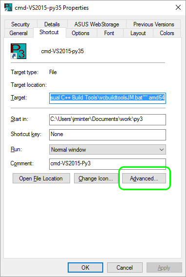
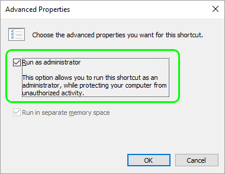

[Back to Index](../README.html)

Some useful tips for windows

# Win 7 and 10

## Locations

Start Menu Entries

```
C:\ProgramData\Microsoft\Windows\Start Menu\Programs
```

Themes

```
%USERPROFILE%\AppData\Local\Microsoft\Windows\Themes
```

Quick Launch

```
%USERPROFILE%\AppData\Roaming\Microsoft\Internet Explorer\Quick Launch
```

Most other application configurations...

```
%USERPROFILE%\AppData\Local
```

and

```
%USERPROFILE%\AppData\Roaming
```

## Environment Variables

```
+---------------------------+------------------------------------------+
|   Environment Variable    |             Default Path                 |
+---------------------------+------------------------------------------+
| %ALLUSERSPROFILE%         | C:\ProgramData                           |
| %APPDATA%                 | C:\Users\{username}\AppData\Roaming      |
| %COMMONPROGRAMFILES%      | C:\Program Files\Common Files            |
| %COMMONPROGRAMFILES(x86)% | C:\Program Files (x86)\Common Files      |
| %COMSPEC%                 | C:\Windows\System32\cmd.exe              |
| %HOMEDRIVE%               | C:                                       |
| %HOMEPATH%                | C:\Users\{username}                      |
| %LOCALAPPDATA%            | C:\Users\{username}\AppData\Local        |
| %PROGRAMDATA%             | C:\ProgramData                           |
| %PROGRAMFILES%            | C:\Program Files                         |
| %PROGRAMFILES(X86)%       | C:\Program Files (x86) (only in 64-bit)  |
| %PUBLIC%                  | C:\Users\Public                          |
| %SystemDrive%             | C:                                       |
| %SystemRoot%              | C:\Windows                               |
| %TEMP% and %TMP%          | C:\Users\{username}\AppData\Local\Temp   |
| %USERPROFILE%             | C:\Users\{username}                      |
| %WINDIR%                  | C:\Windows                               |
+---------------------------+------------------------------------------+
```

Couldn't get the escape characters to work in rmarkdown...

from [askvg.com](http://www.askvg.com/list-of-environment-variables-in-windows-xp-vista-and-7/)


## Turning off Cortana

According to [zdnet.com](http://www.zdnet.com/article/windows-10-tip-turn-off-cortana-completely/),
the Windows 10 Aniversary Update made it harder to turn off Cortana. Now we
heed a registry hack on Windows 10 Home.

Find (or create) the key

```
HKLM\Software\Policies\Microsoft\Windows\Windows Search
```

and set the `DWORD` value `AllowCortana` and set it to 0.


## Clear Windows Update cache

From [www.404techsupport.com](https://www.404techsupport.com/2013/01/how-to-delete-cached-windows-updates-in-windows-78/)

> To delete the downloaded updates in Windows Vista, 7, or 8, browse to C:\Windows\SoftwareDistribution\Download. (You may have to show hidden files to browse there.) Then select all the files (Ctrl+A) and delete them. Once the files are deleted, restart the computer.


## How to Install Windows 7-10 from a bootable USB

See [Barnacules youtube](https://www.youtube.com/watch?v=f4e4HujCeg8) video.

[Tool](http://wudt.codeplex.com/) referenced in video

[Alternate tool](http://www.wintobootic.com/) that works with folders and media

[Full end to end instructions](http://social.technet.microsoft.com/wiki/contents/articles/913.using-the-windows-7-usbdvd-download-tool.aspx) on obtaining image and deployment


# Win 10 stuff

## Compatibility Mode

[tenforums.com](http://www.tenforums.com/tutorials/15523-compatibility-mode-settings-apps-change-windows-10-a.html) shows where this information is stored in the registry.

[Microsoft](https://support.microsoft.com/en-us/help/15078/windows-make-older-programs-compatible) has a page designed to help. So does [howtogeek](http://www.howtogeek.com/228689/how-to-make-old-programs-work-on-windows-10/).

There is a [youtube](https://www.youtube.com/watch?v=1KNLP3T5cic) video.


It turns out that the information is stored in the registry. The key is:

```
HKEY_CURRENT_USER\SOFTWARE\Microsoft\Windows NT\CurrentVersion\AppCompatFlags\Layers
```

My current entries on crunch are:

```
"C:\\Apps\\GMRFilm\\GMRFILM.EXE"="WINXPSP2 RUNASADMIN"
"C:\\Program Files (x86)\\ScanSoft\\OmniPagePro12.0\\OmniPage.exe"="$ WRPMitigation"
"C:\\Program Files\\Oxford Instruments NanoAnalysis\\AZtec\\Aztec.exe"="^ WIN7RTM"
```

## Install gets stuck on 'Checking for updates'

[HT http://alinirimia.com/](http://alinirimia.com/2016/04/widows-10-install-stuck-at-checking-for-updates/) was originally from [MS]( http://answers.microsoft.com/en-us/insider/forum/insider_wintp-insider_install/window-10-install-stuck-on-checking-for-updates/e294932f-149e-412b-b996-6f1253973399?auth=1).

1. Go to Start – All Programs – Accessories – right click on Command Prompt and select "Run as administrator""
2. Type net stop wuauserv  (this will stop windows update service)
3. Wait till you get : The windows update service was stopped successfully.
4. Type net start wuauserv  (this will start windows update service)
5. Dont close the Command prompt window, you will need it later.

After that the windows setup will go from Checking for updates to Getting information on your PC and then will go to Getting updates, if you are getting stuck again (I was) repeat 1, 2, 3, 4. After that the window will ask few install questions , if you want to keep apps and data etc , after selecting the options you want it will go again at getting updates and get stuck again.   Go in command prompt and type again **net stop wuauserv** , you will notice that when you type **net start wuauserv** a message will say the service is already started, that is ok . Now the install window will complete getting updates very fast and after the window will change to Ready to install.  Press install and from now on the installer wont get stuck and complete successfully.

## privacy

[security/tips1](http://www.itpro.co.uk/operating-systems/25802/15-windows-10-problems-and-how-to-fix-them-5)

[pc-world](http://www.pcworld.com/article/2971725/windows/how-to-reclaim-your-privacy-in-windows-10-piece-by-piece.html)

[youtube - Barnacules](https://www.youtube.com/watch?v=u1kGMCfb2xw)

## tuning

[config](http://www.makeuseof.com/tag/speed-windows-10-boot-shut/)

[winaero](http://winaero.com/blog/) seems to have some good tips


### Copy a theme

1. Type `Windows-R` to run. Then enter `%localappdata%\Microsoft\Windows\Themes`

the Copy `Custom.theme` to media

## Getting a shortcut to run as an administrator.

Hat tip [cnet](http://www.cnet.com/how-to/always-run-a-program-in-administrator-mode-in-windows-10/)

  

# Cleaning win 7

## Clearing the Win 7  Windows Update cache

[youtube](https://www.youtube.com/watch?v=5r-h5CMJp_A)

## Cleanup tool
[delete old folder](http://www.bleepingcomputer.com/tutorials/delete-windows-old-folder/)

# Connecting to Ubuntu Samba shares from Win7

From [ubuntu forums](http://ubuntuforums.org/showthread.php?t=1942514)

> I resolved my problem connecting my Windows 7 box to my Ubuntu samba (11.10). I Had the "Windows cannot access" error (0x80070035 - the network path was not found" when trying to access the server (or share). I tried a lot of things, but when it came down to what actually solved it (all other items reversed) it was the "Microsoft Network client: Digitally sign communications (always)" setting that was causing my problem. Once it was disabled, I could see the shares and map the drive.

> for the record, my "Microsoft Network client: Digitally sign communications" is set to 0 in the registry.

# Notepad++ style persistence

From [superuser.com](http://superuser.com/questions/214849/how-to-save-font-settings-in-notepad)

There are persitence problems with Notepad++ configurations on Vista/Win7

> As of v5.8.6, theme files are stored under `%PROGRAMFILES(x86)%.` Vista/Win7 will refuse to write to this directory when the application is not run as Administrator. Furthermore, it appears that "Global Override" settings get saved into the active theme file. Hopefully future versions of Notepad++ will store these user-specific theme settings under `%APPDATA%` as the Windows paradigm intends.

The solution is to `run as Administrator` for the configuration to be saved.

# Getting into `safe` mode in Win 7 on ASUS computer (`crunch`)

From [microsoft](https://social.technet.microsoft.com/forums/windows/en-US/2b8419dd-4610-4703-a807-4ef9d862bb6d/f8-does-not-take-me-into-safe-mode)

Two suggestions:

1. From H. A. V. Arinda : use `F5`

2. BF&I approach from Lany Zhang of Microsoft:

> a. Click Start, and type `msconfig` in the search box, and then press Enter.
> b. Select the Boot tab, and check the `Safe boot` in the Boot options section, and set the radio button to `Minimal`, and then click OK.
> c. Select Restart or Exit without restart in the following System Configuration prompt. Either way, the next boot will take you into safe mode.
> d. Note: Make sure you put the computer back to Normal Startup once you are done with the troubleshooting. Just open msconfig the same way as above, and then on the Boot tab uncheck the Safe boot checkbox.


# Create a shortcut to switch between windows in Win 7
Drag the shortcut from to ``%USERPROFILE%\AppData\Roaming\Microsoft\Internet Explorer\Quick Launch\Switch`` the quick launch bar.

Creat a similar shortcut of the character map ``%windir%\system32\charmap.exe``

# Use Imagemagick to convert png to pdf from the command line
```
convert sample.png sample.pdf
```
Note: for high resolution (default is 72 dpi) one can add

```
-density 300
```

From [Stackoverflow](http://unix.stackexchange.com/questions/42856/how-can-i-convert-a-png-to-a-pdf-in-high-quality-so-its-not-blurry-or-fuzzy)

# Win7 libraries

[microsoft's tutorial](http://windows.microsoft.com/en-us/windows7/include-folders-in-a-library)

Libraries are a new feature in Win7 that gather content from various folders.

## To include a folder in a library:

1. Open the location of the folder you want to include.
2. Right-click on the folder and select ``Include in library``'.
3. Choose from a Library in the list or create a new one. Note that the folder is linked into the library, but remains in its original location.

## To remove a folder from a library

1. In the task bar, click the ``Windows Explorer`` button.
2. Click the library in the navigation pane.
3. Click ``locations`` at the top of the window.
4. Click the folder you want to remove from the library and then the ``Remove`` button and then ``Ok``. The folder is unlinked from the library but remains in its original location.


# Net use
see [Technet](http://technet.microsoft.com/en-us/library/gg651155.aspx) also see [about.com](http://pcsupport.about.com/od/commandlinereference/p/net-use-command.htm)

## Syntax

```
net use [{<DeviceName> | *}] [\\<ComputerName>\<ShareName>[\<volume>]] [{<Password> | *}]] [/user:[<DomainName>\]<UserName] >[/user:[<DottedDomainName>\]<UserName>] [/user: [<UserName@DottedDomainName>] [/savecred] [/smartcard] [{/delete | /persistent:{yes | no}}]

net use [<DeviceName> [/home[{<Password> | *}] [/delete:{yes | no}]]

net use [/persistent:{yes | no}]
```

## Example

```
net use d:\\server\share /user:Accounts\User1
```


Here's a slightly more complicated example that you might see in a business setting.

In this net use example, I want to map my ``e:`` drive to the ``smithmark`` shared folder on ``usrsvr002``. I want to connect as another user account I have ``[/user]`` by the name of ``msmith2`` that's stored on the ``pdc01`` domain with a password of ``Ue345Ii``. I don't want to map this drive manually every time I start my computer ``[/p:yes]`` nor do I want to enter my username and password each time ``[/savecred]``.

```
net use e: \\usrsvr002\smithmark Ue345Ii /user:pdc01\msmith2 /savecred /p:yes
```

I suppose an appropriate final example of net use would be the removal ``[/delete]`` of a currently mapped drive, in this case ``p:``.

```
net use p: /delete
```


# A setup for Win7/WinXP compatibility

1. On WinXP, create ``C:\Users\userName`` for each user. Create a ``Documents`` folder there. Change ``My Documents`` to point there. This is the default for Win7. We will use this as the user's ``%HOME%`` directory on both systems.

2. Create ``git``, ``work``, and ``src`` directories in each users ``Documents``. Create a ``proj`` directory in ``work``. 

3. Place shared dlls/scripts in ``C:\Apps\local``

4. Install Apps like analySIS, R, texlive, etc that you would like to play well across systems call frequently from the system path into a folder in ``C:\Apps``. Avoid spaces in path names was much as possible. Short is good!!!

# Enabling cut/paste w mouse from cmd window

[MS Technet](http://technet.microsoft.com/en-us/magazine/ff758104.aspx) notes that one can enable copy/paste with the mouse by enabling ``QuickEdit Mode`` in the default command window properties. See also [howto geek](http://www.howtogeek.com/howto/windows-vista/copy-to-the-clipboard-from-the-windows-command-prompt/)

# Poster printing

To use the poster printer in the 8th floor site office

1. **Queue:** ``\\rocps003\PLT4022``
2. Works well with Adobe Reader. Go to ``page setup``
3. **Paper Choice** ``Oversize B0(JIS)``
4. **Paper Source:** Check before use. Typically ``Roll 1`` is satin, ``Roll 2`` is glossy.
5. Make sure you choose best quality - it is slow; typically takes 20 min for a typical poster.

# Re-assigning drive letters

From [superuser.com](http://superuser.com/questions/70295/force-a-usb-device-to-use-a-certain-drive-letter?rq=1)

1. Start | Control Panel | Administrative Tools | Computer Management
2. Click on "Disk Management"
3. Select the USB drive in the list
4. Right-click and "Change Drive Letters and Paths..."
5. Assign a different, unused drive letter.

# Fixing major annoyances

## Quick Launch Bar in Win7

The [howto geek](http://www.howtogeek.com/howto/windows-7/add-the-quick-launch-bar-to-the-taskbar-in-windows-7/) shows us how...

1. Unlock taskbar
2. Create a new toolbar from the menu
3. Type in the location:

```
%appdata%\Microsoft\Internet Explorer\Quick Launch
```

It will be all the way over on the right, so you’ll want to click on the dotted lines and then drag the toolbar all the way to the left (which is slightly tricky sometimes). ***Note that you’ll need to right-click and unlock the taskbar before you can move the toolbar.***

## No context menus in Win 7
This has been a pain for a while on a few systems.
Of all the tips I found on line the instructions
from [here](http://sourceforge.net/p/sevenzip/discussion/45797/thread/838d57cb/) worked

```
1. open regedit
2. open HKEY_CLASSES_ROOT
3. open *
4. open shellex
5. open right click on ContextMenuHandlers and go to permissions
6. click on Advanced
7. check "Replace all child objects permissions with inheritable permissions form this object"
8. hit OK a few times
9. try to right click on a file and see if it shows up.
```

# Environment Variables

A pair of useful lists from
[askvg.com](http://www.askvg.com/list-of-environment-variables-in-windows-xp-vista-and-7/)

## WinXP

```
Environment Variable         Path
%ALLUSERSPROFILE%           C:\Documents and Settings\All Users
%APPDATA%                   C:\Documents and Settings\{username}\Application Data
%COMMONPROGRAMFILES%        C:\Program Files\Common Files
%COMMONPROGRAMFILES(x86)%   C:\Program Files (x86)\Common Files
%COMSPEC%                   C:\Windows\System32\cmd.exe
%HOMEDRIVE%                 C:
%HOMEPATH%                  C:\Documents and Settings\{username}
%PROGRAMFILES%              C:\Program Files
%PROGRAMFILES(X86)%         C:\Program Files (x86) (only in 64-bit version)
%SystemDrive%               C:
%SystemRoot%                C:\Windows
%TEMP% and %TMP%            C:\Documents and Settings\{username}\Local Settings\Temp
%USERPROFILE%               C:\Documents and Settings\{username}
%WINDIR%                    C:\Windows
```

## Vista and Win 7

```
Environment Variable        Path
%ALLUSERSPROFILE%           C:\ProgramData
%APPDATA%                   C:\Users\{username}\AppData\Roaming
%COMMONPROGRAMFILES%        C:\Program Files\Common Files
%COMMONPROGRAMFILES(x86)%   C:\Program Files (x86)\Common Files
%COMSPEC%                   C:\Windows\System32\cmd.exe
%HOMEDRIVE%                 C:
%HOMEPATH%                  C:\Users\{username}
%LOCALAPPDATA%              C:\Users\{username}\AppData\Local
%PROGRAMDATA%               C:\ProgramData
%PROGRAMFILES%              C:\Program Files
%PROGRAMFILES(X86)%         C:\Program Files (x86) (only in 64-bit version)
%PUBLIC%                    C:\Users\Public
%SystemDrive%               C:
%SystemRoot%                C:\Windows
%TEMP% and %TMP%            C:\Users\{username}\AppData\Local\Temp
%USERPROFILE%               C:\Users\{username}
%WINDIR%	                C:\Windows
```


# Win32


## Getting short path names

This one had me ripping my hair out. The solution was
[here](http://answers.google.com/answers/threadview/id/522710.html)


There's a simple way to do it on Win XP:

run ``cmd.exe`` and do the following:
```
cd "long path name"
command
```
Then ``command.com`` will come up and display the short path name.

Note that this will not work on Win7 x64. But one can do this
instead, for example:

```
C:\Program Files>cd c:\
c:\>dir /X
```

Note the fifth column returns the short name

```
 Directory of c:\

11/06/2013  01:00 PM    <DIR>          140260~1     140260dea5eb814742d2cc928a
01/06/2015  08:21 AM    <DIR>                       Apps
12/09/2014  08:54 AM    <DIR>                       Data
08/20/2014  07:14 AM               449              Desktop.lnk
03/05/2014  11:33 AM    <DIR>                       EDAX32
11/06/2013  08:28 AM               353              INSTALL.LOG
12/05/2013  10:30 AM    <DIR>                       Intel
11/17/2014  02:34 PM    <DIR>                       Kip
07/13/2009  10:20 PM    <DIR>                       PerfLogs
12/09/2013  01:54 PM    <DIR>                       process
12/15/2014  08:18 AM    <DIR>          PROGRA~1     Program Files
12/19/2014  07:03 AM    <DIR>          PROGRA~2     Program Files (x86)
10/10/2014  09:19 AM    <DIR>                       Python34
01/06/2015  03:41 PM    <DIR>                       Temp
04/22/2014  08:01 AM    <DIR>          USERIM~1     UserImages
12/06/2013  08:46 AM    <DIR>                       Users
12/16/2014  01:16 PM    <DIR>                       Windows
```

For a long directory with lots of levels one would have to do this at
each level with a space ...

### Power configuration

Hints from [here](http://ss64.com/nt/powercfg.html)

The three built-in power schemes have the GUIDs listed below:

```
SCHEME_MAX = Power saver (Max power saving) 
SCHEME_BALANCED = Balanced (Typical)
SCHEME_MIN = High performance (Min power saving)
```

List all Aliases:

```
powercfg -aliases
```

Retrieve the currently active power scheme

```
Powercfg -getactivescheme
```

Set the Monitor and disc timeouts for the current Power saver scheme

```
Powercfg -Change -monitor-timeout-ac 20
Powercfg -Change -disk-timeout-ac 30
```

Enable the mouse to wake from sleep 

```
Powercfg -deviceEnableWake "Microsoft USB IntelliMouse Explorer"

```

### Database access

Database access on 64 bit systems can be a challenge. Had trouble
getting rWipeTest to run on my Win7_x64 system.

The information from [this article](https://robertoschiabel.wordpress.com/2008/02/28/windows-x64-32bit-odbc-vs-64bit-odbc/)
was interesting.

> It’s important to understand which kind of DSN you have. On an x64 system, you can create an ODBC connection(DSN) on the 32-bit side of the system or on the 64-bit side of the system.
32-bit applications will only see ODBC connections created in the 32-bit side, and 64-bits applications will only see ODBC connections from the 64-bit side. Each kind of application has is own registry.To setup DSN for 32-bit application you must use:

```
%WINDIR%\SysWOW64\odbcad32.exe
```

and for 64-bit application you must use:

```
%WINDIR%\System32\odbcad32.exe
```

> There is not 32-bit edition of Windows XP on the XP Pro x64 media.
> http://support.microsoft.com/kb/942976/en-us

> A 64-bit version of the Microsoft Windows operating system includes the following versions of the Microsoft Open Database Connectivity (ODBC) Data Source Administrator tool (Odbcad32.exe):
- The 32-bit version of the Odbcad32.exe file is located in the %systemdrive%WindowsSysWoW64 folder.
-	The 64-bit version of the Odbcad32.exe file is located in the %systemdrive%WindowsSystem32 folder.
The Odbcad32.exe file displays the following types of data source names (DSNs):
-	System DSNs
-	User DSNs


[Back to Index](../README.html)

