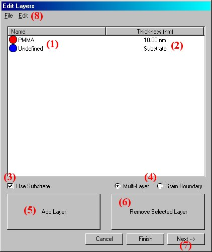
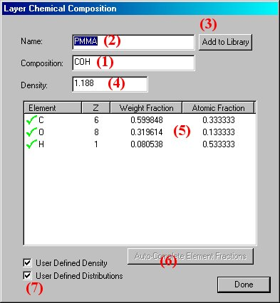
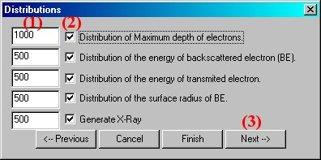
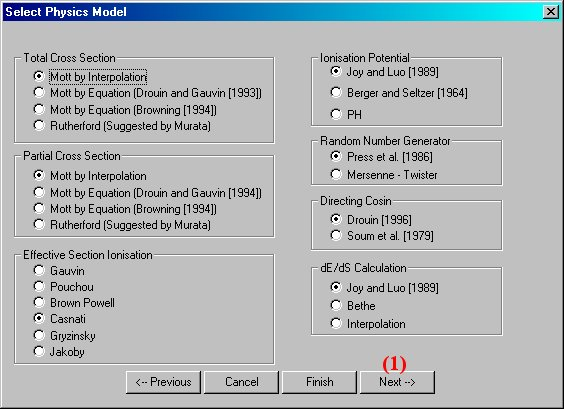

[Back to Index](../README.html)

# Introduction

## Quick explanation of the `generated` and `emitted` electrons

Nomenclature is important. This simulation, first suggested by
Paul Carpenter (Lehigh 2017) is reproduced in color from a
screenshot in the application...

## What is Casino?

Adapted from [here](https://www.gel.usherbrooke.ca/casino/tutorial/tutorial_frames.html) to
be able to get html and pdf output. Minor reformatting from the original and adding PDF output.

The CASINO acronym has been derived from the words 
"monte CArlo SImulation of electroN trajectory in sOlids". This program is a
Monte Carlo simulation of electron trajectory in solid specially designed for
low beam interaction in a bulk and thin foil. This complex single scattering
Monte Carlo program is specifically designed for low energy beam interaction
and can be used to generate many of the recorded signals (X-rays and backscattered
electrons) in a scanning electron microscope. This program can also be
efficiently used for all of the accelerated voltage found on a field emission
scanning electron microscope (0.1 to 30 KeV).

## What can CASINO do?

This program is designed to simulate a large amount of electron trajectories in a solid of your choice. The main idea is to simulate enough electron trajectories to represent the condition used to image structures in a scanning electron microscope (SEM). Thus it is possible to predict theoretically the signals observed in the SEM. This Monte Carlo program use different models to simulate the interaction of electrons with a solid. For now, the versions 2 of CASINO produce the following signals: backscattered coefficient and X-ray. It also handles those geometry : muti-layers samples and grain boundary.

## Why version 2

Version 1 of CASINO was starting to show some age with it's DOS based interface. A new Windows™ based interface has made CASINO much easier to use.

## Who wrote CASINO?

Version 1:

The Monte Carlo program CASINO has been programmed by the research team of Raynald Gauvin (Ph.D., Full professor at Université de Sherbrooke, Québec, Canada). The program has been initially programed by Pierre Hovongton, Ph.D. and Dominique Drouin, Ph.D. in 1996 and it has been updated by Paula Horny, M.Sc.A. student and by Hendrix Demers, undergraduate student in 1999. All this work have been performed under the suppervision of Professor Raynald Gauvin.

# Creating a Simulation

## Step 1: Creating the Simulation

To create a new simulation select File/New from the menu or click of the  icon.

The `NEW SIMULATION WIZARD` will appear on the screen.

## Step 2: Creating Layers

The first dialog box will be the EDIT LAYERS DIALOG. In this dialog you will create the layers of your sample.

To add a layer, you simply press the `ADD LAYER BUTTON` (5).

If you add too many layers, you can remove them by selecting them and
pressing the `REMOVE SELECTED LAYER BUTTON` (6) or by pressing `DEL` on the keyboard.

The `NAME` and `CHEMICAL COMPOSITION` of each layer can be defined by double-clicking
the names of the layers (1). This will bring up the `LAYER CHEMICAL COMPOSITION DIALOG`
which is described in `Step 3`.

If you wish to define the last layer as a substrate, make sure the
`USE SUBSTRATE CHECKBOX` (3) is checked.

If your sample is multiple horizontal layers, select `MULTI-LAYER` (4),
else if you sample is composed of vertical layers select `GRAIN BOUNDARY` (4).

To change the thickness of the layers simply click on the `current thickness` (2)
and type in the new thickness.

You can copy and paste layers by selecting them and using the `EDIT` menu (8).

When your sample is completed you can press `Next -->` (7) to move on to the next
dialog `MICROSCOPE AND SIMULATION PROPERTIES` which is explained in Step 4.

## Step 3: Editing Layers

This dialog box will let you give a name and a chemical composition to a layer.

Start by entering the chemical composition in the `COMPOSITION EDIT BOX` (1).

The elements must be written in Uppercase for the first letter and lowercase for the other,
example (Fe2O3). `Then give the layer a name` (2), if no name is given, the composition
will be chosen as the name.

The `density` (4) will **automatically be calculated** from the atomic weight and fractions,
this calculation does not take into account the structure of the material and you may want
to **change the density to it's actual value*.

If you wish to `change` the atomic fractions or weight fractions manually then simply click (5)
on the value you wish to change. To auto-complete an element as the remainder of the
composition simply press the `AUTO-COMPLETE ELEMENT FRACTIONS BUTTON` (6) after selecting the
element.

To save a composition for future use, give it a name and press `ADD TO LIBRARY BUTTON` (3).
This will store the information so that next time you enter a name for a layer
and it exists in the library it will set the layer to the saved layer.

To reset values to their automatically calculated states, just `un-check` the
boxes `USER DEFINED DENSITY AND DISTRIBUTION` (7).

`Repeat Step 3 for each layer` and then move on to Step 4.

## Step 4: Setting up the Microscope and Simulation

This dialog lets you select the parameters of your simulation.

First, enter the `energy` used for your simulation (1).

The first box is where you set your `starting energy`,
the second is the `energy where you want to stop the simulation` and
the third box contains the `step in KeV` between each simulation.

If the ending energy is smaller or equal to the starting, then the step
will be ignored and only one simulation at the starting energy will be done.

Second, enter the `number of electrons` you want to simulate (2).
The bigger the number, the better the results but the longer the simulation.

Third is the `beam parameters` (3), the first box represents the `angle the electrons`
will be fired into the sample and the `second box` contains the `width of the beam`.

Fourth, define the `angle of your X-Ray detector` (4) with the positive X-axis
of the sample being 0 and moving counterclockwise towards the
negative X-axis being 180.

Finally, set the `limits of your sca`n (5). The sample is centered at `0 nm`.
The step is in `nanometers`. If you do not wish to scan your sample, `uncheck` the box
`SCAN BEAM TO CREATE AN IMAGE`. The `FROM box` then contains the
`position of the beam on the sample`.

At this point you can already press `FINISH` (7) and move on to Step 8,
but you can `continue through` the rest of the options by pressing `NEXT-->` (6)
and moving on to Step 5.

## Step 5: Selecting Distributions

Here is where you set up your distribution.

Check the box for each distribution you wish to see after calculations (2).
Enter the number of points you want each distribution to have (1).

Move on to the next step (3).

## Step 6: Choosing Physical Models

Unless you know which model does what, skip to the next step (1).

## Step 7: Options

(1): Conserving the trajectories takes up a lot of memory. Conserving `NONE` will
not save any trajectories to memory which means that there is no way to view the
trajectories after they have been calculated.

`DISPLAYED ONLY` will only keep the trajectories that have been displayed on the screen,
this option is good if you want to see the trajectories and change some of their
viewing parameters and ALL is used if you want to keep all the trajectories in
memory, display a selected few during calculation but after calculations it will 
display all of them.

(2): Number of electron trajectories to display on the screen during calculations.

(3): Minimal time between backups which are used to continue simulation in case of
accidental termination of the simulation.

(4): The minimal energy, in KeV, at which a trajectory is terminated.

(5): If checked the trajectories will be displayed at regular intervals during
the simulation, otherwise the first trajectories are displayed.

(6): Press FINISH when your simulation is ready to be calculated on go to Step 8.

## Step 8: The End

After pressing `FINISH` you will be asked if you want to begin the simulation,
press `YES` if you wish to otherwise press NO.

[Back to Index](../README.html)

